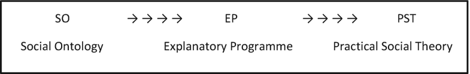
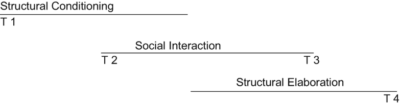
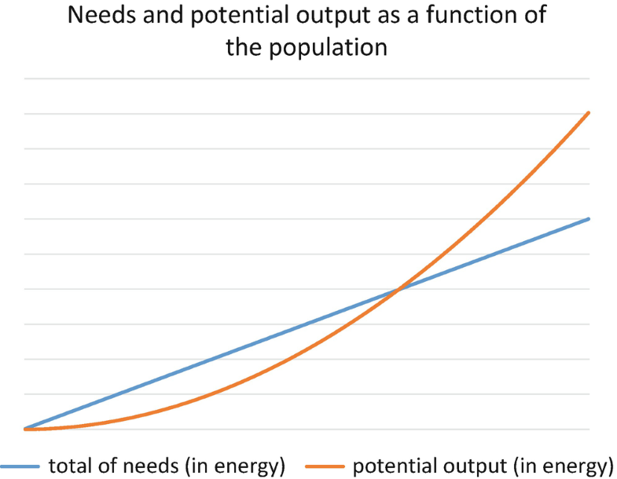
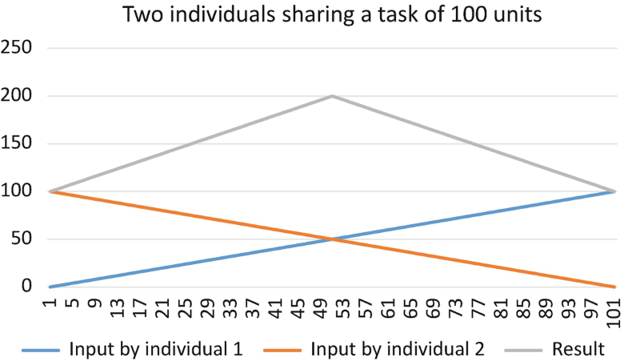
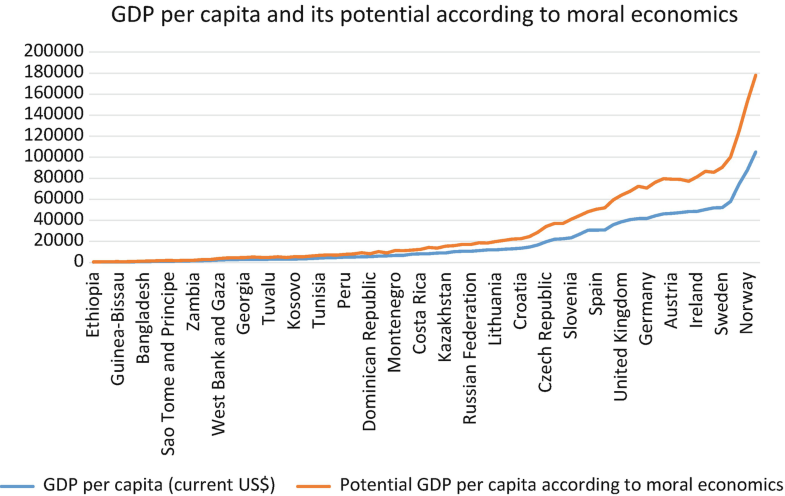
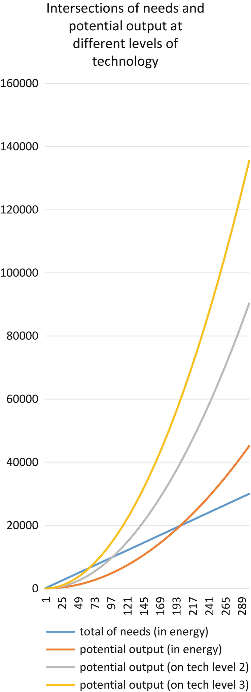

# Prefacio {-}

```{r, echo = F}
options(knitr.duplicate.label = "allow")
```

```{r, child="_setup.Rmd"}
```

```{r, eval=my_output == "html", echo=FALSE, results='asis'}
cat('<hr style="background-color:#03193b;height:2px">')
```

<center></center>

```{r, eval=my_output == "html", echo=FALSE, results='asis'}
cat('<hr style="background-color:#03193b;height:2px">')
```

<center></center>
<br><center></center>
<br><center><a href="https://www.jeshuanomics.com/" target="blank">Publicado por Jeshua Romero Guadarrama en colaboración con JeshuaNomics:</a></center>
<br><center><a href="https://github.com/JeshuaNomics" class="fa fa-github"><span class="label">  Git Hub</span></a>
<a href="https://www.facebook.com/JeshuaNomics/" class="fa fa-facebook"><span class="label">  Facebook</span></a>
<a href="https://twitter.com/JeshuaNomics" class="fa fa-twitter"><span class="label">  Twitter</span></a>
<a href="https://www.linkedin.com/in/jeshua-romero-guadarrama/" class="fa fa-linkedin"><span class="label">  Linkedin</span></a>
<a href="https://vk.com/jeshuanomics" class="fa fa-vk"><span class="label">  Vkontakte</span></a>
<a href="https://jeshuanomics.tumblr.com/" class="fa fa-tumblr"><span class="label">  Tumblr</span></a>
<a href="https://www.youtube.com/channel/UCY7f84mJGvMN7TF7XI4-Jgg?view_as=subscriber/" class="fa fa-youtube-play"><span class="label">  YouTube</span></a>
<a href="https://www.instagram.com/JeshuaNomics/" class="fa fa-instagram"><span class="label">  Instagram</span></a></center>

<br> Jeshua Romero Guadarrama es economista y actuario por la <a href="http://www.economia.unam.mx/">Universidad Nacional Autónoma de México</a>, quien ha construido el presente proyecto en colaboración con <a href="https://www.jeshuanomics.com">JeshuaNomics</a>, ubicado en la Ciudad de México, se puede contactar mediante el siguiente correo electrónico: jeshuanomics@gmail.com.
<br>
<br> `r sf <- lubridate::stamp_date('Última actualización el martes 21 del 05 de 2021'); sf(Sys.Date())`
<br>

```{r, eval=knitr::opts_knit$get("rmarkdown.pandoc.to") == "html", results='asis', echo=FALSE}
cat('<hr style="background-color:#03193b;height:2px">')
```

Proporciona una exploración de las consecuencias de las diferencias ontológicas entre objetos naturales y sociales.

Examina las teorías históricamente ofrecidas con respecto a la causalidad social y la agencia y propone y defiende algunas alternativas

Estipula las diferencias fundamentales de causalidad en la naturaleza en comparación con la vida social, con especial atención a la economía.

Examina la naturaleza de la causalidad y la agencia en la vida social.


Examina el problema de la adecuación descriptiva en la teoría económica, incluidos los límites de simplificación de la realidad requeridos por el modelado

Plantea preguntas sobre cómo las teorías de la economía deben proporcionar espacio para consideraciones morales

Hace las preguntas importantes sobre el papel de la teoría económica


Los estudiantes con poca experiencia en el análisis avanzado de políticas a menudo tienen dificultades para entender los beneficios de desarrollar habilidades de programación estadística en **R** al momento de aplicar diversos métodos descriptivos e inferenciales. <i>Análisis político con R</i> por Jeshua Romero Guadarrama (2021), ofrece una introducción interactiva a los aspectos esenciales de la programación por medio del lenguaje y software estadístico **R**, así como una guía para la aplicación de la teoría política y análisis detallado de políticas públicas en entornos específicos. En otras palabras, el objetivo es que los estudiantes se adentren al mundo de la política aplicada mediante ejemplos empíricos presentados en la vida diaria y haciendo uso de las habilidades de programación recién adquiridas. Dicho objetivo se encuentra respaldado por ejercicios de programación interactivos y la incorporación de visualizaciones dinámicas de conceptos fundamentales mediante la flexibilidad de JavaScript, a través de la biblioteca D3.js.

En los últimos años, el lenguaje de programación estadística **R** se ha convertido en una parte integral del plan de estudios de las clases de análisis político y estadística que se imparten en las universidades. Regularmente una gran parte de los estudiantes no han estado expuestos a ningún lenguaje de programación antes y, por lo tanto, tienen dificultades para participar en el aprendizaje de **R** por sí mismos. Con poca experiencia en el análisis avanzado de estadísticas, es natural que los novicios tengan dificultades para comprender los beneficios de desarrollar habilidades en **R** para aprender y aplicar la estadística. Estos incluyen particularmente la capacidad de realizar, documentar y comunicar estudios empíricos y tener las facilidades para programar estudios de simulación, lo cual es útil para, por ejemplo, comprender y validar teoremas que generalmente no se asimilan o entienden fácilmente con el estudio de las fórmulas. Al ser un economista aplicado y analista político, me gustaría que mis colegas desarrollen capacidades de gran valor; en consecuencia, deseo compartir con las nuevas generaciones de politólogos y economistas mis conocimientos.

En lugar de confrontar a los estudiantes con ejercicios de codificación puros y literatura clásica complementaria, he pensado que sería mejor proporcionar material de aprendizaje interactivo que combine el código en **R** con el contenido del curso de texto *Introducción a la Econometría* de @stock2015 que sirve de base para el presente material. El presente trabajo es un complemento empírico interactivo al estilo de un informe de investigación reproducible que permite a los estudiantes no solo aprender cómo los resultados de los estudios de casos se pueden replicar con **R**, sino que también fortalece su capacidad para utilizar las habilidades recién adquiridas en otras aplicaciones empíricas.

#### Las convenciones usadas en el presente curso {-}

+ El texto *en cursiva* indica nuevos términos, nombres, botones y similares.

+ El texto **en negrita** se usa generalmente en párrafos para referirse al código **R**. Esto incluye comandos, variables, funciones, tipos de datos, bases de datos y nombres de archivos.

+ <code>Texto de ancho constante sobre fondo gris</code> indica un código **R** que usted puede escribir literalmente. Puede aparecer en párrafos para una mejor distinción entre declaraciones de código ejecutables y no ejecutables, pero se encontrará principalmente en forma de grandes bloques de código **R**. Estos bloques se denominan fragmentos de código.

#### Reconocimiento {-}

A mi alma máter: Universidad Nacional Autónoma de México (Facultad de Economía y Facultad de Ciencias). Por brindarme valiosas oportunidades que coadyuvaron a mi formación.

```{r, eval=knitr::opts_knit$get("rmarkdown.pandoc.to") == "html", results='asis', echo=FALSE}
cat('<br>


Esta obra está autorizado bajo la [Creative Commons Attribution-NonCommercial-ShareAlike 4.0 International License](http://creativecommons.org/licenses/by-nc-sa/4.0/).')
```


<!--chapter:end:index.Rmd-->

# (PART) Parte I: Teoría {-}
# Libre albedrío y argumentos empíricos a favor del epifenomenalismo {#Capitulo_01}

```{r, eval=knitr::opts_knit$get("rmarkdown.pandoc.to") == "html", results='asis', echo=FALSE}
cat('<hr style="background-color:#03193b;height:2px">')
```

Si bien los filósofos se han preocupado por la causalidad mental durante siglos, las preocupaciones sobre la relevancia causal de los fenómenos conscientes también aparecen cada vez más en la literatura neurocientífica. Los neurocientíficos han considerado interesante la amenaza del epifenomenalismo principalmente porque han supuesto que implica escepticismo del libre albedrío. Sin embargo, los pasos que nos llevan de una premisa sobre la irrelevancia causal de los fenómenos conscientes a una conclusión sobre el libre albedrío no están del todo claros. De hecho, si examinamos las explicaciones filosóficas populares del libre albedrío, encontramos, en su mayor parte, nada que sugiera que el libre albedrío sea inconsistente con la presencia de precursores neuronales inconscientes de las elecciones. Solo si adoptamos supuestos altamente no naturalistas sobre la mente (por ejemplo, si adoptamos el dualismo cartesiano y ubicamos la libre elección en el ámbito no físico) parece plausible suponer que los datos neurocientíficos generan una amenaza para el libre albedrío.

## Introducción {-}

En filosofía, mientras que las preocupaciones sobre la causalidad mental se remontan a siglos atrás, la cuestión de si el epifenomenalismo socava el libre albedrío es sorprendentemente poco explorada. En la literatura contemporánea, las preocupaciones sobre la causalidad mental tienden a derivar de la preocupación de que, si existe una explicación física adecuada para cada evento, esto hace que lo mental sea causalmente superfluo (Malcolm1968, Kim 1989, 1993, 1998, 2005; O'Connor y Churchill2010). Los filósofos se han preguntado sobre las implicaciones de este problema para la viabilidad de las teorías de la mente no reduccionistas, emergentistas o dualistas, pero ha habido poca conexión entre esta disputa y el problema tradicional del libre albedrío.

Por el contrario, en las neurociencias, los investigadores suponen típicamente que cualquier amenaza a la eficacia causal de la mente consciente es también una amenaza al libre albedrío. Las investigaciones que sugieren que nuestra conciencia de las opciones se produce demasiado tarde para influir en ellas causalmente (Libet et al.1979; Libetmil novecientos ochenta y dos, 1985; Soon et al.2008; Wegner2002, 2004) se ha considerado interesante principalmente porque tiene implicaciones drásticas para el libre albedrío.

Hay tres posibles explicaciones para esta curiosa disparidad:

1. El caso empírico del epifenomenalismo revela una clara amenaza epifenomenal; uno que tiene implicaciones más serias para la libertad que cualquier amenaza identificada por los argumentos filosóficos a favor del epifenomenalismo.

2. Los filósofos son ajenos a la amenaza que representa el epifenomenalismo para el libre albedrío.

3. Los investigadores empíricos se equivocan al suponer que la amenaza epifenomenalista que identifican realmente tiene serias implicaciones para el libre albedrío.

Argumentaré que la explicación (3) es correcta. No es obvio que los argumentos empíricos para epifenomenismo realmente no tienen graves consecuencias para la libertad y la responsabilidad moral.

## Las preocupaciones filosóficas {-}

Los rompecabezas sobre cómo la mente y el cuerpo interactúan causalmente se han discutido al menos desde la famosa correspondencia de Elisabeth de Bohemia con Descartes en 1643 (Atherton 1994, págs. 11-21). Tales acertijos llevaron a los teóricos, incluso cercanos a la época de Descartes, a buscar alternativas al interaccionismo cartesiano, como el ocasionalismo (por ejemplo, Malebranche1674, 1997), paralelismo (p. Ej., Leibniz 1695, 1989), y el monismo, ambos idealistas (por ejemplo, Berkeley 1710, 1982) y materialista (por ejemplo, Hobbes 1651, 1994; Cavendish1664, 2017). Y al menos desde Hodgson (1880) algunos filósofos han abrazado el epifenomenalismo.

Mientras que los filósofos contemporáneos han esperado predominantemente (al igual que Hobbes y Cavendish en la época de Descartes) que podamos dar sentido a la causalidad mental rechazando el dualismo a favor del fisicalismo, muchos han sido pesimistas sobre las perspectivas de reducir completamente lo mental a lo físico ( Putnam1967; Fodor1974; Bloque y Fodor1972; Pylyshyn1984). Y los argumentos de la "exclusión causal" pretenden mostrar que los fisicalistas no reduccionistas (no menos que los dualistas) pueden estar estancados con problemas de causalidad mental.

Como sostiene Kim, si la física es "causalmente completa", cada evento físico tiene una explicación causal suficiente que apela sólo a otros eventos físicos. Esto plantea un problema: si tenemos una explicación causal suficiente de un evento en términos físicos, esto parece hacer que los fenómenos mentales sean causalmente redundantes. A menos que estemos dispuestos (inverosímilmente) a postular una sobredeterminación constante, el reino mental resultará ser un epifenómeno (Kim1989, 1993, 1998).

Los fisicalistas no reduccionistas han supuesto que cada evento mental es realizado por un evento físico y, por lo tanto, los eventos mentales pueden ser causalmente efectivos debido a sus fundamentos físicos (por ejemplo, Davidson 1970). Pero incluso si esto hace que los eventos mentales sean causalmente efectivos, no los hace causalmente efectivos en cuanto a sus características mentales (Stoutland1980; Honderichmil novecientos ochenta y dos; Sosa1984).

Supongamos que el evento A es que Zina deja caer una estatua en un estanque con rencor y el evento B es que la estatua se hunde. El evento A tiene ciertas características, entre ellas su rencor. Pero esto parece irrelevante para cualquier explicación de por qué A causó B . El despecho con el que Zina dejó caer la estatua no es parte de la razón por la que se hundió. De manera similar, si los realizadores físicos de un evento explican suficientemente por qué el evento causó otro evento, el hecho de que estos eventos también realicen propiedades mentales parecerá irrelevante. Si bien los eventos mentales parecen realizarse mediante eventos físicos causalmente efectivos, estos eventos no parecen ser causalmente efectivos en virtud de sus cualidades mentales.

Estos temas se debaten acaloradamente y no se explorarán más a fondo. El epifenomenalismo sigue siendo una tesis filosófica muy controvertida.

## Las preocupaciones neurocientíficas {-}

Las preocupaciones sobre la irrelevancia de la mente consciente en la toma de decisiones surgieron con el famoso estudio de Libet, que pretende mostrar que las elecciones son iniciadas por eventos neuronales inconscientes antes de que los agentes se vuelvan conscientes de formar una intención de actuar (Libet et al. 1979; Libetmil novecientos ochenta y dos, 1985). Variaciones recientes de experimentos de estilo Libet (Soon et al.2008) proporcionan pruebas aún más contundentes de precursores neuronales inconscientes de las decisiones, y a menudo se supone que tal investigación suscita serias dudas sobre el libre albedrío (p. ej., Wegner 2002, 2004).

La supuesta amenaza surge de la sugerencia de que nuestro sentido de la voluntad consciente es un epifenómeno. Sin embargo, existen algunos problemas graves para llegar a esta conclusión sobre la base de los datos. En primer lugar, los precursores neuronales no se correlacionan perfectamente con las decisiones que les siguen. El propio Libet especuló que los agentes tenían algún poder de veto consciente hasta el último momento, y que esto nos da razones para rechazar la conclusión epifenomenalista (Libet1985, 2003). Pero el razonamiento de Libet sobre este asunto ha recibido serias críticas (por ejemplo, Gallagher2006).

Los estudios también se han centrado en lograr que los participantes tomen una decisión arbitraria sobre cuándo presionar un botón o cuál de los dos botones presionar, sin que existan consideraciones importantes a favor de ninguna de las dos acciones. Esta situación experimental está bastante alejada de las decisiones de la vida real. Quizás podamos delegar este tipo de toma de decisiones a procesos inconscientes más fácilmente que decisiones con consecuencias reales, que pueden requerir un compromiso más consciente (Waller2012).

Waller sugirió que los estudios podrían rediseñarse para probar si las decisiones moralmente significativas se iniciarían de manera inconsciente de manera similar, pidiendo a los participantes que tomen decisiones con resultados significativos. Por ejemplo, juegos de azar con fondos que se destinarán a una causa benéfica. Desde entonces, esto ha sido probado experimentalmente (Maoz et al.próximo) y los resultados corroboran la afirmación de Waller de que en el caso de elecciones moralmente significativas puede haber un aporte consciente mayor que el que está presente en el caso de elecciones totalmente arbitrarias. Esto arroja dudas sobre cualquier inferencia de la configuración experimental tradicional a conclusiones sobre la naturaleza epifenoménica de la conciencia de manera más amplia.

Además, incluso en el caso de una elección arbitraria, no está claro si puede haber una actividad consciente causalmente relevante correlacionada con los precursores neuronales de la conciencia consciente de la elección. Si estos precursores neuronales se correlacionan con otra actividad consciente que típicamente precede a una elección - contemplar presionar el botón, deliberar sobre presionar el botón, etc. - no sería sorprendente que tales eventos tendieran a preceder las elecciones e influir en las posibilidades de que el agente tome una decisión. elección particular. Esto no demostraría obviamente que la mente consciente fuera irrelevante para las elecciones que se tomaron posteriormente (Nahmias2010; Baumeister y col.2011).

Sería prematuro concluir que la conciencia no tiene un papel causal que desempeñar en la iniciación de elecciones, dado el estado actual de la investigación. Aunque es posible que a medida que avanza dicha investigación, puedan surgir pruebas neurocientíficas más sólidas.

### ¿Qué es la “voluntad consciente”? {-}

Supongamos que nos tomamos en serio esta supuesta amenaza epifenoménica. Todavía hay cierta falta de claridad en cuanto a cómo los datos experimentales nos permiten llegar a la conclusión de que el libre albedrío es ilusorio.

En primer lugar, la noción de "voluntad consciente" es vaga. El lenguaje de la "voluntad consciente" oscurece un poco el hecho de que por lo general se entiende que la voluntad, al menos en el pensamiento contemporáneo, es una especie de estado mental y no una facultad especial que posee el agente. El término "conciencia" también necesita desambiguación. Cuando decimos que la "conciencia" o la "voluntad consciente" es un epifenómeno, ¿qué queremos decir con esto?

Existen numerosas formas diferentes en las que los estados mentales pueden considerarse "conscientes". Al menos tres categorías parecen directamente relevantes:

1. Conciencia fenomenal :
 
 Para los propósitos actuales, podemos agrupar cosas tales como estados cualitativos , estados fenoménicos , sensaciones crudas y estados de lo que es . Parece haber cualidades directamente sensibles a algunos de nuestros estados mentales, que proporcionan el carácter de nuestras experiencias subjetivas. Los ejemplos comunes incluyen sensaciones de emoción, color, sabor o dolor. Además de 'qualia' o 'sensaciones crudas', esta categoría puede incluir otras dimensiones de cómo es una experiencia para su sujeto. Son estos aspectos fenomenales de la conciencia los que a veces se piensa que son difíciles de captar en términos objetivos o físicos (1958, Nagel1974; Jacksonmil novecientos ochenta y dos, 1986, Cuadra 1990).

2. Acceder a la conciencia :

 Para los propósitos actuales, podemos agrupar la conciencia de acceso , la conciencia informativa y los estados mentales que están disponibles personalmente para la conciencia . Estas categorías implican ser conscientes de que estamos sujetos a un estado mental de tal manera que podemos informar que estamos en tal estado y ser capaces de tener en cuenta el estado en nuestros pensamientos y deliberaciones. No es obvio que, para tener este tipo de acceso a un estado, debe haber algún carácter particular a la experiencia, por lo que la conciencia de acceso se distingue típicamente de la conciencia fenoménica (Block1995).
 
3. Contenido intencional / representativo:

 La literatura filosófica, en contraste con la literatura neurocientífica, a menudo se centra en los contenidos intencionales o representativos de los estados mentales; de qué se tratan nuestras creencias y deseos . A veces se piensa que el epifenomenalismo hace que estos contenidos sean causalmente irrelevantes. Esto parece ortogonal a los problemas de conciencia entendidos en términos de acceso o fenomenales. Incluso los estados inconscientes pueden tener un contenido intencional. Y algunos filósofos sugieren que las características fenoménicas de la conciencia son completamente distintas de las intencionales (Peacocke1983; Cuadra1996).

La idea de "voluntad consciente" tiende a invocarse con frecuencia, pero mal definida. No es obvio qué tipo de conciencia se supone que (a) tiene que ser causalmente eficaz para que el libre albedrío sea posible y (b) los datos la convierten en un epifenómeno.

## Epifenomenalismo y libertad de voluntad {-}

Supongamos que tenemos motivos para tomarnos en serio las amenazas a la eficacia causal de la conciencia identificadas en la literatura neurocientífica. No resulta inmediatamente obvio cuáles son las implicaciones para el libre albedrío. Para evaluar estas implicaciones, necesitamos una idea de lo que implica el libre albedrío. Echemos un vistazo breve a algunas de las principales explicaciones del libre albedrío y al tipo de requisitos que normalmente se consideran precondiciones necesarias.

Como la disputa sobre el libre albedrío se ha centrado típicamente en el determinismo más que en el epifenomenalismo, las explicaciones tienden a dividirse en términos de su compatibilidad o incompatibilidad con el determinismo; la tesis de que el futuro está fijado por las leyes de la naturaleza y por cómo eran las cosas en el pasado.

Las condiciones de libertad compatibilistas populares incluyen la capacidad de actuar sobre la base de las elecciones de uno (Moore 1903; Ayer1954; Inteligente1961. 1966; Luis1981; Berofsky2002), la capacidad de responder a razones (Fischer y Ravizza 1998; Lobo1990), y la capacidad de tomar decisiones basadas en los valores más profundos de uno (Frankfurt 1971, Dworkin 1970; Watson1975).

Los incompatibilistas suelen respaldar condiciones similares como necesarias para el libre albedrío, pero niegan que sean suficientes. También tienden a requerir que los agentes sean capaces, en un sentido sólido, de elegir lo contrario (Kane2000, 2002, 2004; Moya2006, 2007, 2011; Ekstrom2003; Elzein2017; Franklin2018; Kittle2018) o que los agentes son, en cierto sentido, las "fuentes últimas" de sus propias elecciones (Stump 1999a, B, 2003; Pereboom2000, 2001, 2003; Zagzebski2000, 2010; Timpe2007, 2008; Shabo2010; Más ancho2006, 2009). Por lo general, se piensa que el cumplimiento de estas condiciones requiere la falsedad del determinismo.

Tenga en cuenta que el determinismo no está relacionado con el epifenomenalismo. La cuestión de si alguna explicación de la libertad es compatible con el determinismo no tiene ninguna implicación para la cuestión de si es compatible con el epifenomenalismo. Si bien es sorprendentemente común encontrar los dos problemas combinados (Nahmias (2010) cita varios casos de este error), las dos tesis no están relacionadas.

¿Cómo llegamos de la premisa de que ciertos rasgos conscientes son epifenómenos a una conclusión sobre el libre albedrío? Debe haber algo requerido para el libre albedrío que sería plausiblemente excluido por el supuesto estado epifenoménico de esas características conscientes. Por lo tanto, deberíamos mirar las descripciones del libre albedrío comúnmente defendidas para ver si alguna de ellas incluye requisitos que podrían ser plausiblemente imposibles de cumplir si estas características conscientes resultan ser un epifenómeno.

Sin embargo, existen algunas restricciones sobre qué tipo de requisitos serían realmente fructíferos aquí. Los defensores del argumento empírico harían bien en buscar requisitos que no solo sean plausiblemente necesarios para el libre albedrío, sino que también cumplan con los siguientes criterios:

1. El requisito debe ser plausiblemente incompatible con el epifenomenalismo.

2. Si bien el requisito debe ser una condición necesaria para la acción libre y responsable , no debe ser también un requisito previo para cualquier acción (incluso las que no son libres).

3. El requisito debe ser coherente con la tesis de que lo mental sobreviene a lo físico.

La razón de la primera condición es obvia. A menos que el epifenomenalismo también descarte algún requisito de libertad, no podremos utilizarlo junto con el epifenomenalismo como base a partir de la cual inferir el escepticismo del libre albedrío.

El segundo requisito puede parecer misterioso. Si se requiere algo para la acción, debe, a fortiori , ser requerido para la acción libre . Por lo tanto, si podemos proporcionar una condición necesaria de acción que sería descartada por el epifenomenalismo, ciertamente tenemos un buen caso para el escepticismo del libre albedrío. Esto es cierto, pero significa que es probable que el argumento demuestre demasiado. Si bien se piensa comúnmente que el escepticismo sobre el libre albedrío es una conclusión sorprendente pero no obstante potencialmente convincente, el escepticismo sobre la agencia es mucho menos plausible y es probable que se considere una implicación desagradable. Algunos pueden estar dispuestos a morder esta bala, pero para otros la implicación de que no hay agentes o acciones es más probable que se considere una reducción.de cualquier argumento que lo condujo. Por lo tanto, el argumento perderá mucha plausibilidad si solo puede llegar a una conclusión escéptica sobre el libre albedrío a través de una conclusión escéptica mucho más fuerte sobre la agencia.

El requisito final, que debe ser coherente con la afirmación de que lo mental sobreviene a lo físico, parece un requisito previo básico para que tengamos alguna razón para tomar en serio la literatura neurocientífica en primer lugar. Toda la idea de estudiar la mente a través de una investigación del cerebro sería errónea a menos que estuviéramos dispuestos a conceder esta tesis.

La pregunta es si alguna de las cuentas estándar de libre albedrío postula requisitos que cumplen con estos criterios. Si bien las categorías de "incompatibilista" y "compatibilista" son útiles en relación con la disputa sobre el determinismo, no son tan relevantes para la amenaza del epifenomenalismo. Para los propósitos presentes, dividiré las supuestas condiciones previas del libre albedrío en aquellas que también son condiciones previas para cualquier acción y aquellas que son condiciones previas específicamente para la acción libre . Estos últimos también se dividirán en requisitos naturalistas y no naturalistas.

### Condiciones de acción supuestas {-}

¿En qué condiciones el comportamiento cuenta como acción genuina? Como mínimo, debe ser intencional o estar dirigido a un objetivo. Pero eso no es suficiente; el comportamiento de una máquina simple podría estar dirigido a un objetivo. De manera plausible, debe estar dirigido conscientemente a un objetivo. El agente debe tener alguna intención al actuar y debe ser consciente de ello. Esto es lo que parece faltar en el caso de la acción automatizada, como el sonambulismo, que no suele clasificarse como agencia genuina. Si bien los sonámbulos parecen llevar a cabo sus intenciones, no son conscientes de lo que están haciendo.

Esto ciertamente incluye una falta de conciencia de acceso; no pueden informar o reflexionar más sobre lo que están haciendo. Puede ser plausible suponer que los agentes que sueñan disfrutan de una conciencia fenoménica; son, en cierto sentido, conscientes de las cualidades fenoménicas que se les presentan en sus sueños. Pero estos agentes ciertamente carecen de una conciencia fenomenal con respecto a lo que realmente están haciendo. Las intenciones con las que actúan están desconectadas del comportamiento que realmente está ocurriendo.

Parece plausible que los agentes necesiten acceder a la conciencia para contar como actuantes, y plausible, aunque más controvertido, que los agentes puedan necesitar una conciencia fenoménica para contar como actuantes (Shepherd2015a). Esto último dependerá de si un "zombi fenomenal" aún podría realizar acciones; una pregunta que no es fácil de responder (Smithies2012).

Pero una cosa es suponer que la agencia requiere conciencia y otra muy distinta suponer que requiere que nuestros estados mentales sean causalmente eficaces en virtud de sus cualidades conscientes, o que la conciencia consciente debe preceder temporalmente al inicio de las elecciones.

Considere el comportamiento automático; del tipo que se realiza en "piloto automático". A menudo, los agentes carecen de conciencia cuando realizan acciones muy ensayadas; pero normalmente se piensa que cuenta como una actuación de todos modos. Esto se debe a que son fácilmente capaces de adquirir conciencia. Si está conduciendo, es posible que no se dé cuenta de que indica que debe girar, pero si alguien le pide que se explique, puede fácilmente darse cuenta de lo que está haciendo. En este caso, no es obvio que la conciencia deba preceder al inicio de la conducta; más bien, el comportamiento y las intenciones que lo motivan deben ser fácilmente accesibles a la conciencia (Levy y Bayne2004; Exacción2011; Exacción2013, 2014a).

La razón por la que la conciencia de acceso parece importante es porque parece caracterizar el tipo de procesos mentales que pueden parecer especialmente relevantes para nuestro control sobre nuestro comportamiento. Tendemos a ser capaces de informar conscientemente los tipos de procesamiento que pertenecen directamente a nuestros objetivos deliberados y que podrían ser susceptibles de reflexión y escrutinio racionales. Por el contrario, gran parte de la actividad que se produce por debajo del nivel de conciencia está fuera de nuestro control directo , pero, no obstante, puede estar gobernada en general por estos objetivos de nivel superior.

Varios autores han tratado de dilucidar la importancia de los tipos de procesamiento que tienden a estar disponibles para la conciencia de esta manera. Pastor2015b) argumenta que los tipos de procesamiento que están típicamente disponibles para la introspección consciente son aquellos involucrados en "funciones ejecutivas". Los tipos de procesos que no están disponibles para la conciencia consciente son aquellos que ocurren a un nivel subpersonal y no son directamente accesibles a la reflexión consciente. Estos suelen estar subordinados al procesamiento ejecutivo. Por ejemplo, nuestra intención explícita de recoger algo dirige nuestros procesos motores. En relación con esto, Gallagher (2006) señala que se puede esperar que conozcamos directamente las características de nuestra situación y entorno, mientras que los procesos subpersonales siguen siendo en gran medida inaccesibles en ese nivel de cognición, a pesar de estar ampliamente dirigidos por procesos en ese nivel. Otros han notado que nuestras intenciones proximales, incluso si se forman de manera bastante automática, pueden estar dirigidas por intenciones distales que normalmente están disponibles para la conciencia consciente (Nahmias2010; Schlosser2013).

La acción genuina generalmente involucra procesos de los que somos conscientes, ya que estos tienen un papel "ejecutivo" o "director". Pero no hay ninguna razón obvia para suponer que la conciencia consciente misma deba estar causando. La conciencia consciente es un indicador de que los procesos en cuestión son del tipo que caracteriza la agencia genuina. Pero esto no implica que tales procesos deban ser causados por la conciencia. Y ciertamente no parece que el "sentimiento fenomenal" deba causar el comportamiento (Walter2014). Parece muy dudoso suponer que nuestras intenciones deben ser causalmente efectivas en virtud de la conciencia de acceso o de la conciencia fenoménica, incluso si deben estar disponibles para cualquier tipo de conciencia consciente.

Una sugerencia más plausible es que debemos actuar en virtud de los contenidos intencionales o representativos de nuestros estados mentales para que se consideren auténticos actos; que lo que deseo y creo debe ser causalmente relevante para mi comportamiento. Pero este no es el foco de ninguna de las publicaciones empíricas que apuntan a socavar el libre albedrío. Solo se aborda realmente en la literatura filosófica. Además, esta amenaza, si se toma en serio, es mucho más amplia que una simple amenaza a la posibilidad del libre albedrío. Potencialmente, implica que todo el reino mental está desprovisto de toda influencia. Pocos filósofos abrazan esta conclusión.

Incluso si la agencia es posible, sin embargo, la agencia libre podría no serlo. Los argumentos epifenómenos pueden amenazar nuestra capacidad de actuar libremente o ser considerados moralmente responsables. Consideremos las condiciones de libertad ampliamente naturalistas; aquellos que no postulan fenómenos fuera del alcance de la investigación científica.

### Condiciones de libertad supuestamente naturalistas {-}

#### Actuar sobre la base de elecciones {-}

Se supone universalmente que la responsabilidad moral requiere la capacidad de actuar de acuerdo con nuestras elecciones. Si un agente es encarcelado o paralizado, o si existen limitaciones e impedimentos que obstaculizan su capacidad para actuar como pretende, esto socavaría su libertad y su responsabilidad moral (Moore1903; Ayer1954; Inteligente1961; Luis1981; Berofsky2002).

Pero los argumentos epifenómenos no representan una amenaza para esta capacidad. Este requisito no dice nada sobre la forma en que se inician nuestras decisiones o sobre las características en virtud de las cuales cuentan como causalmente eficaces. Por lo general, se entiende simplemente en términos de dependencia contrafáctica; un agente cumple con este requisito si actúa como ha elegido y habría actuado de otra manera si hubiera optado por actuar de otra manera. Los estudios de estilo Libet pretenden socavar la relevancia causal de la conciencia consciente para las elecciones de los agentes; no pretenden socavar la relevancia causal de las elecciones de los agentes para sus acciones posteriores.

#### Razones de capacidad de respuesta {-}

A menudo se supone que nuestras decisiones tendrían que responder a razones para que podamos contar como moralmente responsables (Wolf 1990; Fischer y Ravizza1998). Schlosser (2013) y Levy (2011, 2013, 2014a, B) han argumentado que existe un vínculo crucial entre la conciencia y la capacidad de responder a las razones. Ambos suponen que es (ampliamente) la conciencia de acceso lo que se requiere para esta capacidad, en oposición a la conciencia fenoménica.

La razón por la que podríamos suponer que la conciencia de acceso es crucial para la capacidad de respuesta a las razones es que solo este tipo de procesamiento consciente parece estar gobernado por normas de coherencia de tal manera que se integra potencialmente en una perspectiva racional. Nuestro procesamiento inconsciente tiende a funcionar de manera asociativa y no a regirse por normas de coherencia (Levy2013, 2014a, B).

Esto nos da razones para suponer que solo podemos ser moralmente responsables de los procesos que son accesibles a la conciencia consciente. Pero no parece implicar que nuestras elecciones deban iniciarse conscientemente, o que deban ser causalmente eficaces en virtud de características conscientes.

La acción automática suele estar impulsada por el tipo de intención que se puede llevar fácilmente a nuestra conciencia consciente, incluso si a menudo no nos damos cuenta al iniciar la acción (Levy y Bayne 2004; Exacción2011). No parece haber ninguna razón para suponer que tal comportamiento sea inmune a la introspección y al escrutinio racional.

Además, el punto crucial para la respuesta a las razones no es que la conciencia consciente en sí misma deba estar haciendo el trabajo causal, sino que los tipos de procesos de los que somos conscientes son los que están gobernados por estándares de coherencia racional. Incluso si tales procesos fueran iniciados por eventos inconscientes, esto no evitaría que se rijan por estas normas, por lo que no les impedirá ser razonables.

#### Armonía con valores más profundos {-}

Plausiblemente, si nuestras elecciones han de contar como gratuitas, deben estar impulsadas por deseos que no nos importa que nos conmuevan (Dworkin 1970). Quizás deben armonizar con nuestras voliciones de segundo orden, es decir, debemos ser movidos por los deseos de primer orden por los que queremos ser movidos (Frankfurt1971). Quizás, en última instancia, necesitamos que nuestras elecciones estén en armonía con nuestros valores más profundos (Watson1975). Podría pensarse que nuestro sistema de valores más profundo, aquellos con los que nos identificamos racionalmente, constituyen el “yo real”.

Hay un fuerte argumento para suponer que solo los procesos conscientes armonizan típicamente con nuestros valores más profundos. Dado que una perspectiva moral debe integrarse en un sistema coherente, también debe regirse por normas de coherencia. Los procesos inconscientes no obedecen estas normas (Levy2011, 2013). Además, es bien sabido que los agentes a menudo procesan inconscientemente la información de formas que van directamente en contra de sus valores; en los casos de prejuicios inconscientes, los agentes suelen encontrar que su comportamiento refleja actitudes que repudian conscientemente; a menudo están dispuestos a deshacerse del prejuicio o tomar medidas para evitar que influya en su comportamiento (Levy2013; Exacción2014a, B).

Una vez más, se suele argumentar que aquí es relevante la conciencia de acceso en lugar de la conciencia fenoménica; los tipos de procesos que podemos informar y sujetos a escrutinio son los que podemos esperar armonizar con nuestros valores. Lo que importa es que dicho tratamiento se rige por normas de coherencia racional y puede estar sujeto a escrutinio sobre la base de valores. Esto es lo que le permite armonizar con nuestros valores. Esto no requiere la conciencia en sí misma para causar nuestras decisiones o preceder su iniciación.

#### Posibilidades alternativas {-}

A menudo se piensa que las posibilidades alternativas son importantes para la responsabilidad moral, aunque esto ha sido muy controvertido desde el famoso argumento de Frankfurt sobre su irrelevancia (Frankfurt 1969).

Los compatibilistas tradicionalmente entienden este requisito en términos de una dependencia contrafáctica entre las elecciones y acciones de un agente. Ya hemos señalado que esto no se ve afectado por el epifenomenalismo. Los incompatibilistas, sin embargo, tienden a tener una comprensión diferente de las posibilidades alternativas. Por lo general, requieren que los agentes puedan hacer lo contrario manteniendo constantes las leyes de la naturaleza. El determinismo parece excluir las alternativas así entendidas.

Como ya se señaló, el epifenomenalismo no implica determinismo. Quizás, sin embargo, los estudios al estilo de Libet también deberían entenderse como evidencia de la tesis de que nuestras elecciones están determinadas causalmente. Soon et al. (2008) pudieron predecir la elección de un agente entre cuál de los dos botones presionar (es decir, una decisión con un 50% de probabilidad de ir en cualquier dirección) con un 60% de precisión, mucho antes de que los propios agentes se dieran cuenta de que decidían. Pero esto no constituye una prueba convincente para el determinismo; no implica que se garantice un resultado único. Los defensores del indeterminismo suponen típicamente que la causalidad es probabilística en oposición a determinista. Esto es consistente con eventos anteriores que aumentan la probabilidad de eventos posteriores.

### Condiciones de libertad supuestas no naturalistas {-}

Las condiciones naturalistas de la libertad parecen no haber sido tocadas por los argumentos a favor del epifenomenalismo, pero no es tan obvio que ocurra lo mismo con las no naturalistas.

A veces, se piensa que la libertad requiere habilidades divinas; que el libre albedrío implica ser un "motor inmóvil", capaz de originar acciones independientemente de cualquier evento anterior. Hay dos características que pueden parecer condiciones previas para esto; una implica que la mente consciente es la fuente causal última de elecciones, y la otra implica inmunidad frente a la influencia causal previa.

#### Originación consciente {-}

Los incompatibilistas de fuentes suponen típicamente que el determinismo amenaza el libre albedrío porque amenaza el estatus del agente como la fuente última de sus propias elecciones y acciones. ¿Los argumentos epifenomenalistas desafían esto? Depende de cómo ubiquemos a los agentes. Si los procesos cerebrales inconscientes se consideran parte de los esfuerzos del agente, entonces no es obvio que el agente solo podría estar iniciando una acción si los fenómenos conscientes la están iniciando. Los procesos mentales de un agente podrían estar haciendo el trabajo causal incluso si la conciencia consciente misma no estuviera involucrada en el inicio de las elecciones.

Si la conciencia se entiende simplemente como una forma de acceder a nuestros estados mentales, entonces esto simplemente no parece el tipo de cosa que podría figurar inteligiblemente en una relación causal. No es obvio cómo la mera disponibilidad de estados para la conciencia consciente podría causar nuestras elecciones. Y con respecto a la conciencia fenoménica, nuevamente, parece extraño suponer que la cruda sensación de tomar una decisión podría causarla (Walter2014).

Si la conciencia va a figurar de manera inteligible como una causa independiente, parece que tendremos que entenderla como algo más que una forma en que los estados mentales se presentan a la conciencia. Más bien, necesitaríamos suponer que los estados conscientes son parte de una entidad independiente que podría ejercer su propia influencia.

Quizás se considere que la conciencia es el elemento crucial de un alma cartesiana. Si suponemos que la libertad requiere el alma a la acción influyen de forma independiente de los eventos neuronales, entonces tal vez podría tener sentido suponer que la conciencia fenomenológica podría ser parte de algo causalmente influyente en su propio derecho. Si esto es lo que requiere el libre albedrío, entonces el caso empírico del epifenomenalismo, al mostrar que la conciencia llega demasiado tarde al juego, estaría demostrando que el agente (presumiblemente, idéntico al alma cartesiana y no a ningún precursor neuronal) no podría ser la fuente última de sus elecciones.

#### Inmunidad frente a influencias previas {-}

Este requisito podría complementarse con otro; quizás lo que se requiere para la libertad no es simplemente que nuestras elecciones sean causadas por una entidad consciente independiente, sino también que estas elecciones sean inmunes a la influencia causal previa.

Algunos suponen que incompatibilistas elecciones libres deben ser no causada (Ginet2002, 2007, 2008, 2016; McCann1998, 2012; Goetz1988, 2008). Presumiblemente, esto descarta incluso la causalidad probabilística. ¿Implica esto que no puede haber correlación entre las elecciones de un agente y los eventos neuronales que preceden a esas elecciones? Esto no es obvio. Los no causalistas generalmente suponen que las elecciones de un agente deben ser racionalmente explicables, incluso si no son causalmente explicables. Pero supongamos que algún patrón de actividad neuronal se asocia típicamente con la evaluación positiva de un curso de acción potencial. Este patrón también estaría correlacionado con la presencia de una razón positiva para elegirlo. Desde el punto de vista no causal, la elección del agente también debe correlacionarse con la presencia de tales razones. Por lo tanto, esperaríamos que la elección y el patrón neuronal también estuvieran correlacionados entre sí.

Sólo si presuponemos una explicación explícitamente no naturalista del agente y sus procesos mentales (por ejemplo, suponemos que no hay correlaciones entre los procesos neurales y la contemplación de las razones por parte del agente) que una explicación no causal descarta cualquier correlación entre las probabilidades de que un agente tome una decisión particular y precursores neuronales.

Supongamos que consideramos al agente como esencialmente idéntico a un alma cartesiana, y suponemos que un agente sólo puede tener libre albedrío en la medida en que cualquier explicación racional de su comportamiento emana completamente del alma independientemente de cualquier proceso cerebral. Los estudios al estilo Libet ciertamente parecen arrojar algunas dudas sobre si los agentes pueden cumplir con este requisito.

## Epifenomenalismo y escepticismo del libre albedrío {-}

Recuerde, argumentó que, si queremos alcanzar el escepticismo del libre albedrío sobre la base de la evidencia del epifenomenalismo, necesitaríamos identificar algún requisito para el libre albedrío que también cumpla con los siguientes criterios:

1. El requisito debe ser plausiblemente incompatible con el epifenomenalismo.
 
2. Si bien el requisito debe ser una condición necesaria para la acción libre y responsable , no debe ser también un requisito previo para cualquier acción (incluso las que no son libres).

3. El requisito debe ser coherente con la tesis de que lo mental sobreviene a lo físico.

Examiné tres categorías de supuestos requisitos para la libertad: condiciones de agencia básica, condiciones naturalistas del libre albedrío y condiciones no naturalistas del libre albedrío.

Obviamente, ninguna de esas condiciones que supuestamente son prerrequisitos para cualquier acción podrá cumplir con la condición 2: un argumento a partir de esas condiciones no solo establecerá el escepticismo del libre albedrío, sino que también mostrará que no hay agencia de ningún tipo. . Esto ciertamente socavaría el libre albedrío, pero viene con la inverosímil implicación de que las acciones tampoco existen.

Además, descubrimos que los tipos de conciencia que podrían resultar potencialmente epifenómenos por los argumentos empíricos probablemente fueran irrelevantes para las condiciones de acción. Si bien tales argumentos pueden mostrar que la conciencia fenoménica ocurre después del inicio de una elección, no es obvio que esta cuestión de tiempo sea especialmente relevante para el papel de la conciencia de acceso, y los argumentos empíricos no nos dicen nada sobre el papel causal de intencional o contenido representativo.

Sólo si se demuestra que este último es un epifenómeno, es posible que tengamos una seria amenaza para la agencia; Si bien podría pensarse que los argumentos filosóficos convierten el contenido intencional en un epifenómeno, los argumentos empíricos no parecen abordarlo en absoluto. El requisito de que seamos capaces de actuar en virtud de contenidos intencionales, si es un requisito del libre albedrío, no cumple en ningún caso la condición 2, y en relación con los tipos de epifenomenalismo plausiblemente implicados por la investigación empírica, no tampoco cumpla la condición 1.

Pasemos a los requisitos naturalistas del libre albedrío.

La posibilidad de cumplir con los supuestos requisitos naturalistas para el libre albedrío, sugerí, no está amenazada por el epifenomenalismo, por lo que estos requisitos no cumplen con el criterio 1.

Si bien nuestras elecciones solo pueden cumplir los requisitos de ser razonables y estar en armonía con nuestros valores más profundos si esas decisiones implican un procesamiento del tipo del que normalmente somos conscientes, no hay razón para suponer que cualquier tipo de conciencia consciente deba causar o incluso preceden temporalmente a dicho tratamiento para que sean motivos de respuesta o para armonizar con nuestros valores. Y los estudios empíricos no influyen en absoluto sobre si nuestras elecciones están determinadas causalmente.

Finalmente, los supuestos requisitos de libertad no naturalistas no cumplen con el criterio 3. Si se entiende que cumplen genuinamente con el criterio 1 (es decir, que involucran un papel causal para la conciencia en sí misma y / o que carecen de cualquier correlación con eventos neuronales previos) , esto requeriría que identifiquemos a los agentes con algo no físico; por ejemplo, un alma fantasmal, que es un motor inmóvil y es la fuente última de elecciones y acciones. Esto es incompatible con la tesis de que lo mental sobreviene a lo físico.

Podría decirse que tales estudios deberían importarle a alguien con una visión interaccionista cartesiana clásica. Dado que la conciencia fenoménica, según este punto de vista, reside en una mente no física independiente, y esto influye causalmente en la actividad cerebral, tal vez la conciencia fenoménica deba preceder al inicio de las elecciones. Pero el interaccionismo cartesiano es poco popular hoy en día. Hay razones para rechazarlo con total independencia del caso empírico del epifenomenalismo; muchas de estas razones fueron identificadas inmediatamente después de su inicio en el siglo XVII.

Como se señaló anteriormente, esto llevó a otros teóricos históricos a favorecer el monismo (idealista y materialista) oa favor de análisis paralelos u ocasionalistas de la relación entre lo mental y lo físico. El problema es, no es obvio que los defensores de las alternativas a interaccionismo que apoyan las cuentas altamente no naturalistas de libre tendrán ninguna buena razón para suponer que la investigación neurocientífica nos dice nada en absoluto acerca de la mente. Estos puntos de vista colocan a la mente completamente fuera del alcance de la investigación científica.

Además, los filósofos contemporáneos respaldan abrumadoramente el fisicalismo. Son raros los que se toman en serio las condiciones de libertad no naturalistas. Aquellos que respaldan esas condiciones junto con el interaccionismo cartesiano son aún más raros (una especie en peligro de extinción, si no extinta).

Los estudios de estilo Libet no presentan evidencia para suponer que no podamos cumplir con las condiciones naturalistas de libertad. Y en cuanto a los no-naturalista, cualquiera que se tome en serio la investigación neurocientífica tenía abrumadora razón para que nadie suponga que pudiera satisfacer los independientemente de estos estudios. En contraste, aquellos que sostienen que cumplimos con condiciones no naturalistas, en su mayor parte, deben considerar tales cosas como fuera del alcance de la investigación neurocientífica.

## Conclusión {-}

El panorama de la disputa por el libre albedrío no se ve afectado en gran medida por el caso empírico del epifenomenalismo. Sorprendentemente, parece que los investigadores empíricos han sido propensos a presuponer una imagen de libertad, desde el principio, que sería completamente inconsistente con una especie de fisicalismo mínimo en el que se basa toda la empresa de la neurociencia. De alguna manera, todavía están obsesionados por el fantasma del interaccionismo cartesiano.

En la medida en que respaldamos una imagen ampliamente naturalista y fisicalista de la mente (una imagen que creo que tenemos una abrumadora buena razón para abrazar), no es obvio que los datos experimentales presenten un desafío serio para cumplir con las condiciones de libertad que podrían ser plausiblemente. se reunió de acuerdo con esa imagen de todos modos. Por el contrario, para cualquiera que rechace explícitamente esa imagen, los datos empíricos se considerarán de dudosa relevancia desde el principio.

Creo que hay razones de peso sobre las cuales abrazar el escepticismo del libre albedrío. Pero estas razones tienen poco que ver con la presencia de precursores inconscientes de las decisiones que tomamos.

<!--chapter:end:Capitulo_01.Rmd-->

# Causalidad, agencia y cambio {#Capitulo_02}

```{r, eval=knitr::opts_knit$get("rmarkdown.pandoc.to") == "html", results='asis', echo=FALSE}
cat('<hr style="background-color:#03193b;height:2px">')
```

Los economistas de la corriente principal reconocen intermitentemente un dilema en el centro de su proyecto. En ocasiones, señalan que la intuición ampliamente aceptada de que las personas tienen opciones y capacidad de acción reales es incompatible con su objetivo de aumentar el poder explicativo de la teoría económica. Les preocupa que a medida que se amplían las explicaciones causales de los fenómenos económicos, más agencia y elección deben reconocerse como ilusorias en última instancia. El dilema, una vez reconocido, generalmente se deja de lado y las prácticas de modelado convencionales de la economía dominante persistieron sin más demora. En este artículo se argumenta que el supuesto dilema señalado es falso y surge principalmente porque los métodos formalistas (y las nociones de explicación que se adaptan a ellos) tienden a ser adoptados en economía antes, y sin que se les preste suficiente atención, a los tipos de objetos que constituyen el tema de la investigación social. Se argumenta que los métodos y formas de explicación que los economistas convencionales reconocen como legítimos presuponen una ontología que es incapaz de acomodar la agencia dentro de la naturaleza o reconocer las posibilidades de un cambio genuino. En la parte constructiva del documento, se adopta una estrategia para examinar el dilema que los economistas de la corriente principal señalan que coloca a la ontología al frente y en el centro del escenario. Se argumenta que una ontología de poderes, capacidades, tendencias, disposiciones y potenciales activos reales respalda una concepción completamente naturalista de la agencia y el cambio genuino que puede servir para informar las decisiones que toman los economistas sobre la mejor manera de llevar a cabo proyectos explicativos sin generar tensión o incoherencia. Se argumenta que los métodos y formas de explicación que los economistas convencionales reconocen como legítimos presuponen una ontología que es incapaz de acomodar la agencia dentro de la naturaleza o reconocer las posibilidades de un cambio genuino. En la parte constructiva del documento, se adopta una estrategia para examinar el dilema que los economistas de la corriente principal señalan que coloca a la ontología al frente y en el centro del escenario. Se argumenta que una ontología de poderes, capacidades, tendencias, disposiciones y potenciales activos reales respalda una concepción completamente naturalista de la agencia y el cambio genuino que puede servir para informar las decisiones que toman los economistas sobre la mejor manera de llevar a cabo proyectos explicativos sin generar tensión o incoherencia. Se argumenta que los métodos y formas de explicación que los economistas convencionales reconocen como legítimos presuponen una ontología que es incapaz de acomodar la agencia dentro de la naturaleza o reconocer las posibilidades de un cambio genuino. En la parte constructiva del documento, se adopta una estrategia para examinar el dilema que los economistas de la corriente principal señalan que coloca a la ontología al frente y en el centro del escenario. Se argumenta que una ontología de poderes, capacidades, tendencias, disposiciones y potenciales activos reales respalda una concepción completamente naturalista de la agencia y el cambio genuino que puede servir para informar las decisiones que toman los economistas sobre la mejor manera de llevar a cabo proyectos explicativos sin generar tensión o incoherencia.

## Introducción {-} 

Los economistas de la corriente principal plantean periódicamente lo que consideran un dilema. Señalan que la agencia humana intencional, incluida la capacidad de elección, aspectos del comportamiento humano que a su vez desean reconocer y promover, parecen estar amenazados o fundamentalmente socavados, cuanto más exitosa se vuelve la explicación económica. Por ejemplo, Melvin Reder insiste en que los economistas deben enfrentar un dilema entre la elección y el éxito de sus proyectos explicativos:
 
> Asociado con el supuesto de preferencias estables, pero lógicamente distintas, está el "impulso de la endogeneización". Una manifestación destacada de esta tendencia es el intento de Stigler de explicar - y restringir - el comportamiento de los tomadores de decisiones políticas, pero este no es el único ... Para endogeneizar con éxito una nueva variable es mejorar el poder explicativo de la economía, y hay mucho interés en tales logros. Sin embargo, debe tenerse en cuenta que cuando las variables se hacen "endógenas", ya no pueden servir como objetos de elección social. En la medida en que las variables se endogenizan ... se explica la elección ... la libertad de elección de la "sociedad" se ve como ilusoria. La libertad parece consistir no en el poder de elección, sino (ritmo Hegel) en el reconocimiento de la necesidad. Esta no es una conclusión probable para los seguidores de Adam Smith, y seguramente no es una que ellos deseen,mil novecientos ochenta y dos: 34–35).

Desde una perspectiva de la corriente principal, cualquier progreso en la formulación de explicaciones económicas aceptables iría, aparentemente inevitablemente, acompañado de personas cada vez más reveladas como simplemente impulsadas por eventos y condiciones externas y expuestas como carentes de agencia y elección. Además, dado el modelo adoptado por la economía dominante para seleccionar formas apropiadas de explicación, la única noción de cambio que se puede salvar es la de un grave empobrecimiento. La vida social se reduce a un flujo de eventos, mientras que el cambio se relaciona simplemente con alteraciones en el patrón de eventos.

En este artículo, este aparente dilema de solo ser capaz de reconocer la agencia real, la elección y el cambio genuino renunciando a la explicación se considera desde una perspectiva explícitamente ontológica. El argumento esgrimido es que el dilema señalado surge principalmente porque las nociones de explicación en economía tienden a adoptarse antes, y sin prestar suficiente atención, a los tipos de objetos que constituyen el tema de la investigación social. Se argumenta que las formas de explicación que los economistas convencionales reconocen como legítimas presuponen una ontología que es incapaz de acomodar la agencia dentro de la naturaleza o reconocer las posibilidades de un cambio social genuino.

En la parte constructiva del artículo se adopta una estrategia para examinar el dilema que los economistas dominantes señalan (solo para luego ignorar) que coloca a la ontología al frente y en el centro del escenario. Se argumenta que una ontología estructurada de poderes, capacidades, tendencias, disposiciones y potenciales activos reales apoya una concepción completamente naturalista de la agencia que puede guiar las elecciones que hacen los economistas sobre la mejor manera de llevar a cabo proyectos explicativos^[El tipo de ontología estructurada a la que se hace referencia aquí está asociado con el trabajo del Cambridge Social Ontology Group, (ver Lawson 1997, 2003, 2013, Pratten (2015) y Faulkner et al. 2017) que a su vez está estrechamente alineado con el trabajo de realistas críticos como Archer et al. (1998), Bhaskar (1978, 1979) y Collier (1994, 2011).]. Una vez que se esboza esta posición ontológica alternativa y se defiende su adecuación, queda claro que los economistas no enfrentan ningún dilema necesario entre el progreso explicativo y el reconocimiento de la acción y la elección humanas. Se argumenta además que esta ontología puede informar de manera productiva iniciativas destinadas a lograr una transformación social racional e intencional.

## Economía convencional, negligencia ontológica y negación de agencia {-}

Dado el lugar central que ocupa la elección en las explicaciones convencionales de la contribución que hace la economía, ¿por qué los economistas convencionales a menudo terminan planteando un dilema entre el progreso explicativo, por un lado, y la agencia y la elección, por el otro? Para comprender por qué los economistas de la corriente principal se toparon con este dilema, es necesario aclarar los presupuestos metafísicos u ontológicos que sustentan su insistencia en que sólo ciertos métodos y formas de explicación son legítimos dentro de una economía adecuadamente científica.

Para que las prácticas de investigación cuenten como economía propiamente dicha, los economistas de la corriente principal insisten en que es necesario adoptar métodos de modelado formalistas (y formas de explicación que puedan adaptarse a tales métodos). Esta estipulación se hace sin que se proporcione ninguna evaluación de la capacidad de tales métodos para iluminar el dominio social. Para que cualquier método pueda iluminar un dominio de la realidad, la naturaleza de los fenómenos de ese dominio debe ser de un tipo que lo haga factible. Los problemas de la corriente principal de la economía moderna, incluido el planteamiento de un dilema entre el progreso explicativo y la agencia y la elección, se derivan de la falta de reconocimiento de esta idea y, en términos más generales, de un profundo descuido de las cuestiones ontológicas^[Lawson (1997, 2003, 2015b).].

Los economistas de la corriente principal comienzan con un tipo particular de método y presumen erróneamente que debe ser apropiado para todos los contextos sociales. El resultado es que, en sus concepciones, los economistas de la corriente principal terminan distorsionando los fenómenos sociales para abrirlos al tratamiento con el método elegido. A veces, la distorsión es tal que los resultados y las implicaciones de los ejercicios de modelización chocan con las intuiciones no elaboradas que los propios economistas de la corriente principal tienen acerca de las características básicas del dominio social y esta tensión se manifiesta luego en la postulación de dilemas o acertijos que se pueden enunciar, pero no resuelto ni trascendido.

Los procedimientos de modelado formalista característicos de la economía dominante suelen implicar una dependencia de las relaciones funcionales. Cuando los economistas de la corriente principal abordan fenómenos como el consumo, la inversión, la producción o el bienestar humano, característicamente buscan formular funciones de consumo, inversión, producción y utilidad. Es este énfasis en el modelado formalista y las relaciones funcionales lo que es inapropiado para el análisis de la mayoría de los fenómenos sociales y deja a los economistas incapaces de acomodar la agencia, la elección y el cambio genuino.

Si un enfoque de la economía que utiliza funciones matemáticas ha de ser viable y proporcionar una visión real, entonces se puede demostrar que se debe suponer que los eventos sociales se relacionan entre sí de formas estables muy específicas. Para que la dependencia de las funciones sea una forma adecuada de proceder en la economía, las regularidades de los eventos o las correlaciones de eventos deben ser un lugar común en el ámbito social. Puede verse que la insistencia a priori en los métodos matemáticos formales conlleva una serie de compromisos ontológicos engañosos y en gran parte no reconocidos. Específicamente, las presuposiciones implícitas en los métodos formales, entendidos como esenciales por los economistas de la corriente principal, incluyen que las unidades ontológicas básicas son eventos, o estados de cosas, que la causalidad debe analizarse en términos de las conexiones necesarias entre los eventos y que todos los eventos, incluidas las acciones. son causadas estrictamente determinísticamente por otras anteriores de acuerdo con leyes de una manera esencialmente pasiva.

Antes de continuar, vale la pena considerar más a fondo las concepciones de elección / agencia, causalidad y cambio social implícitas en la insistencia de la corriente principal en la aplicación universal de los métodos de modelado formalistas.

Los modelos de los economistas de la corriente principal son, por supuesto, esencialmente deterministas en el sentido específico de que efectivamente se niega la acción y la elección humanas. En una función de consumo estándar, por ejemplo, el gasto de los consumidores se describe como una función estable de la renta disponible, si, entre otras cosas, de modo que un cierto cambio en la renta o en su tasa de cambio, desencadena un ajuste en el consumo en una cantidad que es fijo incluso antes de que los consumidores reales se enteren de dicho cambio y de lo que pueda haberlo provocado. Aquí está lejos de ser obvio cómo se puede interpretar al "agente" como si estuviera activamente involucrado en sus propias acciones. El agente en tal cuenta aparece simplemente como un sitio de ajuste automático en lugar de un sujeto capaz de provocar cambios activamente.

Entre los economistas heterodoxos se ha reconocido desde hace mucho tiempo que el tratamiento convencional es hostil a la agencia y la elección. Veblen, en un famoso pasaje que conserva gran parte de su relevancia hoy, escribe:

> La concepción hedonista del hombre es la de un relámpago calculador de placeres y dolores, que oscila como un glóbulo homogéneo de deseo de felicidad bajo el impulso de estímulos que lo desplazan por la zona, pero lo dejan intacto. No tiene antecedente ni consecuente. Es un dato humano aislado, definitivo, en equilibrio estable excepto por los golpes de las fuerzas incidentes que lo desplazan en una u otra dirección. Autoimpuesto en el espacio elemental, gira simétricamente alrededor de su propio eje espiritual hasta que el paralelogramo de fuerzas se posa sobre él, donde sigue la línea de la resultante. Cuando se agota la fuerza del impacto, se detiene, un glóbulo autónomo de deseo como antes. Espiritualmente, el hombre hedonista no es un motor principal. No es el asiento de un proceso de vivir,1919: 73).

Shackle sostiene que, dado el marco que despliegan, los economistas de la corriente principal (o convencionales) deberían abandonar por completo cualquier referencia a la elección:

> La economía convencional no se trata de elección, sino de actuar según la necesidad. El hombre económico obedece a los dictados de la razón, sigue la lógica de la elección. Llamar a esta conducta elección es seguramente un mal uso de las palabras, cuando suponemos que para él se dan los fines entre los que puede seleccionar, los criterios de selección y los medios para cada fin. La teoría que describe la conducta bajo estos supuestos es una teoría de la estructura, no de la creación de la historia. La elección en tal teoría es vacía, y la economía convencional debería abandonar la palabra (Shackle1961: 272-3).

## Causalidad humeana y conceptos de cambio centrados en eventos {-}

En términos de causalidad, la concepción que se reconcilia más directamente con la orientación del modelado convencional es la de la causalidad humeana. Desde esta perspectiva, el análisis de la causalidad se relaciona con el rastreo de conexiones que se mantienen entre eventos, de modo que la causa de algún cambio es siempre una cadena previa de eventos de la que se sigue de acuerdo con una regla. Hume negó la posibilidad de establecer la existencia independiente de las cosas o el funcionamiento de la necesidad natural. En la filosofía humeana, las únicas propiedades de las que podemos tener conocimiento son las que dan lugar a impresiones distintas. Estas propiedades incluyen las cualidades perceptibles de los cuerpos, como su forma, tamaño, color, etc. Podemos observar las velocidades y direcciones de, digamos, dos bolas de billar que chocan inmediatamente antes y después de chocar. y podemos identificar una regularidad en la forma en que estas velocidades y direcciones están conectadas. Lo que no observamos es algo más allá de esto que constituye la capacidad de una bola de billar para mover otra. Según la explicación de Hume de la percepción y la causalidad, tal como se interpreta tradicionalmente, son las experiencias, que constituyen los eventos atómicos y sus conjunciones, las que se consideran que agotan nuestro conocimiento de la naturaleza. Según tal punto de vista, las generalidades de importancia en la ciencia deben tomar la forma de regularidades de eventos, ya que son el único tipo de generalidades que puede sostener tal posición ontológica. son las experiencias, que constituyen los eventos atómicos y sus conjunciones, las que se consideran que agotan nuestro conocimiento de la naturaleza. Según tal punto de vista, las generalidades de importancia en la ciencia deben tomar la forma de regularidades de eventos, ya que son el único tipo de generalidades que puede sostener tal posición ontológica. son las experiencias, que constituyen los eventos atómicos y sus conjunciones, las que se consideran que agotan nuestro conocimiento de la naturaleza. Según tal punto de vista, las generalidades de importancia en la ciencia deben tomar la forma de regularidades de eventos, ya que son el único tipo de generalidades que puede sostener tal posición ontológica.

Los economistas de la corriente principal reconocen de vez en cuando su herencia humeana. El célebre econométrico Hendry RF, por ejemplo, escribe:

> Creo que la "causalidad" solo se puede definir dentro de una teoría. Soy humeano en el sentido de que creo que no podemos percibir las conexiones necesarias en la realidad. Todo lo que podemos hacer es establecer un modelo teórico en el que definamos la palabra "causalidad" con precisión, como hacen los economistas con y = f (x). Lo que quieren decir con eso en su teoría es que si cambiamos x (y es posible cambiar x), y cambiará. Y la forma en que y cambiará está mapeada por f, por lo que tenemos una teoría causal. Podrían dar una definición precisa o formal del mapeo f (.). Empíricamente, conceptos como causalidad son extraordinariamente difíciles de precisar. En mi metodología, a nivel empírico, la causalidad juega un papel pequeño. Sin embargo, se buscan modelos que imiten propiedades causales para que podamos implementar en el mundo empírico lo que analiza el teórico; es decir, si cambia las entradas,1990, pag. 184).

Hendry, como muchos economistas de la corriente principal, está restringido por su humeanismo a buscar correlaciones a nivel de eventos y a formas sofisticadas de análisis de datos (ver Pratten 2005).

Finalmente, la noción de cambio sostenida por la corriente principal se empobrece de manera similar. Considere, por ejemplo, la forma en que los econometristas suelen dividir las relaciones en componentes endógenos y exógenos. Al trazar esta distinción parece abrirse la posibilidad de mantener una concepción, aunque limitada, del cambio. Si algunas de las variables exógenas se interpretan como variables de elección o se entienden como instrumentos que pueden ser manipulados directamente por los formuladores de políticas gubernamentales, inicialmente parece que este grupo de élite tiene un elemento de elección para dar forma o controlar la configuración de los resultados finales. Los modelos econométricos se valoran como herramientas que pueden ayudar a los formuladores de políticas en su búsqueda de corregir o controlar patrones futuros de eventos. Sin embargo, desde la perspectiva de la economía dominante contemporánea con su énfasis en lo racional, individuos casi omniscientes, el supuesto adoptado aquí de que las variables tratadas como exógenas, los instrumentos de la política gubernamental, siguen siendo impredecibles, es difícil de justificar. Existe una tendencia persistente dentro del proyecto principal de endogeneizar cada vez más variables y una creencia subyacente de que, en última instancia, todo se puede endogeneizar^[La poderosa tendencia dentro de la economía dominante a endogeneizar cada vez más variables se refleja donde los defensores de la hipótesis de las expectativas racionales afirman que los cambios en los instrumentos de política gubernamental son, en última instancia, predecibles. Por lo tanto, Sargent y Wallace señalan: “El enigma al que se enfrenta el economista se puede plantear de la siguiente manera. Para tener implicaciones normativas, debe contener algunos parámetros cuyos valores pueda elegir el responsable de la formulación de políticas. Pero si estos pueden elegirse, los agentes racionales no los verán como fijos y harán uso de esquemas para predecir sus valores. Si el economista modela la economía tomando en cuenta estos esquemas, entonces estos parámetros se convierten en variables endógenas y ya no aparecen en las ecuaciones de forma reducida para las otras variables endógenas.1976: 183). Para una discusión y crítica de tales desarrollos, vea Lawson (1994, 1997).]. Dentro del marco adoptado por el economista convencional, no hay disposición, ni en consecuencia margen, para transformar ningún modo estructural de determinación. La vida social se reduce a un flujo de acontecimientos. A lo sumo, cualquier concepción de cambio que pueda sostenerse es el conjunto de ajustes instigados por los responsables de la formulación de políticas a los acontecimientos y situaciones.

Así, al adoptar las prácticas de modelado convencionales de la economía dominante, se asume una serie de posiciones metafísicas u ontológicas que significan que la agencia, la elección y el cambio son, en el mejor de los casos, poco más que ilusorios.

## Defender un realismo profundo {-}

Los presupuestos ontológicos de la mayoría de los métodos de modelado económico matemático son hostiles a la agencia, la elección y el cambio genuino. Los economistas de la corriente principal no pueden sostener coherentemente la realidad de las personas que experimentan su poder de elección, aunque este último es un aspecto del comportamiento humano que afirman reconocer explícitamente. Es la ontología implícita que presuponen sus métodos insistentes lo que genera un dilema en el que la naturaleza, interpretada en términos de cadenas de eventos, es un bloqueo de la agencia. Los subjetivistas en economía reconocen las dificultades asociadas con la capacidad de acomodación que enfrentan los economistas de la corriente principal. Sin embargo, su propia incapacidad para romper decisivamente con la ontología basada en eventos alienta en reacción una concepción esencialmente voluntarista de la agencia humana a ser adoptada y el reconocimiento de solo un papel muy restringido para la estructura social^[Lawson (1994), argumenta que Hayek, al menos en su famoso ensayo 'El cientifismo y el estudio de la sociedad', adopta una posición tan subjetivista y procede a señalar los problemas y tensiones asociados con ella.]. 

Para apreciar que el dilema es falso, es necesario reconocer que los agentes humanos son causantes activos del cambio en un mundo de causantes activos del cambio. Es un error ver la naturaleza como un bloqueo de la agencia, ya que somos parte de la naturaleza y lo que se requiere es una comprensión completamente naturalista de la agencia. Esto, a su vez, requiere la elaboración de un marco ontológico bastante diferente. Es necesario elaborar una gama más amplia de categorías ontológicas básicas que se extiendan más allá de los eventos y las relaciones fijas entre ellos para incluir naturalezas o formas, poderes, capacidades, tendencias, potencialidades y procesos reales de manera centralizada.

Una concepción ontológica que se opone a la teoría causal del evento de Hume dominante y que, en cambio, considera que la agencia implica el ejercicio irreductible de poderes, ha disfrutado recientemente de un renacimiento en la filosofía de la ciencia (Bhaskar 1978; Carretero1992; Harré y Madden1975) y la filosofía de la acción (Groff próximo; Mayordomo2012). Según esta concepción ontológica, son las cosas reales y sus poderes o formas de actuar las que se consideran cognoscibles y se supone que perduran. Tipos específicos de cosas tienen poderes para actuar de maneras definidas en circunstancias apropiadas en virtud de ciertas estructuras o constituciones intrínsecas relativamente constantes, o más generalmente, naturalezas, que se disciernen a posteriori en el proceso de la ciencia y la experiencia general. Son estas naturalezas esenciales las que designan lo que son las cosas. Además, una vez que sabemos qué es una cosa, si se cumplen ciertas condiciones de "activación" o "activación", sabemos cómo se comportará.

Sin una ontología estructurada de este tipo, la ausencia de regularidades estrictas de eventos amenaza necesariamente la búsqueda de generalidades científicas. Con una ontología estructurada se puede obtener persistencia y generalidad a un nivel diferente. Vale la pena considerar brevemente cómo una ontología que reconoce la realidad de estructuras y mecanismos más profundos puede hacer que aspectos significativos de la actividad científica, es decir, la actividad experimental y la aplicación del conocimiento científico fuera del marco experimental, sean inteligibles de una manera que un evento basado la metafísica es completamente incapaz de hacerlo.

Es importante señalar que los experimentos se llevan a cabo de forma activa, no son sucesos naturales espontáneos. Sin embargo, lo que están diseñados para revelar es cómo actúa la naturaleza cuando y donde no se están llevando a cabo tales intervenciones activas. Si los experimentos solo revelaran cómo actuaba la naturaleza en los confines del laboratorio, serían de utilidad limitada.

¿Cómo debe ser el mundo para que el tipo de intervención práctica asociada con la práctica experimental sea, de hecho, una ayuda para comprender lo que sucede fuera de los contextos experimentales? Hume y muchos empiristas asumen que simplemente observando la naturaleza se pueden descubrir conjunciones constantes de eventos. Fuera de la astronomía esto no sucede. No es cierto que cada vez que un objeto cae al suelo lo hace con una tasa de aceleración constante; un objeto como una pluma puede verse afectado por todo tipo de fuerzas contrarias. No obstante, el concepto de causa se aplica en tales casos, sin embargo, no hay una conjunción constante que para el humeano sea todo lo que equivale a la causalidad.

Fuera de la astronomía, la única forma de estar seguro de que se produzcan conjunciones constantes es diseñar cuidadosamente y configurar experimentos de manera práctica. Cada vez que dejamos caer un objeto pesado en el vacío, cae con una velocidad constante de aceleración. Cuando un objeto se deja caer fuera de un vacío, es probable que intervengan todo tipo de fuerzas que impiden que caiga con una tasa de aceleración constante.

Un experimento diseñado con éxito asegura que no existan fuerzas irrelevantes que influirían en el resultado. Si Hume fuera correcto, los experimentos serían superfluos, pero no lo son porque la causa va acompañada de una conjunción constante solo cuando otras cosas son iguales y en la naturaleza, otras cosas nunca son iguales. El mundo natural (lo que se denomina en la filosofía pertinente de la literatura científica) un sistema abierto y el experimento establece un sistema cerrado .

Para que la naturaleza sea descubierta en su apertura mediante el establecimiento artificial de sistemas cerrados, debe estar gobernada por muchos mecanismos causales, produciendo eventos conjuntamente. Es un sistema abierto porque existen muchos de estos mecanismos; se puede estudiar experimentalmente porque en ciertos contextos podemos aislar a uno de ellos, ya sea impidiendo que otros funcionen, o manteniendo su funcionamiento constante, o teniendo en cuenta su funcionamiento. Los experimentos exitosos revelan el funcionamiento real de los mecanismos naturales uno por uno, pero en el curso espontáneo de la naturaleza están trabajando conjuntamente para producir resultados que no son, como los resultados de un experimento, predecibles.

Con una ontología aumentada reconocida, entonces se puede reconocer que un objetivo central del experimento es ayudarnos a comprender los mecanismos causales y no simplemente identificar las regularidades de los eventos. En experimentos bien controlados, los mecanismos causales subyacentes estables se aíslan de las causas compensatorias, de modo que sus efectos sin obstáculos puedan identificarse directamente. Por lo tanto, los objetos caen con una velocidad constante de aceleración en un vacío experimental, porque se evita que la aerodinámica y otras fuerzas causales afecten el resultado. Por tanto, los experimentos se centran en los factores causales subyacentes. El objetivo del experimento es precisamente aislar y, por lo tanto, identificar empíricamente mecanismos causales estables.

Dado que los acontecimientos o situaciones reales fuera del laboratorio están co-determinados por numerosos mecanismos a menudo compensatorios, la acción de cualquier mecanismo, aunque real, puede no manifestarse o actualizarse con precisión. Las formas características de actuar o los efectos de los mecanismos que pueden no actualizarse debido a la apertura del sistema relevante pueden conceptualizarse como tendencias. Las tendencias son potencialidades que pueden ejercitarse o ponerse en juego sin que se realicen o se manifiesten directamente en un resultado en particular.

Este tipo de ontología más expansiva sugiere que si hay un momento esencial en las ciencias naturales, implica identificar y comprender las causas de los fenómenos de interés. La práctica de la predicción exitosa de eventos y cualquier razonamiento matemático concomitante pueden ayudar en este proceso donde sea factible, pero no es una característica esencial. El modo esencial de inferencia en la ciencia no es ni la inducción ni la deducción, sino uno que puede denominarse reintroducción o abducción y el poder explicativo, más que predictivo, se convierte en el criterio dominante de adecuación de la teoría, mientras que el objetivo de evaluar la realidad del mecanismo propuesto tiene que ser ser reconocido explícitamente. Una vez comprometidos con niveles de realidad más profundos y conocidos, una prioridad se convierte en la elaboración de formas de identificar las causas subyacentes^[Para elaboraciones y defensas de la ontología de profundidad esbozada aquí, ver Bhaskar (1978), Collier (1994) y Lawson (1997).].

## Agencia situacional y elección dentro de la naturaleza {-}

Una vez que se reconoce tal ontología aumentada, ¿sigue siendo cierto que los economistas deben aceptar el aparente dilema de que el aumento del poder explicativo sólo puede lograrse a costa de negar la posibilidad de la agencia humana y el cambio genuino? La respuesta corta, por supuesto, es no. Al reenfocar el análisis en las cosas y sus potencias, se elimina la presión para interpretar el orden de la naturaleza en términos de secuencias de eventos y el dilema de cómo acomodar a los agentes humanos en un mundo natural concebido metafísicamente en términos de cadenas de eventos simplemente no surge. Porque, concebido como un mundo de objetos, sistemas, totalidades, mecanismos y sus potencias, no existe una tensión obvia entre la naturaleza causal y la agencia activa. Los agentes ocupan su lugar en un marco metafísico como ejercedores activos de poderes y capacidades que son distintivos de los tipos de objetos que son. La naturaleza no es un obstáculo para la agencia, sino que los agentes humanos deben entenderse como parte de la naturaleza.

Con esta ontología estructurada adoptada, la agencia no solo se reconoce como una causa primaria real e irreductible del cambio en el mundo, sino que, lo que es más importante, también se entiende como limitada por las condiciones sociales. Es parte de nuestra naturaleza que seamos esencialmente seres comunitarios. Las condiciones sociales modernas son tales que distorsionan nuestra relación con nuestra naturaleza y, a menudo, nos dañan. El nuestro es un mundo social basado en gran parte en el desprecio por los seres humanos vivos en el que las necesidades y el bienestar de las personas siguen siendo preocupaciones periféricas. La naturaleza, incluido el mundo social, se compone de totalidades, algunas de las cuales tienen agentes humanos como componentes. La organización de las totalidades sociales determina a los individuos y sus acciones no negando su agencia, sino trabajando a través de ella, dando forma a los poderes y capacidades de los agentes.

Aquí se evoca una posición particular en la ontología social^[Ver Lawson (2013) y Collier (2011) para resúmenes de esta posición en la ontología social.]. La realidad social es ese conjunto de fenómenos cuya existencia depende necesariamente de los seres humanos, incluidas las interacciones humanas. Hay dos puntos de vista opuestos extremos sobre la naturaleza de los fenómenos sociales. La primera es una visión social atomista que insiste en que no hay nada en el ámbito social aparte de una colección de agentes humanos. El segundo punto de vista extremo, el holismo social, es que no hay nada en la agencia humana excepto las posiciones que ocupan los individuos en las totalidades sociales. Sin embargo, no hay agentes humanos dessocializados, es decir, las personas siempre existen en las comunidades, y tampoco hay comunidades despobladas. Los individuos existen y cada uno de nosotros tiene su propia naturaleza relativamente única, pero las totalidades sociales no son solo el plural de estos individuos: ellos también tienen su propia naturaleza, en el arreglo u organización de las relaciones en las que se encuentran los individuos. Los individuos no pierden su identidad al mantener relaciones entre sí dentro de las comunidades, pero su identidad está en parte constituida por estas relaciones. Uno es un empleador, un empleado, un trabajador autónomo, un esposo, una madre, etc. y adquiere derechos y obligaciones y sigue prácticas colectivas a medida que se trasladan a esos puestos.

Ambas visiones extremas, es decir, tanto el atomismo social como el holismo social, son explicaciones insostenibles de la naturaleza del ámbito social; lo que se necesita es una explicación relacional de la naturaleza del ámbito social. Las totalidades sociales no son conjuntos de individuos separados ni sujetos colectivos misteriosos. Las comunidades son conjuntos organizados de relaciones entre los individuos y su entorno, relaciones que preexisten a cualquier individuo dado y constituyen en parte el carácter y los poderes de los individuos relacionados. La sociedad y las comunidades existen en el sentido de que no son un mero plural de personas. Según esta concepción relacional de lo social, todas las formas sociales - la economía, el estado, las organizaciones internacionales, los sindicatos, las universidades, los hogares - son comunidades que dependen o presuponen relaciones sociales.

Otra característica de la ontología social que se está extrayendo aquí es su explicación transformacional de la actividad social. Los voluntarios, si bien observan que hacer historia la realizan agentes humanos, exageran su capacidad para crear estructuras sociales. Los deterministas estructurales, aunque reconocen que los agentes humanos operan en condiciones que no son de su propia elección, sino habilitadas y restringidas por la estructura social, tienden a concebir la estructura como una restricción fija. Las percepciones de ambas perspectivas deben conservarse en un modelo transformacional de actividad social más abarcador .

En el modelo transformacional, la existencia de una estructura social es la condición a menudo no reconocida pero necesaria de los actos intencionales de un individuo, así como un resultado típicamente involuntario, pero inevitable, de las acciones individuales tomadas en su totalidad. La estructura social es la condición desmotivada de nuestras producciones motivadas, la condición no creada pero dibujada y reproducida / transformada para nuestras actividades económicas / sociales diarias. Uno trabaja para ganarse la vida y así contribuye a la acumulación de capital y la reproducción de las relaciones capitalistas. Se paga en un plan de pensiones para cubrir los gastos en la vejez y, por lo tanto, ayuda a reproducir el sistema financiero.

Consideremos más directamente la noción de agencia humana y elección abierta una vez adoptada esta comprensión relacional de la explicación social y transformacional de la actividad social. La agencia y la elección, si existen, deben ser poderes irreductibles a su ejercicio o manifestación en actos concretos específicos. Si bien se ha argumentado que el concepto de intencionalidad humana implica la preexistencia de estructuras sociales que facilitan los actos intencionales, no es necesario suponer que tales actos deben estar completamente determinados. Por lo tanto, aunque la estructura del lenguaje facilita los actos de habla, no fija lo que se dice: se mantiene el estatus de agencia humana. Del mismo modo, el código de circulación permite una conducción segura sin determinar el viaje realizado; el sistema de mercado promueve la compra y venta sin obligar a realizar ninguna compra específica. Tales ejemplos enfatizan la acción dentro de las estructuras. Sin embargo, con las estructuras sociales que dependen de las concepciones y acciones humanas, también existe la posibilidad de una transformación estructural tanto intencionada como no intencionada.

¿Qué formas de conciencia presuponen la elección y la acción humanas? La elección real, la capacidad de actuar o haber actuado de otra manera, presupone tanto la capacidad transformadora de poder marcar una diferencia como que la acción está en cierto sentido y en cierto grado controlada por el agente. Una característica significativa de la acción humana es que es intencional en el sentido de que está causada por razones, es decir, creencias basadas en los intereses prácticos de la vida; siempre está dirigida hacia algún fin. Sin embargo, como Lawson (1994: 21) señala que la búsqueda de fines no puede entenderse como una “actividad discursiva simple, unitaria, siempre reflexionada”. La consideración de las actividades cotidianas comunes en las que participa la gente indica que este no puede ser el caso. La complejidad de los seres humanos es de tal orden que los poderes humanos se extienden más allá de iniciar cambios de manera intencionada e incluyen la supervisión y el control de las actuaciones. La actividad social que los agentes monitorean reflexivamente constituye un flujo continuo: los actos propios de los individuos, los actos de otros, la adecuación socialmente constituida de formas de conducta en contextos particulares, etc. El monitoreo reflexivo de la actividad también debe ocurrir de manera continua en lugar de de forma poco sistemática. Dado que el seguimiento de la conducta es continuo, debe ser tácito, momento a momento, el comentario y la reflexión explícitos no serían posibles. Nuestra capacidad para monitorear reflexivamente la actividad presupone un nivel de conciencia tácita. Más allá de la conciencia tácita, también se puede reconocer que un nivel de motivación inconsciente influye en la praxis humana. En sus acciones, los humanos recurren no solo al pensamiento discursivo y las habilidades tácitas y no reconocidas, etc., sino también a las necesidades y motivaciones inconscientes.

## Causalidad, cambio y transformación social {-}

Con el estatus de agencia y elección humana preservado, permítanme pasar ahora a la cuestión de qué concepción de causalidad presupone la ontología social estructurada propuesta. El tipo de perspectiva ontológica esbozada anteriormente concibe la causalidad como una referencia no a conexiones entre eventos discretos, sino a sistemas que ejercitan o despliegan activamente sus poderes y capacidades. Se considera que la referencia a la causa eficiente necesita ser complementada; la causa final, formal y material se entienden como categorías igualmente fundamentales. La causalidad se refiere a los poderes y capacidades que poseen los objetos, incluidos los agentes humanos, en virtud de su naturaleza. Desde este punto de vista, la causalidad se interpreta como objetiva en lugar de subjetiva.

El pluralismo causal facilitado por la adopción de esta perspectiva ontológica hace posible conceptualizar la determinación social en términos de causalidad final, formal y material en lugar de la causalidad eficiente únicamente. Para elaborar con respecto a la causalidad formal específicamente, un sistema puede entenderse como un conjunto de elementos que tienen una integridad cuando se consideran juntos como una totalidad, donde este último se forma a través de una organización de esos elementos básicos. La estructura organizativa de un sistema emerge al mismo tiempo que la totalidad emergente que comprende el sistema como un todo. No solo hace que los elementos básicos (organizados) sean componentes distintos del sistema, sino que también da cuenta de cualquier poder causal emergente del sistema emergente. Esta estructura organizativa también conecta un subconjunto de componentes con características del entorno; un sistema siempre existe en algún contexto. La influencia que tiene esta estructura organizativa es un tipo de causalidad formal. Lawson proporciona un ejemplo útil:

> Considere la construcción de un puente. Aquí se pueden juntar varios elementos o materiales para formar componentes de una totalidad, incluyendo, quizás, piezas de madera, ladrillo, piedra, hierro fundido y / o forjado, acero dulce, de alta resistencia y / o aleación, aluminio, acero. hormigón armado y / o pretensado, plástico reforzado con vidrio, etc. Estos se organizan o ensamblan, en un entorno específico, y de tal manera que la totalidad resultante permite el cruce de un espacio, tal vez conteniendo un río (mientras que la totalidad resultante en sí misma puede sobrevivir al estrés potencial causado por factores tales como flexión, compresión, etc.). impacto, oscilación, presión, tensión, torsión, vibración; contracción, corrosión, erosión, expansión, fatiga, fricción, lluvia, flujo de río, agua de mar, socavación, cambios de temperatura, flujo de marea, turbulencia, olas, erosión eólica, ráfagas de viento, presión del viento, etc.). La totalidad que es el puente emerge claramente simultáneamente con la estructura relacional organizativa de los materiales alistados como componentes y, significativamente, esta última estructura organizativa hace una diferencia (causal) en los poderes causales emergentes de la totalidad. Si el puente resultante se desmontara nuevamente y los diversos materiales se ensamblarán a ciegas, es poco probable que cualquier resultado resultante poseyera las propiedades causales de un puente. El arreglo importa; es un tipo de Si el puente resultante se desmontara nuevamente y los diversos materiales se ensamblarán a ciegas, es poco probable que cualquier resultado resultante poseyera las propiedades causales de un puente. El arreglo importa; es un tipo de Si el puente resultante se desmontara nuevamente y los diversos materiales se ensamblarán a ciegas, es poco probable que cualquier resultado resultante poseyera las propiedades causales de un puente. El arreglo importa; es un tipo de causalidad formal . (Lawson2014: 25)

La mayoría de los sistemas sociales se reproducen continuamente a través de las interacciones humanas cotidianas que facilitan. En estos sistemas, los individuos humanos se encuentran entre los componentes. Es a través de la suma total de sus actividades, en cuanto componentes, que se reproduce el sistema. Considere como ejemplos comunidades locales, empresas, mercados, grupos de tutoría, clubes de lectura, centros financieros y lugares de trabajo. Cada uno es una forma emergente de organización que posee nuevos poderes causales emergentes al nivel de la totalidad emergente, pero estos poderes causales solo pueden realizarse a través de las acciones de sus miembros organizados. Cada uno de estos sistemas posee una estructura organizativa que facilita ciertas acciones individuales de los componentes del sistema y posteriormente se reproduce (o transforma) a través de esas acciones. Las condiciones de la estructura organizativa, Facilita y restringe el desarrollo de los poderes del individuo. Los individuos son causantes activos irreductibles del cambio, pero el tipo de cambio que pueden y no pueden producir, los tipos de acciones que pueden y no pueden realizar, están condicionados por la estructura organizativa de la totalidad.

La noción de cambio que conlleva esta perspectiva ontológica aumentada no se puede reducir a la explicación minimalista de cambios discretos y exógenos en eventos y situaciones alentado por el enfoque de la economía dominante. Es significativo que esta posición metafísica más amplia pueda distinguir diferentes tipos de cambio, incluido el accidental del necesario. Convertirse en un perro está en la naturaleza de un cachorro, mientras que, por ejemplo, romperse una pierna no lo es. Este último es un evento debido a factores externos contingentes, mientras que convertirse en un perro es una tendencia necesaria dado el tipo de cosa que es. Es nuestra comprensión de la naturaleza de las cosas lo que nos permite emitir juicios sobre casos particulares. No modificamos nuestra descripción de lo que es un perro cuando nos encontramos con uno con una pierna rota. En cambio, hacemos un juicio de este individuo y reconocemos que le falta algo. Cuando hacemos tales juicios sobre casos individuales, no estamos haciendo descripciones empíricas o generalizaciones estadísticas, sino que estamos evaluando lo que es apropiado o esencial para un individuo en particular dado el tipo al que pertenece. La evaluación del individuo se realiza en relación con una apreciación de los poderes y actividades de un perro.qua perro tiene y tiene, las partes que tiene y las fases de vida por las que pasa. Estas evaluaciones son normativas. Cuando evaluamos que el individuo en particular carece de algo que es propio de su naturaleza o forma de vida , reconocemos que, en el sentido relevante, existe de manera privativa. La categoría de forma de vida aquí juega un papel explicativo al dar cuenta de lo que sucede en el curso de la vida de un individuo en la medida en que las cosas proceden como deberían^[Para más detalles sobre la categoría de forma de vida y su significado, ver Thompson (2012) y Reeves (2016a).], mientras que es cuando las cosas van mal cuando se debe apelar al azar y al accidente.

Este tipo de marco ontológico, una vez complementado con conocimientos de las ciencias sociales críticas, puede servir para informar iniciativas emancipatorias que se centran, no en el control de variables para garantizar resultados predecibles, sino en la realización de transformaciones sociales racionales e intencionales. que facilitan el florecimiento humano. Dada la naturaleza que tenemos, somos criaturas capaces de florecer en determinadas condiciones y el florecimiento de cada uno de nosotros depende del florecimiento de los demás y, en última instancia, de todos^[Para una defensa extendida de la tesis de que el florecimiento de cada uno depende del florecimiento de todos los demás, véase Lawson (2015a).]. Si no prosperamos no es porque nuestros intereses sean necesariamente opuestos, ni es que nuestra naturaleza nos sea inherentemente ajena, sino que se debe a condiciones sociales problemáticas que distorsionan nuestra relación con ella. Los factores sociales contingentemente existentes fomentan una forma de vida incorrecta que no facilita el bienestar y el florecimiento humanos. La agencia es irreductiblemente real, pero no es suficiente para nuestro florecimiento^[Reeves (2016a, B) elabora una distinción entre agencia y libertad en el contexto de interpretaciones opuestas de las contribuciones de Adorno. Aclara que no hay contradicción entre insistir en la agencia de alguien y sin embargo también reconocer su falta de libertad debido a las condiciones sociales que se obtienen actualmente.]. La buena sociedad sigue siendo un potencial real que se puede realizar si se pueden hacer realidad diferentes arreglos sociales, que requieren transformaciones estructurales significativas.

## Conclusión {-}

Los economistas de la corriente principal, debido a su errónea suposición de que las credenciales científicas de la disciplina dependen del despliegue de métodos formales de modelado matemático, están limitados por una serie de presuposiciones metafísicas implícitas. Suponiendo que estos métodos son siempre relevantes, suponen que el mundo social está constituido de hecho por átomos pasivos y aislados. Un modelo económico formulado apropiadamente, que estipula relaciones funcionales bien especificadas, sirve para filtrar la agencia, la elección y el cambio genuino. Este es un resultado muy preocupante para los economistas convencionales, ya que normalmente ven la elección como una preocupación disciplinaria central, incluso definitoria. Se plantea entonces un dilema fundamental entre el progreso explicativo y la elección y se lo considera inevitable.

Una vez que se adopta una orientación explícitamente ontológica, se puede demostrar que este dilema es falso. Se puede identificar una ontología estructurada alternativa de cosas, poderes y potencialidades que no solo es coherente, sino que es capaz de hacer inteligibles los aspectos clave de la práctica científica moderna de una manera que la ontología implícita que presuponen los economistas de la corriente principal es bastante incapaz de hacerlo. Tanto la agencia como la elección pueden reconocerse sin que ninguno de los dos constituya un bloqueo en el progreso explicativo. Los economistas pueden aceptar el objetivo de buscar mejorar el poder explicativo de su teoría y reconocer la realidad de la agencia, la elección humana y la intencionalidad. El reconocimiento de que el dilema es falso se deriva de un compromiso directo con la ontología. La adopción de una ontología social estructurada también permite acomodar una concepción más adecuada del cambio social que puede informar las iniciativas emancipadoras. Dado el estado de la economía contemporánea, se necesita urgentemente un enfoque renovado en la ontología si se quiere facilitar un progreso explicativo sostenido.

<!--chapter:end:Capitulo_02.Rmd-->

# Cómo la economía se convierte en ideología: los usos y abusos de la teoría de la elección racional {#Capitulo_03}

```{r, eval=knitr::opts_knit$get("rmarkdown.pandoc.to") == "html", results='asis', echo=FALSE}
cat('<hr style="background-color:#03193b;height:2px">')
```

La teoría de la elección racional se presenta a menudo como esencial para el estudio verdaderamente científico de la economía. Por el contrario, en este artículo sostengo que cuando la elección racional se trata como la clave de una ciencia de la acción humana, atrapa a la economía en ciertos dilemas insolubles. Basándome en la filosofía hermenéutica, sostengo que los economistas deben distinguir los usos legítimos de los ilegítimos de la teoría de la elección racional. No hacerlo no solo conduce a objetivos de investigación contraproducentes, sino que también empaña la disciplina en una forma extrema de ideología de libre mercado. Por lo tanto, los economistas no solo tienen razones empíricas, sino también éticas y políticas para rechazar el despliegue general de la elección racional.

## Introducción {-}

Sin el conocimiento de muchos economistas, gran parte de su disciplina ha sido absorbida por una cosmovisión conocida por los filósofos como "naturalismo". El naturalismo puede adoptar una vertiginosa variedad de formas, pero en el nivel más general sostiene que el estudio de los seres humanos debe adoptar las características conceptuales básicas de las ciencias naturales^[Jason Blakely, Alasdair MacIntyre, Charles Taylor y la desaparición del naturalismo (Notre Dame: University of Notre Dame Press, 2016), cap. 1.]. En economía, esto a veces ocurre a través del intento de colocar la agencia humana bajo leyes causales formales, supuestamente neutrales en cuanto a valores, similares a la física^[Para un trabajo temprano clave en economía neoclásica que reconoce muchos objetivos naturalistas, ver: Lionel Robbins, An Essay on the Nature and Significance of Economic Science , segunda edición (Londres: Macmillan & Co., 1935).]. También es evidente en la forma en que a menudo se elogia a la economía por superar a las demás ciencias sociales en el camino hacia la ciencia^[Cf., Daniel Hausman: “Introducción”, en The Philosophy of Economics , 3ª edición (Cambridge: Cambridge University Press, 2008) 3; "Filosofía de la economía", The Stanford Encyclopedia of Philosophy (edición de invierno de 2013), Edward N. Zalta ed., Https://plato.stanford.edu/archives/win2013/entries/economics/].

En este artículo, ofrezco una explicación crítica de cómo una noción filosóficamente naturalista de agencia y causalidad ha dado forma a un método central de la economía dominante: la teoría de la elección racional^[Para conocer la importancia de la elección racional para la economía, ver: Julian Reiss, Philosophy of Economics (Nueva York: Routledge, 2013) 6; Daniel Hausman, “Filosofía de la economía”, en Enciclopedia de filosofía de Routledge , vol. 3, ed. Edward Craig (Londres: Routledge, 1998) 211–222.]. Por supuesto, la elección racional está lejos de ser la totalidad de la economía y el naturalismo no constituye su única base filosófica^[Bruce Caldwell señala la pluralización de las teorías pospositivistas: “Metodología económica y economía del comportamiento: una historia interpretativa”, en Benjamin Gilad y Stanley Kaish, eds. Manual de economía del comportamiento , vol. 2 (Greenwish, CT: JAI Press, 1986) 11-13.]. No obstante, los dos que trabajan en conjunto siguen teniendo una enorme influencia. Una de mis principales afirmaciones es que la elección racional sigue siendo filosóficamente legítima sólo en la medida en que se desenrede del naturalismo. La elección racional tiene un papel que desempeñar en las ciencias sociales, pero debe repensarse fundamentalmente^[Para conocer por qué algunos críticos abogan por abandonar este método por completo, consulte: Norman Denzin, “The Long Good-Bye: Farewell to Rational Choice Theory”, Rationality and Society 2: 4 (1990): 504–506.]. Para avanzar en mi argumento, recurro a los recursos de las tradiciones filosóficas de la hermenéutica y el antinaturalismo^[Para volúmenes clave sobre el giro hermenéutico o interpretativo, ver: Michael Gibbons, Interpreting Politics (Oxford: Basil Blackwell, 1987); David Hiley, James Bohman y Richard Shusterman, eds., The Interpretive Turn (Ithaca: Cornell University Press, 1991); Paul Rabinow y William Sullivan, eds., Ciencias sociales interpretativas: una segunda mirada (Berkeley: University of California Press, 1987).]. Estas tradiciones sostienen que debido a que la agencia humana expresa significados, no es compatible con la causalidad formal y mecanicista del naturalismo.

Mi argumento se desarrolla en tres etapas. Primero, explico cómo la absorción de la elección racional en el naturalismo genera dilemas intratables para la economía. La hermenéutica ofrece una mejor explicación de estos dilemas que los principales defensores de la elección racional naturalista. Esto conduce a la segunda etapa de mi argumento en la que explico cómo subsumir la agencia bajo las nociones naturalistas de causalidad no logra la neutralidad científica. En cambio, la elección racional se fusiona con formas altamente discutibles de ideología tecnocrática y neoliberal. Esto significa que los economistas tienen razones políticas para abandonar el uso naturalista de este método. Por último, la hermenéutica ofrece a los economistas una concepción alternativa de la elección racional, coherente con la forma única de causalidad típica de la acción humana^[Esto va en contra del debate cualitativo-cuantitativo en las ciencias sociales que trata los métodos como una elección binaria entre paradigmas. Para un bosquejo de este debate, ver: Matthew B. Miles y A. Michael Huberman, Qualitative Data Analysis: An Expanded Sourcebook, Second Edition (Thousand Oaks, CA: SAGE Publications, 1994) 40.]. Lejos de que la economía marque el camino de la ciencia, la disciplina debe volver a sus raíces históricas en las humanidades y convertirse en parte del giro interpretativo.

## Elección racional y causalidad científica {-}

La elección racional es ampliamente reconocida como un recurso metodológico clave para la economía dominante^[Julian Reiss, Philosophy of Economics (Nueva York: Routledge, 2013) 6.]. En su nivel más básico, la elección racional consiste en la construcción de un agente idealmente racional postulando ciertos axiomas o postulados a priori . Dos axiomas de particular importancia son la completitud y la transitividad. El axioma de la completitud sostiene que un actor idealmente racional siempre clasifica las preferencias, aunque se permiten los lazos y la indiferencia. Mientras que la transitividad postula que estas preferencias son transferibles de un objeto a otro, de modo que alguien que, por ejemplo, prefiere Giotto a Monet y Monet a Warhol, también prefiere Giotto a Warhol^[Itzhak Gilboa, Rational Choice (Cambridge, MA: MIT Press, 2010) 39–40.]. Lo que esta visión de la agencia humana les brinda a los economistas es un modelo idealizado que puede usarse para conceptualizar una enorme variedad de escenarios de decisión.

Hoy en día, muchos economistas basan implícitamente la elección racional en supuestos filosóficos naturalistas. Esto ocurre de dos maneras que deseo examinar con cierto detenimiento. Primero, los economistas a veces se deslizan al tratar la elección racional como una explicación científica cuasi-conductual de la estructura de la agencia humana (es decir, antropologizan la elección racional). Mientras tanto, otros economistas admiten que la elección racional no ofrece una ciencia cuasi-conductual, pero insisten en el valor predictivo científico de este método. Lo que comparten ambos enfoques es la convicción naturalista de que la elección racional ayuda a elevar la economía a un plano científico superior al de las otras ciencias sociales.

Primero examinemos el supuesto naturalista de que la elección racional captura una estructura de comportamiento esencial de la agencia humana. La idea de que la economía se basa en una verdadera antropología tiene antecedentes importantes en los economistas clásicos y neoclásicos que ayudaron a visualizar a los humanos como una especie de homo economicus, naturalmente calculador, regateador y materialmente adquisitivo. Tales especulaciones se remontan al menos a Adam Smith y John Locke^[Para un análisis del mito del "salvaje" del trueque del siglo XVIII, véase: Karl Polanyi, The Great Transformation (Boston: Beacon Street Press, 2001) 45–46.]. Más tarde, William Stanley Jevons ofreció un influyente relato utilitario del homo economicus^[William Stanley Jevons, The Theory of Political Economy (Nueva York: Sentry Press, 1957) 23, 21.]. Sin embargo, la economía dominante sólo tomó su forma actual cuando los economistas abandonaron estas conjeturas psicológicas anteriores en favor de lo que algunos académicos han llamado una “lógica pura de elección” (un movimiento al que volveremos más adelante)^[Caldwell, "Economic Methodology", 6. Esta teoría de la elección racional se originó en el análisis de la defensa nuclear estratégica de la Guerra Fría: SM Amadae, Rationalizing Captialist Democracy: The Cold War Origins of Rational Choice Liberalism (Chicago: University of Chicago Press, 2003 ).]. Sin embargo, el proyecto del homo economicus nunca se ha desvanecido por completo. Una forma común en la que el homo economicus ha sobrevivido es a través del supuesto de que la elección racional captura algunas características conductuales esenciales de la psicología popular^[Ver: Reiss, Philosophy of Economics , 29–31.]. La psicología popular es la opinión de que las razones que tienen las personas son las causas de sus acciones^[Para un filósofo que a veces se evoca para justificar este punto de vista, consulte: Donald Davidson, Essays on Actions and Events (Oxford: Oxford University Press, 2011).]. Según los enfoques psicológicos populares de la economía, la elección racional revela las características lógicas esenciales del razonamiento humano, por lo que sus modelos formales pueden proporcionar resultados predecibles sobre cómo los humanos en conjunto razonarán y se comportarán en escenarios de toma de decisiones.

Un ejemplo destacado de este enfoque es la defensa del premio Nobel Gary S. Becker de lo que llamó el "enfoque económico" del comportamiento humano. Becker creía que los supuestos de elección racional ofrecían a los investigadores un "marco unificado para comprender todo el comportamiento humano" que era compatible con los hallazgos empíricos de las ciencias sociales y la biología evolutiva^[Gary S. Becker, El enfoque económico del comportamiento humano (Chicago: University of Chicago Press, 1976) 14.]. De hecho, Becker insistió en que "el enfoque económico" junto con "la psicología moderna llegan a conclusiones similares"^[Becker, El enfoque económico , 10.]. Becker convirtió así los supuestos de elección racional en una afirmación cuasi-conductual que fundamentaba una ciencia de la sociedad en general, y explicaba todo, desde los rituales matrimoniales hasta los patrones delictivos^[Becker, El enfoque económico . Véase también: Gary S. Becker y Julio Jorge Elías, “Introducción de incentivos en el mercado de donaciones de órganos vivos y cadáveres”, Journal of Economic Perspectives 21: 3 (2007): 3–24.].

Esta explicación cuasi-conductual de la estructura de la agencia humana ha tenido un gran impacto ideológico en los Estados Unidos^[Esto ha ocurrido en parte a través de la popularización del homo economicus al margen de la economía profesional: Steven Levitt y Stephen Dubner, Freakonomics (Nueva York: Harper Perennial, 2005) 16; Tyler Cowen, Discover Your Inner Economist: Use incentivos para enamorarse, sobrevivir a su próxima reunión y motivar a su dentista (Nueva York: Penguin, 2008).]. También ha sido defendido por destacados científicos sociales que trabajan en otras disciplinas. Por ejemplo, en ciencia política, el enfoque de elección pública de las instituciones (asociado con el economista James Buchanan) ha llevado a que se utilicen postulados de elección racional para modelar el comportamiento de varios actores políticos, incluidos votantes, legisladores, burócratas y beneficiarios de la asistencia social^[La experiencia de Buchanan en la Escuela Austriaca lo hizo menos propenso a describir la economía como una ciencia en toda regla. No obstante, a menudo se deslizó al tratar al homo economicus como un reflejo de "presuposiciones empíricas". Véase: Geoffrey Brennan y James Buchanan, The Reason of Rules in The Collected Works of James M. Buchanan, vol. 10 (Indianápolis: Liberty Fund, 2000) 58–59.]. Un ejemplo destacado de este paradigma de estudio es la enormemente influyente investigación de David Mayhew sobre el Congreso^[David R. Mayhew, Congreso: The Electoral Connection (New Haven, CT: Yale University Press, 2004).].

A pesar de su gran presencia en las ciencias sociales, este enfoque cuasi-conductual de la elección racional nunca ha superado ciertos dilemas intratables. Específicamente, los hallazgos psicológicos contradicen esta explicación de la agencia humana que muestra que los individuos reales, tanto en el nivel micro como en conjunto, violan los axiomas de la racionalidad de innumerables formas. Por ejemplo, las personas a veces tratan la misma opción de manera diferente (invirtiendo sus preferencias) dependiendo de cómo se enmarque^[Enmarcar una elección en términos de ganancia llevó a algunas personas a la aversión al riesgo, mientras que la opción equivalente enmarcada en términos de pérdida llevó a una mayor asunción de riesgos. Amos Tversky y Daniel Kahneman, "El encuadre de las decisiones y la psicología de la elección", Science 211 (1981): 453–458.]. También exhiben circularidad de preferencias cuando mantienen criterios contradictorios para decidir entre opciones^[Por ejemplo, al seleccionar un cónyuge según criterios de belleza, inteligencia y riqueza: Kenneth O. May, “Intransitividad, utilidad y agregación de patrones de preferencia”, Econometrica 22: 1 (1954): 1-13. Se observaron otros casos de intransitividad cuando se agregaron gradualmente funciones a una opción inicial (por ejemplo, accesorios para la compra de un automóvil). Amos Tversky, “Intransitivity of Preferences”, Psychological Review 76: 1 (1969): 31–48. Para una lista temprana de violaciones de axiomas racionales, ver: Amos Tversky y Daniel Kahneman, “Advances in Prospect Theory: Cumulative Representation of Uncertainty”, Journal of Risk and Uncertainty 5 (1992): 298.]. Esto implica que la base cuasi-conductual de la teoría de la elección racional es empíricamente falsa. Si bien los humanos actúan sobre la base de razones, su razonamiento no está formalmente fijado o estructurado por postulados de elección racional.

Esto nos lleva a una segunda forma en que los economistas comúnmente han fundamentado la teoría de la elección racional en la filosofía naturalista. Es decir, al argumentar que, aunque sus axiomas son empíricamente falsos, generan predicciones científicas. Una declaración influyente de esta posición sigue siendo el controvertido ensayo de 1953 de Milton Friedman, "La metodología de la economía positiva"^[Ver: Hausman, “Philosophy of Economics”, 218; Caldwell, “Metodología económica”, 10.]. Como muchos economistas que trabajan hoy, Friedman veía la economía como algo similar a la física, ya que ambos se basaban en modelos idealizados (por ejemplo, en física, los cuerpos que caen se imaginan en un vacío perfecto)^[Reiss señala que la idealización de los objetos en física se diferencia de la elección racional en que la primera no agrega características sustantivas a la realidad. Reiss, Filosofía de la economía , 131.]. Friedman infirió de esto que ni la economía ni la física dependían del realismo de sus supuestos teóricos, sino de su capacidad para producir predicciones científicas fiables. Como dijo Friedman: "la pregunta relevante que debemos hacernos acerca de los 'supuestos' de una teoría no es si son descriptivamente 'realistas', porque nunca lo son", sino "si arroja predicciones suficientemente precisas"^[Milton Friedman, “La metodología de la economía positiva”, en La filosofía de la economía , 3ª edición, ed. Daniel Hausman (Cambridge: Cambridge University Press, 2008) 153.]. En otras palabras, Friedman ofreció a los economistas una salida a los problemas empíricos a los que se enfrenta la elección racional: los supuestos falsos o distorsionados pueden tener valor científico^[Cf., Caldwell, “Economic Methodology”, 10.].

Sin embargo, una vez más, la elección racional naturalista no pudo tener éxito en sus propios términos. Porque la elección racional no ha otorgado a los economistas poderes de predicción ni siquiera cercanos a los de la física y las ciencias naturales. Por el contrario, los estudios más recientes han encontrado que la capacidad de los expertos económicos para predecir fenómenos tan diversos como el crecimiento del PIB, la inflación, el desempleo y la entrada o salida de la membresía en acuerdos de libre comercio no es mejor que la de los diletantes^[Philip Tetlock, juicio político experto: ¿qué tan bueno es? ¿Cómo podemos saberlo ? (Princeton, Nueva Jersey: Princeton University Press, 2005) 59, 247.]. Como Philip Tetlock resumió estos hallazgos: “las personas que dedicaron años de arduo estudio a un tema estaban tan en apuros como colegas que acudían casualmente desde otros campos para fijar probabilidades realistas a posibles futuros”^[Tetlock, juicio político pericial , 54.]. De hecho, los expertos económicos ni siquiera fueron capaces de realizar predicciones sin sentido generadas por computadora de manera decisiva, ya sea en forma de "algoritmos de extrapolación crudos" o de "sofisticados algoritmos estadísticos"^[Tetlock, juicio político pericial , 54.]. Por tanto, la elección racional no puede basarse filosóficamente en sus poderes de predicción científica.

Los principales usos naturalistas de la elección racional están, por tanto, atrapados en un aprieto en el que programas completos de investigación se basan en supuestos filosóficos falsos^[Este dilema está ampliamente reconocido en la filosofía de la economía. Por ejemplo, el principal libro de texto sobre filosofía de la economía admite con franqueza que la disciplina está plagada de un conjunto cíclico de debates y paradojas no resueltas con respecto a sus supuestos sobre la agencia humana: Reiss, Philosophy of Economics , 127, 141, 172.]. Esto nos lleva al primer lugar donde la hermenéutica es útil para los economistas. Es decir, la hermenéutica evita estos dilemas al aclarar por qué tanto el homo economicus como la predicción fuerte no son concepciones apropiadas de la elección racional. Pero ver cómo es este el caso requiere articular algunos conceptos filosóficos básicos.

La hermenéutica sostiene que la agencia humana expresa significados, lo que hace que las ciencias sociales sean filosóficamente distintas de las naturales. Una forma de entender esto es a través de la influyente afirmación de Charles Taylor de que los humanos son "animales que se interpretan a sí mismos"^[Charles Taylor, “Animales que se interpretan a sí mismos”, en Agencia humana y lenguaje (Cambridge: Cambridge University Press, 1985) 45–76.]. La autointerpretación se refiere a cómo en los seres humanos una creencia o acción se relaciona con una red más amplia de significados que son el resultado de la actividad creativa e interpretativa. Por tanto, comprender las creencias y acciones humanas requiere que los economistas interpreten las interpretaciones de los agentes en cuestión. El comportamiento humano no es una estructura ahistórica, sino un conjunto de significados históricamente locales (como textos escritos que necesitan ser decodificados). Esto es lo que se quiere decir con la afirmación de que las ciencias humanas, incluida la economía, son disciplinas interpretativas. Es decir, deben participar en el “círculo hermenéutico”, relacionando una acción y una creencia determinadas con un contexto de significado más amplio^[Para una discusión influyente, ver: Charles Taylor, "Interpretación y las Ciencias del Hombre" en Filosofía y Ciencias Humanas (Cambridge: Cambridge University Press, 1985), 14.]. Los economistas deben aprender el arte de interpretar los significados desarrollados durante siglos en las humanidades (particularmente la literatura y la historia).

La autointerpretación también implica un tipo de causalidad diferente al típico de las ciencias naturales. Las ciencias naturales se centran en gran medida en la causalidad necesaria, como lo articuló clásicamente David Hume, quien teorizó que una “causa” se refería a la experiencia repetida de observar dos eventos unidos donde el evento antecedente estaba produciendo el efecto resultante. Como dijo Hume: "podemos definir una causa como un objeto, seguido de otro, y donde todos los objetos similares al primero son seguidos por objetos similares al segundo"^[David Hume, Investigación sobre el entendimiento humano (Chicago: The Open Court Publishing, 1912) 79.]. Esta línea de pensamiento humeana inspiró una cierta visión de las ciencias naturales en la que el poder predictivo se hizo posible identificando condiciones antecedentes “X” en constante conjunción con un consecuente conjunto de condiciones “Y” (siempre que no haya factores intervinientes). Desde este punto de vista, la ciencia predictiva se logra cuando se descubre un mecanismo ahistórico entre dos variables. Cuando dos variables se han vinculado causalmente, se puede inferir o formular una ley de la ciencia, como cuando ocurre X, en igualdad de condiciones, Y necesariamente sigue.

El problema es que en el caso de la agencia humana no existe un conjunto de condiciones antecedentes que requieran o generen de manera predecible el resultado de una creencia o acción consecuente. Por el contrario, dado que los seres humanos son agentes que se interpretan a sí mismos, esto implica que un individuo no está encerrado en un patrón fijo de creencias o acciones. El patrón de creencias y acciones es siempre contingente y nunca necesario. La estructura formal de creencias que postula la elección racional es, por tanto, incapaz de predecir o explicar las acciones humanas. En cambio, las creencias y significados deben describirse y explicarse en términos de una narrativa o historia sobre por qué surgió un patrón particular de acción y creencia. Esta narrativa está situada históricamente y no es una estructura ahistórica formal.

La lección clave para los economistas es que siempre deben tener en cuenta que la agencia humana es contingente y no mecanicista como en las ciencias naturales. Esto significa que los economistas podrían correlacionar variables y descubrir patrones interesantes, pero tales variables nunca equivalen a descubrimientos o explicaciones causales (la inferencia causal en este modo es imposible). La asociación estrecha de variables y, al mismo tiempo, capturar una descripción verdadera del mundo, aún deja todo el trabajo explicativo por hacer. Esta es una visión filosófica clave de los teóricos hermenéuticos como Taylor, así como de los filósofos analíticos como Donald Davidson^[Véase: Donald Davidson, "Acciones, razones y causas", en Ensayos sobre acciones y eventos , págs. 3–20.]. Sin embargo, los economistas contemporáneos con frecuencia cometen el error filosófico de suponer que las variables no-agenciales son causalmente explicativas (por ejemplo, la inflación, el sistema de precios, los desencadenantes ambientales, etc.). La apropiación cuasi-conductual de la elección racional es, por tanto, como el proyecto fuertemente predictivo también condenado al fracaso. Esto se debe a que la naturaleza autointerpretativa de la agencia humana no se ajusta universalmente a una estructura a priori . Los seres humanos no necesitan, por ejemplo, preferir las cosas de una manera previsiblemente completa y transitiva, porque otras creencias podrían empujarlos en la dirección de la circularidad o llevarlos a invertir sus preferencias de cualquier manera.

La hermenéutica también da motivos para rechazar un argumento que a menudo hacen los economistas de que el comportamiento anómalo que rompe con los parámetros de la elección racional es un "ruido" que puede ignorarse en conjunto al considerar las tendencias y patrones estadísticos generales de una población^[Leonard Lee, Sobre Amir y Dan Ariely, "En busca del Homo Economicus: Ruido cognitivo y el papel de la emoción en la consistencia de las preferencias", Journal of Consumer Research 36 (2009): 173; Reiss, Filosofía de la economía , 111.]. El problema con este argumento es que la elección racional de hecho no explica nada, ni las acciones de un individuo en particular ni las de un grupo en conjunto. Esto se debe a que solo una narrativa que capture los significados y creencias contingentes de un actor o grupo explica sus acciones. Por supuesto, en algunos casos, agentes particulares situados históricamente pueden aproximarse o coincidir con la estructura, pero todavía no es la estructura de decisiones la que explica. Lo que significa la explicación es una historia sobre las creencias que fueron asumidas por individuos, grupos y sociedades particulares. En otras palabras, la defensa común de la elección racional como psicología popular está lejos de ser una verdadera psicología popular. Por el contrario, la idea de que los humanos actúan por razones estructuradas por axiomas técnicos enmudece e ignora las razones de un individuo para actuar.

## Elección racional e ideología neoliberal {-}

Hasta ahora he sostenido que la elección racional fracasa en el objetivo naturalista de una ciencia sólida. Pero hay otros problemas con la absorción de este método en el naturalismo. Una de las principales doctrinas del naturalismo es la dicotomía hecho-valor, que sostiene que las teorías científicas son puramente fácticas y lógicamente distintas de los compromisos ideológicos. En economía, esta doctrina se repite con frecuencia como la afirmación de que la economía "positiva" es "independiente de cualquier posición ética en particular" y, por lo tanto, "una ciencia 'objetiva', precisamente en el mismo sentido que cualquiera de las ciencias físicas"^[Friedman, “Metodología de la economía positiva”, pág. 146.]. Pero ¿alcanzan las concepciones naturalistas de la elección racional la neutralidad de los valores? Ahora quiero argumentar que el naturalismo vincula la elección racional con una forma de ideología neoliberal tecnocrática. Esto ocurre al menos de dos maneras que son paralelas a la discusión anterior: primero, al hacer que las nociones neoliberalizadas de la individualidad sean características ineludibles de la agencia humana; y segundo, apuntalando la tecnocracia neoliberal.

Debo comenzar con una breve definición de mi terminología política: el neoliberalismo surgió a fines del siglo XX como una ideología que mantiene que los mercados son formas naturales y espontáneas de asociación humana y que el estado es "inherentemente ineficiente en comparación con los mercados"^[Mark Bevir, Democratic Governance (Princeton: Princeton University Press, 2010) 30. Para una descripción general de esta tradición ideológica, consulte: David Harvey, A Brief History of Neoliberalism (Oxford: Oxford University Press, 2005).]. Los neoliberales abogan por la reducción del gobierno mediante la austeridad, la privatización y la renovación de las instituciones públicas de acuerdo con las lógicas del mercado. Lo que se aprecia con menos frecuencia es que los neoliberales presentan sus argumentos como justificados por una ciencia económica de valores neutrales, es decir, por una forma de naturalismo^[Ver: Bevir, Gobernanza democrática .].

La hermenéutica revela que cuando la elección racional se presenta como una psicología cuasi-conductual, reduce la agencia humana a una forma de vida altamente discutible: una individualidad neoliberalizada en la que todos los bienes están sujetos a cálculo dentro de un mercado. Tomemos la máxima de "completitud" de la elección racional, que supone que un actor racional siempre puede comparar y clasificar las preferencias. Desde este punto de vista, no poder clasificar sistemáticamente dos o más preferencias es, por definición, irracional^[Gilboa, Rational Choice , págs. 39–40.]. Esta suposición implica que todos los bienes en una vida humana son, en principio, reducibles al nivel de cálculo e intercambio, que son finitos y limitados. Los objetivos de la vida humana son análogos a las mercancías y están ordenados de la misma manera que los bienes de mercado en términos de una jerarquía de preferencias.

Pero ¿cuál es la naturaleza de tal yo cuando se encarna social y psicológicamente? El psicólogo hermenéutico, Philip Cushman, ha escrito extensamente sobre el surgimiento y proliferación de un tipo particular de "yo vacío" que asocia con una "forma de ser neoliberal"^[Philip Cushman: “El psicoanálisis relacional como resistencia política”, Psicoanálisis contemporáneo 51: 3 (2015): 423; “Por qué el yo está vacío: hacia una psicología históricamente situada”, American Psychologist 45: 5 (1990): 599–611.]. Esta es una forma de individualidad que expresa una cultura de consumismo de masas, en la que los problemas humanos se tratan como solucionables mediante las compras correctas en un mercado. Según Cushman, "el yo vacío se calma y se vuelve cohesivo al volverse 'lleno' de comida, productos de consumo y celebridades"^[Cushman, "Why the Self is Empty", pág. 603.]. Este tipo de yo ve la realización humana como una forma de maximizar las preferencias. Pero Cushman descubrió que ese yo sufría diversas patologías psicológicas, ya que el comportamiento de maximización de preferencias no puede satisfacer necesidades más profundas de lo que él llama "reconocimiento mutuo"^[Cushman, "Psicoanálisis relacional", 444.]. Específicamente, tratar todas las relaciones humanas como sujetas a clasificaciones calculables socava fuentes ilimitadas e infinitas de lealtad y valor, ya sea hacia otras personas, credos o comunidades. En otras palabras, Cushman sostiene que existe evidencia clínica de que el intento de reducir todos los bienes de la vida a una jerarquía de preferencias calculadoras daña la salud psicológica humana.

Aceptemos o no todas las conclusiones de Cushman, su investigación psicológica sugiere que un yo que clasifica todos los bienes como si en un mercado es solo una posibilidad y no el estado universal de la psicología humana. Esto encaja con las afirmaciones hermenéuticas de que no existe una forma necesaria y científicamente fija de mantener las preferencias. En cambio, las formas del yo expresan las autointerpretaciones rivales y, por lo tanto, también son radicalmente discutibles. De hecho, Taylor ha argumentado que la individualidad moral se caracteriza por visiones rivales de lo que él llama "hiperbienes" o fuentes de significado que tienen un valor intrínseco tan último que no pueden colocarse en una escala de valor calculable^[Charles Taylor, Sources of the Self (Cambridge, Reino Unido: Cambridge University Press, 1989) 66.]. Los hiperbienes son fuentes de valor supremo, por ejemplo, un sentido de dignidad humana; un papel en una familia o nación; adhesión a una forma de vida política o religiosa, que a su vez organiza los demás bienes de una identidad particular. Según Taylor, no hay forma de someter los hiperbienes a la lógica del mercado del intercambio, la fijación de precios y el cálculo. Por el contrario, los hiperbienes son tales que el mismo acto de regatear los corrompe y los socava, lo que puede conducir a la traición o un sentido comprometido de sí mismo^[Taylor, Sources of the Self , 31–32.]. Los humanos viven así profundas tensiones entre hiperbienes en competencia; digamos, su amor por un familiar o amigo y su sentido de lealtad a una causa religiosa o política. Los individuos pueden encontrarse atrapados en trágicos lazos sobre estos bienes ilimitados, en los que no existe una forma sencilla de calcularlos y clasificarlos.

Si muchos humanos estructuran sus vidas en torno a hiperbienes, entonces la elección racional es una explicación de la acción lamentablemente limitada y cojeando. Esto se debe a que los bienes centrales y más importantes que motivan la acción a menudo son inconmensurables, no están sujetos a clasificación, cálculo, integridad o transitividad. De hecho, la vida humana (incluido el mercado) está saturada de pretensiones de significado último. Estos significados se conciben como ilimitados y potencialmente infinitamente exigentes. Por esta razón, la máxima de completitud, que simplemente estipula que no hay bienes inconmensurables e ilimitados, es muy problemática. Lejos de constituir una zona de investigación autónoma y separada, la economía está impregnada de un campo de hiperbienes. La economía, en otras palabras, ocurre dentro de la ética y la política y no se puede abstraer de ella sin crear serios malentendidos y distorsiones.

La hermenéutica abre la profunda historicidad del sujeto humano. El contenido de la psicología humana no es ahistóricamente uno de cálculo de preferencias de mercado. Esto arregla un posible mundo de vida y ofusca el resto. Más bien, los humanos toman decisiones en un contexto de significados históricos que la elección racional borra y silencia a favor de una estructura supuestamente necesaria desde el punto de vista lógico. Y, sin embargo, normalmente los economistas piensan que la elección racional no hace suposiciones sustantivas sobre la psicología humana. Hacen esto trazando una distinción entre las teorías de la racionalidad “formales” y las “sustantivas”, donde la primera solo proporciona restricciones de consistencia, la segunda impone valores sustantivos al agente^[Reiss, Philosophy of Economics, 51.]. Pero el análisis anterior sugiere que el yo de la elección racional tomado como una tesis cuasi-conductual es un sujeto sustantivo, una forma de ser neoliberal hipermercartizada. Como SM Amadae ha dejado en claro, este neoliberalismo ha generado a su vez una visión de la sociedad basada en la teoría de juegos como profundamente no cooperativa y egoísta. Esto no es un descubrimiento de la mecánica natural y universal de la sociedad, sino más bien una forma de "subjetividad neoliberal"^[S. M. Amadae, Prisoners of Reason: Game Theory and Neoliberal Political Economy (Cambridge: Cambridge University Press, 2015) 293.]. La elección racional tomada como ciencia de la acción se enreda así en una psicología sustantiva y una teoría política de la sociedad.

En otras palabras, el naturalismo filosófico ofrece exactamente lo contrario de una teoría descriptiva y neutral en cuanto a valores. En cambio, una forma tendenciosa de individualidad fundamenta la base de la creencia de los neoliberales de que los mercados son la mejor manera de organizar las sociedades. Esto significa que la elección racional naturalista a menudo está creando un nuevo tipo de mundo ideológico, sin describir o descubrir lo que ya está dado. De hecho, las formas naturalistas de elección racional están más cerca de explicaciones puramente normativas de lo que deberían ser los agentes racionales, similar a un sujeto kantiano trascendental (aunque un sujeto trascendental cuyas preocupaciones morales son mucho menos elevadas). Las construcciones delgadas y axiomizadas de un sujeto racional podrían convertirse principalmente en intervenciones normativas e ideológicas dentro de la vida económica y política de los ciudadanos comunes. Se reestructuran las instituciones, se calibran los incentivos, para formar y disciplinar a los sujetos neoliberales.

Las posibilidades intervencionistas del naturalismo nos llevan a la segunda dimensión ideológica de estas teorías, a saber, su uso de una supuesta ciencia predictiva para reforzar la tecnocracia. Aquí, la afirmación descriptiva de que la economía es una ciencia se utiliza para construir una forma de autoridad política: la del tecnócrata^[Indeed, technocratic defense rationalists invented modern choice theory by modeling what strategic action looked like between two players competing in a zero-sum, nuclear weapons showdown. Amadae, Rationalizing Capitalist Democracy, 75–80, 176–189.]. Los historiadores han demostrado que la elección racional se desarrolló conscientemente durante el siglo XX como una ciencia de la sociedad destinada a reforzar el capitalismo liberal y defenderse de las interpretaciones marxistas de la agencia humana como basada en intereses de clase comunes^[Amadae, Rationalizing Capitalist Democracy, 2–5, 12–14.]. Esto condujo a una renovación conceptual radical del voto, la legislación, la acción colectiva, el consentimiento e incluso el contrato social en sí mismo, todo basado en nociones hiperindividualistas de interés propio^[Amadae, Prisoners of Reason, Part II.]. Hoy en día, la elección racional se utiliza como una lente interpretativa para comprender las acciones humanas en todo, desde los altos cargos del gobierno hasta el regateo del mercado de bajo nivel.

Esta interpretación masiva y reestructuradora de la política en las democracias del Atlántico Norte fue llevada a cabo en gran medida por una nueva clase de expertos formados en departamentos de economía y escuelas de negocios, que llegaron a ver la elección racional como una ciencia^[Amadae, Rationalizing Capitalist Democracy, 57–75; Bevir, Democratic Governance.]. Un grupo de tecnócratas neoliberales mantuvo un incansable esfuerzo de relaciones públicas. para persuadir a los ciudadanos comunes de que eran los maestros de una ciencia de creación de riqueza, innovación y eficiencia. En Gran Bretaña y Estados Unidos, este tipo de tecnocracia ascendió en la década de 1970 con el estado de bienestar como su principal enemigo. Los tecnócratas neoliberales declararon que el estado estaba en crisis y que el sector público era inherentemente ineficiente: la autoridad de los tecnócratas keynesianos y de la función pública fue desafiada por la nueva tecnocracia neoliberal. Estos nuevos tecnócratas exigieron que el estado tuviera que retroceder y también convertirlo en cuasimercados. Las socialdemocracias construidas a mediados de siglo fueron desmanteladas incansablemente a través de la austeridad, la desregulación, la subcontratación y la privatización. Además, se impuso al sector público la disciplina de mercado a través de la auditoría y la personalización^[Bevir, Democratic Governance, 28–29, 30–31, 67–75.].

Los economistas de la elección pública como James Buchanan proclamaron el descubrimiento de una ciencia de la elección racional que también atacó el bienestar social y promovió el neoliberalismo^[James Buchanan y Gordon Tullock, The Calculus of Consent (Ann Arbor, MI: University of Michigan Press, 1965) 12, 19, 35, 123, 291.]. Por ejemplo, Buchanan utilizó supuestos de elección racional para argumentar que los ciudadanos modernos se habían vuelto demasiado "blandos" y permitían que los "parásitos" se aprovecharan de ellos a través de programas de asistencia social^[James Buchanan, "El dilema del samaritano", en Altruismo, moralidad y teoría económica , ed. Edmund Phelps (Nueva York: Russell Sage Foundation, 1975) 75.]. Usó un razonamiento similar para afirmar que los funcionarios públicos y los burócratas necesariamente tenían incentivos egoístas para inflar los presupuestos gubernamentales de manera indefinida^[Ver: James Buchanan, "¿Por qué crece el gobierno?" en Presupuestos y burócratas , ed. Thomas Borcherding (Durham, NC: Duke University Press, 1977) 3–18.]. Sus reformas propuestas estaban destinadas a diseñar instituciones de arriba hacia abajo, especialmente a través de enmiendas constitucionales que limitaban la voluntad de la mayoría (Buchanan luego trabajó con el dictador chileno Augusto Pinochet en una constitución neoliberal)^[Buchanan, “Samaritan's Dilemma”, págs. 71, 77–82. Para la conexión de Buchanan con el autoritarismo y Pinochet, ver Nancy MacLean, Democracy in Chains (Nueva York: Penguin Random House, 2017) 155, 157-164, 168.]. Sin embargo, Buchanan insistió de manera reveladora en que sus teorías eran una "ciencia" libre de valores, similar a "el científico físico" que "avanza hacia el descubrimiento de las leyes que gobiernan el mundo natural"^[Buchanan y Tullock, The Calculus of Consent , 295, véase también: xvii, 28-29, 294-296.]. De esta manera, la austeridad, la mercantilización, la privatización y el desmantelamiento de la socialdemocracia fueron presentados como dictados de la ciencia económica^[Más recientemente, la tecnocracia neoliberal jugó un papel importante en la crisis financiera global de 2008, donde los modelos idealizados alimentaron la crisis de la vivienda y la desregulación financiera. Ver: David Colander, et al., "La crisis financiera y el fracaso sistemático de los economistas académicos", en The Economics of Economists , eds. Alessandro Lanteri y Jack Vromen (Cambridge: Cambridge University Press, 2014): 344–360.].

Sin embargo, la hermenéutica muestra cómo la autoridad tecnocrática de neoliberales como Buchanan se basa en una aplicación equivocada de formalismo ahistórico y causalidad mecanicista en la matriz cultural humana. Esto significa que el tipo de conocimiento que afirman los tecnócratas neoliberales es una quimera. La tecnocracia neoliberal es, en el mejor de los casos, un malentendido, y en el peor, una toma de poder pseudocientífico. Y donde los neoliberales a menudo presentan los mercados y el Estado mínimo como antielitistas, el análisis actual sugiere lo contrario: la toma de decisiones de la mayoría errante debe ser constantemente corregida de arriba hacia abajo por la “ciencia” económica. El neoliberalismo comparte afinidades con una forma específica de control estatal de élite^[Compare: Milton Friedman, Capitalism and Freedom (Chicago: University of Chicago Press, 2002) 15.].

Por tanto, la economía imbuida de naturalismo no puede sostener una división entre las ramas del campo denominadas "positivas" y "normativas". El enfoque filosófico del lado positivo de la elección racional tiene implicaciones normativas. Esto implica que es válido rechazar las apropiaciones naturalistas de la elección racional por motivos éticos y políticos. Los valores de los ciudadanos comunes pueden y deben utilizarse para impugnar estos hechos "científicos" supuestamente ineludibles.

## Una elección racional alternativa {-}

Entonces, ¿cuál es la alternativa a la elección racional concebida como una ciencia predictiva de valor neutral? La hermenéutica anima a los economistas a concebir la elección racional como una heurística. Las heurísticas, en este sentido, son formas fructíferas de generar conocimientos o conclusiones sobre la realidad social. Las heurísticas no deben confundirse con explicaciones. Debido a que los humanos se interpretan a sí mismos, la explicación requiere captar los significados y creencias reales que causan de manera contingente una creencia o acción. Para explicar la realidad social, los economistas deben construir narrativas o historias. Por el contrario, una heurística no necesita describir ni explicar la vida económica. En cambio, ofrece una forma de pensar sobre la sociedad que podría ayudar a considerar posibles resultados y escenarios hipotéticos.

Colin Hay propone amablemente la noción de elección racional como un método eficaz para considerar escenarios hipotéticos o como sí. Hay sostiene que la elección racional es, en el mejor de los casos, una herramienta para generar "experimentos mentales hipotéticos" que plantean la pregunta "¿y si el mundo fuera así?"^[Colin Hay, “¿Teoría, heurística estilizada o profecía autocumplida? El estado de la teoría de la elección racional en la administración pública ”, Public Administration 82: 1 (2004): 55.]. Por ejemplo, la elección racional puede iluminar las consecuencias viciosas de situaciones sociales en las que los agentes tienen una tendencia a pensar en formas estratégicas y egoístas muy limitadas. En una era de neoliberalización, los escenarios de elección racional pueden emitir advertencias políticas sobre las consecuencias destructivas de tratar bienes compartidos como la educación y el medio ambiente de determinadas formas. Como señala Hay, este uso de la elección racional no pretende ser una "hipótesis predictiva", sino solo una advertencia o "advertencia política preventiva"^[Hay, "¿Teoría, heurística estilizada o profecía autocumplida?" 57.]. La autointerpretación implica que el mundo podría volverse más de esta manera incluso si es poco probable que alguna vez se vuelva completamente neoliberalizado.

Claramente, la hermenéutica destrona la centralidad de la elección racional en la economía. La hermenéutica implica que el uso de este método depende del juicio en el contexto y de ciertas reglas generales. Primero, los economistas deben ser sensibles a la forma en que la elección racional como una especie de formalismo elimina el contenido cultural y etnográfico de la realidad económica. Este formalismo idealizado significa que la elección racional es más útil cuando se piensa en contextos en los que los seres humanos ya están involucrados en el razonamiento estratégico. En particular, es más probable que la elección racional heurística produzca conocimientos en los casos en que los individuos tienen la oportunidad de una repetición iterativa y calculadora, sopesando lo que ven como bienes conmensurables y limitados. Una práctica moderna en la que los agentes se aproximan regularmente a este tipo de subjetividad estratégica es el mercado mundano; otra es el juego y el juego. Por supuesto, esto no significa que los humanos, incluso en estos escenarios, sean simplemente bestias de elección racional. Simplemente significa que ciertas prácticas culturales se acercan más a ajustarse al modelo que otras y, por lo tanto, es más probable que sean relevantes para un análisis heurístico. Esto se hace eco de lo que los primeros críticos de la elección racional como Donald Green e Ian Shapiro se han referido como un enfoque de dominio limitado^[Green y Shapiro, Patologías de la teoría de la elección racional (New Haven: Yale University Press, 1994) 54.]. También contribuye en gran medida a explicar la extraña mezcla de éxitos y fracasos de la economía de la elección racional como disciplina. Con demasiada frecuencia, los economistas se han precipitado a conclusiones naturalistas sobre el modelado, en lugar de verlo como una forma útil de pensar sobre contextos sociales en los que la agencia estratégica se repite y practica continuamente.

Por las mismas razones, la elección racional también puede ser tremendamente equivocada cuando se considera la acción humana que está fuertemente imbuida de hiperbienes o aquellos objetivos y significados últimos de la vida humana que no se pueden reducir al cálculo racional. Quizás es por eso por lo que la elección racional naturalista siempre ha parecido más plausible para los investigadores cuyo objetivo principal es pensar en mercancías, mercados y dinero mundanos que para aquellos que piensan en realidades políticas como la justicia y la identidad o psicológicas como el reconocimiento y la autorrealización.

Esto me lleva a una segunda regla general. Los economistas que realmente deseen comprender y explicar la realidad económica a menudo necesitarán reintegrar la elección racional heurística en un programa de investigación más amplio que incorpore el conocimiento etnográfico, cultural e histórico de las otras ciencias sociales. Para escapar del naturalismo, los economistas deben dar un giro interpretativo e histórico, transformando la economía en una disciplina culturalmente consciente. Esto significa lograr destreza en múltiples métodos o cooperar con otros investigadores cuya especialidad es, digamos, entrevistas extensas, idiomas, historia, experiencia en el área y observación etnográfica. Evidentemente, existen obstáculos prácticos para la formación de economistas culturales de este tipo en un futuro próximo. Además, muchos de los métodos más sofisticados requieren años de formación. Hermenéutica, Por lo tanto, los economistas culturales podrían intentar aprovechar la enorme cantidad de investigación existente en las ciencias sociales para reutilizarla a la luz de nuevas preguntas de investigación y experiencia en métodos. En cierto sentido, la investigación naturalista podría recolectarse y reconfigurarse con fines hermenéuticos.

En última instancia, la hermenéutica anima a los economistas a ser más conscientes de la forma en que las economías siempre están inmersas en significados, historia, política y cultura. Reconocer la historicidad de la agencia humana tiene el efecto de desnaturalizar todas las versiones del homo economicus y las pretensiones trascendentales de la elección racional. Esto abre la puerta a la comprensión de que ha habido múltiples economías rivales a lo largo de la historia y no simplemente una mecánica económica universal o una lógica de acción subyacente a todos los arreglos sociales^[Cf., Karl Polanyi, The Great Transformation , 48–52.]. Así, la economía hermenéutica abre la puerta a las grandes sociologías históricas del siglo XIX, aunque ahora libres de distorsiones naturalistas y reconociendo más profundamente la contingencia de la historia. Esto significa que la sociología histórica y la economía podrían reunificarse. De hecho, las primeras semillas de tal transformación son evidentes en la frustración de algunos economistas prominentes con la locura neoclásica por el modelado formal libre de una mayor conciencia histórica^[El llamado de Ha-Joon Chang a un "enfoque histórico de la economía" es un ejemplo, incluso si se desliza hacia el naturalismo cuando usa la historia para construir generalizaciones inductivas de nivel medio y cosifica instituciones. Ha-Joon Chang, Pateando la escalera: estrategia de desarrollo en perspectiva histórica (Londres: Anthem Press, 2002) 5–8. Se podría hacer un punto similar para el importante trabajo de Thomas Piketty en Capital , trad. Arthur Goldhammer (Cambridge, MA: Belknap Press, 2014).].

Por último, la hermenéutica implica que los economistas deberían renunciar al uso de la elección racional como una jerga técnica que apuntala la autoridad y el estatus tecnocráticos al tiempo que excluye a los ciudadanos comunes. Los economistas no pueden afirmar legítimamente haber descubierto el discurso científico único para capturar la realidad económica que de alguna manera anula las preocupaciones de los ciudadanos comunes. Una vez que se rechaza el naturalismo, el papel del experto económico es ofrecer teorías, hechos, ideas y conocimientos que ayuden en el proceso deliberativo entre los ciudadanos comunes. No hay ninguna característica de la economía científicamente necesaria o ineludible que deba ser adoptada por una sociedad determinada. Más bien, los ciudadanos comunes están perfectamente justificados filosóficamente al cuestionar el significado de las teorías económicas y los usos heurísticos de la elección racional. Los economistas no tienen autoridad especial sobre el significado o la importancia de la economía ni tienen poderes especiales de predicción o profecía. Más bien, deben unirse a sus conciudadanos en el proceso de impugnar y debatir la importancia moral, ética y económica de, digamos, desregular un mercado o promulgar una política en particular. Y deben aceptar estar mucho más al mismo nivel que los demás en cuanto a generar conjeturas informadas sobre la economía.

Los economistas, en otras palabras, deberían volver a concebir su papel según un modelo humanista, no científico. Los humanistas asesoran y ofrecen comprensión y conocimiento de un área temática, sin hacer el movimiento naturalista de reclamar estatus científico y autoridad epistémica sobre todos los demás participantes. Los humanistas son sensibles a la contingencia y la cuestionabilidad de la realidad social, reconocen la agencia creativa de los seres humanos y son conscientes de los cambios radicales y las rupturas que marcan la historia humana. Donde el tecnócrata naturalista afirma que la ciencia dicta cómo deben ser las cosas, el humanista reconoce el papel de la agencia creativa y la necesidad de dialogar sobre creencias, prácticas e instituciones en disputa. Así, la economía se vuelve humanista cuando abandona su visión de arriba hacia abajo de la disciplina,

En resumen, la hermenéutica insta a poner fin a la ingenuidad filosófica en el uso de la elección racional. Cualquier investigador que elija esta herramienta a la luz de la discusión anterior debe hacerse preguntas cuidadosas como: ¿Cuáles son las ramificaciones ideológicas de modelar la realidad social, económica y política de esta manera? ¿Cuáles son los límites de este formalismo idealizado? ¿Qué esconde de la situación económica en cuestión? ¿Qué ilumina? ¿Cómo se relacionan los elementos heurísticos formales con el mundo de los grandes yoes culturales e históricos? ¿Se ajusta bien a la situación de autointerpretación de los individuos en particular que se están estudiando? ¿Cómo encaja la articulación de la teoría económica dentro de una instancia histórica particular de la economía y los significados y prácticas de una comunidad dada?

Dado que la economía no se lleva a cabo aisladamente de su objeto de estudio, los economistas deben ser conscientes del papel que tiene el discurso económico en la configuración de la realidad política. Estudiar economía siempre tiene el potencial de remodelar las economías de formas no triviales. El caso de la economía marxista es dramático en este sentido, pero en este punto también deberían hacerlo los usos neoliberales (y el mismo punto es válido para el keynesianismo, el mercantilismo y cualquier otro tipo de paradigma económico). El estudio de la economía es en sí mismo una práctica interna a la realidad económica y política.

Esto significa que es necesario volver a poner la economía en la política. Un peligro particular desatado por la influencia del naturalismo es que la economía se convierte en una disciplina "imperial" sin ningún deseo de aprender de la sociología, la antropología o la política, y mucho menos las humanidades, la filosofía, la literatura y la historia^[Cf .: Caldwell, “Economic Methodology”, 11.]. Desafortunadamente, en la actualidad la influencia está muy en la otra dirección, con concepciones naturalistas de la elección racional que colonizan disciplinas tan variadas como la ciencia política y la biología evolutiva^[Por ejemplo: Mayhew, Congreso ; Amadae, Prisoners of Reason , 247–268.]. Sin embargo, incluso haber pasado unas horas pensando en economía filosóficamente —abriendo un diálogo entre la reflexión filosófica y el pensamiento económico— marca los pequeños impulsos de una nueva disciplina. El que surja una nueva economía hermenéutica a partir de tales consideraciones depende únicamente de las energías creativas de los pensadores del futuro.

<!--chapter:end:Capitulo_03.Rmd-->

# Economía, agencia y explicación causal {#Capitulo_04}

```{r, eval=knitr::opts_knit$get("rmarkdown.pandoc.to") == "html", results='asis', echo=FALSE}
cat('<hr style="background-color:#03193b;height:2px">')
```

El documento considera tres preguntas. Primero, ¿cuál es la conexión entre economía y agencia? Se argumenta que la causalidad y la explicación en economía dependen fundamentalmente de la agencia. Por tanto, una comprensión filosófica de la explicación económica debe ser sensible a una comprensión de la agencia. En segundo lugar, ¿cuál es la conexión entre agencia y causalidad? Una visión causal de la explicación que involucra la agencia se defiende contra una serie de argumentos de la tradición no causalista resurgente en la literatura sobre agencia y acción-explicación. Si la agencia es fundamental para la explicación económica, se argumenta, entonces también lo es la causalidad. En tercer lugar, ¿cuál es la conexión entre la explicación causal y las ciencias naturales? Se argumenta que, aunque las explicaciones dadas en economía y otras ciencias sociales son explicaciones causales, son de diferente naturaleza a las explicaciones causales de las ciencias naturales. Por un lado, entonces, las explicaciones causales de las ciencias sociales son irreductibles a las que se encuentran en las ciencias naturales. Por otro lado, las relaciones causales descritas por las ciencias sociales no son completamente autónomas; no flotan libres de, ni operan independientemente de, las relaciones causales trazadas por las ciencias naturales.

## Economía y agencia {-}

Comenzaré defendiendo la tesis de que la explicación en economía siempre depende de, o está mediada por, fenómenos que involucran esencialmente a la agencia. Cuando detallamos las relaciones causales que se trazan en la economía, argumentaré, podemos ver que los mecanismos por los cuales las causas económicas producen sus efectos son siempre, en última instancia, dependientes de la acción humana.

En algunos casos, la dependencia de las explicaciones económicas de la agencia es muy obvia, porque lo que se explica es en sí mismo una acción o un conjunto de acciones. Si explicamos por qué los británicos generalmente ahorran menos que los japoneses, por ejemplo, debemos explicar por qué ciertas personas toman ciertas decisiones o actúan de cierta manera. Y no podemos hacer eso sin emplear los conceptos de agente y acción.

En otros casos, las consideraciones de agencia no están tan cerca de la superficie. Así, hay explicaciones económicas en las que ni el explanandum ni el explanans mencionan directamente acciones o agentes. Sin embargo, cuando explicamos el mecanismo por el cual se produjo el efecto en tales casos, la agencia entra rápidamente en escena. Considere, por ejemplo, la afirmación de que la inflación en Inglaterra en la década de 1580 fue causada por un aumento en la oferta monetaria. Esa afirmación no hace referencia inmediata a ninguna acción humana o instancia de agencia. Pero cuando preguntamos cómo, o por qué, la inflación fue causada por un aumento en la oferta monetaria, es fácil ver que la explicación depende de fenómenos que involucran a la agencia. Para simplificar: la afluencia de oro de las Américas condujo a un aumento en la cantidad de oro en manos de los consumidores y, por lo tanto, aumentó la oferta monetaria; cuando los comerciantes intentaron subir los precios de los bienes, por lo tanto, los clientes pudieron pagar los precios más altos en lugar de decidir no comprar los bienes en absoluto, como lo hubieran hecho anteriormente; de modo que los precios que la gente fijaba y pagaba por los bienes aumentaban en general; es decir, hubo inflación. O nuevamente, tomemos la afirmación de que la economía del Reino Unido se contrajo ligeramente en el segundo trimestre de 2018 porque hubo tormentas severas en abril. Una vez más, esa explicación en sí misma no menciona acciones o agencia. Pero vemos cómo la explicación depende de los hechos sobre las acciones y la agencia cuando explicamos cómo fue que el mal tiempo hizo que la economía se contrajera. Debido a las tormentas, mucha gente decidió quedarse en casa y no comprar los bienes y servicios que de otro modo esperarían comprar en la primavera: ropa de verano, barbacoas, material deportivo, vacaciones al aire libre, etc. Entonces, las empresas no vendieron tanto como habían planeado y el nivel general de actividad económica disminuyó: la economía se contrajo.

Ese es el patrón general. Vale la pena mencionar dos aparentes excepciones: casos en los que podría parecer que hay explicaciones en economía que no están respaldadas por la agencia. La primera es la teoría de juegos, que es, por supuesto, un área importante de actividad dentro de la disciplina de la economía. Las explicaciones dentro de la teoría de juegos no mencionan las acciones humanas en absoluto. La teoría de juegos es el estudio de la racionalidad pura: lo que sería racional para un agente creer, preferir o elegir en tales o cuales circunstancias, dada la información, los objetivos y las preferencias especificadas. Ésta es una empresa teórica puramente abstracta. Explicar por qué tal o cual acción sería racional en tales y tales circunstancias es una forma genuina de explicación. Pero no tiene nada que ver con explicar causalmente nada. Ni, a fortiori, ¿hay alguna cuestión de detallar los mecanismos que sustentan tales explicaciones y revelarlos como que involucran instancias de agencia? Sin embargo, cuando aplicamos la estructura teórica de la teoría de juegos a casos reales, asumiendo que las personas reales son más o menos racionales, y usando la teoría para predecir o explicar su comportamiento en situaciones de elección, entonces estamos tratando una vez más con la agencia y nuestras Las explicaciones estarán respaldadas por hechos sobre los agentes y sus acciones. Las afirmaciones de la teoría de juegos en sí, entonces, no tienen que ver con la acción o la agencia. Pero eso no es un contraejemplo de la afirmación general de que la explicación económica depende esencialmente de fenómenos que involucran a la agencia. Porque, aunque la teoría de juegos en sí misma no pretende explicar ningún fenómeno real, cuando las conclusiones de la teoría de juegos se aplican a fenómenos del mundo real,

Una segunda aparente excepción a nuestro principio general se relaciona con la compra y venta automatizadas. Supongamos que el mercado de valores cayó porque hubo un empeoramiento repentino del tipo de cambio. ¿Cuál fue el mecanismo que produjo ese efecto? ¿Cómo el empeoramiento del tipo de cambio provocó una caída en el mercado de valores? Antes del advenimiento del comercio automatizado, el mecanismo habría involucrado, como hemos dicho, la agencia humana: personas que toman decisiones para comprar y vender, a la luz de sus conocimientos, expectativas y preferencias. Pero en circunstancias en las que los cambios en el mercado de valores son producidos por altos volúmenes de operaciones automáticas, un cambio en el tipo de cambio puede desencadenar una caída en el mercado al desencadenar ventas automatizadas masivas, sin la participación de ningún proceso de razonamiento o agencia en absoluto. Hasta ese punto, algunos de los procesos causales estudiados por la economía pueden operar sin ningún proceso de acción humana. Pero ese fenómeno no socava el principio general de que la causalidad y la explicación en economía dependen de la agencia. En primer lugar, no podría haber una economía que funcionara de forma completamente automática, con cada caso de compra y venta operando independientemente de cualquier agencia humana. Si va a contar como parte de una economía, la estructura de las transacciones automatizadas debe en algún momento entrar en contacto con decisiones y acciones humanas reales. En segundo lugar, la agencia está involucrada en el diseño e implementación de los programas que realizan transacciones automatizadas. Entonces, parte de la respuesta a la pregunta, por qué la caída del tipo de cambio provocó una caída en el mercado de valores, implica un llamado a la agencia:

La explicación en economía, entonces, depende esencialmente de la agencia.

## Agencia y causalidad {-}

Muchos filósofos se han sentido atraídos por la idea de que la explicación en las ciencias sociales es radicalmente diferente de la explicación en las ciencias naturales. Algunos de esos filósofos han sostenido que la diferencia esencial entre los dos es que, mientras que las ciencias naturales ofrecen explicaciones causales, las ciencias sociales ofrecen explicaciones interpretativas o hermenéuticas que, se dice, no son causales. Y, a la luz de Sect. 4.1, una forma de desarrollar esa posición es argumentar que la explicación que apela a la agencia es una forma de explicación no causal. Argumentaré, en contra de ese punto de vista, que no hay tensión entre agencia y causalidad. La agencia es un fenómeno causal. Y explicar una acción en términos de las razones del agente para realizarla es una especie de explicación causal. Defenderé ese punto de vista contra una serie de argumentos de la tradición no causalista. Si la agencia es fundamental para la explicación económica, como he argumentado en la Secta. 4.1 , entonces también lo es la causalidad.

Se han asociado muchas posiciones diferentes con la frase "teoría causal de la acción". Y las afirmaciones que rechazan los críticos del causalismo a menudo resultan ser diferentes de las que defienden los propios causalistas. Por tanto, es importante tener claro lo que implica una visión causal de la acción o agencia. La afirmación central, según yo la entiendo, es que la explicación de la razón es una forma de explicación causal; explicar una acción citando las razones del agente para realizarla es una forma de explicar causalmente la acción. (Lo mismo se aplica, mutatis mutandis, para explicar las creencias o intenciones de un agente citando sus razones para formarlas o retenerlas.) A menudo se considera que los causalistas sobre la acción están haciendo una afirmación diferente y más ambiciosa: que podemos dar un análisis no circular de lo que es para algo. ser una acción en términos de los conceptos de movimiento corporal, creencia, deseo o actitud proactiva y causalidad. Pero eso no forma parte de la teoría causal tal como yo la entiendo. Supongamos que Sarah levanta el brazo. La afirmación central es, como he dicho, que explicar por qué Sarah levantó el brazo citando su razón para hacerlo es una forma de explicación causal. El objetivo de la teoría causal es comprender la forma de ese tipo de explicación; no se ocupa de analizar el fenómeno de la acción en partes más simples. De modo que los argumentos en contra de la posibilidad de una explicación reductiva de lo que significa que algo sea una acción no son en sí mismos argumentos en contra de una visión causal de la razón-explicación. El teórico causal puede aceptar que "Sarah levantó el brazo" y "la acción de Sarah de levantar el brazo" son básicas e inanalizables.

Defenderé la visión causal de la razón-explicación contra dos críticas que son prominentes en la tradición no causalista. La primera es que no hay una buena razón para aceptar el punto de vista causal y, en particular, que el argumento clásico de Donald Davidson para un punto de vista causal de la acción es ineficaz^[Para el argumento de Davidson, vea Davidson 1963.]. El segundo es que el punto de vista causal no puede ser verdadero porque el carácter de la explicación de la razón es inconsistente con los requisitos de la explicación causal. Responderé a esas críticas a su vez.

### Defensa del argumento básico para una visión causal de la razón-explicación {-}

¿Cuál es el argumento de Davidson a favor de una visión causal de la razón-explicación? Aquí hay dos pasajes famosos de 'Acciones, razones y causas':

> una persona puede tener una razón para una acción y realizar la acción, y, sin embargo, esta razón no puede ser la razón por la que lo hizo. En el centro de la relación entre una razón y una acción que explica es la idea de que el agente realizó la acción porque tenía la razón (Davidson1963, 9).
>
> Una forma en que podemos explicar un evento es colocándolo en el contexto de su causa; la causa y el efecto forman el tipo de patrón que explica el efecto, en un sentido de "explicar" que entendemos tan bien como cualquiera. Si la razón y la acción ilustran un patrón diferente de explicación, ese patrón debe identificarse (Davidson1963, 10).

Podemos resumir el punto de Davidson de esta manera. Podemos explicar el $\phi$-ing de S citando su razón para $\phi$-ing. Suponga que R fue la razón de S para $\phi$-ing. Entonces podemos decir que S $\phi$-d porque R, o porque ella tenía R. Para entender qué tipo de explicación es esa, necesitamos entender la fuerza del 'porque' que contiene. Y la reflexión muestra que no existe una alternativa seria para entender el "porque" como un "porque" causal. Entonces, explicar una acción citando la razón del agente es una forma de explicación causal.

Una respuesta natural al argumento de Davidson es preguntarse si nos ha dado alguna razón para pensar que el "porque" en la explicación-razón tiene que ser un "porque" causal. Después de todo, "porque" se usa a menudo de formas que no tienen nada que ver con la causalidad. Considere los siguientes casos: '7 es un número primo porque es divisible solo entre 1 y él mismo', 'La delantera estaba en fuera de juego porque no había defensores entre ella y el portero cuando se pasó el balón', 'María es mi hermana- suegra porque está casada con mi hermano '. En cada una de esas oraciones, "porque" aparece en una explicación. Pero ninguna de esas explicaciones implica causalidad, y ninguno de esos casos de "porque" es un "porque" causal. Entonces, ¿qué hay en el "porque" en la explicación-razón que justifica la afirmación de que es un "porque" causal? Para responder a esa pregunta, necesitamos considerar qué es lo que explica una explicación-razón. Cuando explico por qué alguien hizo algo, estoy explicando un cambio u ocurrencia en el mundo natural: estoy explicando por qué sucedió algo; por qué ocurrió un evento. Y explicar por qué sucedió o sucedió algo, está en su naturaleza dar una explicación causal. Los usos no causales de "porque" pueden explicar muchas cosas. Pueden explicar por qué un número, algo que no tiene causas ni efectos, es un número primo, mostrando cómo se ajusta a la definición de primo; pueden explicar por qué un jugador, cuya existencia y posición en el campo se dan por dadas, cuenta como fuera de juego, mostrando cómo cumple las condiciones para estar fuera de juego; pueden explicar por qué una persona, cuya existencia y estado civil se dan por dados, cuenta como mi cuñada, mostrando cómo cumple con las condiciones para ser mi cuñada (califica como mi cuñada por estar casada con mi hermano, en lugar de ser la hermana de mi esposa). Pero una explicación no causal nunca puede explicar por qué algo sucedió o llegó a existir, o por qué algo cambió en el mundo. Para explicar esas cosas, necesitamos una explicación causal^[Puede haber eventos o cambios que no tengan causas. No son contraejemplos del principio general de que explicar por qué sucedió u ocurrió algo requiere una explicación causal. Si un evento no tiene causas, entonces su ocurrencia no puede explicarse de alguna manera no causal; al contrario, no se puede explicar en absoluto.].

Con eso en mente, podemos considerar una versión particular de la objeción actual al argumento del causalismo. A veces se afirma que el argumento de Davidson a favor del causalismo depende del supuesto gratuito de que solo hay un tipo de explicación: explicación causal. Y, se dice, no hay razón para aceptar eso. De modo que podemos responder al argumento de Davidson insistiendo en que, contrariamente a lo que él afirma, existe una forma alternativa, no causal, de entender el "porque" en la explicación-razón; puede entenderse en términos de la relación primitiva e inanalizable de actuar por una razón. Aquí hay dos ejemplos de ese tipo de argumento:

> La respuesta más directa a Davidson [es] que la diferencia entre las razones por las que el agente actuó de hecho y aquellas por las que podría haber actuado, pero no lo hizo, no es una diferencia en absoluto en el papel causal. Es sólo la diferencia entre las consideraciones a la luz de las cuales actuó y otras consideraciones que tomó para favorecer actuar como lo hizo, pero que en realidad no fueron las que a la luz de las cuales decidió hacer lo que hizo. (Dancy2000, 163)
>
> Presionado para establecer en otros términos la diferencia entre tener una justificación para actuar y actuar en consecuencia, una respuesta es que no se puede y no tiene que ser. Así, Dancy toma la relación, sobre la base de eso , como primitiva. Davidson no da ningún argumento en contra de esto. (Setiya2009, 145)

La sugerencia, entonces, es que podemos simplemente tratar el 'porque' en 'Ella $\phi$-d porque ella tenía R' como si escogiera una relación primitiva. De modo que los fundamentos de Davidson para una visión causal de la explicación de la razón `` son radicalmente inadecuados '' (Wilson1985, 40); no hay ningún caso para el causalismo en absoluto. Pero esta línea de respuesta al argumento de Davidson es completamente ineficaz. No comprende la estructura y la fuerza del argumento.

El causalista acerca de la razón-explicación puede estar de acuerdo en que podemos pensar en el 'porque' en 'Ella $\phi$-d porque tenía razón R' en términos de la relación de actuar por una razón o actuar a la luz de una razón . Si ella $\phi$-d porque tenía razón R, entonces es cierto que ella $\phi$-d a la luz de la razón R o, más simplemente, por la razón R. El causalista también puede estar de acuerdo en que la relación de actuar por una razón, oa la luz de una razónes primitivo; no puede analizarse reductivamente, en otros términos. Pero nada de eso debilita la fuerza del argumento del causalismo. El punto fundamental del argumento es este: la reflexión sobre la forma de explicación-razón muestra que el 'porque' en 'Ella $\phi$-d porque tenía R' es un 'porque' causal debido a lo que explica una explicación-razón: es decir, un cambio u ocurrencia en el mundo natural. Y ese punto fundamental no se ve afectado por estos argumentos. Los críticos insisten en que la relación entre una razón y una acción que se explica por esa razón es simplemente la relación de actuar por la razón. Pero esa no es una alternativa a la visión causal. Porque la fuerza del argumento original de Davidson todavía se aplica a la relación de actuar por una razón. El argumento muestra que la noción de actuar por razón R es en sí misma una noción causal; y explicar una acción citando una razón por la que actuó el agente es en sí misma una forma de explicación causal.

Por supuesto, como he dicho, no todo "porque" es un porque causal, y no todo tipo de explicación es una forma de explicación causal. Entonces, en algunos casos, sería perfectamente correcto responder a un argumento con la apariencia superficial del argumento de Davidson insistiendo en que el "porque" en cuestión marca una relación primitiva, no causal. Supongamos que estoy considerando posibles razones para que el Museo Británico devuelva los mármoles del Partenón a Atenas. Aquí hay tres de esas razones:

> (I) El Museo Británico dañó los Mármoles en la década de 1930 por una limpieza inadecuada;
>
> (II) Las personas que vendieron los Mármoles a Lord Elgin eran gobernantes coloniales, no griegos;
>
> (III) Atenas sería un sitio cultural y físicamente superior para exhibir los mármoles.

Supongamos que tengo las siguientes opiniones. Los Mármoles deberían devolverse a Atenas. Cada uno de (i) - (iii) es verdadero. Cada uno de (i) - (iii) da una razón genuina para devolver las Canicas; todos cuentan a favor de la devolución de las canicas. Pero, considerando todo, la razón por la que las canicas deben ser devueltas es (iii), y no (i) o (ii): todavía sería correcto devolver las canicas incluso si (i) y (ii) fueran falsas; y no sería correcto devolver las canicas si (iii) fuera falso, incluso si (i) y (ii) todavía fueran verdaderos.

Ahora, podemos preguntarnos cuál es la diferencia entre 'Los Mármoles deberían devolverse y Atenas sería un sitio mejor para exhibirlos que Londres' y 'Los Mármoles deberían devolverse porque Atenas sería un sitio mejor para exhibirlos que Londres'; ¿Cuál es la fuerza del "porque" en la última proposición? En este caso, sería claramente un error concluir que la diferencia entre 'p y q' y 'p debido a q' es una diferencia causal. En consecuencia, es bastante correcto decir que el 'porque' en 'Los Mármoles debería devolverse porque Atenas sería un sitio mejor para exhibirlos' expresa una relación primitiva, no causal: la relación de ser la razón por la cualse debe hacer algo. La razón para decir que el "porque" en este caso no es causal es, como antes, la naturaleza de lo que se explica. Cuando explico por qué los mármoles del Partenón deberían devolverse a Atenas, no estoy explicando por qué sucedió algo; No estoy explicando la ocurrencia de nada: un cambio o un evento en el mundo. Estoy explicando por qué sería correcto un curso de acción en particular. Y hacer eso no es dar una explicación causal.

La intuición detrás de la respuesta al argumento de Davidson que dan Dancy y otros es que la diferencia entre 'pyq' y 'p porque q' no siempre es una diferencia causal. Pero, como he dicho, el defensor del argumento de Davidson está de acuerdo con ese punto. Si un "porque" particular es o no causal depende del tipo de explicación involucrada en el caso particular. Parece claro que, cuando explicamos que alguien está haciendo algo citando su razón para hacerlo, estamos explicando por qué sucedió algo o por qué ocurrió un evento. Y hacer eso es dar una explicación causal.

### Las muchas caras de la explicación causal {-}

Muchos escritores de la tradición no causalista han argumentado que la razón-explicación no puede ser una forma de explicación causal porque no encaja en el patrón de explicar algo en términos de sus causas. Doy tres ejemplos de argumentos de este tipo.

> Las razones de las acciones no son estados mentales, como creencias, deseos, intenciones, etc. Más bien, son hechos sobre el mundo no mental. Por lo tanto, son el tipo de cosas incorrectas para ser las causas de la acción^[Para el punto de vista de que las razones de un agente para actuar como lo hace son típicamente hechos sobre el mundo externo, en lugar de estados mentales, ver, por ejemplo, Alvarez. 2010, cap. 6. La propia Álvarez permanece neutral sobre las implicaciones de su visión de las razones para la tesis de que la explicación de la razón es una forma de explicación causal (ver Álvarez 2010, págs. 199-200). Pero otros son menos cautelosos y consideran que el punto de vista del "hecho" de las razones es incompatible con un punto de vista causal de la explicación de la razón.].
>
> La explicación de la razón funciona al hacer que las acciones sean inteligibles al ponerlas en un contexto que les da sentido. No funciona citando las causas de las acciones^[Para una declaración reciente de esta posición, vea Tanney 2009. Como dice Tanney, este tipo de visión se remonta al menos a Ryle. 1949, así como a Anscombe 1959, Melden 1961y otros trabajos de la tradición wittgensteiniana de los años cincuenta y sesenta.].
>
> Explicar el $\phi$-ing de S citando su razón para $\phi$-ing es dar el propósito con el que ella $\phi$-d: decir lo que estaba tratando de hacer con $\phi$-ing. Pero el propósito con el que alguien actuó no es la causa de su actuación. Supongamos que Bob se pone de cabeza para impresionar a Claudia. Impresionar a Claudia era su propósito al ponerse cabeza abajo; estaba tratando de impresionar a Claudia poniéndose de cabeza. Pero su intento de impresionar a Claudia fue simplemente estar de cabeza; no fue otra cosa, lo que precedió a su cabeza. Por lo que no podría ser la causa de su acción^[Para este argumento, vea McLaughlin 2013.].

Estas objeciones anticausalistas, y otras similares, argumentaré, funcionan asumiendo una concepción muy restringida de la forma que puede tomar una explicación causal. En particular, adoptan una visión muy restringida de cómo debería ser la razón-explicación para ser una forma de explicación causal. Muy crudamente, asumen que algo solo calificará como una explicación causal de una acción si funciona citando estados o eventos dentro de un agente que causan los movimientos de su cuerpo. Pero las explicaciones causales son mucho más diversas. Una vez que se aprecia ese punto, podemos ver que mucho de lo que los críticos han insistido sobre las formas en que funcionan las explicaciones-razón es de hecho perfectamente consistente con una visión causal de la explicación-razón.

Las explicaciones causales en general pueden tomar muchas formas. Dar una explicación causal es simplemente contar, o sugerir, una historia causal que ayuda a hacer algo inteligible. Pero hay muchas formas en las que podemos contar una historia causal. Y algo puede ser una historia causal sin citar explícitamente la causa de un efecto. Podemos ilustrar ese punto con un ejemplo. Se rompe una copa de vino. Preguntamos por qué se rompió. Aquí hay algunas posibles respuestas:

> (a) Fue golpeado con un martillo
>
> (b) era frágil
>
> (c) Estaba hecho de material inferior
>
> (d) La voz de la soprano era tan penetrante
>
> (e) El agua de lavar estaba demasiado caliente.

Todas esas son, en las circunstancias pertinentes, explicaciones legítimas de la rotura del vidrio. Y todas son explicaciones causales. Pero toman diferentes formas. En (a), un evento (la rotura del vidrio) se explica citando su causa (haber sido golpeado por un martillo). En (b) y (c), no se nos dice exactamente qué fue lo que causó la rotura del vidrio. En cambio, se nos habla de una propiedad del vidrio (era frágil; estaba hecho de vidrio inferior). Eso explica el efecto (la rotura del vidrio) al hacerlo inteligible por qué algún evento (que no está especificado y puede ser desconocido) causó el efecto que causó. Si el vidrio no hubiera sido frágil, o no hubiera sido hecho de un material inferior, el evento que realmente causó su rotura no lo habría hecho. En (d) y (e) se nos dice acerca de una característica de la causa ,o de las circunstancias circundantes, que, como antes, explica el evento al permitirnos ver por qué la causa tuvo el efecto que tuvo. En (d), está implícito que la causa de la rotura del vidrio fue el canto de la soprano; pero si su voz no hubiera sido tan penetrante, su canto no habría tenido el efecto que tuvo. En (e) está implícito que la causa de la rotura fue que el vaso se puso en el lavaplatos; pero si el agua no hubiera estado tan caliente como estaba, esa causa no habría producido el efecto que produjo.

De la misma manera, una explicación de una acción puede tomar muchas formas, de acuerdo con que sea una explicación causal. Podemos ilustrar ese punto en relación con dos de las sugerencias sobre formas de explicación de la razón que se mencionaron anteriormente.

Supongamos que estamos de acuerdo en que las explicaciones de la razón a menudo explican las acciones citando hechos sobre el mundo externo, en lugar de mencionar los estados mentales del agente. Así, por ejemplo, salió por la ventana porque la puerta estaba cerrada (no: porque creía que la puerta estaba cerrada). Eligió la ensalada porque era más saludable que las otras opciones.(no: porque creía que era más saludable). Los hechos a los que se apela en esas explicaciones no son hechos sobre el estado mental de los agentes. Pero eso no es una barrera para entender estas explicaciones como explicaciones causales. Porque los hechos sobre el mundo no mental pueden explicar causalmente que los agentes hagan cosas. Tomemos el caso en el que alguien salió por la ventana porque la puerta estaba cerrada. Esa explicación no nos dice cuál fue la causa desencadenante de su acción. Pero nos dice algo sobre el contexto que hace inteligible por qué la causa desencadenante, cualquiera que sea, produjo el tipo de efecto que tuvo: un acto de salir por la ventana, en lugar de un acto de salir por la puerta. Supongamos que la causa desencadenante de su salida de la habitación fue, por ejemplo, que se dio cuenta de que eran las 3 de la tarde o que recibió un mensaje pidiéndole que asistiera a una reunión. Citamos el hecho de que la puerta estaba cerrada para explicar por qué salió de la habitación por la ventana en lugar de por la puerta. Y esa es una explicación causal. El hecho de que la puerta estuviera cerrada solo explica que saliera por la ventana si salía por la ventana.porque la puerta estaba cerrada. (Supongamos que ella se hubiera escapado por la ventana de todos modos, tanto si la puerta estaba cerrada como si no. Entonces no es cierto que ella saliera por la ventana porque la puerta estaba cerrada). Y existen las razones habituales para decir eso ' porque 'es casual.

De manera similar, el causalista aceptará que cuando explicamos una acción dando las razones del agente para realizarla, la estamos explicando en términos del objetivo o propósito del agente. 'Estaba tratando de impresionar a Claudia', o 'Para impresionar a Claudia', son respuestas legítimas a la pregunta, '¿Por qué se puso cabeza abajo?' Explican por qué hizo lo que hizo. Pero, dirá el causalista, eso es totalmente compatible con la afirmación de que la explicación que da razón es una forma de explicación causal. Como antes, ni 'Intentaba impresionar a Claudia' ni 'Para impresionar a Claudia' nos dicen la causa desencadenante de su acción de ponerse de cabeza. Pero sí nos dicen algo sobre las propiedades mentales del agente: que tenía la intención de impresionar a Claudia y creía que ponerse cabeza abajo sería una forma de hacerlo. Y eso hace inteligible por qué la causa desencadenante de su acción, cualquiera que fuera (por ejemplo, notar que Claudia se acercaba), produjo el efecto que produjo: un acto de ponerse de cabeza. Ese es un tipo de historia causal que hace inteligible la ocurrencia de una acción; es una forma de explicar causalmente la acción.

### Conclusión {-}

No hemos encontrado ninguna razón para abandonar la opinión de que explicar una acción dando las razones del agente para realizarla es una forma de explicación causal. En primer lugar, la sugerencia de que podemos simplemente pasar por alto el argumento de Davidson sobre el causalismo al tratar la relación de actuar por una razón como una relación básica no causal no comprende la fuerza del argumento. Puede haber buenas razones para tratar la actuación por la razón Rcomo una relación básica e inanalizable. Pero si lo hacemos, debemos reconocer que la noción de actuar por una razón es en sí misma una noción causal. En segundo lugar, la sugerencia de que las explicaciones que dan razones no encajan en el modelo de la explicación causal no logra apreciar la diversidad de los tipos de explicación causal. Concluyo que no hay posibilidad de distinguir la explicación en economía (y otras ciencias sociales) de la explicación en las ciencias naturales aceptando (i) que la explicación económica depende de la agencia, pero sosteniendo (ii) que las explicaciones que apelan a la agencia no son causales. explicaciones. De hecho, la explicación científica social es diferente de la explicación científica natural. Pero la razón de esto no es que la explicación científica social no sea causal. Es, más bien, que la explicación científica social se basa enexplicación causal que da razón en lugar de explicación causal meramente física, que no da razón.

## La causalidad en las ciencias sociales y en las ciencias naturales {-}

A veces se dice que las relaciones causales de las ciencias naturales son un paradigma mal concebido para las ciencias sociales. Si tratamos las ciencias sociales como una forma de ciencia causal, se dice, reducimos a los seres humanos a objetos naturales; Drenamos la agencia humana de contenido moral. Y eso distorsiona y falsea la ontología de agentes y acciones que es fundamental para las ciencias sociales. Estoy de acuerdo en que la explicación en las ciencias sociales es ciertamente distintiva; es de un tipo diferente de la explicación en las ciencias naturales. Pero eso no impide que la explicación científico-social sea una forma de explicación causal; esa era la carga de la Secta. 4.2, encima. Tampoco significa que los fenómenos y procesos causales que estudian las ciencias sociales sean completamente independientes de los fenómenos y procesos causales que son objeto de estudio de las ciencias naturales. Esa es la posición que defiendo en el apartado actual.

Por un lado, entonces, los fenómenos y las explicaciones de las ciencias sociales son irreductibles a los fenómenos y explicaciones que se encuentran en las ciencias naturales. Por otro lado, existe una estrecha relación entre los fenómenos causales estudiados en las ciencias sociales y los fenómenos causales estudiados por las ciencias naturales. Podemos poner esa relación en términos de determinación. Los hechos físicos de bajo nivel determinan todos los hechos. Si determina completamente la estructura física del mundo y las leyes científicas naturales, entonces determina completamente todos los fenómenos: incluidas todas las propiedades mentales, morales, económicas, sociológicas, etc. de los seres humanos. Lo mismo ocurre con la causalidad. Si determina completamente todos los hechos causales de bajo nivel, determina todos los hechos causales: incluidos los hechos causales sobre agentes y acciones.

¿Qué deberíamos decir sobre la queja de que la interpretación de las ciencias sociales como una forma de ciencia causal implica reducir a los seres humanos a objetos naturales? Bueno, los seres humanos somosobjetos naturales. Estamos completamente compuestos de materia, cuyo comportamiento, en el nivel micro, no es diferente del comportamiento de otros fragmentos de materia natural y, en principio, puede describirse y explicarse completamente sin apelar a los conceptos de agencia o razones para actuar. Nuestra visión de la agencia y la razón-explicación no debe entrar en conflicto con esa obviedad. Pero la perogrullada no implica que todo lo relacionado con los seres humanos pueda entenderse si describimos a las personas al nivel de su diminuta composición física. No puede ser. Reconocer el carácter distintivo de la agencia y la razón-explicación, sin embargo, es consistente con aceptar, primero, que los seres humanos son seres naturales y materiales, y segundo, que fijar los hechos causales de bajo nivel arregla los hechos sobre la agencia. En ese sentido,

¿Qué deberíamos decir sobre la queja de que tratar las ciencias sociales como una especie de ciencia causal distorsiona o falsifica la ontología de agentes y acciones? La mera idea de que la explicación de la razón es una forma de explicación causal no tiene efectos de revisión sobre la ontología de las ciencias sociales. Las historias causales involucradas en las explicaciones de la agencia, y en las ciencias sociales en general, son historias sobre agentes que hacen cosas y toman decisiones a la luz de sus creencias, preferencias, circunstancias, etc. Y, como sostuve en la Secta. 4.1, los mecanismos causales que sustentan la explicación económica involucran esencialmente a las personas. No hay nada de distorsionador o revisionista en eso. Pero ¿habrá consecuencias revisionistas para la ontología de las ciencias sociales si también aceptamos, como he sugerido, que todos los hechos causales están determinados por los hechos de bajo nivel de la causalidad física? Eso depende de cómo se diga exactamente que funcionan las relaciones entre niveles.

Desde un punto de vista, la ontología de las ciencias sociales es la misma que la ontología de las ciencias físicas. La realidad causal, desde ese punto de vista, comprende una red de eventos causalmente interrelacionados, que constituyen la ontología común de toda investigación humana. Cada historia causal selecciona y describe eventos que pertenecen a este conjunto de eventos común y neutral en cuanto al tema. Pero las historias causales en diferentes dominios (el dominio de las ciencias naturales y el dominio de las ciencias sociales, por ejemplo) las seleccionan de diferentes maneras y las organizan en diferentes clases o patrones. Entonces, en particular, aunque las descripciones y explicaciones de la psicología del sentido común o las ciencias sociales no pueden reducirse a las de las ciencias naturales, seleccionan los mismos eventos. En ese sentido, las ciencias sociales y las ciencias naturales tienen una ontología común^[Esa es esencialmente la imagen que ofrece el monismo anómalo de Davidson (ver Davidson 1970, 1973, 1974).].

Pero esa no es una visión plausible de la relación entre los diferentes dominios. Considere la relación entre lo mental y lo físico. Parece claro que los sucesos mentales individuales, del tipo descrito en el vocabulario de la psicología del sentido común, no son idénticos a los sucesos microfísicos individuales, de los tipos descritos por la neurociencia, la química o la física. Porque los eventos microfísicos particulares son mucho más pequeños, tanto espacial como temporalmente, que cualquier evento mental individual. Una respuesta natural a ese punto es decir que los eventos mentales se componen deeventos microfísicos; dondequiera que haya un evento mental particular, podríamos, en principio, reunir una colección de eventos microfísicos que ocupen colectivamente la misma región espaciotemporal que ese evento mental. Eso es verdad. Pero no salva la imagen de la realidad como un conjunto único de eventos neutros sobre el tema que son comunes a todas las áreas de investigación. Porque la colección de eventos microfísicos que componen conjuntamente un evento mental particular no es en sí misma un evento físico individual: no existe una forma natural de distinguirlo en el vocabulario de las ciencias físicas; no tiene ningún interés particular desde el punto de vista de las ciencias físicas; no figura en esas ciencias como causa o efecto. La existencia de eventos mentales no requiere la existencia de nada más que la totalidad de eventos microfísicos. Pero, por las razones que acabamos de dar, eso no significa que la psicología del sentido común y las ciencias físicas tengan una ontología común de eventos. Lo mismo ocurre con las ciencias sociales y humanas en general^[Para el argumento resumido en este párrafo, vea Hornsby 1980–81.].

Necesitamos una imagen más flexible de la relación entre diferentes tipos o niveles de descripción y explicación. Así es como creo que funcionan las cosas. Existen numerosos niveles diferentes de descripción que podemos ocupar cuando describimos el mundo: el nivel de física fundamental; el nivel de química; los niveles de psicología, economía, etc. Y existen numerosas explicaciones causales diferentes, que podemos dar cuando ocupamos estos diferentes niveles. Supongamos, por ejemplo, que alguien compra un boleto en una máquina de estacionamiento. Podemos contar una historia física sobre las causas de los movimientos de su cuerpo que están involucrados en que ella haga lo que hizo. Y podemos contar una historia psicológica de sentido común sobre su actuación por una razón. Ambas son explicaciones causales. Pero explican cosas diferentes. La historia física explica el movimiento de un trozo de cuerpo humano. La historia psicológica explica que una persona está haciendo algo. Pero, aunque las dos historias causales son diferentes, la historia psicológica no es completamente independiente de los procesos causales de bajo nivel descritos por la historia física. Cuando alguien compra un boleto para estacionar su automóvil, los procesos causales físicos continúan en su cuerpo. Si ese proceso físico no se llevó a cabo, no habría ninguna acción de comprar un boleto. La causalidad mental, como hemos dicho, no flota libre de la causalidad física. los procesos causales físicos continúan en su cuerpo. Si ese proceso físico no se llevó a cabo, no habría ninguna acción de comprar un boleto. La causalidad mental, como hemos dicho, no flota libre de la causalidad física. los procesos causales físicos continúan en su cuerpo. Si ese proceso físico no se llevó a cabo, no habría ninguna acción de comprar un boleto. La causalidad mental, como hemos dicho, no flota libre de la causalidad física.

Pero si insistimos en que todos los hechos causales están determinados por los hechos causales físicos de bajo nivel, ¿no tenemos que decir algo más sobre la relación entre las historias causales de alto nivel y las de bajo nivel: sobre cómo se casan exactamente las dos historias? ¿arriba? Algunos han argumentado que solo puede haber explicaciones causales genuinas en psicología y ciencias sociales si existen correlaciones detalladas, similares a leyes, entre los fenómenos de nivel superior identificados por la psicología o las ciencias sociales y los fenómenos microfísicos de bajo nivel que determinan el nivel superior. -Nivel de hechos causales. Si no existen correlaciones similares a leyes entre los diferentes niveles, se argumenta, entonces las explicaciones ofrecidas por la psicología o las ciencias sociales no serán mejores que las pseudoexplicaciones presentadas por la astrología o la homeopatía. Serán historias que nos contamos a nosotros mismos: formas que tenemos de tratar de darle sentido al mundo. Pero no tendrán nada que ver con por qué suceden realmente las cosas; no serán explicaciones causales verdaderas o correctas.

Una respuesta a ese pensamiento debe abordar dos preguntas. Primero, ¿qué razón hay para pensar que la explicación en psicología y ciencias sociales es una forma genuina de explicación causal? En segundo lugar, ¿qué debe ser cierto de la relación entre hechos de nivel superior y hechos de nivel inferior para que sea cierto que los hechos de nivel superior son causalmente explicativos? Tomo esos puntos en orden.

Podemos tener buenas razones para pensar que la psicología y las ciencias sociales dan explicaciones causales genuinas, mientras que la astrología y la homeopatía no lo hacen, sin conocer nada en detalle acerca de las correlaciones específicas entre hechos científicos psicológicos o sociales, por un lado, y de nivel inferior. hechos físicos, por el otro. En primer lugar, la psicología y las ciencias sociales son prácticas explicativas exitosas, cuyas afirmaciones cumplen con los estándares normales de explicabilidad. Presentan afirmaciones causales sustanciales cuya verdad es susceptible de confirmación o refutación sobre la base de la experiencia. Y lo que es más importante, las explicaciones en psicología y ciencias sociales no compiten con explicaciones causales físicas de nivel inferior; operan a un nivel diferente y tienen diferentes explicaciones y. Entonces, los fenómenos que pretenden explicar, que tienen que ver con las elecciones y acciones de los agentes, no se explican mejor en términos más básicos, de nivel inferior: por el contrario, no se pueden explicar en absoluto en ese nivel. Eso contrasta con las supuestas explicaciones de la astrología o la homeopatía, que compiten con otras explicaciones. La astrología tiene como objetivo explicar las características de una persona y el éxito o fracaso de sus relaciones y carrera haciendo referencia a las posiciones de los planetas. Pero los mismos fenómenos pueden explicarse completamente de otras formas sin apelar a las posiciones de ningún cuerpo celeste. La homeopatía tiene como objetivo producir y explicar mejoras en el estado de salud de una persona haciendo referencia, por ejemplo, a las cualidades de sustancias que están demasiado diluidas para contener cualquier rastro físico de su ingrediente supuestamente activo.

Por tanto, hay buenas razones, sobre la base de nuestro conocimiento ordinario, para considerar las explicaciones científicas psicológicas y sociales como explicaciones causales genuinas. Al mismo tiempo, he sugerido, debemos aceptar un compromiso básico y de fondo con la idea de que todos los hechos causales están determinados por hechos causales de bajo nivel del tipo trazado por las ciencias naturales. Y si eso es cierto, entonces para que las explicaciones científicas psicológicas y sociales sean genuinamente explicativas causalmente, debe haber alguna conexión entre las propiedades de nivel superior que citamos al dar tales explicaciones y los hechos causales subyacentes de nivel inferior que, en última instancia, determinar todos los hechos causales. Si no hubiera ninguna conexión, No habría forma en que la posesión de una cosa de propiedades psicológicas o científico-sociales de alto nivel pudiera afectar su comportamiento causal. Pero la conexión no tiene por qué ser estrecha o sistemática. Lo que se requiere es simplemente que las propiedades de nivel superior sobrevengan a las propiedades de nivel inferior: es decir, que, si dos mundos son iguales con respecto a todas las propiedades de nivel inferior, también deben ser iguales con respecto a todas las propiedades de nivel superior. propiedades de nivel, psicológicas, económicas, sociológicas, etc.

El hecho de la superveniencia por sí solo no es suficiente, en sí mismo, para mostrar que las propiedades psicológicas, digamos, son genuinamente explicativas causalmente. El argumento para pensar que son genuinamente explicativas de forma causal proviene del punto esbozado en el párrafo anterior: que la psicología del sentido común ofrece explicaciones causales que cumplen con los estándares normales de una práctica explicativa exitosa. Pero para que las explicaciones de la psicología sean genuinamente explicativas causalmente, como sabemos que son, la afirmación de superveniencia debe ser cierta. Pues considere cómo serían las cosas si la afirmación de superveniencia no fuera cierta. Dos mundos podrían diferir en aspectos mentales sin diferir con respecto a propiedades físicas de nivel inferior. Pero en ese caso, esas diferencias mentales no podrían hacer ninguna diferencia en el comportamiento de las personas. Porque, hemos dicho, los hechos causales están completamente determinados por los hechos físicos de bajo nivel. Si las propiedades mentales han de tener implicaciones causales, entonces deben superponerse a los hechos físicos de bajo nivel. Pero no es necesario que exista una relación más sólida o sistemática entre los dos niveles que esa. Aceptar que todos los hechos causales están determinados por hechos físicos de nivel inferior es compatible con insistir en el carácter distintivo de las ciencias sociales y humanas y su irreductibilidad a las ciencias físicas^[Una versión anterior de este documento se presentó en el simposio, 'Causation, Agency, and Supervenience', en Las Casas Institute, Blackfriars Hall, Oxford en julio de 2018. Parte del material también se presentó en un taller, 'Ascription, Causation , and the Mind ', en la Universidad de Utrecht en mayo de 2016. Agradezco a los participantes en ambas ocasiones sus útiles comentarios y discusiones.].

<!--chapter:end:Capitulo_04.Rmd-->

# Causalidad y agencia {#Capitulo_05}

```{r, eval=knitr::opts_knit$get("rmarkdown.pandoc.to") == "html", results='asis', echo=FALSE}
cat('<hr style="background-color:#03193b;height:2px">')
```

La 'causalidad' cubre una variedad de relaciones dependientes entre objetos y eventos. Se ha pensado que el axioma relativo a la unicidad de la realidad garantiza la suposición de que las relaciones causales de los fenómenos sociales, incluida la economía, comparten propiedades comunes con los objetos corporales, que, en resumen, la agencia es una forma de causalidad. Este artículo defiende el punto de vista opuesto, es decir, que la causalidad basada en las propiedades y poderes de los objetos corporales (ya sean naturales o artificiales) es diferente a la causalidad basada en la agencia. Mientras que la causalidad entre los primeros es una función de las propiedades y poderes de los objetos en juego, la "causalidad" de la agencia es el producto de la intencionalidad humana. Cualquier teoría de la agencia debe dar cuenta del libre albedrío incluso cuando, como en el caso de los roles basados en reglas, la instanciación del libre albedrío está calificada. La acción de un agente puede,objeto (s) que producen el efecto deseado (por ejemplo, apretar el gatillo de un arma cargada), y el agente será responsable de las consecuencias, pero la descarga de la bala es el resultado de las propiedades y poderes del arma y la bala y no del agente. La profunda diferencia ontológica entre causalidad y agencia no puede superarse recurriendo a consideraciones epistemológicas, lógicas o lingüísticas.

En la vida económica y social, el agente no se basa en las propiedades causales de los objetos corporales, sino en su acción autorizada por las reglas sociales. Las propiedades causales y los poderes de los objetos son fundamentalmente diferentes de los poderes causales de las reglas porque, a diferencia de las primeras, las últimas están diseñadas para el logro de un resultado deseado y no pueden operar sin una aplicación intencional. El estudio adecuado de la economía no es el estudio de las propiedades de los objetos ideados por la teoría económica, sino la naturaleza de la acción humana intencionada.

## Introducción {-}

La ciencia social moderna se basa en la creencia de que la realidad social, al igual que la naturaleza, tiene sus propias leyes objetivas e independientes de la mente. Si se pueden descubrir, la vida social se puede predecir y explicar de la misma manera que las generalizaciones de tipo legal pueden explicar y predecir los fenómenos naturales. Pero, así como un mayor conocimiento de la naturaleza ha provocado la destrucción acelerada de la naturaleza, la formulación de generalizaciones similares a leyes sobre los procesos sociales y económicos ha comprometido la autonomía moral de los seres humanos, transformando de manera profunda quiénes somos y lo que hacemos. La predicción y la explicación, el objetivo central de las ciencias naturales y sociales, se basa en cómo se entienden las relaciones dependientes, agrupadas convencionalmente bajo los conceptos de causalidad y agencia.

La idea de que cada hecho de la realidad está determinado por una ley es tan antigua como la filosofía registrada, habiendo sido propuesta por primera vez por Demócrito y elaborada con insistencia por los estoicos. Su opuesto, formulado por primera vez por Epicuro y desarrollado por Aristóteles^[Aristóteles, Física , Libro II, Capítulos IV, V y VI.], reconoció las operaciones del azar espontáneo, una versión moderna del cual es la teoría de la emergencia. El corolario del determinismo material de Demócrito, que los hechos para los que no se puede demostrar una causa similar a una ley no son hechos, se reafirma en algunas versiones del positivismo lógico del siglo XX. Un tercer enfoque planteado por primera vez por Hume^[Hume, D. ((1740) Tratado de la naturaleza humana (Índice analítico de LA Selby Bigge; Segunda edición con texto revisado y notas de PH Nidditch) (1978) Oxford University Press, Libro I, Parte III.] y reiterado por Russell^[Russell, B. (1912–13) "Sobre la noción de causa" Actas de la Sociedad Aristotélica.], niega que exista una causa y, en cambio, ve patrones regulares, la "conjunción constante" entre causa y efecto como una operación mental. Una versión mucho más refinada, pero aun ampliamente en la tradición humeana, es la teoría de la condición INUS de Mackie, donde INUS representa una parte insuficiente, pero no redundante, de una condición innecesaria pero suficiente. Además de su conocido ejemplo de enunciados causales singulares de un cortocircuito que provocó un incendio, - donde la chispa que provocó el incendio fue insuficiente porque también eran necesarias otras condiciones, pero no redundantes, porque de hecho la chispa fue provocada por el cortocircuito: Mackie ilustra las condiciones INUS en una declaración causal general con un ejemplo de la economía. Cuando un economista habla de restricciones crediticias que causan desempleo^[Mackie, JL "Causas y condiciones" American Philosophical Quarterly, 2/4 (octubre de 1965) 244–55.], Un cuarto enfoque, establecido entre otros, por Davidson considera que la causa tiene que ver con la forma lógica de las oraciones de acción^[Davidson, D. "Relaciones causales" Journal of Philosophy, 64 (1967), 691–703.].

Por lo tanto, existe la distinción entre el punto de vista que considera que todas las relaciones dependientes son causadas / necesarias y^[La distinción ampliamente estudiada entre causalidad y necesidad no es relevante para la afirmación defendida en este artículo.], en consecuencia, asume que en el caso de enunciados causales singulares siempre hay un enunciado universal del que se puede derivar el enunciado singular y aquellos que, siguiendo a Anscombe, no ven la necesidad del apoyo de enunciados universales para la validez de enunciados singulares. Pero todos estos enfoques, incluido el de Hume, giran en torno al ordenamiento lógico de la experiencia sensorial. Se hace otra distinción entre eventos dependientes de la mente e independientes de la mente sobre la base de que estas dos categorías de eventos son ontológicamente diferentes de una manera que las relaciones dependientes de los eventos dependientes de la mente son bastante diferentes a las que caracterizan los eventos independientes de la mente. Desde este punto de vista, las relaciones causales son entre eventos independientes de la mente y la agencia es el producto de eventos que dependen de la mente.

La ciencia, entendida como el conocimiento de la naturaleza, se ocupa de la realidad natural tal como existe. La economía, entendida como el conocimiento de cómo se genera o se puede generar y distribuir el bienestar material, se ocupa de cómo se pueden lograr los objetivos individuales y sociales. Mientras que las ciencias naturales se ocupan de lo que es, la economía aborda simultáneamente lo que es y lo que debería ser; es inherentemente una disciplina teleológica y normativa. Sus supuestas regularidades no se derivan de fenómenos reales, sino que, más bien, se aducen a partir de objetos sintetizados dependientes de la mente destinados a parecerse tanto como sea posible a sucesos experimentados. Estos objetos son los que se necesitan para obtener la proposición del modelo, como equilibrio, utilidad marginal o eficiencia de Pareto. La inflación, por ejemplo, es el objeto dependiente de la mente de aumento de precios / disminución del poder adquisitivo. Las relaciones e interacciones entre estos objetos sintéticos están destinadas a revelar generalizaciones no sobre lo que es, sino sobre lo que debería ser. La acción económica, por su naturaleza con propósito, requiere un grado de claridad sobre la naturaleza y alcance de su propósito. Se espera que la economía proporcione recetas para el logro de los propósitos sociales, y puede satisfacer esta expectativa solo si puede iluminar o generar relaciones causales que traerán el fin deseado. Las relaciones causales, por tanto, están en el corazón de la economía. Pero ¿deben descubrirse esas relaciones causales, porque están en los mecanismos legales de los fenómenos económicos, o deben elaborarse a través de una acción intencionada para lograr los fines deseados? ¿Funcionan estos mecanismos sin la ayuda de convenciones y sanciones legales? ¿Deberíamos seguir a Demócrito y buscar leyes universales derivadas enteramente de la operación de la naturaleza física en nuestra búsqueda de una comprensión de los procesos económicos, o deberíamos, en cambio, basar nuestras nociones en una comprensión de la naturaleza física?naturaleza del objeto de nuestra atención, ¿deberíamos buscar la comprensión de los fenómenos económicos a través de la comprensión de la acción intencionada del agente económico, o deberíamos abandonar por completo la búsqueda de causas y basarnos en correlaciones probabilísticas? ¿Debería la economía preocuparse por desentrañar alguna realidad existente o debería formular hipótesis de optimalidad y los medios para lograrlas? ¿Hay invariables al servicio de los economistas, esperando ser descubiertos tanto como las constantes de la naturaleza proporcionan la base de las ciencias naturales, o se hace realidad económica? ¿Pueden los modelos revelar relaciones causales de formas que reflejen las relaciones recurrentes en la vida económica?

Es comprensible que las ciencias sociales recurrieran a los asombrosos logros de las ciencias naturales en busca de los medios para organizar y definir el dominio de su disciplina después de la revolución galileo-newtoniana. El triunfo de la Ilustración, la confianza consolidada en la unicidad de toda la realidad y, en palabras de Eugene Wigner, la "eficiencia irrazonable"^[Wigner, E. (1960) "La eficiencia irrazonable de las matemáticas en las ciencias naturales" Communications in Pure and Applied Mathematics, 13, págs. 1-14.] de las matemáticas en las ciencias naturales persuadieron a los científicos sociales, o filósofos morales, como se les llamaba entonces - seguir el paradigma que están desarrollando los científicos naturales en su búsqueda de la comprensión de los fenómenos sociales. Como dijo Condorcet en su discurso en la Academia Francesa el 12 de febrero de 1792:

> Como las matemáticas y la física perfeccionan el arte de suplir nuestras necesidades simples, ¿no forma parte del mismo orden de la naturaleza que el progreso en las ciencias morales y políticas ejerza el mismo efecto sobre los motivos que gobiernan nuestras acciones y sentimientos?

Más de un siglo después, Edgeworth pone el mismo punto en los siguientes términos: “El mundo invisible de la electricidad es captado por los maravillosos métodos de Lagrange; el mundo invisible del placer puede admitir un manejo similar ”^[Newman, P. (2003) Psíquicos matemáticos de FY Edgeworth y otros artículos sobre economía política, Oxford University Press, p. 13], y William Stanley Jevons traza una relación causal entre el ciclo comercial y el ciclo de las manchas solares. Todo lo que esto requiere, explica exuberantemente Edgeworth, es “la concepción del hombre como una máquina de placer (que) puede justificar y facilitar el empleo de términos mecánicos y razonamiento matemático en las ciencias sociales”^[Ibídem. pag. 15. Comparado con el materialismo brutal de Edgeworth, Jevons y Walras. Marx fue un idealista de ojos estrellados que pensó que, si la realidad no concordaba con la teoría, deberíamos cambiar la realidad.]. Con estas palabras se anuncia el gran proyecto de la ciencia social moderna, la reformulación del comportamiento social individual y colectivo para acordar con el de la materia.
La economía moderna, que se dice que es la reina de las ciencias sociales, se basa en el supuesto de que la realidad a la que se dirige es, en todos los aspectos materiales, muy parecida al tema de la física. Se cree que el funcionamiento de la segunda ley de la termodinámica y la interacción de la oferta y la demanda en la formación de precios tienen puntos en común lo suficientemente numerosos e importantes como para justificar la búsqueda de una concepción de una "ley" de forma similar. Se piensa que el teorema de Bernoulli o Toricelli sobre la relación inversa entre la presión y la velocidad del movimiento de un fluido en un punto instancia, se cree, el mismo tipo de causalidad que la relación inversa entre inflación y desempleo representada por la curva de Phillips.

La base de ambiciones de este tipo es la creencia en la unicidad de la realidad y la unidad del conocimiento. En consecuencia, la economía retrata "los actos humanos (como) claramente parte del orden de la naturaleza que causa y es causado por eventos fuera de nosotros"^[Donaldson, D. “Psicología como filosofía” en. Brown, SC (Ed.) Filosofía de la psicología (1974) The Macmillan Press y Barnes, Noble; reimpreso en Donaldson, D. (2013) Ensayos sobre acciones y eventos, Oxford University Press.]. Este artículo niega la unicidad de la realidad y también niega la posibilidad de unidad de conocimiento, excepto en un nivel de abstracción que hace más daño que bien. En el nivel más simple, no hay unidad entre el conocimiento analítico y el sintético. En consecuencia, rechaza la presunta necesidad en las ciencias sociales de formular teorías generalizadas sobre la causalidad que puedan vincularse a las teorías de causalidad de las ciencias naturales.

Como punto de partida, este artículo toma la posición aristotélica de que los objetos y eventos - "sustancias" en términos aristotélicos - tienen sus naturalezas esenciales, y estas naturalezas esenciales están marcadas por poderes y propiedades que les son propios. Todos los objetos y eventos tienen propiedades y poderes en relación con otros objetos y eventos, pero estas propiedades y poderes no pueden subsumirse en una noción generalizada de causalidad. Surge una complicación adicional con respecto a los poderes causales, si los hay, de los conceptos. La valencia de un elemento no es el mismo tipo de propiedad o poder que la inflación, el desempleo o la utilidad marginal. El primero conceptualiza el número, la carga y el movimiento físicamente identificables de los electrones, es decir, de los objetos corporales.

El interés por la agencia y su relación con la causalidad aumentó durante el tercio medio del siglo XX con importantes contribuciones de Collingwood^[Collingwood, RG (1938) "Sobre la llamada idea de causalidad", Proceedings of the Aristotelian Society (Nueva Serie), 38; (1940) Un ensayo en metafísica. Prensa de la Universidad de Oxford.], Gasking^[Gasking, D. (1955) "Causación y recetas", Mind, 64.] y von Wright^[von Wright, G. (1975) Causalidad y determinismo. Prensa de la Universidad de Columbia.]. A pesar de las importantes diferencias entre estos tres autores, la intuición de que la causalidad en la naturaleza difiere en algún sentido básico impregna a los tres, pero los aspectos ontológicos en oposición a los epistemológicos de esta diferencia permanecieron inexplorados. Como dijo von Wright:

> Independientemente de nuestra posición sobre las cuestiones metafísicas, creo que se admitirá fácilmente que la idea de causalidad experimentalista o manipuladora tiene una aplicación importante en las ciencias naturales, y también que su aplicabilidad se vuelve discutible cuando pasamos a lo humano (incluido el Ciencias Sociales. Si deseamos identificar la causalidad como tal con la causalidad manipuladora, entonces podríamos decir que la categoría de causalidad se encuentra principalmente en casa en las ciencias naturales (experimentales) y básicamente ajena a las ciencias humanas^[Citado en Illari, P. y Russo, F. (2014) Causality. Prensa de la Universidad de Oxford.].

El documento de la siguiente manera^[Davidson, D. (1970) “Mental Events”, reimpreso en Davidson, D. (2013) Essays on Actions and Events, Oxford University Press.] la distinción davidsoniano entre los elementos constitutivos de la creencia, el deseo, la intención y la acción, por un lado, y los elementos constitutivos de los objetos físicos, por el otro, pero a diferencia de Davidson, demandas que no tienen propiedades causales en común. Sigue a Searle^[Searle, JR (1983) Intencionalidad. Prensa de la Universidad de Cambridge.] cuando señala que:

> En la filosofía de la mente existe una relación incómoda entre intencionalidad y causalidad. La causalidad se considera generalmente como una relación natural entre eventos en el mundo; La intencionalidad se considera de diversas formas, pero no en general como un fenómeno natural ...

pero no lo sigue cuando Searle procede a

> dar un paso hacia la intencionalización de la causalidad y, por tanto, hacia la naturalización de la intencionalidad^[Ibídem. pag. 112].

En cambio, defiende la visión de que la causalidad y la agencia no comparten propiedades comunes y ve el esfuerzo por unirlas como parte de la deriva general de la filosofía del siglo XX que se aleja de las cuestiones ontológicas, de la naturaleza aristotélica de los eventos y las sustancias, una deriva con graves consecuencias adversas para la autonomía moral del individuo. Esta tendencia pretende acuñar una coincidencia entre inconmensurables ontológicos sobre la base de la armonía epistemológica, lógica o lingüística. Pero ( ritmoSearle) la intencionalidad produce efectos donde esos eventos no ocurrirían sin ella; la causalidad natural tiene efecto sin la introducción de propiedades ajenas a las propiedades de causa y efecto, y la agencia produce eventos que la naturaleza no produce. Aunque se acepta fácilmente que cuanto más se introduce la causalidad en la agencia, más se acercan las ciencias sociales a la metodología newtoniana, el alcance y la importancia de la intencionalidad no deben verse comprometidos al manipular esa autonomía con la importación de relaciones causales naturales a su dominio. La afirmación aquí es que la semejanza con la física newtoniana y una precisión engañosa junto con la ilusión de capacidad predictiva se logra a costa de una violencia grave para la ontología de la realidad social.

La mayoría de los autores sobre el tema de la causalidad en la economía y en las ciencias sociales en general construyen sus teorías sobre la causalidad y la agencia sobre la base de una supuesta analogía con la causalidad en la naturaleza, y en particular con la física newtoniana. John Hicks, por ejemplo, en su seminal Causality in Economics^[Hicks, J. (1979) Causality in Economics, Basil Blackwell, Oxford.] hace incursiones en la astronomía, la física y las matemáticas desde Copérnico hasta Newton en busca de un paradigma científico adecuado y plantea la pregunta: "¿Cómo se aplica todo esto a la economía?"^[Ibídem. pag. 37.] sin ninguna demostración, aparte de algún tipo de impulso de parecerse a las ciencias naturales, de por qué algo de esto debería aplicarse en absoluto. Pero, como dijo Ludwig von Mises: "El estudio de la economía ha sido desviado una y otra vez por la vana idea de que la economía debe proceder de acuerdo con el patrón de otras ciencias"^[von Mises, L. (2006) La base fundamental de la ciencia económica; un ensayo sobre el método, Liberty Fund, Indianápolis.].

Mucha gira en torno a esta cuestión. Si la causalidad en la economía es análoga a la causalidad en las ciencias naturales, como dirían Hicks, Samuelson o Mankiw, entre otros, la responsabilidad moral por la acción económica individual se reduce y se socava el caso de la regulación de la acción grupal y los fenómenos macroeconómicos. Si a los mercados se le otorgan poderes y propiedades similares a la naturaleza, sería una tontería resistirse o regular la vida económica. La economía puede verse como parte de la naturaleza al igual que los componentes de la tabla de Mendeleyev y, como la naturaleza sabe más, el hombre debe cumplir con las leyes naturales de la economía. Si el uso y la distribución óptimos de los recursos económicos pueden determinarse sobre la base de leyes de causalidad, la equidad, la justicia, la dignidad humana y la protección del medio ambiente requieren acciones antinaturales o, como alternativa, sólo pueden ser legítimas aquellas instancias de equidad, justicia y dignidad humana que se ajusten a las leyes naturales o puedan derivarse de ellas. Por el contrario, si las ciencias naturales no proporcionan una fuente relevante para la comprensión de las relaciones de dependencia en la vida económica, la economía moderna debe verse no como un proyecto para la comprensión de la realidad, sino como la construcción de una realidad sustituta para la regulación de la realidad humana. comportamiento en ayuda de la consecución de fines postulados.

## Causa(s) {-}

Aparte de ser claramente erróneo^[Para una refutación completa y convincente de la teoría de la causalidad humeana, consulte Harre, R. y Madden, EH (1975) Causal Powers, Basil Blackwell, Oxford.], hay algo extraño en las bolas de billar de Hume. El punto del ejemplo: que la causalidad no es una cosapero una construcción mental - lleva a Hume a ver la pregunta al revés. Primero construye una secuencia de eventos que comienza con pura intencionalidad. Las bolas de billar se golpean entre sí porque alguien quiere golpear la primera bola para lograr el golpe deseado de la segunda. Pero en lugar de buscar intencionalidad en por qué y cómo se puso en movimiento la primera bola, busca algo con existencia autónoma que podría llamarse causalidad, que de alguna manera provocó la colisión por sí solo, mientras que está perfectamente claro que la colisión de las dos bolas es consecuencia de la intencionalidad del jugador. Habiendo suprimido la premisa sobre la que se basa su ejemplo, busca una cosa y, al no encontrarla, se detiene y anuncia que la causalidad está en la mente del espectador^[Anscombe pone el punto sobre la causalidad de Hume en Causality and Determination (Referencia en la nota al pie 18) de la siguiente manera: “se argumenta que 'todo lo que encontramos' es tal y cual, y resulta que el argumentador ha excluido de su idea de 'encontrar' el tipo de cosas que él dice que no encontramos ”.]. Las dos bolas de billar se golpean entre sí porque el jugador quiere que lo hagan. Se golpean entre sí de cierta manera porque ese es el resultado que producen sus propiedades. No hay nada metafísico, misterioso o enigmático en la secuencia de eventos. Comienza con una intención y procede de acuerdo con las propiedades conocidas de los objetos puestos en movimiento por la intención. La oscuridad surge porque Hume descarta las dos posibles fuentes de relaciones causales - intenciones por un lado y propiedades y poderes por el otro - y busca en cambio algo que no existe ni es necesario para explicar las relaciones causales. Pero la causalidad reside en que el efecto se deriva de la causa^[Anscombe, GEM (1971) Causalidad y determinación. Prensa de la Universidad de Cambridge.].

La ciencia, sin embargo, siguió adelante e hizo lo que Hume pensó que no se podía hacer. Encontró la causalidad no en la observación, sino en las propiedades mensurables de las sustancias, y estableció el método con el que se podía determinar la causalidad natural. Las ciencias sociales se rindieron luego a la primacía de la causalidad natural como ley universal para todos los fenómenos y, aunque hubo una rebelión liderada principalmente por Elisabeth Anscombe, prevaleció el dominio del paradigma de causalidad natural en las ciencias sociales.

El cultivo de generalizaciones de tipo legal alcanzó su apogeo con el breve triunfo del positivismo lógico, pero, a pesar del colapso de esta escuela de pensamiento, la economía no ha buscado ni encontrado una nueva base para sus teorías y doctrinas, aparte de hacer algún uso. de los refinamientos de la filosofía analítica. Al mismo tiempo, las ciencias naturales y las matemáticas se han ido alejando de esta estructura, construida como está, sobre el materialismo reductivo newtoniano.

Un requisito obvio para alcanzar un estatus científico a la par con las ciencias naturales es la formulación de una teoría de la causalidad capaz tanto de predecir como de explicar el comportamiento de los objetos elegidos. Pero una teoría de la causalidad requiere la demarcación de un dominio dentro del cual se espera que opere la teoría, y la identificación del dominio de la economía ha sido esquiva. Como señaló Keynes, la economía

> se ocupa de motivos, expectativas, incertidumbres psicológicas. Hay que estar constantemente en guardia para no tratar el material como constante y homogéneo. Es como si la caída de la manzana al suelo dependiera de los motivos de la manzana, o si vale la pena caer al suelo, o si el suelo quería que cayera la manzana, y de cálculos erróneos por parte de la manzana como a qué tan lejos estaba del centro de la tierra^[Carta a Roy Harrod, 10 de julio de 1938 (mal fechada el 26 de julio) en Collected Writings of John Maynard Keynes . Macmillan / Cambridge University Press, para la Royal Economic Society, vol. XlV, pág. 292.].

El tema de las ciencias naturales ya sea dado o solo intuido, es invariablemente corpóreo con una o más propiedades verificadas o intuidas. La ciencia se ocupa de las clases naturales. Son "objetos" propios, no, en palabras de Thomas Hobbes, cosas "hechas con palabras". Los objetos de las ciencias naturales son impermeables a las palabras. Puede ser que su corporeidad sea indetectable con los medios disponibles en un momento dado de la historia, pero, invariablemente, la afirmación es que 'es un eso ' y con las herramientas y procedimientos adecuados se encontrará, como de hecho, la experiencia histórica. a menudo ha justificado esta expectativa.

No hay una respuesta fácil u obvia a la pregunta: ¿cuál es el tema, ¿cuáles son los objetos de la economía? La definición convencional de química - “la investigación de las sustancias que componen la materia y de los fenómenos de combinación y cambio que presentan”^[The New Oxford Shorter Dictionary of English.] - no encuentra paralelo en ninguna de las definiciones de economía ofrecidas por el diccionario o los principales estudiosos de la materia. :
“La economía es la rama del conocimiento que se ocupa de la producción y distribución de la riqueza” (Oxford Shorter Dictionary of English);

- “La ciencia que estudia el comportamiento humano como una relación entre fines y medios escasos que tienen usos alternativos” (Lord Robbins)^[La tortuosa fraseología de Robbins revela el problema: ¿cómo puede el comportamiento ser “una relación entre fines y medios escasos”?];
- “El estudio de la humanidad en los asuntos ordinarios de la vida; examina la parte de la acción individual y social que está más estrechamente relacionada con el logro y el uso de los requisitos materiales del bienestar ”(Alfred Marshall);
- “La economía es el estudio de cómo los hombres y la sociedad eligen, con o sin el uso de dinero, emplear recursos productivos escasos que podrían tener usos alternativos, para producir diversos bienes a lo largo del tiempo y distribuirlos para el consumo ahora y en el futuro entre varias personas. y grupos de la sociedad ”(Paul Samuelson); o
- "La economía es una ciencia del pensamiento en términos de modelos ... relevante para el mundo contemporáneo". (John Meynard Keynes).

Si reflexionamos sobre cómo las hipótesis de causalidad podrían formularse en química y en economía respectivamente para avanzar en la comprensión del tema en estudio, parece inmediatamente obvio que los objetos de la economía y los objetos de la química son diferentes. Los objetos de la química existen independientemente de las teorías que la química construye sobre ellos. Los objetos de la economía son ideados por la propia teoría económica. Si bien no hay duda de que existe, en cierto sentido general, "oferta y demanda", las dos curvas de Alfred Marshall aún tienen que obtener una confirmación empírica. El campo muestral dentro del cual se encuentra la causalidad se puede definir para la química, pero no para la economía. La economía no tiene un tema que pueda llamar propio en el sentido de que se puedan especificar las condiciones iniciales del dominio.ceteris paribus porque, como ya había señalado John Stuart Mill, las "causas perturbadoras" deben separarse del objeto de estudio. Pero ni él ni sus sucesores han encontrado la manera de distinguir el primero, también llamado "exógeno" del segundo, también designado como "endógeno". Esta separación de lo exógeno de lo endógeno se logra, primero con la selección de la causa y luego con la ayuda de supuestos y ceteris paribus.cláusulas que pueden tener o no una base en la realidad. Por ejemplo, el modelo de equilibrio competitivo de Arrow-Debreu, una piedra angular del modelado económico moderno, por el cual sus autores han recibido el Premio Nobel de Economía, las relaciones causales que aseguran el equilibrio requieren 14 supuestos, nueve de los cuales no pueden existir en el mundo como nosotros. Lo sé. Pero la selección de la causa es una elección ideológica, hecha sobre la base del tipo de economía que el economista favorece o desea probar. No existe una base objetiva y libre de valores para tomar esta decisión. La química, por el contrario, no necesita supuestos para delinear su tema porque está dada en la naturaleza. En lugar de suposiciones, plantea condiciones que se dan en el mundo real. Solo estudia las transformaciones de sustancias en condiciones que de hecho existen o que, de hecho, pueden generarse. La economía estudia la riqueza, las opciones sobre los usos alternativos de los recursos escasos, la acción individual y social relacionada con la consecución del bienestar material, etc., temas a los que no se les puede dar un contenido duradero. Qué equivale a riqueza, bienestar material, qué son los recursos escasos, cuáles son las acciones individuales y sociales relevantes son todas cuestiones que cambian con el tiempo y que requieren referencia a mercados, precios, nociones de ahorro y consumo, etc. que, a su vez, , requieren supuestos de apoyo sobre las condiciones de la propiedad privada, el sistema legal, las costumbres, etc. Estas nociones son, como muestra la cita de Walras a continuación, elaboradas con la ayuda de varias técnicas, como la abstracción,cláusula ceteris paribus . Pero la cláusula ceteris paribus es sospechosa no solo porque, como se suele señalar, las cosas no permanecen igual, sino, lo que es más importante, porque el sujeto aislado en sí mismo es inestable. No hay invariables en economía. Estos dispositivos pueden ayudar a producir la apariencia de relaciones causales, pero su éxito conceptual se compra a expensas de la adecuación descriptiva.

La razón de este fracaso es que, sea lo que sea la economía, debe quedar claro por lo anterior que, en contraste con las ciencias naturales, su tema no es de tipo natural.

En uno de los grandes ensayos de la filosofía del siglo XX, Nelson Goodman demostró que la confirmación de un argumento inductivo, como una generalización científica, no es una cuestión de lógica, que su validez debe provenir de la propia materia^[Goodman, N. (1983) Fact, Fiction and Forecast (cuarta edición), Harvard University Press.]. Es lógicamente posible usar datos para una teoría y usar los mismos datos para otra teoría. Por ejemplo, no existe una forma lógica única de conectar puntos de datos en un gráfico en comparación con cualquier otra forma. Pero las diferentes curvas^[Esto se conoce como el "problema de ajuste de curvas" de Goodman.] conducirán a diferentes conclusiones y predicciones donde las predicciones se hacen sobre la base de la forma de las curvas.

Con el abandono de la ontología como un tema apropiado para la filosofía y la eventual llegada de la filosofía analítica en su lugar, la economía vio cada vez más a los modelos como su tema adecuado en oposición a cualquier realidad que esos modelos pretenden representar. La economía se convirtió en una disciplina preocupada por una realidad sustituta que la propia disciplina construyó, basada en axiomas más que en cualquier tipo de realidad existente independientemente de sus teorías. Como señaló Alexander Rosenberg:

> Gran parte del misterio que rodea el desarrollo real de la teoría económica --sus cambios en el formalismo, su aislamiento de la evaluación empírica, su interés en probar posibilidades abstractas puramente formales, su carácter inalterado durante un período de siglos, las controversias sobre su estado cognitivo-- puede ser comprendidos y apreciados adecuadamente si renunciamos a la noción de que la economía ya tiene los objetivos o hace las afirmaciones de una ciencia empírica de la conducta humana. Más bien, deberíamos verlo como una rama de las matemáticas, dedicada a examinar las propiedades formales de un conjunto de supuestos sobre la transitividad de las relaciones abstractas: axiomas que definen implícitamente una noción técnica de `` racionalidad '', al igual que la geometría examina las propiedades formales. de puntos y líneas abstractas^[Rosenberg, A, (1992) Economía - Política matemática o ciencia de rendimientos decrecientes, Chicago University Press, p. 247. Citado en Backhouse, RE (1997) Truth and Progress in Economic Knowledge, Edward Elgar, p. 107–8.].

Como ya había señalado Keynes, el tema de la economía moderna es pensar en modelos. En consecuencia, la causalidad se postula o atribuye a los objetos ideados para el modelo. La causalidad y la agencia en este contexto sustituto, donde el modelo representa una realidad inexistente, se validan por medios nomológicos deductivos sin verificación empírica. El procedimiento fue claramente establecido por Leon Walras en 1874 y no ha sufrido ningún cambio significativo desde entonces^[Para un resumen detallado y un análisis de la metodología actual en economía, ver Morgan, MS (2012) The World in the Model; Cómo trabajan y piensan los economistas, Cambridge University Press; Morgan, MS y Morrison, M. (ed.), (1999) Modelos como mediadores, Cambridge University Press.]. Walras escribe:

> ... esta teoría pura de la economía es una ciencia que se asemeja a las ciencias fisicomatemáticas en todos los aspectos ... El método matemático no es un método experimental; es un método racional ... A partir de conceptos de tipo real, estas ciencias abstraen conceptos de tipo ideal que definen, y luego, sobre la base de estas definiciones, construyen a prioritodo el marco de sus teoremas y demostraciones…. Siguiendo este mismo procedimiento, la teoría pura de la economía debería tomar de la experiencia ciertos conceptos tipo, como los de intercambio, oferta, demanda, mercado, capital, renta, servicios productivos y productos. A partir de estos conceptos de tipo real, la ciencia económica pura debería entonces abstraer y definir conceptos de tipo ideal en términos de los cuales lleva a cabo su razonamiento. El regreso a la realidad no debe tener lugar hasta que se complete la ciencia y solo con vistas a aplicaciones prácticas^[Walras, L. (1874) Éléments d'Économie Pure, Corbaz 9292Cie, Lausanne; traducido como Elements of Pure Economics, de la edición definitiva de 1926 por William Jaffé, (1954), George Allen and Unwin Ltd. London.]. (énfasis en el original).

Walras señala que "la realidad confirma estas definiciones y demostraciones sólo aproximadamente", pero continúa afirmando que "y, sin embargo, la realidad admite una aplicación muy amplia y fructífera de estas proposiciones". Pero el paralelismo que establece entre las ciencias "fisicomatemáticas" y la economía se rompe (i) cuando consideramos que los fenómenos sociales en general y los fenómenos económicos en particular son incesantemente reflexivos, y (ii) los 'conceptos de tipo real' de Las ciencias fisicomatemáticas se derivan de objetos corporales reales en oposición a las nociones incorpóreas de 'intercambio', 'oferta', 'demanda', 'mercado', etc.

El marcado crecimiento en la construcción de maquetas desde mediados del siglo XX se construye, sin embargo, sobre estas premisas walrasianas. Como señalan Jakko Kuorokoski y Caterina Marchionni:

> Aunque los economistas hablan mucho de teoría económica , los modelos son en realidad las unidades de trabajo que impulsan la adquisición de conocimiento. La economía es ante todo una ciencia de modelado. … Los modelos teóricos están constituidos por un conjunto de supuestos, un conjunto de conclusiones y reglas para derivar conclusiones de los supuestos^[Kuorokoski, J. y Marchionni, C. “Filosofía de la economía” en francés, S. y Saatrsi, J. (2014) The Bloomsbury Companion to the Philosophy of Science, Bloomsbury.].

El estatus científico se alcanza, según los autores, si no se producen errores en la derivación y si los supuestos están respaldados empíricamente. Pero ¿cómo se obtiene el apoyo empírico? Los datos económicos, a diferencia de los datos científicos, no se pueden replicar y, como señaló Walras, la economía es una disciplina racional y no empírica. Según Mäki, los supuestos en economía son similares a los controles de laboratorio en los experimentos, pero no observa, además del problema de replicación, que los controles de laboratorio tienen que ver con la eliminación o mejora de algún aspecto de la realidad física; tanto lo que se quita como lo que se mantiene es real y no se asume en contraste con los supuestos de los economistas que son, como señala Walras, a priori. Mäki, sin embargo, considera que las suposiciones sirven al aislamiento teórico de los factores causales de las causas perturbadoras^[Maki, U. (1992) “Sobre el método de aislamiento en economía” en Dilworth, C. (Ed.) Inteligibilidad en la ciencia, Rodopi, Atalanta y Amsterdam pp. 319–54.].

Dos ejemplos mostrarán que, de hecho, no existe una forma confiable de asegurar un apoyo empírico para los supuestos de los modelos económicos. Un tropo estándar de la economía neoliberal es la afirmación de que las rigideces del mercado laboral limitan la producción y el empleo. Esta afirmación asume que los empleadores están más dispuestos a invertir y emplear si hay pocas o ninguna ley que especifique los términos y condiciones de empleo. La rigidez de un hombre es la seguridad de otro que le permite tener confianza en su empleador, una confianza que puede tener una relación dependiente con su productividad. Una mayor "flexibilidad" puede aumentar la producción en un contexto de alto desempleo, pero no hará mucho en una economía que lucha contra la escasez de mano de obra. Mientras que la eliminación de las 'causas perturbadoras' de Mill tiene una base empíricamente demostrable, La economía no tiene ningún fundamento científico para decidir qué causas deben considerarse perturbadoras - y por lo tanto eliminadas del modelo - cuando se decide la flexibilidad del mercado laboral. Otro, presentado por Stephen Moore y Arthur Laffer, afirma que los recortes de impuestos reducirán los déficits gubernamentales y generarán una mayor inversión privada. Estas afirmaciones, hechas por primera vez hace unos 30 años, aún esperan una confirmación empírica. En cada caso, los factores que afectan el resultado son numerosos y están en constante cambio. Los impuestos más bajos pueden tener la propensión a aumentar la inversión siempre que existan oportunidades de inversión rentable. Pero la inversión rentable requiere, entre otras cosas, una mano de obra educada y saludable que no se puede tener sin los recursos que proporcionan los impuestos. .

Milton Friedman expresó con fama otra visión del valor de verdad de los supuestos, quien pensó que los supuestos de los modelos no tienen por qué tener ningún valor de verdad siempre que el modelo haga predicciones precisas. El erudito premio Nobel, sin embargo, no explicó cómo podría ser posible tal resultado, y las décadas que han pasado desde entonces no nos han favorecido con ejemplos convincentes^[Friedman, M. (1953) “La metodología de la economía positiva” en Essays in Positive Economics, University of Chicago Press, págs. 3-43.].

Karl Popper describió un ejemplo de combinación de las propiedades de los objetos con la intencionalidad en un ensayo^[Popper, K. (1990) Un mundo de propensiones, Thoemmes Antiquarian Books Ltd. Bristol. El ensayo fue entregado por primera vez por Popper el 24 de agosto de 1988 antes del Congreso Mundial de Filosofía en Bristol, Reino Unido.] muy pasado por alto en el que reemplaza las relaciones causales con las propensiones. Mientras que la causalidad es una propiedad inherente a un objeto, una propensión, según Popper, es inherente a una situación, es decir, a la interacción de objetos conocidos y desconocidos. Mientras que las propiedades provocan resultados determinados, las propensiones son indeterminadas y dan lugar a nuevas propensiones. Popper escribe:

> Al igual que un compuesto químico recién sintetizado, cuya creación a su vez crea nuevas posibilidades para la síntesis de nuevos compuestos, todas las nuevas propensiones crean nuevas posibilidades. Y las nuevas posibilidades tienden a realizarse por sí mismas para volver a crear nuevas posibilidades.

Pero el ritmo de Popper, mientras que los compuestos no sintetizan 'para crear' nuevos compuestos, ya que los compuestos, como la manzana de Keynes, no forman intenciones. El agente emprende una acción humana intencionada para crear una nueva situación. Eso, propiedad física inocente de intencionalidad, versus acción intencionada, en pocas palabras, es la diferencia entre causalidad y agencia.

El punto de vista contrario, propuesto por John Hyman^[Hyman, J. (2015) Acción, conocimiento y voluntad, Oxford University Press.] disuelve la intención bajo el concepto más general de cualquier “poder causal activo” donde no se hace distinción entre los poderes cuasales de las sustancias y la intencionalidad de los agentes humanos:

> La acción en general es simplemente el ejercicio de un poder causal activo, es decir, el poder o capacidad de provocar algún tipo de cambio, siendo el agente el que provoca el cambio y el paciente el que lo sufre. Lejos de aplicarse exclusivamente a los seres humanos, el concepto de acción se aplica a toda sustancia capaz de provocar cambios.

Esta muy amplia noción de acción es poco útil en las ciencias sociales y especialmente nocivo en relación con la explicación de la acción económica cuando la materia objeto de estudio es el propósito , es decir, la acción intencional de los seres humanos. Hyman rechaza explícitamente cualquier teoría en la que "la voluntad o la intención ... juegan un papel esencial en la agencia humana " (énfasis en el original) en el groud que la intencionalidad no distingue entre la actividad y la pasividad en la vida humana. Pero la intencionalidad de los agentes no se basa en esta distinción, sino en la diferencia entre propiedades y propósito.

## Intención(es) y la voluntad {-}

Las teorías causales construidas sobre el método de Walras no pueden dar cuenta de los eventos económicos porque ni sus conceptos de tipo real ni de tipo ideal tienen poderes causales. En lugar de tener lugar entre objetos con propiedades causales fijas y demostrables empíricamente, la causalidad económica no se basa en objetos; pasa por el agente de la acción económica. El agente interrumpe o genera el supuesto mecanismo causal porque reflexiona sobre el significado de lo que está sucediendo y actúa no de acuerdo con alguna propiedad causal del evento, sino de acuerdo con su evaluación e interpretación del significado del evento en cuestión. La agencia es una acción intencionada diseñada para cambiar lo que es en lo que el agente desea. A diferencia de la causalidad, que tiene lugar sin un propósito, la agencia tiene que ver con el logro de untelos , sobre la alteración del estado de cosas existente. La ontología de la agencia consiste en los "motivos, expectativas, incertidumbres psicológicas" de Keynes que desencadenan la acción del agente en lugar de los conceptos neokantianos a priori de Walras .

Por lo tanto, como señala Jaegwon Kim, “cualquier discusión sobre causalidad debe presuponer un marco ontológico”^[Jaegwon Kim "Causas y eventos: Mackie sobre la causalidad" en Sosa, E. y Tooley, M. (1993) Causación, Oxford University Press.], y, aunque el autor de esta observación agrega que es necesario que haya “un marco lógico y semántico que lo acompañe”, no está claro cómo las consideraciones lógicas o semánticas arrojaría luz sobre los procesos que tienen lugar en la vida económica. De hecho, la búsqueda del marco ontológico se abandona rápidamente a favor de un debate con Mackie sobre las condiciones necesarias y suficientes. Sin ella, la economía, siguiendo a Walras, reemplaza la ontología de la acción con 'conceptos de tipo real' para 'construir a priori todo el marco de sus teoremas y demostraciones'.

El uso del "marco ontológico" conduce a resultados bastante diferentes de los encontrados en algunos de los ensayos más influyentes sobre la causalidad. Considere, por ejemplo, el análisis de Davidson de "este cortocircuito causó este incendio" de Mackie en términos de la presencia o ausencia de una conectiva causal no funcional de verdad donde la causa se ve - incorrectamente según Davidson - como una condición, todos para que Davidson rechace la noción de que las causas se expresan plenamente sólo mediante oraciones. Desde un punto de vista ontológico y científico, todo esto no tiene sentido. La causalidad en las ciencias naturales no es una cuestión de lógica, lenguaje o la integridad de las oraciones. La ciencia no está interesada en las causas “necesarias” o “suficientes”, y menos en las condiciones INUS de Mackie. Lo que importa es que los cortocircuitos producen chispas de un cierto,tiene la propiedad de prender fuegomaterial combustible de cierto tipo. Las propiedades de las chispas coinciden con las propiedades del material combustible. Estas propiedades se pueden establecer en forma de leyes universales a partir de las cuales se pueden calcular los eventos, pero no es necesario. El cortocircuito provocó el incendio si se cumplieron las condiciones requeridas, es decir, hubo chispas de cierta intensidad en la proximidad de algún material inflamable, hubo la cantidad requerida de oxígeno, etc. La evidencia disponible es insuficiente, la deficiencia no se puede subsanar construyendo hipótesis causales, ya sea sobre la base del lenguaje o sobre la base de la lógica, y la conexión causal evidente entre las chispas y el material inflamable no puede negarse sobre la base de que no hay datos conocidos. ley universal de la que el evento es una instancia.

Davidson agrava la confusión cuando combina intencionalidad con causalidad. El escribe:

> Si enveneno el pomelo matutino de alguien con la intención de matarlo, y lo consigo, entonces causo su muerte poniendo veneno en su comida, y por eso soy el agente de su asesinato^[Davidson, D. (2001) Ensayos sobre acciones y eventos Oxford University Press, p. 48.].

Pero la muerte no fue causada por la intención del agente, sino por las propiedades letales del veneno. La muerte por envenenamiento habría ocurrido si el veneno hubiera terminado en la toronja sin la intención de nadie. El proceso químico que causa la muerte está separado de la intención que pone en movimiento ese proceso químico. Por el contrario, la intención de matar no habría "causado" la muerte sin las propiedades letales del veneno. La causalidad en el relato de Davidson es un concepto legal en oposición a un concepto científico. En un juicio por asesinato, la fiscalía tendría que probar que (i) el veneno colocado en la toronja mató al fallecido (excluyendo, por ejemplo, la posibilidad de que el fallecido sufriera un infarto antes de que el veneno hiciera efecto), (ii) el acusado colocó el veneno en la toronja^[Hart, HLA y AM Honoré (1959) Causation in the Law, Oxford en Clarendon Press.]. El derecho penal, comenzando con los romanos, hacía la distinción entre los dos primeros y lo llamaba actus reus, mientras que el tercero se llamaba mens rea para distinguir la causalidad de la agencia.

La causalidad es entonces una cuestión de probar el funcionamiento de una o más propiedades independientes de la mente, de evidencia demostrable experimentalmente más que de algún tipo de teoría epistemológica. No es la operación mental del espectador, sino el comportamiento físico del objeto (s) en cuestión. Es la operación de clases naturales.

Situar la ontología por delante de la epistemología equivale a insistir en la prioridad del "qué" sobre el "por qué" y el "cómo". El problema al que se enfrenta la economía es que los hechos con los que tiene que lidiar son distintos de los hechos de las ciencias naturales. Son incorpóreos e inestables. La economía pasó por alto la cuestión ciertamente muy difícil del "qué" - la cuestión ontológica - con la esperanza y expectativa de que la concentración en el por qué y el cómo - las cuestiones epistemológicas, lógicas y lingüísticas - haría que la pregunta del "qué" fuera irrelevante. Al hacerlo, dominó las herramientas que se habían desarrollado para el estudio de temas en los que el tema de la investigación estaba razonablemente resuelto y la recopilación de hechos podía proceder. Pero en economía hay pocos hechos, si es que hay alguno, que se puedan enfrentar directamente, ya que los hechos no se encuentran^[Los problemas especiales de la acción empresarial fueron explorados en Róna, P. “La ética, la economía y la corporación” en Róna, P. y Zsolnai, L. (2017) La economía como ciencia moral , Springer.], Aristóteles tenía razón: es la naturaleza del objeto lo que determina todo lo demás, más que nuestras percepciones o inferencias sensoriales que determinan su naturaleza. "Para Aristóteles, el perceptor es el medio para la activación más completa de las propiedades perceptibles de los objetos en el mundo, que se activan como propiedades de los objetos en lugar de experiencias de los perceptores"^[Marmodoro, A. (2014) Aristóteles sobre la percepción de objetos ”, Oxford University Press, p.1.]. Las generalizaciones basadas en la percepción, la lógica o el lenguaje no superarán la diferencia ontológica radical entre objetos y acciones. Una disciplina como la economía, que está cargada de teoría y dada a crear su propia realidad, es particularmente vulnerable a la mala aplicación de la "idealización", la "abstracción" y el "aislamiento" del objeto practicado en las ciencias naturales y, en cambio, sucumbe fácilmente. a la invención de los objetos de su estudio a expensas de pruebas contundentes, creyendo, como lo hace, que está practicando la ciencia al imitar la idealización, la abstracción y el aislamiento. Mary Morgan^[Citado a continuación.], años, por ejemplo, ni siquiera considera cómo estas técnicas de las ciencias naturales podrían aplicarse a acciones en oposición a objetos, como de hecho asumió de manera similar John Stuart Mill, que las acciones de los agentes eran objetos de la economía que permitían la identificación y eliminación de 'causas perturbadoras' .

Como muestra la cita anterior de Leon Walras, la economía, al carecer de objetos empíricamente verificables, se las ingenia con la ayuda de una variedad de técnicas^[Morgan, M. (2012) El mundo en el modelo, Cambridge University Press.]. Sus objetos no son cosas o eventos empíricamente verificables, sino axiomas, que supuestamente encarnan algún tipo de generalización. Como indica Keynes en la cita anterior, su tema es "los modelos ... relevantes para el mundo" que crea. Modelos, no sustancias aristotélicas, relevantes para el mundo, pero no para él. La inmensa complejidad, el cambio y la turbulencia incesantes, la naturaleza fundamentalmente provisional y contingente del material obliga al economista a abstraer, aislar o idealizar no algún hecho o hechos con una existencia verificable independiente que tenga propiedades y poderes verificables independientes, sino más bien, a inductivamente. inventar hechos con la ayuda de conceptos ideados por el economista, tales como oferta y demanda, equilibrio, PIB, etc. que fuera del invento no existen. Estos conceptos, incrustados en el axioma relevante, operan como sustitutos de los objetos de las ciencias naturales con la esperanza y expectativa de que se pueda demostrar que manifiestan propiedades y poderes constantes. Son más bien como formas platónicas que se encuentran en el lugar del flujo de Heraclitan.

> SÓCRATES: Pero si siempre está pasando, ¿podemos decir correctamente primero que es esto , y luego que es tal y cual ? ...
>
> Entonces, si nunca permanece igual, ¿cómo puede ser algo?
>
> ......
>
> De hecho, ni siquiera es razonable decir que existe el conocimiento, Cratylus, si todas las cosas se transmiten y no queda ninguna. Porque si esa cosa en sí, el conocimiento, no pasó de ser el conocimiento, entonces el conocimiento siempre se mantendría, y no habría ser una cosa tal como el conocimiento. Por otro lado, si la forma misma de conocimiento pasara de ser conocimiento, en el instante en que pasara a una forma diferente a la del conocimiento, no habría conocimiento…. Pero si siempre hay lo que se sabe y lo que se conoce, si hay cosas como lo bello, lo bueno y cada una de las cosas que son, no me parece que estas cosas puedan ser en absoluto semejantes. los fluidos o movimientos… (Énfasis en el original) Platón Cratylus, 439 d, e, 440a, b.

Pero la idea de que podemos reducir el flujo heraclitano a algún afín de la forma platónica sin alterar fundamentalmente las propiedades y poderes de la primera es un juego de manos intelectual hecho posible por el entierro prematuro de la ontología^[Un "cadáver apestoso" según Hilary Putnam. Putnam, H. (2004) Ética sin ontología, Harvard University Press, p. 81.]. La economía, desde sus inicios, ha sido y sigue siendo una búsqueda para adivinar las operaciones de la Mano Invisible. Siempre ha creído en algún tipo de mecanismo oculto, dirigido por un poder sublime oculto y comprometido por "causas perturbadoras". Si bien algunos de sus practicantes, como, por ejemplo, Ricardo, Marx y Mill creían en la unidad oculta y descubierta de la vida económica, con el tiempo los conceptos económicos se convirtieron cada vez más en destilaciones idealizadas, diseñadas no tanto para desenmascarar la naturaleza oculta empíricamente incognoscible del flujo heraclitano, sino, más bien, idear, al amparo de la pretensión de estatus científico respaldado por la supuesta aplicación de técnicas científicas, una realidad sustituta a la que el flujo debe ajustarse por mandato, su movimiento debe guiarse con la ayuda de las instituciones apropiadas, leyes y políticas, todo en nombre de un óptimo propuesto. Si la acción humana recomendada o coaccionada en ayuda de lograr el óptimo propuesto ha asegurado un nivel extraordinario de bienestar material para gran parte, sino para toda la humanidad, como de hecho lo ha hecho, el resultado no se debe al descubrimiento de la causalidad natural. propiedades, sino a la orientación o coerción de la conducta humana hacia el fin propuesto. Al igual que Sócrates, al no creer que los "flujos o movimientos" puedan ser conocidos, la teoría económica sostiene que el material de la economía debe " sino a la guía o coerción del comportamiento humano hacia el fin propuesto. Al igual que Sócrates, al no creer que los "flujos o movimientos" puedan ser conocidos, la teoría económica sostiene que el material de la economía debe " sino a la guía o coerción del comportamiento humano hacia el fin propuesto. Al igual que Sócrates, al no creer que los "flujos o movimientos" puedan ser conocidos, la teoría económica sostiene que el material de la economía debe "ser algo ”. Pero no lo es, es lo que pensamos que sea.

Si un examen detallado del proceso con el que la teoría económica desplaza el devenir incesante del flujo heraclitano de la realidad económica con sus formas platónicas está más allá del alcance de este artículo, parece razonable concluir sobre la base de lo anterior, que la estrategia de reificación, la transformación del flujo en objetos no funciona. Así como el stock y el flujo en la contabilidad no pueden conciliarse en el sentido de derivar el uno del otro, Flux y Form siguen siendo, a pesar de los esfuerzos de Searle, inconmensurables. El movimiento del fundente es producto de la acción del agente. Transformar el flujo en objetos para que la acción del agente pueda ser ignorada, de modo que tengamos la Forma sin saber qué lo provocó Flux, ya que la estrategia para el descubrimiento de las dependencias causales es, por lo tanto, un callejón sin salida. No hay economía en la naturaleza ni naturaleza en la economía. Se trata de una acción humana consciente y decidida.

## Roles basados en reglas {-}

Aunque John Stuart Mill comprometió la economía con la tragicomedia de la utilidad que maximiza el homo oeconomicus con su máxima de que se prefiere una mayor ganancia a una menor, su intuición más básica en el sentido de que el propósito de la acción económica es asegurar los bienes materiales parece razonable incluso si la noción de Adam Smith de que la motivación humana básica es ganarse la estima de los demás parece más convincente. Pero asegurar los bienes materiales no es un asunto sencillo. Aparte de la necesidad de desarrollar tecnologías, conocimientos y habilidades adecuados, existe la necesidad de evitar el caos desenfrenado en su búsqueda. El comportamiento económico debe regularse para mantener la paz social. Esta necesidad da como resultado la construcción de roles basados en reglas . La agencia económica está condicionada al cumplimiento de estos roles.

La acción humana surge de la insatisfacción del agente con alguna circunstancia existente. El objetivo de la acción es cambiar lo que existe o lo que se cree que existe por algo más acorde con las esperanzas y expectativas del agente. Pero la sociedad no da rienda suelta a todas y cada una de las insatisfacciones y, por tanto, no permite ninguna acción. Toda acción económica requiere autorización social y la autorización se concede a través del contenido a menudo muy específico y elaborado de estos roles. Un 'vendedor' es una persona con título legal sobre los bienes que vende y es responsable de la veracidad de las declaraciones explícitas, implícitas o atribuidas hechas en relación con la venta. Un 'comprador' es un agente con capacidad para satisfacer las condiciones del vendedor. Los empleadores y los empleados tienen roles específicos y el incumplimiento del rol tiene serias consecuencias. En marcado contraste con la opinión de Rom Harré citada y explorada en otras partes de este volumen^[Ver Archer, M. p.] en el sentido de que "las instituciones no son ontológicamente básicas ... (que) una institución es una apariencia, una ilusión ... (que) hay y no había un sistema bancario", los roles individuales, grupales e institucionales se forman y mantienen unidos por poderosos escritos y reglas no escritas que especifican acciones y comportamientos autorizados y sancionan las desviaciones de los mismos. La 'causalidad' en la agencia se genera por el desempeño intencionado de un rol basado en reglas. Los roles económicos tienen un propósito claro; la intencionalidad está incorporada en el rol. El agente, al asumir el rol, adopta la intencionalidad incorporada. Pero existe una sutil división entre las acciones del yo y el desempeño de un papel por el yo. No poder realizar una acción económica sin asumir el papel prescrito para la consecución del fin deseado, asume la intencionalidad legislada del rol, pero la brecha entre la responsabilidad individual y la responsabilidad por el desempeño de un rol es evidente. En consecuencia, la responsabilidad basada en las operaciones de la conciencia es reemplazada por la responsabilidad legalmente definida asociada con el rol. La forma más extrema de este problema es la corporación y la cuestión de la agencia corporativa, donde la identidad del agente interino entre los agentes de la corporación y la corporación misma es interrumpida por el velo corporativo. La teología católica medieval estaba muy consciente del problema, la responsabilidad basada en las operaciones de la conciencia es reemplazada por la responsabilidad legalmente definida asociada con el rol. La forma más extrema de este problema es la corporación y la cuestión de la agencia corporativa, donde la identidad del agente interino entre los agentes de la corporación y la corporación misma es interrumpida por el velo corporativo. La teología católica medieval estaba muy consciente del problema, la responsabilidad basada en las operaciones de la conciencia es reemplazada por la responsabilidad legalmente definida asociada con el rol. La forma más extrema de este problema es la corporación y la cuestión de la agencia corporativa, donde la identidad del agente interino entre los agentes de la corporación y la corporación misma es interrumpida por el velo corporativo. La teología católica medieval estaba muy consciente del problema^[Véase, por ejemplo, la decretal del Papa Inocencio IV de 1246 en la que despectivamente descarta a la corporación como persona ficta.], vio los roles como ficta^['Persona ficta' se traduce habitualmente en libros de texto y monografías legales y de otro tipo como 'persona ficticia, pero esta traducción es completamente errónea'. Lejos de ser una persona ficticia, la corporación moderna es la persona más poderosa del mundo moderno. La traducción forect se basa en la raíz de 'cicta', a saber, 'fingere', y en consecuencia el término debe traducirse como 'persona hecha o artificial'.], (mejor traducido como 'cosas hechas' o artilugios) y la preocupación dominó la jurisprudencia inglesa hasta bien entrado el siglo XVIII. El barón principal Manwood, por ejemplo, comenta en Tipping y Pexhal's Cafe^[2 Bulstr. 233; también en Las leyes de las corporaciones: que contiene las leyes y costumbres de todas las corporaciones y tribunales inferiores de registro en Inglaterra (1702) Londres.]: “Las corporaciones son invisibles e inmortales y no tienen alma; Nadie puede crear Almas sino Dios; pero el Rey puede crear Corporaciones, por eso no tienen Almas ”^[Rona, P. “La ética, la economía y la corporación” en Rona, P. y Zsolnai, L. (2017) La economía como ciencia moral , Springer.]. Las almas tienen virtudes y vicios. Los objetos inmortales tienen o carecen de utilidad. Mezclar los dos conduce a la pérdida del alma.

El sello distintivo de la modernidad es la resolución de esta tensión entre el alma como fuente de la conciencia y la autonomía moral y el papel del yo basado en reglas en favor de este último. Con él, la noción tradicional de intencionalidad del agente retrocede y la acción del agente se limita al rol basado en reglas. La intencionalidad es cambiar una elección de un menú legislado en lugar de ser formulada libremente por uno mismo.

Esta tendencia se ve agravada por el uso de modelos, algoritmos e inteligencia artificial en la toma de decisiones económicas, producción, logística, marketing y distribución. En estos casos, el agente ejecuta las tareas o adopta los resultados especificados por estos medios sin la posibilidad de desviarse de ellos. El 'oficial de préstamos' del banco típico de hoy opera un programa computarizado para la determinación de la elegibilidad del solicitante para un préstamo que no le permite al oficial pasar a la siguiente pregunta sin una respuesta a la abierta que el programa considera satisfactoria. ¿La intencionalidad de quién está en juego aquí? Nadie. El programa determina las especificaciones del rol del prestatario elegible, y el solicitante cumple este rol o no lo hace.

## Conclusión {-}

La causalidad en el sentido en que el término tiene significado en las ciencias naturales no se obtiene en la economía porque los fenómenos económicos no tienen el tipo de propiedades causales que se obtienen en los objetos naturales; el tema de la economía no es de tipo natural. El estudio de las relaciones de dependencia en economía, por lo tanto, es enteramente el estudio de la agencia, donde cualquier generalización obtenida inductivamente sobre una relación de dependencia es una consecuencia no de las propiedades de un tipo natural, sino de la acción humana. Este sigue siendo el caso incluso si la agencia y el tipo de intencionalidad tradicionalmente asociado con la agencia que implica la autonomía del agente están siendo reemplazados por el rol basado en reglas, y el rol basado en reglas es reemplazado cada vez más por algoritmos e inteligencia artificial.relaciones prescritas basadas en la regla propuesta en el algoritmo. El algoritmo tiene la capacidad y el poder de anular tanto la causalidad como la agencia y genera consecuencias que no podrían obtenerse sin él. Este fenómeno requiere un análisis que vaya más allá de la causalidad y la agencia y, por lo tanto, más allá del alcance de este artículo.

El triunfo y la tragedia de la economía moderna no radica en su incapacidad para descubrir regularidades similares a leyes que se asemejan a las que se encuentran en la naturaleza, sino en su imposición a la sociedad de una realidad sustituta, construida con conceptos tomados del mundo determinista de la física newtoniana. Pero la aplicación de la causalidad newtoniana a la vida económica es ilegítima. En lugar de descubrir algo sobre una realidad existente, la economía genera su propia - en la frase de Hobbes, una realidad "hecha con palabras" - que se ajusta a su agenda. La optimización económica es tanto un telos subjetivo, cuya elección es tanto el producto del juicio de valor como cualquiera de los otros juicios de valor que la economía pretende exiliar. Algo es óptimo en relación con otra cosa cuya elección no depende ni de la ciencia ni de la lógica. Con su determinismo materialista, la economía ha comprometido la autonomía moral del agente, ha expulsado la responsabilidad moral por las elecciones moralmente cargadas que nos obliga a tomar y ha transformado para peor el mundo físico que nos rodea.

<!--chapter:end:Capitulo_05.Rmd-->

# (PART) Parte II: Práctica {-}
# Por qué Santo Tomás de Aquino estaría de acuerdo en que el comportamiento económico humano es en gran medida predecible {#Capitulo_06}

```{r, eval=knitr::opts_knit$get("rmarkdown.pandoc.to") == "html", results='asis', echo=FALSE}
cat('<hr style="background-color:#03193b;height:2px">')
```

Muchas personas, desde minoristas y anunciantes hasta el ministro de Hacienda, trabajan bajo el supuesto de que el comportamiento económico humano es predecible hasta cierto punto, al menos estadísticamente. Este artículo pregunta hasta qué punto el Santo Tomás de Aquino del siglo XIII estaría de acuerdo en que el comportamiento humano (incluido el económico) es predecible, tanto el comportamiento de los individuos como el de los grupos, y por qué motivos. Al hacerlo, también se pregunta cómo cualquier elemento de previsibilidad cuadraría con la convicción de Aquino de que los seres humanos disfrutan del liberum arbitrium , la “decisión libre”. En el contexto del presente volumen, explorar la posición de Tomás de Aquino puede promover un enfoque matizado y multivalente a la pregunta de qué causa el comportamiento humano, y liberarnos del temor de que, si el comportamiento humano es causado, no puede ser gratis .

Aquino era consciente de la extrema complejidad de la psique humana y de las interacciones orgánicas entre sus componentes. En particular, el liberum arbitrium se logra en la interacción entre el intelecto y la voluntad. La voluntad humana es el apetito racional , la capacidad de ser atraído por el bien percibido por la razón. Por tanto, cualquier comportamiento predecible no es un resultado estadístico de una aleatoriedad arbitraria intrínseca, como si los actos de voluntad fueran una especie de lanzamiento mental de una moneda. El comportamiento verdaderamente libre es racionalmente explicable en términos de los objetivos que es correcto que persigan los seres humanos; la causalidad final opera, de una manera apropiada para los agentes responsables.

En un mundo ideal, no dañada por el pecado, esto haría que la naturaleza humana predecible a un limitado grado. La gente se comportaría con sensatez, como individuos y como comunidades, evitando todo lo dañino. Pero la gente naturalmentedifieren en talentos y temperamento; las circunstancias geográficas e históricas varían; y el pensamiento humano tiene un final abierto: dentro del tiempo disponible, podemos examinar una situación desde diferentes puntos de vista. En un mundo no caído, la gente adoptaría felizmente diferentes roles sociales, y las decisiones de los líderes sobre cómo aplicar la Ley Natural a circunstancias particulares serían sensatas, pero también "prudenciales", ya que no están determinadas por un proceso de razonamiento rígido como los usos de la geometría. Dentro de un contexto de buena ciudadanía, las personas tomarían diversas decisiones sobre asuntos prácticos, en la medida en que una raza no caída sería más interesante y vital, porque más humana, que una caída.

Nuestro mundo no es ideal. La dinámica básica del intelecto, la voluntad y las emociones sigue siendo buena, pero los temperamentos individuales pueden incluir propensiones tanto al vicio como a la virtud. El intelecto y la voluntad son, de manera importante, pizarras en blanco al nacer y están incrustadas en un contexto biológico y social. En el largo crecimiento hacia la madurez moral, las personas son vulnerables a las costumbres corruptas que pueden oscurecer incluso los puntos obvios de la Ley Natural. Aunque la gracia de Dios opera, no muchas personas logran la plena libertad moral de una integridad en la que las emociones mejoran.un comportamiento racional de propiedad personal. Cuando las personas acumulan virtudes y, por lo tanto, se liberan parcialmente de los efectos de la Caída, es posible predecir de manera general que se comportarán virtuosamente. Pero el carácter abierto del pensamiento significa que las personas virtuosas tomarán distintas decisiones sobre cuestiones prácticas, más interesantes y variadas que el comportamiento aburrido y tristemente predecible de las personas atadas a varios vicios.

Dado que el vicio riguroso no es natural, la mayoría de la gente tiende a una coherencia moral mediocre y parcial y se comporta de manera suficientemente racional , obedeciendo las leyes que conllevan sanciones y escuchando los buenos consejos más persuasivos; esto dará lugar a una cierta previsibilidad del comportamiento por parte de la mayoría. También tenderán a seguir las malas leyes y la falsa persuasión sin una reflexión adecuada. Además, la incapacidad de desarrollar un control racional total de sus emociones (un control que debe ser "político" en lugar de "despótico") deja a las personas vulnerables a los impulsos emocionales: en el aquí y ahora, a menudo perciben algo menor, pero fácil e inmediato. , bienes como preferibles a bienes mayores que sabenson mejores, pero que son más exigentes y distantes. A nivel personal, los temperamentos individuales conducen a una cierta previsibilidad del comportamiento; a nivel social, la previsibilidad puede resultar de la proporción de temperamentos que es estadísticamente probable. Aquino vio estos temperamentos como debidos a la herencia y las influencias astrológicas; Reemplazaríamos las explicaciones astrológicas por las genéticas y comprenderíamos mejor el desarrollo psicológico de los niños en su contexto social. Para Tomás de Aquino, las influencias astrológicas se mantuvieron potentes durante toda la vida, influyendo indirectamente en la voluntad., a través de la imaginación y los humores. Rechazamos esa forma de previsibilidad, pero los experimentos psicológicos muestran que los factores ambientales subconscientes, así como la moda y la presión de los compañeros, son potentes. Santo Tomás de Aquino también vio que los ángeles buenos y malos influían en la imaginación y los humores humanos. Estémos de acuerdo o no con él en eso, reconocemos elementos de imprevisibilidad en el comportamiento social que se deben a nuestra vulnerabilidad a movimientos de masas inesperados, movimientos de masas que nos inclinamos a etiquetar como "demoníacos", aunque también puede haber buenos ("angelicales ”) Movimientos de masas.

En conclusión: Aquino estaría de acuerdo en que el comportamiento humano es predecible hasta cierto punto, pero su comprensión perceptiva y premoderna de la psicología humana nos invita a reflexionar de nuevo sobre la naturaleza de la libertad y sobre las formas y causas de la predecibilidad.

## Introducción {-}

Mucha gente, desde minoristas y anunciantes hasta el ministro de Hacienda, asume que el comportamiento económico humano es bastante predecible, al menos estadísticamente. Esperan que las formas de persuasión y moda hagan que suficientes personas compren ciertos productos para hacer que la publicidad o el abastecimiento de ciertos productos sean rentables. Ellos predicen que el aumento del impuesto sobre el tabaco hará que una proporción importante de fumadores dejen el hábito. Este artículo examina hasta qué punto estaría de acuerdo Tomás de Aquino en que el comportamiento de los individuos y de los grupos es predecible, y en función de qué factores. Al hacerlo, tocará cómo los elementos de previsibilidad encajarían con su convicción de que los seres humanos disfrutan del liberum arbitrium., “Decisión libre”.

Santo Tomás de Aquino^[Las referencias a la Summa Theologiae de Tomás de Aquino se dan en el formato Parte Pregunta, Artículo. 1a = Prima Pars , 1a2ae = Prima Secundae , etc.] dice poco sobre el comportamiento económico como tal^[Condena la usura en 2a2ae 78 (cf. De Malo 13, 4) pero en 78, 2 ad-5 reconoce la legitimidad de obtener ganancias (o pérdidas) en un proyecto conjunto en el que se invierte.], pero vale la pena incluirlo en este volumen porque trabajó antes de 1277. En ese año, ciertas propuestas "aristotélicas" fueron condenadas por las universidades de París y Oxford, un evento que David Luscombe describe como un "hito"^[Pensamiento medieval. Una historia de la filosofía occidental, II. Oxford: OUP, 1997. 114-121.]. Santo Tomás de Aquino y Buenaventura no estuvieron de acuerdo sobre la prioridad relativa del intelecto y la voluntad, pero estuvieron de acuerdo en que las decisiones libres surgen dentro de la interacción de estos componentes de la naturaleza humana^[Buenaventura, Comentario al Libro II de las Sentencias , Dist. XXV, Parte I, Qq. 3 y 5.]. Escoto, que trabajó después de 1277, arraiga la libertad en una afectio iustitiae distinta de nuestro natural apetito intelectual por la felicidad^[Thomas Williams, "Cómo Scotus separa la moralidad de la felicidad". American Catholic Philosophical Quarterly 69 (1995) 425–445.]. Una revisión general del pensamiento occidental podría ver esta disociación de la libertad de nuestra “dinámica natural”, más el “voluntarismo” de Ockham, como algo que afecta profundamente la forma en que muchos perciben hoy el libre albedrío. Podría decirse que el enfoque de Aquino a los problemas de la agencia humana es refrescantemente premoderno y estimula un enfoque matizado y multivalente de las causas del comportamiento humano, al tiempo que disipa el temor de que, si nuestro comportamiento es causado , no puede ser libre .

## Decisión libre dentro de una psique compleja {-}

El trasfondo esencial de nuestra discusión es la aguda conciencia de Aquino de la extrema complejidad de la psique humana. Los puntos destacados se resumen aquí^[Los textos relevantes incluyen: 1a 77; 78; 79, 2-3; 80-86 (recopilado en R. Pasnau, Thomas Aquinas on Human Nature: A Study of Summa Theologiae Ia 75-89 . Cambridge: CUP, 2002); 1a2ae 8-10; 22-23; 25. La literatura secundaria incluye:

> Diana Fritz Cates, Aquino sobre las emociones: una investigación religiosa-ética . Washington DC: Georgetown University Press, 2009. Los poderes del alma se resumen en las páginas 267–8.
> R. Pasnau y C. Shields. La Filosofía de Aquino . Boulder: Westview Press, 2004. Capítulo 7 (sobre poderes sensoriales e intelectuales).
> Nicholas E. Lombardo, La lógica del deseo: Aquino sobre la emoción . Washington: Prensa de la Universidad Católica de América, 2010. Capítulos 1–4.
> Robert Miner, Tomás de Aquino sobre las pasiones: un estudio de Summa Theologiae 1a2ae 22–48 . Cambridge: CUP, 2009.].

### Habilidades de una forma de vida compleja {-}

Aquino usa sustantivos como "intelecto" y "voluntad". Estos “poderes del alma” no deberían cosificarse como si fueran departamentos en un edificio de oficinas, cada uno con su propio poder de decisión. Un alma (de una planta, un animal o un ser humano) es una "forma de vida" que unifica y anima al organismo. Sus poderes (las "potencialidades" de Aristóteles) son habilidades de todo el organismo que resultan de su forma de vida. Todos los seres vivos pueden nutrirse, crecer y reproducirse. Los animales también pueden percibir y responder de manera sutil; los seres humanos pueden percibir y responder tanto de manera “animal” como específicamente humana.

### Habilidades de los animales para interpretar y responder {-}

Algunas habilidades están "activas". La digestión actúa sobre los alimentos que ingerimos; nuestro "intelecto agente" trabaja sobre el rico y complejo material de la imaginación. Algunas habilidades son "pasivas" en el sentido técnico de "receptivas". El poder de la audición es la capacidad del animal de ser afectado por el sonido para escuchar cosas; las “emociones”^[Las pasiones animae son patrones básicos de atracción y repulsión. Llamarlas “pasiones del alma” podría implicar demasiada pasión para satisfacerlas todas. Llamarlas "emociones" corre el riesgo de importar un concepto psicológico moderno, pero sí insinúa la compleja vida social de los animales superiores y, por lo tanto, nos recuerda lo que compartimos con ellos.] son sus habilidades para ser atraído por lo que percibe como adecuado y repelido por lo que percibe como nocivo.

Ambos tipos de capacidad tienen una dinámica intrínseca, en parte debido a una naturaleza compartida, en parte debido a la "naturaleza individual" (por ejemplo, la bioquímica de la digestión es común a todos los seres humanos, pero algunos tienen sistemas digestivos más robustos que otros).

Además de los cinco sentidos del tacto, la vista, etc., los animales coordinan los datos sensoriales recibidos y los recuerdan a través de la “imaginación”. También dan sentido a su mundo: por su "sentido estimativo" perciben significados como peligro y "posibilidades"^[Un término acuñado por JJ Gibson. El enfoque ecológico de la percepción visual . Boston: Houghton Mifflin Harcourt, 1979. 127.]. Por lo tanto, reaccionan a estímulos tanto internos (por ejemplo, el hambre) como externos.

Compartimos muchas habilidades con otros animales; gran parte de la conciencia humana es "conciencia animal".

### Control consciente limitado; "Actos" preconscientes {-}

Algunas habilidades no están bajo control consciente. Podemos decidir cuándo y qué comer, pero no qué hace el cuerpo con lo que comemos.

Gran parte de la coordinación e interpretación de los datos sensoriales se realiza de forma preconsciente ; nos damos cuenta de los platos y la comida, no de las manchas de color "crudas"^[Somos tan buenos para ver las cosas que es difícil convertirse en un buen artista visual o dibujante y aislar las formas y las manchas de color en las que debemos concentrarnos cuando pintamos o dibujamos.]. Las reacciones también son en parte preconscientes: cuando un toro nos ataca, automáticamente sentimos miedo. Tanto Tomás de Aquino como nosotros atribuimos tales actividades al cerebro, además de otras estructuras corporales: impulsos nerviosos y hormonas en nuestro caso, vasos sanguíneos y humores en Tomás de Aquino.

### Percepción y reacción racionales {-}

Los seres humanos tienen habilidades que otros animales no tienen, a saber, intellectus y voluntas , "intelecto" y "voluntad".

El intelecto es nuestra capacidad para extraer y captar verdades universales , incluidas las de las ciencias aplicadas como la ética y la política. Nos abstractos conceptos universales a partir de casos particulares ubicados dentro del espacio y el tiempo, y organizarlas en cuerpos de conocimiento.

Como apetito racional, la voluntad es, en el sentido técnico, "pasiva", la capacidad de ser atraído por el bien que percibe la razón. Puede "elevarse por encima de" impulsos particulares hacia "bienes superiores", incluso lo que Tomás de Aquino llama "bien universal". Puedo resistir el hambre en aras de la protesta política o elegir un procedimiento médico doloroso por el bien de la salud en el futuro.

### Cooperación entre el intelecto y las capacidades sensoriales, entre la voluntad y las emociones {-}

Dado que la "materialidad" ata las cosas en el espacio y el tiempo, Santo Tomás de Aquino ve el intelecto y la voluntad como poderes espirituales, no en sí mismos como el funcionamiento de los órganos corporales^[1a, 75, 2; 1a2ae 9, 5.]. Esto conduce a una descripción matizada de los factores externos que pueden influir en ellos. Sin embargo, nuestro uso activo de conceptos requiere una estrecha cooperación entre el intelecto, por un lado, y la imaginación y el sentido estimativo, por el otro. Aplicamos el conocimiento general a casos particulares (por ejemplo, un veterinario usa su conocimiento de las enfermedades en el diagnóstico). Incluso en abstractoPensamos que hacemos uso de imágenes mentales, ejemplos, símbolos implícitos, etc. Por lo tanto, cualquier cosa que afecte el funcionamiento del cerebro puede afectar nuestra capacidad de pensar: sueño, embriaguez, lesión cerebral, emoción fuerte ... Tanto el intelecto como los sentidos se transforman mediante esta estrecha cooperación^[Candace Vogler, "El animal intelectual". Conferencia pronunciada en Blackfriars, Oxford, el 2 de marzo de 2017. Disponible en https://www.youtube.com/watch?v=4IhNm1fa8GE . New Blackfriars (de próxima publicación).]: somos racionales de una manera animal y animales de una manera racional. Nuestra imaginación puede "jugar" con los recuerdos; nuestro sentido estimativo se transforma en el "sentido cogitativo".

La voluntad y las emociones también se influyen mutuamente. Somos voluntarios de forma animal y animales de forma voluntaria. Los "impulsos" emocionales pueden hacer que las cosas sean atractivas o repugnantes para nosotros, como seres responsables . La voluntad y las emociones cooperan: muchos movimientos físicos están bajo control voluntario, pero es a través de las emociones que la voluntad los pone en práctica, mientras que nuestras emociones esperan las órdenes de la voluntad antes de iniciar un movimiento deliberado^[1a 81, 3.].

### Cooperación entre intelecto y voluntad en la libre decisión {-}

Un punto clave es que el liberum arbitrium - a veces traducido como "libre albedrío", mejor traducido como "libre elección" o "libre decisión" - se logra en la interacción bidireccional entre intelecto y voluntad . La cooperación entre pensar y querer es tan estrecha que Aristóteles habló tanto de “razonamiento deseoso” ( orektikos nous ) como de “deseo razonador” ( orexis dianoetikē )^[Ética a Nicómaco ( NE ) 6.2 (1139b4).]; siguiendo NE 3.3 (1113a11), Aquino considera que el "apetito intelectual"^[Llamar a la voluntad " apetito intelectual " no significa que siempre sea "intelectual". Tengo un apetito intelectual por el chocolate negro, ya que sé que lo disfrutaré.] es mejor que el "intelecto apetitivo"^[1a 83, 3–4.]. Pensar y querer están tan enredados que Mark Jordan habla de “los círculos indecibles de la voluntad y el intelecto”^[Cuerpos de enseñanza: Formación moral en la Summa de Tomás de Aquino . Nueva York: Fordham University Press, 2017. 102.].

### Desarrollo de hábitos y virtudes {-}

Muchas habilidades son "abiertas" y se pueden "moldear" aún más mediante el entrenamiento y la práctica. Podemos "dar forma" a nuestro intelecto con conceptos de economía o ingeniería. Podemos entrenarnos de niños, o entrenarnos nosotros mismos más tarde, para disfrutar de la comida de adultos^[Esto nos recuerda que debemos escuchar la “habilidad pasiva” de una manera matizada.]. Esta canalización de una habilidad es un “hábito”, no en el sentido de un tic nervioso que se apodera de nosotros, sino más bien como una habilidad aprendida que podemos desplegar. Una virtud, un buen hábito, es una habilidad vital habilitadora. Un mal hábito, un vicio, significa que algún aspecto de nuestro comportamiento está habitualmente mal dirigido^[Los hábitos se tratan en 1a2ae 49–54; virtud en 55–56.].

Podemos desarrollar "virtudes intelectuales", "fortalezas de la mente", que nos capacitan para usar nuestra mente fácilmente de manera teórica y práctica^[1a2ae 57.]. Estos no nos hacen buenas personas. También podemos desarrollar "virtudes morales", "fortalezas de carácter", que armonicen nuestras emociones y voluntades con la razón correcta, de modo que "por segunda naturaleza" deseemos lo que es verdaderamente bueno, verdaderamente satisfactorio y lo vivamos con prontitud. y una sensación de plenitud^[1a2ae 57–61. Para Aristóteles y Aquino, la razón se hace cargo de las emociones de manera “política”, no “despótica” (1a 81, 3 ad-2; 1a2ae 17, 7): las emociones tienen dinámicas con las que debemos trabajar con simpatía.]. Las virtudes morales son desplegadas por la virtud intelectual prudentia ( “prudencia” o, mejor, “buen sentido moral”) y en apoyo a su vez, de modo que, a diferencia de las ciencias y las artes, que es inseparable de ser buena.

### Autoconciencia consciente limitada {-}

La conciencia no es un concepto central para Santo Tomás de Aquino: los animales son conscientes de formas variadas y cambiantes, y nosotros también. Ser consciente del dolor de muelas dificulta estar consciente de otras cosas.

En particular, no somos conscientes de todo el "contenido" de nuestro intelecto o de nuestra voluntad . La psique humana no está orientada a la introspección. No soy consciente de los conceptos que he aprendido hasta que alguna situación me impulsa a recurrir a ellos. Tampoco soy plenamente consciente de las prioridades que tengo, los “hábitos” que “estructuran” mi voluntad, hasta que resultan en actos de voluntad^[1a 87; 1a2ae 112, 5.]. Tanto los conceptos como las elecciones voluntarias surgen de “la retención habitual del conocimiento y el amor”^[1a 93, 8.]. A veces descubrimos nuestros deseos; Puedo sorprenderme a mí mismo por lo que hago, ¡puede ser diferente de lo que suponía que quería hacer^[Muy bien descrito por Gareth Moore, The Body in Context: Sex and Catholicism . Londres: Continuum, 2001. 16.]!

### Influencias sobre la decisión libre "incorporada" {-}

Ahora debería ser obvio que los factores internos y externos que afectan a nuestro cuerpo afectan tanto a nuestros sentidos externos como a nuestra imaginación y emociones. A través de ellos pueden incidir en nuestro intelecto y voluntad, tanto porque el pensamiento se basa en los sentidos y coopera con ellos, como porque podemos percibir nuestro estado interno (de hambre, salud, emoción, etc.) hasta cierto punto. Nuestras decisiones libres involucran percepciones y motivos en varios niveles de nuestra psique, muchos de los cuales han sido moldeados por comportamientos e interacciones pasadas.

La voluntad humana no surge como parte de una psique adulta totalmente formada, autosuficiente, capaz de seleccionar sus opciones dentro de un paisaje que examina. Nacemos (a) con la necesidad de crecer hacia el uso de la razón, (b) "inmersos" en una situación biológica y psicosocial de la que somos altamente dependientes - y a la que somos vulnerables - y (c) con ambos el intelecto y la voluntad como “pizarras en blanco”^[1a 84, 3.] aunque tengan una dinámica intrínseca hacia lo verdadero y lo bueno. En nuestro crecimiento hasta la madurez, seguimos dependiendo en gran medida de la interacción humana; Al desarrollar la virtud, debemos tratar con simpatía y de manera práctica los efectos que la naturaleza, la crianza y las decisiones anteriores han tenido en nuestras emociones.

En ningún momento la voluntad humana es un "primer motor inmóvil", que de manera espontánea e independiente genera un acto de voluntad^[1a2ae 9, 4.]. Es cierto que, si bien Santo Tomás de Aquino consideraba que los factores externos podían influir en nuestros sentidos y emociones, y hasta cierto punto en nuestro intelecto, sostenía que ningún agente externo podía influir directamente en la voluntad humana. Sin embargo, insistió en que cada vez que actúa la voluntad de cualquier ser humano, Dios lo atrae a "actuar" como el Primer Motor Inmóvil. Porque estamos "incrustados en Dios", quien de hecho está dentro de la voluntad, (a) como la Fuente de todo ser que sostiene la voluntad y sus "actos" en el ser, y (b) como el Bien Infinito, la Meta atractiva última , que atrae nuestra voluntad para buscar el bien^[1a2ae 9, 6. También Buenaventura negó que un liberum arbitrium “presida” el intelecto y la voluntad, iniciando sus direcciones de pensar y amar. Comentario al Libro II de las Sentencias , D. XXV, Parte I, P. 2.]. Además, por gracia, Dios puede “ensanchar nuestro corazón” (Salmo 119: 32) para abrazarlo como nuestro Amigo y liberarnos de pensamientos y deseos falsos. La gracia es mediada típicamente a través de los sacramentos que Dios le dio a la comunidad cristiana^[1a2ae 62; 109-112; 3a 62.].

Este esbozo de los contextos de nuestras decisiones libres nos advierte que no debemos esperar un análisis simple, y mucho menos reduccionista, de lo que podría contribuir a la predictibilidad del comportamiento humano.

## Libertad explicable pero abierta {-}

Ver la voluntad como la capacidad de ser atraído por el bien percibido por la razón es muy diferente de un “voluntarismo” que (hasta cierto punto caricaturizado) ve la voluntad como un poder de decisión arbitrario, proactivo y que flota libremente que inspecciona un paisaje. de opciones y diciendo, sin motivo u otra restricción similar, "Tendré X hoy". Esto haría de un acto de voluntad el equivalente mental de lanzar una moneda al aire. Pinckaers etiqueta la visión resultante de la libertad como "libertad de indiferencia": la voluntad se enfrenta a una gama de opciones "en un campo parejo"^[Servais Pinckaers, Las fuentes de la ética cristiana . Edimburgo: T & T Clark, 1995. Capítulo 14.]. Podría decirse que está detrás de la presunción de que aumentar la libertad de las personas es una cuestión de maximizar sus opciones. Discusiones modernas sobre la libertad y los experimentos de Benjamin Libet^[Cuidadosamente descrito y criticado en http://www.informationphilosopher.com/freedom/libet_experiments.html], a menudo se centran en elecciones tan arbitrarias. Si las elecciones individuales fueran puramente arbitrarias, la aleatoriedad resultante podría traducirse en una predictibilidad estadística del comportamiento. Si, como les han sugerido a algunos los experimentos de Libet, las elecciones se toman antes de la conciencia, podrían volverse predecibles una vez que se descubran los factores bioquímicos o de otro tipo que las precipitan.

Sin embargo, las investigaciones de elecciones arbitrarias y aleatorias no se relacionan con el relato de Tomás de Aquino sobre la elección deliberada y verdaderamente humana, ya que etiquetaría las elecciones irreflexivas como "actos de seres humanos"; por el contrario, los “ actos humanos ” nos involucran como agentes racionales, responsables y buscadores de objetivos^[1a2ae 1, 1. Como comentó Mary Midgley, "La aleatoriedad no sería libertad". Maldad: un ensayo filosófico . Londres: Routledge & Kegan Paul, 1984. 111.]. Son libres según lo que Pinckaers denomina “libertad por excelencia”^[Las fuentes de la ética cristiana , capítulo 15.], es decir, mediante “propiedad responsable” de las decisiones. Los motivos y las razones no nos limitan , sino que contribuyen a la libertad: si puedo explicar mi comportamiento, significa que lo he poseído reflexionando sobre lo que es bueno para mí, es decir, lo que realmente contribuye a mi bienestar.

Esta visión de la libertad acompaña a una “metafísica de la moral” en la que los personajes, las decisiones y las acciones son susceptibles de más o menos bondad; y en la medida en que tienen más bondad, tienen más ser o realidad, más integridad y verdad^[1a2ae 18, 1; “En el fondo”, la verdad y la unidad “se funden” con la bondad y el ser: 1a 5, 1; 11, 1; 16, 3.]. Por tanto, la libertad es susceptible en diversos grados. Si nuestra jerarquía de valores se corresponde con la verdad de las cosas, y si tenemos la integridad para perseguir de todo corazón lo que es realmente bueno para nosotros, somos más libres. El comportamiento verdaderamente libre es más racionalmente explicable que el comportamiento menos libre, explicable en términos de las metas que los seres humanos deben perseguir para hacer felices.

La causalidad involucrada en el comportamiento verdaderamente humano es **la causalidad final**. Opera de una manera apropiada para los agentes racionales que actúan a la luz de objetivos sostenidos con (idealmente) grados crecientes de coherencia^[1a 60, 2; 1a2ae 1, 1 y 6; 6, 1.].

En la medida en que nos comportemos de manera humana, cualquier predictibilidad de nuestro comportamiento no resultará de las estadísticas de elecciones aleatorias o de la mera bioquímica, sino de la explicabilidad racional de las elecciones responsables. Dada la “complejidad incrustada” de nuestra psique, uno podría esperar predecir lo que un individuo elegiría en una situación dada conociendo su “química personal”, sus patrones de comportamiento adquiridos y su explicación de sus motivos, sus metas. Sin embargo, además de nuestra susceptibilidad a las influencias externas, hay (a) un "efecto cascado" en "los círculos indecibles de la voluntad y el intelecto" que parece limitar la previsibilidad de elecciones particulares, especialmente aquellas que no involucran ningún juicio moral portentoso, y (b) elementos de misterio en la psique humana:

- La voluntad tiene una dinámica interior hacia “el bien” en el sentido de beatitudo (equivalente a la eudaimonía de Aristóteles : felicidad, florecimiento, realización). No se trata de una cuestión de libre elección; queremos ser felices voluntariamente , pero no podemos elegir si queremos ser felices o no^[1a 82, 1; 1a2ae 10, 1.].
- Esta dinámica intrínseca responde a una aprehensión previa de "lo bueno" y del bien como a perseguir, integrado en el intelecto, que Santo Tomás de Aquino llama sindéresis^[1a 79 12; 82, 4 ad-3; 1a2ae 94, 2.].
- Nuestro impulso hacia la felicidad estimula la reflexión sobre lo que nos hará felices, lo que, por lo tanto, encontramos atractivo. Podemos percibir el poder, el placer o la riqueza, etc., como nuestra principal prioridad, o Dios^[1a2ae 2 detalla estas posibilidades.]. En un sentido importante, las personas deben tomar esta decisión básica una vez que tengan el uso de la razón^[1a2ae 89, 6.]. Puede ser una decisión implícita ; y podemos cambiarlo. Incluso podemos cambiar nuestra prioridad de Dios a otra cosa^[Volverse contra Dios rara vez es explícito; más a menudo está implicado por algún pecado grave: 2a2ae 34, 2.].
- En la búsqueda de fines más básicos, elegimos los medios para alcanzarlos; aquí es donde entra la libre decisión^[1a 82, 2; 1a2ae 8, 2-3; 14, 2.].
- La libre decisión no es necesaria cuando solo hay un medio obvio para alcanzar una meta^[1a2ae 10, 2.].
- Al seleccionar un medio, ejercemos el libre albedrío comparando contingentes . La elección es libre porque nuestro pensamiento es abierto: podemos notar las ventajas y desventajas de varios medios, y (dado que las decisiones no pueden posponerse indefinidamente) opera aquí una cierta indeterminación y espontaneidad; dentro del tiempo disponible, no estamos decididos a elegir una media particular^[1a2ae 13, 5-6; 14, 2, 3 y 6.]. Podemos dejar de tomar en consideración algo importante, y el fracaso puede ser voluntario^[1a2ae 6, 3 y 8.].
- Después de haber tomado una decisión cuidadosa, aún podemos fallar en llevarla a cabo debido a factores como el miedo y la pereza. Es decir, podemos dejar de seguir nuestra conciencia. Este fracaso también es voluntario^[1a2ae 19, 5, cf. 6, 6-7.].

Un ejemplo "económico" ilustra cómo, en esta "cascada", un medio se convierte en un fin para una decisión subordinada, y cómo las dificultades en los niveles inferiores pueden provocar un replanteamiento en los niveles superiores. Si se organiza un concierto en Manchester, se puede predecir que asistirá mucha gente, por lo que se establecerán servicios especiales de tren. Si mis intereses musicales hacen que asistir al concierto sea un objetivo "mediano", investigo los medios para ese fin (por ejemplo, viajar en tren) y, con esos medios actuando como un fin subordinado, sopeso otros medios (comprar un boleto en un tren, un boleto de compra anticipada en un tren específico o un regreso abierto). Lo que elijo depende de cómo percibo las alternativas (horarios flexibles versus una tarifa más barata; un viaje tranquilo versus el "zumbido" de un tren alquilado). Quizásningún medio está abierto (no hay boletos de compra anticipada; no puedo pagar un boleto flexible; no puedo hacer frente al enamoramiento en un tren fletado), y renuncio a mi objetivo de “tamaño mediano”. Un medio podría estar abierto si sacrifico un bien superior: podría robar el dinero; entonces mi objetivo básico se pone en duda, ya que el robo es un pecado y (con suerte) todavía renuncio al objetivo mediano. Es posible que no sopese todas las opciones, pero no considerar una determinada opción puedeser un error voluntario (por ejemplo, no noto una tarifa de avión muy barata, ya sea porque no podía haberme dado cuenta de que se había establecido un servicio de avión, o porque sabía que podría haber uno, pero no lo investigué). Además, mientras persigo el objetivo mediano, es posible que no piense en todas las cosas relevantes y, por lo tanto, no respete un objetivo mayor (p. Ej., Prometí cumplir una fecha límite importante e ir a Manchester me hace romper mi promesa).

Claramente, tal pensamiento no tiene la fuerza convincente de una demostración geométrica. Incluso si mis amigos hubieran podido predecir que trataría de asistir al concierto, e incluso si la compañía de trenes predijo correctamente el número de viajes en tren, mi decisión no estaba determinada. En retrospectiva, podré explicar mis acciones, pero al hacerlo, puedo darme cuenta de que tomé malas decisiones o no ejecuté las buenas como debería. La racionalidad es compatible con elementos de espontaneidad, misterio y apertura; la indefinición se multiplica por las complejidades tanto de la psique como de las situaciones entre cuyas contingencias negociamos decisiones prácticas.

Muchas decisiones con respecto al concierto no implicaron desobedecer una ley moral seria, por lo que no se podía determinar si asistiría a él simplemente sobre la base de mi bondad. Sin embargo, sostiene Tomás de Aquino, ningún acto humano concreto es moralmente indiferente. Comprar un boleto de primera clase puede que no sea un pecado, pero sería “más perfecto” comprar un boleto más barato y donar dinero a obras de caridad, y aún más perfecto perderse el concierto y pasar el tiempo trabajando en un hospicio^[Ningún acto realmente realizado es moralmente indiferente (1a2ae 18, 9), pero Santo Tomás de Aquino distingue los preceptos de los consejos (1a2ae 108, 4): no estamos obligados, bajo pena del pecado, a seguir los consejos.]. Es necesario que suceda mucho para que se tomen decisiones humanas, y aún más si queremos que nuestro carácter y comportamiento tengan perfecta integridad y verdad, y, por tanto, perfecta bondad.

## En el estado ideal de la humanidad, ¿sería predecible el comportamiento? {-}

Según el relato de Tomás de Aquino sobre la Caída, los primeros seres humanos fueron dotados de dones como la integridad moral; si no hubieran pecado, todos los seres humanos habrían nacido con esos dones^[1a 95; 100, 1.]. Los niños aún habrían crecido hacia el uso pleno de la razón y adquirido el conocimiento^[1a 101.], pero su voluntad habría sido formada por la Caridad^[La caridad es un amor a Dios que da poder a un viaje hacia él: 1a2ae 62.]. Aquino a veces realiza un "experimento mental" sobre cómo habría sido un estado no caído para ayudar a distinguir lo que es natural para nosotros tanto de lo que es el resultado de la Caída, como de lo que (siendo sobrenatural^[Lo "sobrenatural" no es lo "espeluznante", sino lo divino. Perdonar a los enemigos es más sobrenatural que levitar.]) siempre debe ser Dios- dado^[Además de 1a 94-101, véase 1a2ae 109, 1-5.].

Algunas de las especulaciones de Aquino tienen implicaciones para la predictibilidad del comportamiento en un estado ideal. La gente, naturalmente, se habría comportado con sensatez, como individuos y como comunidades, evitando todo lo dañino y practicando la buena ciudadanía^[Insinuado en 1a 97, 2 ad-4.]. Se habrían comprometido con el razonamiento práctico debido a las complejidades del mundo y de la sociedad. Las personas habrían sido desiguales: debido a los patrones cambiantes de las estrellas y las variaciones en el clima, algunas habrían sido más fuertes y sabias que otras, aunque no habría habido defectos de nacimiento^[1a 96, 3.]. Por libre elección, algunos habrían avanzado en conocimiento y justicia más que otros^[Ib . Esto afirma la afirmación de que, sin pecado , las personas pueden elegir entre opciones más o menos perfectas.]. No habría habido esclavitud; la gente hubiera sido gobernada por su propia cuentay para el bien común , no utilizado^[1a 96, 4.]. En el contexto de la buena ciudadanía, las personas habrían tomado distintas decisiones sobre las carreras a seguir, dónde vivir, con quién casarse, elecciones “personales” pero no irracionales. Habría sido posible contar con un patrón equilibrado de roles sociales. Las decisiones de los legisladores sobre cómo aplicar la Ley Natural a circunstancias particulares, y las políticas de los líderes, habrían sido sensatas, pero también “prudenciales”, no determinadas por un proceso de razonamiento rígido como los usos de la geometría^[1a2ae 96, 1 ad-3. Cf. la necesidad de consejo, circunspección y precaución: 1a2ae 14, 1; 2a2ae 49, 7-8.]. Claramente, una sociedad ideal sería cualquier cosa menos un ejército uniforme y reglamentado. Una carrera no caída sería más interesante, vibrante y vital, porque máshumano - que uno caído. La gente habría sido libre por excelencia.

Los EE. UU. tranquiliza experimento mental que la variedad^[Naturalmente, en un mundo caído también puede haber variaciones inmorales en las preferencias.] y la vitalidad son naturales . La perspectiva deformada de un mundo caído podría sugerir que el vicio es interesante y la virtud aburrida, pero la verdad es lo contrario; esto encaja con la convicción de Aristóteles de que, si bien la virtud es un medio entre los extremos, no es mediocre^[Ética a Nicómaco 2, 6 (1107a6–8).], y con la implicación de Aquino de que la amistad con Dios se convierte en una “resonancia estimulante”^[Andrew Pinsent, La perspectiva de la segunda persona en la ética de Aquino: virtudes y dones. Londres: Routledge, 2012. 96–98.]. En el mundo actual, las personas a menudo se liberan de algunos efectos de la Caída por las virtudes que Dios les ha dado y, debo argumentar, por la forma en que nos ayudamos unos a otros a adquirir virtudes^[Reconocer cómo la educación moral, como las técnicas médicas, puede aliviar algunos efectos de la Caída no es negar nuestra dependencia de Dios para la restauración de la Caridad y para la curación total en la resurrección final.]. Si bien podemos predecir que las personas virtuosas se comportarán bien, la buena ciudadanía no los convierte en clones entre sí. La variedad humana, la amplitud del pensamiento práctico y la extraña belleza de la gracia significan que las elecciones de las personas virtuosas a menudo serán más interesantes y variadas que el comportamiento aburrido y tristemente predecible de las personas atadas a varios vicios.

6.5 La previsibilidad de la humanidad caída y vulnerable
Para Tomás de Aquino, la Caída nos privó de dones sobrenaturales como la Caridad; estos son restaurados por medio de Cristo. Junto a estos dones, también se perdieron otros, que llegaron a denominarse “sobrenaturales”^[1a2ae 82; 2a2ae 164. Moral / psicológica integridad y la inmunidad de la enfermedad son “sobrenatural”, ya que posiblemente podrían existir en las personas que amaban a Dios como Creador, pero a quien no había ofrecido el súper objetivo natural de compartir su felicidad.]; en la providencia de Dios, estos no se restauran por completo en esta vida^[3a 69, 3.]. Ellos remediaron la vulnerabilidad física y psicológica que nos es natural como compleja e interdependiente, por eso su pérdida nos ha herido: nuestro intelecto oscurecido ya no tiene una comprensión firme de los principios del razonamiento moral, una comprensión que impregna activamente nuestras decisiones prácticas; nuestra voluntad se debilita y nuestras emociones a menudo se adelantan a la razón o la impiden^[1a2ae 17, 7; 24, 3 ad-1; 85, 3 y 5-6.]. Quedan dinámicas naturales, y básicamente buenas, dentro de nuestras facultades^[1a2ae 24, 2 y 4; 63, 1.]; Mary Midgley destacó, de manera similar a Tomás de Aquino, los peligros que conlleva no integrarlos con consideraciones racionales^[Maldad , Capítulos 1, 2, 4 y 9.]. Es difícil atender todos los aspectos relevantes de una situación; y para llevar a cabo nuestras decisiones a menudo debemos superar la pereza, el miedo o el deseo desordenado.

Aquino afirmó el relato de Aristóteles de cómo la educación de los niños, las buenas leyes, el consejo de los amigos y la práctica personal promueven virtudes "adquiridas" que restauran cierto grado de integridad moral^[Por ejemplo, 1a2ae 63, 2; 92, 1.]. Todo esto es liberador, no coercitivo. Implica formas prácticas de lidiar con las dificultades emocionales; por ejemplo, la tristeza puede requerir compañía, dormir, bañarse, placeres legítimos o llanto catártico^[1a2ae 38.] en lugar de “recuperarse”; agregaríamos a la lista los medicamentos adecuados, cuando estén médicamente indicados.

A menos que sean tan fuertes como para dementernos, las emociones no pueden anular la libertad, pero pueden afectarla^[1a2ae 6, 6–7.]. Es difícil lograr una integridad moral en la que las emociones realcen un comportamiento racional que "pertenece" personalmente. Dado que el vicio, en el que tanto la razón como los poderes afectivos cooperan en el mal, es antinatural^[1a2ae 71, 2.], el vicio total es relativamente raro. Aquino parece compartir la sospecha de Aristóteles de que muchas personas no son ni virtuosas ni viciosas, sino “controladas” o “descontroladas”^[Ética a Nicómaco 7, 1-3 (1145a15-1147b19).]: si, por ejemplo, la presencia de espectadores les avergüenza, hacen lo bueno “con los dientes apretados”; a veces hacen el mal, pero “con mala conciencia”. Muchas personas siguen sus emociones y no hacen el esfuerzo de superarlas^[1a 115, 4 ad-3; 1a2ae 9, 5 ad-3.]; a menudo perciben como preferibles los bienes menores, fáciles e inmediatos, a los bienes mayores, que en principio saben que son mejores, pero que son más exigentes y distantes^[1a2ae 63, 1 ad-4; 75, 1–2; 2a2ae 20, 2.].

Podemos esperar que la mayoría de las personas tiendan a un nivel mediocre de moralidad en el que se comportan de manera suficientemente racional , al menos cuando están "controladas", y especialmente en lo que respecta a los principios más básicos del razonamiento moral / práctico que siguen siendo innatos y potentes^[1a2ae 100, 3.]. Podemos predecir que la mayoría de los humanos se esforzarán por mantenerse con vida, engendrarán hijos y los cuidarán, serán sociales y adorarán a Dios (o "dioses")^[Cf. las inclinaciones naturales en 1a2ae 94, 2.]. En una sociedad razonablemente bien administrada, podemos contar con que la mayoría de las personas obedecen las leyes que conllevan sanciones y escuchan consejos persuasivos; por ejemplo, si ciertas autoridades respetadas elogian ciertos alimentos como saludables, la gente los comprará, a menos que sean tan costosos que al hacerlo se privarían de las necesidades básicas. Si se sabe que ciertas sustancias son peligrosas o prohibitivamente caras, o si su uso conlleva sanciones severas, pocas personas serán tan irracionales como para comprarlas.

Al mismo tiempo, la falta de desarrollo del control racional total de sus vidas dejará a muchas personas vulnerables, no solo a impulsos emocionales, sino también a leyes malas y costumbres corruptas, amenazas y presión de grupo. El coraje humano y dado por Dios, y a menudo el apoyo de amigos, empodera a algunas personas para resistir, pero los gobernantes coercitivos a menudo pueden contar con una gran proporción de personas que cederán incluso a políticas impopulares.

Si muchas personas no superan sus emociones, los temperamentos personales (debido a la naturaleza y la crianza) conducirán a cierta previsibilidad en su comportamiento una vez que los conozcamos y conozcamos sus antecedentes. Examinaremos a continuación los factores que Tomás de Aquino consideró que influían en el temperamento personal. Parece que no rechazaría una predictibilidad estadística resultante de la proporción de temperamentos que es probable u observable debido a factores genéticos, geográficos y sociales^[Santo Tomás de Aquino consideró que las variaciones de azar individuales se traducían en un patrón estadístico en al menos un área: es por casualidad que un niño sea concebido como hombre o mujer, pero de esta manera la "naturaleza" produce deliberadamente el mismo número de hombres y mujeres en general (1a 92, 1 ad 1).].

A los que ama, Dios imparte una panoplia de virtudes que reintegran gradualmente nuestra psique, liberándonos del pecado original y actual^[1a2ae 62; 63, 3.], aunque en la mayoría de los casos la reintegración moral es parcial de este lado de la tumba. Santo Tomás de Aquino no predice que aquellos a quienes Dios agrada se comportarán regularmente de maneras que a la sociedad le parecerán extrañas: la caridad no suele alejar a las personas de los compromisos familiares, sino que típicamente afirma, purifica, ordena, diviniza y amplía los afectos naturales^[2a2ae 25, 6 y 8–9; 26, 6-12.]. De todos modos, en un mundo caído hay una guerra contra el mal, por lo que la Caridad siempre lleva a algunos gestos dramáticos (por ejemplo, el ayuno)^[1a2ae 63, 4.] y hace que la gente desconfíe de seguir acríticamente al rebaño. En algunoscasos lleva a la gente a adoptar formas de vida extrañas, por ejemplo, haciendo votos religiosos^[2a2ae 186.]. En la Edad Media, esto tuvo un efecto económico inmenso y posiblemente beneficioso en la sociedad^[El crecimiento de la vida cisterciense recuperó la tierra para la agricultura; los monasterios eran centros de empoderamiento de la economía local.]. Sería interesante evaluar el impacto actual de las formas en que la devoción impulsa a las personas a destacarse del rebaño.

## Factores que causan la previsibilidad, especialmente de la mayoría {-}

Cuando la razón es verdaderamente libre, nuestras decisiones tienen una vitalidad que a veces nos hace destacar entre el rebaño, y tenemos la perspicacia e integridad para evaluar las leyes, la presión de los compañeros y los impulsos emocionales en lugar de seguirlas ciegamente. Pero Aquino sostuvo que muchas personas no toman el control racional total de sus vidas, con el resultado de que los factores que operan a niveles menos personales para influir en sus emociones y percepciones afectarán su comportamiento de manera indebida y, a menudo, de maneras que hacen que sea predecible.

### Cuerpos celestiales {-}

Siguiendo la astronomía contemporánea, Santo Tomás de Aquino vio que los cuerpos celestes tenían una inmensa influencia en lo que sucede aquí abajo: ninguna reproducción era posible sin una entrada de "energía" del Sol. Sus patrones cambiantes permitieron la variedad en curso de eventos terrenales, pero - debido a la casual coincidencia de causas y las diferentes disposiciones de la materia - sin imponerles determinismo^[1a 115, 3 ad-2 y 6.]. Para los seres humanos, (a) el patrón de los cuerpos celestes en la concepción influyó en la "química personal" de alguien^[Para nacer con ciertas propensiones, ver 1a2ae 50, 1; 63, 1; por la influencia de los cuerpos celestes, 1a 96, 3.], (b) los cuerpos celestes tenían un efecto continuo en nuestros órganos corporales y, a través de ellos, en nuestra imaginación y emociones, y (c) por lo tanto, indirectamente, los cuerpos celestes podían influir en nuestro intelecto y, en menor medida, atraer nuestro voluntad. Sin embargo, no podían forzar la voluntad humana para provocar actos humanos, porque la voluntad no necesariamente sigue las inclinaciones de los apetitos inferiores^[1a 115, 4.]. No obstante, dado que muchas personas no hacen el esfuerzo de elevarse por encima de sus emociones, los patrones particulares de los cuerpos celestes podrían, como era de esperar , provocar "movimientos de masas" a través de su influencia en la imaginación y las emociones de las personas. Por lo tanto, los astrólogos podrían hacer predicciones correctas de eventos como guerras^[Ib . anuncio 3.].

Este punto de vista, aunque incorrecto, implicaba un reconocimiento de (i) la “química personal”, la propensión a la virtud o al vicio en nosotros al nacer; (ii) nuestra susceptibilidad a las influencias físicas; y (iii) la posibilidad de que los movimientos de masas sean explicables. Santo Tomás de Aquino no rechazaría los estudios modernos de nuestra susceptibilidad a las influencias ambientales, subconscientes, preconscientes y "psicológicas"^[Durante algún tiempo, los anunciantes han utilizado técnicas subliminales; Se ha estudiado ampliamente la influencia de los factores ambientales, incluidos los aromas, en el comportamiento de las personas en las tiendas.].

### Herencia {-}

Santo Tomás de Aquino aceptó que los seres humanos pueden heredar defectos corporales y características como capacidad atlética o agilidad mental, pero no habilidades adquiridas personalmente^[1a2ae 81, 1–2.]. Dado que atribuyó propensionesa virtudes o vicios particulares a disposiciones corporales innatas, presumiblemente pensó que eran heredables, y no se opondría a los estudios sobre cómo se pueden heredar los rasgos de carácter y los comportamientos que no se eligen conscientemente. Si los patrones de comportamiento son hereditarios, las proporciones relativas de patrones en una comunidad estable podrían durar muchas generaciones. La ciencia moderna atribuye a los factores genéticos una gran influencia sobre el "carácter" de las personas, en cierto sentido reemplazando el relato de Tomás de Aquino sobre el poder causal real y natural de los cuerpos celestes. El reconocimiento de Santo Tomás de Aquino de los factores ambientales y sociales, de la elección personal y de la gracia de Dios, nos recuerda que no debemos confiar solo en la genética cuando investigamos lo que contribuye al carácter de las personas^[La buena ciencia no es reductiva en este sentido; también reconoce la herencia tanto "lamarckiana" como "mendeliana", pero con criterio: Edith Heard y Robert A. Martienssen, "Transgenerational Epigenetic Inheritance: Myths and Mechanisms". Celda 157 (2014) 95–109.].

### Clima {-}

Santo Tomás de Aquino reconoció los factores climáticos^[1a 96, 3]; Es muy posible que no se sorprenda por el trastorno afectivo estacional y que espere que el clima de una región tenga una influencia predecible en los patrones de comportamiento de esa región.

### Costumbres corruptas o dignas {-}

La sociología actual probablemente otorgaría más influencia que Tomás de Aquino a los factores culturales, al "estado de ánimo" y presuposiciones de la sociedad, y analizaría más profundamente por qué muchas personas los siguen. Pero Tomás de Aquino sostuvo que, si bien en cierto sentido los puntos básicos y obvios de la Ley Natural están integrados en todos, todavía somos vulnerables a las costumbres corruptas que pueden oscurecer incluso las cosas que deberían ser obvias^[1a2ae 94, 4 y 6.]. Por otro lado, las costumbres dignas pueden ser una fuerza para el buen comportamiento y, por lo tanto, la formación del carácter.

### Ley coercitiva {-}

En un mundo caído, no es fácil trabajar con los finos detalles de la Ley Natural; requiere un esfuerzo a largo plazo por parte de los sabios^[1a2ae 100, 1.]. Los gobiernos tienen la tarea de aplicar la Ley Natural a las circunstancias locales, de revisar las leyes y de otorgar dispensas con justicia^[1a2ae 91, 3; 95, 1–2; 97, 4.]. Esto requiere un tipo especial de prudencia^[2a2ae 47, 10-11; 50, 1.]. Se puede suponer que la mayoría de las personas seguirán la ley, ya sea porque son buenas o porque conlleva sanciones^[1a2ae 92; 96, 5.]. Dado el poder de las costumbres corruptas, a Aquino no le sorprenderá descubrir que en ciertos países y culturas es más fácil contar con la honestidad al completar las declaraciones de impuestos que en otros. Presumiblemente estaría de acuerdo en que, por miedo, mucha gente sigue leyes que deberían desobedecer^[Tiene una visión matizada sobre si se deben obedecer las malas leyes: 1a2ae 96, 4.]; podríamos querer explorar más profundamente qué instintos llevan a las personas a hacer lo que se les dice, incluso cuando es cuestionable o impopular.

Si se puede estimar la proporción de personas que seguirán un tipo particular de ley para una sociedad en particular, sobre la base de la observación, los que practican la economía, así como los legisladores y los responsables de la formulación de políticas, pueden confiar en esta estimación. Sería útil estudiar el poder de la ley para influir no solo en el comportamiento, sino también en las percepciones morales ; esto es probablemente mayor de lo que se supone a menudo^[Por ejemplo, ¿hasta qué punto la Ley del Aborto hizo que las personas vieran el aborto como una opción moralmente legítima? Uno de esos estudios es el de Yuval Feldman y Oren Perez, "Cómo la ley cambia la mente ambiental: un estudio experimental del efecto de las normas legales en las percepciones morales y la aplicación cívica". Journal of Law and Society 36 (2009) 501–535.].

### Persuasión y Protreptic {-}

Las percepciones y los deseos pueden ser moldeados por la persuasión y la protéptica por parte de predicadores, maestros, expertos y funcionarios. Aquino practicó la protréptica^[Adam Eitel, “El Protreptic de Summa Theologiae I-II, qq. 1 a 5 ". El tomista 81 (2017) 183–212.]; su trabajo estaba incrustado en un sistema bíblico y litúrgico de formación moral en el que Cristo era el gran ejemplo moral^[Mark Jordan, Cuerpos de enseñanza . Capítulos 1 a 4.]. Si bien la psicología moderna ha estudiado más profundamente el desarrollo de los niños en su contexto social y fenómenos como la presión de grupo, Aquino esperaría que los sistemas educativos tuvieran un efecto predecible en el comportamiento de las personas.

Una cosa con la que podría tener dificultades es el lavado de cerebro, ya que el comportamiento de una persona con lavado de cerebro "proviene de adentro" y, por lo tanto, parece contar como voluntario^[1a2ae 6, 4.]; sin embargo, se impone desde fuera, contra la elección deliberada de la persona.

## Ángeles, demonios y gracia: ¿causas de la imprevisibilidad? {-}

Así, en el trío medieval “el mundo, la carne y el diablo”^[1a 114, 1 ad-3.], el mundo (influencias sociales) y la carne (las emociones y los factores genéticos y ambientales que las influyen) contribuyen en gran medida a la previsibilidad. Para Tomás de Aquino, los ángeles y los demonios también tuvieron una fuerte influencia^[1a 111-114. La existencia de los ángeles parecía obvia, ya que los cuerpos celestes seguían girando porque los ángeles los empujaban: la experiencia sugiere que cuando dejas de empujar, las cosas se detienen. El siglo XIV vio desarrollar el concepto de impulso temporal, luego reemplazado por el concepto de inercia: James A. Weisheipl, Naturaleza y movimiento en la Edad Media . Washington DC: Prensa de la Universidad Católica de América, 1985. 31–73.]. Vio que afectaban a muchos sucesos físicos en la tierra; podían mover los humores del cuerpo e influir en la imaginación y las emociones, y así presentarnos ideas de manera persuasiva. Los ángeles no podían, directamente, introducir conceptos abstractos en nuestro intelecto, pero podían fortalecerlos^[1a 111, 1 y 3-4.]. Nuestra dependencia de la imaginación tanto para formar como para emplear conceptos significó que nuestra susceptibilidad mental a la influencia angelical fuera marcada; sin embargo, al igual que con los cuerpos celestes, la voluntad humana estaba abierta solo a Dios; ningún ángel podía "entrar" en ella^[1a 111, 2.]. ángeles rebeldes - demonios - también podrían influir en nosotros, hacia el mal, pero solo bajo el permiso providencial de Dios^[1a 114, 1.]. No podían influir directamente en la voluntad humana, como tampoco lo podían los ángeles buenos o los cuerpos celestes.

Un aspecto saludable del relato de Santo Tomás de Aquino sobre el mal moral es su resistencia a la idea de que todos los pecados se deben al diablo; a menudo se deben al “mundo” o “la carne”, o simplemente a la misteriosa labilidad de una voluntad creada^[1a 63, 1; 114, 3. El mal moral, como intrínsecamente "desordenado", no tiene una explicación racional plenamente satisfactoria, ni una causa unitaria: 1a2ae 73, 1.]. Muchos cristianos modernos aceptan la influencia de ángeles y demonios, pero Santo Tomás de Aquino sigue siendo un valioso interlocutor para las personas que no lo hacen: no era reacio a reconocer muchas formas de vulnerabilidad a las influencias interiores y exteriores no voluntarias y preconscientes, y no descartar en principio psicológicorelatos de problemas mentales y morales. Si aceptamos la existencia de ángeles y demonios, deberíamos (con Santo Tomás de Aquino) reconocer que sólo pueden trabajar sobre y con el material psicológico humano accesible a su influencia; esperaríamos que, por regla general, lo hicieran de manera sutil.

La influencia de los ángeles y demonios podría resultar en la ONU previsibilidad: uno podría imaginar que los demonios podrían incitar a la gente a mal en una manera que no se hayan podido prever - o (enviados por Dios) ángeles buenos podría excitar un (¡bajo la Providencia de Dios!) buen ambiente social. Los siglos recientes han visto más que su parte justa de histeria masiva, odio genocida, fervor revolucionario que conduce a un reinado de terror y eventos similares que podrían ser etiquetados como “demoníacos” incluso por personas que no creen en demonios. También hemos visto movimientos sociales sorprendentemente benéficos; Me viene a la mente la caída del apartheid sin un baño de sangre. Si creemos en los ángeles, podríamos suponer que tienen un papel en tales eventos, bajo la providencia divina, y sin perjuicio de la prioridad de la gracia de Dios, que es la única que puede obrar.dentro de la voluntad humana^[1a 105, 4; 1a2ae 9, 6.].

Dado que los ángeles y los demonios solo trabajan sobre y con el material psicológico humano accesible a su influencia, su papel podría ser, si no predecible, al menos interpretable en retrospectiva. Ciertos estudios han sugerido que la historia política se mueve en etapas que incluyen tiempos de marcada vulnerabilidad^[Los estudios fueron revisados de manera útil y crítica por Frances Hagopian, "Political Development, Revisited". Estudios políticos comparados 33 (2000) 880–911.]. Si es así, y alguien como Hitler entra en escena en ese momento, el desastre puede ocurrir "de la nada"; si se concede providencialmente a alguien con un carisma para el bien (por ejemplo, Martin Luther King, Nelson Mandela), se producen mejoras inesperadas. En tales períodos, la influencia de los ángeles y los demonios puede ser especialmente marcada a medida que actúan sobre y con los pasivos naturales, incluida nuestra susceptibilidad a la "opinión pública" tal como la enuncian (o manipulan) los medios de comunicación, los demagogos o los oradores de la verdad y la bondad.

Finalmente, debemos recordar que la gracia de Dios, "ensanchando nuestro corazón", está en acción. Por lo general, no atraviesa lo natural, sino que lo perfecciona de una manera que promueve la belleza moral^[1a2ae 110, 2; 2a2ae 23, 2.]. Por tanto, no anula los elementos naturales de previsibilidad e imprevisibilidad que hemos examinado. Las cosas sorprendentes que algunos de los amigos de Dios se sienten inspirados a hacer no son sus actividades más habituales. La gracia puede estar haciendo más de lo que creemos (no nos atrevemos a domesticarla ni acorralarla) para hacer que en el comportamiento humano funcione mucho más de lo que sería correcto si una criatura tan compleja se dejara solo con sus recursos naturales. Por otro lado, no sería fiel a Santo Tomás de Aquino negar el valor de esos recursos que, siendo naturales, retenemos en un mundo caído.

## Conclusión {-}

La visión premoderna de Tomás de Aquino de la complejidad de la psicología humana, del proceso de toma de decisiones y de las situaciones que requieren decisiones, nos ha invitado a reflexionar sobre la naturaleza de la libertad y sobre las formas y causas de la previsibilidad. La libertad implica la posesión de uno mismo, no la aleatoriedad de las decisiones, por lo que las estadísticas de aleatoriedad no son la forma correcta de abordar la previsibilidad humana. La causalidad final opera, de una manera distintivamente humana, de modo que podamos dar una explicación racional de cualquier acto libre nuestro, incluso si al hacerlo nos damos cuenta de fallas en nuestro pensamiento. En un primer nivel de análisis, podríamos esperar que nuestra dinámica interna hacia la verdad y la bondad conduzca a la previsibilidad: la gente tenderá a hacer lo sensato. Esto esel caso hasta cierto punto: la mayoría de las personas se abastecen adecuadamente a sí mismas y a sus familias a través del trabajo y la gestión del hogar; generalmente siguen la ley y la costumbre. En un mundo ideal, lo harían a través de una buena ciudadanía; en un mundo caído, se debe a la buena ciudadanía o al miedo a las sanciones. Las personas también corren el riesgo de ser engañadas (al pensar y comportarse) a través de leyes y costumbres corruptas. Sin embargo, la variedad humana natural significa que las elecciones personales harían vibrar con variedad a una sociedad no caída; en un mundo caído, la gracia lleva a los amigos cercanos de Dios a oponerse a la tendencia social al menos de alguna manera.

Gran parte de nuestra psique responde más que proactiva; mucho de lo que sucede en él es preconsciente. Las decisiones libres implican la interacción entre pensar y querer, y el pensamiento es ilimitado, por lo que las decisiones individuales no están determinadas por ser racionales. Un elemento misterioso de espontaneidad está presente en cuanto a qué componentes de una situación atendemos, o dejamos de considerar, y cómo percibimos cada uno de ellos; Esto va con nuestro estar inmerso en un contexto biológico, social, histórico y geográfico, dentro del cual las personas virtuosas toman el control de sus deseos y comportamiento y, aunque son buenos ciudadanos, de alguna manera se vuelven menospredecible que la mayoría. La mayoría de las personas se conforman con la mediocridad moral y no logran integrar completamente sus emociones, lo que las deja susceptibles a una amplia gama de influencias interiores y exteriores, la mayoría de las cuales hacen que su comportamiento sea predecible de una manera aburrida (a) como suficientemente racional , y (b ) como influenciado por factores no elegidos personalmente, ni adecuadamente reconocidos, evaluados o corregidos por:

- "Química personal" debido a la herencia y la crianza;
- factores medioambientales;
- ley y costumbre;
- persuasión (que ahora incluye publicidad psicológicamente astuta).

Las variaciones individuales en la química personal pueden traducirse en regularidades estadísticas.

Sin embargo, nuestra susceptibilidad a las influencias externas nos deja vulnerables a factores que son hasta cierto punto impredecibles, como los movimientos de masas, ya sean debidos a patrones y fuerzas psicosociales, a demonios o al trabajo de estos últimos con los primeros. Bajo la providencia de Dios, también podemos dejarnos influir por fuerzas para bien, ya sea que se deban a líderes carismáticos, a ángeles o a que estos últimos trabajan con los primeros.

En breve:

- El comportamiento humano es, idealmente, racionalmente explicable dentro de una variedad personal que conduce al bien común;
- En la mayoría de los casos, es lo suficientemente racional como para que las leyes y las políticas públicas bien elaboradas tengan bastante éxito;
- La mayoría de la gente se comportará de formas estadísticamente predecibles debido a su limitado éxito en tomar un control libre, personal y racional de los muchos factores menos personales a los que somos susceptibles;
- Y la gente en general es propensa a ser influenciada por movimientos de masas impredecibles para bien o para mal.

<!--chapter:end:Capitulo_06.Rmd-->

# Agencia, tiempo y moralidad: un argumento de la antropología social y económica {#Capitulo_07}

```{r, eval=knitr::opts_knit$get("rmarkdown.pandoc.to") == "html", results='asis', echo=FALSE}
cat('<hr style="background-color:#03193b;height:2px">')
```

Este artículo reflexiona sobre las formas en que los conceptos de agencia, tiempo y moralidad pueden vincularse. Lo hace considerando cómo el tipo de pensamiento que se desarrolla en la antropología social y la antropología económica puede contribuir a nuestra comprensión de la "agencia". Luego relaciona la discusión de la agencia con los conceptos de tiempo y moralidad. El modo de razonamiento en antropología social puede describirse como cíclico: la teoría social genera preguntas generales que pueden plantearse a una sociedad humana en momentos y lugares particulares. Esas preguntas estimulan la investigación empírica, que da como resultado un análisis descriptivo de la realidad social humana, conocida en antropología social como etnografía. A su vez, la etnografía a menudo desafía los paradigmas existentes en la teoría social, porque plantea acertijos sobre la interacción social humana que solo pueden resolverse revisando la teoría existente. Así, hay un ciclo en el que la teoría estimula la etnografía, que arroja enigmas que solo pueden resolverse revisando o cambiando la teoría. El mismo ciclo se puede discernir en la antropología económica, esa subrama de la antropología social que entiende la 'economía' como un proceso social holístico que entrelaza la producción, el intercambio y el consumo (Narotzky1997). La etnografía de la realidad microeconómica ha proporcionado una rica evidencia sobre la toma de decisiones humana que se puede utilizar para abordar cuestiones teóricas generales. Desde su origen en los estudios de intercambio de regalos (p. Ej., Malinowski1922) a los estudios contemporáneos del dinero y la deuda (por ejemplo, Graeber 2011), la antropología económica, como su disciplina madre, se ha preocupado por cuestiones teóricas como la tensión entre "agencia" y "estructura", "individuo" y "sociedad".

## Agencia en antropología social {-}

En un lúcido ensayo breve sobre la historia de la agencia en la teoría antropológica, Nigel Rapport muestra cómo las ideas de agencia han surgido de los debates sobre la conexión entre los individuos y la estructura social. Estos debates exploraron la naturaleza de la conciencia individual y su libertad de determinación externa. Él define la agencia como la 'capacidad ... de ser la fuente y el originador de actos' (Rapport y Overing2007: 3). Las discusiones se remontan al menos a las diferencias clásicas entre Durkheim y Weber. La explicación de Durkheim de la acción humana se centró en las normas por las que se guían las elecciones y en las estructuras en las que se forman las normas. Dejando poco o ningún espacio para la autocreación, la teoría de Durkheim contrasta fuertemente con la de Weber, en la que el aspecto distintivamente humano de la acción consiste en las diversas características de la "racionalidad": conciencia, reflexión, intención, propósito, significado. La literatura posterior ha tratado de superar la oposición entre Durkheim y Weber, explorando los límites de la capacidad del individuo para actuar independientemente de las limitaciones estructurales. En opinión de Rapport, todos los intentos terminaron privilegiando la estructura o la agencia (Rapport y Overing2007: 4).

El intento reciente más influyente en antropología de resolver la oposición entre estructura y agencia ha sido la teoría de la práctica de Pierre Bourdieu (Bourdieu 1977, 1980). Para Bourdieu, la mayor parte de la conciencia es habitual. El cuerpo actúa como un dispositivo mnemónico para comunicar códigos colectivos preexistentes de género, normalidad, propiedad y dominación. Así, los niños codifican la cultura colectiva en sus cuerpos a través de una formación temprana. Quizás lo más sorprendente es que Bourdieu sostiene que la competencia en los diferentes tipos de interacción social opera cuando los individuos no piensan en cómo actúan. De ahí su concepto clave de habitus - 'el sistema de disposiciones duraderas, predispuesto a actuar como ... principios [que] generan ... prácticas y representaciones ... sin presuponer un objetivo consciente de los fines' (Bourdieu [1980]).1990: 53, énfasis agregado). En sus diversos análisis etnográficos precisos, el margen de maniobra individual está estrictamente limitado por las disposiciones y prácticas imperantes. A pesar de las continuas afirmaciones de Bourdieu de haber producido una síntesis única a partir de los opuestos analíticos de estructura y agencia, ninguno es detectable (Clough2016: 202-204).

Ha habido notables esfuerzos en antropología social para delinear teorías que enfatizan la importancia de la agencia. Por ejemplo, Gregory Bateson enfatizó la creatividad individual para generar el cambio social (Bateson1973). El esbozo de Kenelm Burridge del proceso mediante el cual individuos idiosincrásicos y 'heroicos' persuaden a otros, o son copiados por otros, demuestra cómo los 'excéntricos' inauguran patrones de acción que eventualmente se convierten en la nueva norma (Burridge1979). Sin embargo, en este ensayo me concentraré en los argumentos de Terry Evens en su volumen de 2008, Antropología como ética, porque abarca mucho la filosofía y la teoría social. Evens vincula la agencia con la intención y con la responsabilidad moral. Destaca también la necesidad de dejar espacio para lo sin precedentes, para el acto de la imaginación creativa (Evens2008: 116). Para Evens, una descripción completa de los atributos de la agencia humana implica la idea de "autoconducción", que a su vez implica la actividad de elección genuina. Además, la reflexión del yo sobre el yo contiene la conciencia de una tensión entre el yo y su entorno, e igualmente, entre el interés propio y las demandas de los demás. La conciencia de esta tensión entre uno mismo y los demás incluye la creencia en la responsabilidad personal de resolver esa tensión. Así, la conciencia de responsabilidad genera conciencia de la realidad del auto-cambio (Evens2008: 128-130). Contrasta la idea débil de Bourdieu de la agencia como un cambio estructurado limitado en un sistema social, con el fuerte concepto de agencia de Evens como autoconducción en la responsabilidad hacia los demás.

## El argumento {-}

A través de mi etnografía de un agricultor-comerciante en África Occidental, argumentaré que la toma de decisiones económicas a corto plazo y la planificación a largo plazo de este hombre implicaron el funcionamiento de un tipo particular de agencia. Su toma de decisiones involucró imaginación: la capacidad de visualizar un futuro diferente de su presente. La aplicación práctica de la imaginación implicaba las cualidades de intencionalidad y propósito, y la capacidad de planificar el futuro imaginado. Además, en el marco mismo de los objetivos utilizados en su planificación, tuvo que tomar decisiones en el dilema ético entre el gasto en sí mismo y el gasto en la familia, parientes o clientes. Por lo tanto, mi argumento favorece la agencia 'fuerte' como autoconducción (Evens2008) sobre la agencia 'débil' como la capacidad de alterar ligeramente las estructuras existentes (Bourdieu 1977, 1990). Además, agencia implica tiempo, porque el significado mismo de agencia cambia a medida que el enfoque analítico cambia del "corto plazo" al "largo plazo". Si, en un 'corto plazo', la pregunta que se hace a menudo con respecto a la agencia es si los individuos pueden actuar de manera diferente a como lo hacen en puntos particulares en el tiempo y el espacio, la pregunta más apropiada en un 'largo plazo' es si los individuos pueden esforzarse por lograrlo. tiempo para actuar de manera diferente en el futuro que, en el presente, pueden establecer nuevas metas, o incluso cambiar algunos de sus hábitos, durante un período que está abierto al futuro. Asimismo, la referencia a la dimensión a largo plazo de la agencia implica moralidad. Aquí me baso en la filosofía de la ética de Levinas como la responsabilidad inagotable o interminable del yo hacia el otro (en el lenguaje de Levinas, la responsabilidad "infinita" del yo hacia el otro). Levinas expone la tensión entre el interés propio y la consideración por los demás. La conciencia de la tensión entre las demandas de uno mismo y las demandas del otro incluye la creencia en la responsabilidad personal por la resolución de esa tensión. Así, la conciencia de responsabilidad - ética - genera conciencia de la realidad del auto-cambio.a largo plazo (Evens2008: 128-130). En resumen, cuando una persona persiste con una intención particular, entonces la coherencia del propósito puede conducir a un auto-cambio a lo largo de la trayectoria de una vida.

## Una etnografía de la acción económica {-}

Estas diversas dimensiones de la agencia se pueden ver en mi etnografía de un agricultor-comerciante individual entre los musulmanes hausa del norte de Nigeria, África occidental, a la que me referiré ahora. Mi investigación sobre este comerciante, a quien llamaré Abdulkadiri, fue parte de un trabajo de campo más amplio sobre las relaciones de producción e intercambio en una aldea de Hausaland en el norte de Nigeria; e igualmente, en las redes comerciales de productos agrícolas que unían mi aldea con otras regiones económicas de Nigeria. Tanto el contexto económico como el cultural de la investigación son cruciales, porque me permiten postular conexiones entre la naturaleza de la agencia y la naturaleza real de los mercados globales al final de este ensayo. Con respecto al contexto económico, la región donde realicé mi investigación tiene desde hace mucho tiempo una economía rural altamente comercializada. Cuando comencé el trabajo de campo en la aldea de Mármara en 1976, el proceso de mercantilización se había extendido de los productos a la tierra y finalmente a la fuerza de trabajo. En Mármara, mientras que la mitad de todas las tierras agrícolas habían sido heredadas por los usuarios, la mitad se había adquirido principalmente mediante la compra o tomando prestada la tierra a cambio de un préstamo en dinero de su valor de mercado. Además, la mitad de las tierras agrícolas eran cultivadas por jefes de familia que combinaban el trabajo familiar con el trabajo contratado. La quinta parte superior de los terratenientes combinó la agricultura con el comercio en varias líneas, utilizando las ganancias del comercio para invertir en tierras de cultivo y mano de obra contratada. Por eso utilizo el término "agricultores-comerciantes" para designar el estrato social del que formaba parte Abdulkadiri. Con respecto al contexto cultural, la sociedad rural hausa era piadosamente musulmán y la poligamia era la norma: la mayoría de los jefes de familia tenían de dos a cuatro esposas. El sistema matrimonial otorga a las esposas un importante grado de autonomía. El divorcio es fácil. La mayoría de los hombres y mujeres han pasado por varios matrimonios.

En la compleja composición étnica de la sociedad hausa, el origen étnico de Abdulkadiri era en realidad fulani, su idioma original, una etnia particular de los pastores de África occidental, aunque había emigrado a la aldea hausa de Mármara como resultado de la aguda escasez de tierras en su región de origen. . En su nuevo hogar, combinó la agricultura con el comercio de ganado, debido a sus estrechas relaciones con los parientes pastores fulani que poseían rebaños de ganado. Esta etnografía analiza 1 año de acumulación en la vida de Adulkadiri.

A principios de año, en enero de 1978, se enfrentó a la necesidad de tomar decisiones cruciales. Era el líder de una gran empresa agrícola familiar que incluía a sus dos hijos y dos de sus hermanos menores. Combinó el comercio de cereales con el comercio de ganado. Y tenía 1.600 nairas de ahorros personales, una suma nada despreciable en la moneda de la época, que consideraba su capital de trabajo. Pero tenía poca tierra y solo una esposa. A fines de ese año, en diciembre de 1978, Kadiri había invertido todos sus ahorros en tierras agrícolas, que había aumentado de 6 a más de 20 acres. Al combinar la fuerza laboral de su familia con una gran cantidad de mano de obra contratada, utilizó las tierras de cultivo adicionales para cuadriplicar su producción de granos. Usó parte de sus ahorros para contraer matrimonios exitosos para su primer hijo y para su hermano soltero. Y logró casarse primero, y después del divorcio, con otra mujer que así se convirtió en su segunda esposa. Durante el año, Abulkadiri se había involucrado con éxito en la acumulación de capital, invirtiendo las ganancias del comercio y la producción anteriores en un mayor control de la tierra y la mano de obra contratada. Pero, además, había logrado la prestigiosa transición cultural de un jefe de familia monógamo a uno poligínico. Fue, desde cualquier punto de vista local, una transformación asombrosa. ¿Cómo lo había logrado? había logrado la prestigiosa transición cultural de un jefe de familia monógamo a uno poligínico. Fue, desde cualquier punto de vista local, una transformación asombrosa. ¿Cómo lo había logrado? había logrado la prestigiosa transición cultural de un jefe de familia monógamo a uno poligínico. Fue, desde cualquier punto de vista local, una transformación asombrosa. ¿Cómo lo había logrado?

En el curso de mi trabajo de campo, aprendí muy gradualmente más sobre Abulkadiri de sus declaraciones ocasionales hechas en medio del trabajo. Lo que sigue es, pues, mi reconstrucción analítica basada en parte en sus acciones observadas y en parte en su discurso. Años antes, cuando había emigrado por primera vez a Mármara, su intención siempre había sido eventualmente regresar a su región de origen para "abrazar" a sus padres. Pero habían muerto, dejándolo sin una razón de peso para regresar. Además, aunque la familia de su madre estaba bien relacionada con los gobernantes hereditarios, su padre había dejado muy pocas tierras de cultivo y poco ganado. Así, sopesó la ausencia de motivos para volver frente a las oportunidades en Mármara. A principios de 1978, había tomado la decisión de permanecer en la región económica del sur de Katsina, abandonar el comercio de ganado, y concentrar sus energías en la producción y el comercio agrícolas. El momento fue adelantado porque su hijo mayor y su hermano menor habían alcanzado la madurez y necesitaban casarse. En la cultura Hausa, la institución de la agricultura familiar (llamadaGandu) se basa en un intercambio recíproco: los hijos y otros parientes que trabajan reciben del jefe de familia el dinero de la novia necesario para el matrimonio, y alimentos para ellos, sus esposas y sus hijos, a cambio de su trabajo agrícola durante la temporada de `` lluvias '' y ayuda con la ocupación fuera de la finca del jefe de hogar durante la estación "seca". Por lo tanto, la decisión de Kadiri de abandonar sus rastros residuales de identidad pastoral Fulani implicó grandes responsabilidades familiares en su nuevo enfoque, la agricultura Hausa. Pude ver que este cambio de identidad económica fue acompañado de un cierto cambio en su identidad cultural. A principios de año, a veces se le podía ver con el vestido habitual de Fulani, mientras que a finales de año solo vestía la túnica y el gorro de Hausa. Esto no significa negar que mantuvo estrechos vínculos con sus parientes Fulani que tenían rebaños de ganado.2014: 274–326, 2016: 201-207).

Kadiri no podía expandir su propiedad de tierra sin encontrar los fondos para contratar la mano de obra necesaria para cultivarla. En su comercio, compraba granos a los agricultores locales para venderlos en un mercado semanal distante donde los precios fluctuaban a un nivel mucho más alto que en Mármara. Continuamente me enfatizó que las ganancias semanales derivadas de la escala relativamente grande de su comercio eran necesarias para pagar la mano de obra agrícola y otros insumos. Al mismo tiempo, dado que había invertido sus propios ahorros en tierras de cultivo y matrimonios familiares, se volvió cada vez más dependiente durante el año de los préstamos para financiar su agricultura. Básicamente, estaba inmerso en relaciones sociales de crédito tan importantes como la institución de la agricultura familiar. Estas relaciones eran de dos tipos: mecenazgo y amistad comercial. Su patrón era un comerciante mucho más rico en la misma línea, comercio de cultivos, que le prestó dinero para comerciar a cambio de los servicios a largo plazo de Kadiri para encontrar nuevas áreas de suministro para el patrón y vender el grano comercializado por su patrón en mercados distantes. Sus 'amigos comerciales' (en Hausa,abokanan ciniki ) eran hombres en otras líneas de comercio, con ingresos mucho más cercanos a los de Kadiri, cuya comercialización tenía diferentes periodicidades que la comercialización de cultivos de Kadiri. Por lo tanto, estaban en condiciones de prestarle dinero en momentos en que se habían dado cuenta de sus propios ingresos comerciales.

Todos los préstamos comerciales no tenían interés en la sociedad rural hausa. Esto tenía menos que ver con la prohibición islámica de la usura que con el hecho de que todos los comerciantes estaban involucrados en reclamaciones tan enredadas y variables de asistencia de diversos parientes y amigos, que no podían garantizar el crecimiento regular del dinero necesario para la estabilidad. tipos de interés a liquidar. También aquí, como en la agricultura, la economía dependía de una ética de reciprocidad. Cuando un comerciante buscaba obtener préstamos, se vio presionado para que se los concediera. Sabía, al pedir prestado, que parte del crédito se volvería a prestar. En el círculo local de comerciantes, se evaluaba a los prestatarios potenciales no solo por su honestidad, sino también por su 'carácter' (en hausa, hali). Una persona con "carácter" tenía muchos hombres de quienes atraía el crédito. "Carácter" en Hausa incorpora las ideas de redistribución y justicia recíproca. Dado que el éxito de la mayoría de los comerciantes dependía de la voluntad de otros de prestarles fondos comerciales, la justicia recíproca requería que prestaran a otros que aún luchaban por tener éxito.

Dadas las demandas de los parientes y los comerciantes más pobres sobre sus fondos, puede parecer sorprendente que Abdulkadiri haya podido lograr cualquier acumulación de capital. Su hazaña singular fue tomar prestado más del círculo de clientes y amigos comerciales de lo que prestó a otros. En segundo lugar, durante ese año pudo convertir muchos préstamos a corto plazo en crédito a mediano plazo. Incluso pudo transformar el préstamo a mediano plazo de su patrón en un préstamo a largo plazo. De esta manera generó capital de trabajo para la agricultura en el corto plazo.

Este resumen da un sentido más transparente de la lógica de la economía rural que es verdadera para la realidad humana. Los agricultores-comerciantes son administradores de empresas familiares polivalentes. En consecuencia, los límites entre el gasto interno y el productivo se difuminan. De modo que me refiero brevemente a su discurso. A lo largo del año, continuamente me elogiaba la belleza de las mujeres en el distante mercado semanal donde vendía sus productos. De allí encontró a las dos mujeres a las que buscaba para casarse. Para asegurarse de que la segunda dama permaneciera en su casa, su mente se centró en un plan dramático: reconstruir completamente su complejo para mejorar la casa, no solo a sus dos esposas, sino también a las de su hijo y hermano menor. La construcción llevó su tiempo, el resultado impresionó a todo el pueblo. Para financiar la construcción, Convirtió uno de sus préstamos comerciales más importantes en dinero para la construcción y, por lo que pude ver, solo pudo reembolsar ese préstamo eventualmente recurriendo a los fondos de parientes pastores lejanos. Tenemos aquí a un hombre íntegro, dotado de estética y deseos, que buscaba seguridad emocional en la compañía de esposas y amigos. Al revisar todo el año, en realidad gastó más en matrimonios familiares y construcción que su considerable gasto en granjas y agricultura. También fue mayor que su inversión semanal en el comercio. Ofreció un resumen revelador de su pasado reciente: 'Durante cuatro años, no he pospuesto matrimonios en mi casa, para mí, para mi hijo y para mi hermano. Tenemos aquí a un hombre íntegro, dotado de estética y deseos, que buscaba seguridad emocional en la compañía de esposas y amigos. Al revisar todo el año, en realidad gastó más en matrimonios familiares y construcción que su considerable gasto en granjas y agricultura. También fue mayor que su inversión semanal en el comercio. Ofreció un resumen revelador de su pasado reciente: 'Durante cuatro años, no he pospuesto matrimonios en mi casa, para mí, para mi hijo y para mi hermano. Tenemos aquí a un hombre íntegro, dotado de estética y deseos, que buscaba seguridad emocional en la compañía de esposas y amigos. Al revisar todo el año, en realidad gastó más en matrimonios familiares y construcción que su considerable gasto en granjas y agricultura. También fue mayor que su inversión semanal en el comercio. Ofreció un resumen revelador de su pasado reciente: 'Durante cuatro años, no he pospuesto matrimonios en mi casa, para mí, para mi hijo y para mi hermano.¡Si no fuera por esto, habría ido al este [es decir, a La Meca, en la peregrinación musulmana]! ' Tenga en cuenta que no dijo: "Habría tenido más dinero para comprar granjas o contratar trabajadores". Los gastos en tierras de cultivo y mano de obra contratada estaban integrados en la expansión de su hogar y las obligaciones recíprocas de patrocinio y amistad comercial en un círculo musulmán de comerciantes.

## Implicaciones teóricas de la etnografía para una teoría de la agencia {-}

¿Podemos generalizar desde la especificidad de la microetnografía a la teoría filosófica o económica? ¿Tiene un microestudio implicaciones para nuestra comprensión de la agencia? Más particularmente, ¿cómo se puede ver que el significado, el propósito, la intención o la autorreflexión en la conciencia del personaje principal aquí y, además, los cambios en estos se interconectan con la secuencia de sus acciones durante el período estudiado? Empiezo preguntando si un análisis estructural de las "prácticas" a la manera de Pierre Bourdieu - "actuaciones calificadas" basadas en el conocimiento práctico indígena en nichos socioeconómicos particulares - puede explicar la toma de decisiones de Abdulkadiri. Hay que admitir que un análisis estructural al estilo de Bourdieu, basado en la necesidad material de ciertas acciones en un nicho económico particular, de hecho, explica ciertos contornos de su acción a lo largo del tiempo. Habiendo venido de una familia de pastores con ganado limitado, Abdulkadiri casi inevitablemente gravitó del pastoreo de ganado al comercio de ganado. Al mismo tiempo, gradualmente se dio cuenta de que una expansión en su ingreso material y estatus social requería un cierto movimiento indirecto de ser un comerciante enfocado en el ganado a ser un comerciante enfocado en la agricultura y el comercio agrícola. Analizado así, su cambio de una identidad pastoral fulani a una agricultura hausa fue ciertamente predecible. gradualmente se dio cuenta de que una expansión en su ingreso material y estatus social requería un cierto movimiento indirecto de ser un comerciante enfocado en el ganado a ser un comerciante enfocado en la agricultura y el comercio agrícola. Analizado así, su cambio de una identidad pastoral fulani a una agricultura hausa fue ciertamente predecible. gradualmente se dio cuenta de que una expansión en su ingreso material y estatus social requería un cierto movimiento indirecto de ser un comerciante enfocado en el ganado a ser un comerciante enfocado en la agricultura y el comercio agrícola. Analizado así, su cambio de una identidad pastoral fulani a una agricultura hausa fue ciertamente predecible.

Sin embargo, lo que no puede hacer un análisis estructural es explicar tres elementos de su conciencia. Primero, la imprevisibilidad de su búsqueda de la belleza . Siendo un hombre de mediana edad que busca mujeres de edad similar, la necesidad material no puede explicar su búsqueda de una segunda esposa. Además, un análisis estructural no construye una imagen mental satisfactoria de su impulso contrario a la extravagancia, como cuando invirtió el préstamo de un importante amigo comercial en la construcción de viviendas en lugar de la agricultura o el comercio. En segundo lugar, su capacidad para soñar con un futuro diferente a su pasado o presente. Dicho de otra manera, mientras que el estructuralismo de Bourdieu puede explicar cómoun ser consciente responde a las presiones materiales que enfrenta, no puede explicar la existencia de un ser imaginativo y soñador en primer lugar . En tercer lugar , su sensación de disyunción entre sueño y realidad, entre planificación presente y su realización futura, entre un hoy relativamente cierto y un mañana meramente posible. Por lo tanto, Abdulkadiri estaba consciente de estar atrapado entre:

- Los reclamos de sus esposas, parientes menores y otros parientes cercanos.
- Los reclamos de la comunidad comercial musulmana a la que pertenecía.
- Las presiones del deseo personal en un contexto poligínico.

Un ser así, estando "en medio", de alguna manera es consciente de que es distinto de las esferas presentes que busca administrar, está disyunto del futuro que intenta convertir en una realidad. La acción humana es la puesta en efecto físico de deseos y sueños. La acción humana es un proceso de auto-cambio que a veces, como en este caso, implica autoexpansión.

En cierto sentido, Kadiri se estaba convirtiendo en una causa que inicia efectos. Así, con sus acciones se convirtió en parte de la "estructura" que constriñe o presiona a otras personas y que, a su vez, toman en cuenta cuando inician acciones. En otras palabras, la estructura es móvil. Está cambiando continuamente porque está lleno de acciones individuales iniciáticas. En contraste con Bourdieu, quien afirmó haber trascendido la oposición analítica entre estructura y agencia, mis reflexiones sobre este agricultor-comerciante sugieren, no una síntesis, sino una solución reformulada a favor de la agencia. Esta no es una agencia débil en el sentido de "cambio social" de Bourdieu, según el cual en cualquier sociedad una acción induce una serie de acciones consiguientes que pueden especificarse de manera predictiva con el conocimiento adecuado. Más bien, es una agencia fuerte,2008: 114). El autoconducción de numerosos inter-actores genera una estructura que cambia continuamente, ya sea lenta o rápidamente. 'Estructura' es el conjunto de acciones que interactúan, donde por 'acción' se entiende la traducción humana de sueños y deseos en una realidad previamente inexistente. Dado que la fijeza estructural es una quimera, no tiene sentido contraponer analíticamente la estructura y la agencia en primer lugar. La "estructura", como el conjunto de acciones que interactúan, está atravesada por la agencia y, por lo tanto, es móvil.

Por último, lo que se destaca por la atención prestada a la "planificación" en las acciones de Abdulkadiri, es la distinción analítica entre corto y largo plazo en nuestra comprensión de la agencia. A corto plazo, las compulsiones internas de actuar de una manera en lugar de otra (convicciones previas, puntos de vista fijos, sentimientos fuertes, recuerdos vívidos) se combinan con las externas.restricciones del poder político y riesgo económico para limitar la posibilidad de elección del sujeto. Por lo tanto, si el "tiempo" se glosa como una secuencia de "puntos" discretos, entonces cada punto se convierte en un corto plazo en el que las compulsiones internas y las limitaciones externas moldean la conciencia y las acciones del sujeto. Sin embargo, cuando el tiempo se interpreta como una duración de duración indeterminada, abierta al futuro, nuestra perspectiva cambia. Comenzamos a invocar diferentes tipos de verbos en nuestra reflexión: 'intentar', 'intentar', 'esforzarse', 'luchar', 'buscar' (a la manera de Gilbert Ryle al experimentar con diferentes verbos para 'pensar' en su Concepto de la mente ). Quizás, entonces, lo que el lenguaje complejo y variable de 'elegir' o 'decidir' no, es a pasar por la conciencia del tiempo , ya seacomo una secuencia de puntos momentáneos o como un tramo temporal de duración indefinida, abierto al futuro. Si, y cuando, una intención particular es persistente a lo largo del tiempo, entonces la coherencia del propósito conduce a un auto-cambio gradual durante un largo período de tiempo. La trayectoria de la vida de una persona no se puede describir sin hacer referencia a sus intenciones.

Aunque la dimensión temporal de la elección se especifica de formas variables, el sentido de autoconducción es ineludible. Como soy consciente de ser un ser suspendido entre las presiones presentes y las posibilidades futuras, soy consciente de que el yo traduce los futuros posibles en un presente encarnado. En este sentido de auto-suspensión es omnipresente la tensión entre el deseo de uno mismo y la consideración por los demás (Evens2008: 128, 296-297). En una frase: es a través de mi sentido de la diferencia entre presente y futuro, y a través de mi conciencia de responsabilidad hacia el otro, que me doy cuenta del significado de agencia.

## Implicaciones para el estudio de los mercados globales {-}

Estos argumentos a favor de una agencia fuerte como un enfoque en las personas que luchan con el tiempo para cambiar su condición o incluso su carácter nos permiten ver más claramente la naturaleza de la formación y el cambio del mercado en diferentes partes del mundo. Los mercados son como cualquier otra "estructura" en mi argumento: son ensamblajes y subconjuntos de interacción humana iniciática. Como tal, los mercados están llenos de agencias y, por lo tanto, de dispositivos móviles, en constante cambio.

Primero, mientras que una perspectiva a corto plazo de los mercados asume que la mayoría de las personas buscan maximizar la satisfacción neta actual a través del rango de sus deseos priorizados, una perspectiva a largo plazo abre la posibilidad de un cambio en la naturaleza misma de sus satisfacciones y en jerarquías de deseos de los individuos. Tales cambios pueden alterar todo el sistema de precios relativos para diferentes productos y servicios. A largo plazo, por ejemplo, los cambios en la conciencia de género y de la diferencia de género influyen cada vez más en la elección del consumidor. Los nuevos deseos pueden conducir al surgimiento de nuevos mercados.

En segundo lugar, centrarnos en la naturaleza intrínsecamente moral de la agencia nos permite desviar la atención de los aspectos individuales de la moralidad a los colectivamente compartidos. Me refiero a la forma en que los movimientos sociales movilizan la fuerza colectiva de sus miembros para cambiar la comprensión pública de la obligación humana. Los ejemplos incluyen el embargo voluntario sobre la compra de productos de regímenes racistas, o los esfuerzos de los movimientos ambientales para alterar las preferencias de los consumidores de sus miembros en todo el mundo.

En tercer lugar, mi microestudio de Hausa apunta a una estructura muy particular en los mercados globales: su estructura cultural. Las muy diferentes formas en que las personas en diferentes partes del mundo estratifican su gasto entre bienes sociales o públicos y bienes privados individuales, demuestran que los mercados son mucho más que las respuestas pasivas de individuos anónimos y atomizados. Las decisiones sobre qué producir o comprar se toman después de una discusión y un debate públicos. En las partes no occidentales del mundo, estas elecciones se toman a menudo después de debates comunitarios que pueden recurrir a creencias religiosas y, ciertamente en el caso de sociedades musulmanas, deliberaciones sobre los textos sagrados del grupo religioso.

En cuarto lugar, la consecuencia cultural a lo largo del tiempo de la intersección de diferentes mercados locales y regionales no es un concepto de valor compartido universalmente. Por ejemplo, a pesar de un siglo de comercialización de las fuerzas de producción, toda la evidencia de mi área de investigación en África Occidental revela la prioridad continua que se le da a la expansión del hogar a través del matrimonio poligínico y a los círculos de amigos comerciales a través de los sistemas locales de crédito y deuda. más que a la acumulación capitalista de tierra y trabajo. A medida que los productos y el dinero circulan globalmente, sus usos y significados se modifican en contextos locales para que expresen y mantengan los sistemas locales de valor (ver también Parry y Bloch1989).

Por último, estas diversas intersecciones entre, por un lado, los esquemas locales de deseo informados por los movimientos políticos y religiosos, y, por el otro, la circulación global del capital y la búsqueda de ganancias, solo pueden recibir su pleno significado si vemos la realidad. conjunto completo de acciones a través de la agencia en el sentido fuerte. Si bien, en cualquier momento en el tiempo, los individuos están restringidos internamente por gustos, puntos de vista y valores fijos y externamente por presiones sobre sus ingresos, una duración de tiempo larga y abierta da más margen para que la persistencia del propósito se convierta en una fuerza que gradualmente se abre camino. en la toma de decisiones individual.

<!--chapter:end:Capitulo_07.Rmd-->

# El cambio de la agencia a la causalidad en Marx {#Capitulo_08}

```{r, eval=knitr::opts_knit$get("rmarkdown.pandoc.to") == "html", results='asis', echo=FALSE}
cat('<hr style="background-color:#03193b;height:2px">')
```

Este artículo rastrea el cambio de la teoría del valor trabajo de Marx a sus formas posteriores de teoría del valor y atribuye el cambio al cambio de Marx de la agencia a la causalidad como la relación dependiente dominante en los fenómenos económicos.

## Primera edición versus segunda edición {-}

Desde la época de Engels y Kautsky, todo el mundo creía que Marx sostenía solo la opinión de Ricardo de que el valor de cambio era tiempo de trabajo, conocido como la Teoría del Valor Trabajo (LTV). Esto comenzó a cambiar en 1972 cuando Pilling llamó la atención sobre las "formas de valor" en el capítulo uno de El capital^[G. Pilling, 'La ley del valor en Ricardo y Marx', Economía y sociedad , 1972, vol. 1, no. 3, 281-307.]. Todo el mundo sabía sobre estos, pero nadie vio nada en ellos, y Ronald Meek resumió las cosas en su libro sobre el LTV: 'No es necesario que sigamos el análisis bastante complejo de Marx de lo "elemental", "expandido" y formas de valor "monetarias" con todo detalle »^[Ronald L. Meek, Estudios sobre la teoría laboral del valor , (Londres, 1973), 173.]. Pero Pilling había inspirado a otros a mirar nuevamente el capítulo uno, y comenzó a emerger un lado no ricardiano del pensamiento de Marx. Desde entonces ha habido desacuerdo sobre qué es esto, pero acuerdo en que la segunda edición de Capital es donde se debe encontrar.

Pero la segunda edición no puede triunfar. Los autores publican segundas ediciones por alguna razón, y si Marx publicó la suya porque cambió de opinión, debemos saberlo; los segundos pensamientos no siempre son lo mejor. Al verificar el trabajo anterior de Marx, encontramos que desarrolló su propia teoría del valor de cambio a través de la Contribución de 1859, las notas sobre Bailey y la primera edición de 1867. Pero la suprimió y le dio el trabajo a la teoría de Ricardo, y la segunda edición fue donde hizo el cambio. Veamos cuál era esa teoría original, y llamémosla la 'teoría de las mercancías y el dinero' o TCM para abreviar^[El libro I Parte 1 de Capital se titula 'Materias primas y dinero', por lo que el título 'TCM' encaja.].

## La teoría de las materias primas y el dinero (TCM) {-}

Marx hace dos preguntas en la Contribución : ¿qué es la mercancía y qué es el dinero? Comienza señalando que, en la relación simple de mercancías, '20 yardas de lino = 1 abrigo', el abrigo representa el valor de cambio del lino. Ese es el primer resultado de Marx: la relación contiene un acto de representación. El abrigo está desempeñando un cargo social, al representar el valor de cambio del lino, que es una propiedad social sin presencia natural en el mundo de las cosas, hasta que el abrigo lo proporciona.

El lino también tiene la misma relación con otras cosas útiles, de modo que:

> 20 yardas de lino = 1 abrigo, 1 cuarto de té, 2 libras. hierro, 1 hilo, etc.
> Poner estas relaciones en esta serie horizontal nos da una idea del rango del valor de cambio del lino.

También vemos que una cosa se convierte en mercancía cuando entra en una red de relaciones de intercambiabilidad con otras cosas. Ese es el segundo resultado de Marx: ser una mercancía es estar en un conjunto de relaciones sociales. Y su tercer resultado es que el valor de cambio es una propiedad social que una cosa adquiere cuando entra en ese conjunto de relaciones sociales y pierde cuando la abandona.

En esa serie horizontal, cada cosa representa el valor de cambio de la primera. Pero ¿y si solo una cosa hace la representación? Entonces tendríamos una disposición vertical como esta:

> 20 yardas de lino = 1 abrigo
>   = 1 cuarto de té
>   = 2 libras de hierro, etc.

Aquí solo una cosa hace la representación, y las demás quedan excluidas de ese trabajo. Este es el resultado final de Marx, porque esto es dinero.

Marx da nombres a los roles sociales que se juegan en '20 yardas de lino = 1 abrigo'. El papel de representación que juega el abrigo lo llama "el equivalente", y el papel que juega el lino lo llama "el relativo". El papel que juega el dinero al hacer todas las representaciones lo llama el "equivalente universal". Toda la explicación es social: se establecen relaciones sociales; roles sociales desempeñados; funciones cumplidas. Estas cosas se establecen en nuestro comportamiento y se basan en acuerdos. Marx destaca cuando dice, como suele hacer, que tal o cual función se realiza "con validez social", como el oro haciendo todo lo que representa, por ejemplo.

Cuando Marx preguntó por primera vez qué era el dinero, recordó que `` Gladstone, hablando en un debate parlamentario sobre la Ley de Bancos de Sir Robert Peel de 1844 y 1845, observó que ni siquiera el amor había convertido a los hombres en tontos más que la meditación sobre la naturaleza del dinero ''^[Karl Marx, Contribución a la crítica de la economía política , en Obras completas de Marx y Engels , vol. 29, 303.]. Agrega que no se puede llegar a ninguna parte hasta que se da cuenta de que "la mercancía es el origen del dinero". Y en el corazón de la mercancía se encuentran esos acuerdos sociales, y el principal es el acto de representación del abrigo, el equivalente. Samuel Bailey hizo mucho de la relación de mercancías, o 'relación de intercambio' como él la llamó, '20 yardas de lino = 1 abrigo', pero nunca logró decir nada interesante al respecto porque, dice Marx, nunca hizo la pregunta crucial. : '¿Cómo es posible expresar el valor a cambio de A en el valor en uso de B?'^[K. Marx, Teorías de la plusvalía , vol. 3, (Progress Publishers, Moscú, 1971), 149.]

La formulación de la teoría depende obviamente de la lógica de los predicados, particularmente de la calidad, cantidad y relación, y de la distinción naturaleza-convención. Marx conocía a los griegos; había estudiado las categorías de Aristóteles ; y tenía una educación y una formación cultural de Renania. Pero este tipo de pensamiento fue contrariado en Gran Bretaña, donde la lógica y la metafísica habían sido depuradas como papistas en el siglo XVII y criticadas por los filósofos nativos, desde Hobbes hasta Hume, como "metafísica escolar". Esta pérdida cultural obstaculizó a los economistas políticos británicos que intentaban comprender el significado de '20 yardas de lino = 1 abrigo', privándolos de las herramientas necesarias.

El tipo de pensamiento social de Marx era muy inusual para mediados del siglo XIX. La moda intelectual británica no se volvió hacia las cosas sociales de esta manera hasta Wittgenstein a mediados del siglo XX, y antes incluso se pensaba en el pensamiento y el lenguaje de manera no social de manera individualista humeana. Esta puede ser en parte la razón por la que la MTC fue tan poco apreciada. La moda luego miró a las ciencias físicas. Y esa fue en parte la razón por la que a los economistas les impresionó la teoría de Ricardo que identifica el valor de cambio con una propiedad cuantitativa natural, a saber. tiempo necesario para hacer cosas. También puede ser en parte la razón por la que Marx perdió la confianza en la MTC o en su recepción favorable.

Cuando el abrigo representa el valor de cambio del lino, Marx dice que "cuenta como" el valor de cambio del lino. Pero esta es una forma diferente de interpretar '20 yardas de lino = 1 abrigo' de la forma de Ricardo, que dice que es una ecuación aritmética que iguala dos cantidades. Esto requiere encontrar una propiedad que tenga cada lado de la ecuación. La objeción de Bailey a la teoría de Ricardo fue precisamente que construye la relación como una ecuación, y luego busca una propiedad para que cada lado tenga cantidades iguales de, y no hay una, por lo que forman una, una oculta llamada 'valor ', para llenar la vacante creada al suponer que la relación es una ecuación en primer lugar.

Marx compara '20 yardas de lino = 1 abrigo' con un encuentro, y pregunta qué ven las partes cuando se encuentran. Apela a la imagen de la realeza, por lo que obviamente piensa que detrás de ella se esconde algún tipo de estatus social: “Este hombre aquí es solo Rey, porque otros hombres se comportan con él como súbditos. Creen, sin embargo, que son súbditos porque él es Rey ”(Dragstedt, 24)^[Las referencias de las páginas a la primera edición de El capital son a la traducción (la primera al inglés) de Albert Dragstedt, en Value: Studies by Marx , New Park, Londres 1976, en lo sucesivo denominado 'Dragstedt'. Dragstedt traduce la versión original del capítulo uno y el Apéndice titulado "La forma del valor", que Marx suprimió en la segunda edición.].

Pero ¿cómo entra en juego el estatus? Marx sugiere que el estatus de mercancía existe, al igual que otros estados como la realeza, en virtud de acuerdos que confieren lo que él llama "validez social". Esto se aplica a la realidad social, como ha argumentado Searle^[John R. Searle, La construcción de la realidad social , Allen Lane, Londres, 1995.]. Los estatus sociales existen cuando las personas están de acuerdo en "contar" algo como algo más, y a menudo se confieren en procedimientos especiales o ceremonias. Una iglesia obtiene el estatus de catedral solo si se le nombra un obispo bajo la debida autoridad, y de manera similar para alguien que 'cuenta' como abogado, o alguna tierra 'cuenta como' propiedad privada de alguien. La fórmula de Searle para esto es que sobre un cierto dominio C, X cosas cuentan cómo Y cosas, o 'X cuenta como Y en C'. Por ejemplo, "estos trozos de papel autorizado cuentan como moneda de curso legal en este país". Pero el estatus de mercancía es inusual, porque las cosas lo adquieren sin ningún procedimiento. Simplemente se deslizan hacia la red de relaciones de intercambiabilidad y adquieren la propiedad del valor de cambio y la capacidad de desempeñar los roles de equivalentes y relativos.

Marx continuó con esta teoría en la primera edición. El capítulo seis planeado amplió la crítica de la economía al introducir el concepto de valorización para exponer cómo la economía construye las características del mercado en su supuesta explicación universal de la producción. Pero el capítulo fue retirado. Aparece hoy como el ensayo 'Resultados del proceso inmediato de producción' donde, en las últimas páginas, Marx introduce un conjunto de ideas que van dramáticamente en contra de todo su trabajo anterior (Penguin, 1044ss)^[K. Marx, Capital vol. 1, trs. Ben Fowkes, (Penguin, Londres, 1976), en adelante 'Penguin'.]. Se aleja de la teoría de la mercancía y se dirige hacia una teoría del capital. Abandona el "valor de cambio" y adopta el término "valor". El excedente, que se había llamado "trabajo excedente", ahora se llama "plusvalía". Ahora habla de trabajo "creando valor", rompiendo la distinción entre el trabajo y los procesos de valorización. Se va la "valorización" y llegan la "acumulación" y la "autoexpansión". Aparecen los dos 'aspectos' del trabajo. El capital se convierte en una agencia con tendencia a expandirse. El motor es el capital, no las personas, a quienes el capital ahora convierte en sus instrumentos. La crítica de la economía parece desplazarse hacia una versión radical de la economía.

## La teoría combinada: TCM y LTV {-}

Marx se encuentra sosteniendo tanto la MTC como la teoría de Ricardo al mismo tiempo. Esto significa que debe contener ambas construcciones de '20 yardas de lino = 1 abrigo': la construcción que dice que significa que el abrigo 'cuenta como' el valor de cambio del lino, y la construcción que dice que significa que el abrigo y la ropa contiene la misma cantidad de tiempo de trabajo.

El capítulo uno de la primera edición establece el TCM. Pero en la segunda edición se vuelve un intento complicado de casar partes de la MTC con la teoría de Ricardo. Ésta es la fuente de las complejidades bizantinas del capítulo uno que han molestado a los lectores durante generaciones, y de la mayoría de los notorios problemas conceptuales que enfrentan los intérpretes.

> (I) Primero, el problema de homogeneizar los trabajos. La teoría de Ricardo lógicamente lo requiere, porque trata el trabajo como un único medible cuantitativo, lo que presupone que todas sus instancias son homogéneas y uniformes con todas las demás. Pero los trabajos (o "actividades" en el lenguaje ordinario) son heterogéneos, pertenecen a diferentes clases. La solución obvia es la teoría utilitarista de la acción, en la que solo hay un tipo de acción y un fin al que todas las acciones apuntan, la utilidad. Esto ha encontrado pocos partidarios, excepto entre los economistas. Marx hereda el problema de Ricardo en la segunda edición. No lo enfrentó en la primera edición porque la MTC no dice que los trabajos sean homogéneos, solo que los trabajos 'cuentan como' homogéneos (trabajo abstracto) cuando están en la relación de mercancías.

> (II) En segundo lugar, le da a Marx el problema de la transformación. En la primera edición solo hay valor de cambio. Pero en la segunda edición también hay 'valor', también conocido como el tiempo de trabajo de Ricardo. Marx ahora tiene que explicar cómo el "valor" se convierte en valor de cambio. Y ese es el problema de la transformación, o convertir el tiempo de trabajo en precios. Generaciones han sudado sangre por esto, defendiendo la segunda edición.

> (III) En tercer lugar, convierte el trabajo abstracto en un atolladero. En la primera edición, el trabajo abstracto es lo que los diferentes trabajos "cuentan" en las relaciones mercantiles. Las personas pueden trabajar juntas en un esfuerzo común o en privado para ellas mismas. En este caso, necesitan obtener lo que otros hacen, y las cosas que ellos mismos hacen se convierten en medios de adquisición, y esto es valor de cambio y cosas que se comportan como mercancías. Cuando se intercambian cosas, los trabajos que los hicieron siguen siendo diferentes, pero eso no importa, porque los trabajos 'cuentan como' ser iguales. Lo que Marx quiso decir originalmente con "trabajo abstracto" es que los trabajos "cuentan como" iguales y, por tanto, como valor de cambio ". Pero en la segunda edición, incorporar la teoría de Ricardo significa encontrar una manera de conectar el tiempo de trabajo (nb, no trabajo, sino tiempo de trabajo) con el valor de cambio. Adopta la idea de que el trabajo "crea valor". Pero el "valor" es ambiguo entre el tiempo de trabajo y la mercancía, por lo que Marx parece decir que el trabajo crea un estatus social. No puede dejarlo así, así que dice que es 'un aspecto del trabajo' el que hace el valor y otro 'aspecto' el que hace la cosa. El primer "aspecto" es el trabajo abstracto, por lo que el trabajo abstracto ya no es una abstracción sino un tipo de actividad con duración en el tiempo^[Paul Sweezy construye su libro sobre la noción de "tiempo de trabajo abstracto". Escribe "el trabajo abstracto es susceptible de medición en términos de unidades de tiempo", The Theory of Capitalist Development (Oxford University Press, 1942, [1946]), 33.]. Marx hace este tipo de cosas con la MTC de forma sistemática en la segunda edición para dejar espacio a Ricardo.

En el proceso, Marx introduce un uso ambiguo de "valor" para significar el tiempo de trabajo incorporado en una cosa, y también para significar las cosas en su capacidad social como mercancías, que ahora se denominan "valores"^[Como en la frase de Marx: "la objetividad igual de los productos del trabajo como valores", Capital vol. 1, (Penguin, 164).]. De modo que la palabra "valor" ahora significa tanto el tiempo de trabajo incorporado como el estatus social de la mercancía. Este uso ambiguo facilita a Ricardo en la estructura de la segunda edición y afirma la teoría combinada. Pero también fusiona una propiedad natural (tiempo de trabajo) con un estatus social (condición de mercancía), y esto es fetichismo de la mercancía como lo define Marx. No quiere publicitar esto, por lo que, en la discusión del fetichismo en la segunda edición, se ve obligado a restar importancia a gran parte de la MTC. Las partes más afectadas son las cuatro 'peculiaridades de la forma equivalente'.

## Las 'cuatro peculiaridades' {-}

Estos son el núcleo analítico de la medicina tradicional china (Dragstedt, 55–60). La "primera peculiaridad" es que es el abrigo, la cosa física, y no su valor de cambio, lo que actúa como representante del valor de cambio del lino. Pero hace esto '(nota bien). . . solo dentro de la relación de valor . . . dado que ninguna mercancía puede relacionarse consigo misma como equivalente y, por lo tanto, tampoco puede convertir su propia piel natural en la expresión de su propio valor , debe hacerlo. . . convertir la piel natural de otro cuerpo-mercancía en su propia forma de valor'(Dragstedt, 55, cursiva original). De modo que el abrigo realiza su capacidad social en su capacidad natural. Ya se está volviendo complicado tener claro qué es social y qué es natural. Mezclarlos es la esencia del fetiche de la mercancía, y se insinúa desde el principio.

La "segunda peculiaridad" es que "el trabajo concreto se convierte en la apariencia-forma de su opuesto, el trabajo abstracto humano" (Dragstedt, 55). Los diferentes tipos de trabajo se transmiten a través del intercambio de sus productos, y todos cuentan como partes de un trabajo homogéneo, uniforme o "abstracto", el valor de cambio. Pero una vez que se establece el hecho social del valor de cambio, el nuevo hecho adquiere una importancia abrumadora, y la actividad que hizo que la cosa palideciera hasta la insignificancia frente a la propiedad social que cuenta como ser. Es un caso de 'X cuenta como Y en C', pero uno en el que Y se ha vuelto tan dominante que X deja de significar excepto en la medida en que cuenta como un poco de Y.

El valor de cambio parece existir como cosa A, cosa B, etc., y esto tiene el efecto de mistificar la cosa útil, su propiedad social y la relación entre ellos: 'Si digo: el derecho romano y el derecho alemán son ambos derechos, eso es obvio. Pero si digo, por otro lado, la Ley, (esta entidad abstracta) se realizaen el derecho romano y el derecho alemán (estas leyes concretas), entonces la conexión se vuelve mística ”(Dragstedt, 57). Está bien decir 'esto cuenta como una mercancía en el sistema de mercado' ('X cuenta como Y en C'), pero es una mistificación decir 'esta cosa es una mercancía', porque no deja en claro que un estatus social está involucrado, e incluso lo oscurece. Esto significa que el pensamiento económico contiene una mistificación en su fundamento conceptual en la noción de mercancía. Desde su primer roce con el pensamiento económico, en los Comentarios sobre James Mill de 1844, Marx pensó que era una visión distorsionada y perturbada que saturaba la realidad con el comercio. En la primera edición de El Capital , en las 'cuatro peculiaridades', finalmente mostró el fundamento profundo del mismo.

La "cuarta peculiaridad" es: "el fetichismo de la forma mercancía es más sorprendente en la forma equivalente que en la forma relativa de valor" (Dragstedt, 59). La propiedad del valor de cambio es inherente a las cosas 'sólo en nuestro tráfico entre nosotros' y 'no se deriva de la naturaleza' como lo es la propiedad del peso, aunque parece natural ( loc. Cit..). Las analogías físicas como la vista implican relaciones causales entre cosas físicas, pero la comodidad no es una naturaleza física, y las relaciones comerciales no son causales. Marx encuentra una analogía en el mundo religioso, donde las cosas de nuestra propia invención dan la apariencia de ser independientes de nosotros y de tener una vida propia en la que se relacionan con nosotros. 'Así es en el mundo de las materias primas. . . [y] esto es lo que yo llamo el fetichismo que se aferra a los productos de trabajo tan pronto como se producen como mercancías, y que, por tanto, es inseparable de la producción de mercancías ”(Dragstedt, 60).

Esto afecta particularmente al equivalente. El valor de cambio del "relativo" (el lino) se vuelve externo a él, porque el abrigo lo representa. Pero con el 'equivalente' la cosa natural y el funcionario social son lo mismo, o como dice Marx, 'la forma corpórea o natural de una mercancía cuenta inmediatamente como forma social, como forma de valor para otra mercancía ... aparece, así como una propiedad social natural de una cosa ”(Dragstedt, 60).

## Fetichismo {-}

El tratamiento del equivalente en la primera edición (Dragstedt, 53-60) es un análisis lógico y metafísico imaginativo, y un paso en la explicación del valor de cambio como una propiedad social. Se incluye en siete subtítulos. Este cuidado es necesario porque el problema es delicado y los prejuicios e ilusiones que rodean al producto son arraigados y persistentes.

El tratamiento de la segunda edición (Penguin, 147–52) es incoherente, carece de detalles, explicación y organización. Se han eliminado todos los subtítulos. '20 yardas de lino = 1 abrigo ', ahora se llama' la ecuación de valor '(147), instalando así la primera construcción con exclusión de la segunda, y el LTV de Ricardo sobre el TCM. Los roles y funciones sociales que se desempeñan en él no tienen un peso explicativo, y el lector no obtiene una comprensión real del equivalente o su lugar en la teoría de la mercancía. Entonces no se explica la mercancía y el fetichismo. Inmediatamente después de mencionar la "ecuación de valor", Marx se reduce a consideraciones cuantitativas ricardianas sobre "la proporción en que se intercambian los dos".

La mala presentación de la segunda edición ha dejado fuera de foco el fetichismo desde entonces. Incluso el escritor que se convirtió en la autoridad en fetichismo, Lukács, no pudo enfocarlo lo suficientemente agudamente como para explorarlo adecuadamente. Otros autores estaban aún menos seguros de su posición. Sweezy se basa en gran medida en las citas de Lukács, como si no tuviera la confianza para lidiar con él mismo, e incluso Lukács se basa de manera inusual en las citas de Marx^[Sweezy, op. cit ., 34–40.].

El fetichismo de los productos básicos aparece, en la primera edición, como la cuarta de las "cuatro peculiaridades", y está completamente integrado en la MTC con las otras partes: "20 yardas de lino = 1 abrigo"; los roles sociales que juegan las cosas en estas relaciones; la red de estas relaciones que forma el mercado; y las extrañas abstracciones que arroja este "mundo de la mercancía", como el trabajo abstracto (comparado por Marx con el "animal abstracto"). La teoría es un todo coherente que, una vez formulado, ilumina todas sus partes. Esto es especialmente cierto en el fetichismo, porque la noción surge de esta estructura teórica y no puede describirse sin ella, como se puede ver en la segunda edición donde Marx lo intenta y fracasa. Incluso Lukács no pudo recuperar con precisión la idea de la segunda edición, y sin el MTC la mejor reconstrucción que logra es la 'cosificación', que es una mala aproximación que nos dice solo que 'una relación entre personas adquiere el carácter de una cosa'. ', sin contar el juego de roles social para explicar cómo esto es posible y qué significa.^[Georg Lukács, Historia y conciencia de clase: estudios en dialéctica marxista , trs. Rodney Livingstone, (Merlin Press, Londres, 1990 (1968)), 83–4. El trabajo se publicó originalmente en 1923.],

La imposición de la teoría de Ricardo obligó a Marx a considerar qué partes de la MTC puede mencionar y qué partes debe evitar. Construir "20 yardas de lino = 1 abrigo" como una ecuación significa que la conmensurabilidad del abrigo y el lino debe ser contabilizada por una propiedad común, y no por la relación de "contar como" como en la MTC. Pero también descarta cualquier uso serio de los roles y funciones sociales, porque eso pondría en peligro la descripción de Ricardo de la comodidad, que, siendo naturalista y más débil, es vulnerable en una comparación. Sin embargo, no puede explicar el fetichismo sin esos roles sociales, por lo que tiene que presentarlo lo mejor que pueda. De ahí los problemas que enfrentaron Lukacs, Rubin y Sweezy. La pérdida se manifiesta de muchas formas. A menudo se dice, por ejemplo, que "el dinero es una relación social", lo que invita a la réplica bursátil del economista de que "no se puede comprar nada con una relación social", y sin la MTC no hay retorno.

Marx intenta constantemente utilizar los resultados de la TCM sin mencionar la TCM. El análisis de la mercancía y sus roles sociales es reemplazado por vagas descripciones e intentos de persuasión. Dice, por ejemplo, que la mercancía también refleja las relaciones sociales de los productores con la suma total del trabajo como una relación social entre objetos, una relación que existe aparte y fuera de los productores. A través de esta sustitución, los productos del trabajo se convierten en mercancías, cosas sensuales que son al mismo tiempo suprasensibles o sociales (Penguin, 165).

Este no es un resumen razonable de la explicación de la primera edición. No hay nada explicativo en decir que cuando las cosas se convierten en mercancías, las "cosas sensuales" se vuelven "suprasensibles y sociales". El TCM lo explicó con una teoría, pero aquí solo hay descripciones impresionistas, y el pasaje es típico.

Lukács cree que el fetichismo es percibir erróneamente una relación social como una cosa, "reificación", como él la llama, pero no explica. Parece que bajo el capitalismo simplemente sucede que `` las relaciones entre los hombres que yacen ocultas en la relación inmediata de mercancía, así como las relaciones entre los hombres y los objetos que realmente deberían satisfacer sus necesidades, se han desvanecido hasta el punto en que no pueden ser ni una ni otra. reconocidos ni siquiera percibidos ”, de modo que“ la mente cosificada ha llegado a considerarlos como la verdadera representación de su existencia social ”^[Lukács, op. cit., 93.].

Pero el fetichismo es un fracaso de la comprensión, no de la percepción. No entendemos que el mundo de la mercancía es una construcción social donde las cosas juegan roles sociales en una red de relaciones sociales que constituyen el mercado. Marx deja esto fuera de la segunda edición, por lo que Lukács intentaba recuperar el concepto de fetichismo a partir de fragmentos y del florecimiento retórico de que las relaciones materiales entre personas adquieren la forma fantástica de relaciones sociales entre cosas. Marx se ve obligado a restar importancia a gran parte de la MTC que el fetichismo de las mercancías se queda sin suficiente conexión con su infraestructura para ser inteligible. No es de extrañar que durante tanto tiempo los lectores de Capital Debería haber sentido en sus huesos que el fetichismo era una idea importante, pero sin sentirse seguro de dónde pertenecía y qué era exactamente.

## ¿Por qué Marx impuso a Ricardo? {-}

Los acontecimientos económicos pueden ser parte de la historia. Marx se mantenía al día con la economía y crecían los intentos de hacer que se pareciera a la física. Los economistas ricardianos habían esperado durante mucho tiempo "basar el valor en las invariantes absolutas que pensaban que proporcionaba la realidad física"^[P. Mirowski, More Heat than Light (Economics as Social Physics, Physics as Nature’s Economics), (Cambridge 1989), 188.]. Pero en la época de Marx, esta ambición iba mucho más allá. Jevons buscaba explícitamente que la física proporcionara una analogía con el intercambio, y Walras buscaba un modelo newtoniano para comprender los precios y los mercados^[Mirowski, ibid., 254–257]. Sería una bonita ironía si Marx estuviera sacrificando la MTC por alguna pretensión similar. Hasta el final de 'Resultados', el trabajo de Marx había sido una crítica de la economía por poner al capital en el centro y atribuirle las fuerzas creativas que realmente residen en la actividad cooperativa de las personas. La nueva imagen de Marx parece romper con esa línea de crítica, porque también está poniendo al capital en el centro^[El título de la contribución de Marx de 1859 había sido " Una crítica de la economía política ", pero en 1867 fue degradado al subtítulo de su nuevo libro, bajo el título principal El capital .]. Después de 'Resultados', Marx tiene un objetivo diferente: respalda la opinión de un crítico ruso de que 'el valor científico de tal investigación radica en la iluminación de las leyes especiales que regulan el origen, la existencia, el desarrollo y la muerte de un organismo social dado y su sustitución por otra superior. Y, de hecho, este es el valor del libro de Marx ». (Pingüino, 102). Durante unos 20 años no hubo indicios de que Marx viera su trabajo en algo parecido a estos términos.

Marx pierde mucho con el cambio. Asume mucha incoherencia conceptual, como la idea de que el trabajo genera valor de cambio, y de alguna manera tiene que conectar el valor de cambio con el tiempo de trabajo. Al hacer las cosas en términos de "trabajo excedente" y "tasa de explotación", como lo había hecho antes, ganó en transparencia sobre el eufemismo y el fetichismo del pensamiento económico. Al cambiar a "plusvalía", esa transparencia se pierde detrás de un velo de tecnicismo extraído de la propia economía. También pierde la MTC, la explicación social del valor de cambio y la teoría del fetichismo de la mercancía.

Sin embargo, adoptar a Ricardo tuvo ventajas para Marx. Estaba nervioso por no ser tomado en serio y por ser considerado un diletante con opiniones fuertes y excéntricas^[En el Prefacio a la Contribución , escribe: "Este esbozo del curso de mis estudios en el dominio de la economía política está destinado simplemente a mostrar que mis puntos de vista ... son el resultado de una investigación concienzuda llevada a cabo durante muchos años". Obras completas de Marx Engels , (Lawrence y Wishart, Londres, 1987), vol. 29, 265.]. Apoyarse en Ricardo le dio un lugar en el debate económico y lo ayudó a convertirse en un jugador. Además, deshacerse de Ricardo habría contradecido su firme convicción, afirmada en ambas ediciones de El Capital.y en las notas sobre Bailey, que debajo de la lista de precios actuales "brilla" un reino de cantidades ocultas. Pero quizás la mayor ventaja que vio Marx es que el tiempo de trabajo de Ricardo prometía la única variable cuantitativa medible necesaria para realizar la ambición newtoniana de unificar todas las leyes en una sola ciencia cuantitativa de las `` leyes del movimiento '' de una sociedad de mercado: la concentración, la centralización. , composición orgánica y acumulación de capital, etc. La ambición tenía más que ver con la apariencia que con la sustancia, porque no hay cantidades en ninguna de las ediciones además de las sumas de dinero y las cantidades físicas (ells, toneladas).

Además, la lucha constante de Marx por mantener involucrado el lado cuantitativo, incluso mientras desarrollaba la teoría formal de la mercancía, fue un albatros perenne (por ejemplo, Dragstedt, 16-20). Evidentemente, concluyó que no podía tener ambos. La elección de las cantidades y Ricardo eliminó el problema.

Los lectores posteriores generalmente pensaron que El capital era economía y Marx un economista. No todos los lectores comprensivos vieron las cosas de esta manera. Orwell vio otras cosas en Marx y se distanció de la ortodoxia progresista imperante en ese momento. Defendió a Dickens de la acusación de ser meramente un crítico moral de la sociedad, sugiriendo que no es del todo seguro que una 'crítica meramente moral de la sociedad no sea tan' revolucionaria '... como la crítica político-económica que está de moda en este momento'^[George Orwell, Ensayos críticos , (Secker & Warburg, Londres, 1946), 18.]. Pero la opinión generalizada era que Marx había establecido las leyes del movimiento del sistema de mercado, y algunos creían que esto les daba a los socialistas una capacidad superior para predecir su comportamiento futuro que no estaba disponible para otros. También concedió mucho a la autoimagen científica que la economía había compensado en la segunda mitad del siglo XIX. También hizo algo para absorber aún más a Marx en la tradición liberal moderna que había producido el pensamiento económico en primer lugar, lo que a menudo los primeros marxistas estaban ansiosos por hacer.

## Conclusión {-}

El arma más eficaz en el arsenal del pensamiento económico, hoy como en la época de Marx, es la idea de que la mercancía y sus fuerzas de mercado son cosas de la naturaleza, partes ineludibles de la condición humana, que son 'el mundo real', y que Por muy duro que pueda parecer a veces, y por grande que sea la brecha entre las necesidades de 'la economía' y la salud y el bienestar de quienes viven bajo ella, esta es una realidad ineludible, y es mejor que aprendamos a vivir con ella y dejemos de engañarnos. con historias reconfortantes sobre poder hacer las cosas de otra manera.

El punto de Marx es que cuando encontramos nuestras vidas arruinadas por las "fuerzas del mercado", no estamos sufriendo los efectos de las leyes naturales que operan; estamos sufriendo las consecuencias de nuestros propios acuerdos de intencionalidad colectiva que constituyen la mercancía. Estos acuerdos han dado lugar finalmente a un sistema de productos básicos en toda regla, las leyes y fuerzas del mercado, y el problema causado por la pérdida de control sobre nuestros asuntos que esto implica es algo que nos hemos impuesto. Hasta que lleguemos a comprender eso, y estemos listos para tomar el control de nuestros asuntos de nuevo en nuestras propias manos, tendremos que soportar las consecuencias, sean las que sean.

En un escrito de 1946, Orwell reflexionó que considerando "cómo han ido las cosas desde 1930 o más allá, no es fácil creer en la supervivencia de la civilización", pero no creía que esto significara abjurar de la política. Más bien: 'Creo que hay que continuar la lucha política, al igual que un médico debe intentar salvar la vida de un paciente que probablemente va a morir. Pero sugiero que no llegaremos a ninguna parte a menos que comencemos por reconocer que el comportamiento político es en gran parte no racional, que el mundo sufre algún tipo de enfermedad mental que debe ser diagnosticada antes de que pueda curarse ”^[The Collected Essays, Journalism and Letters of George Orwell , edd. Sonia Orwell e Ian Angus, vol. 4, 248–9.].

Este ensayo se basa en un libro de próxima publicación, Marx and the Commodity.

<!--chapter:end:Capitulo_08.Rmd-->

# El enfoque morfogenético; Enfoque del marco explicativo del realismo crítico {#Capitulo_09}

```{r, eval=knitr::opts_knit$get("rmarkdown.pandoc.to") == "html", results='asis', echo=FALSE}
cat('<hr style="background-color:#03193b;height:2px">')
```

El realismo crítico, la filosofía de las ciencias sociales que se utiliza aquí, es igualmente aplicable a todas estas disciplinas y no concede un lugar especial a la economía. De hecho, los economistas heterodoxos la han adoptado, decepcionantemente, poco (las notables excepciones en Gran Bretaña son Tony Lawson y Jamie Morgan). La generalidad con la que Roy Bhaskar avanzó en la RC significa que necesariamente los teóricos de cada disciplina deben desarrollar sus propias explicaciones, aunque estas compartirán el mismo "trabajo insuficiente" filosófico que describió Bhaskar en su propia contribución. Específicamente, esto implica el respaldo común de lo siguiente:

(a) Un rechazo de las 'conjunciones constantes' humeanas como una base deficiente, porque empirista para conceptualizar la realidad social y la causalidad.
 
(b) Una ontología estratificada del orden social, que respalda la emergencia y las consecuencias causales de la interacción de segundo o tercer orden entre propiedades y poderes emergentes. A su vez, esto significa la aceptación de la causalidad ascendente y descendente entre estratos.
 
(c) Negarse a asignar prioridad automática a la estructura (o cultura) frente a la agencia cuando se tiene en cuenta la causalidad en el dominio social.

(d) Una confianza en los 'tres pilares' de CR para la adecuación explicativa:

- Realismo ontológico
- Relativismo epistémico
- Racionalidad de juicio

Intentaré mostrar cómo mi propio programa explicativo 'Morfogenético / Morfostático' complementa de manera útil lo anterior con un enfoque interdisciplinario para explicar el cambio y la estabilidad en todas las formas e instituciones sociales. Este marco es obediente a los cuatro principios anteriores, pero también proporciona un conjunto de herramientas para aquellos que buscan teorizar sobre el desarrollo de procesos, prácticas y políticas sociales particulares (y la resistencia a ellos) en cualquier S 1 T 1 dado , donde sea que esté situado históricamente. y geográficamente. En sí mismo, el enfoque M / M no es una teoría. Si algunos prefieren asignarlo a "metodología", no me opondría.

## Falta de trabajo filosófico y la necesidad de un juego de herramientas explicativo {-}

Los realistas críticos aceptan que la naturaleza de la realidad social es tal que su explicación requiere la identificación de los poderes causales distintivos ejercidos en un lugar o fecha determinados. Este es el caso de aquellos procesos que dan cuenta de sus contornos sociales en un momento determinado; los que mantienen una determinada configuración social en el ser durante algún tiempo; y aquellos que transforman su tipo particular con el tiempo . La diferencia entre estos mecanismos y los que se encuentran en el orden natural se deriva de la naturaleza de los constituyentes fundamentalmente diferentes de estos dos órdenes de realidad.

Su diferencia también explica por qué "morfogénesis" significa algo muy diferente en biología, donde es un proceso totalmente inconsciente, que en las ciencias sociales. (Lo único que comparten es una etimología común). Lo que distingue a la realidad social, o cualquier parte de ella, es que está intrínseca, inherente e ineludiblemente "poblada". Su constitución ontológica depende totalmente de la actividad , a pesar de que los pensamientos y acciones de las personas dan lugar a factores que "no son personas", siendo los más importantes la cultura y la estructura.

Debido a esto, he argumentado junto con Bhaskar que para que cualquier proceso merezca ser considerado como un generador de cambio social, necesariamente debe incorporar (i) relaciones humanas estructuradas ( dependencia del contexto ) porque no existe tal cosa como la 'acción sin contexto'. y llamarlo "situado" no hace ninguna diferencia; (ii) acciones humanas ( actividad-dependencia ) porque incluso los resultados más distantes, como el PIB o el cambio climático en el Antropoceno, no existirían sin las acciones continuas de las personas, y (iii) las ideas humanas ( concepto-dependencia ) porque actividades como 'votar', 'pagar el alquiler' o 'abrir una cuenta bancaria' requieren que los actores tengan alguna noción de lo que están haciendo, por vaga o equivocada que sea^[Roy, Bhaskar, 1979, La posibilidad del naturalismo, Harvester Wheatsheaf, Hemel Hempstead.]. Necesariamente, estos tres requisitos hacen que la teorización social sea no naturalista, que es diferente de las ciencias naturales. (Como dijo Roy Bhaskar a menudo, su Posibilidad del naturalismo podría haberse llamado igualmente La imposibilidad del naturalismo ) .

Una forma más familiar de expresar lo anterior es que toda teoría sobre el orden social necesariamente tiene que venir en un saco, SAC: debe incorporar Estructura, Agencia y Cultura. El problema en cuestión determinará cuál de los tres recibe más atención y, por lo tanto, el acrónimo SAC no es un orden de prioridad entre los tres elementos. Todos son siempre indispensables.

Durante el último cuarto de siglo, las filas de negacionistas del SAC se han incrementado dramáticamente. Como sostuvo Porpora en su reciente libro Reconstructing Sociology: The Critical Realist Approach^[Douglas, V, Porpora, 2015, Cambridge, Cambridge University Press.] , la postura metateórica de la negación se basa en la combinación de estos tres elementos. En lugar de propiedades y poderes distintivos pertenecientes a la estructura, la cultura y la agencia, cualquier par se fusiona entre sí, descartando así el examen de la interacción (cambiante) entre ellos y su teorización.

Cuando la combinación gobierna, los componentes de SAC se colapsan en un solo factor ontológico, al que se le da un nombre propio, mientras que se niega rotundamente la existencia de otros. Un ejemplo relevante en relación con la economía es el relato de Rom Harré sobre la crisis financiera de 2008 desde su 'modelo conversacional'.

> Las instituciones no son ontológicamente básicas, ni ningún otro ser aparentemente estructurado como una entidad. Desde el punto de vista del modelo de fuente conversacional, una institución es una apariencia, una ilusión presentada por la relativa estabilidad del flujo de actos sociales que son constitutivos de la realidad social del entonces y el allí. La necesidad de un punto de vista ontológico claro se ha ilustrado dramáticamente en el "colapso" de una parte del "sistema bancario". Hablar de esa manera distrae nuestra atención de la realidad, el flujo de actos sociales realizados por un grupo de agentes activos vagamente delimitados, siguiendo reglas del discurso que al final resultaron incoherentes. No hay ni hubo "sistema bancario ". (2009 mi cursiva)^[Rom Harré, (2009) "Salvar el realismo crítico", J. Theor Soc Behav 39 (2), 129-143.]

En cambio, la metáfora rectora es de "flujos" o "liquidez", que depende de una disolución previa de los tres componentes del SAC. Así, el tropo principal de la 'modernidad líquida' depende explícitamente de una combinación ecléctica de negaciones de la 'estructura' (reemplazadas, por ejemplo, por afirmaciones teóricas sobre la 'desestructuración' en el trabajo de Ulrich Beck), negaciones de la 'cultura' como algo más que lo que la gente lleva en la cabeza, (respaldado por Dave Elder-Vass), y de 'agencia', fluida por las nociones de auto-reinvención en serie (Beck y Anthony Giddens), cortando así los lazos personales y grupales ' identidad "," intereses "y" compromisos "(si el antihumanismo no hace irrelevantes todas estas nociones al reducir a los agentes y actores a los" actantes "de Latour). En consecuencia, la imagen del orden social que está siendo moldeado y remodelado por grupos que buscan promover sus intereses materiales, sus intereses ideales y quiénes son, queda borrado por las imágenes de la fluidez. A su vez, la sociedad líquida se libera de las luchas por la dominación y el control (social o seccional) y se vuelve literalmente ingobernable e incontrolable, como lo transmiten las imágenes de la sociedad 'fugitiva', 'gigante' o 'riesgo' (Beck y Giddens) . Esto significa la desaparición tanto del "Mando y Control" central, pero también de los robustos Movimientos Sociales dominantes en los cambios macroscópicos de los últimos dos siglos. la sociedad líquida se libera de las luchas por la dominación y el control (social o seccional) y se vuelve literalmente ingobernable e incontrolable, como lo transmiten las imágenes de la sociedad 'fugitiva', 'gigante' o 'riesgo' (Beck y Giddens). Esto significa la desaparición tanto del "Mando y Control" central, pero también de los robustos Movimientos Sociales dominantes en los cambios macroscópicos de los últimos dos siglos. la sociedad líquida se libera de las luchas por la dominación y el control (social o seccional) y se vuelve literalmente ingobernable e incontrolable, como lo transmiten las imágenes de la sociedad 'fugitiva', 'gigante' o 'riesgo' (Beck y Giddens). Esto significa la desaparición tanto del "Mando y Control" central, pero también de los robustos Movimientos Sociales dominantes en los cambios macroscópicos de los últimos dos siglos.

Quizás sea útil delinear la estructura de la teoría social realista como en el diagrama siguiente, para tener claro la naturaleza de la explicación en el realismo. Permítanme comenzar con dos declaraciones audaces. Primero, la ontología social (contribución de Bhaskar) no explica nada. En segundo lugar, tampoco mi Enfoque Morfogenético explica nada. Eso no significa que no trabajen en la teorización social. De hecho, los necesitamos a ambos. Para empezar, todo el mundo tiene una ontología social (incluidos los actores laicos) que consiste en aquellas cosas que consideran que existen y que no. Sabemos que los actores laicos difieren: algunos sostienen que los fantasmas existen, otros que el exorcismo puede eliminarlos y la mayoría ninguno. Lo mismo ocurre con los teóricos sociales.

Sin embargo, todos los teóricos tienen una ontología social, implícita o explícita, que define efectivamente los constituyentes del mundo social. Por lo tanto, el SO desempeña un papel de regulación conceptual porque gobierna aquellos conceptos que se consideran admisibles en la descripción como en la explicación, al igual que un ateo no puede atribuir su bienestar a la providencia divina. Aunque una ontología social no explica nada, con frecuencia excluye ciertas explicaciones, expresadas en términos "impropios".

Esta fue la gran contribución de Bhaskar como señala en su libro póstumo^[Roy Bhaskar, (2016), sentido común ilustrado, la filosofía del realismo crítico, Abingdon, Routledge.]; a saber, la tarea de rescatar la ontología (cómo es el mundo) de la epistemología (cómo lo consideramos). Ni por un momento afirma que tenemos acceso directo e infalible a "cómo es el mundo", incluido el orden social que, en última instancia, es obra del hombre. En cambio, su gran contribución filosófica fue negar que podamos responder a esta pregunta en cualquier ciencia sobre la base del empirismo (lo que está disponible para nosotros a través de datos que provienen de nuestros cinco sentidos). Según ese criterio, "percibiremos" (oler, oír, etc.) algo de lo que existe, pero lejos de todo lo que existe en los niveles actuales o reales. Si está presente en un evento (un partido de fútbol), gran parte de lo que sucede será inaccesible desde el ángulo de visión de cualquiera. Sin embargo, si se juntan estas diferentes perspectivas en algún tipo de visión generalizada de los espectadores, ese `` actualismo '' no puede revelar los factores causales no observables, pero no obstante reales en juego (por ejemplo, que los jugadores clave han sido sobornados para perder el partido). Este es el nivel de lo "real" que existe y sólo puede ser conocido por su influencia causal y no por la observación directa.

Las cosas son aún más complejas. Algo puede existir (el soborno) pero sus poderes causales pueden no ser ejercidos (el equipo se preocupa más por ganar que por las represalias posteriores); los poderes pueden ejercerse, pero no detectarse (tal vez un tirador clave finge con éxito una lesión), o ejercerse, pero no afectar el resultado esperado (el otro equipo juega tan mal que el soborno no puede evitar que el sobornado gane). Como investigadores, tenemos que lidiar con todos estos escenarios ontológicamente variables. Una consecuencia es que, a diferencia del empirismo, rara vez podemos hacer predicciones en el sistema abierto que es el orden social, a diferencia del laboratorio estéril, porque nada puede evitar la intrusión de contingencias.

En sí mismo, un SO no le dice a nadie cómo explicar nada. Para ello se necesita un programa explicativo. Eso es lo que es el Enfoque Morfogenético; el complemento metodológico de la ontología social del Realismo Crítico. El diagrama básico M / M, proporciona pautas sobre cómo dividir analíticamente el material en la mano para formar las tres fases temporales que componen un solo ciclo morfogenético, que termina en cambio o estasis y representa el comienzo del siguiente ciclo, a saber. <Condicionamiento estructural y cultural → Interacción social → Elaboración estructural y / o cultural>. Es el investigador quien aporta el material y el problema a explicar y, si tiene éxito, produce lo que he llamado una teoría social práctica. El PE habrá ayudado a ordenar los componentes del SAC para tener en cuenta el 'quién', 'cuándo',

<center></center>

Esto significa que PST juega un papel crucial en el desarrollo del Realismo Crítico mediante el uso deen un área sustantiva de interés para el investigador. Siempre hay áreas que no han atraído previamente la investigación realista y este es necesariamente el caso porque los cambios sociales del mañana (morfogenéticos o morfostáticos) aún no se pueden haber investigado. De manera similar, aunque de manera contingente, generalmente hay una gran cantidad de temas que simplemente no se han investigado en absoluto. Ésta es la razón por la que la formulación de una pregunta de investigación es uno de los elementos más y, a menudo, el más importante de un proyecto de investigación; es lo que fomenta el desarrollo de la teorización realista. Puede hacerlo provocando modificaciones en el SO porque nuestra ontología no puede permanecer inmune a cómo se descubre la realidad. (Como se ilustra todos los días en la investigación médica). Alternativamente, los hallazgos de la investigación pueden requerir ajustes en el Programa Explicativo.

Aunque todas las propiedades estructurales y culturales que se encuentran destacadas en cualquier sociedad son continuamente dependientes de la actividad, es posible a través del dualismo analítico separar 'estructura', 'cultura' y 'agencia' para examinar su interacción con el fin de dar cuenta de la estructuración y reestructuración del orden social. Básicamente, esto es posible por dos razones. En primer lugar, la 'estructura', la 'cultura' y la 'agencia' son tipos diferentes de entidades emergentes^[Roy Bhaskar, Reclaiming Reality , Verso, Londres, 1989, 'La gente y la sociedad […] no constituyen dos momentos del mismo proceso. Más bien se refieren a cosas radicalmente diferentes ”. pag. 76.], como lo demuestran las diferencias en sus propiedades y poderes, a pesar deel hecho de que son cruciales para la formación, la continuación y el desarrollo de los demás. Así, un sistema educativo puede estar "centralizado", mientras que una persona no puede, y los humanos son "reflexivos", lo que no puede ser el caso de las estructuras. En segundo lugar, y fundamental para la viabilidad de esta metodología explicativa, la 'estructura', la 'cultura' y la 'agencia' operan diacrónicamente en diferentes períodos de tiempo porque (i) la estructura y la cultura necesariamente son anteriores a las acciones que las transforman y, (ii) la elaboración estructural y cultural necesariamente es posterior a esas acciones, como se representa en el siguiente diagrama. Esto es lo que distingue el dualismo analítico del dualismo filosófico (Fig. 9.1 ).
Abrir imagen en nueva ventanaFigura 9.1

<center></center>

**Figura 9.1** La secuencia morfogenética básica. Margaret S. Archer, 1995, Teoría social realista; El enfoque morfogenético, Cambridge University Press, p.157

Se concede toda la importancia a la escala de tiempo a través de la cual la estructura, la cultura y la agencia emergen, se entrelazan y se redefinen mutuamente, ya que esta es la base del formato explicativo empleado para dar cuenta de cualquier cambio sustancial en las formas sociales.

Está enteramente en manos del investigador sustantivo juzgar dónde comenzar su proyecto explicativo en el tiempo (y su T 1 puede diferir históricamente del de la investigación anterior, que podría haber estimulado su propio trabajo). De manera similar, el período entre T 2 - T 3en el que los grupos compiten entre sí para dar forma a alguna forma social, organización o práctica puede variar considerablemente de un lugar a otro dependiendo de las circunstancias locales. El PE debe tratarse como una plantilla flexible. Por ejemplo, un posgrado había hecho un buen estudio de las complejidades de la toma de decisiones del gobierno local durante los 3 años de su registro, pero vino a mí y se quejó de que no se habían producido cambios notables en este período a pesar del considerable conflicto entre los grupos. involucrado. Así sea, las luchas continuaron porque los grupos en cuestión se habían encerrado en un conflicto no resuelto, al menos pro tem. ¡Las dinámicas conflictivas no se adaptan convenientemente a la duración de nuestras subvenciones! Por el contrario, no se puede suponer que las formas y prácticas actuales siempre pertenecieron al mismo grupo nominal, como una profesión a lo largo de las carreras individuales de sus miembros, que de todos modos serían de duración variable. Por ejemplo, los referentes de 'Director de empresa', 'Gerente de ventas' y 'Trabajador de planta' habrían cambiado considerablemente, si todavía se usaran, al igual que para Médicos y Profesores.

Lo más obvio es que el mismo punto se refiere a T 4, el explanandum en cualquier teoría o investigación que se centre en él. Dada su dependencia de la actividad, todos los aspectos del orden social son susceptibles de cambio. La temporalidad es intrínseca a su constitución y, por lo tanto, debe serlo en la teorización social realista. En consecuencia, siempre debemos estar listos para reconocer que se ha producido un cambio ontológico (aunque el "cuándo" muy probablemente variará con nuestros intereses de investigación) y si lo ha hecho de manera significativa, es hora de comenzar otro ciclo morfogenético. El explanandum se ha alterado, gracias a su "dependencia de la actividad", por lo que también lo han hecho los efectos de condicionamiento estructural y / o cultural sobre las personas y los grupos y, en consecuencia, sobre sus preocupaciones, intereses creados y cursos de acción y muy probablemente sobre sus resultados. Por ejemplo^[Margaret S. Archer (1979), Social Origins of Educational Systems, Londres, Sage, reimpreso en 2013 por Routledge, Abingdon.], (usando dos ciclos analíticos para hacerlo), esa estructura se transformó en algo gobernado de manera más centralizada en las últimas tres décadas del siglo XX.

De ello se desprende que ninguna teoría social es eterna porque lo que pretende explicar a menudo cambia en algún aspecto al igual que se avanzan las teorías. El tropo de la 'liquidez' tenía muchos defectos, especialmente en relación con la distribución global de los escasos recursos materiales de la sociedad, pero además se presentaba como si tuviera vida eterna. Es decir, no se especificaron condiciones de las que dependiera su continuación. Por el contrario, en la serie actual de 5 volúmenes del Center for Social Ontology sobre morfogénesis social^[Margaret S. Archer (ed.) (2013), Morfogénesis social , (ed.), (2014), Modernidad tardía: trayectorias hacia la sociedad morfogénica ; Margaret S. Archer, (ed.), (2015), Mecanismos generativos que transforman el orden social : Margaret S. Archer (Ed.) (2016), Morfogénesis y la crisis de la normatividad; Margaret S. Archer (ed.) (2017), Morfogénesis y florecimiento humano, todos publicados por Springer, Dordrecht.], hemos sido extremadamente cautelosos en nopara anunciar el advenimiento de una Sociedad Morfogénica, a pesar de la evidencia empírica de morfogénesis intensificada en la mayoría de las instituciones sociales en casi todas partes. Esto se debió a que el mecanismo generativo que impulsa sus manifestaciones (en mi opinión, la sinergia entre el capitalismo financiarizado y la tecnología digital^[Margaret S. Archer, (2015), 'El mecanismo generativo reconfigurando la modernidad tardía', en Archer (ed). Mecanismos generativos, Ibid.]) puede combinarse con otros mecanismos para producir una variedad de nuevas formaciones sociales. Además, incluso esa declaración tiene una salvedad. Ninguno de esos posibles cambios se producirá a menos que las emisiones globales de combustibles fósiles se reduzcan a menos del 2% según el acuerdo de París de 2015, para el cual puede que no sea demasiado tarde, ni se realizará ninguna utopía concreta porque el juego se cumplirá. acabarse. La 'morphonecrosis', la extinción de formas y procesos sociales es una extensión muy importante que Ismael Al-Amoudi ha agregado a la teorización del Realismo Crítico y la extinción total de la raza humana sería su máxima expresión.

Para los realistas, nada social, cualquiera que sea su origen, es autosuficiente, que es lo que, entre otras cosas, distingue al mundo social del natural. Sólo una miríada de "acciones" agenciales (que incluyen pensar, creer e imaginar) mantienen una entidad social de nivel superior dada en el ser y la hacen relativamente duradera. En otras palabras, mientras dure algo como el sistema educativo francés centralizado, entonces mueva un marcador, segundo a segundo, desde el inicio del sistema hasta hoy, y todos y cada uno de los momentos de su 'centralización' dependen de acciones agenciales (incluidas las intencionales). en acción).

Sin embargo, esto no equivale a alguna noción giddensiana de que todo lo que hagamos por parte de todos contribuye de alguna manera a mantener el todo (en este caso, una institución)^[Por ejemplo, como en su caso paradigmático del lenguaje: "cuando pronuncio una oración gramatical en inglés en una conversación casual, contribuyo a la reproducción del idioma inglés como un todo". Anthony Giddens, Problemas centrales de la teoría social , Macmillan, Londres, 1979, págs. 77-8.]. Por el contrario, algunas acciones son completamente irrelevantes para sostener la centralización (tener un perro), algunas son más importantes que otras, y es solo porque existen otras `` acciones '' en tensión entre sí que las cosas permanecen como están (Catholic y ahora las prácticas religiosas musulmanas 'provocan' la centralización para ejercer sus poderes en defensa de la laicidad de la educación en la República Francesa). Aún más acciones están destinadas a cambiar el statu quo, pero aún no han tenido éxito en hacerlo.

Lo que el enfoque morfogenético nos permite hacer es evitar la banalidad sincrónica y la futilidad de afirmar que, si una propiedad relacional perdura, esto debe ser debido a algún balance neto de sustentar las acciones agenciales en cada momento en el tiempo (que recuerda el balance neto de Merton de consecuencias funcionales '). En cambio, al completar un ciclo morfogenético, al producirse en la elaboración estructural, no solo se transforma la estructura, sino también la agencia, como parte integrante del mismo proceso, como la doble morfogénesis^[Véase Margaret S. Archer. (1995), Teoría social realista: el enfoque morfogenético, Cambridge, Cambridge University Press p. 74 y cap. 8.]. (Este punto no se comprende por completo en la discusión engañosa de Dépelteau sobre lo que él llama "teorías de la co-determinación")^[Dépelteau, François, 2008, 'Pensamiento relacional: una crítica de las teorías codeterministas de la estructura y la agencia', Teoría sociológica , 26: 1.]. A medida que reconfigura las relaciones estructurales y / o culturales en cualquier T 4, la agencia se está reconfigurando inevitablemente: en términos de dominación y subordinación, de organización, combinación y articulación; en términos de sus intereses creados y estos en relación con los de otros agentes; en cuanto a los nuevos roles y posiciones que algunos ocupan y otros no; y en términos de las situaciones novedosas en las que se encuentran ahora todos los agentes, limitando los proyectos de unos y habilitando los proyectos de otros^[Véase Estructura, agencia y conversación interna, Cambridge, Cambridge University Press, 2003, págs. 1-16.], pero significativos para la motivación de todos.

En otras palabras, en un momento dado T 4 algo radical sucede, no sólo a la estructura, sino también a la agencia. En los casos de cambio macroscópico, esto afecta a las 'personas' al transformar cuatro 'partes' o niveles del orden social: el sistémico, el institucional, el conjunto de roles y el posicional (las oportunidades de vida de diferentes sectores de la población). Donde el surgimiento de un cambio económico significativo (en T 4), uno de sus efectos inmediatos consiste en volver a dividir a la población, no necesariamente de manera exhaustiva, en aquellos con intereses creados en el mantenimiento (económico) y el cambio, respectivamente, de acuerdo con las situaciones en las que se encuentran ahora, involuntariamente para la mayoría. de la gente. Caracterizar un interés como uno "adquirido" es asociarlo con una posición particular, la implicación es que si las posiciones (roles, instituciones) cambian, también cambian los intereses. Como dice Porpora, “entre los poderes causales que se depositan en las posiciones sociales se encuentran los intereses. Los intereses se construyen en una posición social por la relación de esa posición con otras posiciones en el sistema […] los actores están motivados para actuar en sus intereses, que son una función de su posición social. De nuevo^[Douglas V. Porpora, 'Cuatro conceptos de estructura social', Journal for the Theory of Social Behavior , 19: 2, 1989, p. 208.], Por lo tanto, los 'costos de oportunidad' se distribuyen de manera diferente entre diferentes grupos de actores para el mismo curso de acción, proporcionando así una guía direccional con respecto al curso de acción que adopta cada grupo. (Estos se denominan "lógicas de acción situacionales" en el enfoque M / M).

Sin embargo, se debe prestar la misma atención a la morfostasis, que es simultáneamente para dar cuenta de la naturaleza relativamente duradera de las estructuras y culturas, lo que, a su vez, sirve nuevamente para resaltar la importancia de la ' doble morfogénesis ', o, en este caso, su relativa ausencia. Una dificultad frecuente con los relatos sincrónicos persuasivos, y creo que el concepto de 'habitus' de Bourdieu es un ejemplo de ello, es cómo explicar que una relación dada entre partes es siempre susceptible de transformación (de hecho, él mismo se basó en factores externos).intrusiones, en común con el funcionalismo normativo). En cambio, la amenaza de la doble morfogénesis revela cómo las "fuerzas" sincrónicas (que reproducen la morfostasis) son un logro agencial, que está constantemente amenazado, en lugar de conducir a la vida eterna para cualquier forma social.

Para empezar, los perdedores en una lucha por el cambio institucional no se desvanecen silenciosamente, sino que tienden a seguir luchando y pueden ganar concesiones. Por paradójico que esto pueda parecer, el análisis morfostático no puede permanecer igual de un intervalo de tiempo a otro. Esto se debe a que la explicación de por qué algo perdura tiene que adaptarse a tales cambios en su constitución, cambios que "puntúan" la morfostasis diacrónicamente. En otras palabras, una entidad emergente (como un sistema capitalista) puede retener sus propiedades relacionales clave y poderes causales (los que todavía lo hacen una versión del capitalismo), sin que permanezca sin cambios, como con el advenimiento de la producción multinacional, luego la financiarización y , finalmente, la digitalización.

De manera similar, para simplificar mucho, estas nuevas características de las instituciones familiares también definen nuevos grupos de perdedores ; aquellos con oportunidades económicas más limitadas pero conscientes de la creciente brecha entre ingresos y riqueza. Todos los grupos en estas nuevas situaciones tienen intereses creados en lograr una transformación, aunque no precisamente del mismo tipo. Con una simplificación aún mayor, la pregunta crucial para la resistencia frente al cambio es: "¿Pueden estos grupos trabajar juntos?" Ésta es una pregunta empírica. Lo que significa, sin embargo, es que sabemos dónde mirar - y esto es solo contingentemente 'afuera' - para explicar por qué se acabó el tiempo para lo que estaba relativamente lejos.duradero. Cuando luego nos ocupamos de la ruptura del tenso equilibrio de fuerzas que había mantenido consistentemente la morfostasis, también sabemos qué hacer a continuación, y eso es examinar el próximo (potencialmente) ciclo morfogenético. ¿Qué le sucede a la economía si la combinación del 'populismo' político engendrado por quienes se proclaman a sí mismos como 'el 99%' logra reestructurar los puntales previos que la política había proporcionado a la economía desde el advenimiento del capitalismo, a pesar de la redefinición gradual que habían experimentado los partidos de la democracia constitucional?

A lo largo de esta explicación se ha mantenido que el "condicionamiento" estructural está necesariamente mediado por respuestas agenciales (variables) a sus circunstancias. Sin tener en cuenta los poderes personales de los agentes, es imposible explicar la variabilidad de sus acciones en las mismas circunstancias. Sin embargo, algunos cuestionan la propia noción de mediación. Así, Manicas se pregunta '¿por qué postular la existencia de estructura o cultura como causalmente relevante si, para ser causalmente efectivas, estas deben estar mediadas por actores sociales?'^[Peter T. Manicas, Una teoría realista de las ciencias sociales, Cambridge , Cambridge University Press, 2006, p. 72.] Dado que deja la pregunta allí, presumiblemente se considera incontestable. Sin embargo, la estructura y la cultura solo podrían considerarse causalmente irrelevantes si lo que se estaba mediando fue, de hecho, inventado en ese momento por actores cuyos propios poderes personales fueran enteramente responsables de ello. Esta "prohibición" de la "mediación" parece tan insostenible como sostener que los cables que llevan electricidad a mi casa son totalmente responsables del funcionamiento de mis luces y aparatos eléctricos y que la existencia de una red nacional y generadores de electricidad son causalmente irrelevantes.

Esto refleja una tendencia entre los realistas "débiles" a requerir algún tipo de instanciación de las propiedades de la estructura por parte de los agentes antes de que se les conceda algún papel en una explicación. En otras palabras, lejos de incidir sobre los agentes, son los sujetos humanos quienes literalmente los ponen en juego. Este sesgo voluntarista obviamente proporciona una protección bastante mejor contra ser acusado de cosificación. Los ejemplos incluirían de John Searle noción de 'el fondo'^[John Searle, (1995), La construcción de la realidad social, Londres, Penguin, págs. 127-147.], al que se hace copia de referencia, por ejemplo, por los oyentes a las declaraciones eliminar la ambigüedad que requieren contextualización. Del mismo modo, Manicas relega las propiedades estructurales y culturales a ser 'materiales a la mano'^[Peter T. Manicas, A Realist Philosophy of Social Science , Cambridge, Cambridge University Press, 2006. "Las personas son los agentes causales dominantes en la sociedad, incluso cuando, por supuesto, trabajan con los materiales disponibles". pag. 75.], sin la capacidad de ejercer poderes causales, pero también, desde su punto de vista, sin ninguna explicación de por qué algunos están al alcance de ciertos actores, pero fuera del alcance de otros. (Por tanto, no es sorprendente que el teórico social favorito de Searle parezca ser Bourdieu, mientras que el libro de Manicas es una repetición virtual de Giddens: estos dos autores favorecen así la postura teórica que he denominado fusión central)^[Para una discusión de 'lo que he denominado' fusión central ', ver mi Culture and Agency , Cambridge, Cambridge University Press, 1988, cap. 2, 3 y 4. También Teoría Social Realista: Ibid., Cap. 3 y 4.].

## Respuestas impacientes 'innovadoras' y sus deficiencias {-}

Aplicar el realismo crítico lleva tiempo. Algunos prefieren apostar rápidamente por la fama, promoviendo lo que se supone son avances teóricos novedosos o anunciando que han ``trascendido'' algún problema obstinado e inflexible (como la `` estructura y la agencia '', como portadores de diferentes propiedades y poderes, o 'subjetividad y objetividad', indispensables para la explicación, pero inconmensurables). Con frecuencia, esto toma la forma banal que llamo 'Beyondism' (acuñado y ridiculizado por Bertrand Russell), porque todo está en cierto sentido más allá de otra cosa, incluido el Big Bang.

Uno de los más irritantes es el supuesto advenimiento de nuevos 'giros'. Cuando me enfrenté a otro el verano pasado, le pregunté a mi investigador con cuántos se había encontrado. Obligatorio me dijo que los había enumerado y su total era 48. En las próximas 2 semanas, agregué dos más, llevándonos a 50. Dado que tales 'giros' implican avances teóricos y no solo que los fenómenos empíricos particulares adquieran repentina popularidad , me parece que estos generalmente implican una de las siguientes falacias en la teorización.

Primero, asignan prominencia causal automática a algún rasgo social que de otro modo no sería controvertido, una maniobra que bien puede traducir SAC (ya que el "giro cultural" descartó la estructura o la confundió con la cultura). La fusión siempre se equivoca si oculta diferencias reales en propiedades y poderes, como en ese caso. Los elementos del corpus cultural ideacional pueden compartirse sin pérdida de valor^[Como dijo Thomas Jefferson: “Si la naturaleza ha hecho que una cosa sea menos susceptible que todas las demás de propiedad exclusiva, es la acción del poder pensante llamado idea, que un individuo puede poseer exclusivamente mientras la guarde para sí mismo; pero en el momento en que se divulga, se impone a sí mismo en posesión de todos ... Su carácter peculiar, también, es que nadie posee menos, porque todos los demás lo poseen todo. El que recibe una idea de mí, recibe instrucción él mismo sin disminuir la mía; como el que enciende su vela en la mía, recibe luz sin oscurecerme. (August13 º 1813 Carta a Isaac McPherson). http://presspubs.uchicago.edu/founders/documents/a1_8_8s12.html], a diferencia de las propiedades estructurales que dependen de la división de los escasos recursos materiales de la sociedad. La escasez solo puede ser característica de las cosas ideacionales si se impone artificialmente (a través de, por ejemplo, "derechos de propiedad intelectual" o patentes o la retención deliberada de la educación a ciertos grupos).

En segundo lugar, ¿qué asegura algún factor o rasgo del dominio necesario en el orden social? El 'discurso' puede ejercer poderes causales (nótese la sustitución de 'género' por 'sexo' en los documentos de las Naciones Unidas y en la mayoría de los medios de difusión). Por lo general, nuevamente, la respuesta es solo una combinación, como en los 'intereses constitutivos del conocimiento' o la amalgama 'poder-conocimiento'. De hecho, sus componentes existen, pero eludirlos conceptualmente no explica cómo llegaron a unirse. Ciertamente, la base material de muchos intereses alienta a sus portadores a rastrear el archivo cultural en busca de recursos legítimos, pero no da cuenta de qué ideas se han alojado allí o cuáles se seleccionan de ese conjunto ni permite la falibilidad humana. Es más,

En tercer lugar, algunos son simplemente tautológicos en el mejor de los casos e implican un paradigma de investigación degenerativo en el peor (como en el llamado "giro relacional" y su manifiesto). ¿Qué, preguntaría un realista, no es relacional? Es interesante y revelador simplemente contar el número de veces que Bhaskar subrayó cuántos de sus términos clave (en el capítulo 2 "Sociedades" de La posibilidad del naturalismo) fueron calificados como "relacionales". Pero para él, "relacionalidad" denotaba relaciones reales cuya interacción generaba propiedades emergentes. Esto está a años luz de los de Emirbayer^[M. Emirbayer, (1997) 'Manifiesto para una sociología relacional', American Journal of Sociology, 103.]. uso del término - como un negacionista de emergencia - donde el vínculo entre las relaciones humanas y el cambio social (o estabilidad) simplemente apunta a una lista interminable de 'transacciones' indeterminadas sin la especificación más básica de las condiciones bajo las cuales una 'transacción' era probable para tener éxito, de quién y con qué fin. Por esta razón, cuando Pierpaolo Donati y yo fuimos coautores de The Relational Subject (2015)^[Pierpaolo Donati y Margaret S. Archer, (2015), El sujeto relacional, Cambridge, Cambridge University Press.], nos distinguimos del 'relacionismo' e insistimos en ser 'realistas relacionales', basando todo nuestro argumento en propiedades y poderes emergentes de la relacionalidad.

En general, me parece que junto con los intentos anteriores de sustituir estas formas de `` fusión central '' por los esfuerzos realistas para recuperar la realidad, existe un movimiento generalizado para restablecer la epistemología sobre la ontología, una cuyas implicaciones filosóficas a menudo no son apreciadas por sus exponentes. Es revelador examinar la lista de contenidos de las revistas de ciencias sociales o simplemente echar un vistazo a la lista de seminarios para el personal que se ofrecen en cualquier semestre, ya que ambos brindan evidencia convincente de la omnipresencia de lidiar con 'representaciones' en lugar de abordar la realidad misma. Sin duda, esto es más fácil y también complementa la preferencia por los medios visuales sobre las fuentes escritas (con el promedio de horas dedicadas a ver televisión en la UE ahora acercándose a las de la semana laboral). Las imágenes pueden ser influyentes, pero sólo si nunca se olvida que se trata de imágenes de algo real y reaccionan a ello. Insistir a las mujeres jóvenes en que la talla 0 representaba una imagen corporal ideal fue finalmente aceptada por muchas casas de moda como objetivamente perjudicial para la salud de las adolescentes al contribuir a la anorexia y la bulimia.

Estos son síntomas de que la epistemología está recuperando terreno, pero, si estoy en lo cierto, también funcionan en combinación con cambios reales en la academia y aumentan las consecuencias negativas para las ciencias sociales. El ingreso a la profesión se ha vuelto mucho más competitivo a medida que más graduados con (cada vez) mejores primeros títulos ingresan en una competencia objetiva entre sí para continuar en la vida académica. Una consecuencia loable, pero defensiva, es que parecen actuar de forma solidaria y no antagónica entre sí. Es raro en los seminarios que realizo regularmente en varios países encontrar participantes desafiando los puntos de vista de sus pares. Dado que la competencia objetiva develada continúa en los años de prueba de quienes logran obtener un puesto universitario, esta contradicción persiste. Porque conocen las reglas del juego (por ejemplo,

Superficialmente, esto parece caritativo, pero creo que tiene una consecuencia involuntaria muy negativa. El argumento está fuera y la afirmación está adentro. Sin embargo, el argumento es indispensable en el realismo crítico. En pocas palabras, es fundamental para su "tercer pilar": el ejercicio de la racionalidad enjuiciadora. Dado que no tenemos acceso directo a lo "real" en ningún dominio, la realidad no puede arbitrar sobre nuestras proposiciones teóricas. Por lo tanto, estamos condenados a vivir con el contendiente más convincente en un momento dado y el árbitro entre reclamos en competencia es la fuerza de un argumento contra otros.

### El efecto de las evasiones antirrealistas en la actual crisis mundial {-}

Cuando cayó el muro de Berlín, Peter Berger se quejó con razón del silencio de los sociólogos; mudo antes de él y permaneciendo así después en términos de explicación retrodictiva. Exactamente los mismos reproches pueden dirigirse a nuestra disciplina por sus respuestas a las crisis actuales, que son de una importancia y una magnitud aún mayores. Entre las razones de esta temeridad se encuentran las tendencias presentadas en la última sección.

El cambio climático es una ilustración obvia de la tardanza. En 1986, un informe patrocinado por la NASA que publicó por primera vez el modelo de Bretherton, el papel desempeñado por las actividades sociales se limitó a una pequeña caja negra en la periferia exterior. La implicación no era que 'nosotros los humanos habíamos creado este problema; así que debemos resolverlo ”y el público en general en el mundo desarrollado tampoco lo tomó de esa manera. Más deprimente fue nuevamente el silencio de los sociólogos. El análisis bibliográfico de la ISSC reveló en 2013 que solo el 3 por ciento de los artículos relacionados con el cambio ambiental global habían sido elaborados por sociólogos en los 20 años anteriores. El crédito es para el Grupo de Trabajo sobre Sociología y Cambio Climático Global de la ASA por la publicación de Cambio Climático y Sociedad: Perspectivas Sociológicas, pero tuvimos que esperar hasta 2015 para el excelente volumen de Dunlap y Brulle.

El timorismo marcó la respuesta sociológica a toda la gama de crisis interrelacionadas, derivadas de la crisis económica de 2008, a través de la aplicación de medidas de austeridad, el crecimiento del yihadismo y la crisis migratoria estrechamente vinculada, al resurgimiento de la ultraderecha con amenaza de nacionalismo y xenofobia. las instituciones del mundo occidental (la UE, la OTAN y la propia democracia); cada uno representa una amenaza para la paz mundial y exacerba los aumentos de la mala integración social y del sistema en el nivel más macroscópico.

Si uno jugara con el empirismo por un momento, me arriesgaría a que aparecieran más artículos sobre el significado representativo del "velo" para las mujeres musulmanas que sobre los orígenes sociales del terrorismo. Si uno se volviera fenomenólogo por un minuto, citaría una experiencia en la Sala Stampa del Vaticano.en 2015, cuando un periodista me preguntó qué hacer con los miles de migrantes (los que lograron aterrizar en Grecia). Mi respuesta, a saber, que necesitábamos un fondo europeo consolidado de ayuda porque no era un problema de Grecia y tampoco Lampedusa era el cementerio del Mediterráneo. Esto fue tratado como indigno de una consideración seria. Si uno miraba a los herederos de la vieja izquierda, todavía estaban clavados en el patrimonio de protestas sociales históricas con trajes modernos, como la "indignación" de los efímeros movimientos de "Ocupar". Por ejemplo, el tratamiento exhaustivo de Castells en 2012 de sus manifestaciones nacionales también carecía de una descripción de cómo estas podrían involucrar e integrar a los no activistas en el mundo desarrollado, y mucho menos en "el resto".

¿Le fue mejor al realismo crítico en conjunto con el enfoque morfogénico? En un sentido genérico, lo hicieron, lo que significa que debido a mantener la distinción entre estructura, cultura y agencia y defender la SAC, algunos de nosotros habíamos advertido consistentemente que cuando la baja integración del sistema y la baja integración social coincidían en el tiempo, esto constituía la condición principal para cambio social explosivo. Sin embargo, no podíamos reclamar originalidad por esa valiosa propuesta, que fue presentada por primera vez por David Lockwood en 1964^[David Lockwood, 'Social Integration and System Integration', en GK Zollschan y W. Hirsch (eds), Explorations in Social Change , Boston, Houghton Mifflin, págs. 244-257.]. Sin embargo, esperar una explosión y detallar sus consecuencias son cosas diferentes y en esta última ciertamente fallamos y seguimos haciéndolo. Eso no se puede entender ni perdonar ( tout comprendre n'est pas tout pardoner)alegando la imposibilidad de predicción en el sistema abierto que es el (des) orden social global actual. Algunos se aferraban a la esperanza de que un Tercer Sector robusto pudiera moderar los excesos de Mercado y Estado; algunos permanecieron seguros de la eventual victoria evolutiva de la colaboración y la cooperación; y todos estaban convencidos de que, aunque la morfogénesis predominaría sobre la morfostasis, esta podría tomar una variedad de formas diferentes, dadas las variaciones en los componentes y la constitución del SAC en diferentes partes del mundo. En un sentido de precaución, ¡difícilmente podríamos dejar de estar equivocados allí!

Sin embargo, ¿por qué fuimos tan prudentes o positivamente pusilánimes? En parte, porque habíamos sido educados en los padres fundadores, la mayoría de cuyas utopías y distopías concretas no se habían realizado (revolución, reintegración y secularización). En parte, dado que llevábamos más de un siglo de especialización académica más allá, también significaba que nadie podía sentirse seguro de dominar el dominio global de esa parte de la literatura que podíamos leer. En parte también, debido a un eurocentrismo diligente, que nos pegó a la mayoría de nuestras instituciones sociales familiares y su transformación, nos llevó a descartar la relevancia del populismo en, digamos, la política latina. Pero, sobre todo, nosotros, como la mayoría en el mundo occidental, simplemente no creíamos que una coyuntura globalmente explosiva pudiera poner de rodillas a todo el orden social, tal como lo conocíamos.

Todos estos son factores plausibles y probablemente contribuyentes. Pero para los realistas críticos siguen siendo excusas. Si nos hubiéramos aferrado a nuestros mecanismos generativos macroscópicos y hubiéramos explorado seriamente la SAC en el lienzo global, nuestra contribución no tendría por qué excusarse. La redención de nuestro enfoque teórico solo puede consistir en cómo, de manera realista, conceptualizamos el volver a unir las piezas de nuestro mundo roto.

<!--chapter:end:Capitulo_09.Rmd-->

# 'Dios creó al hombre con autonomía (libre albedrío)': la antropología teológica de Grocio y la doctrina del contrato moderno {#Capitulo_10}

```{r, eval=knitr::opts_knit$get("rmarkdown.pandoc.to") == "html", results='asis', echo=FALSE}
cat('<hr style="background-color:#03193b;height:2px">')
```

Hugo Grocio, el erudito holandés del siglo XVII, es más famoso por sus contribuciones al derecho internacional moderno, en particular al derecho de los mares libres. Sin embargo, ha tenido un efecto igualmente duradero en la formación de la doctrina contractual moderna, que se originó en el mismo texto que produjo su ley marítima. Grocio instiga un cambio en la antropología teológica implícita en la doctrina del contrato escolástico tardío al importar un sentido radical de libertad sin restricciones otorgada por Dios. A esto lo llama "libertad natural". De este modo, hace más libre la libertad contractual, como ahora está liberada: de su telos divinocomo parte de la salvación del hombre; de las limitaciones de la filosofía moral; y de la necesidad de cualquier fin último. Sin embargo, no deja la voluntad completamente en libertad en sus relaciones contractuales; persisten ciertas limitaciones formales y morales. Pero ya no se requiere que, para que sea bien utilizada, la libertad contractual deba estar ocupada construyendo la Nueva Jerusalén. Porque sus propósitos divinos son ahora más mundanos: paz y orden en la tierra, comenzando por uno mismo. Para los teólogos morales que desarrollaron la "libertad de contrato", nuestros poderes promisorios naturales, tal como se manifiestan en las relaciones contractuales, fueron ordenados como medios que contribuyen a nuestra salvación. Para Grocio, se habían reducido a los medios providenciales de nuestra supervivencia.

El gran sentido de libertad natural que Grocio confería a la libertad de contrato eventualmente abriría la puerta a una liberalización contractual radical como la que se vio en las naciones del Atlántico Norte en el siglo XIX, cuyas causas principales todavía son discutidas por los estudiosos. En este capítulo sostengo que la doctrina contractual moderna nunca ha perdido su teología del libre albedrío radical desde que Grocio la instaló allí. Si es cierta, esta teología de la voluntad hace algún trabajo para explicar la tendencia liberal persistente en el derecho moderno y en la economía moderna (aunque no en la teoría económica), reduciendo la necesidad de recurrir a explicaciones naturalistas, materialistas o ideológicas.

## Introducción {-}

Al describir el resurgimiento de la "libertad de contrato" como resultado del largo desarrollo de la doctrina del contrato por parte de los escolásticos tardíos, Wim Decock dice que el contrato se convirtió en "el instrumento de un dominus consciente de sí mismo que [podía] decidir hacer lo que quisiera". quiere con su propiedad privada '^[Wim Decock, Teólogos y derecho contractual: la transformación moral de la comuna de Ius (ca. 1500-1650) (Leiden 2013) 213.].

Es cierto, pero solo dentro de los límites necesarios. Aquellos mismos escolásticos que habían liberado a los cristianos para que arreglaran sus asuntos contractualmente —que les habían reconocido y concedido la "libertad de contrato" - no permitieron que la rapacidad de tales domini recién liberados destruyera su libertad con licencia. Había frenos morales, restricciones laterales y limitaciones sustanciales sobre lo que se podía contratar y de qué manera. Hubo consideraciones de justicia, como el equilibrio y la equidad en el intercambio, que frenaron la "libertad de contrato" y, por lo tanto, limitaron la forma en que los legisladores podrían extender la libertad de contratar en la ley^[George Gardner, 'An Inquiry into the Principles of the Law of Contracts', Harvard L. Rev. 1 (1932) detalla varios de los principios morales implícitos en el derecho contractual.].

Sin embargo, Hugo de Groot, el erudito holandés del siglo XVII más conocido por el nombre latino Grotius, instiga un cambio en la antropología teológica implícita en la doctrina del contrato escolástico tardío. Importa un sentido radical de libertad sin restricciones otorgada por Dios. A esto lo llama "libertad natural", que describe, en un pasaje que también se analiza a continuación, como la actividad normal de la voluntad del dominus . De este modo, hace que la libertad contractual sea más libre, en cierto sentido, ya que ahora está liberada de: su telos divino como parte de la salvación del hombre; de las limitaciones de la filosofía moral (pero no completamente libre de toda moralidad); y de la necesidad de cualquier fin último. Grocio no establece la voluntad completamente en libertad en sus relaciones contractuales: uno nunca debe a sabiendastraspasar la religión revelada (fe cristiana ortodoxa), o cometer algunos pecados verdaderamente atroces, incluso en la guerra (envenenamiento de pozos de agua, violación, uso de asesinos que traicionan la lealtad)^[Hugo Grocio, De jure belli ac pacis / Sobre el derecho de la guerra y la paz (1625) III: XV-XIX. ' DIBP ', en adelante.]. Pero ya no es necesario que, para que se utilice bien, la libertad contractual deba estar ocupada construyendo la Nueva Jerusalén. Porque sus propósitos divinos son ahora más mundanos: paz y orden en la tierra, comenzando por uno mismo. La paz y el orden tienen muchas formas posibles, ninguna es necesariamente mejor o peor, según Grocio. Para los teólogos morales que desarrollaron la "libertad de contrato", nuestros poderes promisorios naturales, manifestados en las relaciones contractuales, habían sido ordenados como medios que contribuían a nuestra salvación. Para Grocio, se habían reducido a los medios providenciales de nuestra supervivencia^[Lo que entonces pasa a primer plano es la virtud de la "moderación", como se traduce. Cf. DIBP III.11–16. Cada capítulo intenta frenar los excesos en la guerra no por medio de la teología moral sino por la "moderación".].

El gran sentido de libertad natural que confería a la "libertad de contrato" eventualmente abriría la puerta a una liberalización contractual radical como la que se vio en las naciones del Atlántico Norte en el siglo XIX, cuyas causas principales son cuestionadas por los estudiosos. A continuación presento una idea, cuyo argumento estoy desarrollando como monografía: la doctrina moderna del contrato nunca ha perdido su teología del radicalmente libre albedrío desde que Grocio la instaló allí. Si es verdad, esta teología de la voluntad explica la persistente tendencia liberal en el derecho y la economía modernos, reduciendo la necesidad de recurrir a explicaciones naturalistas, materialistas o ideológicas. Aquí como en otros lugares, a pesar de la línea larga sobre la secularidad en el desarrollo legal^[Ibídem. 22-23, 22n75, 23n76 y la siguiente literatura detallada que corrige la narrativa secular (ista) en varias áreas del derecho. La influencia formativa del derecho canónico casi no se niega en ninguna parte.], Es más, algunos conceptos o doctrinas teológicas permanecen presentes en o como doctrinas legales después de haber sido derivados. A medida que los orígenes del liberalismo contractual son cada vez más un objeto de estudio, la influencia de la teología y los teólogos en el surgimiento de éste y de otras instituciones modernas está pasando del rencor a la aceptación abierta^[En el lado de la aceptación abierta está la obra del difunto Harold J. Berman, en los dos volúmenes de Law and Revolution. El volumen 1 es La formación de la tradición jurídica occidental. Cambridge: Prensa de la Universidad de Harvard. (1983); y el volumen 2 es El impacto de la reforma protestante en la tradición jurídica occidental (2003).].

## Liberar la 'libertad de contrato' de la teología moral {-}

'Libertad de contrato' es lo que Pedro de Oñate (1567-1646) celebró como ' libertas contrahentibus restitutia '^[Prólogo de Decock (2013); 212. Oñate expresó sucintamente el resultado de tomarse las promesas en serio: '... el derecho natural, el derecho canónico y el derecho hispánico están totalmente de acuerdo y se han eliminado innumerables dificultades, fraudes, litigios y disputas gracias a tan gran consenso y claridad en las leyes. A las partes contratantes se les había restituido muy sabiamente la libertad [ contrahentibus libertas restituta ], de modo que siempre que quieran comprometerse mediante la celebración de un contrato sobre sus bienes, este contrato será reconocido por cualquiera de los dos tribunales ante los cuales hayan llevado su caso y será sostenido como sacrosanto e inviolable. Por tanto, el derecho canónico y el derecho hispánico corrigen el ius commune, ya que los primeros otorgan acción y obligación civil a todos los acuerdos desnudos, mientras que los segundos les niegan precisamente eso '. De Contractibus (Romae 1646) 40 (II2.5.166). Traducción en Decock (2013) 163–164.]. Esta frase no debe confundirse con la frase en inglés 'freedom of contract', que se generalizó solo en el siglo XIX como un término de desprecio. Eso fue durante los debates sobre la concesión de responsabilidad limitada a las sociedades anónimas, cuando hubo grandes perturbaciones que se cree que son causadas por la libertad contractual hiperliberal. Aunque, si estoy en lo cierto, una doctrina teológica proporcionada por Grocio une estas dos "libertades de contrato" como si fueran dos. La 'historia sagrada' más antigua de la 'libertad de contrato' es relatada por Decock en sus Teólogos y la ley del contrato: La transformación moral de la comuna de Ius.Lo retomo justo después de que él se va, en los Países Bajos liderados por protestantes que a principios del siglo XVII habían roto permanentemente sus lazos políticos con el rey español y con la Iglesia Romana. Sin embargo, no habían rechazado por completo el aprendizaje escolar, al menos no en la ley. Será la nueva teología, aplicada a las doctrinas jurídicas heredadas, la que dé cuenta de la nueva trayectoria emprendida hacia la liberalización.

Para entender lo que eso significa para la liberalización contractual, debe recordarse que los teólogos que proporcionaron gran parte del aparato de la doctrina contractual moderna estaban más preocupados por la salvación de las almas que por la economía o la historia o el derecho o cualquier otra cosa subluna^[Decock (2013) 5.]. No fueron tímidos para entrar en todas las áreas de la vida humana donde la moral o Dios solían ir. Eso fue visto como el mandato de una ciencia con un telos tan grande como la teología. Francisco de Vitoria señaló que “el oficio y vocación del teólogo son tan amplios, que ningún argumento o controversia sobre ningún tema puede considerarse ajeno a su profesión”^[Sobre el poder civil , prólogo, en Pagden y Lawrence (eds), Francesco de Vitoria, Political Writings (Cambridge 2001) 3; Decock (2013) 43.].

Además del mandato general, el interés particular en el derecho contractual relacionado con el desarrollo de la teología moral en la iglesia occidental en la última Edad Media. Las promesas y el cumplimiento de las promesas, con sus efectos formales que incluyen obligaciones contractuales y cuasi-contractuales, fueron el forraje natural para la reflexión teológica, especialmente dentro de una Iglesia construida con el derecho romano. El resultado fue el desarrollo por parte de los teólogos (juristas) de una ley general del contrato: una teorización del derecho romano desde sus antiguos comienzos basados en la acción. Decock llama a su doctrina "doctrina contractual escolástica de la modernidad temprana". Gira en torno a las nociones de libertad, voluntad y consentimiento mutuo^[Decock (2013) 9.]. La libertad, entendida y efectuada correctamente , participa de la salvación del hombre^[James Gordley, Los orígenes filosóficos de la doctrina contractual moderna (Oxford: Clarendon 1991) 30ff.].

Sin embargo, esta 'libertad' se extendería mucho más allá de los límites de lo que los teólogos morales escolásticos entienden como 'libre', hasta el punto en que la libertad se convierte en licencia, y por lo tanto, si todavía se la llama 'libertad', ha sido redefinido. Compare la "libertad" como la capacidad de hacer lo que es bueno (virtud), con la "libertad" como la falta de alguna o todas las limitaciones. Esto último es lo que permitieron las teorías del siglo XIX en su comprensión volitiva de la "libertad de contrato"^[Ibid , 'Liberalismo y derecho contractual del siglo XIX', 214ss.]. 'Libertad licenciosa' llegó a ser el significado de 'libertad de contrato' en el siglo XIX.

Popularmente, a Grocio se le atribuye la formación de la doctrina contractual moderna. Sin embargo, la afirmación adicional de que para llegar a la doctrina contractual moderna, altera teológicamente la antropología de la doctrina contractual escolástica tardía , no ha sido, en mi opinión, puesta en su puerta. Oñate quería que la 'libertad contractual' fuera, en palabras de Decock, 'el principio jurídico que mejor fomenta la paz y el confort moral' en medio de la escasez^[Decock (2013) 6.]. Una comprensión canónica de la libertad no está lejos de esto^[Helmholz, El espíritu del derecho canónico clásico (Londres 1996) 49.]. El contrato había ascendido a un lugar destacado en la tradición teológica moral, "como la principal herramienta para la regulación de todos los asuntos humanos, incluidas las relaciones internacionales y las relaciones entre los ciudadanos y las autoridades públicas"; pero esta libertad contractual había sido antes, "la libertad de desarrollar la virtud, de expresar la responsabilidad moral y de fortalecer la confianza mutua entre los seres humanos"^[Decock (2013) 7; Zimmermann, La ley de las obligaciones: fundamentos romanos de la tradición civil (Clarendon 1996) 544.].

Con los canonistas, los teólogos morales estaban preocupados por el cura animarum . Pero conectar la salvación del alma con la libertad contractual casi nunca es algo que hacen aquellos que heredan la doctrina contractual de Grocio^[Ibíd 6.]. La soteriología ya estaba casi ausente en el propio tratamiento del contrato de Grocio. Esto puede explicarse por la única ausencia flagrante en comparación con sus correligionarios calvinistas y los juristas católicos que lo precedieron: Grocio parece no tener una doctrina sólida del pecado (original) y sus efectos (duraderos). En su obra apologética tremendamente popular escrita para ser accesible al lector común, De Veritate Religionis Christiane/ La verdad de la religión cristiana (1627), ni el concepto de pecado ni sus afines, ni siquiera los pecados graves individuales aparecen con mucha frecuencia. Y cuando lo hacen, el tema se deja de lado rápidamente. La salvación no es una preocupación psicológica o social apremiante, si el pecado se considera más como un error o una enfermedad tratable que como una enfermedad terminal.

Hay razones tanto prácticas como teológicas por las que Grocio extiende la "libertad de contrato" de la forma en que lo hace. Prácticamente, muchos pensadores de su época habían sido castigados por conflictos teológicos. Se les impidió, ya sea por otros o por autocensura, desarrollar teorías que tocaran los nervios político-religiosos expuestos^[Mortimer, Reason and Religion in the English Revolution: The Challenge of Socinianism (Cambridge 2010) 9.]. Al eliminar la doctrina del contrato de una red de teología notablemente católica y jesuita, generalizándola así, Grocio la hizo aceptable para los protestantes holandeses liberales; y menos ofensivo para los estrictos calvinistas que gobernaban su tierra con un ojo atento al 'papado'.

Sin embargo, habría habido muchas formas de lograr el mismo fin, algunas de las cuales podrían haber mantenido de manera útil las restricciones morales del contrato, especialmente, si esperaba que ganara una amplia aceptación. Grocio podría, por ejemplo, haber construido una ley general de contratos utilizando historias de la Biblia que no son controvertidas o subutilizadas, incluidas algunas a las que ya recurrieron los escolásticos tardíos: 'Deja que tu sí sea un sí', e historias de los jueces, respectivamente. La explicación contextual podría eventualmente explicar por qué Grocio evitó caminos específicos, pero no llega a explicar por qué desarrolló su pensamiento sobre el contrato tal como lo hizo . Como escritor de varias obras teológicas^[Algunas ediciones modernas de sus trabajos teológicos incluyen, Grotius, H. (1990). Defensio Fidei Catholicae de Satisfactione Christi, adversus Faustum Socinum Senensem. Assen / Maastricht, Países Bajos, Van Gorcum; Grocio, H. (2001). De Imperio Summarum Potestatum circa Sacra. Estudios de la historia del pensamiento cristiano, v. 102. H.-J. v. Dam. Leiden, Brill; y Grotius, H. (2012). La verdad de la religión cristiana . Indianápolis, Liberty Fund (2012).], Los escritos legales de Grocio también se benefician de su aprendizaje teológico, a veces de manera explícita. Por lo tanto, busco lo teológico en lo legal, lo que Grocio realmente creía acerca de Dios y Su creación, postulando eso sin dar cuenta de su teología de la voluntad, o 'libertad natural' como él la llama^[De Iure Praedae Commentarius , (Williams y Zeydel trs, Oxford 1950) 1:18.], y lo explica usando tres cuidadosamente elegidos términos - la cuestión que rodea el origen de su doctrina contractual sigue siendo sólo parcialmente respondible.

## El (libre) albedrío y la ley {-}

Mary Ann Glendon dice que la ley moderna 'toca casi todos los aspectos de la vida humana, y diferentes áreas de la ley típicamente enfatizan diferentes aspectos de la persona'^[Mary Ann Glendon, ' Conceptualización de la persona en el derecho estadounidense '. (Ciudad del Vaticano 2006).]. El derecho contractual enfatiza la voluntad y su actividad. Esto se hace evidente en casos de error, coacción y coacción, además de estar implícito en las doctrinas de la ley inglesa de oferta y aceptación. Pero 'la voluntad' a menudo sirve como marcador de posición; un nombre sin rostro o un nombre con demasiados rostros. En las discusiones sobre el contrato, es de diversas maneras: elección, deseo, deseo, lo que se elige (o habría sido elegido si no fuera coaccionado), lo que elige; evidencia de la intención de establecer relaciones legales, o de estar obligado contractualmente, o de consentimiento. Independientemente de cómo se interprete, la voluntad se refiere a una verdadera voluntad psicológica oa una voluntad presunta o atribuida, por ejemplo, la del hombre razonable o la del hombre diligente en tales y tales circunstancias. Sirve tantas funciones como el punto de justificación de, breve explicación de, o algún lugar de origen último de una obligación contractual. Sin embargo, el término "voluntad" no se refiere a un concepto bien desarrollado, ni tampoco supone nada que pueda llamarse filosofía de la voluntad.

Excepto, es decir, cuando lo hace. Los escolásticos tardíos sabían lo que se quería decir con "el testamento". Conocieron sus actividades, su libertad y virtudes, sus límites y vicios; y podrían separarlo de las otras partes del alma con cierta precisión. Aunque algunas teorías de la voluntad del siglo XIX también se beneficiaron de una doctrina clara de la voluntad (particularmente entre los juristas alemanes), la doctrina contractual moderna generalmente no lo hace^[Gordley (1991), 162-164.]. Si existe una filosofía coherente de la voluntad operativa, sería necesario realizar una reconstrucción racional antes de que sea posible el análisis conceptual. La ausencia de un concepto claro no deja a la doctrina contractual moderna desprovista de doctrinas relacionadas con la voluntad.

Grocio coquetea con algunas ideas de la voluntad, a menudo implícitas en nociones como 'libertad natural' y ' sui juris', y lo más importante con el uso del término '*afteksúsion*', todo dentro de un contexto teológico descriptivamente reaccionario (que detallo a continuación). Fue anti-calvinista con respecto al determinismo y la predestinación, y por lo tanto con respecto a la doctrina del libre albedrío. Esto pudo haberlo llevado a aferrarse a la libertad dondequiera que se pudiera encontrar, ya la libertad en su forma más accesible. También podría haber llevado a producir conceptos menos bien construidos de lo que podría haberlo hecho una teoría constructiva. También es el caso de que Grocio no es un filósofo cuidadoso, que busca la claridad conceptual y el rigor lógico por encima de todo. Tiene una mentalidad demasiado histórica, de modo que más de un tercio de su tomo universalmente famoso consiste en citas de autoridades muertas hace mucho tiempo; así como a veces demasiado jurista. Sin embargo, lo hace

## La 'persona de derecho' {-}

El recipiente que lleva adelante la doctrina de Grocio del libre albedrío es su "persona de derecho", es decir, aquel a quien se dirige la ley o para quien está escrita. Esta entidad (sustancia), lógicamente prejurídica, es una persona física (una entidad moral), a la que también se le puede otorgar personalidad jurídica, como «persona jurídica». Existe entonces una visión compartida entre la filosofía jurídica y el derecho que, a partir de entonces, puede utilizarse para justificar el derecho. Ofrezco aquí, y en las siguientes secciones comienzo a defender, una definición reconstruida racionalmente de la "persona de derecho" de Grocio como: el que es dueño de su propia libertad como propiedad^[Parcialmente derivado de Richard Tuck, Teorías de los derechos naturales: su origen y desarrollo (Cambridge 1998) 60, 69.]. Cuando consiente y promete, lo hace con esa misma 'propiedad', refiriéndose al ' dominus consciente de sí mismo'.quién [podría] decidir hacer lo que quiera con su propiedad privada ', pero ahora agregando la autopropiedad grociana a la mezcla^[Decock (2013) 213.].

La visión sustancialmente libertaria de Grocio del hombre, que trato de mostrar en sus propias palabras a continuación, es una forma específica de personalidad volitiva. En un sistema diseñado para una 'persona de derecho' libertaria, uno esperaría que la 'persona en derecho' tuviera amplios poderes de contratación. Dicho de otra manera: donde hay una postulación de naturallibertad de contrato, como en Grocio, la libertad de contratar legalmente sancionada debería ser grande (salvo razones específicas del sistema que frenen la libertad), o mayor de lo que hubiera sido de otro modo con una noción más limitada de libertad activa. Ahora, Grocio no era ni legislador ni juez. Y la vida de la persona jurídica grociana, digamos, en las codificaciones legales europeas queda fuera del alcance de este documento. Sin embargo, a continuación sugiero cuán libre podría permitir que su "persona en la ley" sea a modo de implicación.

En contraste con la "persona de derecho" grociana, la doctrina contractual de los escolásticos tardíos tenía como "persona de derecho" un agente moral con una jerarquía particular de facultades, ligado a una jerarquía particular de bienes. Este agente moral, una ' persona ', no estaba lejos de lo que se encuentra en Tomás de Aquino. Dicho de manera cruda: la razón (o entendimiento, intelecto) estaba destinada a gobernar las pasiones (o apetitos, deseos, ya sean para bien o para mal) por medio de la voluntad (el 'apetito intelectual', que también es el 'poder de elección')^[Summa Theologiae Ia.83.4 co (libre albedrío); Ia81 (sensualidad); Ia.79.8 (razón).]. Esto estaba fundamentalmente en línea con el escolasticismo anterior, donde la herencia boethiana afirmaba que "persona" es " naturæ racionalis individua substantia / la sustancia individual de naturaleza racional"^[Boecio, Contra Eutychen et Nestorium.]. Cualquier libertad que se pudiera disfrutar no podía separarse de la razón, y la razón debía ordenarse al bien. Con esta 'persona de derecho' en su lugar, la filosofía moral cristiana transformó el ius commune , lo que resultó en la restauración de la 'libertad de contrato'. Finalmente, se hizo que la "persona en la ley" se doblara a la realidad que era la persona de la tradición escolástica posterior, lo que resultó en la revolución legal descrita por Decock.

## Contrato como promesa {-}

El punto de partida de Grocio al pensar en la doctrina del contrato es la conclusión de los escolásticos tardíos: "Los teólogos morales reorganizaron la tradición del ius commune sobre los contratos en torno al encuentro de las voluntades individuales como la causa natural, necesaria y suficiente para crear una obligación contractual"^[Decock (2013) 10.]. El resultado es que el contrato legal es en el fondo una forma jurídica de poderes promisorios naturales, dada forma social; ejercida con tanta libertad como lo permitan la conciencia, las convenciones y la escasez (material). Grocio se ocupa de la promesa inmediatamente antes del contrato en La ley de la guerra y la paz , y sigue sustancialmente la lógica y los temas que se mencionan en la cita anterior.

El trasfondo intelectual de la elevación de la voluntad en las obligaciones contractuales se conoce como "consensualismo". Grocio retoma una doctrina de consensualismo desarrollada por los escolásticos tardíos y la incorpora a su teoría de los derechos naturales. El resultado del consensualismo en el derecho moderno es que ahora es "normal llamar a un acuerdo entre dos o más personas un contrato o convención y usar estas palabras como sinónimos"^['Cambio de paradigma en contractus ', en Boudewijn Sirks (ed), Nova ratione: cambio de paradigmas en el derecho romano (Wiesbaden: Harrassowitz 2014).]. Es cierto que juristas de la escuela del siglo XVI en Lovaina profeso pacta sunt servanda nuda^[Waelkens, "¿Fue er in de zestiende eeuw een Leuvense invloed op het Europease contractrecht?" en Tilleman y Verbeke (eds) Actualia vermogensrecht (Brujas 2005) 3–16; Decock (2013) 42.], pero esto todavía no se han traducido en un general,regla en el discurso jurídico (incluso si ya había estado presente en el derecho canónico y se hizo cumplir allí). También se desvió del principio de derecho romano de larga data que separa claramente un acuerdo informe de los contratos como acuerdos reconocidos, ejecutados por acciones^[El principio consensualista también se encuentra en el Decretum Gratiani.]. Los pactos carecían de tal aplicación y, por lo tanto, estaban "desnudos". Incluso la estipulación, una promesa de hacer lo que pide la otra parte, requiere una formalidad para ser ejecutable. La "consideración" en el derecho contractual inglés es un pequeño ejemplo del tipo de garantías o formalidades adicionales que el derecho romano exigía una vez para "vestir" los contratos^[Tenga en cuenta que la consideración no era una doctrina de derecho romano.]. A veces palabras específicas eran lo que querían los romanos, y uno podía estar atado a ellas, incluso si uno no prometía o tenía la intención de estar obligado. El consenso se basa en que las promesas estén en el centro de los contratos; mientras que muchas formas de contrato no lo requerían ni buscaban pruebas de ello^[El consenso en D 2,14,1–3 se basa en que las partes sean uno en mente sobre lo que quieren, porque solo entonces están de acuerdo. Dicho acuerdo está en el corazón de todos los contratos (según Pedius y Ulpian). La estipulación es una forma burda (y parcial) de consensualismo porque la respuesta "sí" a la pregunta es una forma formal y probatoria de consentimiento. En la época republicana no se permitía el error en la estipulación, lo que sugiere que el consenso de Pedius no estaba en el fondo de ello.].

Decock llama al resultado 'la victoria del consensualismo' ya que ofrece una 'explicación voluntarista de la obligación contractual'^[Prólogo de Decock (2013) y 163; 142 (victoria del consensualismo), 153 ( pacta nuda ), 339 (principio general del contrato).] La libertad de contrato otorga 'a las partes contratantes la posibilidad de celebrar cualquier acuerdo que [deseen] sobre la base de su consentimiento mutuo'. Además, "[l] os podrían hacer cumplir el contrato ante el tribunal de su elección"^[Prólogo Ibíd .]. Una vez más, esto no resultó en la posibilidad de contratar nada en ningún momento. Surgió primero entre los juristas, muchos de los cuales también eran teólogos morales. Si bien las versiones del siglo XIX de las teorías de la voluntad sobre el contrato se `` caracterizaron por la ausencia de consideraciones morales '', tanto es así que se consideró que la equidad en el intercambio cuestionaba la `` libertad de contrato '', las versiones anteriores se instalaron con seguridad en el mundo de la tradición pagana y religiosa. Virtudes y vicios cristianos, revelación divina, ley natural y razón práctica^[Ibíd 1.].

Este fue un cambio dramático. No se trataba sólo de que «el derecho contractual romano no reconocía universalmente el principio de que los acuerdos son exigibles únicamente en virtud de acuerdos mutuos»^[Ibid 2-3.]. Aunque las acciones y los recursos de diversa índole estaban esparcidos por la ley, ni siquiera había una categoría general de contrato en la ley romana hasta que los teólogos morales desarrollaron una. En cuanto a la procesabilidad basada únicamente en motivos consensualistas, por ejemplo, venta, arrendamiento, mandato y asociación, éstos formaron un grupo pequeño^[Gordley (1991) 3–4, 69–71 señala Soto, Molina y Lessius; Decock (2013) 3.]. El principio de la ley natural utilizado para convertir la ley contractual en consensualidad era que todos los acuerdos son obligatorios, apoyados por la Sagrada Escritura: 'Sea su sí un sí' (Mateo 5:37).

Con la victoria del consensualismo, se hizo necesario tener solo tres cosas para la obligación contractual válida: Animus obligandi / voluntad del prometido de estar obligado, promissio externa / comunicación de la promesa externamente y promissio accepttata / oferta de aceptación del prometido . Todas las ofertas aceptadas son vinculantes^[Decock (2013) 163, 178.]. Las promesas ficticias, como un caso en el que una de las partes no estaba en posesión de un animus obligandi, fueron consideradas por muchos como no vinculantes, ya que esa es la esencia de la promesa^[Ibíd 193.]. Los primeros escolásticos modernos contribuyeron consagrando y sistematizando este nuevo paradigma^[Ibíd . 162-163.].

## Contrato como legislación privada {-}

Es difícil subestimar cuán comprometidos estaban algunos jesuitas de la generación anterior a Grocio en este enfoque consensualista del contrato, con la salvedad obvia de que era necesario hacer cumplir la ley para que el consensualismo funcionara. Pero con la aplicabilidad universal de los acuerdos vigentes, se habían asegurado una garantía de libertad ( libertas ), un valor que consideraban invaluable^[Decock (2013) 163.]. Leonardus Lessius (1554-1623) es la progenie espiritual e intelectual de esa tradición y una de las fuentes de las que Grocio recoge su estima por la libertad^[Al menos 24 referencias abiertas a Lessius ocurren en DIBP .]. En aquellos que siguen a Lessius, esa libertad fue imaginada por el retorno de la vieja metáfora del contrato como una forma de legislación privada.

El cuasi contemporáneo de Grocio, Tomás Sánchez, dice: "Toda obligación que no se deriva de una ley nace a través de la voluntad privada del hombre", y agrega: "así, donde la voluntad está ausente, la obligación está ausente". Y además: 'promissary [ sic. ] Surge la obligación de una ley privada que impone el promitente sobre sí mismo, pero no hay ley es obligatoria a menos que el legislador pretende que sea vinculante [ nulla lex obligat nisi legislador obligare intendat ]'^[Tomás Sánchez, Disputationes de sancto matrimonii sacramento (Antverpiae 1620) 30 (II9.5) traducción en Decock (2013) 193-194, donde analiza este locus y posiciones similares de los escolásticos de la modernidad temprana sobre el contrato como legislación privada. El error y los vicios de la voluntad es donde la doctrina del contrato volitivo se acerca fácilmente a las dificultades, ya que cada uno solo tiene acceso a su propio " animus ".] que fue publicado en Amberes en 1620, sólo 5 años antes de De iure belli de Grocio^[No sé si Grocio alguna vez leyó Disputationes de Sánchez . Pero estos temas regresan más adelante en las nociones de Grocio de *afteksúsion* y libertad natural.]. Todo lo cual se basa en ' voluntas libertatem possidens', que la voluntad es controlada y controlable, ya sea autorregulada o regulable por algún otro poder^[Decock (2013) 163.], como la razón o el' yo 'en la concepción de Charles Fried^[Charles Fried, Contrato como promesa: una teoría de la obligación contractual (Harvard UP 1981) 21; en 137n9 Fried elogia, y yo segundo, PS Atiyah, The Rise and Fall of the Freedom of Contract (1979) 41-60, 649-659 por la escritura angloamericana sobre la promesa desde Hobbes hasta los tiempos modernos; Para la obligación de promesa del elemento de confianza, ver Neil MacCormick, 'Voluntary Obligation and Normative Powers' Proceedings of the Aristotelian Society , supl. Vol. 46 (1972) 59.]. La autopropiedad de una especie se busca por medio de la voluntad; la voluntad posee libertad.

Sin embargo, todavía no se la denomina "propiedad de la libertad" ni se la interpreta como una forma de dominio . Sin embargo, se puede ver que el salto a la orilla ya no está lejos. Un dato curioso es que hubo otros signos de propiedad, más probatorios, que podrían haber sido utilizados, pero no lo fueron. Decock señala que "Lessius cree que es el signo mismo de propiedad el que quien posee bienes tiene el poder arbitrario de destruirlos incluso por pura lujuria, como matar por placer [ perimere voluptatis causa ]" La cuidadosa interpretación de ciertas formas de dominium que el hombre podría tener^[Decock (2013) 166; Lessius, De iustitia et iure II, 3,3,8.], ciertamente haría dominiumde la libertad discutible sobre tales bases probatorias: sólo el hombre en cuestión puede destruir su libertad uniéndose contractualmente a ella; ergo, es su dominio . No está claro si Grocio rastreó a sabiendas esta ruta a través del ius abutendi . Sin embargo, me inclino a creer que lo hizo. Ha llegado el momento de permitirle hablar por sí mismo.

## Grocio sobre 'Libertad natural' {-}

De Iure Praedae Commentarius (1604-1608)^[Para la datación del manuscrito en relación con el desarrollo de sus doctrinas del derecho, véase: Martine Julia Van-Ittersum, 'Dating the Manuscript of De Jure Praedae (1604-1608): What Watermarks, Foliation and Quire Divisions can tell us about Hugo Grocio 'El desarrollo como un teórico de los derechos y la ley naturales'. En: Historia de las ideas europeas . 2009; Vol. 35, núm. 2. págs. 125-193.] de Grocio nos da los elementos principales de la frase que estoy usando como su "persona de derecho": el que es dueño de su propia libertad como propiedad^[Aunque DIP (1604–5) permaneció en circulación limitada hasta su publicación en 1868, su influencia en Mare Liberum (1609) de Grocio - que fue una sección publicada de DIP - y DIBP (1625) es perceptible.]. Escribe:

> Fecit enim Deus hominem , liberum suique juris, ita ut actiones uniuscujusque et rerum suarum usus ipsius, non alieno arbitrio subjacerent, idemque gentium omnium consensu aprobatur. Quid enim est aliud naturalis illa libertas, quam id quod cuique libitum est faciendi facultas? Et quod Libertas in actionibus idem est Dominium in rebus. Unde illud: Suae quisque rei moderator et árbitro .

> Dios creó al hombre  *afteksúsion*^[Para un uso de ' exousia ' como autoridad, vea Romanos 13: 1ss.], libre y sui iuris , de modo que las acciones de cada individuo y el uso de sus posesiones quedaran sujetos no a la voluntad de otro sino a la suya propia. Además, esta opinión está sancionada por el consentimiento común de todas las naciones. Porque, ¿qué es ese concepto bien conocido, la "libertad natural", aparte del poder del individuo para actuar de acuerdo con su propia voluntad? Y la libertad con respecto a las acciones equivale a la propiedad con respecto a la propiedad. De ahí el dicho: "todo hombre es gobernador y árbitro de los asuntos relativos a su propiedad"^[Traducción, ligeramente corregida por mí, de Grotius (1950), 1:18. Cf. 4.35.21 para parcial; repetido sustancialmente en DIBP II.5.6, II.20.48.2n6, II.21.12.].

Citando a Aristóteles inmediatamente antes ya Platón inmediatamente después de este pasaje, intercala esta autoridad divina como el corazón del asunto: "Dios creó al hombre ... libre", dice Grocio. Teológicamente no hay determinismo, sino libertad de voluntad, que sugiere es sinónimo de "libertad natural". Él comunica esa fe en una realidad jurídica en la doctrina del contrato, primero procediendo a derivar principios básicos de justicia: 'De las consideraciones anteriores se deriva la regla de la buena fe: lo que cada individuo ha indicado que es su voluntad, es decir, la ley con respeto a él. / Hinc illa fidei regula, Quod se quisque velle significaverit, id in eum jus est '^[En cuanto a cuán "libres" pensaba Grocio que nos hacía nuestra dotación divina: apoyó la libertad de actuar, pero no abogó por la abolición de los gremios, por ejemplo.]. Como es evidente en el pasaje más largo, Grocio entiende que el derecho natural y la adquisición original de un derecho de propiedad se basan en el control ("ocupación" persistente a través de la voluntad)^[DIBP II.III.1ff.]. Esta ruta voluntaria hacia la propiedad (original) aparece con regularidad en sus tratados. Grocio piensa que es una extensión lógica de la "libertad natural" más el derecho natural: la voluntad al servicio de la autodefensa (ampliamente interpretada para incluir la "castidad") y la autoconservación^[Ibíd II.I.5–7.].

¿Qué pasa con los dos términos en los que se basa:  *afteksúsion* y sui juris ? En cuanto al ' sui juris ' hay un uso jurídico que no necesariamente incluiría el liberalismo natural. Para los romanos significaba "autodeterminación", "ser el propio pater familias ", lo que vendría con el fin del control paterno, generalmente después de la muerte del actual pater familias^[Una vez que sea " mayor ", ya no estará bajo la tutela. Con los romanos significaba "el estado de autodeterminación", ya que había que emanciparse o esperar a que el padre muriera.]. En el sui juris de la Edad Media'el estatus sería reconocido a la mayoría de edad. Pero los grandes tratados legales de Grocio no tratan sobre la ley de la mayoría. Se tratan de la ley de la naturaleza en casos específicos, especialmente en lugares donde la ley no tiene o se niega a tomar conocimiento, varios páramos indómitos de tierra y mar, así como el "desierto moral" de la guerra. Allí, la ley solo la proporciona el legislador privado. Por lo tanto, se entiende mejor por ' sui juris ' como otra forma de presentar el funcionamiento de la 'libertad natural' en formas que harían que se forjaran acuerdos, se hicieran promesas y se establecieran contratos para proporcionar orden. Grocio enseña que el hombre es sociable por naturaleza^[DIBP II.I.9: “… nos atrae la amistad de forma espontánea y por nuestra propia naturaleza”.]. Robinson Crusoe tiene las capacidades que implica sui jurisincluso estando solo en la naturaleza; pero no está destinado a permanecer solo en la naturaleza. Ser sui juris, entre otros, implica el ejercicio de la voluntad como fuente de orden.

En DIBP, *afteksúsion* ocurre tres veces, y Grotius parece usarlo en el mismo sentido que en el pasaje de DIP . En un caso, un niño que ya no vive en casa y ha crecido está 'totalmente *afteksúsion*, a su propia disposición' o 'solo'^[DIBP , II.6, y también II.XX.48.2n6 y II.XXI.12.]. Sin embargo, parecería envalentonar la afirmación del sui juris, pero matiza su significado de manera un poco diferente, apelando a ser la propia autoridad , en lugar de un auto-legislador^[La famosa declaración '*afteksúsion*' de DIP , I.18, se repite en DIBP II.5.6, II.20.48.2 n.6, II.21.12. Grocio se basa en el concepto de " sui juris " que permite conservar el significado de los escolásticos tardíos. Sin embargo, podría haber cambiado su uso legal. [Debo investigar cómo lo utilizó, por ejemplo, Donellus. ¿Estaba más restringido (es decir, relacionado con la Vormundschaft [tutela] germánica y voogdij [ídem])? De Grocio Inleidinge tot de Hollandsche RECHTS-Geleerdheid / Introducción a la Jurisprudencia de Holanda (La Haya 1631) es bastante desordenada: II.1.47 y III.1.12 ofrecen un sentido amplio. Pero en I.4.1 simplemente distingue entre ' mondigen'[con voz] y' onmondigen '. Los primeros se definen estrictamente como ' qui personam habent standi in judicio '. Thomas Hobbes hereda notablemente a Grocio y declara, parafraseándolo, « Veritas non facit legem. Auchoritas facit legem . ']. Incluso se podría ver una prioridad lógica, anteponer la autoridad a la legislación, de modo que sea el hecho (derecho) más básico de la naturaleza. Sin embargo, no hay mucha evidencia textual de cómo quiere que se interprete, por lo que esto sigue siendo especulativo. A continuación, profundizo en una posible fuente del término para encontrar alguna indicación de cómo lo habrían entendido los contemporáneos de Grocio y, por lo tanto, sugerir cómo podría ser empleado por él.

## Liberum y *afteksúsion* {-}

Grocio estaba aliado con los teólogos y estadistas de Holanda que apoyaban una doctrina del libre albedrío radical contra las doctrinas de la predestinación divina. Estos libertarios incluyen al teólogo protestante Jakob Arminius y la Hermandad de los Remonstrants que estuvo, y sigue estando, asociada con su legado teológico. Contra ellos estaba Franciscus Gomarus y sus gomaristas, llamados ' contra-remonstranten ' en holandés, que incluían a los estrictos calvinistas.

Grocio, aunque no se sabe que sea miembro de los Remonstrants, viajó a Londres en 1613 para defender ante Su Majestad, el Rey de Inglaterra, la ortodoxia de la Hermandad Remonstrants^[Th. Marius van Leeuwen, Keith D. Stanglin y Marijke Tolsma, eds. Arminius, arminianismo y Europa: Jacobus Arminius (1559 / 60-1609) (Brill 2009) XVIII.]. Los Remonstrants diferían del calvinismo ortodoxo en puntos que afirmaban el libre albedrío: predestinación condicional (en lugar de absoluta); expiación universal (cualquiera puede elegir a Dios, porque Dios ha elegido a todos); la posibilidad de que uno pueda resistir la gracia divina (con la voluntad); y la posibilidad de recaer de la gracia (nuevamente con la voluntad)^['Remonstrants' (2013) The Columbia Electronic Encyclopedia (Columbia UP) < encyclopedia2.thefreedictionary.com/Remonstrants >.]. Su posición fue finalmente condenada, con consecuencias políticas por venir, en el Sínodo de Dort en 1618–19.

En ese momento, se podría haber pensado que la creencia en las doctrinas de Arminio, junto con otras enseñanzas supuestamente "católicas" o amigables con los jesuitas, se mezclaba con simpatías extranjeras^[Th. Marius van Leeuwen y col. (Brill 2009) 84.]. La corona española había sido finalmente expulsada de los Países Bajos del norte que se recuerde. Como se señaló anteriormente, los jesuitas habían tenido una historia de amor intelectual con la restauración de la libertad del cristiano y la libertad como un bien divino. Lessius estaba difundiendo el amor por la libertad, al mismo tiempo que enseñaba Arminio, solo en unas pocas ciudades al sur de la frontera en Amberes. Y los enemigos de Grocio se apresuraron a oler el "papado" en cualquier lugar donde se negaran sus doctrinas. Además, cualquier enseñanza fuerte sobre la libertad parecía prestarse a una interpretación pelagiana de la salvación: que el hombre tiene el poder dentro de sí mismo para salvarse a sí mismo (aunque solo desde que Dios ya había hecho toda la obra por medio de Cristo), lo que Agustín había hecho con grandes dolores. rechazar, y que los calvinistas, supuestamente siguiendo a Agustín, condenaron en Dort.

De ambos lados, Grocio fue un defensor del libre albedrío: como una afirmación teológica sobre el hombre creado por Dios ' liberum ' y *afteksúsion*; y como reclamo residual sobre el estado actual del hombre en el mundo, permanece sui juris , a pesar de los efectos del pecado. Pero el más interesante y sorprendente de los términos de Grocio todavía no se ha contextualizado.

## De libero arbitrio {-}

Estos debates sobre la voluntad se desarrollaron en términos de voluntas y arbitrium , y los oponentes no siempre distinguieron cuidadosamente los dos conceptos. Grocio aborda el debate en términos muy diferentes, dentro de su tratado sobre la ley del saqueo. Y es especialmente su uso de *afteksúsion* lo que nos interesa. ¿De dónde viene y por qué ese término?

La respuesta podría ser del propio Jakob Arminius. Existe una lista de tesis de un debate celebrado en Basilea entre Jakob Arminius, cuando aún era estudiante, y Johann Jakob Grynaeus, quien también fue su maestro. No se sabe (para mí) si los términos del debate fueron elegidos por el proponente o por el oponente, algo para lo cual sería necesario realizar más investigaciones. No he encontrado evidencia de que alguien haya presentado anteriormente estas tesis como la pista del origen del uso de *afteksúsion* de Grocio:

> De libero arbitrio disputatio theologica
> Johann Jakob Grynaeus
> Basileae, Anno 1583^[La traducción fue posible con la ayuda de Brian Lapsa.]

> 1. La mente muestra, para alabanza de Dios y nuestra edificación, que Dios en verdad es autexousios , y un agente que actúa de la manera más libre, pero que el hombre es hupexousios , de modo que su libertad está circunscrita por su posición y lugar en el universo ( centro spacioque ), es decir, por la ley de Dios.
> 2. Sólo a él se le atribuye con razón el autexousiotēs , quien, como es supremamente bueno, comprende, quiere y hace, inmutable y perfectamente, sólo lo que es bueno; y él es supremamente ajeno a todo mal. Pero solo Dios es de esta clase. Por lo tanto, solo él está perfectamente autexousios .
> 3. Por otro lado, a él se le atribuye con razón el hupexousiotēs , quien aunque en un principio había sido establecido puro y bueno (pero mudablemente / sed mutabiliter ) a la imagen de Dios, de modo que ek prohaireseos (por elección o decisión) podía obedecer. Dios, si lo deseaba, por una desobediencia voluntaria se hizo esclavo del pecado y se liberó de la justicia; pero liberado por el Hijo, se convierte en esclavo de la justicia y liberado del pecado por los poderes sanados del entendimiento y la elección dentro de él. Una vez que haya sido perfectamente restaurado ( restitutus ), no podrá pecar. El hombre es este tipo de cosas, por cuya salvación se manifiesta la gloria de la gracia de Dios. Por tanto, es verdaderamente hupexousios .
> 4. ...
> 5. Una libertad obediente ( pia libertas ), cuando fue unida por la servidumbre a la justicia y la rectitud, se manifestó gloriosamente una vez en el estado de creación, cuando el hombre fue hecho justo por primera vez, y no pudo pecar, pero también pudo hacerlo. pecado. Ahora, resplandece en la gracia del que regenera por un estado en el que la carne y el pecado se mortifican, y en el hombre se establece la eutaxia (ordenamiento correcto) de sus poderes, y algún día la energía brillará perfecta y perpetuamente en el estado. de nuestra redención completa ( instauratio ): en este estado floreciente, el hombre no podrá, por elección ( ek prohaireseos ), no obedecer al Señor su Dios, y de hecho (hacerlo) perfectamente.

Las palabras de Grocio fueron: ' Fecit enim Deus hominem  *afteksúsion*, liberum suique juris '. La acusación contra Pelagio por parte de Agustín, y la tradición que lo siguió, fue que estaba haciendo innecesaria la obra de Dios en la salvación. Por las que parece que Grocio hace lo mismo, aplicando una categoría, antes reservada a Dios, al hombre. Un hombre así tiene poca necesidad de la gracia para hacer lo correcto. Esto también podría explicar por qué Grocio dice tan poco sobre los efectos (duraderos) del pecado (original). Dicho de otra manera, Grocio fusiona una doctrina de la creación con una doctrina de la salvación: el hombre permanece más o menos como Dios lo creó, libre,  *afteksúsion*, y también capaz de ser sui juris^[Véase Henk Nellen, Hugo de Groot. Een leven in strijd om de vrede .].

## Los límites de la libertad {-}

Sin embargo, uno no debería caer en la tentación de pensar que la "libertad natural" grociana es un liberalismo desnudo o incluso un antinomianismo. Pero debe abordarse la afirmación radical, incluso novedosa, de la libertad natural perpetua .

Originalmente, los deberes y responsabilidades de uno, como la responsabilidad familiar de mantener la propiedad para la próxima generación, el patrimonium , no eran nada que pudiera ser objeto de contrato y solo podía ser enajenado de uno por, digamos, depravación moral (formas ilegales de) o extrema necesidad (guerra) . Grocio no niega esas obligaciones. Pero tampoco los enumera. Las consideraciones morales están notablemente ausentes en la comprensión de Grocio de la obligación legal (si se entiende como obligación perfecta). Donde regresan son en piadosos consejos sobre lo que debe hacer un cristiano (en lugar de lo que debehacer, digamos, para evitar pecar). Siguiendo al Apóstol, todo está permitido, si no todo es provechoso. Como con el Apóstol, "todas las cosas" para Grocio no significaba "todo", sino "muchas cosas", o cualquier cosa que no esté estrictamente prohibida por la libertad natural o la ley divina, particularmente el Nuevo Testamento.

Algo libertario presente en Grocio más tarde se convierte en una definición de la doctrina contractual moderna. Esto es especialmente notable en relación con su liberalismo teológico, que se opone tanto al determinismo como a la predestinación: "Dios creó al hombre ... libre". Además, también hay liberalismo en el papel y la prioridad de las personas individuales en Grocio, en la formación de los ordenamientos jurídicos y la derivación de los poderes del Estado a partir de la libertad natural del individuo (como derecho natural)^[DIBP II.XI.]. Juristas posteriores evitarán las conclusiones lógicas de esto, ya que la autoesclavitud es una eventualidad obvia bajo la doctrina de la libertad como dominio. La doctrina contractual moderna tiende a oponerse a la propiedad total de la propia libertad, como hicieron los escolásticos, para proteger esa misma libertad.

En segundo lugar, la "libertad natural" en sus diversos afines filosóficos es casi tan antigua como la filosofía política misma. Grocio tiene razón cuando dice que está usando un "concepto bien conocido"^[Grocio, DIP , 1:18.]. Sin embargo, colocar al hombre en un estado de libertad ante la sociedad, definiéndolo como `` el poder del individuo para actuar de acuerdo con su propia voluntad '', o permitir que los hombres conserven la libertad natural incluso después de ser miembros de la sociedad (es decir, un derecho de rebelión), es nuevo. Como señala Richard Tuck: "En Aquino, los hombres no tienen un derecho natural prima facie a la libertad más de lo que no tienen un derecho natural prima facie a dominar a otros hombres"^[Tuck (1998) 20.]. Nacer libre y poseer la "libertad natural" grociana son cosas completamente diferentes.

Que los hombres nacieron libres, y cuáles podrían ser sus implicaciones para la sociedad, fueron siempre objeto de discusión. Un número sorprendente de fuentes antiguas están de acuerdo en principio con el nacimiento libre, o se inclinan en esa dirección, lo que implica una doctrina (limitada) de la libertad natural. Sin embargo, nadie imagina que el hombre disfrute de esto perpetuamente, o como una parte inviolable de su naturaleza, como poseer un libre albedrío. En ese caso, siempre podría invocarse como un derecho contra la sociedad, no solo para la revuelta sino también para la reforma. Por tanto, no es casualidad que los derechos naturales se conviertan en ese tipo de herramienta siguiendo a Grocio.

El libre albedrío es un concepto que emerge en el pensamiento de Agustín, pero la "libertad" ha estado con la ley durante mucho más tiempo, tanto como valor como como meta. Es de notar que Los Institutos de Justiniano indican que se debe luchar por la libertad. Sin embargo, no existe un principio de libertad (como un derecho) como punto de partida o juez de la justicia de derecho. Además, no existe una "libertad" ( qua principio) extralegal sobre la que se base o garantice la ley, incluso si los hombres, como dice, "nacen libres". Un sesgo formal a favor de la libertad natural o la libertad básica dentro de la ley se puede discernir fácilmente en los Institutos., por ejemplo, en sus múltiples leyes contra la perpetuación innecesaria de la esclavitud. También pretende ser ley "para las personas". Dado que esas 'personas de derecho' no se definen en él, lógicamente deben preexistir a la ley, y la ley les garantiza protecciones civiles que declaren:

> Un hombre nacido libre es uno libre desde su nacimiento ... ya sea que ambos [padres] nazcan libres o ambos sean liberados, o uno sea liberado y el otro nacido libre. También es libre de nacimiento si su madre es libre aunque su padre sea esclavo, y también lo es aquel cuya paternidad es incierta, siendo hijo de relaciones sexuales promiscuas, pero cuya madre es libre^[Institutos (Moyle tr, 5th ed., Oxford, 1913) I, 4 'On Free Birth' y siguientes.].

Se muestra algún favor a aquellos que son de nacimiento "mixto". Pero lo más curioso es cómo el pasaje sigue esperando la libertad, hasta el último minuto: "Basta que la madre sea libre en el momento del nacimiento [del niño], aunque esclava en el momento de la concepción". Más aún, la regla permite incluso que un niño nazca libre si la mujer era libre en el momento de la concepción y esclavizada antes del nacimiento del niño. Esto se sostiene, "sobre la base de que un feto no debe ser perjudicado por la desgracia de la madre". Finalmente, en este notable pasaje se nos dice que Marcelo piensa, y Justiniano está de acuerdo, que "es suficiente si la madre de un niño por nacer es libre en cualquier momento entre la concepción y el parto" para que la descendencia nazca libre^[Ibídem.].

Por tanto, no es infrecuente en los ordenamientos jurídicos que el prejuicio esté del lado de la libertad. Sin embargo, no conozco ningún supuesto de "libertad natural" perpetua, como Grocio lo esboza, que se pueda encontrar en las fuentes antiguas o en los canonistas y teólogos que contribuyeron al desarrollo de la libertad de contrato. ¿Cuáles son algunas otras implicaciones de la libertad de libertad natural perpetua? Demuestra ser tanto la bendición como la perdición del legado grociano en la doctrina contractual moderna. Porque también libera al hombre de las limitaciones morales de su libertad que antes se pensaba que eran tan naturales como se piensa ahora que es la libertad misma.

## Libertad natural y conciencia {-}

Lo que a menudo se pasa por alto en el concepto de libertad natural de Grocio en el análisis legal o político es su distancia de cualquier autoridad espiritual fuera de los derechos ejercidos en la naturaleza. Los teólogos que incubaron la libertad de contratar no podían imaginar la obligación contractual operando fuera de los límites de lo que involucra tanto la regulación del cuerpo como del alma. En el mundo del hombre, la ley regulaba los foros tanto internos como externos. Aquí pasa a primer plano la parte "protestante" del pensamiento de Grocio. La jurisdicción espiritual de la ley sobre el alma fue eliminada de la iglesia protestante con la abolición de la confesión^[Decock (2013) 27-28.]. Con la eliminación de un control externo en el foro interno, la conciencia fue gradualmente 'personalizada, privatizada y subjetivizada'; sin embargo, 'originalmente se pensó que las reglas de conciencia eran casi tan objetivas como las reglas legales'^[Ibíd . 27-28. Recordemos que el Tribunal de Cancillería de Inglaterra también se llama Tribunal de Conciencia, lo que significa poco en comparación con la noción moderna de "conciencia".] En el apogeo de la influencia de la teología moral, '[un] teólogo que afirma ser capaz de resolver un caso de conciencia sin el apoyo del la tradición del derecho civil y canónico se consideraba arrogante »^[Decock (2013) 40.].

La noción de Grocio de que el hombre es creado "libre", y especialmente la apelación a la autoridad en *afteksúsion*, incluye una libertad espiritual de autoridades externas (es decir, no divinas, porque la Biblia sigue siendo la palabra de Dios) como condición. Si la convención ha colocado (o coloca) una iglesia o un cuerpo de leyes sobre uno mismo, lo que no contraviene el derecho natural (es decir, la protección de la vida, la integridad física y las cosas necesarias para la vida)^[Resumen del derecho natural de Grocio en DIBP II.I.] y permite la libertad natural (autorregulación en la práctica) , entonces se le debe otorgar la autoridad que ordena la obediencia en nosotros. La autoridad moral y legal comienza en "el que es dueño de su propia libertad como propiedad". La defensa de Grocio del poder de castigo del estado sobre el derecho privado de la guerra defensiva ilustra esto hábilmente^[DIBP II.I.16.]. La tradición de aislar cada vez más las consideraciones de libertad de las consideraciones de moralidad en el derecho contractual moderno y sus disciplinas asociadas, es una adhesión fiel a la creencia residual de que Dios crea a cada uno de nosotros *afteksúsion*.

<!--chapter:end:Capitulo_10.Rmd-->

# (PART) Parte III: Palabras, objetos y eventos en economía {-}
# Hecho con palabras {#Capitulo_11}

```{r, eval=knitr::opts_knit$get("rmarkdown.pandoc.to") == "html", results='asis', echo=FALSE}
cat('<hr style="background-color:#03193b;height:2px">')
```

Las ciencias naturales estudian objetos; las ciencias sociales se ocupan de los acontecimientos. Los objetos tienen propiedades, los eventos son producto de la intencionalidad humana. La economía moderna se basa en el supuesto de que los eventos pueden transformarse mediante un proceso de abstracción en cosas con propiedades del tipo que permite la formulación de generalidades similares a leyes. Estos supuestos han dado lugar al paradigma del agente económico libre de valores. Este artículo rechaza este paradigma y defiende la afirmación de que la domesticación de la metodología de las ciencias naturales en la economía es un error de categoría. En cambio, la economía debería desarrollar una metodología que sea adecuada para su tema.

> "Y me pregunto si la conciencia del hombre fue un error de Dios".
>
> (Thomas Hardy, ahora viajo como un fantasma )

## Introducción {-}

La ambición de la economía moderna de parecerse en la mayor medida posible a las ciencias naturales implica la reconstrucción de los procesos económicos en objetos que se asemejen a los objetos de las ciencias naturales. Este movimiento permite el uso de teorías de causalidad que son análogas a la causalidad en las ciencias naturales donde la causalidad depende de las propiedades de los objetos que participan en el fenómeno en estudio. Pero los acontecimientos económicos, a diferencia de los objetos de la naturaleza, se producen a través del esfuerzo y la intención humanos. Sus características no las da la naturaleza sino el agente humano. Los objetos naturales no tienen significado; Las intenciones humanas están cargadas de valor inherente, producto de la voluntad y el intelecto humanos. La economía moderna elimina la voluntad y el intelecto humanos del dominio que estudia y trata el resto como si fuera el tipo de objeto que se encuentra en la naturaleza, como moléculas, compuestos, árboles o la corriente eléctrica. Con la ayuda indispensable de esta escisión, la economía moderna formula generalizaciones similares a leyes que describen los acontecimientos económicos como fenómenos sin contenido moral. Pero este resultado está fundamentalmente en desacuerdo con la experiencia humana, y ciertamente no está respaldado por su historial predictivo o explicativo. El resultado es que los procesos reales de la vida económica, que descansan como lo hacen en la voluntad y el intelecto humanos, derrotan regularmente el poder predictivo y explicativo de la economía moderna, construida para ser inocente de esa voluntad e intelecto. La tensión es obvia. O existen leyes económicas de aplicabilidad universal o la vida económica es, al menos en parte, la vida de la mente y la voluntad humanas. La tercera alternativa, a saber, que toda la humanidad es de la misma mente y voluntad, no requiere el asentimiento de nadie que no sea un economista profesional.

El título de este artículo, “Hecho con palabras” proviene de Thomas Hobbes y de una época muy consciente de la diferencia ontológica entre las ciencias naturales y morales, en la que la primera se ocupa de las propiedades de los objetos corporales en oposición al comportamiento de los seres humanos. entidades incorpóreas o morales^[La frase de Hobbes fue ampliamente explorada en el contexto de la teoría política por Pettit (2008).]. El siglo XVII y los dos primeros tercios del siglo XVIII, todavía bajo la influencia del dualismo cartesiano, creían firmemente en la existencia de un mundo tanto físico como no físico, pero a finales del siglo XVIII la unidad de la naturaleza se había convertido en axiomático, y la idea de que el método científico de las ciencias naturales podría extenderse a la realidad social ya fue propuesta por Newton y respaldada de todo corazón por, entre otros, Diderot y D'Alembert. Como dijo Newton, "si la filosofía natural en todas sus partes, siguiendo este Método, se perfeccionara finalmente, los límites de la filosofía moral también se ampliarían". A lo largo del siglo XIX y XX, la economía, nacida con Adam Smith y los albores del Racionalismo, Volvió a la noción de la unidad de la naturaleza y la aplicabilidad de los métodos de las ciencias naturales a toda la realidad con un fervor cada vez más ingobernable. Einstein afirmó que la economía podría reducirse a la microfísica, y algunos positivistas lógicos pensaron que la sociología no era más que una instanciación particular de la genética molecular. El axioma de la unidad de la naturaleza supuso durante gran parte de los siglos XIX y XX el eclipse de la ontología y, en consecuencia, introdujo un largo período durante el cual lanaturaleza de la materia objeto de estudio, el examen de sus propiedades se ignoró en gran medida. La eminente filósofa de Harvard, Hilary Putnam llegó a escribir tan recientemente como en 2004 que la ontología era “un cadáver apestoso” que necesitaba un entierro urgente.

Pero seguramente, si Galileo Galilei tenía razón al afirmar, como lo hizo en su The Assayer, que el libro de la naturaleza está escrito en el lenguaje de las matemáticas, hay otros libros sobre otras realidades y sobre la experiencia humana que no están escritos en ese lenguaje. . (Eugene Wigner demostró brillantemente que no tenía razón en 1959, pero esa es otra historia)^[Wigner (1960, 1-14).]. Entonces, ¿cuál es la naturaleza de la realidad económica y en qué se diferencia de los objetos naturales?

## Los objetos de la naturaleza y los objetos del pensamiento {-}

Los objetos de la naturaleza existen independientemente de cualquier teoría o hipótesis sobre ellos. Sus propiedades no se ven afectadas por ningún pensamiento o acción humana. Es esta característica de los objetos naturales - su independencia e indiferencia hacia cualquier teoría sobre ellos - lo que hace posible formular teorías verificables sobre ellos. Las sustancias existen independientemente de lo que hagamos con ellas, y su transformación en diversas circunstancias es la consecuencia de que sus propiedades interactúan con las propiedades de otros objetos naturales en lugar de la atribución humana de tales propiedades. Su naturaleza no puede cambiarse mediante regulación o persuasión. Son insensibles a los incentivos. Es un requisito fundamental para la validez de cualquier teoría científica que el objeto de la teoría esté separado de la teoría sobre ella. Los experimentos científicos son repetibles precisamente porque las propiedades del objeto del experimento son constantes y, además, son universales. Las valencias de los elementos de la tabla de Mendeleev son las mismas en Dinamarca, Argentina o Filipinas.

En marcado contraste, los objetos de la actividad económica son objetos de pensamiento. Son la mente, o como Russell dice, dependientes de la representación^[Russell (1919)], creado a través de la intencionalidad colectiva. Aunque los objetos del pensamiento pueden resultar en la producción, distribución y consumo de objetos corporales tangibles, el objeto del pensamiento económico en sí mismo es incorpóreo. Un "mercado" puede ser un espacio físico, pero el aspecto económicamente significativo de un mercado no es su configuración física, ni sus propiedades físicas, sino, más bien, las propiedades de las actividades que se desarrollan en él. Las propiedades económicamente significativas de los objetos físicos no son sus propiedades físicas, sino los términos y condiciones para su propiedad, intercambio y las condiciones para la determinación de su valor. Estos intangibles no sonpropiedades de los objetos mismos, sino más bien son las condiciones sociales generalmente aceptadas para su creación, propiedad, uso y consumo. Los objetos económicos nacen como fruto del pensamiento humano relacionado tanto con su concepción como objetos como con la organización social que permite su creación y sustento. Estos objetos son hechos sociales, encarnaciones de la intencionalidad colectiva, que surgen de un ethos colectivo y nacen a través del lenguaje, reflejando el pensamiento que les da origen. Debido a que son producto de la intención humana, son inherentemente subjetivos y reflejan la intención de quienes los crean. Así, 'dinero', una hoja de papel con un tamaño específico, el diseño y la impresión del color están dotados de propiedades y funciones específicas por la intencionalidad colectiva con la que está constituido y con el que se redefine continuamente. La hoja de papel es un objeto objetivo o corpóreo, pero su significado y función no están en función de su ser físico. De hecho, el dinero ya no necesita tener ninguna forma física.

## ¿Qué es la intencionalidad? {-}

La intención, incluida la acción intencional, es una de las cuestiones más complejas de la filosofía, que involucra el problema mente / cuerpo, la causalidad, el conocimiento, la verdad, el razonamiento práctico, la ética y la ontología. Los eventos económicos, el complejo producto agregado de la intencionalidad, incluidas las intenciones opuestas o contradictorias, son el producto de la acción humana intencional.

El interés filosófico por la intencionalidad, desarrollado primero por los seguidores medievales de Aristóteles, sobre todo Santo Tomás de Aquino, fue olvidado en gran medida hasta que Brentano, Husserl y Meinong lo revivieron. La publicación de la Intención^[
Anscombe1957)] de GEM Anscombe combinó la tradición aristotélica-tomista con la filosofía analítica en lugar del empirismo de Brentano. Desde entonces, la filosofía de la intencionalidad se ha expandido enormemente, entre otros, por Peter Geach^[Geach (1967, 627–32)], John Searle^[Searle (1983)], Graham Priest^[Sacerdote (2005)] y Tim Crane^[Grua (2013)].

Una revisión de las muchas teorías y sutilezas de la intencionalidad está más allá del alcance de este artículo, y para nuestros propósitos, la definición más simple de la noción será suficiente. Es la capacidad de la mente para dirigirse a cualquier objeto, ya sea existente o no, ya sea un concepto o una cosa. Para los propósitos más limitados de este artículo, intencionalidad es el nombre de la constitución mental y la representación de los hábitos, creencias y reglas con las que los objetos están dotados de valor intercambiable, cómo ese valor se crea, conserva, disminuye e intercambia, en resumen, el famoso libro de Adam Smith. "propensión humana al camión, al trueque y al intercambio".

Mientras que los economistas modernos, como el premio Nobel N. Gregory Mankiw, creen que los economistas “abordan el tema de la economía de la misma manera que un físico aborda el estudio de la materia y un biólogo aborda el estudio de la vida ... (economistas) idear teorías, recopilar datos y analizar estos datos en un intento de verificar sus teorías "^[Mankiw2011)], Smith ve el meollo del asunto en" ofrecer un argumento para persuadir a uno de hacer esto y aquello "^[Herrero (1978)]. Estas dos concepciones de la economía no pueden estar más separadas. Según Mankiw, el tema se parece mucho a la materia, que alberga datos que deben recopilarse para la verificación de alguna generalización causal. Para Adam Smith se trata del argumento de persuadir, dada nuestra propensión a los camiones, el trueque y el intercambio. Mankiw cree que los objetos económicos tienen una existencia objetiva e independiente. Smith, por el contrario, cree que existen solo en virtud de las propensiones humanas, que la economía no es una colección de objetos sino una serie de propensiones humanas.

Una especificación adicional es que la intencionalidad en juego en la economía es colectiva. Las intenciones del agente individual operan en el contexto de una intencionalidad colectiva, socialmente construida y socialmente legitimada. No hay eventos económicos dentro del dominio de una sola persona. Mientras que el protagonista de la economía moderna es la utilidad que maximiza el homo oeconomicus con un solo motivo para sus acciones y la prerrogativa exclusiva de determinar sus utilidades, de hecho, las utilidades son construcciones sociales y también lo son las reglas con las que se puede elegir entre las utilidades disponibles.

Los objetos intencionales de la actividad económica humana, las propensiones de Smith, son incorpóreos, lo que vuelve problemáticas las técnicas habituales de abstracción e idealización empleadas habitualmente en las ciencias naturales. La eliminación de las "causas perturbadoras", para usar la famosa frase de Mill, deja después de la eliminación un objeto corporalmente identificable con propiedades verificables. Pero en el caso de los objetos incorpóreos esto no es posible. La conceptualización de la experiencia puede producir una metáfora o un icono útil para la suma de esa experiencia, pero no es su destilación mediante la eliminación de componentes eliminables porque dichos componentes son en sí mismos abstracciones. Una curva de demanda es una representación visual efectiva de la abstracción llamada demanda, pero no es la suma y no puede ser la suma de datos empíricos. Como señaló Nicholas Kaldor, el enemigo que derrota al resumen exitoso es el tiempo. La demanda de un bien toma forma con el tiempo, pero durante el mismo período otros factores relevantes, como la disponibilidad de bienes sustitutos, un cambio en las tasas de interés o el nivel de confianza, el funcionamiento de la política monetaria, etc. la demanda tiene lugar y la curva de demanda no puede dar cuenta de tales cambios. Los economistas abordan este problema con la ayuda deceteris paribus , pero la presunción de que todo lo demás permanece constante es sólo eso, una presunción arbitraria. La intuición de que existe una relación de algún tipo entre precios y cantidades es sin duda una generalización útil, pero no tiene el tipo de valor de verdad que conlleva una ley típica de la física o cualquier rama de las ciencias naturales.

## ¿Es esto solo una cuestión de complejidad? {-}

Con frecuencia se afirma que la diferencia entre los hechos de la naturaleza y los hechos sociales es de cantidad más que de calidad. Los hechos que conducen a la formación de precios, según este punto de vista, son cualitativamente los mismos que los que producen la fisión nuclear. La diferencia es solo que hay más de ellos. Los hechos sociales involucran mayores complejidades porque son la combinación de un número mucho mayor de componentes que los hechos de la naturaleza. Pero esta afirmación se confunde por dos razones bastante fundamentales. Primero, los hechos sociales son hechos intencionales, que dependen de la intencionalidad humana, mientras que los hechos naturales no contienen intencionalidad alguna. En segundo lugar, los hechos sociales operan en un mundo abierto donde los nuevos hechos vienen y los viejos se van sin que exista ningún principio que regule el ir y venir, en contraste con los hechos naturales donde el contexto, como en un experimento de laboratorio, se puede determinar. La diferencia entre los hechos que surgen a través del acuerdo y la costumbre humanos y los hechos que son totalmente independientes de nosotros es bastante básica para la ciencia. Es la condición previa para la separación de la teoría verificable experimentalmente de su objeto. Si la teoría monetaria se refiriera a las propiedades del papel que sirve como billete de diez libras, no tendría ninguna dificultad en parecerse a las ciencias naturales. Pero no se trata de ese papel. La teoría monetaria tiene como objetivo Si la teoría monetaria se refiriera a las propiedades del papel que sirve como billete de diez libras, no tendría ninguna dificultad en parecerse a las ciencias naturales. Pero no se trata de ese papel. La teoría monetaria tiene como objetivo Si la teoría monetaria se refiriera a las propiedades del papel que sirve como billete de diez libras, no tendría ninguna dificultad en parecerse a las ciencias naturales. Pero no se trata de ese papel. La teoría monetaria tiene como objetivofunciones, propósitos, efectos y respuestas en el comportamiento individual y colectivo que asignamos colectivamente al billete de diez libras junto con las reglas, los términos y condiciones que postulamos explícita e implícitamente que hacen que el billete sea operativo. Esa incesante variación en el valor de ese billete de diez libras es consecuencia de la subjetividad ontológica del objeto intencional colectivo que llamamos dinero. Como lo dijo Adam Smith, el valor de ese billete de diez libras es una cuestión de persuasión, una cuestión de cómo, a través de ese diálogo entre el comprador y el vendedor y la interacción incesante dentro de la sociedad en general, se llega a un acuerdo, cómo se llega a un acuerdo de que el el billete vale más o menos o casi lo mismo que el objeto por el que se intercambia.

## ¿Existen los objetos económicos? {-}

Uno de los temas más debatidos en la filosofía de la intencionalidad es si el objeto del pensamiento debe existir, de hecho, para ser objeto de la intencionalidad. La visión materialista responde a la pregunta afirmativamente, afirmando que la existencia de objetos imaginados es un tipo de existencia completamente diferente de la existencia real. Otros, como Tim Crane, sostienen que, dado que los objetos inexistentes pueden tener propiedades específicas, pueden ser objetos de intencionalidad. Si es la realidad la que fundamenta la verdad de una afirmación y si la realidad no contiene más de lo que existe, la cuestión de qué objetos existen se vuelve bastante importante. Si los objetos económicos existen en el mismo sentido que las moléculas, el determinismo de la economía moderna está bien fundado. Los economistas pueden entonces afirmar que están haciendo descubrimientos sobre el mundo como cualquier científico natural. Pero si los objetos económicos no existen, no hay nada que pueda descubrirse sobre ellos y la pretensión de ciencia se derrumba. Los objetos inexistentes no tienen leyes de la naturaleza y no pueden tener poderes causales porque los poderes causales requieren ubicaciones espacio-temporales, algo que los objetos inexistentes no tienen.

La inexistencia de objetos económicos, su falta de objetividad ontológica, no excluye, sin embargo, la posibilidad de construir objetos con una ontología subjetiva. Sherlock Holmes, Pegasus y el planeta Vulcano son todos objetos inexistentes y, sin embargo, es posible hacer declaraciones verdaderas y falsas sobre ellos. Es cierto, por ejemplo, que Sherlock Holmes era detective, y no es cierto que fuera instructor de aeróbic. Es cierto que Pegasus tiene dos alas, pero no es cierto que ganó el Derby de Kentucky, etc. De la misma manera, las curvas de demanda, los 'mercados' o las 'propensiones marginales no son más fáciles de ubicar en el mundo real que Sherlock Holmes, pero Es muy posible hacer declaraciones verdaderas o falsas sobre ellos. La curva de demanda es una línea en un libro de texto cuya forma no es propiedad de ningún objeto, sino más bien, la representación visual de una colección de características generalizadas de la relación entre precios y cantidades. Un mercado puede ser un lugar - y por lo tanto un objeto real - pero no necesita serlo para poseer características de los procesos que tienen lugar en mercados reales. El problema al que se enfrenta la economía se ve agravado por el hecho de que, mientras que los tres objetos inexistentes mencionados anteriormente son corporales, esta forma de corporeidad ficticia no suele estar disponible para los objetos económicos. Esa corporeidad se vuelve importante cuando las afirmaciones de verdad sobre Sherlock Holmes pueden tener valor de verdad si son consistentes con los axiomas postulados sobre él. La afirmación de que puede volar no satisfará esta condición. Pegasus, por otro lado, puede volar, pero no puede fumar en pipa, conversar con Watson o resolver un crimen. Por lo tanto, la cuestión para la economía es cómo determinar el valor de verdad de las afirmaciones sobre objetos intencionales inexistentes donde el objeto sería ontológicamente objetivo si existiera, pero donde el objeto no solo no existe, sino que ni siquiera tiene corporeidad ficticia. La respuesta corta es que no se puede hacer de acuerdo con los requisitos de valor de verdad en las ciencias naturales porqueEl valor de verdad en las ciencias naturales es una función de la confirmación experimental, mientras que el valor de verdad de los objetos inexistentes es una cuestión de coherencia con los supuestos y postulados. (Una ilustración concreta se dará a continuación en la discusión de Walras).

La incertidumbre acerca de la objetividad ontológica de la entidad en estudio conduce a una falla en la delimitación de la distinción entre teoría y su tema. Este fracaso priva a la teoría de su estatus científico y conduce al tipo de circularidad señalada por Joan Robinson: “La utilidad es un concepto metafísico de circularidad inexpugnable; La utilidad es la calidad de los productos básicos que hace que los individuos quieran comprarlos, pero el hecho de que los individuos quieran comprarlos demuestra que tienen utilidad . "^[Robinson1962)] Una comparación de la definición de química establecida por Robert Findlay Henry con las dos propuestas por Adam Smith y Mankiw citadas anteriormente reforzará este punto. Según Henry, "la química intenta comprender las transformaciones entre sustancias"^[Hendry2008)]. Si seguimos a Adam Smith al intentar formular una definición similar de economía y afirmamos que "la economía intenta comprender la naturaleza y las causas de la riqueza de las naciones", surge la pregunta de si 'sustancias' son lo mismo que 'riqueza', y si las "transformaciones" plantean un desafío análogo a la "naturaleza y causas" de Smith y si el tipo de comprensión planteada por Hendry es la clase de comprensión que se puede tener de la riqueza.

Las sustancias existen independientemente de lo que hagamos con ellas, de la utilidad que aprehendamos en ellas, y su transformación en diversas circunstancias tiene lugar con bastante independencia de la acción humana. Pero la riqueza, la utilidad, el equilibrio, la inflación, etc., se construyen socialmente - son "hechos sociales"^[Gilbert (1989)]  - sujetos a una reconstitución significativa y más o menos continua. Los hechos sociales no pueden separarse de la teoría o las reglas bajo las cuales se formulan.

La dificultad de separar el sujeto de la teoría cuando el sujeto no tiene una ontología independiente también es evidente en la famosa definición de Lionel Robbins: "La economía es la ciencia que estudia el comportamiento humano como una relación entre fines y medios escasos que tienen usos alternativos"^[Robbins1932). En una versión posterior, la desconcertante frase "comportamiento como relación" fue reemplazada por la noción de "asignación".]. Pero los 'fines' y los 'medios escasos' son objetos inexistentes construidos socialmente y el 'comportamiento humano' que se estudia es una parte integral de esa construcción social. Es el comportamiento humano el que construye tanto el fin como la escasez, y son los fines y la escasez lo que construye el comportamiento humano. Volvemos a la “circularidad inexpugnable” de Joan Robinson.

Los objetos físicos, como los elementos del químico, no tienen un propósito, un fin, un telos . La finalidad con la que se les puede dotar, el uso que se les da no es propiedad de estos elementos. El famoso problema no resuelto de Aristóteles de la inconmensurabilidad del valor de uso y el valor de cambio —como de hecho el problema constante de la inconmensurabilidad en economía— no puede resolverse si buscamos un "valor" que sea común a ambos^[Meikle1955)]. Sus camas y zapatos no tienen valor de uso ni de cambio. Dichos valores se atribuyen a estos objetos por la intencionalidad del intercambiador o usuario. Considerando que la valencia de un elemento químico es una propiedadde ese elemento, los valores de cambio y uso son atribuciones que dependen de la intención del agente. El valor está en la intencionalidad en contraposición a la valencia que está en el objeto. Keynes era muy consciente del problema, pero no sabía muy bien qué hacer al respecto. En una carta a Roy Harrod, escribió:

> En química, física y otras ciencias naturales, el objeto del experimento es completar los valores reales de las diversas cantidades y factores que aparecen en una ecuación o una fórmula; y el trabajo cuando esté hecho es de una vez por todas. En economía ese no es el caso, y convertir un modelo en una fórmula cuantitativa es destruir su utilidad como instrumento de pensamiento ... También quiero enfatizar fuertemente el punto de que la economía es una ciencia moral. Mencioné antes que se trata de introspección y valores. Podría haber agregado que se trata de motivos, expectativas, incertidumbres psicológicas. Hay que estar constantemente en guardia para no tratar el material como constante y homogéneo, así como el material de las otras ciencias, a pesar de su complejidad, es constante y homogéneo^[Carta a Roy Harrod, del 10 de julio de 1938 (fechada incorrectamente el 16 de julio) en Collected Letters of John Maynard Keynes Vol XlX, 299-301.].

Aunque Keynes se acerca mucho a reconocer la intencionalidad como la diferencia ontológicamente decisiva entre las ciencias morales y las naturales, no resuelve el dilema implícito en la economía moderna^[Para ser justos con Keynes, escribió esta carta durante los días gloriosos del positivismo lógico, cuando la ontología era vista como la rama de la filosofía completamente de mala reputación. Es una señal de su genio que nadaba contra esta corriente.].: son objetos económicos como la manzana de Newton que arrojan datos con los que se pueden completar los valores reales de las diversas cantidades y factores en una ecuación o una fórmula, o es la idea de un objeto inexistente cargado de valores, introspección, motivos y expectativas. totalmente absurdo? Si las manzanas no se pueden combinar con motivos, expectativas e incertidumbres psicológicas, pero la economía debe, no obstante, lidiar con ellas, ¿deben desecharse las manzanas o hay una manera de tener sus manzanas y no tenerlas al fingir que lo que usted tiene no es un problema? manzana, pero como una? Esta, por supuesto, es la ruta propuesta por Adam Smith y los economistas clásicos, incluido Marx, cuando atribuyen un carácter abstracto al trabajo para llegar a una explicación de cómo diferentes e inconmensurables tipos de trabajo pueden, no obstante, tener el tipo de homogeneidad con la que se puede unir una teoría del intercambio. Smith escribe:

> También la mayor parte de la gente comprende mejor lo que se entiende por cantidad de una mercancía particular que por cantidad de trabajo. Uno es un objeto simple y palpable; el otro, una noción abstracta que, aunque puede hacerse suficientemente inteligible, no es del todo tan natural y obvia.

Al ver la diferencia entre la cantidad de mercancías y una cantidad (inexistente) de trabajo como una cuestión de grado de naturalidad u obviedad, Smith pasa por alto la diferencia ontológica fundamental.

La noción de Mill de que hay objetos parecidos a manzanas que se pueden entender si se separan de las "causas perturbadoras" persigue el razonamiento de Keynes. Por un lado, en esta misma carta lo considera "más importante ... investigar estadísticamente el orden de magnitud del Multiplicador" como si el Multiplicador fuera un objeto parecido a una manzana, pero por el otro, ve que el " El material ”de la economía, a diferencia del de las ciencias naturales, no es“ ni constante ni homogéneo ”. ¿Es el Multiplicador entonces una manzana, o es uno de esos materiales que, por estar infectado con motivos, no es constante ni homogéneo? ¿O no es ninguno de los dos? ¿Qué debería hacer uno? Alcanzar la homogeneidad con el dispositivo de Mill de eliminar como "causa perturbadora" cualquier cosa que obstruya la homogeneidad y la constancia o admitir que la inconstancia y heterogeneidad del "material" lo hace inadecuado para el tratamiento científico. Keynes parpadea.

Habiendo postulado como objetivo singular el logro del estatus científico, gran parte de la economía moderna se ha centrado en las posibles formas de superar este dilema. El camino fue trazado por primera vez de manera sistemática por Léon Walras y, en su mayor parte, sigue siendo el paradigma básico de la economía. Walras ofrece su definición básica de "economía pura" en el Prefacio a la cuarta y definitiva edición de sus Elementos de economía pura^[Walras1954)] con engañosa claridad: " La economía pura es, en esencia, la teoría de la determinación de precios bajo un régimen hipotético de competencia perfectamente libre ". Tenga en cuenta que, a diferencia de Hendry, que está interesado en comprender la realidadtransformación de sustancias, Walras quiere construir una teoría sobre la determinación de precios en circunstancias hipotéticas. Con esta simple afirmación, Walras deja en claro que el tema de la teoría económica, por así decir su manzana, la determinación de los precios, es un objeto imaginado que sólo existe bajo un régimen hipotético inexistente. Y, sin embargo, él y sus sucesores creen que se puede hacer ciencia sin la manzana.

En un pasaje de enorme importancia para el desarrollo de la teoría económica moderna, anticipando tanto a Milton Friedman como a Paul Samuelson, expone su afirmación con gran claridad.

> ...Las ciencias físico-matemáticas, como las ciencias matemáticas en sentido estricto, van más allá de la experiencia tan pronto como han extraído sus conceptos tipo de ella. A partir de conceptos de tipo real, estas ciencias abstraen conceptos de tipo ideal que definen, y sobre la base de estas definiciones construyen a prioritodo el marco de sus teoremas y demostraciones ... la teoría pura de la economía debería tomar el relevo de la experiencia de ciertos conceptos de tipo, como los de intercambio, oferta, demanda, mercado, capital, renta, servicios productivos y productos. A partir de estos conceptos de tipo real, la ciencia económica pura debería abstraer y definir conceptos de tipo ideal en términos de los cuales lleva a cabo su razonamiento. El regreso a la realidad no debe tener lugar hasta que se complete la ciencia y solo con vistas a aplicaciones prácticas. Por lo tanto, en un mercado ideal tenemos precios ideales que están en relación exacta con una oferta y demanda ideales.

Sorprendentemente, agrega unas líneas más tarde: "después de eso, ellos (los científicos) vuelven a la experiencia no para confirmar, sino para aplicar sus conclusiones". (Énfasis agregado.) Concluye su declaración triunfal con el destronamiento de Ricardo y Mill y la coronación de las matemáticas:

> En cuanto al lenguaje matemático, ¿por qué deberíamos persistir en utilizar el lenguaje cotidiano para explicar las cosas de la manera más engorrosa e incorrecta, como ha hecho a menudo Ricardo y como lo hace repetidamente John Stuart Mill en sus Principios de economía política , cuando estas mismas cosas se pueden afirmar? mucho más sucinta, precisa y clara en el lenguaje de las matemáticas?

El a prioriEl marco de la teoría económica es, desde este punto de vista, el producto de dos abstracciones. La primera abstracción produce conceptos de "tipo real" a partir de la experiencia, seguida de una segunda abstracción, que produce conceptos de "tipo ideal". Aunque Walras no especifica qué puede implicar cada uno de estos pasos, parece razonable suponer del texto que el primero de estos pasos implica algún tipo de aislamiento y / o reducción, algo comparable a la eliminación de las causas perturbadoras de Mill, mientras que el segundo ordinariamente se llama idealización. Ambas operaciones encuentran serias dificultades cuando se realizan sobre objetos de pensamiento. Además, Walras, como de hecho todos sus sucesores, nos dejan sin una explicación de cómo podría validarse la representación del concepto de tipo ideal mediante números o símbolos. Cuando sustituimos esa C por un número, representando capital en una ecuación, ¿qué es exactamente ese capital y en qué sentido ese número comprende esa C? La propiedad principal, a menudo la única, conocida del concepto de tipo ideal es que tiene una relación expresada matemáticamente con otra cosa. A menos que tomemos como axioma el punto de vista propuesto por Russell o Ryle de que solo existen cosas cuantificables, de alguna manera debemos dar cuenta de la intencionalidad. ¿Los números o símbolos con los que se representa el tipo ideal ya están incrustados en la experiencia, o se materializan de la nada en el curso de la abstracción como el tipo real y luego emergen los conceptos del tipo ideal? y ¿en qué sentido ese número comprende esa C? La propiedad principal, a menudo la única, conocida del concepto de tipo ideal es que tiene una relación expresada matemáticamente con otra cosa. A menos que tomemos como axioma el punto de vista propuesto por Russell o Ryle de que solo existen cosas cuantificables, de alguna manera debemos dar cuenta de la intencionalidad. ¿Los números o símbolos con los que se representa el tipo ideal ya están incrustados en la experiencia, o se materializan de la nada en el curso de la abstracción como el tipo real y luego emergen los conceptos del tipo ideal? y ¿en qué sentido ese número comprende esa C? La propiedad principal, a menudo la única, conocida del concepto de tipo ideal es que tiene una relación expresada matemáticamente con otra cosa. A menos que tomemos como axioma el punto de vista propuesto por Russell o Ryle de que solo existen cosas cuantificables, de alguna manera debemos dar cuenta de la intencionalidad. ¿Los números o símbolos con los que se representa el tipo ideal ya están incrustados en la experiencia, o se materializan de la nada en el curso de la abstracción como el tipo real y luego emergen los conceptos del tipo ideal?

Se podría continuar con una explicación de las otras grandes figuras de las ciencias sociales, como Max Weber, John Stuart Mill o Carl Menger, pero el denominador común es obvio: la metodología de las ciencias sociales pretende crear un objeto ontológicamente objetivo, pero el objeto con el que termina no es un objeto adecuado para un tratamiento científico. Al mismo tiempo, a pesar de su inadecuación para la ciencia, estos objetos sustitutos, como alegorías, metáforas y símiles, pueden revelar con gran poder alguna verdad sobre una realidad compleja y confusa. No esrelación entre oferta y demanda, entre precios y cantidades, y las dos curvas de Alfred Marshall revelan algo importante sobre esa relación. Pero la formación de precios en el mundo real es mucho más compleja y elusiva y, lo que es más importante, depende mucho más de la interacción de un número indeterminado de factores de lo que permiten las curvas de Marshall. Es perfectamente razonable construir modelos idealizados con la esperanza de obtener algo de conocimiento, pero es un gran error pretender que el tema de la economía puede ser análogo al de las ciencias naturales. A diferencia de este último, en las famosas palabras de Thomas Hobbes, está "hecho con palabras".

Quizás la consecuencia más importante de esta visión de la economía es que el juicio moral es una parte inextricable de su tema, que la construcción de modelos e hipótesis sin tener en cuenta ese juicio moral no conduce a la comprensión de algún tipo de realidad natural que opera de acuerdo con las leyes de la naturaleza, sino, más bien, a una ideología que se exhibe como ciencia para ser aún más convincente.

<!--chapter:end:Capitulo_11.Rmd-->

# Ensayo sobre economía humilde {#Capitulo_12}

```{r, eval=knitr::opts_knit$get("rmarkdown.pandoc.to") == "html", results='asis', echo=FALSE}
cat('<hr style="background-color:#03193b;height:2px">')
```

El propósito de este ensayo es mostrar que el alejamiento de la rama walrasiana de la economía neoclásica podría conducir a la conceptualización de la economía como una ciencia humilde, es decir, una ciencia consciente de sus capacidades explicativas, pero también convencida de que no es posible descubrir regularidades inequívocas. . La economía humilde no pretende tener el poder de formular explicaciones que no necesiten más justificación. Se basa en una ontología de potencialidades donde no se encuentran leyes, sino capacidades, tendencias, naturalezas y dynameis aristotélicas. Se basa en el reconocimiento de que existe un misterio inherente al funcionamiento de la economía.

> El hombre que afirma que la ciencia económica tiene mucha exactitud es un charlatán. L. Robbins (1927, 176).
>
> Facultad de Ciencias Económicas de la Universidad de Varsovia y miembro del Comité de Política Monetaria del Banco Nacional de Polonia. Esta investigación fue financiada por una beca de investigación en el marco del Programa Nacional para el Desarrollo de las Humanidades (NPRH) (beca no 2bH 15 0266 83).

## Comentarios introductorios {-}

La economía se refiere a leyes, causas, regularidades, mecanismos o dependencias de naturaleza puramente probabilística. Sin embargo, estas cuestiones son objeto de acaloradas disputas entre los propios economistas. Muchos de ellos creen que la explicación de los fenómenos económicos a través de su subsunción bajo leyes no tiene sentido, mientras que a otros les gustaría que las leyes de la economía se parecieran al estatus de leyes casi universales de la naturaleza^[En aras de la simplicidad, equiparo tales leyes a regularidades universales (del tipo: si X , entonces Y ) que son omnitemporal y omnispacialmente verdaderas, y que al mismo tiempo se caracterizan por un alto nivel de necesidad (Hardt2017). Además, tales leyes no son iguales a las leyes naturales morales.]. L. Walras fue el primero en afirmar que “[…] la teoría pura de la economía es una ciencia que se asemeja a las ciencias físico-matemáticas en todos los aspectos” (Walras1874/ 1984, 71), y luego, casi 80 años después de la publicación de Éléments d'Économie Politique Pure de Walras , K. Arrow y R. Debreu ofrecieron una prueba matemáticamente expresada de la existencia de un equilibrio para una economía competitiva. Su artículo fue publicado cuando el modelo de explicación deductivo-nomológico estaba en su apogeo. Por lo tanto, estaba a solo un paso de proyectar la economía como la física de las ciencias sociales. Sin embargo, a fines de la década de 1960, la economía comenzó a ser cada vez más diversa y, en la filosofía de la ciencia misma, el modelo de Hempel-Oppenheim comenzó a fallar en sus cimientos. Se ha iniciado una discusión sobre si es apropiado explicar los fenómenos empíricos subsumiéndolos bajo leyes generales.

En la década de 1970 se produjeron muchos cambios importantes en la economía. En este período excepcional, un giro cognitivo impactó a la ciencia económica, los arquitectos clave del marco de equilibrio general demostraron que los macrofenómenos no se pueden reducir fácilmente a micro, y por lo tanto, la perspectiva mecanicista dominante ha comenzado a cuestionarse lentamente^[Aquí me refiero, entre otros factores, a las implicaciones del teorema de Sonnenschein-Mantel-Debreu que establece que las funciones de demanda agregada que se basan en preferencias individuales y otros postulados neoclásicos no cumplen con el axioma débil de preferencias reveladas (WARP). Y dado que se viola el WARP, entonces a nivel agregado es imposible probar la existencia de un equilibrio único y estable. Hahn1995) vio el teorema de SMD como el ataque más devastador a la economía neoclásica microfundada.]. Economistas como H. Simon, D. Kahneman, A. Tversky y V. Smith, en cierto sentido, lograron el sueño incumplido de A. Marshall que quería que la economía estuviera más arraigada en las ciencias biológicas^[Aquí me refiero a las conocidas palabras de Marshall: "La Meca del economista es la biología económica más que la dinámica económica" (1898, 43).]. K. Arrow mismo dijo muchos años después:

> […] La noción misma de lo que constituye una teoría económica tendrá que cambiar. Durante un siglo, algunos economistas han sostenido que lo biológico es un paradigma más apropiado para la economía que los modelos de equilibrio análogos a la mecánica. […] La teoría económica bien puede tomar un curso análogo (1995, 1617-1618).

Los cambios en la economía neoclásica a fines del siglo XX cobraron tal ímpetu que D. Colander en su perspicaz 2000El periódico escribió que la economía neoclásica está muerta^[Incluso fue P. Samuelson, el llamado Sr. Economía Neoclásica , quien afirmó en 1976 que “Hablar de teorías neoclásicas tiene ciertas implicaciones. Es más apropiado hablar de economía dominante ”(en: Pizano2009, 117). Entonces, incluso él fue de alguna manera influenciado por un espíritu cambiante de la economía en los años 70.]. El mensaje de su texto era que la economía es tan diversa y pluralista que no tiene sentido usar el término 'economía neoclásica' que está asociado con el marco de equilibrio general, y es mejor hablar simplemente de la economía dominante. Los años siguientes fueron testigos de una mayor expansión del explanandum y explanans económicos y, como resultado, surgieron disputas sobre si los límites de la economía deben definirse por sus métodos o por un conjunto de problemas a los que se puede aplicar la economía. Las acaloradas discusiones sobre el estado de la neuroeconomía son un buen ejemplo^[Véase, por ejemplo, un número especial de Journal of Economic Methodology (2010, no 2) que trata exclusivamente del estado metodológico de la neuroeconomía y su potencial explicativo.].

Lo anterior provoca la siguiente pregunta: ¿fue la economía neoclásica walrasiana solo un interludio a corto plazo en el desarrollo de la economía que, por lo demás, tiene una visión humilde de sus capacidades de investigación y comunica al público que solo puede adquirir conocimiento sobre tendencias contingentes, causas, o naturalezas de las cosas, pero no sobre las leyes universales y constantes de la naturaleza? La economía clásica fue en gran medida una ciencia tan humilde como lo ilustra la conocida declaración de N. Senior de que “las conclusiones [del economista], cualquiera que sea su generalidad y su verdad, no le autorizan a añadir una sola sílaba De consejo" (1836/ 1951, 2-3), o la afirmación de JS Mill de que las leyes económicas son únicamente declaraciones de tendencias. Los economistas clásicos fueron mucho más cuidadosos al dar fuerza vinculante a sus opiniones que sus sucesores neoclásicos (Colander2011).

El uso generalizado de modelos formales por parte de los economistas neoclásicos significó que la comprensión positivista de la ciencia se alineara cada vez menos con su práctica de investigación. Dado que el modelado se ha convertido en un signum specificum de la economía, su evaluación metodológica debe incluir referencias a diferentes formas de estudiar la ciencia, a saber, las que se suscriben a un ideal de ciencia basado en modelos, en lugar de a las ideas bien establecidas de la ciencia construida sobre las leyes de la ciencia. naturaleza. Esto también hace necesario alejarse de la mecánica determinista de Newton e implica la necesidad de enfrentarse a un mundo multicapa en el que los factores inobservables juegan un papel clave^[Incluso podemos tratar lo inobservable como un anatema para muchas concepciones empiristas de la ciencia. Además, permitir la entrada de inobservables en la ciencia hace que la metafísica sea necesaria en las explicaciones filosóficas de la ciencia (Chakravartty2007, dieciséis).].

El propósito de este ensayo es mostrar que el alejamiento de la rama walrasiana de la economía neoclásica conduce a la conceptualización de la economía como una ciencia humilde, consciente de sus capacidades explicativas, pero también convencida de que no es posible descubrir regularidades inequívocas. Esta humilde economía no pretende tener el poder de formular explicaciones que no necesiten más justificación. En otras palabras, simplemente no es posible eliminar el misterio inherente al funcionamiento de la economía.

El ensayo está organizado de la siguiente manera. Primero, se ofrecen algunas ideas preliminares sobre la forma en que entiendo una ciencia humilde. A continuación, se presentan algunas reflexiones sobre las raíces clásicas de la economía moderna. Se muestra que economistas como A. Smith, R. Ricardo, JS Mill y A. Marshall estaban en contra del dogmatismo en economía. Lo que sigue es un análisis de la metafísica que regresa a la reflexión filosófica sobre la economía. A continuación, comento el ensayo de D. Colander sobre la creación de economistas humildes (2016) y propongo que la falta de humildad en economía no puede evitarse tratando de persuadir a los economistas para que se comporten como ingenieros (como se sugiere en el artículo de Colander) sino más bien apegándose a la declaración metafísicamente rica de N. Cartwright de que conocimiento científico [en este caso conocimiento sobre la economía] no es conocimiento de leyes sino conocimiento de la naturaleza de las cosas ”(1999, 4). Siguen las conclusiones.

## Desenredando la idea de una ciencia humilde {-}

La ciencia se trata de conocer el mundo. Sin embargo, es importante darse cuenta de que no es un conocimiento ilimitado. Mantener la posición de que la ciencia por sí sola puede explicar todos los aspectos de la existencia conduce inevitablemente al cientificismo, que es una forma de dogmatismo científico. Sus defensores a menudo creen que esa posición puede hacerse desde dentro de la ciencia. Están equivocados. Los enunciados sobre ciencia no son enunciados científicos sino más bien metacientíficos y, por lo tanto, al reflexionar sobre el alcance de la ciencia, uno debería beneficiarse de las ideas de la filosofía de la ciencia^[J. Lenox también hace hincapié en el hecho de que el cientificismo se contradice a sí mismo: “La afirmación de que solo la ciencia puede conducir a la verdad no se deduce en sí misma de la ciencia. No es una declaración científica sino más bien una declaración sobre la ciencia, es decir, es una declaración metacientífica. Por lo tanto, si el principio básico del cientificismo es verdadero, el enunciado que expresa el cientificismo debe ser falso. El cientificismo se refuta a sí mismo. Por lo tanto, es incoherente ”(2009, 43).]. Y aquí, por ejemplo, podemos referirnos a la afirmación de K. Popper de que "Es importante darse cuenta de que la ciencia no hace afirmaciones sobre cuestiones fundamentales, sobre los enigmas de la existencia o sobre la tarea del hombre en este mundo" (1978, 342). Entonces, en primer lugar, una ciencia humilde no reclama el monopolio de proporcionarnos conocimiento sobre cómo funciona el mundo: "hay más en el mundo físico de lo que ha visto el ojo científico" (Polkinghorne1990, 88). Además, como L. Kołakowski afirma sabiamente, “Pero aunque no podemos perforar el misterio y convertirlo en conocimiento, nuestra conciencia de que hay misterio es en sí misma importante; aunque no podemos rasgar el velo de la realidad última, debemos saber que tal velo existe ”(2001, 10). Por lo tanto, no estoy de acuerdo con personas como P. Atkins (1994) quien afirma que “No hay nada que no se pueda entender” (1). Pero no me centraré demasiado en estudiar la naturaleza de los enunciados generales sobre ciencia. Mi objetivo es más bien discutir el carácter del conocimiento sobre el mundo que nos da la ciencia (aquí la economía) como tal.

Si nuestro objetivo es analizar la naturaleza del conocimiento científico, entonces deberíamos avanzar hacia la epistemología^[Sin embargo, no significa que debamos cometer una especie de "falacia epistémica", a saber, una reducción de la ontología a la epistemología.]. Aquí surgen preguntas sobre cómo conocemos las cosas y cómo podemos saber que las conocemos y pueden ser estudiadas desde diversas perspectivas que ofrecen numerosas teorías del conocimiento. El dilema tradicional del conocimiento también se aplica: ¿podemos conocer el mundo con certeza (absolutismo) o podemos simplemente conocerlo desde una mera perspectiva (relativismo) y, por lo tanto, nada se sabe con absoluto o certeza (escepticismo)? Simplemente hablando, existe una larga tradición en el pensamiento occidental de ver este mismo dilema como una cuestión de todo o nada, como una elección entre el dogmatismo y el escepticismo. Sin embargo, también hay una breve historia de pensamiento que busca un término medio en este debate. Mi opinión sobre una ciencia humilde se suscribe a esta última tradición.

Dado que el tema de este artículo es la economía, existe una justificación particular para referirse a Hume al estudiar el tema de la humildad epistemológica: además de ser uno de los filósofos más importantes que estudian la naturaleza del entendimiento humano, también fue una fuente crucial de inspiración. para Adam Smith. Al final de Una investigación sobre el entendimiento humano podemos encontrar la siguiente descripción de los seres humanos como inherentemente epistemológicamente humildes: “[La gente] debe actuar, razonar y creer; aunque no sean capaces, sea su más diligente investigación, de estar satisfechos con respecto al fundamento de estas operaciones ”(Hume1748/ 2004, 104). En el caso de Hume, su humildad epistemológica está fuertemente entrelazada con su humildad ontológica: “Nada en el mundo es perpetuo. Todo, sin embargo, aparentemente firme, está en continuo flujo y cambio. El mundo mismo da síntomas de fragilidad y disolución ”(1777/ 2006, 603). Como Holanda (2013, 31) escribe, “[…] nadie en la tradición filosófica europea tiene un sentido más agudo de los límites del conocimiento humano que David Hume”. Por lo tanto, saber algo con certeza es simplemente imposible para él y lo único que se puede lograr es tener "un grado de fe suficiente para nuestro propósito" (1740/ 2000, 122). Sin embargo, una creencia que esté libre de dudas es difícilmente posible: “La creencia, siendo una concepción viva, nunca puede ser completa si no se basa en algo natural y fácil” (ibid.). Curiosamente, Hume afirma que las creencias se encuentran en algún punto intermedio entre saber algo con certeza y saber algo solo con un determinado grado de probabilidad. Sin embargo, las creencias de Hume son subjetivas y se basan en impresiones sobre la estructura causal del mundo. Por tanto, siempre están sujetos a error, ya que solo sentimos una cierta necesidad en la conexión causal entre estados empíricos.

La introducción de las creencias por parte de Hume en la epistemología fue seguida por varios pensadores que ofrecieron a esta categoría un lugar legítimo en la filosofía de la ciencia moderna. Es importante destacar que, por ejemplo, Kant en su Crítica de la razón pura ofrece tres categorías de comprensión humana, a saber, opinión, conocimiento y creencia, y así escribe:

> Sostener la validez verdadera o subjetiva de un juicio en relación con la convicción (que es, al mismo tiempo, objetivamente válida) tiene los tres grados siguientes: opinión, creencia y conocimiento. La opinión es un juicio conscientemente insuficiente, tanto subjetiva como objetivamente. La creencia es subjetivamente suficiente, pero se reconoce que es objetivamente insuficiente. El conocimiento es suficiente tanto subjetiva como objetivamente (1781/ 1996, 749).

Aquí, como en Hume, la creencia es subjetiva. Sin embargo, Kant es un poco menos pesimista que Hume, ya que lo que sabemos sobre una cosa dada es el resultado de una interacción entre nuestra experiencia de este mismo objeto y su "cosa en sí". En lugar de ahondar más en Kant, pasaré a Charles Peirce, quien (junto con W. James) fundó el pragmatismo, un movimiento filosófico que afirma que “la justificación racional de las creencias científicas depende en última instancia de si el método que genera las creencias es el mejor disponible para avanzar en nuestras metas cognitivas de explicación y predicción precisa ”(Almeder2014, 103). Aquí está el famoso pasaje de Peirce sobre el papel de las creencias:

> La duda es un estado de inquietud e insatisfacción del que luchamos por liberarnos y pasar al estado de creencia; mientras que este último es un estado tranquilo y satisfactorio que no deseamos evitar o cambiar a una creencia en otra cosa. […] La irritación de la duda provoca una lucha por alcanzar un estado de fe. Llamaré a esta investigación de lucha (1877, 66–67).

Tal visión del mundo es a menudo criticada por rechazar la noción misma de verdad y enfocarse únicamente en la utilidad de las creencias (ver, por ejemplo, Rorty 1995). Creo que podemos dejar que los pragmáticos defiendan con tanta fuerza la utilidad de las creencias, pero al mismo tiempo afirman que al menos algunas de estas creencias son verdaderas. Además, las creencias verdaderas no tienen el estatus de regularidades humeanas, por ejemplo, creer que las tasas de interés más bajas deberían conducir a inversiones más altas aún puede ser cierto incluso si en una situación dada (digamos en Polonia en 2019) este no es el caso^[Esto puede ser así porque la inferencia puede ser de naturaleza puramente probabilística, las causas perturbadoras pueden estar presentes, etc.]. Lo que es muy importante en la postura de los pragmáticos sobre el carácter del conocimiento es que la forma en que se forman las creencias es importante para su justificación.

Espero que ahora esté claro que las ideas dadas por Hume, Kant y Peirce pueden considerarse como un apoyo al ideal de una ciencia humilde, que acepta la falibilidad de algunas de sus afirmaciones. O, para ser más precisos, una ciencia humilde no rechaza la posibilidad de que algunas de sus afirmaciones simplemente estén equivocadas. El carácter de la ciencia humilde también se puede ilustrar al contrastarla con su opuesto, a saber, una ciencia caracterizada por vicios, que incluyen arrogancia, vanidad, presunción, egoísmo, grandiosidad, pretenciosidad, esnobismo, impertinencia (presunción), altivez, justicia propia, dominación. , ambición egoísta y autocomplacencia (Roberts y Wood2003, 258). Si la forma en que practicamos la ciencia es importante para su éxito (como afirman los pragmáticos), cabe preguntarse si los científicos humildes siempre deben optar por una ciencia humilde. Aquí nos acercamos a la epistemología de la virtud donde muchos autores afirman que la humildad intelectual sirve como requisito previo para una ciencia humilde. Hazlett2012, 220) afirma que la humildad intelectual es “la disposición a no adoptar actitudes epistémicas de orden superior epistémicamente impropias”. Además, pero en un contexto ligeramente diferente, Whitcomb et al. (2015) afirman que ser un científico humilde significa conocer las propias limitaciones y, por lo tanto, estar abierto a la crítica. Roberts y Wood (2003, 272) describe muy bien a una humilde investigadora al retratar su antítesis:

> La persona intelectualmente vanidosa está demasiado preocupada por cómo 'se ve' ante las personas que cuentan: quiere impresionar y está muy preocupado por no parecer tonto en conferencias y frente a sus brillantes estudiantes. Esta preocupación puede inclinarlo a no admitir, y tal vez ni siquiera darse cuenta, cuando alguien ha puesto una buena objeción a sus puntos de vista. También puede inclinarlo a eludir los argumentos cuando cree que puede hacer que se vean lo suficientemente bien como para salirse con la suya. La persona intelectualmente vanidosa puede estar genuinamente preocupada por lograr fines epistémicos intrínsecos: descubrir qué es qué y dar a sus estudiantes una buena educación. Pero también tiene la preocupación extrínseca de verse bien intelectualmente, y estamos diciendo que esto es, en general, una desventaja epistémica. Por el contrario,

Decir que "todo el mundo hoy en día es, supongo, un falibilista sobre las teorías científicas" (Worrall 1989, 268) no significa que no podamos acercarnos a la verdad sobre el mundo y que no haya lugares donde las regularidades humeanas siempre puedan ser verdaderas. Pueden sostenerse, por ejemplo, en modelos teóricos. Lo que afirmo es que vicios como el orgullo, la altivez y la presunción pueden bloquear cualquier progreso científico, ya que uno puede concluir que él sabe todo sobre el mundo y no es necesaria ninguna investigación científica adicional. En otras palabras, el orgullo conduce a la pereza intelectual. Pero la humildad, por el contrario, hace que la gente sienta curiosidad por la forma en que funciona el mundo y, por lo tanto, "es la humildad la que hace a los hombres como ángeles" (San Agustín), y por lo tanto como McCloskey (2006) subraya al citar a T. Merton: “La humildad es una virtud, no una neurosis. Una humildad que congela nuestro ser y frustra toda actividad saludable no es humildad en absoluto, sino una forma disfrazada de orgullo ”(1956, 55). También se puede hacer referencia a la conferencia de San Juan Pablo II en la Universidad Jagellónica de Cracovia en 1997: “La razón debe actuar y ser activa en el clima espiritual de las virtudes morales, como la honestidad, el coraje, la humildad y la preocupación genuina por los seres humanos” (St . Juan Pablo II1997/ 2006, 988). Y en Fides et Ratio añade: “La sabiduría humana se niega a ver en su propia debilidad la posibilidad de su fuerza; sin embargo, san Pablo se apresura a afirmar: 'Cuando soy débil, entonces soy fuerte' (2 Co 12,10) ”(n. 23).

Al comienzo de esta sección escribí que una ciencia humilde es una especie de término medio entre el dogmatismo y el escepticismo. Ahora, puedo agregar a lo anterior que la humildad intelectual puede tratarse como un estado aristotélico mezquino entre el absolutismo de la certeza y la timidez de la incertidumbre. Por tanto, la humildad no es sólo una virtud moral, sino también epistémica. En cualquier caso, están entrelazados ya que ser una persona humilde facilita ser un científico humilde que puede practicar una ciencia humilde. En la siguiente sección, analizaré a los economistas clásicos y mostraré que la economía que practicaron puede tratarse como un ejemplo de una ciencia humilde.

## La economía clásica como ciencia humilde {-}

Al centrarse en la economía clásica, normalmente se parte del análisis de las obras de Adam Smith. Sin embargo, para entender a Smith conviene tomar nota de D. Hume y su reflexión sobre el carácter que nos ofrece la economía del conocimiento^[Hay una gran cantidad de literatura sobre la conexión Hume-Smith y no es necesario presentarla en detalle aquí, sin embargo, me gustaría citar a Smith de su carta escrita a W. Strahan poco después de la muerte de Hume: “Siempre lo he considerado , tanto en su vida como desde su muerte, tan cerca de la idea de un hombre perfectamente sabio y virtuoso, como tal vez lo permita la naturaleza humana de la fragilidad ”(Smith 1776, citado en: Rasmussen 2018, 51).]. Lo hicimos parcialmente en la sección anterior, pero ahora nos gustaría ser más precisos y centrarnos únicamente en su economía^[Escribir sobre la economía de Hume no significa que sin duda se le pueda llamar economista. Definitivamente fue un filósofo moral y solo más tarde comenzó a ser descrito como economista (Schumpeter1954/ 2006, 120).]. Hume utilizó muchos experimentos mentales en su investigación económica. Como Massey (1991) comenta “[…] quizás ningún otro filósofo ha realizado sus experimentos mentales con el grado de cuidado y sofisticación que Hume le otorgó” (293). Además, Schabas concluye su artículo sobre modelos en el pensamiento de Hume escribiendo que “todavía no he encontrado tal concentración de ejemplos [de experimentos mentales] desde los ideados por Hume” (2008, 168). Entonces, ¿cómo son los experimentos mentales de Hume? Aquí me gustaría referirme a uno de sus experimentos más importantes, a saber, el análisis que presentó en el Ensayo de interés (1758/1993, 181):

> Supongamos que, por milagro , todo hombre de Gran Bretaña debería tener cinco libras en el bolsillo en una noche; esto sería mucho más del doble de todo el dinero que hay actualmente en el reino; y sin embargo, no habría más prestamistas al día siguiente, ni por algún tiempo, ni variación en el interés (énfasis agregado).

Hacer referencia al “milagro” significa que estamos tratando aquí con una situación imaginaria, una especie de experimento mental, y no un modelo aislado y definido con precisión^[Aunque los modelos y los experimentos mentales son similares en muchos aspectos, también se deben notar diferencias importantes. Primero, los modelos están más desacoplados de sus objetivos que los experimentos mentales. En segundo lugar, tales experimentos (al menos en la interpretación de Hume) deberían referirse a objetivos empíricos que son al menos potencialmente posibles; los modelos, por otro lado, pueden describir mundos de cuento de hadas. En tercer lugar, las ideas de los experimentos mentales a menudo se ilustran con algunas referencias a dominios empíricos, pero las de los modelos generalmente se discuten en esquemas o imágenes puramente teóricos (Schabas2008).]. Además, esta aparición mágica de dinero adicional en los bolsillos de los sujetos británicos indica que Hume analiza únicamente la influencia de las variables monetarias en la economía; solo ellas tienen significado, y otros factores son fijos o están ausentes (ceteris paribus). Esto es importante porque le sirvió para mostrar la neutralidad del dinero. Explicar hechos empíricos a través de experimentos mentales presupone que los mecanismos descritos en ellos tienen sus contrapartes en la economía. Es difícil encontrar en el pensamiento de Hume algo que apoye mejor esta tesis que las siguientes palabras:

> Ahora bien, es evidente que las mismas causas que corregirían estas desorbitadas desigualdades, si ocurrieran milagrosamente, deben evitar que sucedan en el curso común de la naturaleza, y deben para siempre en todas las naciones vecinas, preservar el dinero casi proporcional al arte y la industria de cada nación (Hume 1758/1993, 191).

El primer fragmento del párrafo anterior del trabajo de Hume se refiere a la situación del experimento mental, mientras que la segunda parte apunta a la realidad empírica, de ahí el uso de la frase “casi proporcional”, no simplemente “proporcional”. Lo anterior muestra que Hume pasó voluntariamente del análisis en términos de un experimento mental al estudio de los fenómenos empíricos circundantes. En su texto Sobre el crédito público (1758/1993) podemos encontrar una referencia interesante a la entonces Gran Bretaña: “[la situación] a la que Gran Bretaña tiende visiblemente” (211)^[Esta frase no apareció en la primera edición del ensayo de Hume.]. Lo que siempre es cierto en el experimento mental, porque sucede “milagrosamente”, es decir, aislado de otras causas potencialmente perturbadoras, en realidad tiene lugar solo en una tendencia. Para ser más precisos, una causa dada produce una tendencia a un resultado particular y no necesariamente al resultado mismo. La certeza solo puede estar presente en construcciones de pensamiento, estrictamente axiomatizadas y definidas. Es en estos mundos modelo donde existen relaciones y leyes universalmente verdaderas. En su Tratado, mientras explica la naturaleza del conocimiento humano, escribe:

> Aquí quedan, por tanto, el álgebra y la aritmética como las únicas ciencias en las que podemos llevar a cabo una cadena de razonamiento con cualquier grado de complejidad y, sin embargo, conservar una perfecta exactitud y certeza. Es imposible para el ojo determinar que los ángulos de un quiliagon sean iguales a los ángulos rectos de 1996, o hacer alguna conjetura que se acerque a esta proporción (Hume 1740/ 2000, 51).

Antes de comentar este pasaje, me gustaría citar a continuación la siguiente declaración del ensayo de Mill de 1836 Sobre la definición de economía política :

> Las conclusiones de la geometría no son estrictamente ciertas para las líneas, ángulos y figuras que pueden construir las manos humanas. Pero nadie, por tanto, sostiene que las conclusiones de la geometría no son de utilidad, o que sería mejor callar los Elementos de Euclides y contentarnos con la 'práctica' y la 'experiencia' (Mill. 1836/ 2008, 46).

Tanto Hume como Mill afirman que de forma aislada, es decir, en un modelo dado (Mill) o en un experimento mental particular (Hume), la certeza es posible y que los enunciados verdaderos en estos mundos teóricos se convierten en aproximaciones de la verdad si se relacionan con hechos empíricos. - un triángulo dibujado por el autor de este ensayo debe tener solo aproximadamente 180 °, y esto es aún más sorprendente en el caso hipotético de un quiliagón. Por lo tanto, nunca tendremos leyes precisas y universalmente vinculantes que también sean independientes del contexto.

Ahora, y antes de pasar a Smith, es de destacar que en el Tratado de Hume se pueden encontrar algunas reflexiones interesantes sobre la humildad y el orgullo . Por ejemplo, en la sección titulada De la grandeza de la mente, Hume comienza su análisis afirmando claramente que “Un orgullo excesivo o una presunción arrogante de nosotros mismos siempre se considera vicioso y es odiado universalmente; como la modestia, o un justo sentido de nuestra debilidad, se estima virtuosa y procura la buena voluntad de todos ”(Hume1740/ 2000, 378). Anteriormente en el texto afirma que “la humildad exalta; pero el orgullo nos mortifica ”(ibid., 193). Aunque estas palabras se exponen en las secciones de su obra que tratan de la moral y no de la comprensión humana como tal, se pueden aplicar a la cuestión de la naturaleza del conocimiento humano en vista del análisis de Hume presentado en su Investigación sobre la comprensión humana . En la investigación de Hume Podemos encontrar una afirmación clara que niega la posibilidad de alcanzar el conocimiento último, mientras que al mismo tiempo afirma que es la modestia lo que facilita que los investigadores sean humildes al evaluar el carácter del conocimiento que poseen sobre el mundo: “Por lo tanto, podemos descubrir la razón por la que no El filósofo, que es racional y modesto, ha pretendido siempre asignar la causa última de cualquier operación natural, o mostrar claramente la acción de ese poder, que produce cualquier efecto único en el universo ”(Hume 1748/ 2004, 17). Aquí se hace referencia a los filósofos pero hoy en día también podemos aplicarlo a los economistas. La visión de Hume del conocimiento humano es entonces muy cercana a la que describimos anteriormente como una ciencia humilde.

En lo que respecta a las ideas de Adam Smith sobre la naturaleza de las leyes en economía, se puede decir que son de alguna manera contradictorias. Sin embargo, son tales solo en la superficie y no dan terreno a otro problema de Das Adam Smith . Dado que Smith fue enormemente influenciado por Newton, compartió con él una visión mecanicista del mundo en la que uno tiene estructuras, mecanismos y relaciones que nunca cambian. Es decir, ambos conciben una realidad en la que son posibles conjunciones constantes omnispacial y omnitemporalmente. Tomemos, por ejemplo, la siguiente idea de La teoría de los sentimientos morales: “La sociedad humana, cuando la contemplamos bajo una cierta luz abstracta y filosófica, aparece como una gran, una inmensa máquina, cuyos movimientos regulares y armoniosos producen mil efectos agradables. (1759/ 2013, 280). En los Ensayos sobre sujetos filosóficos de Smith hay otra observación claramente expresada: "El universo fue considerado como una máquina completa, como un sistema coherente, gobernado por leyes generales y dirigido a fines generales" (1795/ 1980, 113). Por otro lado, también podemos encontrar afirmaciones de Smith que parecen totalmente antinómicas a las anteriores. En La teoría de los sentimientos morales, escribe: "En el gran tablero de ajedrez de la sociedad humana, cada pieza tiene un principio de movimiento propio" (1759/ 2013, 204). Por tanto, parece que no tenemos reglas universales de comportamiento humano, pero cada sujeto humano tiene sus propios principios de conducta. Entonces, ¿cómo podemos reconciliar las dos visiones aparentemente contradictorias sobre la naturaleza del conocimiento sobre la economía? Aquí el propio Smith puede ayudarnos con la siguiente afirmación:

> Los sistemas en muchos aspectos se parecen a las máquinas. Una máquina es un pequeño sistema, creado para realizar, así como para conectar, en realidad, los diferentes movimientos y efectos para los que el artista tiene ocasión. Un sistema es una máquina imaginaria inventada para conectar en la fantasía esos diferentes movimientos y efectos que ya se realizan en la realidad. Las máquinas que se inventaron por primera vez para realizar cualquier movimiento en particular son siempre las más complejas, y los artistas posteriores generalmente descubren que, con menos ruedas, con menos principios de movimiento, de los que se habían empleado originalmente, el mismo efecto puede producirse más fácilmente. Los primeros sistemas, de la misma manera, son siempre los más complejos, y generalmente se considera necesaria una cadena o principio de conexión particular para unir cada dos apariencias aparentemente disociadas: 1795/ 1980, 66).

¿No está Smith simplemente escribiendo sobre el modelado de fenómenos económicos? Sus “máquinas imaginarias” son modelos que sirven para “descubrir principios”, incluidos los que gobiernan los sistemas económicos. En su interpretación del extracto citado anteriormente, Condorcet concluyó que “en todas las artes, las verdades de la teoría se modifican necesariamente en la práctica” (Condorcet1804, 292)^[M. de Condorcet fue uno de los intérpretes más importantes de las ideas de Smith (Rothschild 2001). Aunque investigó mucho en teoría de la probabilidad, era consciente de que los sistemas económicos son tan complejos que las interacciones entre varios eventos no son de naturaleza probabilística y, por lo tanto, a menudo se refería a las creencias como algo intermedio entre el conocimiento y la probabilidad.]. Entonces, en modelos o experimentos mentales uno puede tener regularidades perfectas e inmutables, pero una vez que los referimos a dominios empíricos, solo tenemos algunas creencias o “algunos grados de certeza que podemos esperar alcanzar” (ibid., 138). Refiriéndonos a un ejemplo más reciente, se puede decir que en el modelo de competencia perfecta el precio es siempre igual al costo marginal de producción, pero fuera del modelo, cuando apelamos a la economía real, p =  MC no significa, de hecho, obtener. Los modelos económicos no nos dan un conocimiento cierto sobre el mundo. Por lo tanto, lo máximo que podemos hacer es hacer inferencias humildes de los modelos a sus objetivos.

JS Mill fue otro economista del siglo XIX que cuestionó la posibilidad de formular leyes económicas precisas y universalmente vinculantes. En cambio, propuso la siguiente definición de leyes económicas: "Todas las leyes de causalidad, como consecuencia de su responsabilidad de ser contrarrestadas, requieren ser expresadas en palabras afirmativas de tendencias solamente, y no de resultados reales" (Mill1843, 523). Mill también escribió sobre la idea de "verdad abstracta", es decir, la verdad de las afirmaciones teóricas en la medida en que se colocan en lugares abstractos (modelos). Sin embargo, “las conclusiones deducidas correctamente de estos supuestos [modelos], serían tan verdaderas en abstracto como las de las matemáticas; y sería una aproximación lo más cercana posible a la verdad abstracta, a la verdad en lo concreto ”(Mill1836/ 2008, 49). Curiosamente, las tendencias de Mill son poderes de actuación que hacen que las cosas sucedan (ibid., 56). Desarrollaré este punto en la siguiente sección.

Ahora, antes de cerrar nuestro estudio sobre los economistas clásicos, recordaré a A. Marshall, quien es correctamente tratado como uno de los padres fundadores de la economía neoclásica, pero cuya economía no perdió sus raíces clásicas (Colander 2011). Incluso se puede argumentar que la rama marshalliana de la economía neoclásica está más cerca de las ideas de Smith, Ricardo y Mill que de la rama walrasiana del neoclasicismo. Esto es particularmente cierto en las ideas de Marshall sobre la naturaleza de las leyes económicas. Basta con citar algunas de sus opiniones seleccionadas aquí: "Si el tema de una ciencia pasa por diferentes fases de desarrollo, las leyes de la ciencia deben tener un desarrollo correspondiente a las cosas de las que tratan" (Marshall1890, sesenta y cinco); “Toda causa tiende a producir algún resultado definido si no ocurre nada que lo obstaculice. Así, la gravitación tiende a hacer que las cosas caigan al suelo: pero cuando un globo está lleno de un gas más liviano que el aire, la presión del aire lo hará subir a pesar de la tendencia de la gravitación a hacerlo caer ”(Marshall1920/ 2013, 26); “No hay tendencias económicas que actúen de manera tan constante y puedan medirse tan exactamente como puede hacerlo la gravitación: y, en consecuencia, no hay leyes de la economía que puedan compararse en cuanto a precisión con la ley de la gravitación” (ibid.). Entonces, simplificando un poco, cada economía no solo tiene su propio conjunto de leyes, sino que estas leyes son solo declaraciones sobre tendencias. Por lo tanto, no ser humildes al evaluar nuestras habilidades para comprender los sistemas económicos sería simplemente un error.

En lo que sigue, volveré a las tendencias de Mill, pero de una manera metafísicamente más rica. Al hacerlo, afirmaré que, al evaluar la naturaleza de nuestro conocimiento sobre la economía, no podemos abstraernos del carácter mismo del ámbito económico. En otras palabras, los fundamentos ontológicos de los sistemas económicos son importantes para el alcance y la certeza de nuestro conocimiento sobre ellos. O, como Lawson2015 afirma que “[…] el método debe encajar con la naturaleza de su objeto” (13), y así, por ejemplo, Róna afirma que “parece urgentemente necesaria una claridad sobre la ontología de la materia objeto de las ciencias sociales” (2018a, 5).

## Metafísica de los sistemas económicos {-}

Si quisiéramos describir una realidad económica, deberíamos preguntarnos cómo llegan a ser sus partes organizadoras. Más fundamentalmente, es necesario un estudio de la naturaleza de elementos específicos de esta realidad. Aquí se afirma que "todas las características de la realidad pueden verse bajo el aspecto de su ser" (Lawson2014, 19). Y la ontología científica puede entenderse como principalmente interesada en investigar la naturaleza de objetos económicos particulares. Se diferencia de la ontología filosófica que se ocupa de los aspectos generales del ser^[M. Bunge, por ejemplo, describe esta diferencia de la siguiente manera: “La ontología se puede clasificar en general y especial (o regional). La ontología general estudia todos los existentes, mientras que cada ontología especial estudia un género de cosa o proceso físico, químico, biológico, social, etc. Así, mientras que la ontología general estudia los conceptos de espacio, tiempo y evento, la ontología de lo social investiga tales conceptos sociológicos generales como los de sistema social, estructura social y cambio social ”(Bunge1999, 200). Nuestra ontología científica, y la ontología económica en particular, es un ejemplo de la ontología especial de Bunge.]. Como muestro en mi reciente libro sobre Economía sin leyes (2017), y lo que acabo de indicar con respecto a la economía clásica, el mundo económico no está gobernado por leyes universales como siempre que A, luego (siempre) B , sino más bien por entidades tales como poderes, mecanismos, tendencias y estructuras. Un mundo así es un mundo de potencialidades únicamente. Además, hablando metafóricamente, un mundo así es un mundo en el que las partes que lo constituyen interactúan "químicamente" y no "mecánicamente"^[Aquí me refiero al análisis de Mill presentado en su capítulo Sobre la composición de causas en un sistema de lógica. Según Mill, cuando las causas interactúan químicamente, entonces no podemos usar el método de aislamiento y, por lo tanto, los mismos fundamentos ontológicos de la economía clásica (y neoclásica) deben cuestionarse. En palabras de Mäki, “Esta es la cuestión de si las causas de los fenómenos económicos se combinaron 'mecánicamente' o 'químicamente', para usar las frases de Mill. Cuando las causas se combinan 'mecánicamente', sus efectos se pueden 'sumar' como vectores […]. Por otro lado, cuando las causas se combinan 'químicamente', se producen algunos resultados novedosos y cualitativos emergentes ”(1992, 349).]. En tal ámbito, los macro fenómenos emergen de sus micro fundamentos en lugar de ser reducibles a sus partes constituyentes. Entonces, como dice Lawson:

> […] Estas o las nociones relacionadas [declaraciones de tipo legal en economía] deben concebirse en términos de potenciales; como potenciales que pueden o no expresarse, y si se expresan, pueden o no actualizarse debido a tendencias compensatorias […] (Lawson 1997, 106).

Y antes también escribe que:

> […] La ciencia tiene como objetivo descubrir los factores causales, es decir, se preocupa por identificar las estructuras, los mecanismos y las tendencias que fundamentan, que producen, gobiernan o facilitan los fenómenos en un nivel diferente. Y si el objetivo de la ciencia es iluminar las estructuras que gobiernan los fenómenos superficiales, entonces las leyes o los enunciados de leyes no son enunciados empíricos (enunciados sobre experiencias) ni enunciados sobre eventos o sus regularidades (ya sean incondicionales o sujetos a restricciones ceteris paribus ), sino precisamente enunciados dilucidar las estructuras y sus modos característicos de actividad (ibid., 24; cursiva en el original).

Tres ideas de las declaraciones anteriores de Lawson son importantes para nuestro propósito, a saber, aquellas que tratan sobre tendencias, modos característicos de actividades y cláusula ceteris paribus. Entonces, permítanme comenzar con las tendencias. Pueden definirse haciendo referencia a la filosofía de las potencialidades de N. Cartwright, es decir: “Sustituyendo la palabra 'capacidad' por la palabra 'tendencia' de Mill, su afirmación es exactamente lo que pretendo establecer en este libro […]. Sugiero que el lector tome mi 'capacidad' y la 'tendencia' de Mill como sinónimos ”(Cartwright1989, 170). Lo siguiente puede servir como ejemplo: Mill afirmaría que las tasas de interés más bajas producen una tendencia al alza de las inversiones. Cartwright preferiría decir que las tasas de interés más bajas tienen la capacidad de generar mayores inversiones. O, para usar el ejemplo favorito de Cartwright, decir que la aspirina alivia los dolores de cabeza debe interpretarse como una afirmación de que la aspirina tiene la capacidad de aliviar los dolores de cabeza^[Como lo expresó el autor de Metafísica : “Se dice que algo es una capacidad [potencialidad, poder] cuando es un punto de partida de movimiento o cambio en otra cosa o en una cosa en tanto que otra” (Aristóteles2016, 83).]. Ahora, nos acercamos a la segunda idea subrayada anteriormente por Lawson, a saber, los modos de actividad característicos de las cosas. En términos de Cartwright, uno debería decir simplemente que la naturaleza misma de A es producir B. Por ejemplo, la naturaleza de las tasas de interés más bajas es aumentar las inversiones. Pero, como en el caso de la aspirina, una capacidad particular puede estar inactiva o su funcionamiento puede verse contrarrestado por algunos factores perturbadores. Entonces, uno puede tener tasas de interés bajas sin un cambio correspondiente en la inversión. No hay leyes universales, por favor, pero solo las naturalezas son reales, y hacen que los eventos económicos sucedan: "La noción de naturaleza de Aristóteles es mucho más adecuada que el concepto de ley , regularidad y propiedad presente para describir el tipo de conocimiento que tenemos" (Cartwright1999, 78; cursiva original). Afirmar lo contrario nos conduciría a un fundamentalismo al que deberíamos oponernos.

¿Qué pasa ahora con la cláusula ceteris paribus? ¿No sería suficiente como base para una economía humilde? No lo sería siempre y cuando se entienda simplemente como una restricción de 'otras cosas siendo constantes'. Además, tales leyes son empíricamente falsas (porque ocurren factores perturbadores) o son trivialmente verdaderas (si se entienden como declaraciones puramente analíticas). Se han escrito innumerables artículos sobre cómo se pueden defender estas leyes. Aquí me referiría a dos de esas defensas que interpretan las leyes ceteris paribus como declaraciones humildes sobre el mundo. Primero, justo antes de estudiar la cláusula ceteris paribus en el tercer capítulo de sus Principios A. Marshall escribió lo siguiente: “Y siguiendo nuestra definición de una ley económica, podemos decir que el curso de acción que se puede esperar bajo ciertas condiciones de los miembros de un grupo industrial es la acción normal de los miembros de ese grupo relativamente a esas condiciones "(Marshall 1920/ 2013, 28). Marshall habla aquí de una cláusula ceteris normalibus que dice que un enunciado particular solo es verdadero cuando las condiciones son normales. Por ejemplo, un aumento del desempleo ceteris normalibus reduce la inflación. Tal afirmación solo es cierta en un modelo neokeynesiano particular en el que se puede tener una curva de Philips no plana. Fuera de tal modelo, solo podemos creer que tal relación puede sostenerse imperfectamente. Y aquí estamos volviendo de alguna manera a la comprensión de Cartwright del ámbito económico mencionado anteriormente, donde las leyes ceteris normalibus simplemente se convierten en declaraciones del siguiente tipo: ceteris normalibus A conduce a B , y significa que la naturaleza de A es producir B. Entonces, una y otra vez, tenemos una forma humilde de interpretar las leyes de la economía. Como Cartwright lo describe muy bien:

> Existe una tendencia a pensar que todos los hechos deben pertenecer a un gran esquema y, además, que este es un esquema en el que los hechos de la primera categoría tienen un estatus especial y privilegiado. Son ejemplares de la forma en que se supone que funciona la naturaleza. Los demás deben adaptarse a ellos. Este es el tipo de doctrina fundamentalista que creo que debemos resistir (1994, 316).

Vivimos en un mundo moteado donde no tenemos teorías que lo abarquen todo y que nos den un sentido de certeza. Aquí estoy de acuerdo con Rodrik (2015, 17), quien humildemente dice: “La respuesta correcta a casi cualquier pregunta en economía es: depende”. Pero incluso si tenemos un conjunto apropiado de enunciados teóricos elaborados para un dominio empírico dado, entonces seremos capaces de describir meramente las capacidades, naturalezas y poderes de los objetos bajo investigación. La reflexión anterior es de importancia clave para mi tesis sobre la necesidad de humildad en la construcción de explicaciones económicas. Dado que los modelos producen creencias que los economistas tienen sobre el mundo y si son creíbles cuando la estructura de un modelo dado está cerca de su objetivo empírico, resulta que, por ejemplo, las leyes económicas (incluso si se entienden como declaraciones sobre tendencias únicamente) que Dar una descripción precisa de los países altamente desarrollados no tiene por qué ser adecuado para explicar los fenómenos en los países menos desarrollados. Por lo tanto,A, luego (siempre) B gobierna y, por lo tanto, las capacidades también lo son (casi) todo.

## D. El alegato de Colander para crear economistas humildes {-}

En un importante artículo sobre el estado actual de la profesión económica, D. Colander (2016) afirma que el problema crucial al que se enfrenta la economía es la “falta de humildad” (737). Por lo tanto, escribe que “nosotros, los economistas, tenemos una tendencia a transmitir más certeza científica en nuestras posiciones políticas de lo que la teoría y la evidencia objetivamente permitirían” (ibid.). Posteriormente propone el camino para tener economistas más humildes. Su solución es tratar a los economistas no como científicos aplicados, sino como ingenieros. El argumento de Colander a favor de tal solución se basa en el supuesto de que el objetivo de la ciencia "es encontrar la verdad" (738) mientras que el de la ingeniería "se aplica por naturaleza" (739). Y cita la afirmación de Koen de que el método de ingeniería es “La estrategia para provocar el mejor cambio en una situación incierta o mal entendida dentro de los recursos disponibles” (ibid.). Lo que importa también es el hecho de que la comprensión de Colander de la verdad es bastante sencilla: “una verdad científica es atemporal” (ibid.). A continuación, afirma que la mayoría de los economistas son en realidad ingenieros y que son por naturaleza más humildes que los científicos puros.

Los argumentos de Colander son más o menos similares a los de B. Bernanke, quien, mientras encabeza la FED, en su discurso de Princeton 2010 afirma que, de hecho, tenemos tres áreas en las que debemos centrarnos, a saber, ciencia económica, ingeniería económica y gestión económica. En su opinión, tenemos más problemas con los dos últimos conceptos que con el primero. No estoy del todo de acuerdo ni con Colander ni con Bernanke, pero encuentro los argumentos del ex presidente de la FED un poco más atractivos ya que también creo que no tenemos problemas con la economía como tal, sino que tenemos algunos problemas con la comprensión correcta de las afirmaciones. hace. Sin embargo, el acto mismo de comprender correctamente las ideas de la economía no pertenece a la ingeniería económica ni en el sentido de Bernanke ni de Colander. En otras palabras, Bernanke se equivoca al afirmar que la ciencia económica ofrece generalizaciones teóricas y empíricas, y Colander está igualmente equivocado al afirmar que la economía debería moverse más hacia la ingeniería y no hacia la ciencia. Lo que me gustaría enfatizar, y lo que con suerte debería quedar claro a partir de las ideas sugeridas en las secciones anteriores, es que puede haber una ciencia, también la ciencia económica, que no nos ofrece generalizaciones estrictas eternas e inmutables, sino que nos informa sobre las capacidades de factores potencialmente causales. Puede informarnos sobre algunos comportamientos estrictamente definidos solo en la medida en que aparecen en modelos teóricos cerrados. Tales reglas de comportamiento generalmente no se cumplen perfectamente una vez que pasamos de los modelos a sus objetivos, en lugar de generalizaciones, preferimos tener algunas creencias sobre las economías reales. Es más,leyes ceteris normalibus o, para ser aún más precisos, como leyes mixtas cn-cp, por ejemplo, ceteris normalibus (para mercados ideales, es decir, en algunas condiciones del modelo) y ceteris paribus (teniendo otras variables sin cambios), una disminución en la tasa de interés conduce a un aumento de las inversiones. Además, un determinado ceteris normalibus cláusula puede entenderse no sólo como sinónimo a una condición modelo dado, sino más bien como un metafísicamente acondicionador rico, a saber, la naturaleza de A es producir B . Aquí estamos cerca del nuevo aristotelismo. Por tanto, no sólo es posible la ciencia sin leyes. La ciencia que no ofrece verdades intemporales también es posible. Y así, parafraseando a Giere (2000, 523), lo que tradicionalmente se ha interpretado como leyes de la naturaleza que describen diversas economías, resultan ser meras declaraciones que describen el comportamiento de los modelos económicos teóricos. Quien se da cuenta de esto, está muy cerca de una economía humilde.

La insistencia de Colander en el hecho de que el problema más importante al que se enfrenta la economía es la falta de humildad en el comportamiento de los economistas es definitivamente cierta. Además, mi afirmación de que necesitamos una economía humilde, es decir, una economía consciente del tipo de conocimiento que produce (como se discutió anteriormente) necesariamente implica que necesitamos economistas que entiendan la economía de esa manera. Mi desacuerdo con la propuesta de Colander es que no tenemos que transformar a los economistas en ingenieros para lograr tal cambio. No debemos abandonar la ciencia en general y la economía en particular, y el camino a seguir es hacia una ciencia humilde y, en nuestro caso, una economía humilde.

## Conclusiones {-}

Hay un debate en curso sobre el estado de la economía moderna. Algunos acusan a la economía de "confundir la belleza, revestida de impresionantes matemáticas, con la verdad" (Krugman2009); otros señalan el hecho de que no tenemos ningún problema con la ciencia económica, sino con la ingeniería y la gestión económicas (p. ej., Bernanke2010); algunos enfatizan el hecho de que tenemos problemas no con la economía como tal sino con los economistas y su falta de humildad (Colander2016). En las reflexiones presentadas en este artículo también me centré en la falta de humildad, pero en un sentido algo diferente. La atención se centró aquí en el problema que enfrenta a un gran número de economistas en muchas áreas de la economía, a saber, su sueño de encontrar leyes universales que gobiernen los sistemas económicos. Sin embargo, estas leyes no existen. Como Róna (2018b, 189) afirma, por ejemplo: “El tema apropiado de la economía, por lo tanto, no puede ser la búsqueda de generalidades similares a leyes basadas en la naturaleza con poder predictivo y explicativo confiable, porque no existen tales generalidades”. Aunque muchos economistas estarían de acuerdo en que las leyes que descubren no tienen el estatus de leyes de la naturaleza, todavía tienen muchos problemas para rechazar la cosmovisión que considera que el mundo se rige por tales leyes. Sin embargo, una y otra vez, las leyes de la naturaleza no gobiernan el mundo y, por lo tanto, buscar leyes científicas que lo hagan es inútil. Lo que podemos buscar es identificar capacidades, causas, mecanismos, tendencias y algunas regularidades empíricas imperfectas. Las leyes inmutables y omniespacial y temporalmente vinculantes solo pueden aplicarse dentro de los modelos teóricos. Afirmar que deben mantenerse de la misma manera más allá de los modelos es un error. En otras palabras, tomar el modelo erróneamente como su objetivo empírico puede conducir fácilmente a una forma de dogmatismo científico. Como dice Rodrik amablemente: “no existe tal cosa comoel modelo, pero siempre es un modelo ”(2015, 43). Entonces, explicar el funcionamiento de los sistemas económicos mediante el uso de modelos es inherentemente imperfecto. Dicho de otra manera, las inferencias de los modelos a sus objetivos deben hacerse con la debida humildad.

Aunque todavía nos enfrentamos al problema del fracaso de la economía para comprender adecuadamente el estado de sus afirmaciones y de asignarles demasiada certeza (como se discutió anteriormente), hay muchas señales que indican que la profesión económica está ahora girando (aunque lentamente) en la dirección correcta. Un ejemplo es lo que a menudo se denomina un giro empírico en la economía, lo que significa que cada vez se aplican más artículos y se centran en los datos en lugar de solo en la teoría. Por lo tanto, se puede afirmar que existe un riesgo cada vez menor de llevar las afirmaciones de los modelos fuera de sus dominios adecuados. Pero aún así, tal giro en la economía no hace que la ciencia económica sea menos propensa a las críticas, sino que cambia qué se critica y cómo. Los estudios basados ​​en ensayos controlados aleatorios pueden servir como ejemplo. Y ahí tenemos un problema de validez externa. Si desea que los resultados de los ECA se apliquen en otros lugares de una manera simple, comete el mismo error que los autores de modelos teóricos en economía: quieren que sus conocimientos funcionen más allá de sus dominios adecuados. Dado que los experimentos (incluidos los ECA) son modelos, sus resultados deben interpretarse con la debida humildad. Escribiendo sobre ECA Deaton y Cartwright (2017) afirman lo siguiente: “A menudo aprendemos mucho al llegar a comprender por qué falló la replicación y podemos usar ese conocimiento para buscar cómo los factores que causaron el resultado original podrían operar de manera diferente en diferentes entornos”. En otras palabras, las causas de varios fenómenos económicos identificados en el trabajo empírico deben recibir una interpretación cuidadosa (humilde), por ejemplo, son solo condiciones INUS para resultados particulares^[La causalidad INUS se debe a Mackie (1974), y la cláusula INUS significa partes insuficientes pero no redundantes de una condición que en sí misma es innecesaria pero suficiente para contribuir al resultado.]. Dejame explicar. Imagine que una tasa de interés más baja hace que aumente la inversión. Lo que debe tenerse en cuenta con respecto a esta declaración es la presencia de empresas que desearían invertir pero necesitan capital barato y algunas reglas regulatorias que permiten las inversiones de las empresas. Juntos, estos factores son innecesarios pero suficientes para aumentar la tasa de inversión (ya que muchos otros eventos ciertamente podrían conducir a una mayor inversión, por ejemplo, una empresa determinada puede recibir un subsidio del gobierno, etc.). Dentro de este mismo conjunto de tres eventos, la reducción de la tasa de interés es insuficiente (ya que la reducción de la tasa de interés solamente, sin empresas dispuestas a invertir, por ejemplo, no causaría una mayor inversión) pero no redundante (porque una mayor inversión no lo haría). ocurrir sin ella, ceteris paribus) parte de una condición que es en sí misma innecesaria pero suficiente para que se produzca el resultado. Por lo tanto, una tasa de interés más baja es una condición del INUS para una mayor inversión. Entonces, nuevamente nos enfrentamos al tema de la interpretación adecuada del conocimiento sobre el mundo que nos brinda el experimento empírico. Aquí nuevamente, una forma correcta de abordarlo es tratarlo con humildad. Con respecto al ejemplo anterior, lo máximo que se puede afirmar es que la naturaleza de una tasa de interés más baja es estimular la inversión. Esta es la forma en que Cartwright en sus escritos parece interpretar la causalidad de INUS, incluida la identificada a través de ECA. Aquí nuevamente, una forma correcta de abordarlo es tratarlo con humildad. Con respecto al ejemplo anterior, lo máximo que se puede afirmar es que la naturaleza de una tasa de interés más baja es estimular la inversión. Esta es la forma en que Cartwright en sus escritos parece interpretar la causalidad de INUS, incluida la identificada a través de ECA. Aquí nuevamente, una forma correcta de abordarlo es tratarlo con humildad. Con respecto al ejemplo anterior, lo máximo que se puede afirmar es que la naturaleza de una tasa de interés más baja es estimular la inversión. Esta es la forma en que Cartwright en sus escritos parece interpretar la causalidad de INUS, incluida la identificada a través de ECA.

Como acabamos de ver, aunque el giro empírico es un paso en la dirección correcta para la economía, no garantiza por sí solo un avance hacia una economía más humilde. Se puede decir que solo puede tratarse como una condición INUS para hacer la economía más humilde. Otros desarrollos, como hacer que la economía sea más pluralista y, por lo tanto, sensible al contexto, también pueden (potencialmente) hacerla más humilde. Sin embargo, incluso en la economía así modificada, algunos investigadores aún pueden dar demasiada certeza a los conocimientos que producen. Por lo tanto, para un movimiento genuino hacia una economía humilde se necesita una economía basada en una ontología de potencialidades donde no se encuentran leyes, sino capacidades, tendencias, naturalezas y dynameis aristotélicas. Como mínimo, espero que la filosofía de la economía contribuya un poco a que se produzca tal cambio al hacer que la economía sea más autocrítica.

<!--chapter:end:Capitulo_12.Rmd-->

# ¿Para qué sirve la economía? {#Capitulo_13}

```{r, eval=knitr::opts_knit$get("rmarkdown.pandoc.to") == "html", results='asis', echo=FALSE}
cat('<hr style="background-color:#03193b;height:2px">')
```

Los fundamentos metodológicos de cualquier disciplina científica están conformados por los objetivos hacia los que apunta dicha disciplina. Si bien se acepta casi universalmente que los objetivos de explicación y predicción de fenómenos naturales y no humanos se han cumplido con gran éxito desde la revolución científica, es casi igualmente universalmente aceptado que las ciencias sociales ni siquiera se han acercado a lograrlos. metas. Esto plantea la pregunta que se aborda en este artículo, a saber, ¿para qué sirven la economía y, en términos más generales, las ciencias sociales? ¿Cuál es su objetivo y en qué se parece y en qué se diferencia del de las ciencias naturales tal como las hemos llegado a clasificar? Tomo esta cuestión desde una perspectiva pragmática en este artículo, situando la economía dentro del contexto más amplio de la investigación social. Específicamente, me dirijo a Hilary Putnam y John Dewey como ejemplos de la crítica pragmática de cualquier economía que considere que sus objetivos están en línea con los de las ciencias naturales, es decir, que apuntan a la explicación y la predicción de acuerdo con las leyes que rigen el comportamiento humano.

## Introducción {-}

Los principios metodológicos que han llegado a enumerarse como los puntos de partida fundamentales de la economía neoclásica han sido objeto de crítica desde sus inicios en la Revolución Marginal. El agente racional, el carácter de maximización de la utilidad de sus elecciones y el individualismo metodológico que encajaba tan bien con los métodos avanzados de cuantificación han sido cuestionados, si no completamente refutados, desde una variedad de ámbitos^[Véase, por ejemplo, Anderson (2000).]. Estos críticos provienen de áreas de especialización intelectual como la filosofía de las ciencias sociales (especialmente su subrama la filosofía de la economía), disciplinas de las humanidades fuera de las ciencias e incluso dentro de la economía misma. El último grupo de críticos sufrió una marginación cada vez mayor a medida que el predominio de la economía neoclásica casó un fundamento filosófico positivista con las pretensiones científicas y las tendencias matematizadoras de la economía como disciplina. No es sin cierta ironía no intencionada, entonces, que los practicantes de esta ciencia tomaron prestada una distinción del discurso teológico y llamaron a los métodos de la corriente principal "ortodoxos" ya los que están fuera del discurso dominante, "heterodoxos".

Sin embargo, como dice una historia ahora bien contada en las explicaciones filosóficas de la economía, mientras que el positivismo y específicamente la filosofía de la ciencia encarnada en el empirismo lógico atravesaron tiempos difíciles a mediados del siglo XX y fueron pasados ​​por alto, los principales practicantes de la economía de al al menos dos escuelas parecían ignorar por completo el fracaso del positivismo en dar cuenta de una variedad de sus propios objetivos. Estos fracasos se reprodujeron en la economía neoclásica en términos de explicación, las elecciones irracionales que hacen los agentes y un fracaso constante para generar modelos que predecirían el comportamiento del mercado agregado^[La crisis financiera de 2008 es un ejemplo de este fracaso, un fracaso tan sorprendente como para patrocinar una comisión real de economistas destacados para explicar por qué los economistas no habían podido predecirlo en el Reino Unido. En Estados Unidos, el testimonio de Alan Greenspan ante un comité de la Cámara de Representantes se ha convertido en una piedra de toque para los llamamientos a la reforma económica. Véase en particular su intercambio con el representante Henry Waxman. https://www.c-span.org/video/?c3342718/waxman-greenspan-testimony]. Los economistas del comportamiento tomaron estos fracasos como su punto de partida para reintroducir la irracionalidad en su comprensión de las decisiones humanas y ahora se erige como uno de los principales competidores por la adecuación explicativa al proporcionar a la economía mejores bases científicas para su proyecto intelectual. También ha ganado una mayor tracción política en términos de política. Pero la cuestión de la relación entre los valores intrínsecos a la práctica de la ciencia y las descripciones generadas por esa actividad científica en sí todavía permanece fuera del Organonde estas dos grandes escuelas de pensamiento económico. Esta exclusión se manifiesta de dos formas. Primero, ambas escuelas básicamente aceptan que el fin de la actividad humana es la realización de las preferencias individuales. En el modelo neoclásico, esto implica el análisis de costo-beneficio de un algoritmo interno que calcula la acción en base a preferencias dadas y la información disponible con respecto a los medios para satisfacer esas preferencias. La economía del comportamiento introduce intervenciones paternalistas a nivel de prescripciones políticas para superar la irracionalidad de los individuos en las elecciones erróneas que hacen para satisfacer sus preferencias dadas. Los agentes exhiben irracionalidad derivada de una variedad de fuentes, incluidos los sesgos cognitivos y los efectos de encuadre que conducen a elecciones que no maximizan la utilidad. Por lo tanto, ambos ven la acción y la política económicamente informada como un medio para satisfacer las preferencias. Es decir, ya sea que modele la razón práctica como lo hacen los economistas neoclásicos, en lo que podría caracterizarse como un modelo humeano de deseo-creencia, o si sigue a los economistas conductuales para obtener los sesgos cognitivos inherentes que interfieren con nuestra satisfacción de preferencias, aísle la cuestión de la moralidad. de la disciplina de la investigación económica. Esto se muestra por primera vez en el intento de ambas escuelas de proporcionar una explicación predictiva y sin valores de la ciencia económica. aísla la cuestión de la moralidad de la disciplina de la investigación económica. Esto se muestra por primera vez en el intento de ambas escuelas de proporcionar una explicación predictiva y sin valores de la ciencia económica. aísla la cuestión de la moralidad de la disciplina de la investigación económica. Esto se muestra por primera vez en el intento de ambas escuelas de proporcionar una explicación predictiva y sin valores de la ciencia económica.

En este capítulo ofrezco un camino alternativo para caracterizar la práctica de la economía que se basa en una explicación pragmática de las ciencias sociales. Según este entendimiento, como han argumentado filósofos pragmáticos desde Charles Sanders Peirce hasta Hilary Putnam, los hechos y los valores están inextricablemente entrelazados en la práctica de toda la ciencia^[Putnam ha aclarado recientemente su posición sobre hechos y valores con respecto a la ontología, la lógica y las matemáticas como un caso especial de emplear, tomando prestado un término de Jennifer Case, “lenguajes opcionales”. Que estos enfoques conceptuales alternativos, lo que él llama su 'pluralismo conceptual', es el resultado de no tener un modo verdadero de describir el mundo, y que la elección se basa en intereses que tienen una base evaluativa y racional. Este pluralismo, sin embargo, no tiene la consecuencia del relativismo o del antirrealismo. Para su tardía articulación de esta tesis, ver Putnam (2016).]. Además, de acuerdo con la visión pragmática que se ofrece aquí, las ciencias en una comprensión pragmática se inspiran en el dicho aristotélico de que debemos ordenar nuestro método y el objetivo de nuestras indagaciones al objeto que estamos tratando de comprender. Sin embargo, un pragmatismo algo contrario a la intuición ofrece una teoría general de la investigación como resolución de problemas. De este híbrido de métodos específicos de objeto y un objetivo fundamental de resolución de problemas se deduce que si lo que estamos tratando de resolver no son solo problemas de física, por ejemplo, sino también la frustración de los valores e intereses de los seres humanos, la indagación misma adquirirá un carácter moral tanto en términos del vocabulario utilizado para abordar el problema como en términos del carácter de la investigación en sí. Por lo tanto, de acuerdo con la visión pragmática de este artículo, La economía no puede evitar ser una ciencia moral, ya que involucra cuestiones de trabajo, distribución, desigualdad y recursos escasos que afectan el florecimiento de la especie humana y, ahora mucho más ampliamente, el florecimiento de especies en el planeta. Una vez que se vuelve a dibujar la economía de esta manera, y se reconstruyen las pretensiones de la economía de ser una "ciencia" modelada sobre los objetivos científicos naturales de explicación y predicción, la pregunta "¿Para qué es la economía?" 'podría recibir una respuesta sólida desde el punto de vista moral y epistemológico. y se reconstruyen las pretensiones de la economía de ser una "ciencia" inspirada en los objetivos científicos naturales de la explicación y la predicción, la pregunta "¿Para qué sirve la economía?" 'podría recibir una respuesta sólida desde el punto de vista moral y epistemológico. y se reconstruyen las pretensiones de la economía de ser una "ciencia" inspirada en los objetivos científicos naturales de la explicación y la predicción, la pregunta "¿Para qué sirve la economía?" 'podría recibir una respuesta sólida desde el punto de vista moral y epistemológico.

Al pasar al pragmatismo, me gustaría centrarme en varias características que ponen de relieve la orientación general que proporciona el pragmatismo a nivel epistemológico y científico. En particular, y lo que contrasta radicalmente con lo que podrían verse como los dos principales contendientes por la supremacía en economía mencionados anteriormente, el pragmatismo incrusta valores en el proceso de investigación mismo hasta el punto de negar una dicotomía rígida hecho / valor incluso con respecto a paradigmas de neutralidad de valores como la física y el resto de las ciencias naturales. Hilary Putnam fue quizás la pragmática más vocal al destruir la idea de que los hechos y los valores son juicios, cuando se expresan como proposiciones, que pueden separarse completamente entre sí. No solo está presente en su obra quizás más famosa, Razón, verdad e historia, pero es el tema de un libro completamente separado, más de dos décadas después, El colapso de la dicotomía hecho / valor^[Ver Putnam (1980) y Putnam (2004)]. Estos trabajos sirven de base para su trabajo posterior en la filosofía de la economía. En The End of Value Free Economics con Vivian Walsh. Putnam escribe:

> Hay hechos (usando el término como normalmente lo hacemos, no como un término en la teoría metafísica, que ... es lo que hicieron los positivistas lógicos) que se manifiestan sólo a través de los lentes de una perspectiva evaluativa. Los términos de virtud, términos como 'valiente', 'sabio', compasivo ',' ingenioso 'y sus opuestos, han figurado en las discusiones filosóficas durante milenios precisamente por esta razón^[Putnam (2003, 396). Repr. en Putnam y Walsh (2012, 112)].

La consecuencia de este punto de vista es que el intento en economía de lograr un modelo libre de valores de la explicación científica del comportamiento humano es fundamentalmente defectuoso. Por lo tanto, incluso si la economía pudiera imitar a las ciencias naturales como les gustaría hacer, el lenguaje involucrado en la descripción de lo que se observa o los juicios de relevancia, para tomar dos elementos de la investigación científica, están cargados de valores. El tema es doblemente tenso para las ciencias del comportamiento humano, ya que los investigadores emplean suposiciones con respecto a los valores, además de usar un lenguaje que necesariamente entrelaza elementos descriptivos y normativos. Nuevamente Putnam:

> El mundo que habitamos cuando describimos el mundo con fines distintos a los de la física o la biología molecular o alguna otra ciencia exacta (ciertamente el mundo que habitamos cuando describimos el mundo para los fines que le interesan al economista) no se puede describir en ' términos de valor neutral. No sin descartar los hechos más significativos junto con los 'juicios de valor' (Putnam y Walsh2012, 112).

Además de las cuestiones con términos gruesos o descripciones que no permiten desenredar lo normativo de los elementos fácticos de las proposiciones, otra característica común de una variedad de pensadores pragmáticos con respecto a la investigación social son los intereses y valores que se hacen explícitos por el hecho de que algo es un problema en primer lugar. Es decir, no es solo una 'inyección' de valores a través de los argumentos conceptuales y lingüísticos sobre conceptos gruesos, el carácter entrelazado de hecho y valor en ciertos términos, sino que también es central que las situaciones problemáticas en sí mismas estén disponibles para los científicos sociales. indagación al estar constituidos en su tejido como situaciones por valores^[La afirmación clásica de esta posición en la literatura pragmática se encuentra en Experience and Nature de John Dewey . Allí escribe:

¿O hay un ingrediente de verdad en la metafísica antigua que pueda extraerse y reafirmarse? Empíricamente, no se puede negar la existencia de objetos de dominio, posesión, uso y disfrute directos. Empíricamente, las cosas son conmovedoras, trágicas, hermosas, divertidas, asentadas, perturbadas, cómodas, molestas, estériles, duras, consoladoras, espléndidas, aterradoras; lo son inmediatamente y por derecho propio y en nombre. Si aprovechamos la palabra estética en un sentido más amplio que el de aplicación a lo bello y lo feo, la cualidad estética, inmediata, final o encerrada en sí misma, caracteriza indudablemente las situaciones naturales tal como ocurren empíricamente. Estos rasgos se encuentran en sí mismos exactamente al mismo nivel que los colores, los sonidos, las cualidades de contacto, el gusto y el olfato. Cualquier criterio que considere que estos últimos son datos definitivos y "duros", se aplicará de manera imparcial, llegar a la misma conclusión sobre el primero. Cualquier cualidad como tal es definitiva; es a la vez inicial y terminal; lo que es tal como existe.

Está más allá del alcance de este artículo involucrar los recursos pragmáticos para este puesto. Es instructivo que después de décadas de explorar cuestiones tales como el papel de los datos sensoriales en nuestras teorías científicas y metafísicas, Putnam avanza cada vez más hacia esta posición en sus escritos. Vea especialmente sus debates con Bernard Williams como evidencia de este movimiento. En este giro confía en Dewey, sí, pero en su último trabajo recurre a las teorías y la investigación empírica en la percepción para ampliar su postura. Ver Dewey (1925, 82) y Putnam (2016).]. La explicación que el pragmatismo, a partir de Peirce, tiene de la indagación es como una actividad práctica de pasar del estado de duda al estado de creencia. Dewey transformó la matriz duda-creencia, manteniendo su carácter general, en una comprensión novedosa de la lógica como teoría de la investigación^[Para la declaración clásica de esta matriz, consulte "La fijación de la creencia" en Peirce y Buchler (1955).]. Esta extensión de la formulación original de Peirce es clave para comprender el carácter práctico de la actividad científica, pero también, de manera crucial, los resultados de esa actividad: la investigación está contextualizada y se basa en los recursos conceptuales disponibles para abordar las fallas de los hábitos a nivel individual, institucional. , y nivel social. Un elemento clave del carácter contextual de las situaciones problemáticas es lo que Dewey llamó su singularidad cualitativa. Si bien comparten muchos elementos y continuidades con respecto a contextos de problemas anteriores, son novedosos. Como novedosos, nuestros patrones de inferencia, ya sean deductivos o inductivos, no son suficientes para responder de una manera que pueda identificar, y mucho menos resolver, el problema en cuestión. Más bien, requiere una inferencia hipotética o una abducción y un experimento.

Además, en la comprensión pragmática de las ciencias sociales, el carácter práctico de esta actividad se extiende más allá de la supuesta neutralidad de valores de los marcos metodológicos hasta el fin hacia el que apuntan los economistas. Las prácticas son actividades gobernadas por reglas famosas que han incrustado dentro de ellas metas hacia las cuales están ordenadas. Pero, ¿cuál es el objetivo de la economía? De hecho, ¿para qué sirve la economía? El modelo de economía que ofrece el pragmatismo considera que esta cuestión es una de las principales características orientadoras de esta o cualquier práctica que califique como investigación científica. Brevemente, antes de abordar este objetivo, es útil destacar dos aspectos del pragmatismo que tienen profundas consecuencias en la forma en que abordamos los problemas sociales de manera más amplia: el carácter general del patrón de investigación y la naturaleza experimental de la investigación.

En la comprensión pragmática de la investigación, o la ciencia, o cómo logramos el conocimiento sobre el mundo (epistemología), el pragmatismo comparte al menos una similitud metodológica con el positivismo en al menos algunas de sus formas: la investigación científica tiene un patrón general. Los positivistas, en una de sus versiones más famosas, se exiliaron de todas las proposiciones de valor del lenguaje significativo tan insensatos como carecían de un procedimiento de verificación mediante el cual pudieran ser probados y asegurados en las ciencias físicas^[
Los dos objetivos principales en la literatura pragmática que abordan este argumento son el emotivismo en la ética y el eliminativismo fisicalista en la metafísica y la ontología.]. Esto, por supuesto, es lo opuesto a la posición pragmática, ya que los valores e intereses saturan las elecciones realizadas dentro de los contextos de resolución de problemas de toda investigación. Los criterios de coherencia, por ejemplo, implican la evaluación del ajuste introduciendo juicios normativos en los procedimientos científicos. Si bien el pragmatismo comparte con el positivismo la teoría de un patrón general de investigación, la práctica de hacer ciencia y su lenguaje está cargada de valores según el pragmatismo. Esto choca con el positivismo y, en consecuencia, con la autocomprensión de la economía dominante. Cuando se vuelve a las ciencias sociales (especialmente en el pragmatismo de Dewey y Putnam, para señalar los principales ejemplos en el fondo de este artículo, pero de ninguna manera se limita a estos dos) este patrón se adapta y se ordena a los objetos o sujetos que constituyen el contexto problemático y, además, se vuelve históricamente autoconsciente con respecto a los métodos anteriores. de indagación de forma acumulativa. Dewey, en particular, no es optimista acerca de las dificultades de cumplir con las normas de la investigación científica con respecto a las ciencias sociales, pero no obstante lo usa como un criterio normativo para analizar lo que cuenta como investigación social real y lo que son meras abstracciones intelectuales basadas enCompromisos teóricos a priori .

Esta autorreflexión metodológica está conformada a su vez por los contextos sociales e históricos en los que emerge. Dicho de manera más directa, los mismos conceptos e ideas que guían la investigación científica, así como lo que termina siendo aritculado como "hecho", se generan y activan dentro de un contexto. Más allá del carácter, entonces, de nuestro lenguaje, conceptos y juicios que traicionan la infusión de hechos y valores, los medios intelectuales a nuestra disposición operan dentro de un "trasfondo" que es específico de nuestra ubicación histórica y cultural. Ésta es una tesis familiar en la filosofía de la ciencia que se captura en un registro diferente como la teoría-dependencia de nuestros datos. La manera de Putnam de poner esto dentro de la circunscripción práctica de nuestras actividades científicas es declarando que “la ciencia instituye datos”^[Rorty y col. (2004). Esta conversación entre James Conant, Hilary Putnam y Richard Rorty proporciona una exploración accesible y esclarecedora de estos temas, junto con los desacuerdos de Putnam con Rorty.]. Es decir, los hechos que se articulan en el lenguaje de los científicos, por supuesto, se basan en la observación, pero la percepción para los pragmáticos es un asunto de interés, mediado a través de los recursos conceptuales disponibles para hacer explícito el material de nuestras percepciones^[Expongo el asunto de esta manera en aras de la conveniencia. Hay una historia pragmática mucho más larga que contar con respecto a la relación de conceptos, percepciones y estímulos.].

Además de estas características conceptuales de la comprensión pragmática de la indagación, el patrón general articulado por Dewey también enfatiza los efectos de la indagación de impacto existencial u objetivo. Es decir, la actividad de indagación reconstituye situaciones problemáticas mediante la intervención inteligente de humanos que buscan resolver sus problemas. Debido a que la indagación se genera a partir de la duda del indagador en Peirce, o la ruptura de nuestros hábitos proyectivos y anticipaciones en Dewey, su resolución consiste en reordenar el contexto práctico en el que el problema o la duda encontró su génesis. Es decir, y aquí nos apoyamos en Dewey para su afirmación más explícita, la indagación implica resolver los problemas que surgen de las averías de nuestras prácticas de tal forma que se reconstruya y restaure el medio ambiente:

> La indagación es la transformación controlada o dirigida de una situación indeterminada en una que está tan determinada en sus distinciones y relaciones constituyentes como para convertir los elementos de la situación original en un todo unificado^[Ver Dewey (1938, 109).].

Reclamo esta definición frecuentemente citada por dos razones. La primera es que plantea una gran cantidad de cuestiones sobre cómo comprender los propósitos de las ciencias mismas, y estas cuestiones solo se vuelven más complicadas cuando se trata de sujetos humanos. Lejos de limitar el propósito de la ciencia como la creación de un sistema verificado de proposiciones que describen el mundo natural de una manera neutral en cuanto a valores, la investigación pragmática está involucrada en la constitución activa de la situación problemática con respecto a los recursos conceptuales disponibles y luego participando en la actividad experimental. que intenta solucionar el problema. De hecho, es al discutir la investigación social como una instancia especial de investigación que Dewey se esfuerza por reiterar el carácter intervencionista o cambiador del mundo de la investigación científica natural.

## La filosofía de las ciencias sociales y el pragmatismo {-}

Aquí me gustaría retirarme a un nivel superior de abstracción, pero que permita comprender cuán crucial es la cuestión de esta reflexión para la práctica de la economía en sí desde una perspectiva pragmática. Cuando colocamos la economía como una disciplina que la agrupa bajo las ciencias sociales, podemos ayudar a iluminar una respuesta sobre para qué sirve desenterrando algunas de las características generales de la investigación en las ciencias sociales, tout court. El debate sobre para qué sirven las ciencias sociales se puede captar de manera muy general refiriéndonos a los tres extremos de la explicación, la comprensión y la emancipación^[Vea la declaración clásica de estas opciones ver Fay y Moon (1977).]. Es decir, lo que los científicos sociales generalmente consideran el objetivo de una actividad científica social han tendido a clasificar en tres líneas:

1. Las ciencias sociales apuntan a resultados similares a las explicaciones basadas en la causa-efecto que cubren modelos de derecho como en las ciencias naturales, o alguna versión menor de correlación inductiva.
2. Las ciencias sociales están orientadas hacia la comprensión mutua del carácter significativo y expresivo de un animal que es esencialmente autodefinido y autoarticulado a través de acciones que no se pueden reducir a un marco disponible para un observador independiente.
3. Las ciencias sociales son parte de una praxis general cuyo objetivo final es la emancipación de las dimensiones irreductibles del poder que hasta ahora han estratificado a las sociedades en formas que oprimen, dominan y disminuyen arbitrariamente la creatividad humana a través de la distorsión sistemática de las intenciones de los actores.

Las escuelas naturalistas, interpretativas y críticas de las ciencias sociales, entonces, son parte de la herencia conceptual de las ciencias sociales cuando se trata de la tarea intelectual y práctica de abordar los problemas económicos. Aquí volvemos al pluralismo del pragmatismo, y en particular a la filosofía de las ciencias sociales de John Dewey, para abordar el propósito de la economía, vis -a-vis la filosofía de las ciencias sociales.

Frente a fines tan diferentes y al principio incompatibles para la economía como un ejemplo especial de investigación social, el enfoque pragmático emplea lo que podría llamarse una estrategia hegeliana en una vena metafísicamente naturalista. Es decir, en lugar de seleccionar una de las plataformas metodológicas para el propósito de las ciencias sociales, el pragmatismo absorbe a cada una en un patrón de investigación que extrae las lecciones para hacer frente de manera práctica a los problemas que cada método se inspiró históricamente para abordar. Cada una de estas escuelas ayuda como etapa a articular y abordar el problema en cuestión. Además, debido a que las situaciones problemáticas son únicas y se componen de elementos variados en diferentes intensidades de influencia, ninguna plataforma metodológica tiene prioridad sobre otras a priori.Moda. En algunos casos, lo que observamos utilizando modelos de elección humana de maximización de la utilidad es correcto. En otros, sería engañoso imponerlos como explicaciones de la acción^[Clifford Geertz's (1973) “Juego profundo: notas sobre la pelea de gallos balinesa” sigue siendo una piedra de toque instructiva para los peligros de imponer modelos de elección racional a los fenómenos sociales.]. Esto hace que el empleo del método sea un asunto práctico que requiere una actitud experimental y falibilista: ¿Hay elementos causales en el comportamiento humano que deban obtenerse para ayudar a explicar la situación problemática? ¿Estoy realmente comprendiendo lo que está sucediendo en este contexto de acción sin involucrar a los participantes de manera que reconstruya con empatía sus intenciones para dar un sentido significativo a sus acciones? ¿Hay fuerzas en juego que distorsionan psicológicamente las prácticas y los marcos intencionales con fines de manipulación ideológica? Todas estas son preguntas que ayudarán a iluminar la acción humana en general, y lo que se ha llegado a definir como acción económica a lo largo del tiempo. Esta traducción o, si se prefiere, la superación de diferentes paradigmas de las ciencias sociales y, por extensión, Las escuelas económicas no se limitan a la filosofía pragmática en general a las cuestiones sociales de este tipo. Más bien, la estrategia general del pragmatismo es ver cada una de las alternativas desarrolladas en el pasado con respecto a la ética, la epistemología y la metafísica como marcos metodológicos para ayudar a reconstruir una situación problemática en el presente en un todo resuelto^[Me he referido a estas preguntas como informantes de diferentes momentos metodológicos de la investigación social en Hogan y Marcelle (2017). Esta estrategia pluralista tiene algunos practicantes actuales en la economía contemporánea. Ha-Joon Chang, por ejemplo, ha estado discutiendo tanto en publicaciones como haciendo videos populares que a la vez reorientan las abstracciones y el nivel experto de la economía y también desafía la ortodoxia que, aunque intelectualmente hablando, aún mantiene la política sociológica y política. dominio. Chang, de hecho, enumera 11 escuelas de economía diferentes. También resuena con pragmatismo la insistencia de Chang en que la experiencia de un individuo es un punto de partida suficiente para hacer juicios informados sobre los sistemas económicos y sus resultados. Ver a Ha Joon Chang (2011) y RSA- Animate: Economía para todos, una animación de pizarra cognitiva. https://www.youtube.com/watch?v=E9EzXHVYClI].

La contribución particularmente pragmática en las ciencias sociales, como un cuarto elemento potencial para la investigación social, es su carácter experimental. Dado que la filosofía de las ciencias sociales de Dewey sigue siendo la elaboración más detallada del giro pragmático de la filosofía con respecto a la investigación social, me basaré en su discusión sobre ella en su Lógica de 1938 : la teoría de la investigación . Allí, Dewey señala en términos definidos cuáles son las consecuencias de la reconstrucción pragmática de la historia de la investigación filosófica para las ciencias sociales en el penúltimo capítulo de esa obra. Afirma que la investigación social es especialmente vulnerable a la doctrina positivista de la estricta separación de hechos y valores y, por lo tanto, la independencia de las ciencias sociales de la práctica social:

> ... prevalece comúnmente la idea de que tal investigación es genuinamente científica sólo si se abstiene deliberada y sistemáticamente de toda preocupación por cuestiones de práctica social. La lección especial que la lógica de los métodos de investigación física debe enseñar a la investigación social es, en consecuencia, que la investigación social, como investigación , implica la necesidad de operaciones que modifican existencialmente condiciones reales que, tal como existen, son ocasiones de genuina investigación y que proporcionen su tema. Porque, como hemos visto, esta lección es la importancia lógica del método experimental^[Dewey1938, 486)].

Es decir, para la ciencia social pragmática, la acción social en aras de abordar un problema articulado en los diferentes procesos metodológicos de la investigación social es endógena a la investigación social misma.

La investigación social se trata de resolver problemas, como lo es toda investigación, y la solución de los problemas de los seres humanos requiere una acción social cooperativa. Un problema no se resuelve con un artículo de revista o una monografía, por brillante que sea. Es aquí donde los objetivos más amplios de la vida comunitaria se inscriben dentro de cada una de las ciencias sociales. Es decir, cada ciencia social tal como se ha desarrollado en realidad ni siquiera es científica, según el pragmatismo, a menos que implique una acción cooperativa y coordinada por parte de los individuos que viven dentro del contexto problemático para resolver el problema:

> Lo que se observa, no importa cuán cuidadosamente y no importa cuán exacto sea el registro, sólo puede entenderse en términos de las consecuencias proyectadas de las actividades. En resumen, los problemas que conciernen a la investigación de la materia social deben, si satisfacen las condiciones del método científico, (1) surgir de tensiones, necesidades, “problemas” sociales reales; (2) tener su objeto de estudio determinado por las condiciones que son medios materiales para producir una situación unificada, y (3) estar relacionado con alguna hipótesis, que es un plan y una política para la resolución existencial de la situación social conflictiva^[Dewey1938, 493)]. 

Sin embargo, nuestro único camino para confirmar nuestras hipótesis científicas sociales es a través de la acción coordinada. El requisito epistemológico de resolver el problema en primer lugar incluye la verificación pública o práctica del problema a través de canales de comunicación que incorporan al proceso de formación del problema las perspectivas de los propios sujetos^[
Sobre el concepto de verificación práctica, ver Bohman (2003).].

Este aspecto de la investigación social amplía los requisitos prácticos de las ciencias sociales para formar un público que se convierte en una característica constitutiva de la formación de problemas. A diferencia de las apelaciones a la gestión tecnocrática de las políticas políticas y la legislación, los problemas de la vida política, económica y social se entienden aquí como productos de la articulación y comunicación de aquellos individuos que están experimentando el problema ellos mismos. Debido a que las situaciones problemáticas no exhiben sus características constitutivas de manera que sean fácilmente legibles para un observador, la exigencia de descubrir cuál es el problema en primera instancia es primordial. Pero en lugar de que estos problemas sean de la naturaleza de diferentes compuestos químicos y su reacción entre sí, o el movimiento de los cuerpos planetarios, los problemas sociales involucran a agentes que no están de acuerdo, entran en conflicto, recurren a la violencia y tienen interpretaciones muy variadas de los procesos de causa y efecto y los poderes que gobiernan sus oportunidades de vida. Si los científicos sociales van a tener la oportunidad de resolver el problema correctamente, ellos mismos deben suspender sua prioripredilecciones por definir problemas sociales de acuerdo con un vocabulario y metodología que funcionó en una instancia histórica previa. No se trata de eludir lo que antes llamé el carácter contextual e históricamente específico de nuestros empleos conceptuales. Es reconocer el carácter falible y situado de nuestras proyecciones conceptuales a la luz de una situación novedosa. La singularidad cualitativa, sin embargo, que es la marca de las situaciones problemáticas impide que los investigadores aprehendan de una manera cognitivamente completa los entornos que exhiben estas diversas características únicas, energías espontáneas y nuevas constelaciones de fuerzas en acción. En breve,

> La conexión de la investigación social, en cuanto a datos sociales y en cuanto a generalizaciones conceptuales, con la práctica es intrínseca, no externa. Cualquier problema de investigación científica que no surja de las condiciones sociales reales (o “prácticas”) es facticio; es establecido arbitrariamente por el investigador en lugar de ser producido y controlado objetivamente. Todas las técnicas de observación empleadas en las ciencias avanzadas pueden ajustarse, incluido el uso de los mejores métodos estadísticos para calcular errores probables, etc., y sin embargo, el material comprobado esté científicamente "muerto", es decir, irrelevante para un problema genuino. de modo que preocuparse por él es poco más que una forma de trabajo intelectual ocupado. Lo que se observa, no importa cuán cuidadosamente y no importa cuán exacto sea el registro, es capaz de ser entendido.sólo en términos de las consecuencias proyectadas de las actividades^[Dewey1938, 492)].

Una de las limitaciones, entonces, de esta comprensión de las ciencias sociales es que la propia formación del problema se basa en la articulación de la frustración de intereses y daños experimentados por los individuos, de modo que nuestra comprensión del problema puede ser tan epistemológicamente robusta como sea posible. Por supuesto, es posible que los propios sujetos articulen sus perspectivas saturadas de desinformación, prejuicio o ignorancia. Sin embargo, el proceso de investigación social involucra al público de una manera autorreflexiva precisamente para descubrir y abordar estos déficits, y para ver cómo estos mismos errores contribuyen al problema en cuestión.

En este sentido, la crítica del carácter unidimensional de las escuelas económicas dominantes es moral. La economía sirve para resolver problemas económicos, y el camino para resolver estos problemas, como lo entiende el pragmatismo, requiere una amplia gama de métodos y enfoques para comenzar incluso a resolver los problemas de la economía correctamente. Los problemas se definen en conjunto con la articulación y acción de los sujetos en el contexto problemático. Aunque ahora se ha vuelto cada vez más popular criticar las ramas de la economía dominante y que impulsan las políticas, Dewey articuló su crítica y visión de las ciencias sociales en la década de 1930 que culminó en 1938, y no es coincidencia que el contexto en el que Dewey estaba escribiendo fuera la Depresión. y el surgimiento concomitante del fascismo y la solidificación del comunismo soviético.explanandum de la historia al explanans de la agencia económica.

Si bien este comentario histórico es ilustrativo, tiene un propósito tanto conceptual como ejemplar. Porque si la investigación pragmática, como investigación, ha de resolver un problema, se requiere la crítica implacable de todas las formas de metodología económica y práctica científica que hipostan los principios de la investigación en certezas a priori que controlan la selección y formulación de datos. Así, mientras Dewey articuló claramente una crítica devastadora del economismo soviético en su Freedom and Culture (1939) y se refirió a lo que había sido del pensamiento de Marx al servicio de la revolución rusa como "economía totalitaria", no fue menos penetrante en su crítica de las doctrinas políticas y económicas concomitantes con las economías políticas liberales en el mundo industrializado^[Para la crítica de Dewey al liberalismo y las variedades de metodologías económicas del laissez-faire que informaron la política pública en su tiempo, ver Dewey (1935) y Dewey (1930). Está más allá del alcance de este artículo articular en detalle las críticas de Dewey. Sin embargo, ofrecen un ejemplo claro de cómo la lógica pragmática de la investigación social maneja los supuestos básicos de una variedad de elementos en el enfoque neoclásico de la economía, así como los fundamentos conceptuales del liberalismo en general.].

Para terminar, me he centrado en las características generales de aquellos aspectos del pragmatismo que solidifican su enfoque de la economía como ciencia moral. Me he referido a la distinción hecho / valor, la filosofía de las ciencias sociales y el carácter experimental de la investigación que exige la filosofía pragmática de las ciencias sociales para demostrar este vínculo. La forma precisa en que esto se convierte en una cuestión moral es a través de la necesidad de incorporar los valores y perspectivas de los propios sujetos en la constitución de los problemas que la investigación social aborda bajo la rúbrica de "economía". Estos elementos conceptuales y prácticos no son las únicas formas en que los modelos pragmáticos de investigación social son relevantes para un proyecto de reconstrucción de la economía para dejar en claro su propósito moral. Específicamente, el modelo de los agentes y la disponibilidad de preferencias para la evaluación racional en situaciones de elección es otro camino rico que Putnam y otros han tomado al combinar la ética y la economía. Esta es otra forma en la que dos de las escuelas de economía dominantes que ejercen poder en la política y la cultura intelectual, la economía neoclásica y del comportamiento, se quedan cortas desde una perspectiva moral en la práctica de la economía.

<!--chapter:end:Capitulo_13.Rmd-->

# ¿Debería la economía dar un giro pragmático? John Dewey, Karl Polanyi y Crítica del naturalismo económico {#Capitulo_14}

```{r, eval=knitr::opts_knit$get("rmarkdown.pandoc.to") == "html", results='asis', echo=FALSE}
cat('<hr style="background-color:#03193b;height:2px">')
```

Este artículo se basa en la filosofía pragmática de John Dewey para ofrecer una crítica de los supuestos naturalistas que sustentan el pensamiento económico moderno. Más específicamente, la economía dominante es criticada por tratar su tema como independiente de los humanos, mantener un dualismo insostenible de medios y fines y mostrar una fuerte tendencia a hablar sobre el capitalismo y los mercados como si fueran fenómenos cuasi naturales. Los argumentos pragmáticos se desarrollan en diálogo con las ideas derivadas de Karl Polanyi, Gunnar Myrdal y la filosofía de la ciencia contemporánea. A lo largo del artículo, el institucionalismo se destaca como un enfoque de la investigación económica que es compatible con las ideas centrales derivadas de la versión del pragmatismo de Dewey.

## Introducción {-}

En este ensayo, sostendré que la filosofía de la economía, y el pensamiento económico en general, deberían dar un giro pragmático. Sin embargo, el pragmatismo no es una tradición uniforme y los críticos varían mucho en su evaluación de varios aspectos del legado pragmático. Aquí deseo concentrarme en una versión del pragmatismo desarrollada por John Dewey, ya que parece ser más relevante para la economía y las ciencias sociales en general. Mi objetivo en este ensayo es apropiarme de ciertas ideas tomadas de la filosofía de Dewey en la crítica del discurso económico contemporáneo. Siguiendo a Dewey, deseo argumentar que la economía, a pesar de sus aspiraciones científicas proclamadas en voz alta, todavía está cautiva de suposiciones no examinadas derivadas de varias versiones del naturalismo filosófico^[Para los estudiosos del pensamiento de Dewey, esta afirmación puede resultar sorprendente. ¿No fue el propio Dewey un defensor del naturalismo tanto en general como con respecto a la investigación social? La respuesta a esta pregunta es, por supuesto, positiva. Pero la versión de Dewey del naturalismo no tenía nada que ver con la ambición naturalista, que impulsa la economía contemporánea. Baste decir que para Dewey la presencia de un propósito práctico y los juicios de valor son dos rasgos universales de todos los tipos de investigación.]. En lógica: la teoría de la investigación Dewey argumentó que "las consecuencias netas de la economía clásica fue el restablecimiento de la concepción más antigua de las leyes naturales mediante una reinterpretación de su contenido" (Dewey 1938, 498). Esta observación estaba dirigida contra la antigua filosofía del derecho natural, que inspiró la economía clásica de Adam Smith y sus seguidores. Yo diría que se puede plantear una crítica similar contra la teoría neoclásica contemporánea y sus enfoques afines, que basaron sus aspiraciones científicas en una comprensión particular de la física y otras ciencias naturales^[Aunque la economía ortodoxa puede identificarse fácilmente, puede resultar difícil proporcionar una definición exacta de ella. En este artículo, términos como economía convencional u ortodoxa se referirán a varios enfoques que son básicamente consistentes con las características centrales del análisis neoclásico (es decir, formalismo matemático, racionalidad definida como maximización de la utilidad y análisis de equilibrio), incluso si modifican algunos de sus supuestos. . Sobre cuestiones de definición, véase más adelante Arnsperger y Yannis (2008); Dequech (2007) y Lawson (2006).].

Más específicamente, se puede detectar una fuerte influencia naturalista en al menos tres áreas del pensamiento económico contemporáneo. Primero, la autocomprensión dominante de la profesión económica supone que la economía puede estudiarse de la misma manera que estudiamos la naturaleza. Esto implica que el tema de la economía se trata como ontológicamente independiente de las intenciones y propósitos humanos. En segundo lugar, la economía neoclásica se basa en una visión muy problemática de la naturaleza y la racionalidad humanas, que trata el dualismo de medios y fines como una característica universal del comportamiento racional. En tercer lugar, se pueden discernir matices naturalistas en diversas conceptualizaciones del capitalismo o la economía de mercado que los tratan como fenómenos cuasi naturales impulsados ​​por sus propias leyes internas. Cuando se aplica al tema de la economía, el pragmatismo deweyano puede verse como una forma de terapia filosófica. Al exponer los presupuestos filosóficos ocultos de la teoría económica contemporánea, el pragmatismo puede aflojar su control sobre la profesión económica y hacer que los economistas y otros científicos sociales estén más dispuestos a examinar alternativas a la ortodoxia contemporánea.

Debe quedar claro desde el principio que el argumento ofrecido en este ensayo no es neutral entre varias tradiciones de investigación dentro de las ciencias sociales contemporáneas e ideologías económicas rivales. Por el contrario, adopta una postura partidista y defiende el enfoque institucional de la economía representado por la economía institucional original y diversas tradiciones de investigación dentro de la ciencia política, la sociología y la antropología. Más particularmente, intenta combinar argumentos pragmáticos con lecciones derivadas de Karl Polanyi y la tradición investigadora inspirada en su trabajo. Curiosamente, el pragmatismo dewey y el enfoque institucional polanyiano de la economía política no solo son compatibles a nivel teórico, sino que también están integrados en una perspectiva social y política muy similar. John Dewey y Karl Polanyi fueron casi contemporáneos^[Para obtener información biográfica, consulte Westbrook (1991) y Dale (2016).]. Ambos pensadores ofrecieron críticas en gran parte paralelas de laideología del laissez-faire del siglo XIXy los supuestos filosóficos naturalistas que la sustentaban. Más importante aún, ambos intentaron evitar las falsas alternativas representadas por el liberalismo ortodoxo y el marxismo ortodoxo. Para superar las limitaciones ideológicas de su época, Polanyi buscó examinar el lugar de los mercados en los diferentes sistemas económicos que existían en el pasado^[Ver Polanyi (1977).]. Su institucionalismo radical, que enfatiza el hecho de que los mercados siempre se construyen socialmente, resuena bien con el antiesencialismo dewey. En conjunto, estos enfoques sugieren una forma novedosa y convincente de pensar sobre el papel de los mercados y las instituciones en una sociedad contemporánea.

Ahora podemos enunciar nuestra tesis inicial de una forma más precisa. Creo que dar un giro pragmático haría que la economía fuera menos naturalista, más institucionalmente orientada y más radical en su perspectiva social. Intentaré presentar este argumento en los siguientes pasos. En primer lugar, examinaré el estado actual del discurso económico y trataré de mostrar que algunas de las deficiencias de la economía moderna se derivan de su dependencia inconsciente de supuestos filosóficos muy problemáticos. En segundo lugar, contrastaré la psicología social dewey con el utilitarismo simplista, que domina el pensamiento económico contemporáneo. Finalmente, sugeriré algunas lecciones que podemos aprender de Dewey y Polanyi sobre el lugar de los mercados en un orden social justo. En la sección final del artículo, pregunto qué, si es que hay algo,

## Nuestra situación problemática: la economía dominante y el legado del naturalismo {-}
John Dewey nos enseña que todo pensamiento tiene su comienzo en algún dilema o problema profundamente sentido^[Ver Dewey (1938, 109).]. Podría decirse que la tesis de Dewey ha sido reivindicada por el surgimiento de la reflexión filosófica sobre el tema económico. De hecho, la creciente popularidad de un subcampo relativamente joven como la filosofía de la economía indica que la economía profesional está acosada por un escepticismo profundamente sentido en cuanto a la validez de sus supuestos, modelos y métodos estándar de realización de la investigación. Existe una convicción generalizada de que no todo está bien con la forma en que se piensa y se practica la economía en la actualidad. La economía, se dice a menudo, es una ciencia de elecciones que la gente hace en condiciones de escasez^[Para la formulación clásica de la definición de economía de escasez, véase Robbins (1932, 15).]. Si es así, los métodos y conceptos económicos son en gran medida irrelevantes para comprender situaciones sociales más complejas como, entre otras cosas, el estado actual de la ciencia económica. Ordenar preferencias y enumerar posibles opciones no es una panacea adecuada para una profunda crisis de autoconfianza profesional. Necesitamos involucrarnos en una investigación más interpretativa y preguntarnos qué tipo de tensiones culturales se revelan en los debates filosóficos contemporáneos sobre el estado actual de la ciencia económica.

La mejor manera de iniciar la investigación es examinar más de cerca sus ambiciones científicas. La autocomprensión filosófica de la economía dominante, en la medida en que la tenga, está definida por una perspectiva naturalista. Por naturalismo entendemos aquí el deseo de imitar las más exitosas de las ciencias naturales, en particular la física. Como Philip Mirowski (1989) ha argumentado en su libro More Heat Than Light que la economía neoclásica moderna ha comenzado como un intento de utilizar conceptos derivados de la física de la energía del siglo XIX para el estudio de la materia económica. A partir de ese momento, la envidia física recurrente es una de las características más perdurables del pensamiento económico dominante. A principios del siglo XX, la autocomprensión del naturalismo se transformó bajo la influencia de la nueva filosofía de la ciencia representada por el positivismo lógico y las enseñanzas de Karl Popper. La influencia del positivismo es evidente en los escritos de luminarias como Paul Samuelson y Lionel Robbins (Macpherson1983, 97). Podría decirse que la orientación naturalista de la economía dominante contemporánea puede caracterizarse como un intento de imitar una imagen particular de las ciencias naturales, que fue creada por los positivistas y los popperianos después de la Segunda Guerra Mundial. En su libro dedicado al examen crítico de la idea de las ciencias sociales en la filosofía de Charles Taylor y Alasdair MacIntyre, Jason Blakely señaló que la economía neoclásica es un "abanderado del naturalismo en las ciencias sociales de hoy"^[Ver Blakely (2016, 17).]. La economía es también una fuente importante de influencia naturalista para otras disciplinas sociales, sobre todo las ciencias políticas. Como observaron muchos autores, esta orientación naturalista se revela en un predominio del formalismo matemático, que tiene algún parecido superficial con las técnicas utilizadas en las ciencias naturales^[Sobre la controvertida cuestión del formalismo matemático en economía, consulte a Mirowski (1986).]. Más importante aún, el naturalismo trae consigo ciertos supuestos filosóficos problemáticos sobre el carácter del tema de la economía.

En el corazón del naturalismo se encuentra la idea de que la economía se parece al mundo natural al menos en un aspecto esencial. Se cree que tanto los fenómenos económicos como los naturales están sujetos a leyes y regularidades ontológicamente independientes de la voluntad y la intencionalidad humanas. Desde el punto de vista del pragmatismo de Dewey, la economía moderna es un caso especial de la teoría del conocimiento del espectador. Según esta visión falaz, el conocimiento se concibe radicalmente separado del hacer. Como consecuencia, el tema del conocimiento se conceptualiza como prefabricado y completo en sí mismo. En The Quest for Certainty , Dewey ofreció la siguiente explicación de las consecuencias de la teoría del conocimiento del espectador con especial referencia al pensamiento económico:

> La doctrina de que la naturaleza es inherentemente racional era costosa. Implicaba la idea de que la razón en el hombre es un espectador externo de una racionalidad ya completa en sí misma. Privó a la razón en el hombre de un oficio activo y creativo; su negocio era simplemente copiar, re-presentar simbólicamente, ver una estructura racional dada. (…) La doctrina fue tanto un efecto de la tradicional separación entre conocimiento y acción como un factor de perpetuación. (…) Su efecto paralizante sobre la acción humana se ve en el papel que jugó en los siglos XVIII y XIX en la teoría de las leyes naturales en los asuntos humanos, en los asuntos sociales. Se suponía que estas leyes naturales estaban inherentemente fijadas; una ciencia de los fenómenos y las relaciones sociales equivalía a descubrirlos. Una vez descubiertos, al hombre no le queda más que adaptarse a ellos; debían regir su conducta como las leyes físicas rigen los fenómenos físicos. Eran la única norma de conducta en los asuntos económicos; las leyes de la economía son leyes "naturales" de toda acción política; otras así llamadas leyes eran artificios artificiales hechos por el hombre en contraste con las regulaciones normativas de la naturaleza misma.Laissez faire fue la conclusión lógica. Para la sociedad organizada, intentar regular el curso de los asuntos económicos, ponerlos al servicio de fines humanamente concebidos, era una interferencia dañina (Dewey1929, 169).

Si bien no se puede decir que la economía contemporánea sea uniformemente pro-mercado en su orientación ideológica, conserva esencialmente la misma noción de materia fija que fue criticada por Dewey. La esencia de este punto de vista es tratar la economía como una disciplina que se ocupa únicamente de un estudio libre de valores de la realidad económica preexistente.

La visión naturalista de la relación entre la economía y su objeto de estudio se basa en supuestos epistemológicos y ontológicos muy problemáticos. En el nivel epistemológico, es cuestionable si realmente podemos conocer la economía - o, para el caso, cualquier otra cosa - sin tener en cuenta los propósitos prácticos a los que nuestro conocimiento debería servir. La tesis de que conocer y hacer siempre están conectados en el proceso de investigación es uno de los rasgos distintivos del pragmatismo. La esencia de la posición pragmática fue bien captada por Clarence Irving Lewis, quien dijo que para Dewey "el significado y la acción están necesariamente conectados" (Lewis1939, 572). Como explica Lewis, la lógica de Dewey contiene

> ... concepción distintiva, incompatible con la mayoría de los puntos de vista, de que la situación cognitiva o de significado no admite la bifurcación en una actividad del conocedor y un objeto preformado que se contempla; que el conocimiento o el significado son parte integral de otras actividades que dan forma a los objetos a los que se dirigen; que los significados mismos sirven para enmarcar las situaciones de acción en las que entran y ejercen una fuerza operativa sobre lo que sirven para formular. Se da a entender que una idea o un significado, además de alguna acción posible y la realidad en la que debería eventualmente, es una entidad ficticia que no se encuentra en el pensamiento humano. Y a la inversa, se da a entender que los objetos de conocimiento, sin referencia a los significados y las acciones a las que pueden conducir, son igualmente ficticios (1939, 572).

Podemos vislumbrar en esta cita cuán radical es realmente la teoría pragmática del conocimiento. Busca socavar los dualismos básicos de la filosofía moderna, incluidos aquellos entre sujeto y objeto, teoría y práctica, y conocimiento y lo conocido. Lo que obtenemos en cambio es una imagen de la indagación como una forma de actividad práctica cuyo objetivo final es reconstruir su tema de acuerdo con algún propósito o plan. Por lo tanto, el objetivo de la investigación no es solo comprender el mundo, sino también cambiarlo o, dicho más precisamente, la comprensión teórica del mundo sería imposible sin algún tipo de propósito práctico que oriente nuestra interpretación de una situación problemática dada.

La interconexión entre situación cognitiva, significado y propósito práctico es evidente en la concepción de Dewey de la interdependencia mutua de hechos y valores^[Para el punto de vista de Dewey, véase en particular su ensayo The Logic of Judgments of Practice (1915) MW 8, 14-97. Para un comentario perspicaz, consulte a Bernstein (1999, 213-219).]. Según Dewey, los juicios sobre hechos y los juicios sobre valores están estrechamente vinculados en el proceso de investigación. Toda investigación tiene lugar en el contexto de alguna situación problemática específica. La selección de datos y hechos está guiada por la determinación implícita o explícita de su relevancia para el tema en cuestión. Sin referencia a algún problema, no tenemos hechos sino solo una gran cantidad de información sin sentido. Pero decir que los hechos son relevantes para un caso dado es hacer un juicio de valor, ya que la relevancia es obviamente un término evaluativo. De manera más general, la forma en que organizamos nuestros hechos depende en gran medida de las premisas de valor de nuestras teorías. Gunnar Myrdal hizo un punto sorprendentemente similar con respecto a la investigación económica. Según Myrdal, “toda ciencia, al menos toda ciencia social, es« práctica », incluso en su teoría puramente casual,1958, 209). Por tanto, todo principio de selección contiene alguna referencia abierta u oculta al propósito práctico. Históricamente hablando, las teorías económicas surgieron como un intento de satisfacer las demandas de algunas "cuestiones políticas concretas y particulares" (1958, 210). Así, para Myrdal, la "economía política práctica", que se define por su adhesión a objetivos y propósitos particulares, "lógicamente precede a cualquier explicación causal" (1958, 210). Por tanto, cualquier distinción estricta entre teoría y práctica, o economía positiva y normativa, es insostenible.

Las situaciones problemáticas, el tema principal de la investigación social, son prácticas en otro sentido. Como señaló John Dewey, los problemas investigados por las ciencias sociales típicamente "surgen de tensiones, necesidades," problemas "reales" (Dewey1938, 493). Charles Wright Mills, que siguió a Dewey en este sentido, argumentó que una cuestión social "implica una crisis en los arreglos institucionales y, a menudo, también, implica lo que los marxistas llaman" contradicciones "o" antagonismos "" (2000, 9). En el contexto de conflictos sociales particulares, los hechos se pueden dividir en factores que permiten o inhiben la realización de ciertos objetivos deseados (Dewey1938, 493). Siguiendo esto más adelante, podemos notar que la percepción de los problemas sociales está fuertemente influenciada por la perspectiva de actores sociales particulares. Los empresarios, sindicalistas, activistas ambientales y feministas pueden tener diferentes ideas sobre lo que se considera un problema económico y qué datos son particularmente relevantes. Teniendo esto en cuenta, James Bohman (2002) aboga por las ciencias sociales de múltiples perspectivas, que incluyen puntos de vista de todos los actores relevantes. Además, las ideologías y filosofías sociales en competencia pueden interpretarse como diferentes formas de dar sentido a situaciones problemáticas. Ofrecen hipótesis divergentes con respecto a la naturaleza de los problemas sociales a los que se les debe dar un juego libre en el curso de las investigaciones económicas. Por tanto, es vital que una investigación económica esté abierta a diferentes perspectivas teóricas, ideológicas y metodológicas. Es probable que interpretar el mundo a través de los lentes de una sola teoría dé lugar a un fuerte sesgo, independientemente de cuántos premios Nobel de economía puedan estar asociados con esa teoría en particular^[Para argumentos recientes a favor de un mayor pluralismo en la economía, ver Fullbrook (2008, 13-25).].

En las ciencias humanas, los hechos y los valores están conectados no solo epistemológicamente sino también ontológicamente. Dewey señaló este punto en El público y sus problemas cuando observó que “los hechos políticos no están fuera del deseo y el juicio humanos. Cambiar la estimación de los hombres sobre el valor de las agencias y formas políticas existentes; y los segundos cambian más o menos ”^[Ver Dewey (1927, 240). Para una elaboración de este punto con respecto a la economía, ver Dewey (1947, 224-238).]. Lo que parece obvio con respecto a las instituciones políticas, como las constituciones y las leyes electorales, también sigue siendo cierto para las instituciones económicas como el dinero, el crédito y la banca. En la filosofía contemporánea, los defensores del constructivismo y la hermenéutica han propuesto una concepción similar del tema de las ciencias sociales. Siguiendo a John Searle, podemos decir que el tema de las ciencias sociales, incluida la economía, es epistemológicamente objetivo pero ontológicamente subjetivo (Searle2005, 3-5). Decir que la economía es epistemológicamente objetiva es sostener que se pueden hacer afirmaciones más o menos justificadas sobre ella. Decir que la economía es ontológicamente subjetiva es afirmar que está constituida por instituciones, que se crean colectivamente con el uso del lenguaje. En otras palabras, los objetos económicos deben su propia existencia a la intencionalidad y el juicio humanos, así como al propósito moral que se encarna en ellos (Róna2017, 3-9). Por ejemplo, artefactos comerciales como el dinero y la banca son impensables sin reglas y significados compartidos, que están asociados con ellos. Por tanto, las interpretaciones son parte constitutiva de la realidad económica^[Para una declaración clásica de la concepción interpretativa de la investigación social basada en la visión de que la realidad social está constituida por significados compartidos, véase Taylor (1971).]. Curiosamente, la teoría económica dominante ignora sistemáticamente el hecho de que la realidad económica está cargada de significados y propósitos intersubjetivos. El miedo a las interpretaciones supuestamente subjetivas es evidente en la tendencia de la economía dominante a tratar las preferencias como una propiedad dada de los individuos autónomos^[Ver Macpherson (1983).]. Como resultado, el carácter culturalmente específico y socialmente construido de los deseos y preferencias humanos se coloca fuera del alcance de la investigación económica ortodoxa.

En esta sección, he argumentado en contra de la autocomprensión naturalista de la profesión económica, que establece que el objetivo de la economía como ciencia positiva es producir teorías explicativas libres de valores sobre la naturaleza y el funcionamiento de la economía. He encontrado que esta autocomprensión es inadecuada tanto desde el punto de vista epistemológico como ontológico. Desde una perspectiva epistemológica, una concepción positiva de la investigación económica no es posible ni deseable. Es imposible, ya que no podemos tener un discurso científico sin juicios relacionados con valores como la significación, la sencillez, la fecundidad, la adecuación, etc^[
Para una mayor elaboración de la crítica pragmática de la dicotomía hecho / valor, ver Putnam (2002).]. No es deseable ya que el intento de construir tal ciencia hace que sea más difícil utilizar los conocimientos de la investigación económica con el propósito de la reconstrucción social y económica. Desde la perspectiva ontológica, la principal deficiencia de la economía dominante radica en el descuido del papel de las ideas, interpretaciones y significados en la constitución de la materia económica. En definitiva, la realidad económica consiste en prácticas e instituciones históricamente específicas, que no pueden conceptualizarse adecuadamente sin tener en cuenta la categoría de cultura compartida.

## Superar los límites de la elección racional: pragmatismo e institucionalismo {-}

Además de la concepción de la materia económica moldeada por el naturalismo, la economía neoclásica también contiene una visión del ser humano como homo economicus, dedicado resueltamente a la maximización de la utilidad. La economía moderna asume la naturaleza humana universal y la racionalidad universal, que consiste en la capacidad de elegir los medios más eficientes para un determinado conjunto de objetivos. Para los seguidores de la economía dominante, todos los seres humanos de diversas culturas y diferentes épocas históricas son esencialmente iguales, al menos en lo que respecta al tipo de cálculos racionales que guían o deberían guiar su conducta. Por lo tanto, se cree que las categorías desarrolladas por la economía neoclásica tienen sus raíces en la naturaleza misma de los seres humanos. Pero un examen más detenido de los supuestos filosóficos que subyacen a las teorías económicas de la naturaleza humana y la acción racional revela que están construidos sobre cimientos muy inestables. Desde la perspectiva pragmática, al menos dos elementos de la visión recibida son extremadamente problemáticos. En primer lugar, la idea de la naturaleza humana universal se derrumba cuando se enfrenta a una variedad de hábitos e instituciones culturalmente específicos. En segundo lugar, el rígido dualismo de medios y fines parece insostenible a la luz de una teoría pragmática de la acción que gira en torno a la idea de que los medios y los fines son "dos nombres para la misma realidad" (Dewey1922, 36)^[Para una teoría de la acción creativa basada en la psicología social de Dewey, ver Joas (1996).]. Es decir, la distinción entre medios y fines no es absoluta sino contextual. Esos argumentos, tomados en conjunto, socavan los micro-fundamentos conductuales de la economía moderna.

Para exponer supuestos de comportamiento cuestionables detrás de gran parte del pensamiento económico actual, compararé la psicología social de los hábitos desarrollados por Dewey en Human Nature and Conduct con la psicología individualista de maximización de la utilidad que domina la economía dominante. Dewey ofrece una definición amplia de hábito como “ese tipo de actividad humana que está influenciada por una actividad previa y en ese sentido adquirida; que contiene en sí mismo un cierto ordenamiento o sistematización de elementos menores de acción; que es proyectiva, dinámica en calidad, lista para la manifestación abierta;^[Ver Dewey (1922, 31).]" Es importante comprender que para Dewey los hábitos son funciones del entorno social. No son innatos sino adquiridos a través del proceso de socialización y participación en la cultura. Denotan modos típicos de respuesta a situaciones sociales estandarizadas. En este sentido, tienen un significado similar al concepto de instituciones. Wesley Mitchell, un destacado economista institucional y estudiante de Dewey en la Universidad de Chicago, observó la afinidad de los dos términos. Como observó Mitchell, el término "instituciones", tal como se conceptualiza en la economía institucional, es simplemente un nombre conveniente para "las más importantes entre los hábitos sociales altamente estandarizados y ampliamente prevalentes" (1950b, 373)^[Mitchell era estudiante de Dewey en la Universidad de Chicago.]. Sin embargo, el arraigo de la acción económica en los hábitos e instituciones compartidos es sistemáticamente ignorado por la economía neoclásica y enfoques afines. De hecho, como observó Geoffrey Hodgson, una de las principales limitaciones de la economía dominante es que es institucionalmente ciega^[Ver Hodgson (2002).]. Por lo tanto, la integridad del supuesto de comportamiento detrás de la economía dominante sólo puede preservarse al precio de ignorar o restar importancia al contexto institucional de la investigación económica.

Otro aspecto problemático de la teoría económica dominante radica en su intento de introducir el cálculo matemático exacto en el estudio de la conducta humana. Como señaló Dewey, los placeres y dolores futuros están "sujetos a accidentes incalculables" (1922, 38). Argumentos similares se aplican también a la noción de utilidad marginal, que no es más que una unidad imaginaria de satisfacción de preferencias. Claramente, los cálculos hechos en tales términos solo pueden traer una apariencia distante de exactitud y rigor. Por el contrario, categorías como hábitos e instituciones no pueden expresarse fácilmente en fórmulas matemáticas. Sin embargo, tienen una ventaja considerable desde un punto de vista empírico. En pocas palabras, los hábitos y las instituciones se revelan en patrones específicos de comportamiento, que pueden registrarse y estudiarse con la ayuda de técnicas cuantitativas y cualitativas apropiadas. Las normas que guían la conducta humana pueden estudiarse a través de la observación participante, entrevistas en profundidad, análisis del discurso y otros métodos derivados de la antropología y la sociología cualitativa. Sin embargo, el institucionalismo no necesita rehuir el estudio de los macro-fenómenos con el uso de métodos cuantitativos. De hecho, como observó Wesley Mitchell, economista institucional y uno de los fundadores de la econometría moderna, “los trabajadores cuantitativos tendrán una predilección especial por los problemas institucionales porque las instituciones estandarizan el comportamiento y, por lo tanto, facilitan el procedimiento estadístico” (1950a, 30). El enfoque de Mitchell, aunque sesgado a favor de los métodos estadísticos, es polos aparte del uso de técnicas econométricas predominantes en la economía neoclásica, donde "el negocio del estadístico es simplemente verificar las conclusiones establecidas por deducción" (1950a, 33). Para concluir, desde una perspectiva pragmática, estudiar patrones de comportamiento observados en el trabajo de campo o encapsulados en series de tiempo de datos económicos, es eminentemente más esclarecedor que construir modelos formales basados ​​en supuestos apriorísticos.

Surgen dificultades igualmente serias cuando miramos más de cerca la dicotomía medios-fines, que es asumida por la mayoría de los libros de texto de economía. La teoría económica dominante trata la racionalidad económica como una cuestión de encontrar los medios más eficientes para fines determinados. Pero tal relato está plagado de serias dificultades. Para empezar, nuestra capacidad para actuar racionalmente se basa en la posibilidad de tener un conocimiento adecuado sobre los estados futuros del mundo. Desafortunadamente, las ciencias sociales, incluida la economía, no demostraron su capacidad para producir ese conocimiento. Siguiendo a Mary Hesse, podemos decir que las ciencias naturales son instrumentalmente progresivas (es decir, caracterizadas por el crecimiento acumulativo de su capacidad de predecir y controlar), mientras que las ciencias sociales no lo son^[Cf. Hesse1980).]. En consecuencia, los actores económicos que enfrentan la situación de elección no pueden estar seguros de cuáles serán las consecuencias de las líneas de acción alternativas. Además, como admite la teoría económica dominante, cuando nos enfrentamos a mercados incompletos o información imperfecta, puede resultar imposible realizar cálculos económicos racionales^[Ver Hahn (1980).]. En resumen, la racionalidad instrumental, como el esquema de medios-fines, solo puede funcionar con éxito en un entorno altamente predecible. Pero nuestro mundo social y económico no es de este tipo. De hecho, como afirman muchos escritores, la incertidumbre no cuantificable es una de las características más perdurables de nuestra vida económica contemporánea^[Sobre el papel de la incertidumbre consultar a Davidson (2010).]. Por eso, como nos recuerda Dewey, “toda acción es invasión de un futuro, de lo desconocido”^[Dewey1922, 38, 37).]. Sin duda, la acción económica en un mundo incierto no puede describirse adecuadamente como un problema de maximización.

Otro problema de la teoría económica dominante es que en muchas situaciones no podemos distinguir estrictamente entre medios y fines. Supongamos que una persona desea alcanzar un estado de éxtasis religioso^[El ejemplo está extraído de Macpherson (1983, 108).]. Sería inapropiado sugerir que esencialmente se puede lograr el mismo resultado de manera más eficiente mediante el uso de ciertas drogas psicodélicas. En tales situaciones, el uso del esquema de medios-fines tiende a malinterpretar el carácter de las costumbres sociales establecidas. Como observó Michael Macpherson, "en algunos casos puede tener más sentido concebir el aprendizaje cultural como un suministro de" fines a medios dados "en lugar de al revés" (1983, 108). El dualismo medio-fin supone que todos los medios relevantes que conducen al resultado proyectado se conocen de antemano. Sin embargo, como Jens Beckert (2003) buscaba demostrar, la acción económica creativa personificada por la figura del empresario schumpeteriano, típicamente modifica los patrones existentes de hacer negocios. Por lo tanto, el espíritu empresarial no puede describirse adecuadamente como la búsqueda de los medios más eficientes para fines preconcebidos. Siguiendo a Dewey, Jens Beckert sostiene que la acción creativa reconstruye tanto los medios tradicionales como los fines establecidos y, por esa razón, no puede explicarse adecuadamente dentro del marco de la elección racional. Finalmente, para Dewey la indagación no comienza con la asignación de medios a fines sino con la interpretación de alguna situación problemática, cuando no sabemos qué hacer. Explorar las intrincadas complejidades de la situación puede sugerir nuevos medios, así como fines previamente pasados ​​por alto^[Para una descripción más elaborada de las consecuencias del carácter situacional de los fines, véase Whitford (2002).].

La economía dominante asume que la realidad económica puede dividirse en dos dominios completamente separados. Por un lado, existe un mundo de medios puramente objetivo, que puede estudiarse con la ayuda de métodos científicos. Por otro lado, existe un mundo puramente subjetivo de fines, que son introducidos a la economía desde el exterior por agentes económicos. Se puede demostrar que la dicotomía medios-fines que domina el pensamiento económico moderno es una consecuencia paradójica del reemplazo del naturalismo deísta de los siglos XVII y XVIII por la imagen de la ciencia modelada a partir de la ciencia natural moderna. Como observó Gunnar Myrdal, “el uso de las categorías de medios y fines para ordenar y organizar el conocimiento no se volvió importante hasta que la economía política superó la ingenua filosofía del derecho natural” (1958, 209). Para los economistas clásicos, como Adam Smith, la naturaleza era inherentemente moral, ya que era parte de la creación divina^[Cf. Viner1927).]. Se suponía que el orden natural funcionaba de acuerdo con las leyes dadas por Dios. En términos de Myrdal, la esencia del antiguo naturalismo era la "identificación directa de la teleología con la causalidad" (Viner1927, 206; Myrdal1958, 206). Sin embargo, con el surgimiento de la física moderna, el deísmo clásico cayó en desgracia y surgió una imagen diferente de la naturaleza. Esta vez, la naturaleza fue representada como un reino frío gobernado por mecanismos impersonales que eran indiferentes a los propósitos humanos. Así, el nuevo naturalismo inspirado en la idea de la naturaleza física ha relegado la causalidad y la teleología, o medios y fines, a dos reinos completamente separados. El resultado es el relativismo extremo, que caracteriza al pensamiento económico dominante. Todos los valores se consideran esencialmente subjetivos y todos están fuera del alcance de la economía teórica o positiva.

Huelga decir que el universo económico no se puede dividir tan claramente en medios y fines. Por ejemplo, el trabajo puede considerarse tanto un medio (es decir, un factor de producción) como un fin porque está estrechamente relacionado con la calidad de vida y la dignidad de los seres humanos. Además, como ya hemos observado, la economía se equivoca al tratar los fines como dados. La tendencia a tratar las preferencias como fijas es especialmente explícita en la teoría económica del comportamiento humano presentada por Gary Becker (1976, 5). Sin embargo, esta perspectiva está claramente en desacuerdo con muchas ideas populares sobre la naturaleza de la racionalidad y la libertad. Especialmente para los propósitos normativos, la racionalidad no puede conceptualizarse adecuadamente como una simple cuestión de obtener los medios más eficientes para un conjunto fijo de preferencias. Como argumentó John Dewey, "lo que los hombres realmente aprecian bajo el nombre de libertad es el crecimiento variado y flexible, el cambio de disposición y carácter, que se deriva de una elección inteligente" (1928, 110). Por tanto, la formulación de objetivos nuevos y potencialmente más racionales es mucho más importante que encontrar la satisfacción óptima de un conjunto de preferencias existente. De hecho, como observó Karl William Kapp, "sólo un ser enfermo o neurótico, uno que selecciona un extremo fijo y le atribuye una importancia primordial, puede decirse que tiene un horario de preferencia determinado o fijo" (2011, 79). Además, la teoría económica ortodoxa presta poca atención a las condiciones bajo las cuales se forman las necesidades y preferencias. Si el conjunto dominante de preferencias es creado por corporaciones gigantes a través de publicidad y técnicas manipuladoras de persuasión impulsadas por la tecnología de big data, entonces no es un gran cumplido decir que el sistema de mercado es la forma más eficiente de satisfacer esas preferencias. Claramente, lo que nos gustaría saber es qué tan autónomas son las personas a la hora de tomar decisiones en el mercado y qué tan racionales son sus elecciones de consumo desde el punto de vista social y ecológico.

En resumen, la explicación utilitarista de la elección racional, que sustenta gran parte del pensamiento económico moderno, es inadecuada tanto para el propósito de la explicación científica como para la orientación moral. La teoría de la acción racional pasa por alto el papel de las instituciones en la configuración de la conducta humana y se basa en una visión demasiado simplificada de la relación entre medios y fines. Además, tiende a pasar por alto lo que podría decirse que es más importante en la deliberación y la conducta moral, a saber, la posibilidad de una evaluación racional de los objetivos y concepciones divergentes del bien.

## Mercados integrados y la importancia de las instituciones {-}

El último vestigio de naturalismo que voy a discutir en este ensayo se refiere a los presupuestos filosóficos del lenguaje que empleamos a menudo cuando hablamos de capitalismo y mercados. La orientación naturalista en esta área se puede detectar en la tendencia a tratar el capitalismo o los mercados como fenómenos cuasi naturales. Una vez puestos en movimiento, tienden a desarrollarse de acuerdo con su propia lógica interna, que refleja su naturaleza o esencia interna. Curiosamente, estos puntos de vista son entretenidos tanto por los economistas de la corriente principal como por sus críticos marxistas. John Dewey y Karl Polanyi fueron críticos entusiastas de la tendencia antes mencionada de tratar el capitalismo y los mercados de una manera naturalista. Escribiendo a Clarence Ayres, Dewey expresó la esperanza de que en el futuro^[La carta de Dewey a Ayres citada en Tillman (1998, 159).], Por una razón similar, Karl Polanyi tendió a evitar la palabra capitalismo en su obra magna La gran transformación , prefiriendo nociones como la sociedad de mercado^[Este punto fue señalado desde el principio por Allen Morris Sievers en el primer estudio de la extensión de un libro dedicado al análisis del pensamiento de Polanyi. Ver Sievers (1949, 18).]. Al mismo tiempo, Polanyi era consciente de que la idea misma del mercado que heredamos de Adam Smith está ligada a la filosofía naturalista. Una de las principales contribuciones de Karl Polanyi al pensamiento social es el reconocimiento de que los mercados siempre se construyen socialmente^[Ver Polanyi (2011).]. John Dewey, por su parte, ofreció una crítica muy similar del naturalismo del mercado. Al escribir sobre la necesidad de reformar el pensamiento social liberal, Dewey argumentó en contra de “ladoctrinadel laissez faire sostenida por la escuela degenerada de liberales para expresar el orden mismo de la naturaleza”^[Ver Dewey (1935, 290).]. Ambos pensadores creían que superar el naturalismo del mercado es un requisito previo necesario para un pensamiento realista sobre el lugar de los mercados en la sociedad moderna.

Tales consideraciones pueden parecer una curiosidad más extraída del rico tesoro de doctrinas sociales y económicas pasadas. Sin embargo, yo diría que nuestra propia manera de hablar sobre capitalismo y mercados no se aleja de los supuestos criticados por Dewey y Polanyi. Intentaré demostrarlo discutiendo dos libros recientes fuertemente influenciados por la teoría institucional de Karl Polanyi: El capitalismo de Fred Block . El futuro de la ilusión y Marketcraft de Steven Vogel . Cómo los gobiernos hacen que funcionen los mercados^[Ver Bloque (2018) y Vogel (2018).]. Comencemos con Vogel. Su tesis principal es que "los mercados del mundo real son instituciones: restricciones diseñadas humanamente que dan forma a las interacciones humanas" (2018, 1). Sin duda, muy pocas personas se opondrían a esta afirmación. Incluso los seguidores más devotos de Hayek y Friedman están dispuestos a admitir que los mercados para funcionar necesitan un marco legal básico. Sin embargo, también afirmarán que cuando existen tribunales legales y derechos de propiedad, los mercados pueden funcionar de manera autorreguladora. Sin embargo, esto es precisamente lo que niega Vogel. Para él, incluso el funcionamiento diario de los mercados no puede explicarse sin tener en cuenta las normas y prácticas culturales, las redes sociales, las relaciones de poder y los actos públicos y privados de gobernanza. En otras palabras, para Vogel los mercados están institucionalizados y socialmente integrados casi hasta la médula.

Uno de los aspectos más interesantes del argumento de Steven Vogel es que presta mucha atención a las palabras que usamos habitualmente cuando hablamos de mercados. En opinión de Vogel, nuestro lenguaje económico sigue siendo predominantemente naturalista. En nuestro discurso público, tendemos a tratar los mercados como si fueran fenómenos naturales. La frase clave engañosa es la expresión "mercado libre", que fue popularizada por Milton Freedman. Como explica Vogel, esta “elegante yuxtaposición del mundo libre y el mercado evoca muchas de las presunciones cuestionadas en este libro: que los mercados son naturales; que los mercados surgen espontáneamente; que los mercados constituyen intrínsecamente un espacio de libertad; y que la acción del gobierno necesariamente restringe esta libertad ”(2018, 117). El engañoso imaginario de “liberar” los mercados está presente en expresiones populares como dejar las cosas a los mercados o confiar en los mercados. También se manifiesta en la idea de que el gobierno "interfiere" o "distorsiona" el funcionamiento natural de la economía. Tales abusos del lenguaje no se limitan en modo alguno al discurso popular. La economía profesional también utiliza conceptos bastante problemáticos como la competencia perfecta o la falla del mercado . La teoría de la competencia perfecta, como observó Vogel, "implica que los mercados imperfectos son el rompecabezas que hay que observar y los mercados perfectos son el orden natural" (2018, 122). En consecuencia, lo que la economía intenta explicar son las desviaciones del comportamiento del mercado y no el comportamiento del mercado en sí mismo (Vogel2018, 122). En una línea algo similar, la teoría de las fallas del mercado posiciona al gobierno como una fuerza externa que corrige algunas disfunciones menores de la economía. Sin embargo, tal conceptualización es engañosa en la medida en que sugiere que las fallas son accidentales al funcionamiento de los mercados. Sin embargo, los mercados impecables o perfectos existen solo en un reino imaginario de teoría económica pura. Más importante aún, los mercados reales serían inconcebibles sin reglas, incluidas las legales sancionadas por los gobiernos. Por tanto, el gobierno no puede ser retratado como una fuerza externa al mercado, que viene a arreglar tal o cual falla ocasional.

También se puede hacer un punto similar contra la noción de capitalismo. Sin duda, podemos definir el capitalismo en términos puramente institucionales como un régimen caracterizado por un papel dominante de la propiedad privada, el predominio del trabajo asalariado y los mercados como principales mecanismos de asignación de recursos. Sin embargo, es importante darse cuenta de que la noción de capitalismo se asocia muy a menudo con la imagen de un sistema fijo impulsado por sus propias leyes internas. Como sostiene Fred Block, esto invoca la imagen del capitalismo como un organismo natural con su propio ADN (2018, 28). Desde esta perspectiva, los intentos de reformar el capitalismo pueden describirse como contradecidos por la lógica interna del sistema o incompatibles con su ADN. Pero tales argumentos son engañosos y peligrosos. Es engañoso pensar en el capitalismo como un sistema coherente. Como sostiene Fred Block, “las economías de mercado dependen de una combinación compleja de instituciones y motivaciones en conflicto, son contradictorias e inestables y requieren periódicamente importantes reorganizaciones estructurales” (Block2018, 15). Más importante aún, la visión de que el capitalismo es un sistema autónomo que sigue su propia lógica interna impone restricciones innecesarias a la acción política democrática. La imagen del capitalismo impulsado por sus propias leyes sugiere que los gobiernos democráticos no tienen más remedio que ajustarse a sus demandas sistémicas.

En resumen, he sostenido que el discurso público contemporáneo sobre el capitalismo y los mercados está contaminado por supuestos naturalistas no examinados. El vocabulario naturalista es omnipresente tanto en el debate público como en el ámbito de la teoría social académica. El pragmatismo de John Dewey y la teoría institucional de Karl Polanyi pueden verse como intentos paralelos de llamar nuestra atención sobre el hecho de que los mercados no se rigen por leyes naturales de la economía, sino más bien por reglas políticas y legales creadas por el hombre. Por lo tanto, siempre podemos intentar reescribir esas reglas frente a nuevos problemas sociales, económicos y ambientales^[Para un intento muy influyente de aplicar las ideas institucionales sobre la importancia de las reglas a los problemas del capitalismo contemporáneo, ver Stiglitz et al. (2016).].

## Observaciones finales {-}

En este artículo, he defendido un conjunto particular de alianzas entre diferentes enfoques filosóficos de la investigación social y programas de investigación rivales en las ciencias sociales contemporáneas. He sostenido que la economía dominante está estrechamente asociada con las corrientes positivistas de la filosofía de la ciencia. También noté una serie de afinidades electivas entre varias formas de institucionalismo y posiciones filosóficas como el pragmatismo, el constructivismo y la hermenéutica. Bien puede ser cierto que la creciente discrepancia entre la economía dominante y las ciencias sociales de orientación institucional es una de las divisiones más profundas no solo en el mundo académico sino también en la cultura occidental contemporánea en general. Desde la perspectiva histórica, puede verse como una versión moderna del Methodenstreiten el que diferentes orientaciones filosóficas se cruzan con la metodología y la política. En el caso de conflictos culturales tan arraigados, es poco probable que el debate pueda resolverse en un futuro predecible. En cualquier caso, este documento no pretende ofrecer argumentos abrumadores contra la economía dominante. Su ambición más modesta es persuadir a los seguidores de un enfoque institucional de que sus argumentos pueden complementarse con valiosos conocimientos derivados del pragmatismo, el constructivismo social y la hermenéutica de Dewey. Al incorporar tal perspectiva filosófica, los defensores del institucionalismo no solo pueden encontrar nuevos argumentos contra sus rivales neoclásicos, sino también comprender mejor los presupuestos filosóficos de sus propias teorías^[Cabe señalar que el argumento que vincula institucionalismo con pragmatismo, constructivismo y hermenéutica no es el único posible. Por ejemplo, Tony Lawson ha ofrecido una interpretación de la economía institucional, que intenta vincularla a una ontología realista. Ver Lawson (2005).]. El institucionalismo es más persuasivo cuando reconocemos que la economía está constituida por reglas socialmente construidas y que esas reglas se están reconfigurando permanentemente en respuesta a diversas dificultades y contradicciones, que Dewey alguna vez denominó situaciones problemáticas. El objetivo de la investigación económica es ayudar a las sociedades democráticas en este interminable proceso de reconstrucción institucional.

<!--chapter:end:Capitulo_14.Rmd-->

# Economía moral: una base teórica para construir el próximo sistema económico {#Capitulo_15}

```{r, eval=knitr::opts_knit$get("rmarkdown.pandoc.to") == "html", results='asis', echo=FALSE}
cat('<hr style="background-color:#03193b;height:2px">')
```

Este artículo explora el concepto de economía moral en la compleja interpretación del autor. La economía moral es un nuevo enfoque de la estructura y naturaleza del sistema económico, que sugiere cambios en varios puntos críticos. El artículo es un trabajo interdisciplinario entre la filosofía y la economía, pasando de la teoría a la práctica, del pasado al presente y equilibrando lo normativo y lo positivo. El propósito es cambiar la comprensión económica y la lógica económica percibida mediante la incorporación del factor moral en modelos integrales.

## Introducción {-}

Este artículo tiene como objetivo dar un esbozo -a esta escala y en este ámbito, sólo puede llamarse esbozo- de la economía moral y de la economía moral. La economía moral aún no es una filosofía económica bien establecida. En interpretaciones más recientes, es una nueva escuela de pensamiento económico, que aún busca y allana sus propios caminos y oportunidades.

La interpretación de la economía moral de este artículo tiene como objetivo proporcionar elementos suavizantes y completos al sistema existente. Sin embargo, la economía moral también apunta a redefinir la economía tal como la conocemos hoy, agregando el factor moral a sus implicaciones. El nuevo concepto enfatiza la naturaleza finita de los recursos de la humanidad, los intereses de la comunidad además de los intereses del individuo, toma en cuenta las necesidades de las generaciones futuras y calcula dando a otras especies espacio y oportunidad para vivir (Tóth2016, 38). En la interpretación actual, los puntos a destacar más deberían ser que, como filosofía de la economía, está organizada para compartir, y que incluye el altruismo racional en sus mecanismos.

*No hacer esta conexión entre moralidad y economía podría causar daño. "De hecho, separar la moralidad de la economía, que parece una" purificación "disciplinaria, es en realidad la regresión en el desarrollo de la economía". (Wang2015, 84).*

### Esquema y método {-}

En términos de preguntas de investigación, existen múltiples objetivos. Las preguntas se pueden agrupar en cuatro categorías principales, a las que cada capítulo principal responde respectivamente.

Primero, las preguntas sobre la taxonomía de la economía moral: ¿Dónde están sus raíces? ¿Cómo el término moldeó y cambió su significado durante los siglos pasados? ¿Cómo se puede aplicar en la actualidad? ¿Dónde se puede ubicar la economía moral en el mapa sombreado de los sistemas económicos?

Segundo: ¿La estructura moral de la sociedad y el mecanismo resultante se corresponden con el punto de vista smithiano y su interpretación? ¿Es el sistema ascendente de mecanismos capitalistas sostenible para las economías modernas? ¿Es razonable construir un sistema económico sobre la base del egoísmo individual?

En tercer lugar, las preguntas dirigidas al aparato de la economía moral: ¿Cuáles son los mecanismos y estructuras que lo harían funcionar? ¿Qué significa equilibrio en la economía moral, o más exactamente, dónde está el punto de equilibrio que debe alcanzarse en este nuevo contexto propuesto?

Y cuarto, pero no menos importante, la pregunta que conecta los hallazgos anteriores con el presente: ¿Cuáles son las herramientas actuales para migrar al sistema económico moral?

A lo largo del artículo hay un cambio de la orientación teórica a la práctica, así como de una visión del futuro a un enfoque en el presente. Además, no es ni claramente positivo ni puramente normativo. El intento de establecer un sistema unificado y completo de pensamiento económico moral lo inclina ligeramente hacia la dirección positivista, pero su contexto y lugar en el espectro económico le confiere un carácter normativo. La naturaleza normativa no debe percibirse como una debilidad, como economistas contemporáneos, como Tomáš Sedláček (2012, 21), defienden la normatividad de la economía misma.

### Supuestos de referencia {-}

La necesidad de cooperación es más bien una característica de la comunidad y extrínseca a los individuos, derivada de los estilos de vida que ellos mismos crearon. La necesidad de ayudar a los demás, respetar a los demás y elevarlos, por otro lado, es intrínseca a los mecanismos humanos individuales. Esta necesidad se puede llamar altruismo racional. Uno de los objetivos del artículo es demostrar cómo funciona mejor la economía, es decir, cómo sus modelos forman un sistema más integral, si se incorpora el factor moral, tanto a nivel individual como en términos de mecanismos.

El documento describe el orden económico de la siguiente manera: Una comunidad tiene orden económico, si las necesidades de los individuos están completamente satisfechas, sin exceder las necesidades-objetivos individuales, es decir, sin desperdiciar recursos, y si la satisfacción de las necesidades está asegurada para el futuro mediante la interacción sostenible con el entorno.

La novedad de esta definición radica en el énfasis en las necesidades y la precisión. Este tipo de precisión implica una distribución eficaz. La primera parte presagia la necesidad de cuantificar las necesidades humanas. La segunda parte de la definición no es nueva, sin embargo, debe establecerse como un requisito previo para el orden económico.

La economía moral tiene una visión no hedonista sobre el bien general. No es el placer en sí mismo lo que debe maximizarse, sino más bien el orden. Este orden tiene tres componentes que son reglas que van en contra de las tendencias actuales:

Primero, a nivel individual, la buena voluntad para el conjunto tiene que superar al ego, es decir, las personas deben tomar conciencia de las causas y consecuencias del altruismo racional. Las personas deben tener suficiente información, una visión general y una comprensión del sistema, para que reconozcan los beneficios de compartir activos y alegrías con otros seres humanos. En segundo lugar, el placer de cualquier tipo es más valioso si se lo da a quienes más lo necesitan. Como Tóth (2016, 200) escribe: “El crecimiento material de los fuertes a toda costa no debe ser reemplazado por el decrecimiento o el crecimiento cero, sino por el crecimiento de los débiles, ya que su utilidad - y por lo tanto la utilidad objetiva de aquellos en situaciones más avanzadas - se ve muy incrementado por su crecimiento material ”^[Traducción propia. Original en húngaro: "az erősek mindenáron való anyagi növekedése helyére nem a csökkenés vagy zéró növekedés kerül, hanem a gyengék növekedése, hiszen az ő hasznosságukat - és ezzel a fejlettekmektív .]. En tercer lugar, y finalmente, durante toda la producción y distribución, el medio ambiente debe permanecer en un estado sostenible.

Para resumir el párrafo anterior: la conciencia económica humana tiene tres niveles en la economía moral, y solo un sistema en el que se mantienen las tres reglas y el desinterés se expande al todo, puede llamarse economía moral.

### El enfoque {-}

Dado que la economía moral en el contexto más amplio es una teoría relativamente nueva, hay que afirmar que la interpretación actual es la del autor de este artículo. Se basa parcialmente en la literatura relevante, pero va más allá en muchos aspectos, comenzando con los conceptos básicos del enfoque.

El artículo tiene cinco axiomas subyacentes, de los cuales no todos tienen prueba científica en la actualidad. En ciertos casos, estamos hablando de conceptos que ya han sido debatidos durante miles de años, y no está dentro del alcance de este artículo dar pruebas o respuestas a las preguntas filosóficas relacionadas. Sin embargo, es necesario incorporar los axiomas, ya que son necesarios para esbozar la economía moral.

En primer lugar, se asume como premisa la objetividad de la moralidad. Aunque esta supuesta objetividad no ayuda directamente en ciertos dilemas o juicios morales, refuerza la postura intuitiva de que el avance moral es significativo y que el progreso tiene una cierta dirección. Con respecto a la definición de moralidad, el artículo toma prestado de Wang Xiaoxi (2015, 56), un economista chino contemporáneo, la siguiente frase: “Científicamente, la ética tiene la función de alentar a las personas a mejorarse constantemente y, al mismo tiempo , apreciar y mejorar continuamente las relaciones interpersonales dentro de la coexistencia, para construir un mejor entorno de vida basado en el concepto de existencia racional, impulsando el desarrollo social sostenible ”.

En segundo lugar, ahora se ve a la humanidad como una entidad que constituye una gran comunidad. Esto no solo es evidente entre los historiadores, sino también para el director ejecutivo de la corporación de redes sociales más grande: “La historia es la historia de cómo hemos aprendido a unirnos en números cada vez mayores, desde tribus hasta ciudades y naciones. (…) Hoy estamos cerca de dar nuestro próximo paso ”. (Zuckerberg2017). Además del aspecto social, esta afirmación también es válida para la economía. Sin embargo, se intenta cuidadosamente mantener un equilibrio saludable entre el énfasis de los individuos y la comunidad, a lo largo de todo el documento.

En tercer lugar, se asume que la humanidad tiene un objetivo: aumentar el bienestar humano. Se está logrando mediante un progreso lineal hasta cierto punto.

La cuarta premisa es la del altruismo racional. Es una necesidad humana intrínseca de cierto altruismo. Definitivamente, esta necesidad está bastante arriba en nuestras pirámides de necesidades, pero existe e influye en los humanos. Para confirmar la relación existente entre las pirámides de necesidades y la moralidad, Wang (2015, 68) debe citarse nuevamente: “el hombre tiene sus propios tipos diferentes de actividades únicas, entre las cuales, las de niveles más altos están todas relacionadas con la mortalidad”.

En quinto lugar, pero no menos importante, este artículo adopta la postura de que las necesidades humanas individuales no son infinitas ni insaciables. Se pueden experimentar expectativas crecientes cuando las necesidades en niveles cada vez más altos se satisfacen, pero estas expectativas son solo el reconocimiento de necesidades que ya existían y tienen un fin racional, que sería más visible en un mundo ordenado y justo, adaptado a las necesidades de las personas. .

Estos axiomas pueden ser una cuestión de fe, pero algunas voces ya se hacen eco de que también lo son los axiomas de la economía dominante (Tóth 2016, 198; 284). La razón especial por la que estos axiomas tuvieron que enunciarse es su naturaleza intuitiva. Aunque, como se verá en los próximos capítulos, los modelos económicos morales, los principios y las sugerencias están destinados a construirse racionalmente, el sistema se basa principalmente en axiomas intuitivos.

## Historia conceptual y contexto ideológico {-}

Los dos capítulos siguientes profundizan en la historia conceptual de la economía moral y su contexto ideológico. En el primero, el artículo examina las raíces y apariciones históricas del concepto, en el segundo, si es adecuado para ser el próximo paradigma. Esta es una parte crucial, porque también ayuda a comprender de qué se aleja el concepto actual de economía moral, y de qué está debatiendo, o al menos criticando.

### Breve historia del concepto económico moral {-}

El concepto de economía moral y de economía moral utilizado en este trabajo no debe confundirse con el concepto que se examina en el contexto de las economías campesinas del siglo XVIII, y cuyos primeros resultados encontramos al buscar por las palabras “economía moral”. " En Internet^[Esta búsqueda se realizó a través de Google el 2 de septiembre de 2017.]. El historiador británico EP Thompson introdujo el término economía moral en la agenda histórica en un artículo de 1971 (La economía moral de la multitud inglesa en el siglo XVIII) , pero la forma en que lo usó, permaneció "ligado a un época y un contexto histórico particular ” (Götz2015, 147). Según el historiador sueco Norbert Götz, "el concepto [la economía moral] tiene el potencial de mejorar la comprensión de la sociedad civil moderna". Götz también expresó su preocupación por el concepto de economía moral de Thompson que de hecho no tiene implicaciones morales, mientras que el propio Thompson estaba “preocupado por la preservación conceptual del contexto histórico que había asignado al término y por una posible pérdida de especificidad en su libre adaptación por otros ”. (2015, 153). Esto indica una tensión bastante significativa entre las interpretaciones del pasado cercano y el presente, pero existen tensiones incluso entre las versiones actuales de la economía moral.

Por ejemplo, este artículo se separa de aquellos conceptos económicos morales que tienen su énfasis en la religión o las emociones, sin vincularlos directamente o incrustarlos en la economía. La literatura húngara pertinente sobre la emoción economía y humanas economía puede ser nombrado^[Traducido por el autor de los términos húngaros “érzelemgazdaságtan” y “humánökonómia” .], escrito alrededor de los economistas Balázs Hámori y Gergely Tóth, respectivamente. Según el autor de este artículo, la economía moral debería ser un término más amplio, ya que los enfoques antes mencionados "no abordan las cuestiones económicas de la manera en que se entienden comúnmente" (Götz2015, 147).

El término economía moral ya ha tenido otras apariciones a lo largo de la historia. Las dos palabras provienen del latín y del griego antiguo, respectivamente. Según Götz, la palabra moral no necesitó añadirse a la economía hasta mediados del siglo XVIII, ya que la palabra economía contenía moralidad evidentemente. Se cree que la primera aparición del compuesto tuvo lugar en 1729, "en un sermón predicado ante la Universidad de Cambridge" . El momento en que el término apareció en segundo lugar fue en las cartas atenienses , publicadas en 1792 (circuladas en privado unos cincuenta años antes):“Fue utilizado en una carta supuestamente escrita por el rey persa Smerdis en correspondencia con su agente en Atenas en el momento de la guerra del Peloponeso” , refiriéndose a la deidad, de manera similar a la primera ocurrencia. La tercera aparición (anglosajona) se produjo en 1762, en un poema de Amyas Bushe, celebrando “la armonía de la voluntad humana que estaba igualmente determinada por la razón y la pasión” . Mientras tanto, Rousseau discutió la economía moral en su artículo de Encyclopédie , con una connotación similar de justicia y equilibrio. Un significado explícito del término economía moralfue aplicado por otros autores, por ejemplo, Fortunato Bartolomeo de Félice (1769), Louis-Claude de Saint-Martin (1774), Johann Friedrich Wilhelm Jerusalem (1774) y Johann Friedrich von Ungern-Sternberg (1785), quienes “contrastaron la economía física de todas las criaturas con la economía moral propia de la condición humana ” . Lo mismo hizo la Encyclopædia Britannica , en su tercera edición (1797). “A finales del siglo XVIII, el término 'economía moral' pasó a formar parte del título de un diccionario francés que distingue la economía política, civil y moral (Beauvray, 1770) (Götz2015, 149). "

Más adelante, en el siglo XVIII, “la administración francesa en Renania (…) esperaba que los puestos de educación superior establecieran 'un Professeur d'économie morale'” , lo que fue más bien una explotación evolutiva del concepto. Siguiendo con el tema de la Revolución Francesa, "Michio Shibata usó con frecuencia la economía moral al discutir los disturbios por alimentos en el antiguo régimen y los sans-culottes parisinos en la revolución". Asimismo, el economista Jean Herrenschwand “dedujo ideas sobre la evolución de sistemas económicos cada vez más avanzados ” “en su obra principal, De l'économie politique et morale de l'espèce humaine” (1796) (Götz2015, 150). Vale la pena mencionar a Adam Smith en este punto, quien no ha usado el término economía moral él mismo, pero cuyo legado es mencionado ocasionalmente por algunos de sus discípulos y sus exégetas modernos como su economía moral (Götz2015, 153-154).

Hubo varias interpretaciones religiosas de la economía moral en los siglos XVIII y XIX, y fueron los reformadores radicales quienes emplearon el concepto en mayor medida (Götz 2015, 150-151). Desde principios del siglo XIX en adelante, el término economía moral “podría asociarse tanto con el capitalismo como con el socialismo (Götz2015, 151). El próximo capítulo expondrá las relaciones de estas ideologías y paradigmas económicos con la economía moral con más detalle.

Después de la publicación del artículo de EP Thompson en 1971, “las referencias a la economía moral han proliferado […] como un eslogan de críticos del sistema de mercado ” y se han establecido muchas más nociones extendidas, también en el sector sin fines de lucro. Si el énfasis está en la palabra "moral" o en "economía" varía (Götz2015, 155–57).

La ciencia ficción ha producido una variedad de mundos económicos morales, por ejemplo, a través de la pluma del autor Thomas Dick (Götz 2015, 151). La civilización espacial llamada Mül de la serie de cómics de ciencia ficción francesa Valérian y Laureline (1967-2010) también tiene ciertas características de economía moral. Más adelante en el artículo se demostrará que, aunque la humanidad no tiene convertidores Mül (criaturas que pueden replicar todo lo que comen), una economía ordenada en armonía con la naturaleza (como la de Mül ) también es factible para los humanos.

Ninguno de los enfoques e interpretaciones enumerados se corresponde con el concepto económico moral del presente artículo. Los intentos de ampliar el significado de la economía moral son solo de origen reciente. Todavía no hay ningún grupo en la esfera académica que se autodenomine economistas morales o representantes de la economía moral. El término economía moral no se ha utilizado oficialmente en la academia hasta ahora, ya que aún no se han elaborado los mecanismos y una descripción económica completa.

El concepto económico moral de este artículo no es una referencia a determinadas relaciones económicas, ni a ninguna dimensión o sector particular de la economía. Es sinónimo de la estructura ideal de la economía, construible por la humanidad, por lo que abarca un sistema más amplio que el concepto de la economía de mercado moderna.

### Contexto ideológico y posicionamiento {-}

La economía moral es un candidato al nuevo paradigma económico, un puesto para el que no hay muchos candidatos. Incluso el chinismo del economista polaco contemporáneo Grzegorz Kolodko (Kolodko2018, 23) se afirma que es solo un período de transición, sin importar cuánto dure.

Durante muchas décadas, la profesión económica ha excluido (o al menos no ha considerado seriamente) oportunidades de tercera (o cuarta, etc.) variantes para ser paradigmas económicos. La razón de esto puede estar en la naturaleza de las alternativas, que en realidad nunca han salido de la dicotomía socialismo-capitalismo. El debate ideológico se ha centrado principalmente en las opciones entre los dos (con importantes deficiencias sistémicas) y las compensaciones de sus diferentes variaciones. La economía moral tiene más dimensiones: explicaciones, principios y soluciones (que se presentarán más adelante) que están resolviendo o disolviendo los problemas de sus predecesores, al menos en teoría.

En la actualidad, China es un sistema socialista autoproclamado (Wang 2015, 57) sin embargo, tiene características mixtas e incluso elementos distintivos de los dos tipos principales de sistemas económicos. El socialismo y el capitalismo, dos ideologías gigantes de la economía y la política (e incluso la cultura), tienen una literatura enorme^[El economista húngaro contemporáneo más conocido, János Kornai, tiene un trabajo de por vida en estos temas.], y durante la mayor parte del siglo XX fueron estos dos los que “funcionaron y se enfrentaron en la práctica” (Kolodko2018, 2).

En cuanto a las ideologías económicas, las generaciones recientes no han heredado un consenso sobre los diferentes significados que se les atribuyen. De hecho, todavía existe una "confusión en las definiciones y la falta de disciplina metodológica" (Kolodko2018, 2) .La razón de esto debe buscarse (parcial o principalmente) en las diferentes variaciones de estos regímenes económicos, no solo en el espacio, sino también en el tiempo (Kolodko 2018, 3), que ya plantea dos cuestiones para la economía moral. Es decir, que si va a ser el próximo sistema económico, ¿debe ser universal, o universal solo en cierta medida, y si la universalidad de un sistema económico sería un obstáculo para su implementación en términos del respeto por la cultura local (el la palabra local podría abarcar continentes enteros aquí, ya que puede representar ciertas regiones). De hecho, el documento no llega tan lejos como en la implementación. La economía moral puede, al final del día, ser un sistema mejor o peor que la economía moral teórica, la economía moral científica o, me atrevería a decir, los libros de texto que la economía moral haya prescrito alguna vez.

El socialismo en el siglo XX en general fue demasiado ambicioso en comparación con los escenarios históricos, sus medios tecnológicos y el conocimiento disponible. Para la economía moral, los tres factores han cambiado. Se estima que la distancia entre la situación actual y la meta declarada puede medirse en unidades de décadas o incluso solo años.

Kolodko (2018, 2) describe el capitalismo muy brevemente en comparación con su alcance como "un sistema socioeconómico basado en el capital privado que aspira a maximizar sus ganancias" , pero incluso esta definición concisa está en una gran contradicción con la economía moral, que se basa en las necesidades (incluyendo la necesidad de ayudar a los demás) y aspira a maximizar el bienestar de manera racional.

En su artículo de conferencia sobre el Chinismo, Kolodko (2018, 3-6) incluye una serie de variaciones del sistema económico del rango (o más bien del plano) del socialismo-capitalismo. Solo por nombrar algunos ejemplos: capitalismo clásico, comunismo ideal, socialismo con características chinas, capitalismo de estado, la socialdemocracia ideal, la economía social de mercado de los países escandinavos, el poscomunismo, el capitalismo de estado postsoviético, los mercados emergentes con una dimensión social. orientada hacia la economía capitalista y el capitalismo contemporáneo. Las variables de su categorización fueron tomadas del difunto economista italiano Mario Nuti y son las siguientes: propiedad y empresa públicas dominantes, igualdad y gran consumo público, democracia económica y participación, control social de las principales variables económicas (empleo, ingresos, acumulación). , crecimiento, inflación, balance interno, balance externo). Si ignoramos algunas dimensiones de la economía moral y tratamos de forzarla en este esquema, podemos decir que esta proyección perpendicular está más cerca de la existencia de todos estos factores que de su inexistencia. Con base en la evaluación estricta (método de categorización de Nuti) de estos factores, la proyección de la economía moral es 37,5% de capitalismo y 62,5% de comunismo, pero estos números son ilustrativos y no son adecuados para sacar conclusiones.

La economía moral no se diferencia de otras ideologías en que apunta a crear el marco económico perfecto para la coexistencia y cooperación humanas. Sin embargo, es nuevo en el sentido de que, como afirma este artículo, es la primera categoría en el mapa taxonómico extendido (multidimensional) de sistemas económicos que ha encontrado los modelos que constituyen el marco perfecto, y aunque la afirmación no está probada empíricamente en el A mayor escala aún, la mayoría de los próximos capítulos están contribuyendo a su verificación, dejando una puerta abierta a la falsabilidad, hasta los axiomas y la razón de ser del sistema .

## Adam Smith revisado {-}

Este capítulo tiene como objetivo proporcionar un nuevo enfoque de las ideas morales y económicas de Adam Smith^[Este capítulo se basa en gran medida en un ensayo del autor de este artículo, con el título Adam Smith Revisited - An Inquiry into the Present-day Relevance and Applicability of his Major Works , entregado para la asignatura Economía Política Internacional , 2017/18. , I. semestre en la Escuela de Negocios de Budapest - Universidad de Ciencias Aplicadas.], basándose en cierta medida en las obras originales, The Theory of Moral Sentiments (1759) y una investigación sobre la naturaleza y las causas de la riqueza de las naciones (1776), pero también teniendo en cuenta nuevas fuentes secundarias. Algunas de las ideas ampliamente aceptadas, interpretadas (y mal interpretadas) son cuestionadas en el contexto de la disciplina de la economía política internacional.

Adam Smith (1723-1790) estaba definitivamente en el momento adecuado (en los albores de la industrialización y la Ilustración escocesa) en el lugar adecuado (Escocia, Gran Bretaña) con sus ideas, pero en la actualidad, estas ideas deben ser revisadas. Sus ideas han sido muy influyentes, pero siguen siendo controvertidas, a menudo simplemente seleccionadas por filósofos y políticos de ambos lados del espectro político (BBC World Service2017).

Las preguntas de investigación para este capítulo parten de un capítulo del libro de Varoufakis Foundations of Economics : A Beginner's Companion (1998, 16-21). En sus dos obras principales, Adam Smith intentó justificar los sistemas humanos (el de la moral y el de la economía) a través de mecanismos inherentes a los individuos y sus interacciones. Los dos modelos son en realidad similares en su marco, pero no necesariamente perfectos.

### La estructura moral de la sociedad {-}

En la economía política temprana es común ver referencias a la moralidad (Sayer 2000, 84). En su obra The Theory of Moral Sentiments  , que es en opinión de muchos más de carácter psicológico que filosófico, Adam Smith construyó un sistema moral basado en juicios individuales y empatía (incorporando la noción de "espectador imparcial" en su modelo) , "En lugar de comenzar desde un punto de vista filosófico por encima de esos juicios" (Enciclopedia de Filosofía de Stanford2013). Adoptó un enfoque de abajo hacia arriba (BBC World Service2017), un método que también utilizó en The Wealth of Nations . Aun así, Smith era un universalista moral, que seguía la tradición estoica, pensando "que nuestros sentimientos morales se extienden, aunque en menor grado, a todos los seres racionales y sensibles" , y que aspiraba a proporcionar "una estructura para la moralidad que se extienda a través de fronteras nacionales y culturales ” (Enciclopedia de Filosofía de Stanford2013).

La imagen y la postura moral con respecto a la sociedad en La riqueza de las naciones parecen contrastar o desconectarse de la de La teoría de los sentimientos morales . En la interpretación de Varoufakis del primero, la actitud pragmatista de Smith sugirió que no está en el interés (directo) de la clase mercantil y capitalista contribuir al bien de la sociedad. Se guían por la codicia, y si no fuera por la coordinación automática, no tomarían las acciones que mejoran el bien público (Varoufakis1998, 18). Smith entendió el interés propio en La riqueza de las naciones de manera diferente que en La teoría de los sentimientos morales . En el segundo, pareció comprender que el egoísmo es una concepción errónea del interés propio, mientras que en el primero abandonó la estructura moral. En The Theory of Moral Sentiments Smith es consciente de la superioridad de la moralidad, en la que "un agente virtuoso ve cosas que otros no ven" y donde la moralidad "es una forma de cooperar con la Deidad" (Stanford Encyclopedia of Philosophy2013).

En un mundo que se está acercando, pero que también se está separando rápidamente a través de su interconexión sin precedentes, se elevan nuevos niveles de consenso moral, mientras que las diferencias previamente ocultas en las opiniones de las personas salen a la luz. Sin embargo, en la actualidad, la humanidad tiene un conocimiento más amplio sobre la moralidad, así como una imagen más elaborada de la estructura moral de la sociedad y de la moral empresarial, que en la época de Smith. El trabajador en general (o empleado), que también es consumidor, tiene una mejor oportunidad de ver cómo contribuye a los flujos de la economía. Este tipo de inclusión y la sensación de ser parte de algo más grande facilitan el cumplimiento de las pautas corporativas o de la economía en general. Además, los límites entre los "capitalistas" de hoy y los empleados se están desvaneciendo en múltiples fronteras, por ejemplo, mediante la promoción y la participación en el lugar de trabajo, o mediante oportunidades de emprendimiento ampliamente disponibles. Además, a través del enfoque de RSE, que ahora es casi obligatorio, así como de sus declaraciones de misión, las empresas de diferentes tamaños han comenzado a cultivar su capital moral. En economía moral, esto se considera un paso adelante teóricamente, sin importar si ocurre impecablemente en la práctica o no. Los empresarios modernos expresan abiertamente cómo operan sus negocios por el bien de la sociedad y muchos de ellos participan en actividades filantrópicas. empresas de diferentes tamaños han comenzado a cultivar su capital moral. En economía moral, esto se considera un paso adelante teóricamente, sin importar si ocurre impecablemente en la práctica o no. Los empresarios modernos expresan abiertamente cómo operan sus negocios por el bien de la sociedad y muchos de ellos participan en actividades filantrópicas. empresas de diferentes tamaños han comenzado a cultivar su capital moral. En economía moral, esto se considera un paso adelante teóricamente, sin importar si ocurre impecablemente en la práctica o no. Los empresarios modernos expresan abiertamente cómo operan sus negocios por el bien de la sociedad y muchos de ellos participan en actividades filantrópicas.

### La durabilidad de un sistema económico ascendente {-}

Los sistemas económicos tienen fronteras desde abajo y desde arriba, por lo que la coordinación automática smithiana tiene sus límites (Varoufakis 1998, 17). Esto es cierto incluso en la economía de mercado actual. Con respecto al límite inferior: el mecanismo económico descrito por Smith no es lo suficientemente eficaz para llegar a los que están en la base de la sociedad. En cuanto al límite superior: el daño ambiental aumentaría a través del capitalismo puro. La economía como máquina de crecimiento no es sostenible desde el exterior.

No es raro en la filosofía económica que las respuestas generen más preguntas. La pregunta que surge del párrafo anterior es si, con las medidas necesarias tomadas, el capitalismo smithiano es adecuado para el ámbito económico dentro de los límites mencionados. Esta no es una pregunta hipotética, ya que los países desarrollados, desde este punto de vista de formas ligeramente diferentes, están tratando de abordar los problemas globales más allá de los límites inferiores y superiores, es decir, la pobreza y el cambio climático. Entre esos límites (y en realidad extendiéndose sobre ellos) sus mercados funcionan en estructuras capitalistas.

La durabilidad económica radica en un estado de equilibrio. En un mercado siempre perfecto, el capitalismo smithiano está conduciendo al equilibrio de la oferta y la demanda. Pero el problema no radica en la imperfección del mercado. Es la elección incorrecta de factores para el equilibrio. Un sistema económico de abajo hacia arriba, donde la oferta y la demanda se encuentran, puede tener el valor de la libertad de elección, pero no es completamente seguro en la macroescala. Sin embargo, si la elección de los factores para el equilibrio depende de las necesidades de la población y de su producción potencial, se puede crear un sistema económico más completo y perfecto. Este es un enfoque de arriba hacia abajo y, como ha demostrado la historia (a través de varios fracasos), la humanidad no ha estado técnicamente preparada hasta ahora para el cambio. Este documento tiene como objetivo hacer un punto para que la humanidad dependa menos del SmithianConsecuencias no deseadas en economía. En las circunstancias actuales, es más razonable cultivar las funciones morales de los estados que negarlas y mantener al mínimo el papel del estado. Desde la perspectiva actual, las opiniones políticas de Smith pueden parecer distorsionadas. “Creía que los estados podían y debían redistribuir la riqueza hasta cierto punto y defender a los pobres y desfavorecidos de quienes ejercen el poder sobre ellos en el sector privado” , pero se mostraba escéptico hacia el progresismo y “desconfiaba de los planes a gran escala para la reforma de la sociedad ” . “ Fue uno de los primeros y más fervientes defensores de los derechos y virtudes de los pobres” , pero su“Los escritos están impregnados por una falta de respeto por el tipo de personas que se dedican a la política” (Enciclopedia de Filosofía de Stanford2013). Derivado de las contradicciones citadas, no es posible crear un sistema social y económico armonioso basado únicamente en el legado de Smith.

### Equivocación en sus raíces: en qué se basa realmente el sistema más amplio {-}

Adam Smith descubrió varias características del diseño económico de la sociedad (el poder de la división del trabajo, la dinámica de la oferta y la demanda y la mano invisible ), pero en la explicación puso la piedra fundamental equivocada. Este artículo sostiene que el mecanismo económico de todo el sistema (es decir, la sociedad, nacional y mundial) no se basa en el egoísmo, sino en las necesidades. El egoísmo es un rasgo negativo, mientras que las necesidades son fenómenos naturales y, por tanto, neutrales.

El mundo es muy complejo desde el punto de vista de las necesidades. Por el momento, en un sentido de necesidad extendido, la mayor parte de la humanidad todavía está tratando de sobrevivir. Sin embargo, muchos en el mundo desarrollado se han dado cuenta de que la humanidad superaría más rápidamente este problema si se preocupara por los más necesitados. Este reconocimiento se remonta a suficiente conocimiento e información, que la mayoría de la gente en la época de Adam Smith, e incluso el propio Smith, puede que no tuvieran.

Un sistema construido principalmente sobre el egoísmo fracasará a largo plazo. Prueba de ello son los modelos de teoría de juegos (Adami y Hintze2013) así como alternativas científicas al homo oeconomicus (Alger y Weibull2013). El egoísmo no da sus frutos a largo plazo, y el homo moralis tiene más posibilidades de éxito en la evolución que el homo oeconomicus.

Varoufakis (1998, 21) escribe en su interpretación de Smith que “a medida que se acelera la acumulación de capital y el crecimiento económico , las desigualdades entre clases se reducirán; personas de diferentes orígenes comenzarán a acercarse en las escaleras mecánicas cada vez mayores ". En el siglo XXI se observan otras tendencias. Las tijeras no se cierran, se abren:“¿Cómo podemos decidir si hay una ganancia neta para la sociedad? En su declaración de la mano invisible, Smith se refiere a los ingresos anuales de la sociedad o la renta nacional, como diríamos hoy. Esto indica que la sociedad gana si los ganadores en el proceso de cambio estructural ganan más de lo que pierden los perdedores. Pero este no es un argumento del todo convincente. Supongamos que los que ganan ya están bien, mientras que los perdedores viven en la pobreza. ¿No dudaríamos en este caso en decir que la mano invisible del mercado trabaja en interés de la sociedad? Y si es así, ¿qué principios deberían guiar nuestra agregación de intereses individuales en una medida del interés de la sociedad en su conjunto? ” (Sandmo2014, 7).

A estas alturas, la economía tiene evidencia y explicación bien fundamentadas para abrir las tijeras en la riqueza social. Como Thomas Piketty (2014, 571) afirma en la Conclusión del capital en el siglo XXI : “La principal fuerza desestabilizadora tiene que ver con el hecho de que la tasa privada de rendimiento del capital (...) puede ser significativamente más alta durante largos períodos de tiempo que la tasa de crecimiento de la renta y la producción (…). La desigualdad implica que la riqueza acumulada en el pasado crece más rápidamente que la producción y los salarios. (…) El emprendedor tiende inevitablemente a convertirse en rentista, cada vez más dominante sobre aquellos que no poseen más que su trabajo. Una vez constituido, el capital se reproduce más rápido que la producción ”.

Dígalo en defensa de Adam Smith: sus ideas eran consistentes en el contexto de su propia época, la época de los pequeños fabricantes y la competencia, aparentemente cada vez más perfecta.

## Mecanismos y estructuras {-}

En este punto, el artículo pasa a los modelos actuales de economía moral a nivel micro y macro. En los primeros tres capítulos, hay un arco a observar, a lo largo del cual la economía moral reconstruye la economía misma. Vuelve a lo básico y tiene un punto de partida diferente. Comienza con el altruismo del individuo y construye el sistema hasta la ecuación dinámica de las necesidades y la producción agregadas, mediante la introducción del multiplicador de participación. Los tres capítulos siguientes exponen estos modelos y ajustan el sistema creado.

### Homo moralis y altruismo racional {-}

En el contexto de este artículo, el concepto de homo oeconomicus es marginal. Este punto de vista está tomado de Ingela Alger y Jörgen W. Weibull (economistas contemporáneos), más específicamente de su artículo “ Homo moralis - evolución de preferencias bajo información incompleta y emparejamiento selectivo” . Allí escriben que “la noción más general de homo moralis (…) debería reemplazar la noción más especial de homo oeconomicus (con grado cero de moralidad) como punto de referencia para la motivación humana” (Alger y Weibull2013, 29). Los dos investigadores no son los únicos en oponerse al homo oeconomicus como la noción de motivación económica general. Sin embargo, es su comprensión del individuo como un ser económico lo que se acerca más a la postura de este artículo: “Llamamos a los individuos con tales preferencias homo moralis y el peso que se le atribuye al objetivo moral el grado de moralidad. Un caso especial es el familiar homo oeconomicus , que concede un peso nulo a la moralidad. En el otro extremo se encuentra el homo kantiensis que atribuye un peso unitario a la moralidad (Alger y Weibull2013, 4). Wang (2015, 56) adopta una postura similar: “Lo cierto es que, en las actividades económicas reales , el sujeto de las mismas es el“ hombre moral ”, trayendo consigo responsabilidades económicas , sociales y ambientales, cuyo contenido es mucho más rico que el“ hombre económico ”. . " Por tanto, en términos de producción, el hombre está ciertamente controlado por cierta conciencia y guiado por ciertos valores. La conciencia moral del hombre afecta directamente y restringe su entusiasmo y liberación de energía ”.

Lo que el artículo actual está agregando a la noción de homo moralis es ubicar y describir su dimensión de altruismo. Hace aproximadamente dos siglos y medio, Adam Smith (1759, 1) escribió: “No importa cuán egoísta creas que es el hombre, es obvio que hay algunos principios (…) en su naturaleza que le dan un interés en el bienestar de los demás y hacen necesaria su felicidad (…)”.. El rasgo humano llamado altruismo racional en este artículo es racional porque, idealmente, los humanos se darían cuenta bajo ciertas circunstancias (es decir, si tuvieran suficiente información y conocimiento) que usar más recursos solo conduciría al desperdicio en lugar de aumentar el bienestar, por lo que redistribuiría recursos entre los miembros de la comunidad. Por múltiples razones, esto en su mayoría no sucede. La mentalidad general ve el sistema como abierto, las posibilidades de crecimiento como infinitas y, finalmente, las necesidades como insaciables. Ninguno de estos tres es cierto en economía moral. Vivimos en un sistema cerrado con límites, y el consumo de los individuos se puede detener en un cierto nivel manteniendo su bienestar de manera sostenible. Sin embargo, una vez que los últimos reconocimientos alcanzan la conciencia colectiva, siguiendo el interés propio (según la mano invisible) irá acompañado de un cierto autocontrol.

De hecho, la noción de mano invisible también se puede interpretar en el contexto moral, como Wang (2015, 57) lo hizo: "Como una" mano invisible de la racionalidad "o" poder de la racionalidad ", la moralidad se da cuenta de la operación racional de todo tipo de capital involucrado en la producción, guiando a las personas a maximizar las ganancias". También se pueden establecer paralelos entre el altruismo racional y el interés propio objetivo definido por la economista húngara Laura Baritz: "Las necesidades e intereses humanos reales incorporan el deseo de que a los demás les vaya bien"^[Tóth cita a Baritz (2014, 59). Traducción propia. Original en húngaro: "Az ember valódi szükségletében, önérdekében a mások jóllétének akarása is benne van".]. Y poniéndolo de forma negativa, como Wright (1999) cita a Herbert Spencer: "Nadie puede ser perfectamente feliz hasta que todos sean felices".

El altruismo racional como mecanismo tiene dos pruebas teóricas: una es que los seres humanos no pueden alcanzar la cima de sus pirámides de necesidades hasta que otros hayan alcanzado niveles similares de bienestar, porque el "respeto por los demás" necesita, lo que conduce de manera óptima a la autojustificación moral. no estaría satisfecho. La otra es que la humanidad no puede escalar más alto en la pirámide del progreso sin una mayor cooperación. Los dos fenómenos están relacionados, ya que la cooperación eleva a otros. Este es un genio del diseño humano, y puede ser una razón para el "vínculo entre la naturaleza humana y la historia humana" (Wright1999) en la interpretación del presente artículo, es decir, que las pirámides de necesidades y la montaña del progreso están vinculadas.

### El multiplicador de compartir {-}

Este capítulo tendrá como objetivo describir cómo compartir multiplica los beneficios obtenidos al compartir el valor. El valor compartido podría provenir de múltiples fuentes: de compartir información, conocimiento (know-how o know-why), (mejores) prácticas, ciertos servicios (por ejemplo, relacionados con el entretenimiento) o incluso propiedad física (pisos, automóviles, computadoras portátiles, etc. .). Los ejemplos de bienes que no se pueden compartir incluyen alimentos y agua, pero mediante la organización, se puede evitar el desperdicio.

En aras de la simplicidad, dejemos que el valor del bien compartido sea 1. Cada persona en el modelo posee algo de valor 1. Una conexión o una acción entre dos personas también tiene el valor de 1, derivado del desinterés racional. El número de personas es un número entero positivo: p. Si compartimos algo, estamos creando un valor superior al de lo que compartimos. Al igual que con compartir se satisface una necesidad psicológica de compartir o ayudar, el valor aumenta por el número de conexiones entre las personas ([p × (p - 1)] / 2). Si todos están conectados entre sí, y si todos comparten lo que poseen (p × 1), la fórmula de valor se ve así:

$$\mathrm{p}+([\mathrm{p} \times(\mathrm{p}-1)] / 2)$$

Simplificado:

$$\left(\mathrm{p}^{2}+\mathrm{p}\right) / 2$$

Esto es (p + 1) / 2 veces más que p (el número de personas) en sí mismo, que era el valor inicial del bien a compartir, como todos tenían 1. Entonces, si queremos crear un valor extra compartiendo , p, es decir, la cantidad de personas dispuestas a compartir valor, debe ser al menos 2, porque es cuando el multiplicador es mayor que 1:

$$(p+1) / 2>1$$

### La ecuación básica {-}

La dificultad de escribir ecuaciones económicas morales radica en el hecho de que su objetivo es crear y describir un mundo económicamente perfecto, mientras que el mundo nunca ha sido perfecto hasta donde sabemos.

Usemos las siguientes cartas de señalización para describir el macroequilibrio moral:

$$\begin{gathered}
p=\text { número de población } \\
O=\text { producto potencial (positivo) de las actividades humanas }(=f(p))
\end{gathered}$$

$N = necesidades (= f (p))$; En realidad, las personas tienen varias necesidades diferentes, pero estas se considerarán unificadas en este capítulo, ya que la complejidad de medir las necesidades excede el alcance del artículo.

Idealmente, es decir, si los sistemas de distribución funcionaban perfectamente, los humanos solo necesitaban producir la cantidad necesaria para satisfacer sus necesidades. Por tanto, se puede escribir la siguiente ecuación:

$$\mathrm{O}=\mathrm{N}$$

Ambos lados de la ecuación dependen de la población, por lo que esta ecuación define el número de población ideal (en un nivel de tecnología dado). En el Diagrama 5.1 se puede ver una estimación de cómo se verían estas funciones y cómo se cruzarían . A un nivel dado de tecnología (ceteris paribus), se supone que la producción potencial es igual a

$$\mathrm{p}+([\mathrm{p} \times(\mathrm{p}-1) / 2)$$

donde p es el número de personas y (p × (p - 1) / 2) el número de sus conexiones (en el mejor de los casos, todas están conectadas). Esta función representa el valor que las personas crean por sí mismas y al compartir.

<center></center>

**Figura 15.1** Total de necesidades y producción potencial en función de la población. (El diagrama fue establecido por el autor)

Como se ve en el diagrama, existe un punto de intersección. En un número de población por debajo de ese punto, la producción potencial es menor que las necesidades a satisfacer. Cuando se traduce en un escenario económico realista, esto significa escasez. Sin embargo, exceder la población ideal también conduce a problemas económicos: desempleo, desperdicio de recursos y una crisis económica que requiere aumentos artificiales de la demanda.

Como este diagrama representa un nivel de tecnología dado, este es también el principal determinante y el principal límite del número de población ideal. Al escribir “nivel de tecnología”, cada nivel puede entenderse como una etapa de cooperación materializada, incluida la conectividad, con una infraestructura en constante mejora. Subir de nivel en términos de tecnología requiere descubrimientos e invenciones históricas, por ejemplo, del pasado: el encendido del fuego, el alfabeto, la brújula, la imprenta, la máquina de vapor, el telégrafo, etc.

El modelo asume que no se desperdicia ningún producto. Esto nos obliga a consumir todo lo que producimos. El reciclaje y las energías renovables son, por tanto, cruciales. La aportación humana a estas industrias debe incorporarse en el cálculo de la producción potencial, de modo que todo el potencial humano se realice al tiempo que se produce exactamente la cantidad necesaria. En el otro lado de la ecuación, la cuantificación de las necesidades puntual y actualizada es tan importante como ya se señaló en el documento.

El diagrama es solo para ilustrar la naturaleza de las relaciones (entre el número de población, las necesidades y la producción), ya que está más allá del alcance de este documento calcular las necesidades y la producción potencial de miles de millones de personas, que ni siquiera están completamente conectadas. a partir de ahora. Además, las necesidades y las funciones de salida son actualmente más sensibles en la realidad, ya que hay varios factores que influyen. Sin embargo, en teoría, esto (Diagrama 5.1 ) es cómo se ven las necesidades y la producción agregadas en la economía moral. Por tanto, no son los números, ni siquiera las proporciones del diagrama, lo que son realistas e importantes, sino la forma de las necesidades y las funciones de producción potencial.

Los factores que desviaron la atención de esta relación bastante evidente, y que ocultaron la forma de las necesidades y las funciones de producción, fueron: la falta de conexión, la dependencia de recursos energéticos no renovables y la creencia de que las necesidades humanas son infinitas e insaciables.

### La medición económica moral de las desigualdades {-}

El siguiente microindicador de la desigualdad de tareas compartidas se puede aplicar a la división del trabajo, si las tareas son mensurables, a pesar de las diferencias en la naturaleza de las tareas. Supongamos que se supone que dos personas (que representan el nivel micro) comparten una tarea. El indicador básico de la desigualdad en el reparto de tareas entre dos personas se puede calcular de la siguiente manera:

$$\mathrm{U}=\left(\left\|\mathrm{I}_{1}-\mathrm{I}_{2}\right\|\right) /\left(\mathrm{I}_{1}+\mathrm{I}_{2}\right)$$

Con palabras: El factor de injusticia es igual al valor absoluto de la diferencia entre los compromisos individuales, dividido por la suma de los aportes de los individuos.

Como el valor absoluto de la diferencia está en el nominador, cuanto menor sea el valor de todo el indicador, mejor (menos injusto será el reparto de tareas). El valor más bajo posible es 0, el más alto 1. Si el valor es 1, eso significa que uno de los individuos está confiando y explotando completamente al otro.

Para la distribución de la riqueza entre dos personas, se puede utilizar una ecuación de estructura similar:

$$\mathrm{U}=\left(\left\|W_{1}-\mathrm{W}_{2}\right\|\right) /\left(\mathrm{W}_{1}+\mathrm{W}_{2}\right)$$

Según el concepto de altruismo racional, la desigualdad de riqueza (o ingresos) afecta negativamente al bienestar. De manera análoga, la desigualdad en el reparto de tareas afecta negativamente a la productividad.

En el nivel micro, tanto el nivel de bienestar como el de productividad deben multiplicarse por (2-U) para obtener un resultado. Si U es 0, eso da el bienestar o la productividad potencial, sin desigualdad, es decir, el doble de la base supuesta. Me viene a la mente el proverbio sueco "La alegría compartida es doble alegría" .

Se puede encontrar una ilustración de compartir tareas en el diagrama a continuación. La curva “Resultado”, que tiene el valor (2 – U) × 100, refleja el hecho económico moral de que compartir tiene un valor agregado, manifestándose en externalidades positivas (Gráfico 5.2 ).

<center></center>

**Figura 5.2** El reparto de tareas y su eficiencia de acuerdo con las leyes de la economía moral. (Establecido por el autor)

En el nivel macro, es similar a decir que el PIB de un país tendría el potencial de ser: el PIB dado + el PIB dado multiplicado por (1 - el coeficiente de Gini).

Potencial significa que este sería el PIB del país dado, si hubiera igualdad en la distribución y el reparto de tareas. Para ilustrar esto, el autor extrajo datos del PIB per cápita para los 80 países donde el índice de Gini estaba disponible para el año de 2010. (La razón por la que se seleccionó el año 2010 es que este es el último año redondo con la mayor cantidad de datos disponibles. ) Las cifras se han ordenado por PIB per cápita de forma ascendente. Como se puede ver en el diagrama, la igualdad marcaría la mayor diferencia de eficiencia en los países relativamente más ricos, algunos de ellos con brechas de ingresos relativamente amplias (diagrama 5.3 ).

<center></center>

**Figura 5.3** PIB per cápita y su potencial según la economía moral. (Banco Mundial 2010 ; y ediciones del autor)

Sin embargo, la prevalencia del altruismo racional (que es un requisito para alcanzar el máximo potencial de una comunidad determinada) depende del nivel de interconexión. La interconexión en una comunidad determinada se puede medir por el número de conexiones existentes (u oportunidades para conectarse), dividido por el número de todas las conexiones posibles: r / ((p × (p - 1)) / 2). Si esta proporción llega a 1, la comunidad está completamente conectada. Cuanto más interconectada sea una comunidad, mayores serán las posibilidades de que el altruismo racional cree mecanismos que conduzcan a la comunidad hacia la equidad y, por lo tanto, también hacia niveles más altos de productividad y bienestar. Esta subconclusión y las ecuaciones presentadas en este capítulo juntas son un intento inicial de dar la justificación económica (moral) de la igualdad.

## Herramientas y soluciones {-}

Este capítulo trata de relacionar ciertos fenómenos de la economía con la economía moral, porque pueden funcionar como herramientas para alcanzar un estado superior de bienestar.

### Robotización e Renta Básica Universal {-}

Tenemos un proceso de robotización rápido y masivo en nuestro umbral, que promete conducir a la abundancia, pero amenaza con la devaluación de muchas actividades y trabajos humanos. Muchos creen que esta será la primera era en la que podremos eliminar el factor humano del proceso de producción.

Mientras tanto, la política de Renta Básica Universal se perfila como una posible solución a los problemas económicos actuales. “Los gobiernos de todo el mundo están evaluando su uso y algunos se están embarcando en estudios piloto” (Coppola2017). Algunos llamarían a la RBU la vacuna social del siglo XXI. Su enfoque tiene características similares con la esperanza de un comunismo de lujo totalmente automatizado (Sadowski2016).

Las tendencias de robotización están interconectadas con las propuestas de Renta Básica Universal. Esto queda perfectamente ilustrado por el Borrador de Informe de la UE de 2015 con recomendaciones a la Comisión de Normas de Derecho Civil sobre Robótica (Delvaux2015). El informe llamó la atención del público principalmente mediante la introducción del concepto de personas electrónicas (Delvaux2015, 12) pero se refiere a la nueva revolución industrial, probablemente desencadenada por "robots sofisticados, bots, androides y otras manifestaciones de inteligencia artificial" , y también expresa las "preocupaciones sobre el futuro del empleo" (Delvaux2015, 3). Considera los casos de vehículos autónomos, robots médicos y reparación y mejora humana, solo por nombrar algunos ejemplos (Delvaux2015, 8–9). Hasta ahora, este plan es el documento legal público más completo y detallado sobre los dos temas vinculados de la robotización y la Renta Básica Universal. La exhaustividad radica en la sugerencia de "un enfoque coherente de la regulación a nivel europeo" (Delvaux2015, 4) e invitando a todos los Estados miembros a considerar seriamente una renta básica general a la luz de los posibles efectos de la robótica y la IA en el mercado laboral (Delvaux 2015, 10).

La economía moral apoya la robotización, ya que nos impulsa hacia la sostenibilidad. Los desafíos que plantea la robotización al mercado laboral (es decir, el desafío del desempleo) pueden ser neutralizados por muchos más canales potenciales, conectando a las personas necesitadas con las que tienen las soluciones. Sin embargo, es posible que el sistema necesite amortiguadores, como la Renta Básica Universal. Los críticos podrían preguntarse cómo se mantendrá la motivación para trabajar. La respuesta es que el trabajo significativo también es una necesidad humana.

### Blockchain en la economía moral {-}

La economía moral podría basarse en la tecnología blockchain, principalmente debido al aspecto de responsabilidad que surge del uso potencial de contratos inteligentes, pero también debido a ideas y oportunidades de implementación aún no desarrolladas, como un calendario blockchain común. Según The Economist, las cadenas de bloques son "una forma de hacer y preservar verdades" (The Economist2015). La implicación económica moral de un calendario blockchain es que las acciones y eventos importantes están "grabados en piedra criptográfica" (The Economist2015) hacer cumplir la honestidad y la justicia, ambas características del comportamiento moral establecido.

La rendición de cuentas contribuye al orden como una característica importante de los sistemas sociales ordenados. Blockchain proporciona la infraestructura tecnológica, y hasta cierto punto incluso legal, para la rendición de cuentas y la transparencia. Algunos desarrolladores en el llamado “Crypto Valley” (Zug, Suiza) ya están esbozando aplicaciones de blockchain, en las que se pueden rastrear todos los gastos estatales, es decir, todo el presupuesto del gobierno. Se dice que la implementación de estos "contratos sociales inteligentes" es un cambio radical en las operaciones de la política ((Mohácsi2018).

Pero como el documento se mantendrá más o menos dentro de los límites de la economía, el enfoque ahora se centrará en los aspectos económicos morales de la implementación de la tecnología blockchain para alcanzar una cobertura de responsabilidad, lo que significa que para todos los posibles resultados de eventos (especialmente aquellos que afectan negativamente humanos) alguien puede ser considerado responsable. La economía moral está diseñada para compartir, y esto plantea una preocupación por la privacidad, al menos mientras no se haya cerrado la brecha entre privacidad y transparencia. A través de la rendición de cuentas y sus consecuencias legales, se podrían plantar los controles y contrapesos del marco legal para compartir. Esto evitaría el abuso de información en los sitios y aplicaciones a través de los cuales se organiza el intercambio. La importancia de esta última afirmación se muestra mediante una tendencia: la moneda de valor en ciertos campos, especialmente en línea^[Para obtener más información sobre este tema, consulte la charla TED de 2012 de Rachel Botsman: La moneda de la nueva economía es la confianza. https://www.ted.com/talks/rachel_botsman_the_currency_of_the_new_economy_is_trust/transcript?nolanguage=eg (Consultado el 28 de marzo de 2018).], Aunque, como Sedláček (2012, 117) diría: el dinero en sí, como abstracción social, se basa en la confianza, un contrato social no escrito, desvinculado de la materia, el espacio o incluso el tiempo (2012, 122).

Además, hay noticias sobre una "Internet de valor" (Mohácsi 2018). Esta "Web de valor" haría que el intercambio de valor "fuera tan fácil como intercambiar información hoy en la Web" (Larsen2015). Además, el autor de este artículo prevé un calendario basado en blockchain, donde las personas podrían compartir y verificar eventos, acciones y planes a lo largo del tiempo. Y existe la institución de los contratos inteligentes. El documento no entrará en detalles sobre los contratos inteligentes, pero es necesario mencionar una característica de ellos: son deterministas. Cubren todos los escenarios posibles y permiten un análisis de escenarios completo (Mohácsi2018). Esta característica combinada con el calendario blockchain podría conducir en última instancia a predecir el futuro de la humanidad en conjunto.

En cierto sentido, las cadenas de bloques son terceros de confianza (The Economist 2015) y en uno más sutil, moral, cumplen el papel de espectadores imparciales, con hacer valer la moral al ser “máquinas de la verdad” (The Economist2015).

### Inteligencia artificial e Internet de las mentes {-}

> Cuando miras debajo de la turbulenta superficie de los eventos humanos, más allá de las idas y venidas de regímenes particulares, más allá de las vidas y muertes de los "grandes hombres" que se han pavoneado en el escenario de la historia, ves una flecha que comienza decenas de miles de años. hace y continuando hasta el presente. Y, mirando hacia adelante, ves hacia dónde apunta. (Wright1999)

La canalización crea una red, y la red más completa que se conoce hoy en día es Internet, no solo en sí misma, sino que entrelaza nuestra infraestructura de muchas formas (por ejemplo, como Internet de las cosas). Una tecnología que mejora esta red es la inteligencia artificial. AI es actualmente un "término aspiracional que refleja un objetivo" (Pavlus2017). Este objetivo se logrará progresando en el aprendizaje automático, el aprendizaje profundo y el desarrollo de redes neuronales (Pavlus2017). Gran parte de nuestra imagen sobre la IA y su futuro es especulación. En general, los oponentes de la IA y la robotización ven la oportunidad de la singularidad con escepticismo. Se imaginan un mundo en el que la naturaleza y la vida humana están completamente simuladas, todos los datos se almacenan, pueden recuperarse y evaluarse, y las máquinas pueden responder a todas las preguntas y recordar todo lo que ha sucedido. Temen la pérdida de características y peculiaridades humanas básicas (MAK2017).

Esta visión, generalizada, se asemeja a la mirada más lejana hacia el futuro. A medio y corto plazo, encontramos científicos y líderes de empresas de tecnología gigantes que se preocupan por la inteligencia artificial, por ejemplo: el fallecido físico y cosmólogo Stephen Hawking, Bill Gates y Elon Musk (Balkam2015). Para una parte del público en general, la difusión de la inteligencia artificial y la robotización da la impresión de una amenaza para la privacidad, el empleo y potencialmente su seguridad. Sin embargo, podríamos tener varias razones para cambiar esta perspectiva y adoptar la IA. Ya se utiliza para combatir enfermedades infecciosas, abordar la violencia armada, combatir el cáncer y la pérdida de visión, y administrar el suministro de energía, solo por citar algunos ejemplos (Gray2017). El cambio a un sistema entretejido de IA a veces se compara con otros eventos en la historia del desarrollo tecnológico. "La IA dará vida a los objetos inertes como lo hacía la electricidad hace más de 100 años" (Balkam2015). Por lo tanto, "Deberíamos ver la IA no como algo que compite con nosotros, sino como algo que puede amplificar nuestras propias capacidades" (Gray2017).

Dados los beneficios de la IA para los sectores de la salud y la seguridad, la IA también podría ayudar a los humanos a llenar los vacíos de información y conocimiento económico para satisfacer todas las necesidades, en términos generales, llenando los espacios y conectando los puntos del sistema económico. Los pioneros ya han detectado esta oportunidad, por ejemplo, en la industria inmobiliaria (Sicklick2017).

La red más desarrollada y factible que podemos imaginar en la actualidad es Internet of Minds. Esta red se conectaría y daría acceso a los pensamientos de los demás. La implementación de esta red, potencialmente mejorada con inteligencia artificial, probablemente conduciría a oportunidades que la humanidad ni siquiera conoce en la actualidad. Ha habido hechos recientes que marcan los primeros hitos del proceso. En septiembre pasado, apareció un artículo que decía en el título que "Los investigadores han vinculado un cerebro humano a Internet por primera vez" (Caughill2017). El movimiento convirtió al cerebro en un nodo del sistema. Por ahora, el experimento era unidireccional, pero "En el futuro, podría haber información transferida en ambas direcciones: entradas y salidas al cerebro" (Caughill2017).

Internet de las mentes sería un nuevo medio de transparencia y un nuevo tipo de organismo. Su creación sería una revolución moral en sí misma. El científico informático finlandés Harri Valpola ya ha comenzado a establecer los fundamentos tecnológicos para una Internet de las mentes. Desde la perspectiva de este artículo, una de las declaraciones de Valpola tiene una importancia única: “En la primera ola de IA, tenías que ser programador. En la segunda ola de IA, debes ser un científico de datos. La tercera ola de IA: cuanto más moral seas, mejor ” (Manthorpe2017).

En la interpretación actual, la moralidad en el campo de la IA no solo es necesaria para crear seres de IA morales. La inteligencia artificial, cualquiera que sea su forma, pronto reconocería el genial diseño de la humanidad, donde la moralidad es el elemento estratégico crucial de la sostenibilidad. Por lo tanto, los humanos también necesitarían ser morales para cooperar con la IA, una entidad o entidades con más conocimientos que los humanos mismos, por su propio bien.

Las afirmaciones anteriores, por supuesto, solo son ciertas si la moralidad es naturalmente una función positiva de la inteligencia, especialmente desde el momento en que la IA supera las capacidades humanas. Sin embargo, este artículo asume que, de manera similar a los otros cinco axiomas establecidos al principio.

## Panorama (en el espacio) {-}

Elon Musk dijo una vez: "Me gustaría morir en Marte, pero no por el impacto" (Al-Greene2013). Si las tendencias económicas morales se proyectan en un futuro más lejano, el renombrado empresario tecnológico demuestra haber llegado a una conclusión muy lógica.

Nuevas mejoras en la tecnología exigirían números de población cada vez más bajos, de acuerdo con la ecuación básica. La razón de eso: el punto de intersección decreciente de las necesidades totales y la producción potencial. Si usamos el nivel de tecnología como un multiplicador de la producción potencial, la función cuadrática "se acerca" a cero, con cada mejora. Con el aumento de los niveles de tecnología, se necesitan cada vez menos personas para mantenerse mientras sus necesidades se satisfacen. Seguir esta lógica conduciría a una población decreciente y al fin de los humanos como especie.

Una forma emocionante de no extinguirse es encontrar nuevos propósitos, como habitar otros planetas. Esto conduciría a "Hacer de los humanos una especie multiplanetaria" (Musk2017) (Diagrama 5.4 ).

<center></center>

**Figura 5.4** Intersecciones de necesidades y producción potencial en diferentes niveles de tecnología. (Diseño propio)

## Conclusión {-}

Parte de la profesión de físico todavía está en la búsqueda de una teoría unificada, al igual que ciertos economistas en su propio campo. El autor de este artículo cree que en lo que respecta a la teoría económica, la teoría unificada debe estar en la economía moral, o que al menos es el camino más claro hacia ella. La conclusión de este artículo tiene como objetivo respaldar la afirmación anterior, extrayendo la esencia misma del artículo y presentando las consecuencias.

El artículo comenzó formulando su propósito e introduciendo los axiomas sobre los que se basa la economía moral: que la moralidad es objetiva, además, que la humanidad constituye una gran comunidad cuyo objetivo es aumentar su bienestar, que las motivaciones humanas incluyen el altruismo racional y que las necesidades humanas no son infinitas ni insaciables. Sobre estos axiomas, el artículo ha comenzado a introducir una nueva escuela de economía.

Se dedicó todo un capítulo a tener claro el significado y la posición ideológica del concepto económico moral. El uso de las palabras "economía moral" y el término aparentemente recién acuñado "economía moral" están reflejando en este artículo un enfoque diferente de cualquier intento anterior, en su amplitud, su fuerza a través de los argumentos y modelos, y su integridad. Aún no se mencionó en el capítulo ideológico, pero se puede extraer como conclusión de los capítulos siguientes que, en un contexto más bien político, la economía moral une la libertad de una sociedad de abajo hacia arriba con la seguridad de una sociedad de arriba hacia abajo.

La reflexión sobre la teoría económica de Smith ha demostrado cómo estamos siendo testigos hoy, en tiempo real, de los prolongados éxitos y fallos de los mecanismos que Smith describió hace más de dos siglos. Sin embargo, los capitalismos actuales son diferentes del capitalismo smithiano "puro". Los sistemas contienen moralidad. Varias empresas y propietarios de capital han reconocido que fomentar y cultivar la moralidad empresarial rinde frutos a medio y largo plazo. Además, una perspectiva de arriba hacia abajo está comenzando a tener más sentido que continuar con los mecanismos de abajo hacia arriba, al menos por encima de los límites de la sostenibilidad, es decir, en el alivio de la pobreza y la protección del medio ambiente.

Se formaron modelos en los que la economía y la ética podían encajar de manera coherente y lógica. El valor económico se puede estabilizar ajustando los factores que influyen en la oferta y la demanda agregadas (necesidades y producción) y logrando un equilibrio entre ellos. El orden económico (o el orden) debe tomarse más en serio y actuar con más responsabilidad, en el nivel de un sistema cerrado, es decir, incorporando nuestro entorno natural a la economía.

En el corazón de la economía moral se encuentra el altruismo racional, un aspecto relativamente desconocido del comportamiento económico y un atributo inherente de los seres humanos. El autor descubrió el altruismo racional como un bloque de construcción oculto del Maslowian (Maslow1943) necesita pirámide, y luego llegó lejos en la teoría de este artículo como una característica humana determinante, así como un concepto motivacional. Las conexiones entre los modelos, que llevan a encontrar el punto de intersección de las necesidades y las funciones de salida, se establecieron a través del altruismo racional.

El efecto multiplicador de compartir valores y tareas contribuye en gran medida a la viabilidad de la economía moral. El multiplicador de reparto es combinatorio, en el que se basa la función de salida, pero su filosofía subyacente tiene un efecto en el reparto incluso entre dos personas, hasta las economías de las naciones.

Crear orden a través de la canalización de las necesidades y sus respuestas tiene poder. Al hacer que la motivación y la información se encuentren, lleva a la humanidad a un cambio, para el que está más que preparada. El cambio implica la implementación y mantenimiento de la inteligencia artificial, la aplicación de la política de Renta Básica Universal, la implementación de la tecnología blockchain de manera amplia y la creación de un entorno transparente, entre otras medidas. Con respecto a la cadena de bloques, el documento proyecta la invención de un calendario de cadena de bloques que, en última instancia, ampliaría la cobertura de responsabilidad, creando así una "cadena de bloques del bien". También se imaginó Internet of Minds.

El mecanismo del punto de intersección (el de las necesidades y la producción potencial) que se acerca a cero y, por lo tanto, el trabajo y la entrada humanos se vuelven menos necesarios, se puede compensar con el establecimiento de objetivos adicionales, como habitar otros planetas. Esto, por supuesto, tiene una segunda prioridad en este momento para crear orden en el sistema actual. Sin embargo, los preparativos para un futuro más lejano ya pueden formar parte del orden actual.

Con respecto a nuevas oportunidades de investigación, hay espacio para la investigación tanto en la dirección teórica como en la práctica.

En la teoría, el concepto exacto de valor económico en el contexto económico moral requiere una mayor exploración, tanto en interpretaciones más estrechas como más amplias. Además, los conceptos de desinterés racional y orden podrían profundizarse, en el sentido filosófico, lo que significa que primero deben deconstruirse. Surgen preguntas de dónde vinieron o cómo surgieron, y si las respuestas a estas preguntas contribuyen a la filosofía de la economía moral.

Debe aclararse la postura económica moral sobre la distribución justa, respondiendo a las preguntas de cuándo y en qué medida debe haber igualdad, y sobre qué base, además de las necesidades humanas. Como han mostrado los modelos, podría haber más justificación para la economía moral que para una simple utopía igualitaria. La economía moral no define impuestos concretos o proporciones concretas para una distribución justa. La igualdad se persigue a muy largo plazo (secular).

Todas las posibilidades de investigación práctica se relacionan con la implementación de la economía moral. En primer lugar, la ecuación de las necesidades agregadas y el producto potencial debe traducirse en números reales, cuantificando también el nivel de tecnología. En segundo lugar, el mecanismo exacto de canalización y la forma en que realiza mejoras deben explorarse y describirse con ejemplos, para justificar la suma de más de cero. Como valor y herramienta económica moral, se debe incorporar la transparencia, que contribuye en gran medida a la canalización. La moralidad también debe estudiarse a nivel de instituciones, organizaciones y empresas.

Después de alcanzar el nivel nacional en estudios económicos morales, la investigación no estará lejos de establecer planes de implementación específicos para cada país, incluidas evaluaciones de posibles consecuencias negativas, si las medidas se aplicaran demasiado pronto. Debería hacerse hincapié en acercar los diferentes sistemas morales y aprender unos de otros. Desde la perspectiva china, por ejemplo, parece que “los países más desarrollados del mundo (…) nunca han entendido realmente el papel especial que juega la moralidad en la economía” (Wang2015, 55). Esto muestra que aún es necesario integrar el conocimiento global sobre la moralidad. Para citar a Wang (2015, 72) de nuevo: “… el capital moral realiza su valor a través de su propio progreso valorativo. Por un lado, tal progreso radica principalmente en la mejora de varios sistemas de normas morales expresamente establecidos, y la racionalidad y viabilidad de las regulaciones y reglas morales expresamente establecidas . Por otro lado, radica en la asimilación constante entre espíritus morales no expresamente expresados, creencias morales y conceptos morales ” .

<!--chapter:end:Capitulo_15.Rmd-->

# Cómo (no) conectar la ética y la economía: problemas epistemológicos y metaéticos para un mercado perfectamente competitivo {#Capitulo_16}

```{r, eval=knitr::opts_knit$get("rmarkdown.pandoc.to") == "html", results='asis', echo=FALSE}
cat('<hr style="background-color:#03193b;height:2px">')
```

Este artículo aborda el intento de Joseph Heath de derivar obligaciones morales de las condiciones especificadas por el modelo del mercado perfectamente competitivo. A través de su enfoque de la ética empresarial sobre las fallas del mercado, sostiene que las empresas deben comportarse como si estuvieran operando en un mercado perfectamente competitivo. Sin embargo, sostengo que esta derivación de obligaciones morales va en contra del principio metaético de que las acciones morales deben elegirse voluntariamente de un conjunto de alternativas. En la medida en que la derivación de Milton Friedman siga la misma línea, mi objeción también es aplicable a su enfoque de la ética empresarial. Destaco el hecho de que las condiciones requeridas por el modelo del mercado perfectamente competitivo no se pueden realizar en el mundo actual y sostengo que esto causa problemas para las obligaciones morales que puedan surgir. Mi objeción se ilustra con un ejemplo intuitivo de alguien que se propone una tarea imposible. También traigo de una manera que Heath podría evitar esta objeción, pero sostengo que esto implicaría el colapso de su enfoque en otro tipo de teoría de la que desea distinguirse. Más profundamente, muestro que mi objeción metaética tiene consecuencias epistemológicas que minan la base misma del modelo de mercado perfectamente competitivo. Concluyo afirmando que necesitamos una concepción diferente de la competencia, señalando los hechos que tal perspectiva debería tener en cuenta y sugiriendo que el concepto de rivalidad está a la altura del trabajo. pero sostengo que esto implicaría el colapso de su enfoque en otro tipo de teoría de la que desea distinguirse. Más profundamente, muestro que mi objeción metaética tiene consecuencias epistemológicas que minan la base misma del modelo de mercado perfectamente competitivo. Concluyo afirmando que necesitamos una concepción diferente de la competencia, señalando los hechos que tal perspectiva debería tener en cuenta y sugiriendo que el concepto de rivalidad está a la altura del trabajo. pero sostengo que esto implicaría el colapso de su enfoque en otro tipo de teoría de la que desea distinguirse. Más profundamente, muestro que mi objeción metaética tiene consecuencias epistemológicas que minan la base misma del modelo de mercado perfectamente competitivo. Concluyo afirmando que necesitamos una concepción diferente de la competencia, señalando los hechos que tal perspectiva debería tener en cuenta y sugiriendo que el concepto de rivalidad está a la altura del trabajo.

## Introducción {-}

En los últimos años, Joseph Heath ha proporcionado una defensa moral novedosa de los mercados con su enfoque de las fallas de mercado de la ética empresarial (Heath 2014, vii-viii; 173; 199n14). Su enfoque sostiene que las empresas tienen la obligación moral de no "buscar sacar provecho de las fallas del mercado" sobre la base del modelo económico del mercado perfectamente competitivo (Heath2014, 89). Esta base distingue de manera única el enfoque de Heath de otras teorías de los accionistas que intentan derivar obligaciones morales involucrando también la moralidad general^[Para una comparación entre el enfoque fundamental de Heath y los de Langtry y Goodpaster, consulte Heath (2014, 90).].

Comparto el objetivo de Heath de proporcionar una defensa moral del mercado libre, pero no creo que el modelo del mercado perfectamente competitivo sea adecuado para este fin. Mi objetivo principal aquí es mostrar que su intento de derivar obligaciones morales del modelo de mercado perfectamente competitivo contradice el principio metaético de que las acciones morales deben elegirse voluntariamente.

Aunque creo que este problema metaético se origina en los fundamentos epistemológicos más profundos del modelo del mercado perfectamente competitivo, la mayor parte de mi crítica se dirige hacia el componente metaético del enfoque de Heath de justificación de las fallas del mercado. Sin intentar primero hacer afirmaciones sólidas sobre estos fundamentos más profundos, mostraré que los temas que abordaré son importantes para cualquier uso del modelo del mercado perfectamente competitivo en un contexto ético. Por ejemplo, también mostraré cómo la ética empresarial de Milton Friedman es vulnerable a la misma línea de crítica. Mi análisis de la justificación de Heath del enfoque de las fallas del mercado se centrará, por tanto, en la forma en que las obligaciones morales se derivan del modelo del mercado perfectamente competitivo.

Primero, comenzaré explicando la forma en que Heath intenta derivar obligaciones morales del modelo de mercado perfectamente competitivo. Esto incluirá la forma en que relaciona el papel del gobierno con los privilegios y el funcionamiento de las empresas y el papel que le asigna al modelo de mercado perfectamente competitivo. También abordaré la forma en que la ética empresarial de Friedman intenta realizar el mismo tipo de derivación de obligaciones morales (según la interpretación de Heath).

En segundo lugar, ofreceré una objeción metaética al intento de Heath (y, por extensión, de Friedman) de derivar obligaciones morales del modelo del mercado perfectamente competitivo. Destaco el hecho de que las condiciones requeridas por dicho modelo no se pueden realizar en el mundo real y sostengo que esto causa problemas para las obligaciones morales que puedan seguir. Esta objeción se ilustra con un ejemplo intuitivo de alguien que se propone una tarea imposible. También traigo de una manera que Heath podría solucionar esta objeción, pero sostengo que esto significaría el colapso de su enfoque en otro tipo de teoría de la que desea distinguirse. Concluyo esta sección señalando por qué, en principio, es imposible proporcionar una solución alternativa de este tipo,

Por último, concluyo que necesitamos una concepción diferente de la competencia para teorizar correctamente sobre la competencia desde un punto de vista moral y epistemológico y apuntar a una concepción de la competencia que parece ser una buena alternativa.

## Enfoque de las fallas del mercado de Heath {-}

Heath comienza a defender su enfoque de las fallas del mercado observando que las empresas son construcciones legales que tienen ciertos privilegios que los ciudadanos comunes no tienen (como la responsabilidad limitada). Esto significa que las empresas existen solo en virtud del hecho de que el gobierno les otorga estos privilegios. En consecuencia, dice Heath, el gobierno puede "imponer ciertas obligaciones [a las empresas], a cambio de los privilegios otorgados" (Heath2014, 29). En principio, estas obligaciones pueden variar desde obligaciones éticas que piden a las empresas que se adhieran a un cierto conjunto de reglas hasta regulaciones impuestas por el gobierno que están respaldadas por sanciones legales.

A continuación, Heath hace la pregunta fundamental de por qué los gobiernos deberían conceder estos privilegios en primer lugar. Su respuesta a esta pregunta es bastante compleja, pero se reduce a la idea de que “la sociedad quiere fomentar la competencia entre proveedores” porque “asegura el funcionamiento del mecanismo de precios” sin el cual “simplemente no se puede organizar una economía compleja” (Heath2014, 29; 30). En las condiciones correctas, el mecanismo de precios asegura que los precios de los bienes se "liquiden", lo que significa que no habrá bienes sin vender ni clientes insatisfechos. Según Heath, deberíamos buscar el modelo de mercado perfectamente competitivo para que nos proporcione estas condiciones:

> La conclusión central [de la primera teoría fundamental de la economía del bienestar ] es que el resultado de una economía de mercado perfectamente competitiva será el óptimo de Pareto, lo que significa que no será posible mejorar la condición de una persona sin empeorar la de otra. (Brezo2014, 29-30)

En un mercado perfectamente competitivo, hay una "carrera a la baja" entre los proveedores de bienes. Cada proveedor puede obtener ganancias bajando sus precios por debajo de los de sus competidores, compensando el precio más bajo porque logran un mayor número de ventas. Esto significa que los competidores siguen subcotizándose unos a otros hasta el punto en que se liquidan todos los precios del mercado y desaparecen todos los beneficios^[El nombre técnico de estos beneficios en el modelo del mercado perfectamente competitivo es puro beneficio.]. Al final, la competencia permite "una asignación más eficiente de los recursos y el tiempo de trabajo [de la sociedad]" que los sistemas económicos en los que la competencia está ausente (Heath2014, 30–31)^[Heath ilustra este contraste al discutir la forma en que la ausencia del mecanismo de precios causó problemas a la ex Unión Soviética. Heath (2014, 30).].

En el siguiente paso, Heath conecta este argumento institucional con los privilegios que el gobierno puede otorgar a las empresas. Esto significa que las condiciones en las que se concederán privilegios a las empresas son las que dicta el modelo de mercado perfectamente competitivo. Esto proporciona la base tanto para la regulación gubernamental de las empresas como para las obligaciones morales de las empresas. Heath sostiene que las empresas deben ser reguladas por el gobierno de tal manera que creen las condiciones que aseguren que los precios de los bienes que producen se liquiden. Dado que las ganancias son señales de precios que muestran si todavía hay necesidades de los clientes que satisfacer o recursos que se deben utilizar mejor en otro lugar, las empresas adquieren la obligación moral de “hacer lo que sea necesario para que la empresa maximice las ganancias en este camino ”(Heath2014, 31).

Sin embargo, no siempre se cumplen las condiciones exigidas por el modelo de mercado perfectamente competitivo para lograr un resultado óptimo de Pareto. En tal caso, los resultados del mercado no son óptimos en el sentido de Pareto y se denominan "fallas" del mercado, ya que no han cumplido con el estándar del mercado perfectamente competitivo^[Para una crítica convincente de la idea misma de que los mercados pueden fallar, consulte Simpson (2005).]. La siguiente pregunta que surge es: ¿Debería el estado comenzar a regular las empresas para asegurarse de que se eviten las fallas del mercado?

Aunque Heath sostiene que hay una base para que el gobierno regule a las empresas a través del mecanismo legal porque sus privilegios son otorgados por el gobierno, argumenta que estas regulaciones son inviables. Dice que el aparato legal es “un instrumento algo contundente” y que en demasiados casos “el estado simplemente carece de la información necesaria para implementar las medidas necesarias” que son necesarias para asegurar que no ocurran fallas de mercado (Heath2014, 36–38). Incluso en los casos en que el gobierno tiene suficiente información para regular situaciones en las que el mercado falla, argumenta que los costos administrativos en los que se incurre en tal situación son tan altos que convierten las regulaciones gubernamentales en una tarea inviable. Es en este punto del argumento que las empresas quedan sujetas a restricciones morales que no están respaldadas por la fuerza legalizada:

> Imagine por un momento un mundo deónticamente perfecto, en el que se pueda contar con que todos cumplirán con todos los requisitos morales. ¿Cómo debería comportarse una corporación ética en un mundo así? La respuesta es bastante simple. La empresa debe comportarse como si las condiciones del mercado fueran perfectamente competitivas, aunque de hecho no lo sean. (Brezo2014, 37)

A este respecto, Heath está de acuerdo con el enfoque metaético de la ética empresarial de Milton Friedman (Friedman 1962). En su interpretación de la ética empresarial de Friedman, las obligaciones morales de las empresas también se basan en el modelo del mercado perfectamente competitivo; Por lo tanto, las empresas están moralmente obligadas a no explotar las fallas del mercado (Heath2014, 31–35). Sin embargo, Heath es muy crítico con el enfoque de Friedman y lo critica por dos motivos. Su primera crítica está dirigida a la derivación de Friedman de la ética normativa a partir de su base metaética. Según Heath, Friedman “limita arbitrariamente el conjunto de obligaciones [para las empresas] a aquellas que apoyan solo algunas de las muchas condiciones de Pareto [exigidas por el modelo del mercado perfectamente competitivo]” (Heath2014, 35). En este sentido, Heath desea ser más coherente en la derivación de las obligaciones morales del modelo de mercado perfectamente competitivo. Lo ilustra a través de un argumento muy contundente que al mismo tiempo nos proporcionará un ejemplo concreto de las obligaciones morales que ambos autores tienen en mente:

> ... Friedman sostiene que la reducción de la contaminación es una de las responsabilidades ilegítimas que se imponen a los gerentes en nombre de la "responsabilidad social". Pero la contaminación es una externalidad negativa, un costo asociado con alguna actividad económica que se transfiere a un tercero sin compensación. Estas externalidades existen porque el conjunto de mercados está incompleto. No podemos ejercer derechos de propiedad sobre el aire que respiramos, por ejemplo. Como resultado, si bien podemos cobrar a las personas por arrojar sustancias nocivas en tierras que son de nuestra propiedad, no podemos hacer lo mismo cuando las arrojan al aire. Por esta razón, una de las condiciones de Pareto requiere efectivamente que no haya externalidades. Cualquier corporación que contamina se beneficia esencialmente de una imperfección del mercado . Esto significa que no hay diferencia, desde el punto de vista moral, entre el engaño y la contaminación; ambos representan estrategias de maximización de ganancias inadmisibles . La decisión de Friedman de prohibir el engaño, al tiempo que hace un guiño a la degradación ambiental, es arbitraria y desmotivada. (Brezo2014, 35)

Esto nos lleva a la segunda crítica de Heath al enfoque de Friedman, que se dirige a la forma en que Friedman piensa que podemos acercarnos al ideal del mercado perfectamente competitivo. Echemos un vistazo más de cerca a qué tipo de ideal se presenta. Se afirma que la abstracción del mercado perfectamente competitivo es un modelo ideal como el de un plano sin fricción o un círculo matemáticamente perfecto. Cualquier intento de acercarse a tal tipo de ideal es un simple corolario del ideal en cuestión. Por ejemplo, si uno dibuja un círculo en una pizarra con un par de brújulas, entonces uno se aproxima a un círculo ideal de manera bastante lineal y directa. Friedman expresa esta idea de la siguiente manera:

> Nadie ha visto nunca una línea euclidiana, que tiene un ancho y profundidad cero, pero a todos nos resulta útil considerar muchos volúmenes euclidianos, como la cuerda de un topógrafo, como una línea euclidiana. Del mismo modo, no existe la competencia "pura" . Cada productor tiene algún efecto, por pequeño que sea, sobre el precio del producto que produce. La cuestión importante para la comprensión y para la política es si este efecto es significativo o si se puede descuidar adecuadamente, ya que el topógrafo puede descuidar el grosor de lo que él llama una "línea". (Friedman1962, 120)

No es este tipo de abstracción ideal lo que Heath encuentra problemático, sino su función como indicador de la aproximación del ideal mismo. Señala que "podemos estar tentados a concluir que si la competencia perfecta genera una eficiencia perfecta, entonces la competencia casi perfecta debería generar una eficiencia lo más cercana posible a la perfección" (Heath2014, 39). Es esta línea de razonamiento la que está bloqueada por el segundo mejor teorema (Lipsey y Lancaster1956):

> Este teorema muestra que en una situación en la que se viola una de las condiciones de Pareto, el respeto por todas las demás condiciones de Pareto generará un resultado que es menos eficiente que algún otro resultado que podría obtenerse al violar una o más de las condiciones restantes. . En otras palabras, mientras que la competencia perfecta genera un resultado perfectamente eficiente, una situación lo más cercana posible a la competencia perfecta no generará un resultado lo más cercano posible a la eficiencia perfecta . (Brezo2014, 39)

Según Heath, la implicación de este teorema es que Friedman está bloqueado para hacer "las grandes generalizaciones radicales que eran la reserva de los economistas de la generación de Friedman" (Heath 2014, 40). Si uno desea aproximarse al ideal presentado por el modelo del mercado perfectamente competitivo, entonces no puede utilizar el razonamiento de arriba hacia abajo de Friedman para lograr este fin.

Para derivar obligaciones morales reales para las empresas, Heath desea utilizar un enfoque más de abajo hacia arriba^[Por la razón por la cual el teorema del segundo mejor no puede usarse para derivar obligaciones morales, ver Heath (2014, 40).]. Señala que cada comercio individual que tiene lugar todavía causa una mejora de Pareto y que esto hace que el óptimo de Pareto del modelo de mercado perfectamente competitivo sea irrelevante para la vida cotidiana. En lugar de apelar al óptimo de Pareto, habría que "apelar a las ganancias de eficiencia particulares que la empresa puede obtener entre sus accionistas, sus empleados y sus clientes" (Heath2014, 40). Por un lado, esto significa que el modelo de mercado perfectamente competitivo sigue siendo la fuente y el fundamento de las obligaciones morales que deben cumplir las empresas. Por otro lado, la forma en que podríamos determinar cuáles son las obligaciones morales de las empresas en situaciones cotidianas se convierte en una empresa mucho más contextual que necesita tener en cuenta las ganancias de eficiencia particulares de la situación en cuestión. Heath señala que:

> ... realmente defender [las obligaciones morales específicas] requiere un análisis más detallado, uno que examine las condiciones específicas del mercado en cuestión. Estas observaciones son claramente insatisfactorias. El programa de investigación más general, sin embargo, es uno que creo que es bastante prometedor. (Brezo2014, 41)

## Una objeción metaética a derivar obligaciones morales del modelo de mercado perfectamente competitivo {-}

Aunque Heath intenta separar la forma en que podemos determinar las obligaciones morales del día a día de las condiciones especificadas por el modelo del mercado perfectamente competitivo mediante su enfoque bottom-up, la justificación de estas obligaciones aún se puede encontrar en dicho modelo. Es en este punto del argumento donde entra mi objeción.

El modelo del mercado perfectamente competitivo es un ideal cuyas condiciones nunca podrán cumplirse plenamente. Por lo tanto, las empresas nunca pueden seguir completamente los requisitos establecidos por la ética de Heath. Esto es algo que Heath reconoce y trata de solucionar. Por ejemplo, dice que las empresas deben "minimizar las externalidades negativas" porque "sin algo de contaminación no habría economía" (Heath201436:37). Estas fallas del mercado ocurren inevitablemente porque el conjunto de derechos de propiedad no está completo (ya que no todo en el mundo es propiedad o "puede ser propiedad", como la mayor parte del cielo y el mar) y porque todos los actores del mercado no lo tienen tener acceso a toda la información necesaria (Heath2014, 35). Como podemos ver fácilmente, una minimización de la contaminación no es una eliminación completa de las externalidades negativas. Aunque en realidad no podríamos llegar a tal eliminación, tal eliminación de las externalidades negativas nos la exige el modelo del mercado perfectamente competitivo. Esto significa que las empresas se encuentran en una situación imposible. Por un lado, se supone que (al final) eliminarán sus externalidades negativas, pero por otro lado, es imposible evitar tales fallas de mercado en la práctica.

Heath intenta solucionar este problema diciendo que, por lo tanto, las empresas solo deberían tratar de minimizar las externalidades negativas, pero no se puede encontrar una base para tal salvedad en el modelo del mercado perfectamente competitivo^[Heath dice que la sociedad necesita aceptar esta contaminación mínima a cambio de los bienes que se producen, pero no se da ningún argumento que explique cómo esta consideración estaría conectada a la base de las obligaciones morales en el modelo de mercado perfectamente competitivo. Heath (2014, 36). Tal como está, parece que esta salvedad va en contra de la idea de Heath de que las obligaciones morales se derivan únicamente del modelo del mercado perfectamente competitivo y no involucran la moralidad general.]. Sus condiciones óptimas de Pareto exigen el fin de estas externalidades negativas, entre otras cosas^[Para obtener más ejemplos, consulte Heath (2014, 37).]. Lo mismo es válido para la ética empresarial de Friedman, ya que trata de asentar las obligaciones en el modelo de un mercado perfectamente competitivo en líneas similares. Siempre que se considere que el modelo del mercado perfectamente competitivo es el único fundamento de las obligaciones éticas de las empresas (y no se incorpore ninguna “moralidad general” o cualquier otro propósito), estas obligaciones éticas son, en última instancia, nulas.

En este sentido, el modelo del mercado perfectamente competitivo exigiría que todas las empresas se conviertan en las entidades idealizadas que teoriza el modelo. Como los economistas reconocen fácilmente, estas idealizaciones nunca tuvieron la intención de convertirse en una realidad posible. Sin embargo, al establecer el modelo del mercado perfectamente competitivo como base de las obligaciones éticas, estas imposibilidades siguen siendo, al final, exigidas a las empresas.

Si el gobierno otorgara a las empresas sus privilegios únicos bajo el enfoque de fallas del mercado, entonces se colocarían en una posición moralmente imposible. Debido a que las empresas no son las entidades idealizadas del mundo de la competencia perfecta, el estado les estaría pidiendo que luchen por un ideal imposible. Tal exigencia es contraria a la naturaleza misma de la moralidad, porque no permitiría a las empresas elegir en última instancia entre acciones morales e inmorales. Esto niega el hecho mismo que hace posible la moralidad, que es nuestra voluntad (Binswanger1981, 8). Para ser moral, una acción debe elegirse voluntariamente entre un conjunto de alternativas. Dado que el mundo nunca puede ser plenamente coherente con el modelo del mercado perfectamente competitivo, a las empresas, al final, no se les permite tal alternativa. Esto significa que, como ética, el enfoque de las fallas del mercado no puede despegar porque fundamentalmente deriva obligaciones morales de un estándar imposible.

Permítanme intentar ilustrar esta objeción con un ejemplo que se mencionó anteriormente. Piense en una persona que pretende dibujar un círculo matemáticamente perfecto con un par de brújulas en una pizarra. Una persona así fallará definitivamente en esta tarea, porque el círculo que termina dibujando siempre será diferente de un círculo matemáticamente perfecto. Esto puede deberse a varias causas. Por ejemplo, es posible que su brújula se haya movido un poco o que su marcador no haya excretado una cantidad uniforme de tinta al ser arrastrado por la pizarra. Al final, siempre se puede argumentar que los átomos que forman el círculo están vibrando un poco debido a la energía térmica. Esto significa que, en realidad, uno siempre es incapaz de dibujar un círculo matemáticamente perfecto. La implicación de este hecho es que es imposible derivar obligaciones morales de la tarea de dibujar un círculo matemáticamente perfecto. Alguien a quien se le haya encomendado tal objetivo nunca podría lograrlo, ya que no se puede lograr con éxito. En consecuencia, tal tarea está fuera del ámbito de la moralidad. El intento de derivar obligaciones morales del modelo de mercado perfectamente competitivo procede de manera análoga, ya que pide a la gente que se comprometa con una abstracción que es imposible de realizar en la realidad^[Tenga en cuenta que la diferencia entre la tarea de tratar de dibujar un círculo matemáticamente perfecto y el enfoque de las fallas de mercado de Heath es solo la forma en que uno determina la acción práctica. Como se discutió en la crítica de Heath al enfoque de Friedman, Heath sostiene que su ideal no puede lograrse linealmente (mientras que la aproximación de un círculo matemáticamente perfecto puede lograrse linealmente). Sin embargo, esto no viene al caso de mi ejemplo, ya que sirve para ilustrar la naturaleza de la abstracción que se está utilizando en lugar de la naturaleza de la forma en que se puede aproximar. Para un análisis de por qué el tipo de abstracción que utiliza el modelo del mercado perfectamente competitivo es defectuoso, ver Reisman (1998, 425–437).].

Al discutir las posibles condiciones de excusa para el comportamiento inmoral de las empresas, Heath parece ser consciente del tipo de objeción que estoy planteando aquí:

> ... no se puede argumentar que estas demandas [del enfoque de fallas de mercado ] son ​​demasiado onerosas en principio, ya que las demandas simplemente articulan la forma en que se supone que funcionan las economías capitalistas en primer lugar. (Brezo2014, 38)

Heath sostiene que se supone que las empresas funcionan de acuerdo con el modelo del mercado perfectamente competitivo porque eso es lo que el gobierno debería exigir a las empresas. Sin embargo, esto no tiene en cuenta que las exigencias que impone a las empresas dicho modelo son, en principio, imposibles^[Como argumentaré al final de esta sección, el hecho de que las empresas fundamentalmente nunca puedan comportarse de acuerdo con el modelo del mercado perfectamente competitivo es una falla del poder descriptivo del modelo. No me parece una sorpresa que las empresas no puedan ajustarse a una descripción inexacta de su comportamiento, sino una inversión de la relación entre teoría y realidad.].

Parece que la única forma en que Heath podría eludir esta objeción es incorporando otros principios o propósitos morales que le permitan mitigar las imposibilidades morales que son causadas por el modelo de mercado perfectamente competitivo. La desventaja de tal defensa parece ser que si lo intentara, entonces su enfoque colapsaría en el tipo de teoría del accionista que (en parte) deriva obligaciones morales de la moralidad general. Esto es problemático para el enfoque de Heath porque lo ve como una innovación importante de su enfoque que no necesita apelar a la moralidad general (Heath2014, 90).

Para concretar esta posible solución, relacionémosla con el ejemplo de la persona que intenta dibujar un círculo matemáticamente perfecto. Ahora le pedimos que dibuje un círculo matemáticamente perfecto que sea lo suficientemente bueno. Pero la pregunta que surge entonces es: ¿ suficientemente bueno con respecto a qué? Cualquier intento de limitar la precisión de un círculo matemáticamente perfecto debe estar justificado por algún tipo de consideración externa. Por ejemplo, se podría decir que el círculo debe ser lo suficientemente bueno para que la gente vea que es un círculo en lugar de un óvalo. En tal caso, uno ha traído un propósito que viene de fuera del modelo del círculo matemáticamente perfecto^[Tenga en cuenta que el estándar de perfección en este caso ha cambiado porque su propósito ha cambiado de un propósito puramente matemático a uno visual. Un círculo regular dibujado en una pizarra con un par de brújulas es visualmente perfecto, ya que permite distinguirlo de otros tipos de formas (como óvalos). Por lo tanto, el círculo dibujado cumple perfectamente con su estándar. Sin embargo, como se argumentará en el siguiente párrafo, tal aplicación no es posible cuando se intenta realizar el modelo de un mercado perfectamente competitivo (lo que muestra en parte por qué el modelo es defectuoso). Ver Binswanger (1981) para una defensa extendida de esta concepción de la perfección.]. La línea de defensa abierta a Heath es análoga a este ejemplo, ya que necesitaría incorporar principios o propósitos morales que provienen de fuera del modelo de mercado perfectamente competitivo. Pero como se señaló, tales principios o propósitos requerirían su propia justificación y colapsarían el enfoque de fallas del mercado en el tipo de teoría de los accionistas de la que Heath desea distinguirse^[Como se analiza en la nota al pie 6, Heath parece decir que las inevitables fallas del mercado que 'se escapan' de las regulaciones gubernamentales y las obligaciones morales deben ser aceptadas por la sociedad a cambio de los bienes producidos. Pero, ¿por qué la sociedad debería aceptar este intercambio? Parece que cualquier intento de responder a esta pregunta requeriría una defensa en la línea que he sugerido, ya que involucraría principios o propósitos morales que provienen de fuera del modelo de mercado perfectamente competitivo.].

Sin embargo, en un sentido más profundo, no es posible ejecutar con éxito tal defensa^[Agradezco a Péter Róna por presionarme sobre este tema.]. Debido a que las fallas del mercado siempre ocurren inevitablemente (como reconoce Heath), los seres humanos fundamentalmente nunca pueden comportarse como lo especifica el modelo de mercado perfectamente competitivo. Desde un punto de vista epistemológico, esto significa que el modelo del mercado perfectamente competitivo no capta con precisión la naturaleza de la voluntad humana con respecto a las formas reales en las que los humanos pueden y lo hacen.Actuar. Aquí es donde se desmorona la analogía entre el modelo del mercado perfectamente competitivo y el modelo del círculo matemáticamente perfecto. Debido a que los seres humanos poseen propiedades fundamentalmente diferentes a las entidades mecanicistas como los círculos, no pueden modelarse con el mismo tipo de idealizaciones matemáticas^[Notemos nuevamente que se puede dibujar un círculo perfecto, si se reconoce que el concepto de perfección se convierte en una función de aptitud visual (es decir, ser impecable cuando se ve a simple vista) en lugar de una función de precisión matemáticamente infinita. Sin embargo, no se puede cambiar la función del adjetivo 'perfección' en el modelo del mercado perfectamente competitivo, ya que se supone que dicho modelo es un estándar directo para los mercados reales. Heath (2014, 39–40). La implicación de este punto es que el tipo de abstracción que realiza el modelo del mercado perfectamente competitivo difiere fundamentalmente del del círculo matemáticamente perfecto. Para un análisis y crítica del tipo de abstracción en el que se involucra el modelo del mercado perfectamente competitivo, ver Reisman (1998, 425–437).]. El hecho de que las fallas del mercado ocurran inevitablemente es un problema epistemológico por la forma en que el modelo intenta describir el comportamiento humano real, en lugar de una apertura que pueda proporcionar una base para las obligaciones morales. En este sentido, mi crítica metaética del modelo de mercado perfectamente competitivo depende de un hecho metafísico (volición) que fracasa en la base epistemológica misma del modelo una vez que se reconoce dicho hecho^[Tenga en cuenta que el modelo todavía tiene valor como escenario de teoría de juegos que es una forma lógicamente sólida de describir la actividad de los actores abstractos. Sin embargo, esta actividad no puede llamarse propiamente "competencia" y afirmar que es solo conduce a la confusión de que el modelo sirve como estándar para lo que es y debería verse la competencia. Esto significa que es necesario un cambio de nombre / cambio de marca del modelo del mercado perfectamente competitivo. Agradezco a Brendan Hogan por presionarme suavemente sobre este tema.]. La implicación de esta crítica es que necesitamos una manera fundamentalmente diferente de mirar a la competencia que puede describir con éxito cómo las personas pueden y hacer comportan. Aquí, es importante señalar que el modelo del mercado perfectamente competitivo no es el único juego en la ciudad^[Estas observaciones son claramente insatisfactorias como una crítica completa del modelo de mercado perfectamente competitivo, pero espero haber mostrado el punto fundamental en el que el modelo es defectuoso como resultado del hecho de la voluntad. Ver Simpson (2010) por una concepción alternativa de la competencia (competencia como rivalidad) y una crítica más amplia del modelo de mercado perfectamente competitivo que muestra otros hechos y consideraciones que el modelo no toma en cuenta con precisión.].

## Conclusión {-}

Estas consideraciones llevan a la conclusión de que el modelo de mercado perfectamente competitivo no es una fuente adecuada de obligaciones morales y, por extensión, de una defensa moral de los mercados. Si deseamos preservar el principio metaético de que las acciones morales deben elegirse voluntariamente de un conjunto de alternativas (y, como corolario, tener en cuenta la volición), entonces necesitamos un enfoque para mirar y modelar la competencia que no abstraiga de los aspectos esenciales de la naturaleza humana. Para juzgar y defender las operaciones del mercado, necesitamos teorizaciones epistemológicas y éticas que puedan conceptualizar correctamente la acción humana y no resulten en un tipo de abstracción idealizada que no pueda realizarse en la realidad^[Este artículo se ha beneficiado de los comentarios sobre borradores anteriores de Tara Smith, Péter Róna y Manon Abbo, y de los comentarios de los asistentes a mi presentación de un borrador anterior en la conferencia 'La economía como ciencia moral', organizada por el Instituto Económico Polaco. . También me gustaría agradecer a Hanno Sauer por dar el curso que me llevó a escribir este artículo.].

<!--chapter:end:Capitulo_16.Rmd-->

# Ética de la investigación en economía: ¿qué pasa si los economistas y sus asignaturas no son racionales? {#Capitulo_17}

```{r, eval=knitr::opts_knit$get("rmarkdown.pandoc.to") == "html", results='asis', echo=FALSE}
cat('<hr style="background-color:#03193b;height:2px">')
```

Los economistas y sus sujetos no siempre son racionales. El problema es tan significativo que la economía no puede satisfacer el criterio principal para la ciencia que varios filósofos de la ciencia han formulado desde los positivistas lógicos en el Círculo de Viena en la década de 1920: para que un teorema sea significativo, debe ser confirmado. por los hechos del mundo. La creciente frecuencia de teorías no verificadas e invalidadas en economía sugiere que la economía sufre las consecuencias de una práctica de investigación cuestionable en los procesos de producción de conocimiento científico: la práctica de negarse a rechazar teorías invalidadas por pruebas contundentes y contraargumentos.

## Introducción {-}

> En respuesta a la observación de que los choques son imaginarios, una defensa estándar invoca a Milton Friedman (1953) afirmación metodológica de una autoridad anónima de que "cuanto más significativa es la teoría, menos realistas son los supuestos". Más recientemente, "todos los modelos son falsos" parece haberse convertido en la onda de mano universal para descartar cualquier hecho que no se ajuste a un modelo favorito. La relación evasiva con la verdad revelada por estas evasiones metodológicas y el rechazo "menos que totalmente convencido ..." de los hechos va más allá de la ironía posmoderna que merece su propia etiqueta. Sugiero "post-real". Romer (2016a)

En un artículo muy conocido, Thomas Herndon et al. (2013a) replicó dos de los artículos de Reinhart y Rogoff (2010a, B). En sus artículos, Reinhart y Rogoff argumentaron que “las tasas de crecimiento medianas de los países con una deuda pública superior al 90% del PIB son aproximadamente un 1% más bajas que en otros países; las tasas de crecimiento promedio (promedio) son varios por ciento más bajas ". Herndon, Ash y Pollin encontraron que los trabajos de Reinhart y Rogoff presentaban errores de codificación (especialmente cuando no había datos disponibles para algunos de los países europeos), exclusión de datos (de Australia, Austria, Bélgica, Canadá y Dinamarca) y estadísticas resumidas no convencionales. Afirmaron que “la exclusión selectiva de los datos disponibles, los errores de codificación y la ponderación inadecuada de las estadísticas resumidas conducen a graves errores de cálculo que representan de manera inexacta la relación entre la deuda pública y el crecimiento del PIB entre economías avanzadas^[Romer (1990).] ... cuando se calculan correctamente, La tasa media de crecimiento del PIB real de los países que tienen una relación deuda pública / PIB superior al 90% es en realidad del 2,2%, no del −0,1% como se publica en Reinhart y Rogoff. Es decir, contrariamente a [Reinhart y Rogoff], el crecimiento medio del PIB con una relación deuda pública / PIB superior al 90% no es dramáticamente diferente que cuando la relación deuda / PIB es más baja ". Las políticas de austeridad, concluyeron, eran innecesarias. Los artículos de Reinhart y Rogoff han sido dos de los artículos a los que se hace referencia con frecuencia por quienes abogaron por los planes de austeridad en Europa y Estados Unidos después de la crisis financiera de 2008. En otras palabras, las propuestas sobre la necesidad de planes de austeridad se basaron en un documento lleno de errores y errores de cálculo. Reinhart y Rogoff ( el crecimiento medio del PIB con una relación deuda pública / PIB superior al 90% no es dramáticamente diferente que cuando la relación deuda / PIB es más baja ". Las políticas de austeridad, concluyeron, eran innecesarias. Los artículos de Reinhart y Rogoff han sido dos de los artículos a los que se hace referencia con frecuencia por quienes abogaron por los planes de austeridad en Europa y Estados Unidos después de la crisis financiera de 2008. En otras palabras, las propuestas sobre la necesidad de planes de austeridad se basaron en un documento lleno de errores y errores de cálculo. Reinhart y Rogoff ( el crecimiento medio del PIB con una relación deuda pública / PIB superior al 90% no es dramáticamente diferente que cuando la relación deuda / PIB es más baja ". Las políticas de austeridad, concluyeron, eran innecesarias. Los artículos de Reinhart y Rogoff han sido dos de los artículos a los que se hace referencia con frecuencia por quienes abogaron por los planes de austeridad en Europa y Estados Unidos después de la crisis financiera de 2008. En otras palabras, las propuestas sobre la necesidad de planes de austeridad se basaron en un documento lleno de errores y errores de cálculo. Reinhart y Rogoff ( las propuestas sobre la necesidad de planes de austeridad se basaron en un documento lleno de errores y errores de cálculo. Reinhart y Rogoff ( las propuestas sobre la necesidad de planes de austeridad se basaron en un documento lleno de errores y errores de cálculo. Reinhart y Rogoff (2013) respondieron a sus críticos en un artículo periodístico y aceptaron que sus trabajos incluían errores. Sin embargo, los artículos no se retiraron del American Economic Review ni del National Bureau of Economic Research Working Papers . Los editores de American Economic Review rechazaron su trabajo^[Correspondencia personal con Thomas Herndon (septiembre de 2018). Véase también el editorial de Jakob Kapeller en Heterodox Economics Newsletter, 3 de marzo de 2014.]. Herndon y col. (2013b) publicaron su artículo en el Cambridge Journal of Economics en 2013.

## Primum Non Nocere {-}

Los científicos pueden causar daño de muchas formas^[El plagio, la falsificación de (datos) y la fabricación (o fabricación) de (datos) se han considerado las formas más comunes y significativas de investigación mal realizadas por las autoridades de integridad de la investigación en todo el mundo, incluida la Oficina de Integridad de la Investigación (EE. UU.), La Institutos Nacionales de Salud (Reino Unido) y ALLEA: todas las universidades europeas (UE).]. Plagian^[Consulte la página de plagio de RePEc disponible en línea en https://plagiarism.repec.org [Consultado en marzo de 2019]. Véase también Enders y Hoover (2004) y Karabag y Berggren (2012).]. También fabrican y falsifican datos (Fanelli2009). Si cree que esto es todo lo que un economista necesita saber sobre los daños en la ciencia, es posible que esté muy equivocado (Necker2014). Los documentos de trabajo publicados en los sitios web de Replication Network^[Red de replicación: https://replicationnetwork.com ; [Consultado en marzo de 2019].] y Replication Wiki^[Wiki de replicación: http://replication.uni-goettingen.de/wiki/index.php/Main_Page [Consultado en marzo de 2019].] han demostrado que los autores de un número significativo de artículos en economía no han revelado sus datos y códigos informáticos para que investigadores independientes prueben el modelo del artículo original. Los artículos presentados en conferencias^[Véase, por ejemplo, el “Taller internacional sobre mala conducta científica y ética de la investigación en economía” (organizado por la Asociación de Economía Social y la Universidad de Ankara, celebrado en Izmir, Turquía, agosto de 2014), “Replicación en microeconomía”, “Metaanálisis de reproducibilidad en Economics Research ”y“ Replication and Ethics in Economics: Treinta años después de Dewald, Thursday y Anderson ”(organizado por la American Economic Association, celebrado en Chicago, IL, enero de 2017), y muchos otros eventos organizados por la Association for Integrity y liderazgo responsable en economía y disciplinas asociadas. Consulte el sitio web de AIRLEAP en http://www.airleap.org [Consultado en octubre de 2018].] y números especiales de revistas de economía^[Véase, por ejemplo, Review of Social Economy , número especial sobre "Conducta científica indebida y ética de la investigación en economía" (2016). Véanse también las convocatorias de artículos de Energy Economics y el Journal of Economic Psychology que publicarán números especiales sobre estudios de replicación en 2018 o posteriormente.] informan que una parte significativa de los trabajos publicados anteriormente que son replicables no se pueden verificar o están invalidados. Los blogs publicados por Retraction Watch^[Retraction Watch: https://retractionwatch.com/category/by-subject/economics/ [Consultado en octubre de 2018].] sugieren que los economistas han seguido citando los artículos que fueron retirados por las revistas en las que se publicaron los artículos.

El número de artículos académicos y libros sobre ética de la investigación en economía crece continuamente. Desde la década de 1990, los metodólogos económicos como Deirdre N. McCloskey, Arjo Klamer, Stephen T. Ziliak, James R. Wible y George F. DeMartino, entre otros, han expresado su preocupación por un problema persistente en la economía aplicada. Argumentaron que la profesión económica ha ignorado "los desafíos éticos que acompañan a la influencia de la profesión sobre la vida de los demás"^[DeMartino y McCloskey (2015).]. Los metodólogos económicos también han afirmado que las cuestiones relacionadas con la integridad científica en la economía se han convertido en una cuestión urgente desde la crisis financiera de 2008^[DeMartino (2011a, B), Dow (2013).]. Los fundamentos de la ciencia económica se ven ahora seriamente desafiados por las consecuencias acumulativas de una ausencia general de rendición de cuentas y responsabilidad en la investigación económica. Un creciente interés entre los economistas por la integridad de la investigación en economía sugiere que la ética de la investigación pronto será el próximo giro en la metodología económica donde se discutirán y analizarán las consecuencias de prácticas de investigación cuestionables^[Wible2016), Yalcintas y Wible (2016).].

Nuestro objetivo principal en este documento es presentar y desarrollar este nuevo enfoque. Pensamos que las teorías que no pueden ser verificadas y validadas por datos empíricos deben ser abandonadas (Yalcintas2016). Los economistas que no abandonan las teorías no verificadas e invalidadas dan lugar a un problema ético en la profesión. Los economistas que no abandonan las teorías cuando las teorías no están verificadas o invalidadas por hechos empíricos no se comportan de acuerdo con los "estándares de honestidad intelectual", como Imre Lakatos (1970) una vez que lo puso. Sin embargo, como muestra el caso de Reinhart y Rogoff, los economistas se mantienen firmes cuando son desafiados por pruebas contrarias y argumentaciones que refutan.

Afirmamos que la economía debería ser parte de un sistema de ética de la investigación^[Véase Kapp (1963, 3-4), quien fue uno de los primeros economistas que propuso este argumento.]. La ética de la investigación es un campo de estudio en el que los académicos examinan las consecuencias dañinas de los investigadores que participan en prácticas de investigación cuestionables. Como David B. Resnik (2015) sostiene que “[m] todas las diferentes disciplinas, instituciones y profesiones tienen normas de comportamiento que se adaptan a sus objetivos y metas particulares. Estas normas también ayudan a los miembros de la disciplina a coordinar sus acciones o actividades y a establecer la confianza del público en la disciplina ”. En ausencia de normas académicas, los investigadores interesados ​​en sí mismos no siempre hacen crecer el bienestar epistémico de otros académicos. Las normas académicas incluyen responsabilidad, rendición de cuentas, respeto, confiabilidad y otras virtudes científicas que conducen a un proceso sostenible de producción de conocimiento. Un proceso sostenible en la ciencia equivale a corregir errores en primer lugar. Sin embargo, la autocorrección no está integrada de forma natural en las prácticas académicas. Para corregir los errores, la comunidad académica no solo necesita poder criticar las obras de otros. Entre otras cosas, los académicos también deberían poder abandonar las teorías que son invalidadas por la evidencia contraria y la argumentación refutada.

En las ciencias médicas, donde hay varios institutos profesionales que investigan sobre prácticas de investigación cuestionables, los investigadores reciben una formación exhaustiva antes de participar en nuevos proyectos. Las prestigiosas revistas médicas también publican artículos sobre ética de la investigación. Los economistas se han inspirado en los científicos biomédicos de muchas formas. Sin embargo, la investigación sobre prácticas de investigación cuestionables en economía no ha sido común. Desde el siglo XVIII, los economistas han imitado las formas en que los físicos llevaron a cabo la investigación científica. Los economistas también han copiado y reproducido varios tipos de prácticas de investigación en ciencias biomédicas. Desde el Dr. Quesnay que publicó su Tableau Économiqueen 1758, un libro en el que la invención de la circulación sanguínea de William Harvey jugó un papel importante, economistas como William Petty, John Locke, Joseph Clément Juglar, entre muchos otros, han sido entrenados o fuertemente influenciados por las ciencias médicas^[Groenewegen (2001), Clément (2003).]. Hoy, la biomedicina está en proceso de convertirse en un paradigma dominante en economía. Los economistas utilizan metáforas que extraen de las ciencias médicas, como crisis económicas, activos tóxicos, programas de recuperación, economías saludables y recetas económicas escritas por el FMI y el Banco Mundial. Más importante aún, las formas en que los economistas llevan a cabo la investigación se asemejan a las formas en que los científicos biomédicos llevan a cabo las suyas. Los economistas publican cada vez menos libros que artículos en los que un número cada vez mayor de ellos tienen varios autores en lugar de un solo autor. El número de citas al trabajo de un economista es tan importante como el argumento del trabajo. Dado que se ha vuelto más visible para el público en general desde la crisis financiera de 2008, Las cantidades de dinero para investigación otorgadas a los economistas y los salarios pagados a los economistas que forman parte de los consejos asesores de las grandes empresas de la industria bancaria en todo el mundo sin rendir cuentas al público son más o menos idénticos a los de los farmacólogos, investigadores del cáncer, etc. En otras palabras, los tipos de prácticas de investigación cuestionables en economía son similares a los tipos de las ciencias biomédicas, pero no hay ningún signo poderoso de preocupación entre los economistas por internalizar los efectos indirectos de las prácticas de investigación cuestionables. Afirmamos que Los tipos de prácticas de investigación cuestionables en economía son similares a los tipos de las ciencias biomédicas, pero no hay ningún signo poderoso de preocupación entre los economistas por internalizar los efectos indirectos de las prácticas de investigación cuestionables. Afirmamos que Los tipos de prácticas de investigación cuestionables en economía son similares a los tipos de las ciencias biomédicas, pero no hay ningún signo poderoso de preocupación entre los economistas por internalizar los efectos indirectos de las prácticas de investigación cuestionables. Afirmamos queprimum non nocere (“primero, no hacer daño”) no es solo uno de los principios que se les enseña a los estudiantes de medicina en las instituciones de salud. También debería ser una condición para que los economistas alcancen sus ideales. Vemos la moralidad como una condición imprescindible para la economía basada en hechos.

Por tanto, nos preguntamos: ¿qué pasa si los economistas y sus sujetos no son racionales? Mientras formulábamos la pregunta de investigación, nos inspiramos en una de las obras de Arjo Klamer, titulada “Como si los economistas y su tema fueran racionales” (1987), en la que argumentó que “[e] l objetivo real no es saber cómo… podemos diseñar criterios racionales de veracidad; en cambio, es para comprender cómo los economistas realmente discuten y cómo funciona su argumentación ". Afirma que la economía es un arte de persuasión y el supuesto de racionalidad es una metáfora en la que los economistas estudian su tema de investigación (es decir, los humanos) como si fueran racionales. La mayoría de nosotros diría que los humanos no sonsiempre racional. Klamer estaría de acuerdo. "Hablar basado en la pretensión de que todo el mundo es racional", dice Klamer, "puede que simplemente no sea tan interesante". Sin embargo, una de las consecuencias de no diseñar criterios racionales de veracidad es la pérdida de verificación y verificación de hechos. En su artículo, Klamer no confronta los resultados de un mundo libre de hechos. Es obvio que una economía post-hecho no es lo que pretendía Klamer cuando argumentó en contra de los criterios racionales de veracidad. Entonces, la pregunta de investigación pasa a ser la siguiente: ¿Cuáles son las consecuencias del comportamiento de los economistas que no son racionales?

Creemos que se han subestimado las consecuencias del hecho de que los economistas y sus sujetos no siempre sean racionales^[Necker2016), Aspiradora (2006).]. El problema es tan significativo que la economía no puede satisfacer el criterio principal para la ciencia y las teorías científicas que varios filósofos de la ciencia han formulado desde los positivistas lógicos en el Círculo de Viena en la década de 1920: para que un teorema sea significativo, tiene que ser confirmado por los hechos del mundo. Hoy en día, el positivismo lógico (o "verificacionismo", como a muchos filósofos de la ciencia les gustaría llamarlo) se "percibe casi universalmente como un villano", Wade Hands (2001, 72) argumenta, "un movimiento en falso que es responsable de gran parte de lo que está mal en casi todas las disciplinas intelectuales". Como resultado, solo un número limitado de metodólogos económicos^[Pabellón (1972), Hutchison (1984), Machlup (1955 y 1984).] ha estudiado la naturaleza y las consecuencias de la ausencia de verificación, una ideología que Karl Popper (1935/ 2002, 18) una vez pensado es "lógicamente inadmisible". No estamos de acuerdo. Argumentamos que la creciente frecuencia de teorías no verificadas e invalidadas en economía sugiere que la economía sufre las consecuencias de una práctica de investigación cuestionable en los procesos de producción de conocimiento científico: la práctica de negarse a rechazar teorías que son invalidadas por evidencia sólida y contraargumentos.

## Economía posterior a los hechos {-}

Ha pasado más de una década desde que la crisis financiera de 2008 golpeó la economía mundial. En la actualidad, existe una literatura económica cada vez mayor sobre la naturaleza y las consecuencias de la crisis. Una de las opiniones ampliamente aceptadas sobre la crisis ha sido que no fue solo una crisis de la economía global; también fue una crisis de la profesión económica^[Colander y col. (2009), Kirman (2010), Elliot (2010), Lawson (2009), Harvey (2012).]. Los economistas han jugado un papel en el surgimiento de la crisis.

Sin embargo, hemos descubierto que la ética de la investigación no se ha enseñado comúnmente en los departamentos de economía de todo el mundo desde entonces. El número de artículos publicados en la revista de educación económica y metodología económica también es muy limitado^[
Yalcintas y Selçuk (2016).]. En nuestra opinión, no es injusto decir que el tema de la inmoralidad entre los economistas se ha disfrazado en los debates abstractos en metodología económica desde la crisis financiera de 2008^[Maziarz2017).]. Creemos que sospechar de los hechos concretos y la evidencia ha jugado un papel en la exclusión de la ética de los debates metodológicos en economía. Como Boumans y Davis (2010, 171) argumentan que “[l] os juicios de valor metodológicos más importantes en economía involucran tres tipos de elecciones hechas por los economistas con respecto a cómo debe llevarse a cabo la economía: (i) la elección del tema a investigar; (ii) el método que se utilizará para investigar ese tema; y (iii) los criterios y normas utilizados para evaluar y juzgar la validez de los resultados de la investigación ”. De hecho, el rechazo de la teoría es tan importante como la elección de la teoría. La primera es una cuestión ética, mientras que la segunda es metodológica.

Una de las primeras fuentes que ayudó a los economistas a centrar su atención en la naturaleza de la crisis financiera de 2008 fue Inside Job (2010), un documental de Hollywood, dirigido por Charles Ferguson. Este documental no solo explicó cómo funcionaban las complejas herramientas financieras. También ofreció un panorama general del período de desregulación desde la década de 1980 hasta la fecha. La opinión que sostenía el documental era que grandes empresas como Goldman Sachs, Morgan Stanley y Lehman Brothers sabían que la crisis se avecinaba; pero no hicieron nada al respecto. El documental se proyectó en los festivales de cine de Cannes, Toronto y Nueva York en 2010. También ganó el Premio de la Academia de 2010.

Inside Job es la primera producción de Hollywood que aborda el tema de la ética de la investigación en economía. Ferguson sostiene que la profesión económica está totalmente corrompida. El documental proporciona evidencia de que los economistas escriben informes a empresas financieras y agencias de consultoría, pero no siempre expresan abiertamente que lo hacen. Según Ferguson, esto conduce al problema del conflicto de intereses en la economía.

El conflicto de intereses en la academia es un gran problema^[Valdés (1995), Mirowski (2002), Perkins (2004), Oriental (2006).]. Pero no es la única forma de prácticas de investigación cuestionables. La matematización, entre otros, también ha sido un tema en el que los metodólogos económicos han centrado su atención en sus críticas. Por ejemplo, Jesus M. Zaratiegui (1999) sostiene que “las matemáticas son un símbolo poderoso de la consistencia lógica interna que la economía ha desarrollado durante este siglo. Sin embargo, se le ha acusado de hacer un uso no crítico de los métodos matemáticos y de convertir estos métodos en un arma del imperialismo económico ”. Asimismo, en dos de sus artículos más recientes, Paul Romer, premio Nobel en Memoria de 2018, sostiene que la teoría macroeconómica adolece de la falta de evidencia empírica que sustente los modelos matemáticos de crecimiento económico. Él lo llama "matemáticas". Mathiness, según Romer, es un mal uso de las matemáticas en el que los economistas no proporcionan al lector los hechos del mundo para respaldar el modelo teórico. Romer (2016b) piensa que el contenido empírico inexistente en economía "indica un cambio de la ciencia a la política académica", lo que provoca un fracaso científico:

> El estilo que llamo matemáticas permite que la política académica se disfrace de ciencia. Al igual que la teoría matemática, la matemática usa una mezcla de palabras y símbolos, pero en lugar de establecer vínculos estrechos, deja un amplio espacio para el deslizamiento entre declaraciones en lenguaje natural versus formal y entre declaraciones con contenido teórico en lugar de empírico.

Romer no está en contra del uso de supuestos poco realistas en economía. Sin embargo, le preocupa el hecho de que los modelos macroeconómicos matemáticos no pueden verificarse porque no se comprueba si se ajustan a los hechos reales del mundo. Los puntos de vista de Romer sobre la teoría macroeconómica, según nuestro entendimiento, son una reformulación del descontento general entre muchos metodólogos económicos que han señalado los riesgos del uso excesivo y mal uso de las técnicas matemáticas en la economía aplicada desde la Segunda Guerra Mundial. Paul Romer, un macroeconomista que ha sido conocido por sus contribuciones matemáticas a la literatura sobre la teoría del crecimiento endógeno, lo señaló aunque no proporcionó evidencia en algunos de sus artículos más citados, como “Endogenous Technical Change” 20e “Integración económica y crecimiento económico”^[Rivera-Batiz y Romer (1991).], para sustentar sus modelos matemáticos, tampoco. Pero es tan claro como cualquier metodólogo económico profesional:

> Mi conjetura es que la teoría de cuerdas y la macroeconomía post-real ilustran un modo de falla general de un campo científico que se basa en la teoría matemática ... la conformidad con los hechos ya no es necesaria como un dispositivo de coordinación. En consecuencia, si los hechos contradicen la visión teórica oficialmente sancionada, quedan subordinados. Eventualmente, la evidencia deja de ser relevante (Romer 2016b).

## La "nueva" dicotomía {-}

La profesión económica ha sufrido durante mucho tiempo la teorización libre de hechos. Los argumentos “probados” con algunas pruebas de significación estadística bajo ciertas (e improbables) circunstancias han sido aceptados y ampliamente utilizados como si los modelos fueran verificados por hechos y datos^[Ziliak y McCloskey (1996, 2004, 2008).]. Como Toby Young (2016) dijo "todos somos post-verdaderos y probablemente siempre lo hemos sido".

"Vivimos en un mundo de posverdad", dice Ralph Keyes en su libro, The Post Truth-Era: Dishonesty and Deception in Contemporary Life (2004) “La posverdad existe en una zona de penumbra ética. Nos permite fingir sin considerarnos deshonestos ". La prevalencia de conclusiones fácticas inexactas en economía también ha llamado la atención de muchos economistas desde la crisis financiera de 2008. El problema que creemos que ha llevado a la teorización post-fáctica en economía es que los economistas no se comportan de manera responsable mientras realizan investigaciones. La principal fuente de la falta de responsabilidad es que

- los economistas no se refieren a datos y hechos
- no abandonan las teorías cuando las teorías son refutadas por datos y hechos

Originalmente, una comprensión de la ética en la ciencia se refiere al debate de la normatividad sobre la dicotomía entre "declaraciones-es" y "declaraciones-debería". La siguiente declaración es una declaración de tipo is: "La tasa promedio de crecimiento anual de EE. UU. Fue superior al 4% entre 1983 y 1988". La declaración es replicable y es producida por los investigadores que supuestamente son responsables ante el Banco Mundial^[Fuente: https://data.worldbank.org/indicator/NY.GDP.MKTP.KD.ZG?locations=US [Consultado en marzo de 2019].]. Sin embargo, la siguiente declaración es una declaración obligatoria donde la proposición es prescriptiva y se origina en una opinión: "Para que la economía global logre un crecimiento sostenible, debe introducir las políticas de libre mercado de los EE. UU." El debate sobre la normatividad ha sido popular en la metodología económica desde que David Hume lo formuló por primera vez en su Tratado sobre la naturaleza humana.(1739). Muchos metodólogos económicos se han referido a él a menudo cuando hablaban de "juicios de valor" y "moralidad"^[Por ejemplo Blaug (1980, 49-134).].

Aquí, afirmamos que para que los economistas solucionen los problemas de la era de la economía post-factual, los economistas deberían reconsiderar la vieja dicotomía con nuevos lentes. La dicotomía "nueva" se refiere a la distinción lógica entre una declaración correcta (o "declaración-es") y una declaración incorrecta (o "declaración-no-es"). Los economistas deberían insistir en trabajar con declaraciones de is-not (como "Según el FMI, la economía mundial creció al 3,5% en 2017")^[Fuente: https : //www.imf.org/external/datamapper/NGDP_RPCH@WEO/OEMDC/ADVEC/WEOWORLD Consultado en marzo de 2019.], mientras que deberían rechazar las declaraciones de is-not (como "... tasas de crecimiento medianas para países con deuda pública más de aproximadamente el 90% del PIB son aproximadamente un 1% más bajas que de otra manera; las tasas de crecimiento promedio (promedio) son varios por ciento más bajas ”)^[La declaración pertenece a (Reinhart y Rogoff 2010b) y es refutado por Herndon et al. (2013b).]. No distinguir entre un enunciado es y un enunciado que no es, que de hecho es una condición lógica, da lugar a problemas éticos en la investigación científica. Una declaración-is es una declaración en la que el modelo o la explicación se evidencia con datos y se verifica con los hechos del mundo. Una declaración es-no, por otro lado, es una declaración en la que el modelo no puede estar respaldado por datos y hechos. Hoy en día, la comprensión de la ética equivale a traer datos y hechos de nuevo a la ciencia para que podamos distinguir entre declaraciones correctas e incorrectas.

Cuando los economistas no rechazan una teoría refutada, no se comportan de manera responsable con la audiencia porque los economistas que siguen usando una declaración de "no es" infligen daño a otros investigadores. La condición para que los economistas den cuenta del mundo de manera significativa es que deben ceñirse a los enunciados que son y rechazar los enunciados que no son. Para que una teoría produzca una explicación significativa, la teoría debe verificarse con hechos en primer lugar. Solo las teorías verificadas por hechos pueden dar lugar a explicaciones significativas. En otras palabras, la economía no solo está cargada de valores, también está cargada de hechos.

La carga de hechos de una teoría es una condición para que el proceso de producción de conocimiento opere sin interrupciones. La interrupción puede ocurrir cuando los economistas no pueden corregir inconsistencias y manipulaciones. Si una teoría está libre de hechos, es poco probable que una crítica pueda eliminar la naturaleza abstracta de la teoría cuando la teoría no puede explicar las causas de un evento. En tales condiciones, las conversaciones académicas pueden encerrarse fácilmente en tonterías ideológicas donde la explicación no tiene ninguna relevancia para los hechos del mundo. En otras palabras, las teorías libres de hechos no siempre producen resultados pragmáticos sobre el mundo en el que vivimos.

Las teorías que están libres de hechos hacen que las opiniones reemplacen la evidencia en la investigación científica. Un economista que solo se refiere a opiniones puede construir modelos ficticios en los que los críticos podrían ser incapaces de detectar contenidos erróneos. Los modelos ficticios a menudo pueden dar cuenta de los hechos del mundo. Aunque el problema principal no son necesariamente los modelos ficticios per se , como sugiere el caso de Reinhart y Rogoff; Las declaraciones de "no es" que son invalidadas por evidencia infligen daño a la comunidad de investigadores, así como al público en general.

## Mirando hacia el futuro {-}

Los economistas llevan mucho tiempo interesados ​​en el estado de la economía^[Babbage1830), Marx (1859), Veblen (1909), Aspiradora (1926).]. En la década de 1970, Wassily Leontief se centró en el mal uso de las matemáticas en la economía. En sus "Supuestos teóricos y hechos no observados" (1971), afirmó que “[e] n la presentación de un nuevo modelo, la atención hoy en día suele centrarse en una derivación paso a paso de sus propiedades formales ... En el momento en que se llega a la interpretación de las conclusiones sustantivas, los supuestos sobre en los que se ha basado el modelo se olvidan fácilmente ... Lo que realmente se necesita, en la mayoría de los casos, es una evaluación y verificación muy difícil y rara vez muy clara de estos supuestos en términos de hechos observados ". De hecho, el hallazgo de Reinhart y Rogoff de que “la mediana de las tasas de crecimiento de los países con una deuda pública superior al 90% del PIB es aproximadamente un 1% más baja que en otros países; las tasas de crecimiento promedio (promedio) son varios por ciento más bajas ”fue, en términos de Leontief, un“ hecho no observado ”. Por tanto, una de las preguntas que suelen plantearse los metodólogos económicos es la siguiente: ¿Qué hay de malo en la economía?^[Fullbrook (2004), Coy (2009), Bell y Kristol (1981), Krugman (2009).] Los economistas, en gran medida, creen que la ética es irrelevante para lo que están haciendo en los laboratorios, aulas y salas de conferencias. Los campos de la economía especialmente aplicados en los que los economistas utilizan datos y algoritmos para dar cuenta de lo que creen que es importante para la economía es donde menos se piden la moral y la ética.

Como The Economist (2016) lo expresó sin rodeos, “los humanos no buscan la verdad de forma natural. De hecho, como muestran muchas investigaciones, tienden a evitarlo ". Históricamente, pensamos que la abstención de datos y hechos ha comenzado con David Ricardo. Ricardo fue uno de los primeros pasos para alejarse también de las filosofías morales de Adam Smith y David Hume. Cuando Ricardo pensó que refutaba la teoría del valor de Smith, de hecho refutó la moralidad que implicaba la teoría de Smith.

Los métodos abstractos, dirían muchos economistas aplicados, no requieren ética y moralidad. Por ejemplo, en Los elementos de la economía pura (1874), una de las obras más influyentes en la historia de la economía, Léon Walras (1874, 39) afirmaba así: "No debemos preocuparnos por la moralidad o inmoralidad de ningún deseo al que una cosa útil responda o sirva para satisfacer". Milton Friedman (1953, 180-213) estuvo de acuerdo con Walras cuando argumentó que: "La economía positiva es en principio independiente de cualquier juicio ético o normativo particular". La economía requiere excelencia en el uso de las herramientas con las que está equipado un economista. Además de todo, existen ciertos mecanismos que se ocupan de las consecuencias del comportamiento inmoral. Si eres un estudiante de doctorado, tu asesor supervisará tus acciones. Pero si eres economista profesional, ¿tu departamento o tu facultad te responsabilizan de tus acciones en las universidades en todo momento? La evidencia sugiere que este es siempre el caso. Creemos que la falta de respuesta de los economistas tiene mucho que ver con la creencia de que "la verdad saldrá a la luz". De hecho, ¿por qué los economistas deben preocuparse por "la moralidad o la inmoralidad" de un tema si la verdad,Poirot de Agatha Christie (2013), "tiene la costumbre de revelarse"? Es esta creencia lo que los metodólogos económicos deberían cuestionar.

<!--chapter:end:Capitulo_17.Rmd-->

# Revisión de la elección económica: lecciones de pensadores premodernos {#Capitulo_18}

```{r, eval=knitr::opts_knit$get("rmarkdown.pandoc.to") == "html", results='asis', echo=FALSE}
cat('<hr style="background-color:#03193b;height:2px">')
```

Este artículo explica por qué la economía necesita una mejor comprensión de la agencia moral humana. Argumenta que una conceptualización más completa de la elección económica como elección humana expone lo que falta en la explicación neoclásica del agente económico. La visión de la agencia humana presentada aquí se deriva de Aristóteles, Tomás de Aquino y Adam Smith. Es una visión arraigada en la tradición de la ética de la virtud, que destaca el concepto y el valor de la razón práctica para la agencia.

## Introducción {-}

La visión predominante de la teoría económica estándar es que los economistas no necesitan involucrarse en el análisis de la agencia moral. A los fines de la explicación y la predicción, se nos dice, la teoría económica neoclásica requiere que el comportamiento del agente económico bajo investigación se ajuste simplemente a un conjunto de axiomas cuya plausibilidad es principalmente teórica. En la medida en que el comportamiento de las personas se corresponda con estos supuestos, la actividad económica puede explicarse en el marco de la elección racional.

En lo que sigue, sostengo que una comprensión más amplia y, por lo tanto, mejor de la elección humana puede ayudar a mejorar la calidad de la explicación económica. Si bien la singularidad de un agente económico humano concebido como una persona moral sobrepasa las limitaciones de la teoría económica de la elección de los libros de texto, sin embargo, desempeña un papel importante al informar algunas de sus premisas.

La visión de la agencia humana que quiero ofrecer para la consideración de los economistas está arraigada en la tradición aristotélico-tomista, partes importantes de la cual, como intentaré mostrar, son compartidas por Adam Smith. Es una tradición marcada por la virtud ética y el desarrollo de la sabiduría práctica. Las afirmaciones antropológicas de esta tradición sobre la acción humana exponen lo que falta en la explicación neoclásica del agente económico.

La forma en que abordo los aspectos morales de la elección humana tiene la intención de involucrar críticamente algunos elementos centrales de la teoría económica moderna de las preferencias. La palabra "moral" en este contexto se refiere a la agencia racional humana que abarca la capacidad de razonar, formular las metas, los valores y los principios de acción de uno mismo, y perseguir las metas de uno en línea con esos principios o valores.

La estructura del documento es la siguiente. La siguiente sección analiza algunos elementos problemáticos en la comprensión económica estándar de la acción y la elección humanas. Se presta especial atención a la falta de matices en el tratamiento de los fines y la inexistencia de una teoría sólida de la formación de fines en esta teoría. La siguiente sección resume la esencia de lo que significaba la agencia moral humana en la tradición premoderna de la virtud y la ética. A continuación se sugieren las direcciones para la posible aplicación de este enfoque más amplio a la elección humana en economía. Concluye la sección final.

## Cuenta neoclásica de la agencia económica {-}

Desde sus inicios como tema de investigación, la economía se ha estudiado como producto de la acción humana en condiciones de escasez^[Cf. Ross (2012).]. Estos fueron entendidos como acciones reales de personas humanas reales. Con su emancipación de la visión teológica y filosófica del hombre, la economía moderna perdió gradualmente interés en los aspectos morales de la acción y agencia humanas. Ya en el siglo XVII, la economía y la filosofía moral se separaron en dos caminos distintos de investigación. Sin embargo, la persona humana como agente moral siguió siendo tratada de una u otra forma como un factor importante de análisis económico. La famosa definición de economía propuesta por Alfred Marshall a finales del siglo XIX mantuvo el espíritu de ese enfoque. En sus Principios de economía lo llamó `` un estudio de la humanidad en los asuntos ordinarios de la vida '' que `` examina la parte de la acción individual y social que está más estrechamente relacionada con el logro y el uso de los requisitos materiales del bienestar '' (Marshall 1890, 1).

Desde mediados del siglo XX, sin embargo, ha existido una tendencia en la economía (así como en otras ciencias sociales), a evitar la explicación de los fenómenos, que se originan en la acción humana, apelando a las decisiones conscientes de los partidarios. de factores impersonales (Evans 2002, 14). Como sujeto de la ciencia y el análisis económicos, los seres humanos han ido perdiendo cada vez más su carácter distintivo como personas, como agentes morales, siendo reemplazados por agentes económicos impersonales, necesariamente no morales. Es el último, no el primero, el que se considera el tema central del análisis económico actual.

### Agente económico: 'No humano, pero importante' {-}

En el curso de la modernización y la especialización, la disciplina de la economía se emancipó de un discurso más amplio de la ciencia moral. Como resultado, muchos conceptos normativos importantes asociados con la elección y la toma de decisiones humanas quedaron fuera del análisis económico. Con la llegada del mundo moderno, nació la economía moderna cuyos supuestos de la conducta humana se originaron posiblemente en las ideas sobre la racionalidad humana y la razón que se desarrollaron en el período de la Ilustración (Langholm1992, 1-10).

El concepto de agencia empleado en micro y macroeconomía estándar es uno de agente racional. La agencia racional en el sentido económico se origina directamente de los axiomas de la teoría de la elección racional y no debe confundirse con otros conceptos de racionalidad empleados especialmente en filosofía o ética. El concepto neoclásico de agente económico deriva del trabajo de Samuelson (1947). Un agente económico samuelsoniano, como Ross (2005, 245) lo define, es simplemente `` cualquier sistema que observe ciertas condiciones de consistencia en su comportamiento, de modo que pueda interpretarse como si estuviera maximizando el valor de una función que mapea un sistema de preferencias sobre los paquetes de productos en los números reales ''. .

La teoría de la racionalidad estándar, o teoría de la utilidad esperada, es de naturaleza axiomática, ya que se formula en torno a un conjunto específico de supuestos lógicos (integridad, transitividad, independencia y continuidad) elegidos para producir ordenamientos de preferencias bien definidos (von Neumann y Morgenstern 1944). El "teorema de la función de utilidad de von Neumann-Morgenstern" establece que "si se satisfacen estos cuatro axiomas, cualquier conjunto de preferencias bien ordenadas puede representarse mediante una función de utilidad individual distinta (monótona)". La función de utilidad es la representación teórica del agente. El individuo se define como nada más que una colección de preferencias (Davis2006, 70).

Ross sostiene que nada en la teoría económica requiere que la agencia económica se identifique con personas individuales, porque los economistas la usan para construir modelos abstractos de empresas, naciones, sindicatos, consorcios en subastas, linajes en juegos evolutivos y otros incentivos sensibles a la retroalimentación. sistemas impulsados ​​que no tienen propiedades psicológicas evidentes en absoluto. Los agentes económicos son, por tanto, optimizadores "representativos", cuyo estatus ontológico es indeterminado. Davis (2006, 70), por ejemplo, señala que no hay nada en el entendimiento actual de elección que requiera que se aplique a cualquier tipo de agente en particular:

> La representación de la elección ahora dominante en economía, que no implica nada más que la maximización de una función objetiva formal, se aplica igualmente bien a cualquier tipo de agente, ya sea un solo individuo, una colección de individuos, un animal, una colección de animales, o incluso una máquina programada.

Por tanto, no es importante para el análisis de la elección racional que el agente económico sea un ser humano, y mucho menos una persona moral. La cuestión de qué constituye la individualidad de este agente nunca surge. No es un problema que los economistas encuentren interesante para sus propósitos. El agente económico es una abstracción, una construcción útil pero meramente teórica de la unidad más pequeña de actividad bajo análisis^[Como Becker (1993, 402) escribe: 'si bien el enfoque económico del comportamiento se basa en una teoría de la elección individual, no se ocupa principalmente de los individuos. Utiliza la teoría a nivel micro como una herramienta poderosa para derivar implicaciones a nivel grupal o macro. La elección individual racional se combina con supuestos sobre tecnologías y otros determinantes de oportunidades, equilibrio en situaciones de mercado y fuera de mercado, y leyes, normas y tradiciones para obtener resultados relacionados con el comportamiento de los grupos. Es principalmente porque la teoría deriva implicaciones a nivel macro que resulta de interés para los responsables de la formulación de políticas.].

Los economistas de la escuela neoclásica formal reconocen que se abstraen de las condiciones sobredeterminadas de la realidad social, ignorando todo menos los motivos económicos de los actores en la construcción de modelos teóricos. No consideran necesario que sus modelos se correspondan con las naturalezas humanas concretas o incluso con una idea extraeconómica general de la "naturaleza humana". En resumen, la economía neoclásica, con su enfoque en la teoría abstracta de la elección racional, ya no necesita una noción distintiva de una persona para explicar los fenómenos económicos.

### El concepto peculiar de preferencias {-}

Aunque nada en la teoría requiere que los agentes en cuestión sean personas concebidas como agentes morales, este hecho por sí solo no significa que la economía no esté interesada en el comportamiento individual. Sin embargo, su interés por el comportamiento individual suele ser limitado. La mayoría de los economistas estudian la elección humana porque es un elemento fundamental en el análisis de los fenómenos sociales, más que porque se preocupan por explicar a las personas individuales como comportamiento individual. En esto se basan en la concepción abstracta denominada homo economicus, que co-define la racionalidad y la individualidad, no en relación con el comportamiento humano, sino por referencia a las propiedades lógico-matemáticas del análisis del equilibrio. Por tanto, la teoría de la elección racional no se trata como una teoría psicológica. La teoría considera solo las propiedades formales o matemáticas de las preferencias del agente. Lo que este último término debería entenderse como una relación de ordenamiento formal, construida de manera que permita el análisis del equilibrio. Hausman define las preferencias como "evaluaciones comparativas subjetivas totales". Lo ilustra con el ejemplo: “Decir que Jill prefiere xay es decir que cuando Jill ha pensado entodo lo que toma para influir en cuánto valora xey, Jill clasifica x por encima de y "(2012, 34, cursiva mía). Entonces: una preferencia es comparativa (x se clasifica por encima de y); la comparación es en términos de valor; la valoración es subjetiva ('cuánto valora ella ...'); y tiene en cuenta la totalidad de factores que el individuo considera relevantes para la comparación ("todo lo que ella toma para influir ...").

Como evaluaciones totales o globales, las preferencias ya están informadas por la reflexión sobre lo que hay razón para hacer. No se investiga la naturaleza de las razones para la acción. El contenido y la racionalidad de las preferencias mismas se consideran irrelevantes para la teoría. Lo que importa es que las preferencias sean conocidas y estables en el tiempo. Para garantizar algún conjunto de elecciones racionales, las preferencias deben satisfacer otras tres condiciones: deben ser completas, transitivas e independientes de lo irrelevante. Estas condiciones garantizan algún subconjunto "más preferido" de las opciones disponibles que definen una elección racional. Incluidas en el subconjunto "más preferido" están aquellas opciones que aportan el nivel más alto de utilidad, otro concepto de valor puramente analítico que no tiene significado psicológico.

Las preferencias son resultados de evaluaciones comparativas más que aportaciones a la deliberación. La existencia de un ordenamiento de preferencias todo considerado presupone que el agente económico ha podido comparar las opciones disponibles desde diferentes puntos de vista o según diferentes razones o motivaciones que pudo haber tenido, para elegir entre esas opciones. Los modelos que explican y predicen elecciones en términos de restricciones, creencias y evaluaciones comparativas totales no niegan que la agencia humana y la motivación son cuestiones complejas. En cambio, ubican esas complejidades en las teorías de la formación y el cambio de preferencias y no en las teorías de la elección. Sólo esta forma de definir las preferencias permite tomarlas como determinantes de la elección. La separación de la deliberación sobre los fines y la elección de los medios, sin embargo,

Tal separación sólo puede aplicarse a deliberaciones en las que los objetos de preferencias pueden compararse de manera inequívoca. Y ahí está el problema. En tales deliberaciones, el agente tiene una meta o función única y bien definida (un fin dominante); o las diferentes metas que persigue tienen algún factor común, como la satisfacción de un deseo conocido. Este enfoque no sirve de nada en las —no infrecuentes— situaciones en las que uno necesita combinar dos o más metas, virtudes o estándares diferentes, que siente que no puede ignorar o restar importancia, pero que parecen exigirle cosas incompatibles. En el enfoque económico estándar, una persona que experimenta diferentes motivaciones, a la que le puede resultar imposible comparar todas las opciones y tampoco puede tomar una decisión clara entre ellas, se consideraría un caso en el que las preferencias del agente no están completamente formadas (incompletas). Y entonces él o ella es incapaz de realizar una acción racional. Un ejemplo de tal caso es la elección que uno tiene que hacer entre la integridad o la caridad, por un lado, y alguna otra meta incompatible que uno podría tener, digamos, la búsqueda de una jubilación adecuada, o la subsistencia, o la aprobación de otros (Taylor1985, 236–7). Uno puede comparar la fuerza del deseo de tomar una taza de café ahora con el deseo de tomar una taza de té ahora, y el grado de goces y satisfacciones respectivos. Pero, ¿cómo se pueden comparar esos deseos y su satisfacción con el deseo de uno de ser un buen erudito, un buen padre, un verdadero amigo? Tales alternativas son inconmensurables, como ir de vacaciones a la playa frente a vacacionar en las montañas (Finnis2011, 424), frente a no estar de vacaciones y tener más dinero en el banco. Cada posibilidad tiene algún atractivo inteligible que no se encuentra en lo que hace atractivo a la otra. A menudo es imposible combinar de manera coherente todas las demandas que podríamos considerar importantes y válidas. Un agente puede ver una razón como más importante que otra solo si las dos razones están contenidas dentro de una única perspectiva evaluativa. Sin embargo, aunque admirable en su generalidad, esta teoría casi no tiene contenido descriptivo. Los incidentes más complejos de la elección humana que involucran opciones inconmensurables no pueden explicarse fácilmente en los términos estrictos de la teoría de la elección racional.

Así, los economistas de la tradición neoclásica comienzan su análisis de la elección en el punto en el que se establecen (o se supone que están) los fines. En el espíritu de Hume, conciben la racionalidad de una manera instrumental: su tarea es especificar estructuras que sean los medios apropiados para lograr esos fines, sean los que sean. No dan cuenta de los fines que surgen de deliberaciones sobre deseos inconmensurables o que evolucionan a partir de los procesos de maduración y aprendizaje de la propia experiencia. La principal razón de esto es el agnosticismo de la economía neoclásica sobre los valores. La formación y jerarquización de los fines humanos está íntimamente relacionada con los valores. Los deseos solo pueden tener sentido en relación con la idea que uno tiene del bien. De lo contrario, no podemos explicar lo que encontramos valioso en ellos, y decidir entre dos o más deseos en conflicto es aún más problemático. Elección, empíricamente hablando, implica una razón no meramente instrumental sino también práctica. Cuando intentamos decidir qué hacer, o cuando explicamos nuestra propia conducta o la conducta de los demás, invocamos razones para actuar. Sin embargo, el supuesto de preferencias fundamentales estables e invariables hace que la discusión sobre valores sea completamente redundante para los economistas (en línea con la vieja máxima: de gustibus non disputandum est) y la formación de valores deja de ser un problema de los economistas. En el marco de la elección racional, todos los valores se convierten en una moneda única de utilidad sin sentido. el supuesto de preferencias fundamentales estables e invariables hace que la discusión sobre valores sea completamente redundante para los economistas (en línea con la vieja máxima: de gustibus non disputandum est) y la formación de valores deja de ser un problema de los economistas. En el marco de la elección racional, todos los valores se convierten en una moneda única de utilidad sin sentido. el supuesto de preferencias fundamentales estables e invariables hace que la discusión sobre valores sea completamente redundante para los economistas (en línea con la vieja máxima: de gustibus non disputandum est) y la formación de valores deja de ser un problema de los economistas. En el marco de la elección racional, todos los valores se convierten en una moneda única de utilidad sin sentido.

Parece paradójico que la elección económica no deba preocuparse por la forma en que las personas reales deciden, eligen y actúan. En su explicación falta una definición significativa de las preferencias como fines y de la formación de preferencias. De hecho, esto no es un logro satisfactorio para una disciplina que pretende ser competente para explicar no sólo fenómenos económicos sino también cuestiones no económicas. Algunos economistas evolucionistas llegan a afirmar que la selección y el ordenamiento de los fines resulta ser el problema económico más fundamental y lamentan el abandono del problema por parte de la economía ortodoxa^[Véase, por ejemplo, Fudulu (2014a, B). Fudulu afirma que incluso Ludwig von Mises (1949 , 92–93) y Lionel Robbins (1932, 12) produjo definiciones meramente tautológicas de los fines, mientras que Frank Knight, quien declaró que los fines son `` la incógnita más obstinada de todas las incógnitas '' (2009, 12) cuestionó el valor de hacer cualquier investigación sobre este reino oscuro.].

Los economistas explican su ignorancia en el ámbito de los fines humanos con la afirmación de que esto está sujeto a la autoridad de otros académicos sociales, como antropólogos, sociólogos y filósofos. En lo que sigue sugiero que una mejor comprensión de los fines humanos no debe contraerse con otras disciplinas, sino revisarse en el espíritu que fue dominante en el pensamiento económico premoderno sobre el que se construyó su sucesor moderno. Propongo que los pensadores premodernos, que no tenían una noción separada de un agente económico, pero que analizaron todas las decisiones y acciones humanas en términos éticos más amplios, pueden ofrecer importantes conocimientos sobre lo que implica la elección económica en tanto que elección humana. Muestran que el primero no puede separarse completa y limpiamente del segundo sin una pérdida significativa.

## Pensamiento económico premoderno: autodesarrollo y razón práctica {-}

Contrariamente al marco analítico de la economía moderna, fue el enfoque en la persona lo que ubicó la economía política entre las ciencias morales en la tradición de la filosofía política occidental. A las que ahora se llaman ciencias humanas (economía, sociología, etc.) se las denominaba tradicionalmente ciencias morales. La marca de esta tradición, desde Platón y Aristóteles, a lo largo de la antigüedad cristiana, la Edad Media (especialmente después de Santo Tomás de Aquino) y la Ilustración escocesa de Adam Smith, es su ubicación del pensamiento económico dentro del área de las acciones morales de los seres humanos. Es esta tradición la que informó una concepción alternativa de la razón a la que prevaleció en la Ilustración. Como Hollis (1977, 12; cursiva mía) señala, `` hubo otra voz en la Ilustración, una voz que argumentó que el poder de la razón permite a los humanos dominar la naturaleza, manipular la sociedad, cambiar la cultura y, de hecho, dar forma a nosotros mismos ''. La capacidad de moldearnos a nosotros mismos es una característica claramente humana que significa nuestra capacidad de autodeterminación deliberativa e indica un carácter dinámico e indeterminado de los objetivos humanos. Se le dio un enfoque especial en la filosofía clásica y especialmente en la tradición de la ética de la virtud, como lo mostrarán las obras de sus importantes representantes a continuación, discutidas brevemente.

La ética de la virtud es la corriente más antigua y más amplia de teoría ética en el estudio de la conducta humana. Introducido por Platón y Aristóteles, fue adoptado por los estoicos, utilizado por Cicerón y finalmente adoptado en el cristianismo en su forma más duradera por Tomás de Aquino. En esta tradición, la acción correcta se define como aquello que conduce al "bienestar" del individuo. El término 'eudaimonia' es una palabra griega clásica, comúnmente traducida como 'felicidad', pero quizás mejor descrita como 'bienestar' o 'florecimiento humano' o 'buena vida'. La esencia de la eudaimonia consiste en la búsqueda de la excelencia basada en el potencial único de uno. En el centro de la ética eudaimonista está la visión de la persona como un ser consciente de sí mismo y de la propia voluntad, preocupado no sólo por la cuestión de lo que se debe hacer, sino también de lo que se debe y se puede desear. En el lenguaje de la economía moderna diríamos que la persona se preocupa por cuáles deberían ser sus fines, qué debería valorar. Por lo tanto, en la tradición aristotélica-tomista, el comportamiento moral no se trata solo de cumplir con el deber u obligación de uno hacia los demás y seguir reglas. Es tanto una teoría de la formación de la voluntad como un desarrollo de deseos y aspiraciones (Koslowski2006). No es necesario aceptar la teoría de la voluntad de Aristóteles o incluso considerar la voluntad misma como un concepto significativo (hay una poderosa tendencia moderna a tratarlo como obsoleto) para reconocer algo de verdad en esta observación.

Aristóteles, Tomás de Aquino y Adam Smith son tres representantes particularmente importantes de esta tradición. Lo que conecta a los tres filósofos es una explicación explícita de la naturaleza humana caracterizada por el esfuerzo del hombre por el bien y la autoformación (entonces se usó "hombre", pero especialmente en el caso de Aquino, "ser humano" es lo que se quería decir). Sus ideas ofrecen una adición potencialmente valiosa a lo que solo ha sido parcialmente reconocido por la teoría de la utilidad económica, la teoría de la decisión y otros estudios de racionalidad. Proporcionan los componentes básicos para un concepto más rico del agente económico concebido como una persona moral cuyas preferencias no son fijas y estables, sino que se forman y cambian. El concepto de preferencias cambiantes e indeterminadas resalta el aspecto dinámico de la agencia humana y sugiere que no es meramente la satisfacción de las preferencias sino el proceso mismo de su formación lo que hace que la agencia humana sea diferente de los agentes no humanos y constituye parte del bienestar de las personas. Contrariamente al enfoque instrumental de medios-fines de la teoría económica neoclásica de la elección, este proceso exige el ejercicio de la razón práctica por parte de la persona en cuestión, una característica distintiva de la agencia humana.

### Sabiduría práctica en Aristóteles {-}

La gran influencia de Aristóteles no solo en la ética, sino también en lo que más tarde se denominó pensamiento económico^[Los escolásticos utilizaron la Ética a Nicómaco como uno de los principales libros de texto. Algunas contribuciones importantes de pensadores modernos tan influyentes como Marx y Keynes se derivaron de las obras de Aristóteles.], hace de sus obras un punto de partida natural para investigar la naturaleza moral de un agente económico y la elección económica. Aristóteles es el primer pensador que analiza la vida económica de forma sistemática, de modo que se la considera "incrustada" en el tejido extendido de la comunidad. Para Aristóteles, los asuntos económicos no tienen un estatus autónomo, sino que pertenecen propiamente a la filosofía práctica. A diferencia de la economía moderna, trata de fenómenos económicos como la producción, el consumo, el intercambio, en el contexto de las virtudes. La antropología de Aristóteles enfatiza la importancia de la capacidad y la propensión del hombre para desarrollar y practicar la virtud, y da cuenta de la responsabilidad de una persona de adquirir un buen carácter. Su `` análisis económico '', que generalmente se identifica en el Libro V de la Ética a Nicómaco y el Libro I de la Política, es solo una subsección dentro de una investigación sobre otros1970, 5). El criterio más importante de evaluación de estos diversos asuntos parece ser la oportunidad para que cada agente se dé cuenta de su propio potencial y, por lo tanto, se realice en una vida floreciente. Al leer las reflexiones de Aristóteles sobre lo que hoy llamamos comportamiento económico o de mercado, uno no puede resistir la impresión de que la economía para él se trata principalmente de valores humanos, preocupados más generalmente por la eudaimonía (Pol, I, 9, 1257b, 40-1258a, 2).

Lo que hoy se conoce como búsqueda económica, aunque importante, es para Aristóteles simplemente uno entre otros medios hacia el florecimiento y la excelencia humanos. Los esfuerzos relacionados con la obtención de algún nivel de estatus material tienen una naturaleza funcional, no finalista, y es un instrumento necesario, pero no suficiente, para lograr una buena vida. Es cierto que una buena vida no puede prescindir de la posesión de bienes materiales. Sin embargo, no se agota por el componente material, sino que depende, más bien, de una pluralidad de dimensiones humanas. Presente en Aristóteles, pero ausente en la percepción moderna del agente económico, está la complejidad motivacional de toda elección humana y, por tanto, también de la elección económica.

Aristóteles es famoso por su perspectiva fuertemente teleológica según la cual el mayor bien humano involucra actividades que están dirigidas a objetivos y tienen un propósito. Más importante aún, el punto final esencial (telos) es lograr lo mejor que está dentro de nosotros. Parafraseado por Johnston (1997, 6): 'La excelencia del ser humano se asociará así con el crecimiento hacia una realización final de su verdadera y mejor naturaleza'.

Para Aristóteles, un agente se define aproximadamente como un ser que puede entretener y tomar medidas para cumplir "deseos razonables". Para él, la racionalidad que es la marca distintiva de la agencia no es ni meramente formal ni meramente instrumental. Suya es la racionalidad entendida como prudencia (phronesis). El 'phronimos' en Aristóteles es la persona que tiene sabiduría práctica (en comparación con la sabiduría teórica), plena razonabilidad (en oposición a la perfecta racionalidad). Esto incluye la capacidad de discernir qué cosas son buenas para él y para la humanidad en el punto de elección, en lugar de meramente teóricamente. Tal persona es la norma de acción, tanto económica como no económica (NEII.6: 1107a1; VI.11: 1143b15: VI.5: 1140b8-10).

Es debido a la complejidad y multidimensionalidad de la elección que Aristóteles, contrariamente al enfoque económico estándar, aprecia que la deliberación sobre los fines del hombre no se beneficia del paradigma medio-fin (Wiggins 1980). En cambio, requiere sabiduría práctica. Para Aristóteles, es la marca del hombre de sabiduría práctica ser capaz de 'deliberar bien sobre lo que es bueno y conveniente para él, no en algún aspecto particular (salud, fuerza) sino sobre qué tipo de cosas conducen a la buena vida. en general '(NE, Libro VI). La deliberación en Aristóteles no es principalmente una búsqueda de medios, sino más bien una búsqueda de la mejor especificación del bien que uno desea. Una deliberación no técnica es aquella en la que el hombre tiene una descripción vaga de algo que desea: una buena vida, una carrera satisfactoria, un pasatiempo satisfactorio, etc. El problema no es ver qué será causalmente eficaz para lograrlo, sino más bien ver lo que realmente califica como una especificación adecuada y prácticamente realizable de lo que satisfaría este deseo. Mientras esta especificación no esté disponible, no hay espacio para los medios. Esta observación no se considera lo suficiente en la explicación de la economía dominante de la elección humana.

La explicación de Aristóteles sobre la elección y la deliberación humanas indica el carácter inacabado o indeterminado de nuestros ideales y estructura de valores, que son constitutivos tanto de la libertad humana como de la propia racionalidad práctica. La vida de la virtud consiste en la virtud intelectual y moral, es decir, en la capacidad de discernir qué es lo mejor y la capacidad de actuar de acuerdo con este juicio. En otras palabras, la virtud moral sirve para alinear nuestras elecciones y preferencias reales con lo que nuestro mejor juicio nos recomienda (Veatch1962, 101). El relato de la deliberación de Aristóteles indica que la situación de elección humana no siempre puede tratarse como si formara un sistema cerrado, completo y consistente.

Uno de los propósitos de la toma de decisiones acertadas es descubrir qué preferimos o qué es realmente valioso. Porque es solo a través de una deliberación sabia y moralmente imaginativa que obtenemos claridad sobre aquellos objetos que previamente hemos considerado valiosos. La toma de decisiones sensata no supone que ya tengamos un conjunto fijo y absoluto de preferencias o valores:

> Los asuntos relacionados con la conducta y las cuestiones de lo que es bueno para nosotros no son fijos. Los propios agentes deben considerar en cada caso lo que conviene a la ocasión (NE 1103b 26).

En Aristóteles (y, como se mostrará más adelante, también en Santo Tomás de Aquino), se concibe a una persona a través de sus acciones como en camino hacia alguna consumación (Schenck1976). El buen hombre de Aristóteles se desarrolla con el tiempo (Burnyeat1980, 69). La virtud no es algo con lo que nacemos, sino algo que adquirimos. En cierto modo, toda la Ética a Nicómaco es la respuesta de Aristóteles a la pregunta de cómo crecemos para convertirnos en el animal racional plenamente adulto y autosuficiente que es el fin hacia el que tiende la naturaleza de nuestra especie. Este proceso de autocompletación y todo lo que conlleva revela que la persona humana es un ser potencial y no completamente real.

### Santo Tomás de Aquino y los escolásticos: el ámbito económico como espacio para el desarrollo personal {-}

Influenciados por Aristóteles, los eruditos de las universidades medievales de Europa conocidas como los escolásticos adoptaron un enfoque similar para el estudio de la acción humana. La dimensión moral del comportamiento humano sirvió como base de lo que más tarde se denominó economía escolástica^[Según Schumpeter, fueron los 'doctores escolásticos' de la Edad Media quienes merecen el título de fundador de la economía: 'Es dentro de sus sistemas de teología moral y derecho donde la economía ganó una existencia definida, si no separada, y son ellos quienes vienen más cerca que cualquier otro grupo de haber sido los 'fundadores' de la economía científica ". (Schumpeter1954, 93). En opinión de Schumpeter, `` los escolásticos y los filósofos del derecho natural habían elaborado todos los elementos del 'análisis económico, mientras que Smith simplemente emprendió' la tarea de coordinarlos '(Schumpeter1954, 178).]. La mayoría de los escritores medievales que se aventuraron en la discusión de la economía la vieron como una forma de comportamiento que, como todas las demás, debe considerarse dentro de la discusión sobre los seres humanos como creación de Dios y, como tal, como actores vinculados a la moral o la ley. La antropología escolástica afirma que las personas son seres capaces de (auto) gobernarse moralmente, cuyo sentido del deber es `` un determinante importante pero no el único de su conducta '' (De-Juan y Monsalve2006; Decock2013; Langholm1998).

Aunque la economía aún no era reconocida como una disciplina independiente, formó un cuerpo de doctrina consistente según el cual las relaciones económicas deberían regirse, por las leyes de la justicia distributiva y conmutativa, siempre finalmente por la "ley de la caridad". El ámbito económico es sólo uno de los otros ámbitos de la actividad humana en el que tiene lugar el aprendizaje de la conducta virtuosa. La antropología que subyace al paradigma escolástico en economía no es la del homo economicus cuyo objetivo es la satisfacción de preferencias dadas. Sus famosas doctrinas de usura y precio justo se basan en última instancia en la visión de un hombre moralmente responsable cuya voluntad se piensa que es autónoma, capaz de crear sus propias leyes, o al menos gobernarse a sí misma (De-Juan y Monsalve2006). Esa es una forma de hablar de "libre albedrío". Pero dentro de la jerarquía de leyes, la voluntad permanece sujeta a una plétora de leyes heterónomas. Esas leyes incluyen las leyes humanas positivas, la ley divina y la ley natural (Decock2013, 523). Esta visión de la naturaleza humana implica la posibilidad de actuar en contra de la justa razón y del derecho positivo. Nada está predeterminado o "dado", sino que debe ser razonado y decidido por cada individuo.

Entre estos escolásticos fue particularmente Tomás de Aquino quien, en opinión de Schumpeter, contribuyó más a establecer las bases del análisis científico moderno (1954, 8). Summa Theologiae esboza una visión amplia de la comprensión de Thomas del ser humano en la que desarrolla aún más las ideas de Aristóteles sobre la agencia moral. En la visión de Tomás, como en Aristóteles, la acción humana es teleológica o intencional, en el sentido de que la meta del hombre es lograr la vida virtuosa que realiza, en la medida de lo posible, el potencial de uno como ser humano. Las virtudes intelectuales y morales perfeccionan el intelecto y el apetito humanos en proporción a la naturaleza humana (ST Ia IIae., Q. 62, art. 2)^[A diferencia de Aristóteles, el objetivo final se establece más allá de la naturaleza humana al compartir la naturaleza divina que se describió anteriormente como la visión beatífica.]. En la formulación de Tomás de Aquino, la persona humana está naturalmente ordenada a buscar la verdad y lograr el bien a través del funcionamiento del intelecto (razón) y la voluntad, así como el pecado ha corrompido esta naturaleza. Ya sea que el hombre busque el bien o el mal, existe una orientación general hacia los bienes percibidos. No elige lo que sabe que es completamente malo. Todo lo que el hombre desea, lo desea bajo el aspecto del bien (ST I-II, q.1).

Sin embargo, ser humanos significa que podemos estar muy equivocados en nuestros juicios y decisiones. Por lo tanto, el enfoque de Aquino, al igual que el de Aristóteles, se centra en el conocimiento imperfecto que tiene el hombre de sí mismo y su incertidumbre fundamental con respecto a lo que quiere y lo que debe valorar. Para Aquino, el telos de las personas se basa en la autoconciencia y el autodominio. El hombre siempre aspira a una realización cada vez más completa: `` todos desean la realización de su perfección, y es precisamente esta realización en la que consiste el fin último, como se dijo anteriormente '' (ST I-II, q.1, art. 5 ). Para llegar a ser una buena persona, es necesario adquirir la virtud de la prudencia, que está cubierta en la noción de "prudencia" de Tomás de Aquino: ST II-II q.47 aa 1-7. La prudencia nos permite razonar bien en la elección de compromisos, proyectos y acciones, y aplicar principios prácticos generales a circunstancias concretas para poder elegir correctamente. La prudencia implica tanto la elección del fin buscado como los medios para alcanzar ese fin. Requiere razón más que impulso; y toma consejo de otros en el proceso de selección de fines y luego de medios para lograr el fin elegido (Elmendorf1892, 4). En la Summa, la prudentia se describe como superior al conocimiento teórico, porque la prudencia perfecciona la facultad cognitiva.

La concepción de Tomás de Aquino de la persona caracterizada por la prudentia se asemeja al relato de Aristóteles sobre la persona virtuosa. Para Aristóteles, 'la persona virtuosa realiza la acción correcta de la manera correcta en el momento correcto en los objetos correctos' (Rorty1980, 380), y para Aquino es alguien `` que realmente sabe lo que uno está haciendo, es consciente de las circunstancias y consecuencias de sus acciones, con la concepción correcta del tipo de acción que está realizando '' (Tomás de Aquino, pregunta 61, artículos 3 y 4). En ambos relatos, la fuente de acción es el propio ser humano. La vida virtuosa es el patrón oro, el fin por el que se esfuerza el hombre.

### Maduración moral en Adam Smith {-}

Adam Smith puede no ser el pensador más obvio asociado con la tradición aristotélica-tomista. Sin embargo, su pensamiento está muy en línea con el concepto del agente humano como persona moral desarrollado por los dos grandes filósofos. Las fuentes de su investigación moral, especialmente, se remontan a la antigua tradición de los griegos y los romanos (Szulczewski2015, 91). La premisa esencial de Smith, que compartía con los pensadores antiguos, era que la ciencia moral solo podía proceder de una comprensión profunda de la naturaleza humana y la agencia humana era la raíz de su comprensión económica (Oakley1994, ix). Su comprensión del hombre era mucho más amplia que la que a menudo se le atribuye erróneamente en la actualidad. Smith creía que muchas regularidades conductuales se pueden explicar mejor mediante la comprensión de la actitud de las personas hacia las acciones, en lugar de su valoración de los resultados finales. Señala que muchas de nuestras elecciones "no se basan tanto en [su] utilidad", sino que reflejan principalmente "la propiedad grande, noble y exaltada" de la acción o actividad en sí. Relacionado con esto, pensó que nunca deberíamos investigar la naturaleza humana como tal, en un vacío, es decir, meramente teóricamente. Incluso si tal investigación fuera posible, resultaría decepcionante, ya que podría enseñarnos poco sobre los orígenes de las actitudes de los hombres. Él, al igual que Aristóteles y Aquino, antepone lo práctico a lo teórico en la mayoría de las cosas.

Smith no aceptó la visión estática del hombre como viniendo al mundo ya completamente equipado para tomar decisiones morales correctas. Para él, tal concepción del hombre descuida el proceso cotidiano mediante el cual se llega realmente a las decisiones morales. Su Teoría de los sentimientos morales (TMS, en adelante), en particular, muestra la devoción del hombre por la superación personal. Se da cuenta del proceso crucial a la que todas las personas son sujetos, que 'de moral y psicológico de desarrollo desde las primeras etapas de la infancia a la del agente moral madurar' (Brown1994: 95; Montes2008: 45). De hecho, el TMS de Adam Smith está dedicado a la cuestión de cómo las personas forman sentimientos morales. El agente individual smithiano forma sus sentimientos morales a través de un proceso de aprendizaje informal que se realiza en interacciones sociales (Thoron2016).

Smith postula en TMS y nuevamente en WN un 'deseo humano común de mejorar nuestra condición' (WN II.iii.28; TMS I.iii.2.i); e implica, aunque en ninguna parte lo dice explícitamente, una noción amplia de 'mejoramiento', que incluye 'un tipo moral que implica mejorar nuestro carácter y no tiene nada que ver con la adquisición de bienes materiales' (Fleischacker2004, 63; ver también Raphael y Macfie1984, 9; Heyne2008, 59–63; Griswold1999130-136; y Otteson2002, 196-197). El deseo de superación personal, tanto material como moral, que Smith considera natural para los seres humanos, parece incompatible con el comportamiento propuesto de la criatura llamada hombre económico racional. Vio la virtud en la superación personal, no solo en el aspecto material sino también en el moral. Él dice, 'en muchas ocasiones ...

> [lo que] nos impulsa a practicar esas virtudes divinas no es el amor al prójimo, no es el amor a los hombres (…). Es un amor más fuerte, un afecto más poderoso, que generalmente tiene lugar en tales ocasiones; el amor a lo honorable y noble, a la grandeza y dignidad y superioridad de nuestro propio carácter [cursiva agregada].

No es tanto el cálculo de las ganancias potenciales, como el deseo de hacer las cosas adecuadas, de hacer las cosas que encontrarían la aprobación de un espectador desinteresado, el espectador imparcial (Choi 1990, 293); Dios, incluso. Choi (1990, 294) postula, en la vena smithiana, que es la conciencia de la presencia de otros como uno mismo y los juicios morales hechos con esta conciencia lo que convierte a una persona en un ser humano. El conocimiento de lo que constituye lo correcto no siempre es obvio y, a menudo, requiere deliberación. En Smith, esta deliberación está apoyada por lo que él llama el espectador imparcial: el observador hipotético que emite juicios positivos o negativos sobre las acciones de quienes lo rodean, dirigidos por consideraciones virtuosas, ya sean intelectuales o de otro tipo; una construcción imaginaria a la que los individuos recurren cuando evalúan sus propios sentimientos y conducta. Nos esforzamos por examinar nuestra propia conducta como imaginamos que la examinaría cualquier otro espectador justo e imparcial. El espectador imparcial significa la capacidad de uno para distanciarse de su situación particular y su punto de vista subjetivo, y de verse a sí mismo desde una perspectiva que pueda compartir con los demás. También enfatiza el deseo de aprobación como un hecho clave de la condición humana.

Smith sostiene en TMS que no es el amor a la alabanza y la atención lo que motiva las acciones morales, sino el amor a la alabanza. Aunque nos preocupan las opiniones de los demás, nos preocupan mucho más las opiniones del espectador imparcial y queremos evitar su desaprobación. El `` hombre dentro del pecho '' se ve así a menudo como la clave del relato de Smith sobre la facultad de conciencia:

> La jurisdicción del hombre de afuera se basa totalmente en el deseo de alabanza real y en la aversión a la culpa real. La jurisdicción del hombre interior se basa totalmente en el deseo de ser digno de alabanza y en la aversión a ser digno de culpa (TMS, III, i, 31-2).

En la fraseología de Storr, el espectador imparcial es 'la figura imaginaria que cada uno de nosotros construye para ofrecernos una guía moral mientras negociamos nuestras vidas' (Storr2013, 3, énfasis agregado). El uso de la palabra "negociar" es de gran importancia aquí. Muchas de nuestras decisiones necesitan juicio. El juicio, a su vez, es el resultado de un tipo particular de diálogo que ejercemos con el espectador imparcial mientras negociamos varios aspectos de nuestras vidas o, para decirlo de otra manera, cuando tratamos de determinar qué fines debemos perseguir.

El espectador imparcial es tanto un guía como experimentamos el mundo y se ve afectado por nuestras experiencias en el mundo. El refinamiento del espectador imparcial marca nuestra maduración como agentes. Por eso, en el razonamiento práctico no se asume que actuamos desde una base de conocimiento bien definida, sino que este conocimiento está constantemente en un proceso de formación, que a su vez depende en gran medida de nuestra experiencia, por ejemplo. , en cuanto a si es un espectador más o menos sabio. Como resultado de un proceso dialógico, tal juicio "se suscribe libremente y se actúa libremente, y no puede predeterminarse ni regirse por reglas".

Smith, como Aristóteles, entiende el juicio moral como el ejercicio de la `` sabiduría práctica necesaria para acciones correctas en situaciones particulares '' (Hanley 2009, 87). Discute en varias ocasiones cómo nuestro conocimiento de nuestro mejor curso de acción proviene de nuestra experiencia en oposición al cálculo exclusivamente abstracto. El agente moral de Smith no es alguien que calcula la elección basándose únicamente en un conjunto de motivaciones. Su capacidad de cálculo es imperfecta y sus motivaciones son dinámicas y en constante formación. Las inclinaciones a elegir una meta concreta sobre otra y la actividad de evaluar la conducta de los demás y la propia son procesos formativos para Smith, no suposiciones iniciales. Esto se puede ver en sus extensas discusiones sobre la formación del conocimiento y la formación de deseos, valores e intereses.

La teoría económica trata el proceso de formación como un aparte o una ocurrencia tardía del juicio sobre la acción, mientras que para Smith es el juicio mismo el que forma nuestros objetivos, es decir, todo el proceso de juzgar, ya que también es el medio que tomamos para realizarlos.

Mientras que los economistas de la tradición neoclásica analizan la elección bajo un supuesto de información completa (Levy 1995, 305), la teoría de Smith del espectador imparcial indica que las preferencias, valores y propósitos de cualquier persona no son dados ni estables. Son completamente desconocidos en cualquier momento, pero no incognoscibles en última instancia. La limitación epistémica es el resultado de la limitada experiencia personal del hombre. La conocibilidad eventual (parcial) es el resultado de la observación cuidadosa y continua de la propia vida moral como si fuera un espectador de terceros. Un rasgo crítico de la teoría de Smith es que el hombre necesita aprender a ver sus intereses en su verdadera perspectiva. Sin embargo, descubrir cuáles son esos intereses es un proceso que los economistas no pueden captar si asumen determinadas preferencias. Como Fleischacker (2004, 61, 63) señala, '[c] uando preguntamos por la' naturaleza 'de los seres humanos, buscamos lo que los seres humanos' realmente 'quieren, debajo de las trampas superficiales (...) La naturaleza humana siempre incluye lo que la gente aspira, para Smith; nunca se reduce [como en la versión del utilitarismo de los economistas] a los deseos que simplemente tienen ».

La visión del agente humano que surge de la discusión anterior de Aristóteles, Tomás de Aquino y Adam Smith es una imagen de un ser humano que se dirige a sí mismo en relación con su propio bien mediante la razón práctica (phronesis en griego, y la virtud de prudentia para Santo Tomás de Aquino). Cuando una persona actúa sobre la base de la sabiduría práctica, significa que sus elecciones están integradas en un proceso continuo de autoformación. Sus decisiones dan forma a su juicio sobre sus capacidades e intereses, que luego informan sus decisiones futuras. No posee un conocimiento completo y exacto de sí mismo y de los demás, pero está constantemente en un proceso de (auto) desarrollo. Sus deseos y necesidades no son ciertos y determinados determinantes de sus acciones, como se encuentran en los supuestos económicos dominantes.

## Hacia una mejor explicación de la elección {-}

La teoría de la elección racional explica las decisiones y la elección "como si" fueran provocadas por agentes económicos racionales. Aunque tiene éxito en dominios que no necesitan tener en cuenta la complejidad de la elección humana (por ejemplo, decisiones básicas de consumo), este enfoque tiene costos significativos para el estudio de decisiones menos obvias de la persona moralmente constituida en el ámbito económico. Se puede llegar a decir que sus supuestos limitantes han privado al agente económico humano de casi todo lo que podría convertirlo en una persona. Ha negado al agente económico la capacidad de aprender sobre lo que es bueno para él y de tomar decisiones de valor. Las restricciones formales de esta teoría hacen imposible que capture una imagen de un yo en evolución, indicativa de un cambio consciente en los valores y preferencias de uno. En resumen, ha descuidado su capacidad de razón práctica. Para propósitos de rigor analítico y poder predictivo, ha abstraído esta capacidad, como si no estuviera allí. Los aspectos importantes de la agencia humana que no son concebibles en el marco de la elección racional quedan fuera del cuadro. Al no tener en cuenta la naturaleza de los fines humanos, ha limitado seriamente su capacidad descriptiva y predictiva.

Y, sin embargo, aunque los factores de elección humana analizados anteriormente no cumplen con las restricciones de la racionalidad económica, podrían servir como importantes objetos de análisis económico. Porque informan a muchas decisiones de consumidores, de inversión y empresariales, así como también a las opciones involucradas en nuestras relaciones laborales y nuestras relaciones con nosotros mismos y con el medio ambiente y con otras personas. Estas situaciones exigen decisiones que no son —o al menos no exclusivamente— impulsadas por el razonamiento instrumental de medios y fines. Pueden caracterizarse mejor por la apertura del agente a posibilidades y aprendizajes imprevistos. Como muestran los relatos, necesariamente esquemáticos, de los grandes pensadores premodernos, la formación de los propios fines, la categoría clave en la teoría de la elección racional, no es posible sin un razonamiento práctico.

Hay muchos ejemplos de conflictos entre preferencias y de cambio de preferencias que conducen a comportamientos que son muy desconcertantes desde el punto de vista de la teoría económica recibida. Muestran que se necesitan concepciones de agencia más ricas y menos rígidas para explicar el hecho de que una persona puede tener no sólo un conjunto único, sino conjuntos de preferencias en competencia; o incluso preferencias o conjuntos de preferencias contradictorios. Además, las metapreferencias que clasifican los conjuntos de preferencias y las preferencias de una persona pueden oscilar entre estados alternativos. La toma de decisiones basada en la sabiduría práctica rechaza la noción de que todas las alternativas se pueden comparar en una sola medida de utilidad. Más bien, este proceso implica una exploración de la multiplicidad de valores inconmensurables incrustados en las opciones disponibles.

A diferencia del homo economicus abstracto, las personas tienen la capacidad de formar, revisar y cambiar sus preferencias como mejor les parezca^['Elección', como John Dewey (2008, 96) expresó, 'significa una capacidad para cambiar deliberadamente preferencias'.]. ¡Incluso pueden no tener ninguna preferencia! Si bien la teoría dominante asume preferencias completas y transitivas, lo que implica que todos los aspectos de un entorno de elección pueden compararse entre sí y todas las alternativas pueden clasificarse en términos de "mejora", las personas a veces pueden negarse a hacer esto. Las personas del mundo real a menudo no pueden, no pueden o no llegarán a emitir juicios sobre algunas cosas.

Asimismo, la idea de elección económica racional es una representación inadecuada de la elección humana en condiciones de una meta desconocida o no completamente especificada. Mientras que la teoría de la elección racional pinta un cuadro de un agente orientado a objetivos, guiado por referencias conocidas y estables, la toma de decisiones humana no siempre se basa en un objetivo bien definido. Como muestra la discusión anterior, la persona moral busca construir una buena vida para sí misma y para quienes dependen de él guiada por una visión del bien que está abierta a volver a visitar a partir de una nueva experiencia. Mediante el ejercicio de la razón práctica, desarrolla y mejora su visión del bien y la buena vida.

El proceso de autoformación y desarrollo de la propia idea del bien debe considerarse como parte de la agencia moral humana. Ejemplos generales obvios son dejar una adicción o aceptar un desafío para ponerse en buena forma física. El agente humano moral es alguien que se esfuerza por mejorarse a sí mismo a través de la formación consciente y el cambio de preferencias, es decir, el refinamiento constante de las preferencias y las razones para (continuar) preferir algo o alguien sobre otras posibilidades. Sin suficiente experiencia o al menos una reflexión sobre lo que implica la meta, no podemos proporcionar una descripción explícita de cómo llegar a ella. A menudo elegimos entre muchos futuros imaginados y rara vez podemos esperar con certeza que lo que elegimos saldrá bien. A través de la participación abierta en las diversas prácticas de nuestra vida, aprendemos a ejercer un juicio práctico, un juicio que se vuelve operativo en la práctica, pero del que no siempre podemos dar una explicación completa o sistemática. No obstante, actuamos en consecuencia. Nos permite expresar lo que es valioso para nosotros y formarnos de acuerdo con lo que encontramos valioso^[Charles Taylor ejerce ideas similares (1985) en su noción de identidad humana, que se define por nuestras evaluaciones fundamentales, es decir, articulaciones de lo que es digno, más satisfactorio, etc .; y Harry Frankfurt en su ensayo 'La importancia de lo que nos importa' (mil novecientos ochenta y dos).].

Lo que distingue a las personas como agentes económicos (y morales) no se encuentra, pues, meramente en el contenido, el carácter o la solidez de las preferencias, sino más bien en su inestabilidad y proceso de formación. A diferencia de los agentes no humanos, los humanos poseen una capacidad reflexiva que les permite formar sus preferencias y emitir juicios sobre sus ordenamientos de preferencias, así como cambiar estas preferencias como resultado de un cambio en sus valores y propósitos. En un lenguaje menos formal, podemos decir que solo la elección humana está precedida por intentos de clasificar: (1) qué vale la pena hacer (elección de fines) y (2) qué tipo de persona ser o convertirse (como un fin distinto) . Esto muestra que la agencia moral no debe definirse solo por su capacidad para los sentimientos altruistas o relacionados con otros, sino también por el esfuerzo de uno por mejorarse a sí mismo a través de una formación consciente y un cambio de preferencias de acuerdo con los fines elegidos. Como tal, el agente humano (la persona) es más complicado y menos seguro sobre sus preferencias que el agente económico tradicionalmente concebido. Este agente puede ser mejor representado no mediante interpretaciones más elaboradas de lo que aporta utilidad, sino teniendo en cuenta la incertidumbre e inestabilidad de sus preferencias.

Esto implica, sin embargo, la necesidad de relajar los dos supuestos económicos antes mencionados: (1) que las preferencias son dadas y (2) que son estables. De hecho, los economistas del comportamiento también han cuestionado estos supuestos. Muchos aspectos de la elección humana, que tradicionalmente se consideraban insignificantes en la teoría neoclásica estándar, han ido ganando importancia. Esto desafía la opinión predominante de que no es necesario que los economistas profundicen en los complejos problemas que determinan la elección humana. Ahora se admite más fácilmente que una mejor comprensión de cómo las personas eligen puede ayudar a desarrollar mejores ideas sobre lo que contribuye a su bienestar y diseñar mejores políticas. Una imagen más compleja de la agencia ha inspirado desviaciones de los modelos micro y macroeconómicos convencionales^[Cf. Simón (1957), De Grauwe (2012).]. Sin embargo, estos nuevos desarrollos no llegan a conectar sus conclusiones con la naturaleza moral de la agencia humana. La formación de preferencias no solo depende en gran medida de los muchos factores psicológicos y cognitivos que no afectan la elección de acuerdo con el enfoque de elección racional (el efecto de encuadre del problema, las reglas predeterminadas predeterminadas que prefieren determinadas decisiones de selección, la forma en que se presentan los riesgos). transmitido, etc.), pero también se ve afectado por conflictos de intereses, valores, deseos y anhelos. Las preferencias claras y obvias a largo plazo, por ejemplo, la buena salud, pueden entrar en conflicto con las preferencias a corto plazo, como ceder a la tentación y fumar otro cigarrillo. El valor de cuidar a un padre anciano puede ser incompatible con las largas horas de trabajo para mantener a la familia. Decisiones como esta no se hacen más fáciles corrigiendo los sesgos de comportamiento. En cambio, requieren una razón práctica y, de hecho, sabiduría moral.

En la práctica, las restricciones de la teoría de la elección racional también resultan particularmente difíciles para la política de bienestar. Si el asesoramiento sobre políticas debe basarse en la promoción del bienestar individual, el consejo que surge de suponer que las personas satisfacen las preferencias con buen comportamiento no puede aplicarse a un mundo en el que los individuos no revelan preferencias bien definidas y con buen comportamiento. Dado que las personas reales no se comportan como predice la teoría de la utilidad esperada, debido a que sus elecciones revelan preferencias incoherentes, su comportamiento no puede ser representado de manera significativa por una función de utilidad. Por tanto, los economistas del bienestar pierden evidencia sobre aquello que promueve su bienestar, en todos los conjuntos de preferencias, excepto en los más básicos o generales (agua, refugio, comida, ropa…). En otras palabras, no tienen una forma obvia de determinar cuáles son las `` verdaderas '' preferencias de las personas,2013).

Una mejor comprensión de cómo las personas eligen y qué constituye su bienestar requiere que los agentes humanos sean comprendidos y tratados explícitamente como agentes morales y no meramente económicos. Porque, como intenté ilustrar, las consideraciones morales son aspectos inseparables de la actividad económica. Co-determinan el comportamiento de elección de los agentes económicos y, por lo tanto, dirigen el resultado de la actividad económica. El abstraerlos o forzarlos a las restricciones de la teoría de la elección racional limita la medida en que muchos contextos de la elección humana pueden explicarse de manera significativa y traducirse en políticas.

La discusión anterior también muestra que la agencia moral no puede tratarse como un ingrediente adicional en el marco existente de explicación económica. La agencia moral, tal como se entiende en este artículo, es un elemento que desafía los mismos fundamentos del marco de la elección racional. A la gente no solo le importa lo que sucede. No son meros consecuencialistas. Impulsados ​​por diversas consideraciones no instrumentales, también les importa cómo y por qué suceden las cosas. Desde la perspectiva de un agente moral, una elección es racional si quien elige puede responder aceptablemente a la pregunta '¿Por qué hiciste esa elección? o '¿Cuál es el valor de su elección?' En esta perspectiva, la incapacidad para captar y articular la importancia de varios bienes - es decir, razones - para la conducta de uno es irrazonable, si no simplemente irracional.

Parece entonces que parte de lo que significa ser racional implica también decidir o definir la propia concepción del bien y actuar en consecuencia. Formar una respuesta racional al entorno de uno, rechazar las preferencias que uno no puede satisfacer o desarrollar preferencias que estén en línea con los principios de uno, depende de la idea que uno tenga del bien. Depende de los valores de uno, que uno aprende y respalda o rechaza con el tiempo al tomar decisiones. Un aspecto importante de la agencia humana se encuentra en la búsqueda de metas indefinidas. Las personas se definen a sí mismas y a su bien (al menos parcialmente) a través del ejercicio de esta forma de agencia.

Incluso en decisiones que para un observador externo pueden parecer impulsadas principalmente por razones basadas en el cálculo de medios y fines, las personas a menudo están motivadas por razones que caen fuera de este marco de razonamiento instrumental. El consumo, que los economistas consideran tradicionalmente como un caso de libro de texto de pensamiento de medios-fines, podría verse en cambio como un acto de descubrimiento de las necesidades, los valores e incluso la autoformación. De manera similar, muchas decisiones empresariales que implican altos niveles de riesgo y creatividad son difíciles de explicar ex ante simplemente como el motivo del empresario para maximizar las ganancias. Si los economistas quieren comprender mejor cómo las personas forman sus preferencias, fuera de los contextos más triviales, se beneficiarían de una mejor comprensión de los 'resortes no económicos de la acción económica' (Hirschman2013).

## Conclusión {-}

El carácter moral de la elección humana es inconveniente para la perspectiva económica ortodoxa. No hay lugar ni lógica dentro de esta perspectiva para preferencias incompletas y cambiantes, lo que a su vez excluye cualquier posibilidad de comprender correctamente la elección. La perspectiva neoclásica de las preferencias sigue siendo agnóstica sobre la realidad de los valores humanos que informan sus deseos, anhelos y, en última instancia, sus elecciones.

Uno puede preguntarse, sin embargo, si los economistas realmente no necesitan criterios para distinguir a los individuos humanos como seres distintos e independientes, que no se disuelven en agregados y patrones sociales. ¿Realmente no tiene sentido que la teoría económica reconozca que las personas cuentan porque no son reducibles a agentes económicos? ¿Que sus elecciones también cuentan como propias precisamente porque el libre albedrío y la autoformación no pueden reducirse a una agencia económica concebida instrumentalmente?

La tradición de la ética de la virtud premoderna y su descripción del lugar de la actividad económica en un contexto más amplio de la vida moral humana proporciona algunas ideas valiosas sobre cómo varios elementos constitutivos de la elección humana podrían integrarse mejor. Si bien la explicación de la elección racional de la agencia humana es de carácter puramente formal, instrumental y posiblemente libre de valores, la noción de razón práctica en la tradición premoderna de Aristóteles, Tomás de Aquino y Adam Smith, toma una cuestión claramente normativa como punto de partida. Por lo general, pregunta, de un conjunto de alternativas de acción, ninguna de las cuales aún se ha realizado, qué se debe hacer o qué sería mejor hacer. Por tanto, no se ocupa de cuestiones de hecho y de su explicación, sino de cuestiones de valor, de lo que sería deseable hacer. En el razonamiento práctico, Los agentes intentan evaluar y sopesar sus razones para actuar, las consideraciones que hablan a favor y en contra de los cursos de acción alternativos que se les presentan. Parte de lo que significa ser racional implica también decidir o definir la propia concepción del bien y actuar en consecuencia. En la medida en que estos aspectos "ocultos" de la elección son importantes en la explicación de la elección y el análisis del bienestar, no deben pasarse por alto en economía.

<!--chapter:end:Capitulo_18.Rmd-->

# Entre la racionalidad individual y colectiva {#Capitulo_19}

```{r, eval=knitr::opts_knit$get("rmarkdown.pandoc.to") == "html", results='asis', echo=FALSE}
cat('<hr style="background-color:#03193b;height:2px">')
```

El artículo plantea la cuestión de la irreductibilidad de la racionalidad colectiva a la racionalidad individual. La irreductibilidad de la racionalidad colectiva a la racionalidad individual se explica por el fenómeno de la complejidad y el carácter complejo de la naturaleza humana. Tomando el enfoque de la teoría de la complejidad para el análisis de las instituciones, se discute la cuestión de la dependencia de la racionalidad individual de la racionalidad colectiva. Se afirma que la racionalidad colectiva surge no meramente de la capacidad humana para el razonamiento racional, sino de una variedad de otras capacidades humanas que influyen en la formación y funcionamiento de las instituciones socioeconómicas. Las instituciones, a su vez, se entienden aquí como una encarnación específica de la racionalidad colectiva.

## Introducción {-}

El concepto de racionalidad es uno de los elementos fundamentales y más controvertidos de la teoría económica. Dado que el supuesto de racionalidad constituye la base de muchos modelos macroeconómicos, principalmente los convencionales, influye en la política macroeconómica. Por tanto, las teorías de la racionalidad pueden tener efectos de gran alcance en la realidad económica.

En general, la racionalidad económica está asociada a la optimización y la eficiencia. En la economía moderna, el concepto de racionalidad se relaciona principalmente con la doctrina neoclásica que se centra en el comportamiento de los individuos (consumidores, empresas) y asume que su estrategia racional consiste en la maximización de su utilidad subjetiva esperada. Este es exactamente un núcleo de la teoría dominante de la elección racional, que también está asociada con el positivismo, el instrumentalismo y el individualismo metodológico. Sin embargo, a pesar de la popularidad del enfoque neoclásico, el concepto de racionalidad se ha abordado desde varios ángulos y, en la literatura, se pueden encontrar varias definiciones y clasificaciones de racionalidad. Por ejemplo, Herbert Simon (1955) hizo una importante distinción entre “racionalidad sustantiva” y “racionalidad procesal”, prestando especial atención a esta última. Otros autores distinguen entre racionalidades metodológicas y materiales (o entre formales y prácticas). En el sentido analítico, la definición de racionalidad tiene dos componentes: el primero se refiere a la elección racional de objetivos, y el segundo, los medios para alcanzar los objetivos^[Véase, por ejemplo, Hogan y Marcelle (2017).]. Además de eso, algunos economistas destacados, en particular Vernon Smith (2008), distinguen formas de racionalidad constructivista y ecológica.

Se puede continuar con la lista de otras clasificaciones posibles. Dado que el sistema económico como sistema complejo consta de muchos niveles diferentes (por ejemplo, nivel micro, nivel meso, nivel macro), tiene sentido considerar una jerarquía específica de diferentes racionalidades. Estas diferencias están determinadas por el objetivo perseguido por un sistema en consideración, el nivel de un sistema (desde el nivel individual al meta), los criterios de tiempo y espacio. En esta jerarquía, la racionalidad neoclásica ocupa solo uno de los lugares y, al mismo tiempo, puede divergir de otros tipos de racionalidad. Por ejemplo, imagine una comunidad de personas que para sobrevivir a corto plazo, de acuerdo con la racionalidad neoclásica, tala un bosque para su venta inmediata. Sin embargo, a largo plazo, la deforestación puede causar tales cambios en el ecosistema (como el problema de las inundaciones), que luego pueden poner en peligro la existencia de esta comunidad y los costos asociados con estas consecuencias superan con creces los beneficios obtenidos de la recolección. Este ejemplo demuestra tanto la contradicción entre las racionalidades a corto y largo plazo, como la inconsistencia que es posible entre las racionalidades individuales y colectivas. La elección que parece racional desde el punto de vista individual puede ser irracional desde el punto de vista de la elección colectiva y viceversa. y la inconsistencia que es posible entre las racionalidades individuales y colectivas. La elección que parece racional desde el punto de vista individual puede ser irracional desde el punto de vista de la elección colectiva y viceversa. y la inconsistencia que es posible entre las racionalidades individuales y colectivas. La elección que parece racional desde el punto de vista individual puede ser irracional desde el punto de vista de la elección colectiva y viceversa.

Usando la comprensión simplista de la racionalidad, corremos el riesgo de no poder explicar los fenómenos más complejos como, por ejemplo, el funcionamiento de algunas instituciones sociales fundamentales, que están asociadas con la racionalidad colectiva. El objetivo del artículo es demostrar la irreductibilidad de la racionalidad colectiva a la racionalidad individual. Además, utilizando el enfoque de la teoría de la complejidad, planteamos la cuestión de la dependencia de la racionalidad individual de la racionalidad colectiva, es decir, afirmamos que la primera está condicionada por la segunda y no al revés. Alan Kirman, uno de los principales especialistas en economía de la complejidad, hace una suposición similar cuando escribe que “es el tipo de organización más que el comportamiento individual lo que es fundamental para lograr la coordinación. Una vez en su lugar, la estructura organizativa, en sí misma,

Uno de los problemas clave que se abordan aquí se refiere a la cuestión de la influencia de las emociones humanas en la toma racional de decisiones. Para explicar la racionalidad colectiva, si partimos de la racionalidad individual, que implica que la toma de decisiones se basa en una elección consciente (calculada), inevitablemente perdemos el componente emocional del comportamiento humano. Sin embargo, algunas emociones humanas (como el afecto, la confianza, la curiosidad, la desesperación, el miedo, el orgullo, la empatía, la confianza y otras) juegan un papel importante en la formación de valores sociales y el funcionamiento de una serie de instituciones sociales. Las instituciones, a su vez, se entienden aquí como una encarnación específica de la racionalidad colectiva. Por tanto, se asume que la racionalidad colectiva contiene inevitablemente un componente de las emociones humanas,

## El problema de la irreductibilidad de la racionalidad colectiva a la racionalidad individual {-}

Una de las premisas básicas de la teoría de la elección racional es que el comportamiento social agregado resulta del comportamiento de actores individuales, cada uno de los cuales toma sus decisiones individuales. Un concepto central en esta teoría es el principio de transitividad y la agregación de preferencias individuales como un modo para definir una elección social (racional) colectiva. El principio de transitividad es fundamental en la teoría de la utilidad ordinal y ordena las preferencias de un agente económico en una escala ordinal. Significa que si un consumidor (agente económico) que decide entre tres bienes (resultados, opciones de elección) X, Y y Z, prefiere X a Y e Y a Z, debe preferir X a Z. Este principio se considera una característica importante del comportamiento racional del agente económico ya que el principio de transitividad se relaciona con las leyes de la lógica.

Esta visión de la racionalidad también está estrictamente relacionada con la comprensión de la economía como ciencia positivista, es decir, libre de juicios y valores subjetivos. Los investigadores señalan que los primeros economistas neoclásicos "todavía tenían rastros de la antigua y honorable preocupación de los escritores clásicos, como Adam Smith, por el bienestar de la sociedad" (Walsh2007), y fue Lionel Robbins quien, en la década de 1930, jugó un papel importante en la transformación de la economía neoclásica en la ciencia de la racionalidad instrumental que está "libre de valores" y relacionada con una elección de (escasos) medios para alcanzar (alternativas ) propósitos (fines) (Cedrini y Novarese 2014). Vivian Walsh (2007, 64), en particular, señala que este cambio metodológico se produjo no sin la influencia del positivismo lógico, todavía popular en ese momento, y “la afirmación positivista de que existía una marcada dicotomía entre cuestiones de hecho (el dominio de la ciencia) y valores ”.

Sin embargo, al seguir el principio de transitividad para determinar la elección colectiva corremos el riesgo de llegar a conclusiones paradójicas. De hecho, el teorema de imposibilidad de Arrow, que considera los sistemas de votación, y el dilema del prisionero demuestran el problema mismo de la conversión de las preferencias individuales en actos de elección deseables para toda la comunidad. Como observa Amartya Sen, la consistencia interna de la elección "es esencialmente confusa, y no hay forma de determinar si una función de elección es consistente o no sin referirse a algo externo a la conducta de elección (como objetivos, valores o normas)" (2002, 122).

Asimismo, en línea con el individualismo metodológico, las elecciones que se hacen en base a la racionalidad individual conducen a la mejor asignación de recursos posible, por lo que son los garantes de la racionalidad sistémica entendida como racionalidad macroeconómica. En otras palabras, los resultados del mercado, como el equilibrio o la eficiencia de asignación, son resultados del comportamiento individual de los agentes que maximizan racionalmente su utilidad (beneficios). En esta línea, la racionalidad macroeconómica se asocia con el estado óptimo de Pareto, bajo el cual la situación de uno de los participantes del mercado no puede mejorarse sin empeorar la situación de los demás.

Sin embargo, esta afirmación no está respaldada por datos empíricos y, en particular, por la economía experimental. Por ejemplo, sobre la base de experimentos de laboratorio con el uso de simulaciones por computadora, Shyam Sunder (2002) concluyó que "una forma débil de racionalidad individual, muy por debajo de la maximización, cuando se combina con las instituciones de mercado apropiadas, puede ser suficiente para que los resultados del mercado se acerquen a las predicciones del primer teorema fundamental" (de acuerdo con este teorema, bajo ciertas condiciones idealizadas, cualquier equilibrio competitivo conduce a una asignación de recursos Pareto eficiente), y que “los mercados pueden exhibir elementos de racionalidad ausentes en los agentes económicos”. (La racionalidad de los mercados se relaciona aquí en particular con la eficiencia de los mercados, es decir, su capacidad para asignar las cantidades limitadas de recursos de una manera que maximice la satisfacción de los consumidores).

De manera similar, Alan Kirman desafía el enfoque, según el cual "si comenzamos con individuos que se comportan bien, obtendremos agregados que se comportan bien" y "los individuos que se comportan bien tienen un comportamiento bien estructurado derivado de su comportamiento optimizador" (Kirman 2010, 20). Utilizando el ejemplo de los mercados de pescado, demuestra que la “regularidad” del comportamiento es más evidente a nivel agregado que a nivel individual. En general, en su opinión, la relación entre el comportamiento de los participantes individuales y el mercado en su conjunto está mediada por la forma en que el mercado está organizado, es decir, la forma en que el mercado asigna los recursos depende del tipo de institución de mercado. (Kirman2010, 60–66).

## La racionalidad limitada frente a la variedad de la naturaleza humana {-}

Para explicar el problema de irreductibilidad presentado anteriormente, es importante considerar al menos las siguientes tres preguntas. Primero, los individuos no son racionales en el sentido neoclásico. En segundo lugar, incluso si los individuos no se comportan racionalmente en el sentido neoclásico, pueden alcanzar metas que son racionales. En tercer lugar, el comportamiento racional de los individuos puede conducir a resultados irracionales.

### Los individuos no son racionales en el sentido neoclásico {-}

Una de las características de los modelos neoclásicos básicos, como los modelos de comportamiento del consumidor que utilizan las curvas de indiferencia y las líneas presupuestarias (elaborado por F. Edgeworth, E. Slutsky, J. Hicks), es la suposición implícita sobre un consumidor que tiene información perfecta. . En otras palabras, un consumidor, maximizando la utilidad y eligiendo una combinación de los dos bienes (por ejemplo, las tazas de café y los trozos de tarta), conoce perfectamente de antemano el sabor de estos bienes, su futuro placer por su consumo, etc. . Parece plausible que, si un consumidor realiza las mismas acciones con regularidad, carece del espíritu de experimentación o (y) la capacidad de conocer lo nuevo, le resulte más fácil comprender su utilidad acumulativa esperada. Sin embargo, si nuestro consumidor decide sacrificar tazas de café adicionales en nombre de una unidad adicional de un producto, que es absolutamente nuevo para él, corre un riesgo muy serio de desilusión. Por tanto, estos modelos son en realidad estáticos.

El supuesto de información perfecta también está implícitamente ligado al supuesto de disponibilidad de tiempo, suficiente para tomar la mejor decisión. Por ejemplo, en el caso aquí considerado, el consumidor necesita disponer de tiempo suficiente para recopilar (obtener) la información necesaria para tomar la decisión óptima. Este período de tiempo puede extenderse también al pasado, formando suficiente experiencia para tomar decisiones en el futuro. Por un lado, si el consumidor toma una decisión con mucha rapidez y no dispone al mismo tiempo de la información necesaria, es decir, de forma irracional, corre el riesgo de hacer una elección que puede ilustrarse como un punto alejado del punto que corresponde a la máxima utilidad. (punto de equilibrio). Por otro lado, si nuestro consumidor tiene un tiempo infinitamente largo para ejercer su mejor opción, corre el riesgo de repetir la suerte del asno de Buridan: al no elegir entre dos montones de heno idénticos, el pobre animal finalmente muere de hambre. Por tanto, desde el punto de vista de la dinámica y viabilidad del agente económico, debería ser mejor para él consumir menos utilidad pero estar en el momento adecuado que en un esfuerzo por maximizar la utilidad perderla por completo.

La crítica más conocida al concepto neoclásico de racionalidad provino de los economistas del comportamiento, especialmente de Herbert Simon, cuyo nuevo concepto de racionalidad limitada se refiere a la limitada capacidad humana para procesar información (resultante, entre otros, de la falta de tiempo, atención y capacidad de concentrado). En particular, Herbert Simon se refiere críticamente a la comprensión del interés propio como el objetivo más importante y a la forma de entender la racionalidad como una elección de alternativas de acción preferidas mediante un sistema de valores que permite evaluar los resultados de las actividades^[Véase, por ejemplo, Simon (1997).]. Su crítica se refiere al realismo del supuesto sobre el pleno conocimiento de una persona sobre las posibles alternativas, así como a la posibilidad física de su mente de procesar esta información y la voluntad de hacer tal valoración. Por esta razón, el comportamiento de toma de decisiones individual no se deriva del cálculo de todas las variantes y la selección de la óptima, sino de los valores y criterios disponibles, que son considerados por el sujeto como base para la selección. La falta de realismo de los supuestos neoclásicos se manifiesta también en el hecho de que, por ejemplo, para un hombre racional neoclásico sería racional violar las reglas sociales (si no implica costos), pero la gente a menudo se abstiene de hacerlo. Entonces, según Herbert Simon, la racionalidad de la toma de decisiones en el sentido neoclásico no es posible. En lugar de la racionalidad neoclásica, propone el concepto de racionalidad limitada, que da cuenta de una elección racional que tiene en cuenta las limitaciones cognitivas tanto del conocimiento como de la capacidad cognitiva. Simón (1997) enfatiza el importante papel del hábito, que permite el uso económico de los esfuerzos espirituales y mentales.

La opinión de que “la economía no está gobernada solo por actores racionales” y “gran parte de la actividad económica está gobernada por espíritus animales ” (es decir, las personas tienen motivos no económicos) ya fue expresada por John Maynard Keynes en su The General Theory (1936). Refiriéndose a Keynes, George Akerlof y Robert Shiller, en su libro Animal Spirits (Akerlof and Shiller2009) han proporcionado una ilustración detallada de esta idea. En particular, demuestran que, al tomar decisiones de inversión importantes, los actores económicos a menudo no se comportan de acuerdo con las prescripciones de la teoría económica estándar. Este último, a su vez, afirma que, para tomar decisiones racionales, las personas consideran todas las opciones disponibles para ellos, consideran los resultados de todas estas opciones y cuán ventajoso sería cada resultado, consideran las probabilidades de cada una de estas opciones, y luego tomar una decisión (Akerlof y Shiller2009, 13). Sin embargo, en condiciones de incertidumbre, es imposible definir con precisión esas opciones y probabilidades. Entonces, en realidad, las personas no actúan racionalmente, sino que actúan de acuerdo con lo que creen que es verdad (racional). Esto también significa que las decisiones de los actores económicos dependen en gran medida de sus creencias y confianza. Akerlof y Shiller enfatizan el gran papel de la confianza, por ejemplo, en el crecimiento o declive de los mercados crediticios, y remarcan que el significado de un término confianza va más allá de lo racional y está relacionado con los sentimientos humanos o, en otras palabras, “animal espíritu".

### El comportamiento que parece irracional puede conducir a resultados racionales {-}

Los economistas del comportamiento, como por ejemplo Gerd Gigerenzer, Daniel Kahneman, Amos Tversky y muchos otros, señalan el papel de las técnicas, distintas del razonamiento lógico, que ayudan a las personas a resolver problemas y tomar las mejores decisiones rápidamente. Enfatizan el papel del esfuerzo y el tiempo que una persona debe dedicar al análisis racional. La actividad mental está asociada con un alto consumo de energía (el cerebro absorbe la mayor cantidad de energía), por lo que las personas, con el objetivo de minimizar el gasto de energía, aplican heurísticas, el llamado pensamiento "rápido" en lugar de analizar lógicamente el problema (pensamiento "lento") , que reclama menos costes (calculados por tiempo y esfuerzo)^[Kahneman (2012).]. La heurística es una técnica asociada a una forma simplificada de pensar, una forma sencilla de llegar a una conclusión sin recurrir a cálculos matemáticos o pensamiento científico. Como Gerd Gigerenzer (2008, 20) subraya, “a diferencia de los procedimientos de optimización estadística, la heurística no intenta optimizar (es decir, encontrar la mejor solución), sino satisfacer (es decir, encontrar una solución suficientemente buena)”; los modelos de cognición heurística se centran en situaciones en las que las personas necesitan actuar con rapidez. Hay muchas heurísticas, como, por ejemplo, una regla empírica, un método de prueba y error, "imitar a la mayoría", "imitar al exitoso", etc. Daniel Kahneman (2012) discute particularmente las heurísticas de disponibilidad, heurísticas de representatividad (utilizadas en la situación de evaluación de enunciados referidos a probabilidades) y heurísticas de anclaje y emparejamiento (se utiliza para la evaluación cuantitativa). Las personas utilizan diferentes heurísticas según la situación y el entorno, y la misma heurística puede tener éxito o no según las circunstancias. En general, el uso de la heurística puede explicarse por una diversidad de capacidades humanas. Como señala Gigerenzer, “sin las capacidades desarrolladas, la heurística no podría hacer su trabajo”. Entre otros ejemplos menciona la capacidad humana de reconocimiento de la memoria (como reconocimiento de rostro, voz y nombre), la capacidad de imitar y la capacidad evolucionada para el altruismo recíproco (2008, 25).

Se puede ver que el método heurístico está conectado con las habilidades humanas que van más allá de los límites de la actividad consciente, y revela la riqueza de la naturaleza humana, una parte importante de la cual está formada por las emociones (simpatía, antipatía, afecto, miedo, confianza, etc.). en). En particular, con respecto a la racionalidad a largo plazo, la parte emocional de la naturaleza humana a veces es capaz de desafiar los límites de la racionalidad individual basada en la comprensión hedonista de la maximización de la utilidad. A modo de ilustración, imagine a un hombre codicioso que intenta “remar por sí mismo”, es decir, tomar más de otras personas que darles. Al final, corre el riesgo de perder amigos y su posible apoyo en caso de necesidad, etc. Una persona racional, que es capaz de comprender las consecuencias de largo alcance de sus acciones, puede ser conscientemente generosa con sus amigos (es decir, “Invertir” en sus amigos). Estos son dos motivos diferentes para el comportamiento, pero aquí es posible ver cómo las necesidades y capacidades específicamente humanas (la necesidad de amistad, la capacidad de ser generoso y amable) pueden compararse en el exterior con el comportamiento de un hombre cuya racionalidad se extiende durante un largo período de tiempo.

En la misma línea, podemos percibir la relación del ser humano con el medio natural. Aparte de las personas que no contaminan el medio natural solo porque hay prohibiciones externas (públicas) o por razones puramente económicas (de acuerdo con una lógica de los imperialistas económicos), hay personas que no contaminan y no dañan la naturaleza porque siente cariño por él y considéralo como un ser vivo. Por lo tanto, el amor humano por la naturaleza contribuye a la preservación a largo plazo del hábitat natural, al igual que lo harían las acciones racionales basadas en el complejo cálculo matemático de las consecuencias futuras del daño presente de la naturaleza.

Hay muchos otros ejemplos como este, por ejemplo, en el ámbito de la educación y la inversión en capital humano, la creación de familia, aportes previsionales, etc. Pero todos ellos de una forma u otra demuestran que la racionalidad acotada y la naturaleza humana acotada ( en el sentido de pobreza de naturaleza humana) convergen en un punto determinado. En otras palabras, la diversidad de la naturaleza humana compensa las limitaciones de la mente humana relacionadas con la falta de información y la incapacidad de realizar cálculos a largo plazo. De hecho, parece que, hasta cierto punto, las partes racional y emocional de la naturaleza humana se sustituyen y mejoran entre sí.

> **El comportamiento racional de las personas puede conducir a resultados irracionales**

En su libro mencionado anteriormente, Akerlof y Shiller describen situaciones en las que, como sucedió antes de la Recesión de 2001 y la Gran Recesión de 2007-2008, los individuos en los mercados financieros se comportaron de acuerdo con la teoría de la elección racional, ya que estaban siguiendo sus propias intereses propios (2009, 35). Sin embargo, dado que invirtieron en activos financieros de riesgo, su “racionalidad” no condujo a un equilibrio macroeconómico, sino a burbujas especulativas y finalmente a una crisis financiera. Por tanto, al final, su comportamiento no fue racional desde la perspectiva de la economía en su conjunto y, finalmente, desde la perspectiva de los propios inversores "racionales".

## Información, complejidad y principio de emergencia {-}

¿Es racional un burro que va tras la zanahoria que cuelga de un palo delante de su hocico? Habiendo visto una zanahoria, un burro teóricamente puede tener una razón para dar un paso hacia ella. En teoría, puede dar algunos pasos más. No podemos llamar irracionales los primeros pasos del animal, porque al burro lo impulsa la esperanza, el optimismo y la ausencia de experiencia. Si el burro es terco en su esperanza, entonces podemos llamarlo burro. La conclusión general de este ejemplo: el sujeto económico se comporta de manera irracional, cuando no usa (no intenta usar) la experiencia acumulada. Es decir, no acumula información (su recurso de información es igual a cero), no la utiliza, es decir, no aprende y se caracteriza por un (perfecto) desconocimiento. En este ejemplo, el problema de la racionalidad limitada, como ha sido formulado por Simon,

La acumulación (conservación y transmisión) de información es una característica de los sistemas complejos. La complejidad también puede definirse por otras consideraciones, incluidas las del tiempo y el espacio. El sistema económico con una vida útil más corta es más simple en comparación con un sistema relevante con una vida útil más larga. Por lo tanto, la racionalidad asociada con una maximización de la utilidad a corto plazo debe caracterizarse como atomista y también debe ser una característica de un sistema (socioeconómico) muy simple. Dado que el período de tiempo en cuestión está relacionado con la complejidad, no es accidental que, por ejemplo, en la economía experimental los resultados de los juegos de una sola vez (compárelos con un sistema a corto plazo) difieran de los resultados de los juegos repetidos (compárelos con un sistema de larga duración más complejo). Es decir, de acuerdo con los principales hallazgos de la economía experimental,2008). A la luz de lo anterior, dado que un sistema socioeconómico tiene un alto nivel de complejidad y, en consecuencia, de diversidad y heterogeneidad, una de las posibles respuestas a la pregunta sobre la irreductibilidad de la racionalidad macro (sistémica) hacia el individuo, puede residir en el principio de aparición. Esto último, a su vez, significa que “el todo es mayor que la suma de sus partes”, es decir, que un sistema complejo como entidad demuestra propiedades que están ausentes en los constituyentes del sistema, debido a interacciones entre estas partes constituyentes.

Además, asumiendo la conexión entre la racionalidad y la capacidad de información de un sistema, y ​​también considerando una mayor capacidad de información de un sistema más complejo, podemos suponer que la racionalidad individual está determinada por la racionalidad colectiva en lugar de un sistema (colectiva) la racionalidad está determinada por el individual. En general, está en consonancia con el hecho de que un ser humano como ser razonable sólo es posible como producto de la sociedad ("animal social"). Como escribió Friedrich Hayek, “[La] interacción de los individuos, que poseen diferentes conocimientos y diferentes puntos de vista, es lo que constituye la vida del pensamiento. El crecimiento de la razón es un proceso social basado en la existencia de tales diferencias ”(Hodgson2015, 292).

También está en consonancia con la tesis (resultado de la investigación) de que las especies biológicas con un alto nivel de cooperación tienen una mayor propensión a aprender, adaptarse, sobrevivir y, en general, al desarrollo evolutivo. Los investigadores señalan que el proceso evolutivo cultural depende fundamentalmente del tamaño y la interconexión de nuestras poblaciones y redes sociales; es la capacidad de intercambiar información libremente lo que acelera la evolución cultural adaptativa y crea innovación y, a nivel de población, es mucho mejor ser social que inteligente (Henrich2015).

En otras palabras, entre otras cosas, la racionalidad de los individuos depende de su capacidad para aprender unos de otros y de la experiencia (para utilizar la información acumulada). Tal punto de vista parece ser similar al enfoque de la economía evolutiva y de la complejidad. En particular, Alan Kirman remarca que, en los mercados, “los hábitos y relaciones que las personas han desarrollado a lo largo del tiempo parecen corresponder mucho más a lo aprendido por la fuerza de la experiencia que al cálculo consciente”, y una atribución de racionalidad de los agentes. , cuando están eligiendo una estrategia, es que “es más probable que hagan lo que ha demostrado ser exitoso en el pasado” (2010, 92, 85).

Los ejemplos inspiradores de la superioridad de la racionalidad colectiva sobre la racionalidad individual los dan las ciencias naturales, en particular la ecología del comportamiento. Por ejemplo, según la investigación de Susan Edwards y Stephen Pratt, las colonias de hormigas pueden evitar cambios irracionales en las preferencias que pueden mostrar animales individuales y humanos (Williams2009). Edward y Pratt probaron la irracionalidad en colonias de hormigas Temnothorax eligiendo entre dos sitios de anidación que variaban en atributos, de modo que ninguno de los sitios de anidación era claramente superior. En situaciones similares, los animales individuales muestran cambios irracionales en sus preferencias cuando se introduce una tercera opción relativamente poco atractiva. Estas sociedades actúan como tomadores de decisiones unitarios, capaces de seleccionar conjuntamente una única dirección de viaje, ubicación de alimentación o sitio de anidación entre muchas opciones. El análisis detallado de esta especie ha demostrado cómo el consenso depende de una minoría de hormigas activas que buscan hogares potenciales y evalúan su calidad. La resolución de problemas por parte de las sociedades de insectos se basa en un procesamiento de información altamente descentralizado. Esto refleja en parte limitaciones cognitivas y de procesamiento de la información: los insectos individuales no pueden manejar estos problemas solos, y las colonias carecen de estructuras jerárquicas que puedan fomentar la toma de decisiones centralizada. Los resultados de este estudio apoyan otra ventaja: el filtrado de errores sistémicos que de otro modo surgirían de las limitaciones cognitivas de los animales individuales.

El ejemplo de las hormigas se hace eco de la idea de Hayek citada por varios economistas conocidos según los cuales la información de la economía permanece dispersa y nunca se reúne en señales disponibles para todos^[Véase, por ejemplo, Hodgson (2015, 292), Kirman (2010, 12), Smith (2008).]:

> El problema de un orden económico racional está determinado precisamente por el hecho de que el conocimiento de las circunstancias de las que debemos hacer uso nunca existe en forma concentrada o integrada, sino únicamente como los fragmentos dispersos de conocimiento incompleto y frecuentemente contradictorio que todos los individuos separados poseer". “El conjunto actúa como un solo mercado, no porque alguno de sus miembros inspeccione todo el campo, sino porque sus limitados campos de visión individuales se superponen lo suficiente como para que, a través de muchos intermediarios, la información relevante se comunique a todos (1945, 519; 526).

Una de las principales características de un sistema complejo es la diversidad, que, a su vez, está relacionada con la capacidad de información de un sistema. Entonces, primero, de acuerdo con la teoría de la información, la estructura homogénea se caracteriza por cero información. En segundo lugar, de acuerdo con la ley de la variedad requerida de W. Ross Ashby, para poder resistir los impactos impredecibles variables del ambiente externo y por lo tanto ser conservado, el sistema abierto debe tener la variedad y complejidad requeridas de su estructura interna; sólo la variedad absorbe variedad.

En resumen, por un lado, si un sistema social consta principalmente de "átomos" (es decir, maximizadores egoístas), su racionalidad colectiva es más reducible a la racionalidad atomista y, al mismo tiempo, tal sistema es más mecanicista, muy vulnerable. a factores externos (fuentes de energía), y menos duraderos. Por otro lado, en el caso de una débil reducibilidad (o irreductibilidad) de la racionalidad sistémica a la individual, el sistema considerado es más complejo, se caracteriza por una mayor capacidad de información y diversidad, y es más duradero.

## Complejidad e instituciones: las instituciones como encarnación de la racionalidad colectiva {-}

Un ejemplo de la influencia de la racionalidad colectiva en la racionalidad individual puede ser el papel que desempeñan las instituciones y las normas. Después de todo, en los sistemas socioeconómicos, son las instituciones y la cultura las que cumplen la función de preservación y conservación de la información, es decir, sirven como portadores y transmisores fundamentales de la información. Así como un cuerpo humano “sabe” funcionar debido a la información contenida a nivel de genes (código genético), los seres humanos muchas veces saben qué hacer porque siguen las normas y reglas establecidas en una sociedad.

Varios economistas destacados enfatizan el vínculo entre instituciones e información. Por ejemplo, en opinión de Douglass North (1991), se forman instituciones para reducir la incertidumbre en el intercambio humano con la ayuda de la estructuración de la vida cotidiana; sirven como indicadores de las interacciones humanas; en condiciones de información incompleta y capacidades informáticas imperfectas, las limitaciones (institucionales) reducen los costos de la interacción humana en comparación con la ausencia de instituciones; en un mundo de racionalidad instrumental e información completa, las instituciones son innecesarias. También Geoffrey Hodgson (1988) señala el papel informativo de las instituciones y las rutinas, en particular, cuando escribe que las instituciones realmente crean y difunden ampliamente información adicional ya por el hecho mismo de su existencia.

Para comprender mejor cómo las instituciones y las reglas predeterminan la racionalidad individual, consideremos el siguiente experimento mental. Imagínese un observador externo mágico que observa a las personas que cruzan la calle. Supongamos también que no ve los semáforos (y no sabe de su existencia). Y suponga que no hay infractores de las reglas de tráfico. Consideremos los dos escenarios siguientes: primero, cuando funciona el semáforo y, segundo, cuando el semáforo no funciona. Entonces, en el primer caso, nuestro observador puede ver el orden perfecto y pensar en la racionalidad perfecta tanto de los peatones como de los conductores: los peatones son racionales, porque cruzan la calle cuando los autos están parados; los conductores son racionales, porque se detienen cuando los peatones cruzan la calle. En el segundo caso, sin embargo, el panorama cambia y se vuelve más caótico: la gente puede cruzar la calle incluso cuando los vehículos están en movimiento; los coches pueden seguir circulando incluso cuando hay personas cruzando la calle. Por lo tanto, nuestro observador mágico puede concluir que tanto los peatones como los conductores se volvieron menos racionales. ¿Es realmente el caso? A sus propios ojos, los peatones conservaban ambos: una meta (fin) - cruzar una carretera, y un medio - un deseo de conservar sus vidas evitando los autos. Los conductores conservaron su objetivo de continuar su camino y el movimiento, evitando a los peatones. En otras palabras, su racionalidad individual no cambió (o cambió ligeramente). Pero algo sucedió con el sistema general de reglas y los participantes del proceso en consideración estaban desorientados. los coches pueden seguir circulando incluso cuando hay personas cruzando la calle. Por lo tanto, nuestro observador mágico puede concluir que tanto los peatones como los conductores se volvieron menos racionales. ¿Es realmente el caso? A sus propios ojos, los peatones conservaban ambos: una meta (fin) - cruzar una carretera, y un medio - un deseo de conservar sus vidas evitando los autos. Los conductores conservaron su objetivo de continuar su camino y el movimiento, evitando a los peatones. En otras palabras, su racionalidad individual no cambió (o cambió ligeramente). Pero algo sucedió con el sistema general de reglas y los participantes del proceso en consideración estaban desorientados. los coches pueden seguir circulando incluso cuando hay personas cruzando la calle. Por lo tanto, nuestro observador mágico puede concluir que tanto los peatones como los conductores se volvieron menos racionales. ¿Es realmente el caso? A sus propios ojos, los peatones conservaban ambos: una meta (fin) - cruzar una carretera, y un medio - un deseo de conservar sus vidas evitando los autos. Los conductores conservaron su objetivo de continuar su camino y el movimiento, evitando a los peatones. En otras palabras, su racionalidad individual no cambió (o cambió ligeramente). Pero algo sucedió con el sistema general de reglas y los participantes del proceso en consideración estaban desorientados. los peatones conservaron ambos: una meta (fin) - cruzar una carretera, y un medio - un deseo de conservar sus vidas evitando los autos. Los conductores conservaron su objetivo de continuar su camino y el movimiento, evitando a los peatones. En otras palabras, su racionalidad individual no cambió (o cambió ligeramente). Pero algo sucedió con el sistema general de reglas y los participantes del proceso en consideración estaban desorientados. los peatones conservaron ambos: una meta (fin) - cruzar una carretera, y un medio - un deseo de conservar sus vidas evitando los autos. Los conductores conservaron su objetivo de continuar su camino y el movimiento, evitando a los peatones. En otras palabras, su racionalidad individual no cambió (o cambió ligeramente). Pero algo sucedió con el sistema general de reglas y los participantes del proceso en consideración estaban desorientados.

Este experimento mental demuestra, primero, que la racionalidad individual no es idéntica a la racionalidad colectiva y, segundo, que la racionalidad del comportamiento individual depende del sistema de reglas de una sociedad. En otras palabras, podemos tomar a los peatones y conductores para representar a los actores económicos, y un semáforo puede considerarse como un representante de las instituciones, reglas y rutinas dominantes en el sistema en consideración. Pero, como Richard Langlois (1998) comenta, “la elección económica, tal como la pensamos normalmente, sólo puede suceder en un mundo estable y predecible en el que la mayor parte de la carga cognitiva se lleva a cabo mediante reglas y rutinas”. De modo que el cambio o el daño de las viejas instituciones y reglas influyen en el carácter de la elección individual, que en condiciones de creciente incertidumbre parece volverse menos racional.

Es un hecho común que la cultura, las normas y las instituciones influyen, por ejemplo, en los gustos y, por tanto, en las decisiones de los consumidores. De manera similar, el entorno institucional influye en las decisiones de inversión. Es digno de mención que Akerlof y Shiller, señalando los lados débiles de las teorías convencionales del ahorro (que se construyen alrededor del supuesto sobre la racionalidad individual), señalan que “el ahorro se basa en gran medida en diferentes marcos institucionales y mentales” (2009, 123). y, en particular, dar ejemplos de las grandes diferencias de ahorro entre China y Estados Unidos, que están conectadas a diferencias institucionales y culturales.

En realidad, el fenómeno de la racionalidad individual bajo la influencia del entorno institucional se describe mediante el concepto de racionalidad ecológica. El término de racionalidad ecológica fue acuñado por Gerd Gigerenzer (2008) y también es utilizado por Vernon Smith, el principal creador de la economía experimental, quien considera que hay dos tipos de racionalidad, la constructivista y la ecológica, que conviven y se complementan. El concepto de racionalidad constructivista está asociado con el proceso deductivo consciente de la razón humana y el uso de la razón para crear deliberadamente reglas de acción y crear instituciones socioeconómicas humanas. Exactamente este tipo de racionalidad está cerca de la comprensión de la racionalidad por parte de la economía neoclásica. La racionalidad ecológica, a su vez, está asociada con la inteligencia incorporada en las reglas, normas e instituciones de nuestra herencia cultural y biológica que se crean a partir de interacciones humanas, pero no por un diseño humano deliberado. En particular, uno de los principales hallazgos de la economía experimental es que,2008).

Así, con base en lo anterior, surge la pregunta sobre conceptualizar las instituciones como la encarnación de la racionalidad colectiva (o irracionalidad), que, a su vez, afecta la racionalidad individual. Con eso llegamos a una hipótesis idéntica a la suposición de Alan Kirman, a saber, que “es el tipo de organización más que el comportamiento individual lo que es fundamental para lograr la coordinación. Una vez en su lugar, la estructura organizacional, en sí misma, coordina las actividades individuales y las hace consistentes ”(2010, 6). En otras palabras, en la interrelación entre la racionalidad individual y colectiva, tenemos que partir no de la racionalidad individual en su sentido neoclásico, sino viceversa.

## Instituciones y emociones humanas {-}

Las instituciones no son solo producto de la racionalidad constructivista. Como una forma de interacciones humanas, junto con otros factores, pueden basarse en ciertas emociones humanas o explotar esas emociones, que, a su vez, proporcionan (o promueven) interacciones humanas. En otras palabras, supongamos que uno de los componentes más importantes, que está integrado en la racionalidad colectiva, pero que está excluido por la racionalidad individual en su comprensión neoclásica, es la parte emocional de la naturaleza humana.

En contraste con el modelo egoísta de maximización de la utilidad de un individuo en la economía dominante, los representantes de la heterodoxia económica (como por ejemplo la economía evolutiva y antropológica) señalan las características altruistas y cooperativas de la naturaleza humana, que se deben tanto a la evolución humana genética como a la cultural. , y que son importantes para la supervivencia del individuo y los grupos sociales (Hodgson 2015, 68–69). Enfatizan el papel de las emociones para nuestra existencia social y señalan que “en una cultura compleja, las reglas emocionalmente empoderadas pueden ayudar a mejorar las nociones de justicia y moralidad”. En particular, Geoffrey Hodgson señala que estas características de la naturaleza humana, como las capacidades emocionales desarrolladas por la selección natural, son "particularmente importantes para el funcionamiento de la ley y el estado" (Hodgson2015, 72–73).

A diferencia de los representantes del imperialismo económico que amplían el principio de la racionalidad económica individual sobre otras relaciones humanas, no comerciales, e intentan presentar el comportamiento altruista y cooperativo de los seres humanos a la luz de la lógica del homo economicus^[Véase, por ejemplo, Becker (1974).], es decir, tratan el altruismo como otro interés propio^[La crítica de este enfoque ver, por ejemplo, en Cedrini y Novarese (2014).], los partidarios del enfoque de la complejidad argumentan que tanto las motivaciones para el interés propio como la generosidad coexisten, ya que la obligación coexiste con la libertad (Cedrini y Novarese2014).

De hecho, las instituciones socioeconómicas y políticas fundamentales, como, por ejemplo, las instituciones de la democracia y el mercado, se basan tanto en la racionalidad individual constructivista como en el componente emocional de la naturaleza humana relacionado con el comportamiento no egoísta. Por ejemplo, la capacidad de los seres humanos para confiar en los demás es uno de los fundamentos de las transacciones de mercado. Según diferentes investigaciones, esta capacidad jugó un papel importante en la evolución humana, ya que ayudó a los seres humanos a convivir y aprovechar las ventajas de la cooperación y la división del trabajo. Por lo tanto, aunque los mercados se asocian tradicionalmente con la competencia y la búsqueda de beneficios personales, las características de la naturaleza humana, como la adherencia a los principios morales y la capacidad de confiar, también juegan un papel importante para asegurar el funcionamiento de los mercados.2008), refiriéndose a las ideas de Adam Smith y su Teoría de los sentimientos morales (1759), señala el hecho de la dependencia de los mercados de las virtudes humanas y señala que, de lo contrario, los costos de vigilancia y aplicación serían insoportables.

En su discusión sobre los “espíritus animales”, junto con la confianza de Robert Shiller y George Akerlof, entre otros, prestan mucha atención a sentimientos humanos como la justicia y la fe en las historias. En particular, señalan con ironía que, aunque algunos libros de texto "mencionan la equidad como motivo, todavía lo degradan al estado de final de capítulo, final de libro", y "está reservado para aquellas secciones que el estudiante saben que pueden saltarse cuando estudian para el examen ”(2009, 20). Tan poca atención a la equidad parece paradójica si tenemos en cuenta, por ejemplo, qué lugar dedicó Adam Smith a considerar “el sentido de la justicia” en su The Theory of Moral Sentiments y que, en particular, concluyó:

> La beneficencia es un adorno que embellece el edificio, no los cimientos que lo sostienen; por lo que es bueno que se recomiende, pero no es necesario que se imponga. En contraste con eso, la justicia es el pilar principal que sostiene todo el edificio. Si se elimina, toda la sociedad humana debe desmoronarse en un momento en átomos (Smith1759)^[Consulte la Parte II, Sección 2, Cap. 3 .].

En resumen, no solo una capacidad humana de razonamiento racional sino una variedad (complejidad) de la naturaleza humana en general, incluida su parte emocional, tiene el impacto en la racionalidad colectiva ya que influye en la formación y funcionamiento de las instituciones socioeconómicas, mientras que esta última, como se demostró anteriormente, debe considerarse como una encarnación específica (o acumuladores) de la racionalidad colectiva. Por lo tanto, tiene sentido pensar en algunos conceptos e instituciones clave de una economía de mercado, que tradicionalmente están conectados con la racionalidad neoclásica, desde el punto de vista de las emociones incrustadas en estas instituciones.

## La institución del espíritu empresarial innovador {-}

Sin tener en cuenta la complejidad de la naturaleza humana, es imposible, en particular, explicar adecuadamente el fenómeno del emprendimiento innovador como motor impulsor del desarrollo económico (en la comprensión de Josef Schumpeter (2017)). Por ejemplo, según William Baumol, “los esfuerzos de los empresarios se reasignan mediante cambios en los sectores de la economía y las líneas de actividad donde parece más fácil obtener ganancias” (1993, 13). En nuestra opinión, esta es una tesis importante que explica los flujos de capitales intersectoriales, y es un inversor financiero muy sensible a las ganancias (si lo comparamos con los actores económicos del llamado sector real de la economía). Entonces, es uno de los motivos básicos del capitalista financiero (usamos este controvertido término aquí por conveniencia). Como su tarea es “hacer dinero”, es (al menos teóricamente) indiferente en qué invertir el dinero siempre que sea rentable. En otras palabras, le es indiferente invertir dinero en la producción de computadoras o en la producción de pantuflas o en especulaciones financieras. Aquí no negamos la importancia del inversor financiero en la actividad empresarial, atentos a la tesis de Schumpeter sobre la conexión entre el mercado de capitales y el desarrollo de la economía.

Nos atrevemos a suponer que la motivación de los grandes emprendedores-innovadores es mucho más compleja, y el fenómeno del emprendimiento no puede explicarse exclusivamente por el principio de “facilidad de obtención de beneficios” y (o) maximización de beneficios. Para muchos de estos personajes debemos reconocer el papel combinativo de la racionalidad y las emociones (como, por ejemplo, la propensión al riesgo en la parte no relacionada con los cálculos matemáticos de resultados probabilísticos). Por ejemplo, Henry Ford, quien sin duda fue uno de los más grandes empresarios de la era industrial, dijo que “el mayor uso del capital no es ganar más dinero, sino ganar dinero para hacer más por mejorar la vida”, y que “una el negocio que no genera más que dinero es un mal negocio ”. Steve Jobs, cuyo nombre está asociado con la revolución informática, dijo: “Ser el hombre más rico del cementerio no me importa. Acostarse por la noche diciendo que hemos hecho algo maravilloso, eso es lo que me importa ”; “Tu trabajo va a ocupar gran parte de tu vida, y la única forma de estar verdaderamente satisfecho es haciendo lo que crees que es un gran trabajo. Y la única forma de hacer un gran trabajo es amar lo que haces ”. También reconoció: “Tengo un gran respeto por la mejora incremental y he hecho ese tipo de cosas en mi vida, pero siempre me han atraído los cambios más revolucionarios. No sé por qué. Porque son más duros. Son mucho más estresantes emocionalmente. Y normalmente pasas por un período en el que todo el mundo te dice que has fracasado por completo ”. “Tu trabajo va a ocupar gran parte de tu vida, y la única forma de estar verdaderamente satisfecho es haciendo lo que crees que es un gran trabajo. Y la única forma de hacer un gran trabajo es amar lo que haces ”. También reconoció: “Tengo un gran respeto por la mejora incremental y he hecho ese tipo de cosas en mi vida, pero siempre me han atraído los cambios más revolucionarios. No sé por qué. Porque son más duros. Son mucho más estresantes emocionalmente. Y normalmente pasas por un período en el que todo el mundo te dice que has fracasado por completo ”. “Tu trabajo va a ocupar gran parte de tu vida, y la única forma de estar verdaderamente satisfecho es haciendo lo que crees que es un gran trabajo. Y la única forma de hacer un gran trabajo es amar lo que haces ”. También reconoció: “Tengo un gran respeto por la mejora incremental y he hecho ese tipo de cosas en mi vida, pero siempre me han atraído los cambios más revolucionarios. No sé por qué. Porque son más duros. Son mucho más estresantes emocionalmente. Y normalmente pasas por un período en el que todo el mundo te dice que has fracasado por completo ”. pero siempre me han atraído los cambios más revolucionarios. No sé por qué. Porque son más duros. Son mucho más estresantes emocionalmente. Y normalmente pasas por un período en el que todo el mundo te dice que has fracasado por completo ”. pero siempre me han atraído los cambios más revolucionarios. No sé por qué. Porque son más duros. Son mucho más estresantes emocionalmente. Y normalmente pasas por un período en el que todo el mundo te dice que has fracasado por completo ”^[https://www.brainyquote.com/quotes].

Es de destacar que Richard Langlois, al considerar la cuestión de la racionalidad en relación con el emprendedor-innovador que se enfrenta a situaciones novedosas (es decir, toma decisiones en condiciones de incertidumbre), cita las palabras de Schumpeter: “Aquí el éxito de todo depende de la intuición, la capacidad de ver las cosas de una manera que luego resulta ser cierta, aunque no pueda establecerse en el momento, y de captar el hecho esencial, descartando lo no esencial, aunque no se puedan dar cuenta de los principios por los que esto es hecho"^[Schumpeter (1934/2017); Langlois1998).].

En sus Espíritus animales , George Akerlof y Robert Shiller también señalan que “el futuro de cualquier país está en manos de los empresarios que deciden sobre las inversiones, y depende en gran medida de su psicología”; “Los negocios, al menos los negocios exitosos, prosperan con la emoción de crear el futuro” (2009, 143-144).

## El dilema del prisionero, la “sombra del futuro” y la institucionalización de las emociones {-}

La pregunta importante se refiere a la cuestión del tipo neoclásico de racionalidad individual en su relación con las instituciones socioeconómicas. Si partimos de la microrracionalidad en el sentido neoclásico, corremos el riesgo de concluir con la imposibilidad de cooperación y la viabilidad de las instituciones sociales. Uno de los ejemplos más conocidos es el dilema del prisionero, ya que ilustra que el comportamiento individualmente racional no conduce necesariamente a un resultado socialmente óptimo.

El dilema del prisionero, cuyos creadores son Merrill Flood, Melvin Dresher y Albert William Tucker^[Véase, por ejemplo, Tucker (1983).], es un ejemplo estándar de un juego analizado en teoría de juegos. Muestra por qué dos individuos completamente racionales podrían no cooperar, incluso si parece que lo mejor para ellos es hacerlo. Imagínese que dos miembros de una banda criminal, A (I) y B (II), son arrestados y encarcelados. Cada preso se encuentra en régimen de aislamiento sin medios para comunicarse con el otro. A cada preso se le da la oportunidad de traicionar al otro testificando que el otro cometió el crimen ("estrategia de deserto"), o de cooperar con el otro permaneciendo en silencio. La oferta es: si A y B se traicionan mutuamente, cada uno de ellos cumple 2 años de prisión; si A traiciona a B pero B permanece en silencio, A será puesto en libertad y B cumplirá 3 años de prisión (y viceversa); si A y B permanecen en silencio,
 	
| I / II      | Cooperación | Deserción |
|-------------|:-----------:|:---------:|
| Cooperación |    (1, 1)   |   (3, 0)  |
| Deserción   |    (0, 3)   |   (2, 2)  |

Este escenario hipotético demuestra que la opción de traicionar es una estrategia dominante porque la deserción siempre resulta en una mejor recompensa que la cooperación, independientemente de la elección del otro jugador. La deserción mutua es el único equilibrio fuerte de Nash en el juego (es decir, el único resultado del cual cada jugador solo podría hacerlo peor cambiando unilateralmente la estrategia). El dilema, entonces, es que la cooperación mutua produce un resultado mejor que la deserción mutua, pero no es el resultado racional porque la opción de cooperar, desde una perspectiva de interés propio, es irracional.

De hecho, el dilema del prisionero tiene que ver con el enfoque perfectamente atomista de la racionalidad, ya que ignora el entorno institucional y considera a dos prisioneros que son miembros de la misma banda criminal de una manera que el hecho de la existencia de esta banda criminal no influye en la elección de la misma. prisioneros, y no tienen miedo al castigo de otros miembros de esta pandilla. Tal racionalidad se asemeja más bien a la reacción reflexiva de un animal sobre un trozo de comida frente a su hocico, pero no es un trabajo de la mente y el razonamiento humanos. ¿No es cierto que la mente todopoderosa de la racionalidad individual, que implica conocimiento ilimitado y posesión de información, resulta ser sólo un reflejo primitivo de la animalidad ávida de placeres?

Además, en tal tipo de interacción (un juego), la suposición de que cada jugador está interesado en sí mismo y siempre elige la mayor de las dos recompensas inmediatas para sí mismo, se asemeja extrañamente al principio de aumento de entropía: si consideramos la evolución de un sistema aislado, este sistema inestable dejado solo será destruido, convirtiéndose gradualmente en estados más probables y estables; Al mismo tiempo, aumentan tanto la probabilidad como la entropía (Brillouin1964). Dado que la entropía está asociada con un desorden en un sistema, la analogía antes mencionada nos inspira a dudar de la racionalidad tal como la presenta la economía neoclásica, y a pensar en la racionalidad en un contexto más amplio, es decir, en los términos del proceso de ordenación y ordenación. complejidad del sistema.

Además, el dilema del prisionero no presume afecto emocional y confianza (que puede contrarrestar la estrategia defectuosa) entre personas porque no toma en cuenta su interacción pasada, y también asume que dos individuos están destinados a no volver a encontrarse nunca más. En esta situación, "no importa lo que haga el otro, la elección egoísta de la deserción produce una recompensa mayor que la cooperación" (Axelrod y Hamilton1981, 1391). En su artículo fundamental La evolución de la cooperación , Robert Axelrod y William Hamilton (1981) señalan que, en muchos entornos biológicos, los mismos dos individuos pueden encontrarse más de una vez. Según su modelo, la probabilidad de cooperación (correspondientemente, la probabilidad de una estrategia de deserción, pero en la dirección opuesta) depende de "la historia de interacción hasta ahora" y la probabilidad del evento, que después de la interacción actual los mismos dos individuos (jugadores) nos volveremos a encontrar. Este último también se expresa como “la sombra del futuro” que debe ser larga; ningún jugador debería saber cuándo terminará el juego (Axelrod1984).

Para la evolución de la cooperación es muy importante que “un individuo no debe poder salirse con la suya al desertar sin que el otro individuo pueda tomar represalias de manera efectiva”; para ello es necesario que “el desertor no se pierda en un mar anónimo de otros”. Axelrod y Hamilton (1981) notan que los organismos superiores evitan este problema por su capacidad bien desarrollada para reconocer muchos individuos diferentes de otras especies (tienen una memoria más compleja, un procesamiento de información más complejo; en los humanos, una mejor capacidad para distinguir entre diferentes individuos se basa en gran medida sobre el reconocimiento de rostros).

Partiendo de la teoría de juegos y de las ideas de Robert Axelrod, podría resultar interesante concebir algunas instituciones desde el punto de vista de su papel en la formación y apoyo de “la sombra del futuro” y, por tanto, en la promoción cooperativa (no- comportamiento defectuoso. Por ejemplo, puede ser la institución de la iglesia, es decir, la institucionalización de esas emociones y sentimientos humanos, que están conectados con el miedo a la muerte, la fe en Dios (dioses), la fe en el más allá, el miedo al castigo por los pecados (por ejemplo, la fe en karma). En otras palabras, la fe sostenida por la iglesia en la otra vida y los castigos de Dios, prolongando la “sombra del futuro”, podrían facilitar la evolución de la cooperación social; y este es uno de los ejemplos más obvios de cómo las emociones se integran en las instituciones, formando una racionalidad colectiva (o irracionalidad).

## Observaciones finales {-}

La racionalidad se relaciona con la información (conocimiento), su acumulación y uso. Por tanto, la racionalidad es una característica de los sistemas vivos primarios y complejos. Una característica de los sistemas complejos (vivos) es la acumulación de energía e información (libres), por lo que la característica fundamental de la racionalidad es prevenir el proceso de desorden y el crecimiento de la entropía en un sistema. En este sentido, la racionalidad es una acción (fenómeno o rasgo) que tiene como objetivo contrarrestar los procesos de entropía y el crecimiento del caos en el sistema, y, por tanto, tiene funciones similares a las instituciones, ya que el objetivo de ambas debe ser la organización en un sistema. sistema relevante. A su vez, la racionalidad neoclásica en su conexión con la idea de optimalidad y eficiencia debe considerarse como un caso particular de este fundamento antientrópico general de la racionalidad.

En el proceso de producción de información colectiva se involucra no solo la capacidad humana de razonar sino también otras habilidades humanas como el apetito por el riesgo y la búsqueda de lo nuevo, ya que incrementan la experiencia colectiva. No solo los cálculos egoístas de los resultados futuros, sino también las emociones humanas como los sentimientos de afecto, confianza y equidad juegan un papel importante en la convivencia colectiva y, por lo tanto, influyen en las interacciones sociales que adoptan la forma de diferentes instituciones e influyen en la formación. y carácter de racionalidad colectiva. La racionalidad colectiva está incorporada en las instituciones sociales y no puede reducirse a la racionalidad individual en su estrecho significado neoclásico.

Según la psicología social y la neuropsicología modernas, las decisiones basadas en emociones difieren de las decisiones basadas en la razón, pero ayudan a sustentar la macrorracionalidad ya que nos permiten considerar los intereses de los demás en nuestras decisiones. El llamado imperialismo económico, que extiende el principio de racionalidad económica individual a otras relaciones humanas, no conectadas directamente con la actividad económica, ignora la complejidad de la naturaleza humana, el papel de las emociones humanas y el altruismo, y sobrevalora las capacidades de cálculo del cerebro humano. El surgimiento y funcionamiento de muchas instituciones socioeconómicas importantes no puede explicarse por una comprensión estrictamente egoísta de la racionalidad individual.

Una persona es capaz de actuar tanto de forma egoísta como altruista y la forma en que eventualmente actuará depende del entorno. Una sociedad que tiene mucha más información que un individuo aporta valores específicos que luego se convierten en criterios para las decisiones futuras de los individuos. Los procesos políticos, como la democracia sostenida por medios libres, ayudan a la sociedad a distinguir valores cruciales y a encontrar y definir los problemas que la sociedad en cuestión quiere resolver. A su vez, la 'voluntad' realizada y expresada de una sociedad toma la forma de instituciones relevantes que luego no solo brindan los criterios de 'ser racionales' y eficientes, sino que también tienen instrumentos para prevenir o hacer que la sociedad actúe de acuerdo con estos criterios. .

En este sentido, si las instituciones existentes favorecen el altruismo y no solo el egoísmo, habrá mucho más espacio y oportunidades para que los individuos desarrollen sus rasgos altruistas, especialmente si la conducta altruista es considerada por una sociedad como racional. La ideología neoliberal, a través de sus instituciones formales y no formales, expande la convicción de que el comportamiento altruista no es racional. Al mismo tiempo, los estudios del comportamiento y la psicología social abren una nueva visión, a saber, que el altruismo puede dar sus frutos y, al final, ser una estrategia racional. Las sociedades con democracias desarrolladas parecían haber aprendido que la diversidad les permite actuar de manera más racional como el todo e inculcar los valores del todo en los individuos a través de instituciones relevantes.

La codicia y la generosidad humanas, el egoísmo y el altruismo, la razón y la emocionalidad están incrustadas en diferentes actividades que pueden ser igualmente importantes para la existencia de la sociedad humana en su conjunto. Sin embargo, el predominio de la característica única, empujando a todas las demás, conduce, en palabras de Ortega y Gasset, a una homogeneidad perniciosa. Entonces, partiendo de un estrecho individualismo egoísta, positivismo y cortoplacismo, corremos el riesgo de encontrarnos con el “hombre unidimensional” (término utilizado por Herbert Marcuse) que de manera similar al “hombre de masas” de José Ortega y Gasset (Ortega y Gasset1930), es capaz de destruir la civilización humana, incluida la inteligencia que es la base de la racionalidad humana.

<!--chapter:end:Capitulo_19.Rmd-->

# Naturalización de la economía normativa {#Capitulo_20}

```{r, eval=knitr::opts_knit$get("rmarkdown.pandoc.to") == "html", results='asis', echo=FALSE}
cat('<hr style="background-color:#03193b;height:2px">')
```

Casi se da por sentado entre los economistas que el objetivo final de las políticas públicas es proporcionar a la sociedad más "bienestar", y el concepto de bienestar, así como la estrategia general para mejorarlo, es más o menos objeto de estudios de economía normativa.

La naturalización de la economía normativa es un intento de analizar el “objetivo último de la política pública” desde la perspectiva de la evolución cultural humana. El "objetivo final" es una de las "variantes culturales" que pueden estar sujetas al análisis darwiniano y pueden ser adaptables o no en determinadas circunstancias. El problema más importante que se plantea aquí es si dicho análisis podría ser útil para establecer ese "objetivo final" y así contribuir a la economía normativa y resolver el "problema normativo" (como se reformula en la filosofía del derecho).

Se destacan tres cuestiones fundamentales que parecen constituir los fuertes límites de la naturalización del problema normativo:

1. La ontología naturalista no supera la "falacia naturalista" indicada por Hume y Moore.

2. Las perspectivas epistemológicas en los relatos naturalistas son confusas. Se pueden formular diferentes postulados normativos desde la perspectiva individual y desde la perspectiva del grupo respectivo, mientras que el análisis darwiniano parece privilegiar a la población.

3. El algoritmo genético con función de aptitud endógena parece no ser susceptible al "primer plano matemático". Incluso si conocemos el orden normativo inicial, existen límites para encontrar un atajo para predecir el valor futuro de la función de aptitud. En otras palabras, la previsibilidad del futuro orden social está fundamentalmente restringida.

## Introducción {-}

Daniel Hausman (Hausman et al. 2017) en su entrevista publicada recientemente dio la siguiente respuesta a la pregunta sobre el objetivo último de las políticas públicas:

> Lo que se dice a menudo, que creo que quizás es justificable, pero no muy útil, es que un objetivo central de un gobierno debería ser promover el bienestar general o el bienestar general. La razón por la que no creo que sea muy útil es que no creo que tengamos una idea clara de lo que es el bienestar general .

Esta respuesta refleja perfectamente la primera y espontánea intuición de los economistas de lo que está sucediendo en la economía normativa. Se trata del bienestar general, y el principal problema a resolver es lo que significa.

Alfred Pigou, el padre indiscutible de la economía del bienestar, tenía una opinión similar. Aunque no veía la economía como una ciencia normativa, afirmó que es "conocimiento para la curación lo que el conocimiento puede ayudar a traer" y la tarea más importante para los economistas es "hacer más fáciles las medidas prácticas para promover el bienestar" (Pigou1920, 30). También nos brindó la importante intuición de lo que podría ser el bienestar, buscando sus fundamentos en los estados de conciencia y sus relaciones. Sin embargo, dado que los legisladores no tienen acceso a los estados de conciencia y difícilmente pueden influir en ellos, necesitan un proxy conveniente que es el dinero y el bienestar económico. La relación entre dinero y bienestar no es directa sino que está mediada por deseos y aversiones. El dinero no mide la satisfacción recibida de las cosas que compra, sino la fuerza de nuestros deseos por esas cosas (Hausman et al.2017, 38).

Por lo tanto, Philippe Mongine (2002, 145) propone la siguiente definición de economía normativa:

> La tarea de la economía normativa es investigar métodos y criterios para evaluar la conveniencia relativa de los estados de cosas económicos.

Suena neutral (especialmente la frase "deseabilidad relativa") pero pronto evocando a Pigou, se refiere instantánea y directamente a la economía del bienestar, presentando cuatro etapas consecutivas de su desarrollo (nueva economía del bienestar, teoría de la elección social, asistencialismo moderno). También cita ocho supuestos básicos de la economía del bienestar:

I. La economía normativa es una teoría teleológica exclusiva que intenta responder preguntas sobre el bien social.

II. El bien social es el bienestar social.

III. El bienestar social está determinado por los datos del bienestar individual.

IV. Explota una noción particular del estado social que está determinada por variables económicas, principalmente cantidades de mercancías consumidas.

V. El bienestar individual se puede medir mediante un índice de satisfacción de preferencias.

VI. El índice resume el comportamiento de elección individual (teoría de la preferencia revelada).

VII. El índice tiene propiedades estándar de una función de utilidad ordinal.

VIII. El índice no es comparable de un individuo a otro (Mongine 2002, 160).

Los supuestos no son indiscutibles y, en el curso del desarrollo de la economía normativa, algunos de ellos fueron socavados. No obstante, nos proporcionan un concepto general de bienestar tal como lo entienden los economistas. El concepto revela un enfoque fuertemente individualista (con muchas reservas). Se supone que el valor de la función de bienestar social determina el bien social, mientras que el bien social último revelado determina la dirección de la política pública.

La idea de que un concepto algo ambiguo de bienestar general debería ser el objetivo central de las políticas públicas es bastante reciente. Se remonta directamente a la ética utilitarista y, en parte, a la ideología ilustrada. En parte, porque cuando estudiemos el texto de las tres constituciones más antiguas (la estadounidense, la francesa y la polaca), definitivamente inspiradas en la Ilustración europea, sí encontraremos referencias al bienestar, pero ese no es su objetivo central. En la constitución estadounidense, antes de que se mencione el bienestar, se lee: “unión más perfecta, justicia, tranquilidad doméstica y defensa común”. En la Declaración Francesa de los Derechos del Hombre y del Ciudadano se proponen “derechos naturales e imprescriptibles del hombre” y “estos derechos son la libertad, la propiedad, la seguridad y la resistencia a la opresión”. Y en la constitución polaca, incluso encontramos un pasaje que suena muy contrabienestarista: “… más valiosa que la vida, que la felicidad personal, la existencia política, la independencia externa y la libertad interna del pueblo…”. Cuanto más nos adentramos en la historia de la humanidad y nos alejamos de la cultura europea, menos referencias encontramos. Las sociedades tienen una variedad de conceptos de su destino y sus objetivos finales. A lo largo de la historia y del mundo, el asistencialismo es probablemente el menos popular, mientras que lo que parece dominar son varios conceptos teológicos donde el objetivo final está subordinado a ciertos valores trascendentales (derechos naturales sagrados, la voluntad de Dios, etc.) o conceptos “tribales” donde está presente. definido en términos de una nación, estado, tribu o cultura tribal. Podemos concluir razonablemente que: que la felicidad personal la existencia política, la independencia externa y la libertad interna de los pueblos… ”. Cuanto más nos adentramos en la historia de la humanidad y nos alejamos de la cultura europea, menos referencias encontramos. Las sociedades tienen una variedad de conceptos de su destino y sus objetivos finales. A lo largo de la historia y del mundo, el asistencialismo es probablemente el menos popular, mientras que lo que parece dominar son varios conceptos teológicos donde el objetivo final está subordinado a ciertos valores trascendentales (derechos naturales sagrados, la voluntad de Dios, etc.) o conceptos “tribales” donde está presente. definido en términos de una nación, estado, tribu o cultura tribal. Podemos concluir razonablemente que: que la felicidad personal la existencia política, la independencia externa y la libertad interna de los pueblos… ”. Cuanto más nos adentramos en la historia de la humanidad y nos alejamos de la cultura europea, menos referencias encontramos. Las sociedades tienen una variedad de conceptos de su destino y sus objetivos finales. A lo largo de la historia y del mundo, el asistencialismo es probablemente el menos popular, mientras que lo que parece dominar son varios conceptos teológicos donde el objetivo final está subordinado a ciertos valores trascendentales (derechos naturales sagrados, la voluntad de Dios, etc.) o conceptos “tribales” donde está presente. definido en términos de una nación, estado, tribu o cultura tribal. Podemos concluir razonablemente que: cuantas menos referencias encontremos. Las sociedades tienen una variedad de conceptos de su destino y sus objetivos finales. A lo largo de la historia y del mundo, el asistencialismo es probablemente el menos popular, mientras que lo que parece dominar son varios conceptos teológicos donde el objetivo final está subordinado a ciertos valores trascendentales (derechos naturales sagrados, la voluntad de Dios, etc.) o conceptos “tribales” donde está presente. definido en términos de una nación, estado, tribu o cultura tribal. Podemos concluir razonablemente que: cuantas menos referencias encontremos. Las sociedades tienen una variedad de conceptos de su destino y sus objetivos finales. A lo largo de la historia y del mundo, el asistencialismo es probablemente el menos popular, mientras que lo que parece dominar son varios conceptos teológicos donde el objetivo final está subordinado a ciertos valores trascendentales (derechos naturales sagrados, la voluntad de Dios, etc.) o conceptos “tribales” donde está presente. definido en términos de una nación, estado, tribu o cultura tribal. Podemos concluir razonablemente que: ) o conceptos “tribales” cuando se define en términos de nación, estado, tribu o cultura tribal. Podemos concluir razonablemente que: ) o conceptos “tribales” cuando se define en términos de nación, estado, tribu o cultura tribal. Podemos concluir razonablemente que:

1. El bienestar entendido en términos generales como lo describió Mongine está lejos de ser una respuesta obvia sobre el objetivo social último, independientemente de su ambigüedad;

2. Puede haber algunos determinantes "naturales" de nuestro concepto de la meta social última, e investigarlos podría ser un enfoque interesante.

Este artículo intenta investigar estos posibles determinantes naturales del concepto de meta social última, principalmente sobre la base del enfoque evolutivo naturalista. Asumiendo un cierto mecanismo de evolución biológica y cultural, trata de establecer si ese mecanismo podría ser instructivo en la búsqueda de la meta social. En las dos primeras secciones, el problema se reformula en términos de filosofía jurídica (el llamado “problema normativo”) y se discute el enfoque jurisprudencial naturalista. En la siguiente sección se presentan varias teorías evolutivas, que luego se utilizan para reconstruir el mecanismo del surgimiento de un orden normativo. En las secciones finales se extraen dos tipos de conclusiones derivadas del mecanismo: En primer lugar, que a la luz del mecanismo evolutivo, el concepto actual, la búsqueda del bienestar, puede ser desadaptativo. En segundo lugar, que el problema normativo en sí mismo puede ser indecidible.

## El problema normativo de la jurisprudencia naturalizada {-}

La economía no es la única ciencia que pregunta por el objetivo social último. Los filósofos del derecho hacen una pregunta similar y la historia de esta pregunta en esta parte de las humanidades es mucho más larga que la historia de la economía normativa. En jurisprudencia, la cuestión del objetivo social último, o en otras palabras, la cuestión de qué ley debería regir la sociedad, a menudo se denomina "el problema normativo" (Załuski2014)^[El problema normativo no debe confundirse con el problema de la normatividad, que también se discute comúnmente en la teoría del derecho. Este último se refiere al poder justificativo de las reglas que nos hace seguirlas y no tiene nada en común con el problema final último.]. Dado que esta frase usa el mismo adjetivo que “economía normativa”, se aplicará más adelante en el artículo.

Hay varias corrientes en la filosofía jurídica que han elaborado sus soluciones distintivas al problema normativo. Entre ellos, los más destacados son diversos tipos de teorías del derecho natural (algunas de ellas dieron origen directamente a los valores evocados en las constituciones mencionadas anteriormente), el positivismo y normativismo jurídico y el realismo jurídico. Dado que buscaremos los “determinantes naturales”, que aproximadamente significa científico, y no tiene nada en común con las teorías del derecho natural, nos centraremos en la última corriente. Naturalizar el problema normativo significa buscar una solución dentro de la ciencia que describa el comportamiento humano de la manera más precisa y completa. El realismo legal, que fue especialmente vivo en los Estados Unidos en las primeras décadas del siglo XX, desarrolló un enfoque instrumental del derecho^[Ver Dewey (2008, 251) y Tamanaha (2006).]. Los primeros realistas jurídicos, bajo la gran influencia del utilitarismo benthamita, o no se dieron cuenta de que el concepto de fin no se otorga para siempre, o pensaron que podría establecerse sobre la base de estudios científicos y naturales de las regularidades en el comportamiento humano. . Por eso, querían naturalizarlo. Ambas suposiciones fallaron. La visión instrumental del derecho encontró su desastrosa culminación en los regímenes totalitarios del siglo XX, mientras que el desarrollo de las ciencias sociales fue demasiado pobre para sacar conclusiones sólidas. Pero la idea volvió, como era de esperar, con el progreso de la economía normativa en la forma del Análisis económico del derecho, y con el progreso de las ciencias del comportamiento en la forma de jurisprudencia experimental y evolutiva^[Ver Beutel (1957).]. Esas tendencias son las sucesoras contemporáneas de los realistas estadounidenses y también han intentado resolver el problema normativo^[Más sobre esto en Gorazda (2017a, B).].

Antes de profundizar en el enfoque evolutivo, que parece representar la teoría más completa del comportamiento humano y, por lo tanto, es más prometedora, conviene hacer una observación adicional sobre la filosofía normativa. Las oraciones que se aplican en ética y derecho no son predicados lógicos, lo que significa que no se les puede atribuir valor de verdad. Expresan deberes y derechos. Son las llamadas "oraciones de deber" y requieren un tipo de lógica diferente a la del cálculo de predicados clásico. Si tal lógica puede construirse efectivamente para conducir un razonamiento sólido es una historia completamente diferente. A los abogados se les enseña eso hasta cierto punto, y habitualmente realizan tales razonamientos sobre la base de unas pocas reglas inferenciales. Una posible respuesta al problema normativo por su naturaleza también debe ser la oración del deber. La naturalización del problema normativo significa que su solución se busca en los hechos naturales (hechos establecidos en las ciencias naturales). Desde el punto de vista lógico, requiere un tipo especial de razonamiento: de predicados (oraciones fácticas) a oraciones de deber, en otras palabras, de hechos a deberes. Es el llamado problema de Hume / Moore ya que ambos filósofos coincidieron en que tal razonamiento no es posible^[Ver Hume (2000), Moore (2004), Brożek (2013) y Hohol (2015).]. Existen varias propuestas sobre cómo resolver esta presunta imposibilidad, comenzando por su negación^[Cf. Searle (1964) y Pigden (1991).], a través del tipo extendido de lógica y reglas inferenciales (Brożek2013) y finalmente al “modesto programa naturalista”. El último fue defendido entre otros por Quine y actualmente cuenta con el apoyo de Churchland. Brevemente, no niega la autenticidad del problema de Hume / Moore, pero afirma que incluso si al menos una oración de deber es irreductible a los hechos y debe aceptarse necesariamente como un axioma temporal para realizar inferencias deontológicas sólidas, todavía hay suficiente espacio para razonar sobre los deberes específicos. Por otro lado, esos deberes específicos no se infieren de arriba hacia abajo (es decir, primero la regla general última y luego sus derivadas) sino, por el contrario, la forma habitual de construir el orden normativo es de abajo hacia arriba, es decir, primero resolvemos el específico casos, y luego el patrón repetitivo aplicado de esa resolución se convierte en la regla de nivel superior^[Cf. Quine (1979) y Churchland (1986).].

## Filosofía evolutiva del derecho {-}

Załuski especifica algunos métodos de naturalización que se basan o al menos se refieren a la teoría darwiniana de la evolución. Históricamente, el primero en mencionarse es el darwinismo social. El término se usa a menudo en un sentido peyorativo, y el concepto que se esconde detrás de él se atribuye (discutiblemente) entre otros a H. Spencer. Si el "objetivo" principal de la evolución es "la supervivencia del más apto" (una frase acuñada por Spencer [1864, 444]), el objetivo final del orden diseñado por los humanos debería ser el mismo. De lo contrario, ni la orden ni los humanos que lo diseñaron sobrevivirán. El darwinismo social fue criticado fuerte y comúnmente, principalmente debido a los objetivos dudosos de sus partidarios. Pero la debilidad más obvia es el conocimiento previo y asumido necesario sobre las características que hacen que alguien sea el más apto. Otra propuesta enumerada por Załuski es el “funcionalismo”. Si pudiéramos, de acuerdo con los principios evolutivos, decodificar las funciones del mecanismo psicológico o conductual dado, también podríamos diseñar un orden normativo compatible con esas funciones. La lógica similar se puede invertir. El orden normativo no debería exigir a los humanos que hagan lo que a la luz de la teoría de la evolución resulta imposible o prohibitivamente costoso. Esos costos provienen de nuestras predilecciones, que están integradas en la naturaleza humana, que podemos decodificar y, por lo tanto, concluir que cualquier intento de alterarlos probablemente fracasará. Debemos este razonamiento negativo al teórico legal Owen D. Jones (Załuski2018, 102). A partir de este concepto se ha elaborado una herramienta conceptual inspirada en la psicología evolutiva para evaluar la efectividad comparativa de las normas legales: la denominada “ley de apalancamiento del derecho”. La posibilidad de determinar cierta "función" de los rasgos o predilecciones del comportamiento humano abre el espacio para la determinación de la naturaleza humana en general o la dirección de la evolución humana. Ambos también pueden ser instructivos para las políticas públicas y pueden dar lugar a una “ética evolutiva”. Tal razonamiento llevó a uno de los filósofos legales contemporáneos más famosos, HLA Hart, a proponer el contenido mínimo de la ley natural que se basa en el supuesto de que ciertas reglas son necesarias para la realización del 'propósito mínimo de supervivencia que los hombres tienen al asociarse con cada uno de ellos. otros '(1994, 193). Hart reconstruyó ciertos rasgos que pueden socavar nuestra supervivencia y luego les impuso reglas que, cuando se obedecen, pueden neutralizar esos rasgos. Enumeró cinco de esas características y sus respectivas reglas para contrarrestarlas (Hart1994195-196)^[Cit. después de Załuski (2018, 63).]:

1. Vulnerabilidad humana al ataque corporal, que es contrarrestada por la restricción normativa de la violencia.

2. Igualdad aproximada humana en 'fuerza física, agilidad y capacidades intelectuales', de modo que a largo plazo nadie pueda subordinar efectivamente a otros miembros de la tribu, lo que implica reglas que constituyen un 'sistema de tolerancia y compromiso mutuos'.

3. El altruismo humano limitado hace que las reglas de tolerancia mutua sean necesarias y posibles.

4. Los recursos limitados para los humanos se ven contrarrestados por "alguna forma mínima de la institución de la propiedad (aunque no necesariamente la propiedad individual), y el tipo distintivo de regla que requiere respeto por ella".

5. Debilidad de la voluntad humana y escasa comprensión de su interés a largo plazo, que se contrarresta con el sistema de sanciones que se aplica cuando no se observan determinadas reglas.

Pero la teoría más completa y evolutiva del derecho se la debemos a Załuski (2009). En su relato, el conocimiento de nuestra evolución biológica y cultural sirve para determinar las características más importantes de la naturaleza humana. La naturaleza decodificada así se compara con el concepto de naturaleza descrito en las teorías filosófico-políticas más populares. Como esas teorías suelen incluir algunos supuestos fácticos (por ejemplo, sobre la naturaleza humana considerada) y algunos juicios normativos (por ejemplo, sobre el contenido más demandado del orden social) que suelen ser compatibles entre sí, los juicios normativos más precisos son los realizados por la teoría. que es más consistente con la naturaleza humana moldeada evolutivamente.

De hecho, es cierto que varias teorías filosófico-políticas implican un cierto sistema de valores que se promueven dentro de tal teoría. También es cierto que podemos aprender mucho sobre nuestra naturaleza (definida después de Załuski como el motivo moral dominante y la forma de conducta) estudiando la evolución humana y las prácticas cotidianas imperantes. Lo que puede plantear dudas es si la naturaleza definida de esta manera existe y si es lo suficientemente estable como para permitirnos derivar puntos de vista concluyentes sobre cómo se vería en el futuro previsible, y si es posible derivar alguna implicación normativa de tal conocimiento. de esa naturaleza. Załuski afirma que ambas preguntas deben responderse positivamente. En referencia al primero, hay relatos, rechazados por el autor, por ejemplo, el llamado modelo estándar de las ciencias sociales que afirma que no existe nada parecido a la naturaleza humana estable. Los seres humanos se modelan con mayor precisión, como nacentabula rasa, que luego se configura durante el camino de la vida de un agente bajo impacto ambiental y cultural. Esta explicación, sin embargo, contradice nuestro conocimiento evolutivo, así como los estudios empíricos contemporáneos que confirman ampliamente que los humanos de hecho revelan patrones de comportamiento muy repetibles. En términos de Załuski, son estrictamente altruistas (comúnmente se observa altruismo recíproco y de parentesco) e imperfectamente prudentes. Si coincidimos en la existencia de la naturaleza humana, para combinar esta noción con juicios normativos, teóricamente hay tres posturas posibles. La versión débil está de acuerdo en que el correcto reconocimiento de la naturaleza humana es necesario para una introducción efectiva de cualquier política social, pero renuncia a la búsqueda de los fines últimos de la ley. La versión más débil y general también está de acuerdo en que el objetivo final no puede derivarse de la naturaleza humana, pero su reconocimiento tiene un impacto en las prácticas sociales. La versión más fuerte (apoyada por el autor) va más lejos y afirma que la naturaleza humana estable determina las metas del derecho por la teoría filosófico-política consistente con él y apoyada por él. Esta teoría suele tener dos componentes que deberían ser compatibles entre sí. Estos son el concepto de naturaleza humana y el conjunto de juicios de valor. Si el concepto de naturaleza humana incrustado en la teoría coincide con el conocimiento construido sobre la base del enfoque evolutivo y los estudios empíricos, tenemos fuertes razones para creer que los juicios de valor implícitos también son sólidos. En las conclusiones, Załuski señala que la naturaleza humana estrechamente altruista e imperfectamente prudente difícilmente puede ser compatible con el comunismo, el anarquismo, el conservadurismo,

¿Realmente tenemos razones para asumir que la naturaleza humana se parece a la que Załuski muestra arriba? Aunque sus observaciones están respaldadas por algunos estudios empíricos, especialmente los que investigan los patrones contemporáneos de comportamiento humano, también existen motivos importantes para cuestionarlos. Esos patrones no son lo suficientemente estables y parecen evolucionar incluso en el período histórico. Esta observación fue planteada por varios autores que estudian la evolución de la cultura humana y su impacto en nuestros patrones de comportamiento (Richerson y Boyd2005). Particularmente interesantes son los estudios sobre la disminución de la propensión a la violencia en las sociedades que coinciden con los estudios sobre la cooperación en sociedades más amplias. Esta conclusión de alguna manera contradictoria y sorprendente fue entre otras expuestas por el psicólogo social y evolutivo, Steven Pinker (2011). El punto de partida de Pinker es que nuestros mecanismos neurobiológicos nos alejan de ser amables o amistosos entre nosotros. Por el contrario, nuestro "hardware" está más bien programado para diversas formas de violencia. Paradójicamente, incluso esas disposiciones cooperativas, que Załuski reconoce como características que apoyan la colaboración en la sociedad y la creación de un orden legal, pueden ser responsables de la subordinación ideológica y la rivalidad violenta entre grupos. El parentesco y el altruismo recíproco fortalecen los lazos sociales pero dentro de los grupos ideológicos, lo que los hace más propensos a la agresión hacia otros grupos^[Esta ambivalencia evolutiva de la naturaleza humana también ha sido notada por Załuski en sus trabajos posteriores. Ver Załuski (2018).]. Pinker también señala que estamos equipados con algunos mecanismos (tanto biológicos como sociales) que nos permiten domesticar nuestra tendencia natural hacia la agresión. Se trata de empatía (ligada a nuestro estrecho altruismo), autocontrol, sentido moral (en términos de Załuski: autonomía personal y moral) e inteligencia. Vale la pena señalar que algunas de estas características pueden ser responsables tanto de la agresión como de su freno, como es el caso de las disposiciones cooperativas antes mencionadas alimentadas por la empatía o el sentido moral que pueden conducir nuestro comportamiento a una venganza "justificada" pero violenta. . Dada una imagen tan compleja de varios mecanismos contrarios, la verdadera pregunta no es sobre las características estables de la naturaleza humana, sino más bien por qué esta última, responsable de frenar la violencia, ha prevalecido ya que el hecho de que prevalecen está ampliamente confirmado por estudios empíricos exhaustivos y numerosos. Tras analizar algunos candidatos a la explicación y rechazar los inverosímiles (como la evolución del genotipo en los últimos años), propone cinco causas, todas ellas de carácter cultural. En primer lugar, pone al Leviatán, es decir, el estado organizado y sus instituciones. La prioridad de este estado se parece mucho al relato de Hobbes, rechazado por Załuski. El segundo factor es el desarrollo del comercio que obliga a los comerciantes a tomar la posición de sus clientes si quieren cerrar algún trato con ellos y, por lo tanto, fortalece el comportamiento cooperativo. Al dar primacía al comercio, Pinker no está solo. Se suscribe a la escuela austriaca de economía y sus sucesores. Muchos de los estudios contemporáneos sobre la evolución humana que apuntan a explicar nuestro dominio sobre otros humanoides también apuntan a la propensión humana a intercambiar bienes, incluso entre tribus muy distantes. El tercer factor es la feminización, que frena el impacto dañino de la testosterona y la rivalidad masculina. El cuarto es el círculo de simpatía que se extiende. Para romper la empatía estrecha, familiar o tribal, necesitamos encontrarnos con extraños con frecuencia en circunstancias pacíficas, hablar con ellos y familiarizarnos con su perspectiva y emociones. Este proceso se aceleró con la creciente movilidad geográfica y social, y con el aumento de la alfabetización y la costumbre de leer libros e historias provenientes de diversas partes del mundo y culturas. Esto está directamente relacionado con el último factor, "la escalera mecánica de la razón". Aunque analítico, Los sistemas cognitivos se utilizan para muchas formas de violencia, al final, es más probable que la razón la domestique. La razón significa más autocontrol y mayor inteligencia, ambos interdependientes. Desde que los psicólogos comenzaron a medir la inteligencia, notaron el llamado efecto Flynn, un aumento observado del coeficiente intelectual en cada generación. Esto refuerza el impacto pacificador de la razón. Las personas más inteligentes tienden a ofrecer colaboración en lugar de violencia instrumental; son más liberales, agradables para la toma de decisiones en grupo y un discurso constructivo y amable. notaron el llamado efecto Flynn, un aumento observado del coeficiente intelectual en cada generación. Esto refuerza el impacto pacificador de la razón. Las personas más inteligentes tienden a ofrecer colaboración en lugar de violencia instrumental; son más liberales, agradables para la toma de decisiones en grupo y un discurso constructivo y amable. notaron el llamado efecto Flynn, un aumento observado del coeficiente intelectual en cada generación. Esto refuerza el impacto pacificador de la razón. Las personas más inteligentes tienden a ofrecer colaboración en lugar de violencia instrumental; son más liberales, agradables para la toma de decisiones en grupo y un discurso constructivo y amable.

Las tesis particulares de Pinker han sido criticadas por muchos académicos desde una perspectiva diferente. Sin embargo, al menos dos de ellos parecen estar algo intactos: el complejo cuadro de la naturaleza humana, más biológicamente predispuesto a la violencia que a la cooperación amistosa; y los patrones cambiantes de la conducta humana a lo largo de los siglos. Ambas tesis socavan la visión optimista de Załuski. Claramente, es al revés. El orden moral y legal no es una simple extensión de nuestras predisposiciones biológicas, sino que nos ayuda a frenarlas. Y nuestra naturaleza observada estadísticamente en patrones repetibles de comportamiento es un efecto de un juego sutil entre varios mecanismos biológicos contrarrestadores y el entorno social, mientras que ambos factores actúan de manera interdependiente. La misma imagen es dibujada por varios, antropólogos culturales de orientación evolutiva como Richerson, Boyd y Henrich. Descubrieron, entre otros, el mecanismo particular de coevolución de los genes y la cultura que fue responsable de dar forma al instinto social humano, lo que dio lugar a sociedades cooperativas grandes y modernas. A través del llamado “castigo moralista”, esta danza evolutiva puede eliminar gradualmente a los agentes no cooperadores y así modificar nuestra naturaleza humana definida estadísticamente. Al final, parece que el concepto de Załuski no nos proporciona una solución plausible al problema normativo. A través del llamado “castigo moralista”, esta danza evolutiva puede eliminar gradualmente a los agentes no cooperadores y así modificar nuestra naturaleza humana definida estadísticamente. Al final, parece que el concepto de Załuski no nos proporciona una solución plausible al problema normativo. A través del llamado “castigo moralista”, esta danza evolutiva puede eliminar gradualmente a los agentes no cooperadores y así modificar nuestra naturaleza humana definida estadísticamente. Al final, parece que el concepto de Załuski no nos proporciona una solución plausible al problema normativo.

## Evolución cultural desatendida y aparición del orden normativo {-}

El intento de Załuski de construir una filosofía del derecho unificada basada en nuestras propensiones de forma evolutiva no es el único. Si inicialmente estamos de acuerdo en que el orden normativo, dentro del cual se plantea y responde el problema normativo, es per seun fenómeno evolutivo, que de alguna manera está conformado por las propensiones de un agente, pero aún más por la influencia de la cultura predominante, todavía parece prometedor rastrear el mecanismo de su aparición. El conocimiento exhaustivo de este mecanismo pasado puede darnos una pista sobre la futura solución del problema normativo. Se propusieron varias teorías a tal efecto. Los más destacados fueron los ofrecidos por Hayek, Quine y hoy en día por Churchland, Boyd y Richerson. Hay algunas diferencias entre ellos, pero lo que tienen en común es el enfoque de abajo hacia arriba, la espontaneidad del surgimiento de patrones de comportamiento (impulsados ​​por fuerzas aleatorias como la mutación cultural y la deriva cultural^[Richerson y Boyd (2005, loc. 977).]), el mecanismo de selección de grupo (especialmente en la teoría hayekiana^[Hayek1983).]).) y, por tanto, la fuerte influencia de la cultura y la presión evolutiva en forma de selección natural y sexual. En las ciencias sociales contemporáneas, Richerson y Boyd (2005) y en la filosofía del derecho de Brożek (2016), que explota ampliamente a Tomasello (1999) cuenta. El elemento común en esos relatos es el énfasis puesto en la cultura, como el principal factor de creación de orden normativo y el uso de modelos matemáticos que fortalecen los argumentos presentados. Se entiende por cultura:

> ... Información capaz de afectar el comportamiento de los individuos que adquieren de otros miembros de su especie a través de la enseñanza, la imitación y otras formas de transmisión social. (Richerson y Boyd2005, loc.105)

La cultura incluye instrucciones o imperativos, que son variantes culturales transmisibles entre agentes, sociedades y generaciones. Esas variantes están sujetas a tres categorías de fuerzas evolutivas culturales.

1. Fuerzas aleatorias, que están en el nivel del agente, mutaciones culturales y, en el nivel del grupo, una deriva cultural.

2. Fuerzas de toma de decisiones, que por su naturaleza son elegidas más conscientemente por un agente, y consisten en la variación guiada (emulación) y la transmisión sesgada (variantes culturales imitadas de otras por su presunta efectividad).

3. La selección natural, que se basa en una transmisión imparcial (variantes culturales imitadas naturalmente de los padres y parientes cercanos) y cambios en la composición de una población, debido a la selección sexual y la eliminación de agentes no aptos.

La cultura en general es una poderosa adaptación evolutiva y las variantes culturales y los genes co-evolucionan. Sin embargo, puede ser y, a veces, es una mala adaptación. La evolución cultural y la propagación de variantes culturales dentro de una población se pueden rastrear y modelar mediante el análisis darwiniano, lo que significa el uso extensivo de algoritmos genéticos y modelos basados ​​en agentes.

Inicialmente, se desarrolló un algoritmo genético en informática y matemáticas para mejorar las herramientas de resolución de problemas. Se asemeja a un algoritmo que dirige la evolución biológica y asume que si la evolución es tan buena para resolver un problema de adaptación, deberían usarse instrucciones similares para resolver problemas tecnológicos menos sofisticados. Sin embargo, además de resolver problemas, los algoritmos genéticos revelaron un efecto secundario más. Mejoró nuestra comprensión del proceso evolutivo real al crear una oportunidad para simularlos y observar los resultados en función de los diferentes valores de las variables aplicadas.

Entonces, ¿cómo funciona un algoritmo genético? Al igual que su modelo evolutivo, utiliza una terminología similar, a saber, población, cromosoma, mutación, cruzamiento y descendencia, y consta de varios pasos consecutivos (Mitchell1999, 308).

1. Comenzamos con una población generada aleatoriamente de cromosomas de n 1 bits (solución candidata a un problema), luego

2. Calcule la aptitud f (x) de cada cromosoma x de la población.

3. Repita los siguientes pasos hasta que se hayan creado n descendientes:
    
    (a) Seleccione un par de cromosomas parentales; la probabilidad de selección es una función creciente de la aptitud.
    (b) Cruza la pareja en un punto elegido al azar para formar dos descendientes.
    (C) Mute las dos crías en cada locus con probabilidad p my coloque los cromosomas resultantes en la población.
    (d) Reemplaza la población actual por la nueva.
    (e) Vaya al paso a.

En la búsqueda de un objetivo final, el segundo paso parece ser el más interesante. Asume que en cada tarea tenemos una función de aptitud predeterminada que nos permite calcular los resultados que pretendemos alcanzar y que valoramos como los más deseables. El funcionamiento del algoritmo y la dirección en la que evolucionan los cromosomas están subordinados al valor de la función de aptitud. Si, por analogía, aplicamos el mismo mecanismo a la evolución humana, la búsqueda de un objetivo final se convierte en una búsqueda de una función adecuada de aptitud y su valor óptimo. Sin embargo, ¿es posible predeterminarlo en un entorno natural? En el modelo simplificado anterior, la función es exógena. En modelos que imitan la evolución natural, debe ser endógena y evoluciona dependiendo del genoma inicialmente incrustado, el entorno cambiante, y un aumento de la población, y el último elemento es crucial. Los más numerosos son los portadores de un cromosoma particular; es más probable que este cromosoma se disemine dentro de la población. Yviceversa, cuanto más probable es que el cromosoma contribuya a la expansión de la población, más probable es que sobreviva, se propague y represente el valor buscado de la función de aptitud. El entorno cambiante complica toda la historia. El valor óptimo debe seguir siendo óptimo tanto a corto como a largo plazo. Por lo tanto, se requiere que el cromosoma buscado no solo sea estable sino también lo suficientemente flexible para que, a largo plazo, la supervivencia de la población no se vea amenazada. Si anclamos nuestro razonamiento en el hecho de que fueron cambios culturales los que dieron forma a nuestros patrones de comportamiento para formar un orden legal puro en lugar de nuestro genoma y que es una población en su conjunto la que puede determinar el valor de una función de aptitud en lugar de hacerlo. que las predisposiciones de un agente en particular,

La teoría hayekiana fue una de las primeras explicaciones basadas en el mecanismo de selección de grupos, también mencionado por Załuski. Según Hayek, la controvertida selección de grupos es responsable de la evolución cultural. Ciertos rasgos / patrones de comportamiento podrían haber evolucionado porque aumentaron la aptitud del grupo, incluso si disminuyeron la aptitud de un agente. El grupo está más en forma si sus posibilidades de supervivencia aumentan en una confrontación con otros grupos. Sin embargo, no existe un portador único y distinguible de un rasgo cultural (memes). Los rasgos pueden extenderse dentro del grupo (y transmitirse a otros grupos) de dos formas. El primero es una imitación. Hace que la evolución cultural sea lamarckiana por naturaleza y no darwiniana. El segundo es la selección sexual: los rasgos deseados son elegidos con mayor frecuencia por las parejas sexuales, lo que hace que sea más probable que se propaguen entre la población. Esto funcionaría si aceptamos el concepto de selección de grupo genético de modo que ciertos rasgos codificados genéticamente, que no son adaptativos para un agente sino adaptativos para todo el grupo, puedan, no obstante, extenderse de la manera descrita anteriormente y dominar otros rasgos. Excluyendo el ejemplo muy excepcional de tolerancia a la lactosa humana, hasta ahora no se ha registrado ningún otro caso de selección de grupo genético. Por eso el relato es controvertido. hasta ahora no se ha registrado ningún otro caso de selección de grupos genéticos. Por eso el relato es controvertido. hasta ahora no se ha registrado ningún otro caso de selección de grupos genéticos. Por eso el relato es controvertido^[Ver por ejemplo Precio (2011).]. Sin embargo, se acepta comúnmente que las habilidades aprendidas pueden estar bajo presión evolutiva relacionada con el mecanismo de selección de grupo^[Ver Richerson et al. (2016), donde los autores presentaron el conjunto de argumentos para que la selección de grupos culturales sea un mecanismo esencial en la evolución humana que contribuye, entre otros, al surgimiento y desarrollo de la cooperación entre humanos.]. Si es así, la cuenta no está completa. La evolución darwiniana, que es la única admitida como teoría científica, no permite que las habilidades aprendidas por el fenotipo a lo largo de su vida pasen a la siguiente generación. ¿Cómo es posible entonces?

La primera persona que sugirió una respuesta plausible fue James Mark Baldwin, quien en 1896publicó un artículo sobre la posible transmisión de habilidades específicas aprendidas a la próxima generación. No son las habilidades particulares las que se transmiten, sino más bien la flexibilidad cognitiva de un agente (el rasgo que está determinado genéticamente), lo que mejoró fuertemente la capacidad de un agente para aprender esas habilidades durante su vida. Aquellos que son más dotados y aprenden más rápido, viven más tiempo y tienen más probabilidades de tener más descendencia, lo que explica la rápida propagación de esta capacidad cognitiva en la población. Esas habilidades según Brożek (2016) (y Tomasello, cuyas obras se refiere) son imitación y emulación. Imitación significa una forma elemental de copiar el comportamiento de los demás, de acuerdo con la regla "hago lo que hago" sin reflexionar sobre el propósito de la conducta. La emulación se parece más al proceso de aprendizaje. No se puede reducir a imitar a otros agentes, pero requiere conciencia del fin último del proceso. Aprendo a no saber, sino a lograr un objetivo final determinado, predeterminado. Significa que con el uso de mi inteligencia, no me limito a imitar a los demás, pero soy conscientemente capaz de alejarme en algunos puntos de los patrones observados y orientar mi comportamiento hacia la meta previamente identificada. La contribución significativa de Tomasello es que descubrió que, si bien la imitación se observa ampliamente entre los mamíferos, especialmente los primates, La emulación es específica para humanos. Pero la imitación también tiene algunas peculiaridades específicamente humanas. Aunque los primates pueden imitar a otros como los humanos, parece que su propensión a imitar es significativamente más débil. Como dice Brożek, “(…) su tendencia a imitar es limitada en comparación con el afán humano por copiar a los demás. De hecho, 'superamos' a los simios, pero no porque no tengan la habilidad de imitar, carecen de la tendencia ”(Brożek2016, 670). A partir de este momento, el relato de Brożek complementa significativamente el efecto Baldwin. Refiriéndose a uno de los modelos de simulación de Boyd y Richerson, afirma que estos dos rasgos exclusivamente humanos son la base de cualquier forma de cultura, incluso muy primitiva, una parte de la cual es un orden normativo. “Resulta que en tal escenario existe 'la cantidad de equilibrio evolutivo de la imitación', de la cual se benefician tanto los individuos propensos al aprendizaje como los propensos a la imitación, de modo que la población en su conjunto tiene una aptitud promedio más alta que una población que consiste únicamente en aprendices, o una población en la que sólo hay aprendices e imitadores “puros”. Además, observan que "la imitación puede aumentar la aptitud media de los alumnos al permitir que las mejoras aprendidas se acumulen de una generación a la siguiente" (Brożek2016, 705). Más importante aún, la imitación es un mecanismo de creación de cultura: permite la transmisión de patrones de comportamiento de generación en generación, lo que permite la acumulación de conocimientos, la adaptación fluida de las herramientas culturales existentes, la recombinación de medios y fines, así como el surgimiento de formas de conducta de grano fino (Brożek2016, 740). El elemento esencial en esta imagen que debe agregarse es que ambos caminos de herencia de habilidades aprendidas (es decir, imitación y emulación) no actúan de manera uniforme dentro de la población. Es más probable que se imite a algunos de los agentes o se aprenda de ellos. En primer lugar, son padres y parientes cercanos^[Este efecto está muy bien reconocido y confirmado por varios estudios experimentales. Longman se refiere a él (2004). Véase también Palmer y Steadman (1997). En Polonia, la investigación fue realizada, entre otras, por Brzozowski (1988), Wołosiuk (2010) y Elżanowska (2012).]. En segundo lugar, los individuos sobresalientes percibidos como exitosos según los estándares comúnmente aceptados y^[Ver Henrich (2004), Henrich y Boyd (1998), Henrich y Gil-White (2001).], en tercer lugar, otros, mientras que nuestra propensión a imitarlos disminuye con la creciente distancia cultural, siendo el idioma uno de sus indicadores más importantes^[Boyd llama a esto transmisión imparcial y sesgada y ambos, junto con la selección natural, constituyen los tres factores modelo responsables de la difusión y prevalencia de los rasgos culturales. Richerson y Boyd (2005, loc. 935).]. Además, el autor presenta al lector el camino posible desde la imitación y la emulación a través del surgimiento de reglas rudimentarias y su transformación consecutiva en reglas abstractas totalmente integradas, expresadas en un lenguaje; complejo, modal y dotado de poder justificativo. A partir del tema de este artículo, vale la pena señalar que el fin último buscado, la solución del problema normativo, siempre está incrustado en las reglas abstractas y, por lo tanto, en el orden social extendido. Para reflexionar sobre el destino deseado de los seres humanos, necesitamos un lenguaje, una modalidad y una justificación. Las reglas rudimentarias no necesitan un fin último predeterminado, o al menos un agente no necesita ser consciente de ello.

Como tenemos algunas hipótesis plausibles sobre el mecanismo de transmisión de las habilidades aprendidas, podemos volver al efecto Baldwin y su posible simulación en modelos basados ​​en un algoritmo genético. Modelo de aprendizaje por refuerzo evolutivo (ERL) diseñado por Ackley y Littman (1992) es simple, pero incluye todos los componentes esenciales de la evolución cultural. Los agentes del modelo se mueven a través de un espacio bidimensional. Al igual que en el entorno natural, buscan comida, pueden encontrarse con un depredador y esconderse de él. Disponen de una determinada cantidad de energía, que se consume y recupera parcialmente durante su vida. El agotamiento de la energía significa la terminación de un agente. Su equipamiento clave son dos redes neuronales: una se encarga de la evaluación del estado dado, si es bueno o nocivo para un agente (red de evaluación), y la otra es responsable de la acción emprendida (red de acción). La primera red puede interpretarse como un sustituto de un juicio normativo simple. La arquitectura de la red es idéntica para cada agente, pero difiere en ponderaciones. Como consecuencia, valoran sus estados de manera diferente. El cromosoma codificado genéticamente determina la red de evaluación y, por lo tanto, está sujeto a los pasos consecutivos del algoritmo genético (mutación, cruce, multiplicación, selección y reemplazo) y es invariante durante la vida. Por el contrario, la red de acción está sujeta a un proceso de aprendizaje y, por lo tanto, podría modificarse a lo largo de la vida. Un agente aprende a actuar de maneras que conducen a estados "mejores". "Mejor" significa la evaluación inicialmente innata, luego modificada de acuerdo con la tasa de supervivencia. Lo que es más importante, no se proporciona ninguna función de aptitud exógena para evaluar el genoma. La aptitud es endógena; surge de muchas acciones e interacciones (y evoluciona). Significa que no se da un fin último desde el exterior. El parámetro medido es el tiempo de supervivencia de la población dada antes de que se extinga. Depende de las siguientes configuraciones iniciales: evolución más aprendizaje (ERL), evolución sola (E), aprendizaje solo (L), (de modo que se excluyen los mecanismos evolutivos de mutación, cruce, multiplicación, selección y reemplazo), pesos fijos elegidos aleatoriamente (F) y recorridos aleatorios por la matriz (es decir, ignorando la información del entorno) (B). La extensión de la población y su tiempo de supervivencia nos da información básica sobre qué escenario es el más efectivo y qué combinación de juicios de valor (red de evaluación) y habilidades aprendidas (red de acción) es la más adaptativa y estable, y por lo tanto si podemos sacar conclusiones sobre el posible objetivo final, el último sistema de juicios de valor para la población inicial. Después de varias iteraciones, Ackley y Littman pudieron resumir sus resultados. ERL funcionó mucho mejor que la evolución sola (E) y ligeramente mejor que el aprendizaje solo (L). Los pesos fijos funcionaron peor, incluso peor que la caminata aleatoria (B). “Es más fácil generar una buena función de evaluación que una buena función de acción” (Richerson y Boyd2005, loc. 427). Es más fácil especificar metas útiles (codificadas en la red de evaluación) que formas útiles de lograrlas o, en otras palabras, el mecanismo evolutivo funciona bien para elegir los mejores juicios de valor pero no puede hacer frente de manera efectiva a la selección de los medios apropiados para lograr estos valores. . Desarrollar un modus operandi efectivorequiere la participación de un proceso de aprendizaje. La segunda parte de la simulación también apoyó esta interpretación. Ambos científicos decidieron buscar las llamadas partes funcionalmente limitadas de un cromosoma. El concepto subyacente es que, en la naturaleza, las partes del genoma que están sujetas a los menores cambios a través de las generaciones se supone que son las más limitadas funcionalmente, lo que significa que es más probable que sean fuertemente adaptativas. Para verificar qué partes podrían estar en el modelo, extendieron la vida útil de la población a casi 9 millones de generaciones. Ocurrió que los genes responsables de codificar la red de evaluación revelan un bajo nivel de variación durante las primeras 600.000 generaciones hasta que el cromosoma alcanza el patrón óptimo para la red de acción. Entonces, esta configuración se vuelve más funcionalmente restringida, lo que afloja las restricciones en la red de evaluación. Por lo tanto, parece ser más importante para configurar la capacidad adecuada para la evaluación del estado actual de un agente en las primeras etapas de la evolución de la población, lo que es necesario para fortalecer la capacidad de aprendizaje. Las metas estables son cruciales para la supervivencia. Sin embargo, más adelante, cuando los modos de acción adecuados comienzan a codificarse genéticamente, los juicios de valor juegan un papel menos crítico.

Si esta simulación imita correctamente los hitos de la evolución humana biológica y cultural natural, podemos sospechar que los patrones de nuestro comportamiento son más importantes para nuestra supervivencia que los juicios de valor, incluidos los juicios sobre el fin último, asumiendo que las primeras etapas de nuestra evolución han quedado atrás. De alguna manera coincide con la observación de que los principios fundamentales de la conducta humana permanecen invariables a lo largo de culturas muy distantes, mientras que el sistema de reglas abstractas (morales y legales), que a menudo implican juicios de valor más profundos, presuponían objetivos humanos fundamentales y su justificación, difiere significativamente. incluso dentro de las mismas culturas y áreas geográficas.

Consideremos ahora las siguientes conclusiones que pueden derivarse de los pasajes precedentes. Los he resumido a continuación siendo plenamente consciente de que son intuiciones o conjeturas plausibles más que una tesis probada. Sin embargo, si fueran correctos, podríamos hacer el siguiente dibujo:

1. La naturaleza humana, definida como un motivo moral dominado y una forma típica de conducta, es difícilmente definible independientemente del tiempo y el lugar. Al contrario de Lock y Załuski, parece ser relativamente inestable y variable a lo largo de generaciones, y su mecanismo biológico subyacente nos inclina más hacia la violencia y la agresión que hacia la cooperación (lo que desafortunadamente respalda el panorama sombrío elaborado por Hobbes).

2. El mecanismo evolutivo no tiene función de aptitud. La propagación de rasgos particulares dentro de la población está subordinada a su expansión y la fuerza de la imitación y emulación o transmisión sesgada e imparcial. En el caso de patrones de comportamiento transmitidos a través de la imitación y la emulación, la expansión de la población en particular (grupos marcados simbólicamente^[Véase Richerson y Boyd (2005, loc. 2865).]) parece ser un factor más fuerte ya que estamos más inclinados a imitar a nuestros parientes cercanos (transmisión imparcial) y la expansión de grupos creencias beneficiosas es dos veces más rápido dentro del grupo que de un grupo a otro (Richerson y Boyd2005, loc. 2865).

3. Las reglas rudimentarias y las reglas abstractas pueden corresponder a la red de acción y la red de evaluación en el modelo de Ackley y Littman. El primero es crucial para la supervivencia, el segundo está menos restringido funcionalmente, al menos después de que los patrones adaptativos de comportamiento se conservan lo suficiente.

4. Ambos crean órdenes sociales a diferentes niveles. Las reglas abstractas con su poder justificativo incluyen los juicios de valor, y entre ellos los postulados deseados sobre los fines últimos.

5. Ambos órdenes sociales de diferentes niveles pueden interactuar entre sí. Las reglas rudimentarias dan lugar a reglas abstractas, pero también al revés. Un orden extendido (sistema de reglas abstractas) puede actuar en nuestra forma de conducta (reglas rudimentarias), provocando así, por ejemplo, el declive observado de la violencia.

La imagen esbozada nos da una imagen relativamente completa (aunque necesariamente simplificada) del posible origen evolutivo del orden normativo humano. También nos proporciona suposiciones sobre dónde buscar los juicios de valor final últimos y los principales factores que los configuran. En la primera etapa, deben estar codificados genéticamente y restringidos funcionalmente, pero a medida que avanza el desarrollo de una especie, se vuelven menos restringidos y su impacto en nuestro comportamiento se debilita, reduciéndose a interacciones en los niveles del orden social. En otras palabras, podemos tener ideas muy diferentes sobre qué es y qué no es bueno para nosotros, o hacia dónde debemos dirigirnos (es decir, juicios de valor muy diferentes), pero los patrones esenciales de nuestro comportamiento permanecen relativamente sin cambios. No excluye posibles cambios, incluso de difusión común,

## La búsqueda del bienestar puede ser desadaptativa {-}

Hay dos consecuencias importantes de los modelos presentados anteriormente. En primer lugar, el juicio de valor y especialmente la determinación del fin último pueden tener menos relevancia para el éxito evolutivo de la especie humana de lo que podríamos haber pensado. Lo que cuenta son nuestros patrones de comportamiento, que en una determinada etapa del desarrollo de la especie dependen débilmente de los juicios de valor. La mayor parte de ellos puede no tener relevancia para nuestros patrones de comportamiento. Pueden desempeñar un papel de mutaciones cromosómicas necesarias, mientras que la mayoría de ellas no tienen un impacto significativo en el fenotipo o, incluso si lo tienen, pueden ser desadaptativas y pueden terminar. En segundo lugar, la solución al problema normativo no se puede reducir a la búsqueda de la función de adecuación adecuada. En otras palabras, la evolución (tanto biológica como cultural) no tiene dirección. Cualquier tipo de "darwinismo social", "funcionalismo", "ética evolutiva" o "contenido mínimo de la ley" está condenado al fracaso, especialmente si está dictado principalmente por la supervivencia y el bienestar de un agente individual. La propagación de patrones de comportamiento parece estar más fuertemente subordinada a la expansión de la población. Los patrones que tienen más probabilidades de contribuir a esa expansión tienen más probabilidades de extenderse. Si al final algunos de ellos revelan algún poder causal, la “tasa de supervivencia” es mayor entre los que contribuyen al aumento de la población que entre los que contribuyen al bienestar del agente. Este es uno de los descubrimientos más importantes de la biología evolutiva y la consecuencia inesperada del pensamiento de la población. Los primeros biólogos evolutivos pensaban que lo que más cuenta era la supervivencia y la aptitud de un individuo, pero investigaciones posteriores revelan que la selección favorece los rasgos que aumentan el éxito reproductivo de los individuos y no su aptitud. Lo mismo se refiere a la evolución cultural y al surgimiento y difusión de un orden normativo particular.

> La transmisión sesgada depende de lo que esté sucediendo en el cerebro de los imitadores, pero en la mayoría de las formas de selección natural, la idoneidad de los diferentes genes depende de su efecto sobre la supervivencia y la reproducción independientemente de los deseos, elecciones y preferencias humanos. (Richerson y Boyd2005, loc.1106)

Este efecto ligeramente contraintuitivo de la evolución puede, por ejemplo, explicar la sorprendente expansión del cristianismo en el Imperio Romano, a pesar de la ética dura y puritana que chocaba con la promiscuidad romana (Załuski 2012). También puede ocurrir que la subordinación de las mujeres, que todavía es el caso en algunos estados islámicos, tendrá una tasa de supervivencia más alta solo si implica tasas de natalidad más altas (lo cual es plausible), a pesar de las connotaciones éticas fuertemente negativas. Al final, puede ocurrir que la búsqueda del bienestar o la felicidad individual, que se ha predicado comúnmente recientemente, sea contra-expansiva (desadaptativa) si la búsqueda del bienestar o la felicidad simplemente significa buscar la comodidad y evitar circunstancias desagradables y perturbadoras como el cuidado de los niños. Este es precisamente el tipo de explicación ofrecida por Richerson y Boyd de la tasa de fertilidad sorprendentemente baja en la civilización occidental. Sin embargo, para ellos, la razón no radica principalmente en la búsqueda de la comodidad, sino más bien en los patrones desadaptativos (o como ellos lo llaman, variantes culturales). Los biólogos saben que la evolución no es un proceso perfecto que siempre lleva a la especie a maximizar su aptitud, sino que, por el contrario, está llena de errores y rasgos desadaptativos. Un algoritmo genético no puede eliminar esos rasgos, especialmente cuando el mismo rasgo tiene funciones tanto adaptativas como desadaptativas. El ejemplo que se suele invocar es la cola del pavo real. Su tamaño es a la vez un signo visible de fuerza y ​​salud de su portador, lo que lo convierte en un compañero atractivo, y un obstáculo a la hora de escapar de los depredadores, lo que pone a su portador en riesgo de una terminación prematura. Sin embargo, la selección sexual parece ser un factor más importante hasta ahora, ya que los machos con una cola más grande tienen más descendencia antes de ser presa del depredador. Boyd y Richerson construyeron un argumento similar en referencia al llamado sesgo de prestigio. En principio, La cultura y la transmisión específicamente sesgada de las variantes culturales es muy adaptativa, ya que nos ayuda a desarrollar y mantener las habilidades que son cruciales para nuestra supervivencia, y lo hace en un plazo mucho más corto de lo que la evolución de los genes lo hubiera hecho de otra manera. Como ya se ha demostrado en el modelo mencionado anteriormente, se requiere un cierto nivel de imitación de otras personas, especialmente nuestros padres y miembros de prestigio de la sociedad, para sostener la cultura y difundir las variantes culturales que contribuyeron al éxito de la prestigiosa unos. Por otro lado, aquellos que son comúnmente percibidos como prestigiosos en una cultura occidental moderna muy a menudo revelan la “variante cultural egoísta”. Es bastante obvio cuando consideramos quiénes son las personas que percibimos como exitosas. Al menos desde el comienzo de la revolución industrial, son ricos comerciantes y empresarios, profesionales altamente remunerados, artistas populares y científicos. Para alcanzar su posición social, necesitaban sacrificar gran parte de su tiempo y recursos para la educación y la formación profesional. Aquellos que los siguen, pero que no son igualmente talentosos o dotados, necesitan sacrificarse aún más. El estatus alto también necesita ser marcado socialmente. En las sociedades modernas, esos marcadores suelen ser juguetes y pasatiempos costosos. Por otro lado, el cuidado de los niños es costoso y consume mucho tiempo. Las fuerzas del sesgo de prestigio nos alejan de esos costos. Es especialmente cierto para las mujeres. La caída más profunda en la tasa de fecundidad está fuertemente correlacionada con su acceso a la educación. Para alcanzar su posición social, necesitaban sacrificar gran parte de su tiempo y recursos para la educación y la formación profesional. Aquellos que los siguen, pero que no son igualmente talentosos o dotados, necesitan sacrificarse aún más. El estatus alto también necesita ser marcado socialmente. En las sociedades modernas, esos marcadores suelen ser juguetes y pasatiempos costosos. Por otro lado, el cuidado de los niños es costoso y consume mucho tiempo. Las fuerzas del sesgo de prestigio nos alejan de esos costos. Es especialmente cierto para las mujeres. La caída más profunda en la tasa de fecundidad está fuertemente correlacionada con su acceso a la educación. Para alcanzar su posición social, necesitaban sacrificar gran parte de su tiempo y recursos para la educación y la formación profesional. Aquellos que los siguen, pero que no son igualmente talentosos o dotados, necesitan sacrificarse aún más. El estatus alto también necesita ser marcado socialmente. En las sociedades modernas, esos marcadores suelen ser juguetes y pasatiempos costosos. Por otro lado, el cuidado de los niños es costoso y consume mucho tiempo. Las fuerzas del sesgo de prestigio nos alejan de esos costos. Es especialmente cierto para las mujeres. La caída más profunda en la tasa de fecundidad está fuertemente correlacionada con su acceso a la educación. esos marcadores suelen ser juguetes y pasatiempos costosos. Por otro lado, el cuidado de los niños es costoso y consume mucho tiempo. Las fuerzas del sesgo de prestigio nos alejan de esos costos. Es especialmente cierto para las mujeres. La caída más profunda en la tasa de fecundidad está fuertemente correlacionada con su acceso a la educación. esos marcadores suelen ser juguetes y pasatiempos costosos. Por otro lado, el cuidado de los niños es costoso y consume mucho tiempo. Las fuerzas del sesgo de prestigio nos alejan de esos costos. Es especialmente cierto para las mujeres. La caída más profunda en la tasa de fecundidad está fuertemente correlacionada con su acceso a la educación^[Véase Richerson y Boyd (2005, loc. 2467) y Newson y Richerson (2009).]. La evolución cultural “desbocada” se acelera así por la educación universal y el desarrollo de los medios de comunicación que “de repente expusieron a las personas a mucha más influencia cultural no parental de la que se había experimentado en sociedades más tradicionales”^[Richerson y Boyd (2005, loc. 2365).]. Cabe señalar que esta cultura no parental es al mismo tiempo la cultura que promueve el bienestar individual, entendido como la satisfacción de preferencias y la búsqueda de la felicidad individual, que resultan ser los componentes necesarios de la rápida difusión de la “variante cultural egoísta”, aparentemente inadaptado.

## Observaciones finales: triple indecidibilidad del problema normativo {-}

¿Significa que los humanos se extinguirán? ¿Significa que el concepto de bienestar no es más que una peligrosa inadaptación que, en una determinada etapa de nuestra evolución cultural, nos trajo algo de comodidad individual pero que a largo plazo puede llevarnos a la extinción? La verdad es que nadie lo sabe. Pero no podemos excluir tal hipótesis. Parece que el problema normativo es indecidible con respecto al enfoque naturalista por al menos tres razones independientes.

1. La ontología naturalista no supera la "falacia naturalista" indicada por Hume y Moore. Incluso si adoptamos el modesto programa naturalista y consecuentemente asumimos ciertas normas indiscutibles como axiomas (como el concepto discutido de bienestar), instantáneamente nos encontramos con tres problemas irresolubles:
    
    (a) Según el modesto programa naturalista, los axiomas no se crean en el vacío del juicio de valor y no reflejan nuestra indiscutible intuición humana o divina. Se construyen de abajo hacia arriba, por numerosos problemas normativos previamente resueltos, cuyas soluciones fueron posteriormente probadas evolutivamente. Los axiomas son generalizaciones que reflejan nuestro conocimiento multigeneracional y parecen ser una herramienta más útil para resolver problemas normativos diarios que las reglas privilegiadas de nivel superior.
    (b) El poder causal de esos axiomas es dudoso. Como muestra el modelo de Litman y Ackley, los juicios de valor de nivel superior, que son cruciales en las primeras etapas de la evolución de las especies, ya que determinan los patrones de comportamiento, poco después de que esos patrones estén codificados genéticamente, se vuelven menos constreñidos funcionalmente. Al menos algunos de ellos pueden servir como útiles racionalizaciones de nuestro comportamiento, sin tener ningún impacto real sobre ellos.
    (c) Si algunos de esos axiomas revelan algún poder causal, el desarrollo del orden social según ellos y según los principios determinados por el algoritmo genético puede resultar evolutivamente contraproducente, como muestra el modelo de Boyd y Richerson sobre la disminución de la tasa de fertilidad.

2. Las perspectivas epistemológicas en el relato naturalista son confusas. Se pueden formular diferentes postulados normativos desde la perspectiva del individuo y la perspectiva del grupo referencial. Lo que parece beneficiar a un agente, no necesita ser beneficioso para la población y, al revés, lo que es beneficioso para la población, no necesita beneficiar a un agente. Como la función de aptitud endógena parece privilegiar a la población, los rasgos que son beneficiosos exclusivamente para los agentes y no contribuyen al éxito genético pueden estar condenados a la extinción. El concepto de bienestar puede representar tal característica.

3. El algoritmo genético con una función de aptitud endógena parece no ser susceptible de "primeros planos matemáticos". Incluso si conocemos el orden normativo inicial, existen límites para encontrar un atajo para predecir el valor futuro de la función de aptitud. En otras palabras, la previsibilidad del futuro orden social está fundamentalmente restringida. Los modelos basados ​​en el algoritmo genético son por naturaleza muy complicados, pero al mismo tiempo, son una enorme simplificación del entorno real y las fuerzas que actúan detrás de él. Nos ayudan a comprender ciertos mecanismos y tendencias, pero no nos revelarán el estado futuro de la sociedad y especialmente la futura solución evolutiva al problema normativo.

El tercer punto es especialmente la razón directa de la indecidibilidad del problema normativo, la razón por la que no podemos determinar si el concepto de bienestar es un ejemplo del rasgo desadaptativo condenado a la extinción. Hay muchos escenarios posibles. La extinción es uno de ellos. Richerson y Boyd señalan a grupos ortodoxos particulares como los metodistas y los amish en los EE. UU., Que han podido aislarse del acceso a los medios de comunicación modernos y así debilitar la transmisión sesgada y cultivar sus valores familiares y religiosos tradicionales, lo que implica alta tasa de fecundidad. El bienestar, especialmente uno que se entiende en términos monetarios, definitivamente no es su fin último. Están creciendo lentamente en número. En el otro lado de la estructura social, tenemos el modelo creciente de crianza solitaria. La tasa de fecundidad entre quienes aplican este modelo no es muy alta pero al menos cercana a la tasa de reemplazo natural. Puede ser que se alcance a largo plazo un cierto equilibrio entre los procesos de contraacción, como la propagación de la variante cultural egoísta, la tasa de fertilidad y la selección natural. Finalmente, está el problema de “estimar la fuerza de varios efectos sobre la trayectoria de la evolución”^[Richerson y Boyd (2005, loc. 3486).]. Parece haber razones naturales y sólidas para rechazar el darwinismo moral. Como la función de aptitud no existe, y la interdependencia entre los diferentes órdenes sociales es multicausal, cualquier valor posible de adaptabilidad es intransitable.

Teniendo en cuenta la imagen antes esbozada del posible origen del orden social normativo y las observaciones sobre sus posibles consecuencias, parece que en nuestra búsqueda del fin último, estamos dentro de un círculo vicioso sin salida. Parece que estamos condenados a aceptar el hecho de que el problema final último es indecidible, al menos dentro del conocimiento evolutivo.

Sin embargo, no todo está perdido. Al menos, siguiendo el "modesto programa naturalista" podemos formar un par de postulados razonables:

1. En las ciencias sociales (incluida la economía normativa) “nada tiene sentido excepto a la luz de la evolución”. El análisis darwiniano y el pensamiento poblacional deberían ser una parte integral de esas ciencias. Las verdades de sentido común, que se dan por sentadas, no son más que variantes culturales que pueden y deben analizarse en términos de su capacidad de adaptación (bienestar, felicidad, éxito, placer, etc.). 

2. La previsibilidad de las posibles consecuencias seguidas de la adopción de determinadas variantes culturales es limitada pero no excluida del todo. La recopilación de macrodatos y los modelos basados ​​en agentes combinados con el análisis darwiniano pueden ayudar a trazar posibles escenarios y ser informativos para las sociedades y los responsables de la formulación de políticas.

3. Si los axiomas morales tienen un impacto más débil en nuestros patrones de conducta (que pueden ser objeto de posibles estudios empíricos futuros), de lo que sospechábamos, su relajación puede no constituir un peligro real para la cohesión social. Y si juegan un papel de mutaciones culturales necesarias, de las cuales pueden surgir patrones tanto adaptativos como desadaptativos, que serán naturalmente probados y observados, su diversidad puede ser deseable, pero solo desde el punto de vista particular, es decir, la supervivencia y mayor expansión de la población humana. Esto podría interpretarse como un argumento a favor de una sociedad liberal y abierta y del pluralismo de valores, como solía ser promovido por KR Popper (2013) y I.Berlin (2002).

<!--chapter:end:Capitulo_20.Rmd-->

# Más allá de la mera maximización de la utilidad. Hacia una descripción del bienestar axiológicamente enriquecida {#Capitulo_21}

```{r, eval=knitr::opts_knit$get("rmarkdown.pandoc.to") == "html", results='asis', echo=FALSE}
cat('<hr style="background-color:#03193b;height:2px">')
```

El objetivo del artículo es reconstruir la forma en que el concepto de bienestar se entiende más comúnmente en economía, identificar las deficiencias de esta comprensión y encontrar una solución a ellas. El artículo defiende dos afirmaciones básicas: (1) que la comprensión dominante del bienestar en economía es no normativa y se reduce al concepto de maximización de la utilidad, es decir, la satisfacción de las preferencias de uno, sean las que sean (sujeto, en el mejor de los casos, a algunas limitaciones formales); (2) y que, dadas las deficiencias del concepto no normativo de bienestar, por ejemplo, su carácter tautológico (al menos en el caso de ciertas formulaciones de este concepto), es indispensable construir un concepto axiológicamente más rico (es decir, : normativo) concepto de bienestar, yendo así más allá de la mera noción de maximización de la utilidad. En cuanto al reclamo (2), En el artículo se distinguen dos versiones del concepto normativo, a saber. una exclusiva (el bienestar como causalmente dependiente de valores prudenciales pero no morales) y una inclusiva (el bienestar como causalmente dependiente de valores prudenciales restringidos de alguna manera por valores morales), y se argumenta que este último es más plausible, ya que, a diferencia del primero, no se basa en un supuesto dudoso sobre la prioridad absoluta de la prudencia sobre la moral.

## Introducción {-}

De manera algo esquemática, se puede decir que hay tres supuestos que la economía hace sobre el bienestar. La primera es que el agente económico se centra en lo que es “bueno para sí mismo” (es egoísta). El segundo, que agrega contenido al primero, es que el bienestar es el criterio principal de evaluación del estado de cosas en la economía normativa: lo que es bueno para un agente es igual a su bienestar. El tercero, consecuencia natural del segundo, establece que el progreso económico de las sociedades se evalúa en términos de bienestar social, generalmente medido por el PIB per cápita.. Como podemos ver, el bienestar es un concepto central de la economía. Sin embargo, existen controversias sobre cómo debe entenderse. Nuestro objetivo aquí será reconstruir la forma en que el concepto de bienestar se entiende más comúnmente en economía e identificar las deficiencias de esta comprensión. Más específicamente, argumentaremos que es necesario construir un concepto de bienestar axiológicamente más rico y que, para hacerlo, hay que ir más allá de la mera noción de maximización de la utilidad (que la economía suele asumir como definiens de bienestar). Si se acepta tal comprensión del bienestar, se puede superar la dicotomía entre el interés propio y la motivación axiológica de los agentes económicos.

La estructura del artículo es la siguiente: la sección 11.2 argumenta en contra de una explicación no normativa del bienestar que reduce este concepto a la maximización de la utilidad, es decir, la satisfacción de las preferencias de uno, cualesquiera que sean (sujeto, en el mejor de los casos, a algunas restricciones formales ). La sección 11.3 analiza dos versiones de una explicación normativa del bienestar: (1) el bienestar como dependiente causalmente de los valores prudenciales pero no de los valores morales (un enfoque exclusivo); (2) el bienestar como causalmente dependiente de valores prudenciales restringidos de alguna manera por valores morales (un enfoque inclusivo). Concluye la sección final.

## Contra la cuenta no normativa del bienestar {-}

La visión predominante del bienestar en la economía dominante puede denominarse no normativa, ya que se refiere simplemente a la maximización de la utilidad, donde la utilidad se define en términos de preferencias reveladas o declaradas. Antes de discutir estas dos versiones con cierto detalle, observemos que ambas constituyen una desviación significativa de la comprensión clásica de la utilidad. En su popular libro de texto "Intermediate Microeconomics", Hal Varian afirma que en la época victoriana los utilitaristas y economistas clásicos entendían la 'utilidad' como un equivalente del bienestar general de una persona identificado con la felicidad (Varian2010). Sin embargo, esta afirmación no es del todo correcta. De hecho, Jeremy Bentham (1907) dice que lo que se entiende por 'utilidad' es “aquella propiedad en cualquier objeto, por la cual tiende a producir beneficio, ventaja, placer, bien o felicidad (todo esto en el caso presente viene a ser lo mismo) o (lo que viene nuevamente a lo mismo) para evitar que ocurra daño, dolor, maldad o infelicidad a la parte cuyo interés se considera ”. Por tanto, sería más preciso decir que, para él, 'utilidad' era sinónimo de 'utilidad' (Broom1999, 19), lo que puede dar lugar a determinadas consecuencias positivas (incluida la felicidad). Pero este es solo el punto de partida en una historia complicada del significado de "utilidad" en economía. El significado evolucionó de significar una propiedad útil de las cosas (Bentham), a través de los estados mentales de una persona (placer, felicidad), la intensidad de sus deseos y su satisfacción (Pigou1932, 38), a su comprensión contemporánea - como satisfacción de preferencias entre alternativas especificadas. Es más, incluso cambió la relación entre la utilidad y la satisfacción de preferencias. Como Varian (2010, 55) afirma: “Originalmente, las preferencias se definían en términos de utilidad: decir que se prefería un paquete (x1, x2) a un paquete (y1, y2) significaba que el paquete x tenía una utilidad mayor que el paquete y . Pero ahora tendemos a pensar en las cosas al revés. Las preferencias del consumidor son la descripción fundamental útil para analizar la elección, y la utilidad es simplemente una forma de describir las preferencias. Una función de utilidad es una forma de asignar un número a cada paquete de consumo posible, de modo que a los paquetes más preferidos se les asignen números más grandes que a los paquetes menos preferidos ". La pregunta de qué paquete de consumo es preferible a alguien se responde a la elección que hace. Por ejemplo, si alguien elige constantemente manzanas cuando las bananas también están disponibles, un economista puede inferir que prefiere las manzanas a las bananas. Así hemos llegado a la primera versión de la explicación no normativa del bienestar (en términos de preferencias reveladas) mencionada al principio de esta sección. En nuestro análisis crítico de este concepto seguiremos, en gran medida, a Amartya Sen (y también usaremos el término "bienestar" de manera intercambiable con "bienestar", el término que prefiere Sen).

La falta de una manera independiente de la elección de entender las actitudes de una persona hacia las alternativas proporciona un fundamento para lo que se llama egoísmo definitorio, lo que significa que “(…) todas las elecciones del agente pueden explicarse como la elección de las alternativas 'más preferidas' con respecto a un relación de preferencia postulada ”(Sen 1977, 323). Siguiendo a Amartya Sen, podemos identificar tres dimensiones del comportamiento egoísta. En primer lugar, esta visión asume que el bienestar de una persona depende solo de su paquete de consumo (bienestar egocéntrico). En segundo lugar, el único objetivo de una persona es maximizar su bienestar (objetivo de bienestar propio). En tercer lugar, las personas siempre actúan de forma intencionada, es decir, lo que eligen, está dirigido a alcanzar sus objetivos de acuerdo con su orden de preferencias (elección de auto-objetivo) (Sen1986, 7; 1988, 80). El bienestar egocéntrico excluye la posibilidad de que el bienestar de un agente dependa de los paquetes de consumo de algunas otras personas. Por ejemplo, descarta la posibilidad de que alguien se sienta preocupado por la pobreza extrema de otra persona y que este sentimiento afecte negativamente su propio bienestar. La meta de bienestar propio excluye de las metas del agente cualquier apego de cualquier peso positivo o negativo al bienestar de otras personas. El agente no puede aspirar a aumentar o disminuir el bienestar de otras personas. Finalmente, la elección del objetivo personal establece que el único motivo detrás de las acciones de una persona es su deseo de promover sus objetivos. Todos los demás motivos, como cumplir con las convenciones sociales o actuar de acuerdo con los propios compromisos religiosos y morales, deben ser excluidos.

La combinación del objetivo de bienestar propio y la elección del objetivo propio permite inferir que un agente hace su elección exclusivamente para promover su bienestar, lo que significa que siempre prefiere y elige cosas que mejoran su propio bienestar (bienestar propio elección). La elección del bienestar propio establece la elección: la inferencia del bienestar al descartar elecciones no relacionadas con el bienestar del agente y al no permitir la posibilidad de elecciones contrarreferenciales. La elección del bienestar propio, junto con el bienestar egocéntrico, completa la tarea de definir el bienestar personal sobre la base de sus elecciones. Desde este punto de vista, cualquiera que sea su elección, la elección significará que es su opción preferida y que maximiza su bienestar. En otras palabras, lo que elige un agente siempre es bueno para él o ella. Así, el egoísmo definitorio,

> La vida de un agente S va bien si y sólo si S tiene éxito en elegir, en la abrumadora mayoría de situaciones de decisión a las que se enfrenta, las opciones que le son más preferidas; y la afirmación de que una opción p es más preferida a S en una situación de decisión dada significa que S elige p en esta situación.

Los argumentos en contra de este punto de vista se pueden dividir en dos grupos. El primero consiste en una crítica al supuesto de que la elección del objetivo propio es verdadera. El segundo grupo contiene argumentos que rechazan esta suposición. Según Daniel Hausman, la elección: la inferencia del bienestar es dudosa incluso si las personas siempre toman decisiones intencionadas. Señala que para inferir el bienestar a partir de las elecciones de un agente a través de sus preferencias, los economistas tienen que asumir no solo que el agente está orientado a objetivos y está interesado en sí mismo, sino que también es consciente de las diferentes opciones disponibles y puede juzgar correctamente qué es mejor para ella. Hausman da el siguiente ejemplo. “Suponga que solo hay dos alternativas, xey, y que x es de hecho mejor para Jill que y. Si Jill juzga correctamente, Jill clasificará el beneficio esperado de x por encima del de y. Si Jill está interesada en sí misma, entonces Jill prefiere xay. Si Jill sabe que puede elegir xoy, elegirá x. El economista puede entonces trabajar al revés. De la elección de Jill, el economista puede inferir la preferencia de Jill, pero solo asumiendo que Jill sabe que podría haber elegido y. De la preferencia de Jill por x sobre y, el economista puede inferir que Jill piensa que x es mejor para ella que y lo es, pero solo bajo el supuesto de que Jill está interesada en sí misma. A partir del juicio de Jill de que x es mejor para ella que y es, el economista puede concluir que x es, de hecho, mejor para ella, pero solo asumiendo que el juicio de Jill es correcto (Hausman el economista puede inferir la preferencia de Jill, pero solo asumiendo que Jill sabe que podría haber elegido y. De la preferencia de Jill por x sobre y, el economista puede inferir que Jill piensa que x es mejor para ella que y lo es, pero solo bajo el supuesto de que Jill está interesada en sí misma. A partir del juicio de Jill de que x es mejor para ella que y es, el economista puede concluir que x es, de hecho, mejor para ella, pero solo asumiendo que el juicio de Jill es correcto (Hausman el economista puede inferir la preferencia de Jill, pero solo asumiendo que Jill sabe que podría haber elegido y. De la preferencia de Jill por x sobre y, el economista puede inferir que Jill piensa que x es mejor para ella que y lo es, pero solo bajo el supuesto de que Jill está interesada en sí misma. A partir del juicio de Jill de que x es mejor para ella que y es, el economista puede concluir que x es, de hecho, mejor para ella, pero solo asumiendo que el juicio de Jill es correcto (Hausman2011, 89) ”. El análisis de Hausman muestra que el egoísmo definitorio, de hecho, excluye la posibilidad de que la elección del agente pueda estar equivocada. Dada la frecuencia con la que las personas se equivocan acerca de su conocimiento sobre las opciones disponibles o los juicios correctos, esta es una suposición bastante poco convincente. Por lo tanto, Hausman concluye que las elecciones de una persona no determinan lo que es bueno para ella, sino que solo pueden tratarse como evidencia de su bienestar. Amartya Sen plantea objeciones aún más fundamentales contra el egoísmo definitorio. Según él, la elección no puede ser parte de la definición del bienestar de un agente porque a veces otras personas toman decisiones por ella. Por ejemplo, si el gobierno decide cuánto dinero gastar en defensa para que sus ciudadanos no se sientan inseguros, no podemos inferir los niveles de bienestar de los ciudadanos simplemente mirando sus opciones. Qué es más, yendo más allá de la elección de auto-objetivo, un agente puede estar motivado por otras razones además de su bienestar (incluso entendido en sentido amplio). Alguien puede seguir reglas sociales o normas morales que van en contra de su orden de preferencia. En tal caso, no se puede considerar que sus elecciones mejoren su bienestar (Sen1980, 206).

La definición anterior de bienestar forma una especie de visión no normativa porque no contiene ninguna referencia a valores (prudenciales o morales). Sin embargo, debemos ser conscientes de que el rechazo del egoísmo definitorio no conduce necesariamente a la interpretación normativa del bienestar. Existe una segunda versión de cuenta no normativa, según la cual:

> La vida de un agente S va bien si y sólo si, en la abrumadora mayoría de situaciones de decisión a las que se enfrenta S, S consigue elegir las opciones que más prefiere para él; y la afirmación de que una opción p es más preferida a S en una situación de decisión dada significa que ocupa el lugar más alto en su clasificación de preferencias que se construye o da antes de la elección.

A diferencia del anterior, este relato (en términos de preferencias declaradas) evita la objeción de ser tautológico, porque asume que las preferencias se conocen antes de hacer una elección. Pero todavía no es normativo, ya que implica que solo se imponen requisitos formales en la clasificación de preferencia de un agente. En particular, un conjunto de preferencias debe ser completo y transitivo. Preferencia completa significa que un agente puede preferir x sobre yo y sobre x o es indiferente entre ellos. Es fundamental distinguir entre indiferencia e incapacidad para clasificar las opciones. Si un agente es indiferente entre dos opciones, significa que cada una de ellas es igualmente buena para él, mientras que si no puede clasificarlas, no solo no sabe si una de ellas es mejor que la otra, sino también si son igualmente bueno para él. El requisito de transitividad implica que si un agente prefiere x sobre y e y sobre z, también debe preferir x sobre z. Este requisito protege al agente de ser explotado, ya que, como muestra el llamado “argumento de la bomba de dinero”, una persona con preferencias intransitivas (cíclicas) estará ansiosa por realizar una serie de transacciones en las que “(…) habrá pagado un precio positivo por un beneficio cero ”(Schick1986, 116). Por ejemplo, alguien que prefiere x sobre y, yy sobre z, y al mismo tiempo z sobre x estará listo para vender x para comprar y, pagando un dinero extra, luego vender y para comprar z, pagando un dinero extra, luego vende z para comprar de nuevo x, por supuesto pagando dinero extra. La serie de transacciones termina en el momento en que un agente se queda con el mismo bien que tenía al principio, pero con menos dinero. Si bien estos requisitos formales son importantes para que un agente se asegure de que su vida va bien, esta explicación del bienestar, como hemos visto, no hace ninguna referencia a valores prudenciales o morales. Entonces, aunque no es un concepto tautológico de bienestar, sigue siendo no normativo: no se basa en ningún supuesto sustantivo (axiológico). Todo esto nos lleva a la conclusión de que para crear un

## La explicación normativa del bienestar {-}

Se pueden distinguir dos formas de explicar la concepción normativa del bienestar: una en la que el bienestar se refiere exclusivamente a los valores prudenciales, y la segunda en la que además de los valores prudenciales, el bienestar incluye alguna referencia a los valores morales. Investigámoslos a su vez.

### El enfoque exclusivo: el bienestar como búsqueda ilimitada de valores prudenciales {-}

El enfoque exclusivo del bienestar normativo asume que solo hay un tipo de valor que contribuye al bienestar de una persona, a saber: el valor prudencial. Si algo es prudentemente valioso para alguien, significa que es bueno para él. La teoría general de lo que significa que x es bueno para y fue presentada por Richard Kraut (2009). Afirma que para decir que x es bueno para y, tenemos que conocer la naturaleza de ambos elementos de esta relación, así como si existe un cierto ajuste o coincidencia entre ellos. Por ejemplo, regar es bueno para las flores en macetas o cambiar el aceite de un automóvil es bueno para el motor o tener un par de amigos devotos es bueno para una persona. Para decir algo sobre lo que es bueno para una persona, eso es lo que contribuye a su bienestar, tenemos que adquirir algún conocimiento sobre ella.

Como suelen asumir los economistas, los hechos básicos sobre los seres humanos son un reflejo del principio básico de la psicología popular: que las personas tienen algunas creencias y deseos. En términos generales, estas entidades mentales son las que les permiten formar metas y tomar decisiones que se supone que las llevarán al logro de estas metas. Más técnicamente, las personas son capaces de formar preferencias y quieren que se cumplan. Según este punto de vista, p es bueno para S si y solo si p satisface la preferencia de S. Por ejemplo, si Eva quisiera tener un hijo y, de hecho, da a luz, entonces el bebé es bueno para ella. Sin embargo, si prefiere no tener un hijo y la realidad coincide con sus preferencias, no tener el bebé será bueno para ella. Debido a que una persona es un agente con un conjunto de creencias y deseos, lo que sea bueno para una persona depende únicamente de sus preferencias. La correspondencia entre la preferencia de una persona y su estado de cosas preferible depende de la ocurrencia de ese estado que garantiza la satisfacción de la preferencia.

Sin embargo, esta visión un tanto formalista de los valores prudenciales es objeto de amplias críticas. En primer lugar, dado que una persona existe en circunstancias particulares, sus preferencias pueden verse influidas por muchos factores, lo que conduce al conocido problema de la adaptación de preferencias. Es más, las preferencias pueden formarse mediante el adoctrinamiento; si se forman de esta manera, no pueden considerarse un reflejo genuino de los deseos y creencias de esa persona en particular. Una posible respuesta a estas objeciones es avanzar en la dirección de la teoría de las preferencias verdaderas. Según esta teoría, solo deben tenerse en cuenta las preferencias creadas por agentes que se encuentran en el estado mental adecuado, es decir, que siempre razonan con el mayor cuidado posible y tienen toda la información relevante sobre el estado de las cosas (Harsanyi1977, 646).

Por último, la opinión de que algo es bueno para una persona, es prudentemente valioso, solo porque ella lo prefiere, puede funcionar bien en algunos ejemplos populares de los libros de texto económicos, pero no necesariamente en situaciones de la vida real. Por ejemplo, si alguien tiene que elegir entre helado y chocolate (un dilema común en muchos libros de texto económicos), sin duda es cierto que ese postre es bueno para él, que es el que más prefiere. Sin embargo, en la vida real, las personas a menudo prefieren algo porque están convencidas de que es bueno para ellos. Siguiendo a James Griffin (1993), indicamos que los valores prudenciales requieren ir más allá del llamado modelo del gusto (es decir, la visión de que el valor de las cosas se basa solo en gustos o preferencias personales) hacia el modelo de percepción que establece que para preferir algo, una persona tiene que reconocer su valor primero. En otras palabras, la gente debería preferir algo porque es valioso, no al revés. Esta forma de conceptualizar las relaciones entre valores y preferencias se asume en la explicación de Griffin de los valores prudenciales. Enumera estos valores en las siguientes categorías: “(1) logro (el tipo de logro que da valor y peso a la vida), (2) los componentes de una existencia característicamente humana (autonomía, libertad y provisión material mínima), (3 ) comprensión, (4) disfrute y (5) relaciones personales profundas ”(Qizilbash1996, 155; Grifo1993, 52). Por lo general, las personas comparten estos valores, aunque no todos son igualmente importantes para todas las personas. Puede darse el caso de que algo bueno para una persona pueda ser malo para otra. Lo importante es que si algo es adecuado para una persona en particular, según Kraut (2009) favorece el florecimiento de la persona. Vale la pena señalar que incluso esta visión más rica de los valores prudenciales (en comparación con la anterior que define los valores en términos de preferencias) puede entrar en conflicto con las obligaciones morales. Puede darse el caso de que cuidar el bienestar de otras personas, es decir, ser altruista, requiera sacrificar alguna parte del bienestar del agente (por ejemplo, si dedico parte de mi tiempo a ayudar a otras personas a costa de no darme cuenta el valor prudencial del disfrute, sacrifico parte de mi bienestar prudencial por el bien de los valores morales). Ahora bien, en la cuenta exclusiva del bienestar normativo, tal sacrificio siempre equivale a la disminución del bienestar. Este enfoque puede expresarse con mayor precisión de la siguiente manera:

> La vida de un agente S va bien si y sólo si (a) el conjunto de preferencias de S contiene un número suficientemente grande de preferencias prudenciales (es decir, preferencias que expresan su apego a bienes / valores prudenciales); (b) S elige bienes prudenciales en muchas situaciones de decisión; (c) en el caso de conflicto entre valores prudenciales y valores morales, el agente siempre da prioridad a los primeros.

Como ya hemos mencionado, la fuerza normativa de esta explicación del bienestar descansa en su referencia a valores prudenciales que no son puramente subjetivos sino que dependen de la percepción de lo que es bueno para el ser humano. Es discutible si se trata de una normatividad de agente neutral o relativa a un agente; si es lo primero, toda persona tiene una razón para promover o al menos no socavar el bienestar de otras personas; si es lo último, una persona tiene una razón para apoyar solo su propio bienestar. Pero analizaremos este problema más a fondo. En cambio, nos centraremos en una cuestión diferente, a saber: si (como se supone en el enfoque exclusivo) el bienestar puede en verdad lograrse mediante la búsqueda sin restricciones (por valores u obligaciones morales) de valores prudenciales. Argumentaremos que no puede.

### Enfoque El inclusiva: el bienestar como restringida de búsqueda de los valores de Prudential {-}

Recordemos que el enfoque exclusivo de la explicación normativa del bienestar resuelve los dos problemas principales de la explicación no normativa. En primer lugar, no es tautológico, lo que significa que la acción del agente no siempre puede interpretarse ( ex-post ) como una contribución a su propio bienestar. Es cierto que este problema también se ha resuelto dentro de la segunda versión de la explicación no normativa, pero de una manera esencialmente diferente: imponiendo ciertos requisitos formales a las preferencias del agente y asumiendo que son conocidas antes dehacer una elección, y no (como en el enfoque exclusivo) mediante la introducción de ciertos requisitos sustantivos con respecto al contenido de las preferencias del agente. Resolver este problema recurriendo al enfoque exclusivo es mucho más efectivo: es mucho más fácil afirmar que un agente no logró alcanzar el estado de bienestar si la noción de bienestar se define de una manera más restrictiva, al permitir no solo requisitos formales sino también sustantivos. Pero esta ventaja metodológica, como se puede llamar, es menos importante que la segunda. El problema básico de la explicación no normativa es que parece ser una explicación incorrecta del concepto de bienestar, porque el concepto, en su uso ordinario (¡aunque no en su uso que es dominante en economía!), Tiene una dimensión normativa. Además, esta dimensión no puede reducirse a restricciones puramente formales impuestas a las preferencias del agente. El enfoque exclusivo de la explicación normativa indudablemente hace algo de justicia a esta dimensión. Por lo tanto, también resuelve (al menos en cierta medida) el segundo problema. Pero surge la pregunta de si le hace plena justicia, es decir, si no presenta el bienestar de una manera demasiado reduccionista. Tratemos esta cuestión con algo más de detalle. Nos llevará a una descripción más rica del bienestar, que hace alguna referencia a los valores morales.

La explicación exclusiva asume (correctamente, en nuestra opinión), que los componentes esenciales (en un sentido causal o constitutivo) del bienestar son valores prudenciales. Si el agente no los persigue, o si los persigue sin éxito, no se puede decir que haya alcanzado el estado de bienestar. Esta afirmación parece ser cierta en el sentido empírico (los valores prudenciales parecen ser la fuente básica del estado subjetivo positivo, que tendemos a llamar "bienestar"). Pero además de esta plausible afirmación, el relato exclusivo también incluye una muy controvertida: que un agente que quiera lograr el bienestar siempre debe dar prioridad a los valores prudenciales en el caso de su conflicto con los morales. Es importante entender correctamente esta afirmación (controvertida): no dice que un agente prudencial nunca pueda actuar moralmente. Si lo hizo,a menudo la mejor política ”). Lo que sí dice es que la prudencia y la moralidad pueden dar lugar a afirmaciones incompatibles entre sí y que, si queremos lograr el bienestar, siempre debemossacrificar las exigencias de la moralidad. Esta afirmación es muy difícil de evaluar. Ni siquiera está claro qué método de evaluación habría que asumir. Si el método debería ser conceptual (entonces habría que examinar tal vez mediante métodos de `` cuestionario '' de filosofía experimental, si el concepto de bienestar, como se usa comúnmente, implica que la prioridad absoluta de los valores prudenciales sobre los morales), o empíricos (investigación psicológica que examine cuál de los dos tipos de agentes - los que nunca sacrifican valores prudenciales por el bien de los morales o los que los sacrifican al menos ocasionalmente - sería necesario lograr un mayor nivel de bienestar). Incluso si se eligiera el método adecuado, sería ingenuo esperar que sus resultados fueran inequívocos. Por tanto, su interpretación sería difícil. Pero parece haber una forma de salir de este dilema. En lugar de investigar cómo las personas entienden el concepto de bienestar o examinar lo que dice la investigación psicológica sobre las relaciones entre varios rankings axiológicos y el nivel de bienestar, podemos recurrir exclusivamente aconsideraciones normativas y pregunte si una concepción del bienestar que implica la prioridad absoluta de la prudencia sobre la moralidad es normativamente atractiva.Podría parecer que la resolución de este problema es cuestión de gustos pero, posiblemente, no es así; Parece haber una prueba simple y plausible del atractivo normativo de una concepción (normativa) del bienestar, a saber: si estaríamos dispuestos a defenderlo públicamente, a presentarlo abiertamente a otras personas o, más pertinente, a tratarlo como un concepto económico central, legítimo y atractivo. Se puede suponer con seguridad que la mayoría de "nosotros" (incluidos los economistas) estaría bastante avergonzado de admitir públicamente que su concepción del bienestar permite la búsqueda de valores morales solo si no equivale al sacrificio de los prudenciales. En otras palabras, si la economía no es una "ciencia lúgubre", no puede asumir un enfoque exclusivo de la explicación normativa del bienestar. Debe ir (y, posiblemente, va) más allá.

Pero, ¿cómo sería un enfoque inclusivo de la explicación normativa? Parece que se pueden distinguir sus dos variedades principales. El primero asume que:

> La vida de un agente S va bien si y sólo si (a) el conjunto de preferencias de S contiene un número suficientemente grande de preferencias prudenciales (es decir, preferencias que expresan su apego a bienes / valores prudenciales); (b) S elige bienes prudenciales en muchas situaciones de decisión; (c 1 ) en el caso de conflicto entre preferencias prudenciales y valores morales, el agente hace una elección razonada entre ellos caso por caso (es decir, antes de la situación decisoria, no da prioridad a ninguno de ellos).

El segundo, a su vez, asume que:

> La vida de un agente S va bien si y sólo si (a) el conjunto de preferencias de S contiene un número suficientemente grande de preferencias prudenciales (es decir, preferencias que expresan su apego a bienes / valores prudenciales); (b) S elige bienes prudenciales en muchas situaciones de decisión; (c 2 ) en el caso de conflicto entre preferencias prudenciales y valores morales, el agente siempre da prioridad a las preferencias morales.

En consecuencia, el primero trata los valores morales como consideraciones importantes que no pueden descartarse mientras se persiguen los valores prudenciales, pero no como restricciones absolutas (solo como restricciones prima facie ), mientras que el segundo los trata como 'triunfos' que siempre triunfan sobre los valores prudenciales. es decir, como restricciones absolutas que establecen límites infranqueables para perseguir valores prudenciales. No tenemos la intención de decidir cuál de estas dos variedades del enfoque inclusivo es el abierto; lo dejamos como una pregunta abierta. Pero estamos convencidos de que cualquiera de ellos es más plausible que los no normativos o el enfoque exclusivo de la explicación normativa del bienestar.

## Pensamientos finales {-}

Hemos presentado varias explicaciones del bienestar, partiendo de sus dos formas no normativas (que criticamos sobre todo por su falta de dimensión normativa), y luego pasando a sus explicaciones normativas: prudencial sin restricciones y prudencial constreñido. Hemos argumentado que la cuenta prudencial restringida es la más plausible. Uno puede preguntarse, sin embargo, por qué nos hemos detenido aquí, es decir, por qué no hemos propuesto otra explicación, que ubicaría los valores morales (en lugar de los prudenciales) en el centro y trataría los valores prudenciales solo como prima facie.limitaciones y / o desempeñando sólo un papel subsidiario en el logro del bienestar. La respuesta es doble. Primero, el concepto general de bienestar que nos esforzamos por explicar o construir es subjetivo y no recurre, a diferencia del objetivo (por ejemplo, el de Aristóteles), a ningún supuesto metafísico fuerte sobre lo que significa ser un ser humano pleno / perfecto^[Véase, por ejemplo, Sumner (1998).]. Aunque, claramente, la concepción que defendimos --la constreñida prudencial-- contiene también dos (modestos) componentes objetivos: (a) asume que la abrumadora mayoría de los seres humanos no pueden alcanzar el bienestar subjetivo, es decir, sentirse satisfechos con su propio bienestar. vida, si no se dan cuenta de los valores prudenciales, pero (b) constreñidos de alguna manera por los valores morales. El componente objetivo (b) es tanto más prominente dado que nuestra argumentación para su introducción fue principalmente normativa; no asumimos, aunque lo encontramos plausible, que las personas injustas no pueden ser verdaderamente felices / satisfechas con su vida. En segundo lugar, hemos tenido la intención de comparar solo aquellas concepciones del bienestar que pueden acomodarse dentro de la economía, con su enfoque en la búsqueda individual de varios objetivos, incluidos los 'mundanos' / 'materiales' (posición social, éxito económico, etc. ), la satisfacción subjetiva con su logro y con su rechazo de cualquier supuesto metafísico más fuerte. Por el contrario, es característico de las concepciones clásicas (objetivas) del bienestar (por ejemplo, la de Aristóteles, y especialmente la de los estoicos) que afirman que los seres humanos pueden alcanzar el bienestar incluso en las condiciones económicas más abyectas. El desprendimiento sublime de este tipo de bienestar es admirable, pero no es lo que los economistas entienden con este término.

<!--chapter:end:Capitulo_21.Rmd-->

# Teorías de la identidad en economía: un enfoque fenomenológico {#Capitulo_22}

```{r, eval=knitr::opts_knit$get("rmarkdown.pandoc.to") == "html", results='asis', echo=FALSE}
cat('<hr style="background-color:#03193b;height:2px">')
```

Después del artículo seminal de 2001 escrito por George Akerlof y Rachel Kranton, el campo de la economía de la identidad se ha desarrollado cada vez más. Este artículo presenta una nueva aproximación a la definición de la identidad de los agentes económicos, esbozando primero las condiciones requeridas para una noción adecuada sobre la identidad de los agentes económicos. A continuación, resume las opiniones anteriores esbozadas por Akerlof y Kranton, Amartya Sen, Miriam Teschl y Alan Kirman, y John B. Davis. Finalmente, introduce un enfoque fenomenológico - siguiendo las contribuciones de E. Husserl y K. Wojtyla - combinando 'intencionalidad', 'toma de posiciones' y 'habitualidades' como características constitutivas de la experiencia del yo personal actuante, para proporcionar un concepto de identidad satisfactorio. para agentes económicos.

## Introducción {-}

Las 'anomalías' de la teoría económica estándar, la teoría de la elección racional y la teoría de la utilidad esperada, que surgieron en experimentos llevados a cabo durante los últimos 30 años, han obligado a la economía a considerar las importaciones de las ciencias no económicas para explicarlas. Así, se han desarrollado cada vez más algunos nuevos programas de investigación, como la economía del comportamiento, la economía evolutiva, la neuroeconomía o el enfoque de capacidades que toman elementos de otras ciencias. La economía de la identidad representa un nuevo enfoque importante. John Davis cree que detrás de la crisis del concepto de racionalidad de la economía estándar se encuentra su noción de identidad individual (Davis2011, 3). La economía de la identidad captura la idea de que la identidad personal de un individuo, un agente económico, es importante para explicar el comportamiento económico individual. La identidad personal influye en gran medida en las decisiones de las personas, incluidas sus decisiones económicas. Como dice Davis, 'La economía y las ciencias sociales - […] - deben hacer uso de alguna concepción del individuo para explicar la vida económica' (Davis2003a, 22). La noción de identidad es importante para la economía porque proporciona un marco teórico o filosófico necesario que subyace a nuestras descripciones de los agentes económicos individuales. Necesitamos tal marco porque sin él la descripción del agente económico individual puede fallar. El agente aún puede modelarse matemáticamente, como en el análisis de optimización estándar, pero, a menos que se pueda decir razonablemente que la descripción subyacente identifica al agente, no hay razón para creer que tal análisis se refiere a un individuo en particular. De hecho, debemos ser capaces de decir justificadamente "a quién" se aplica una descripción si vamos a reclamar una descripción realista.

Además, la literatura sobre identidad y economía sostiene que las descripciones de los agentes no identifican a personas reales. Identificar al individuo económico plantea un problema. La economía estándar respalda una concepción atomista de los individuos, como Davis (2003a) argumenta. Sin embargo, los múltiples compromisos sociales de un individuo dan forma a su sentido de identidad. Por tanto, la concepción individual atomista resulta inadecuada para la economía. Además, la economía del comportamiento ha demostrado que los individuos a menudo toman decisiones que están influenciadas por el contexto. Sin embargo, mientras los contextos cambian, los individuos siguen siendo los mismos y la identidad individual se forja a partir de elecciones, experiencias y circunstancias. Por tanto, es relevante conocer la identidad de una persona para saber cómo actuará. De hecho, Google, Facebook, Amazon utilizan algoritmos para detectar las características, la identidad, las inquietudes y los gustos de los usuarios con el fin de ofrecerles bienes y servicios en consecuencia.

La consideración de los vínculos sociales de un individuo proporciona a George Akerlof y Elizabeth Kranton el puntapié inicial de la economía de la identidad. El Quarterly Journal of Economics , en su edición de agosto de 2001, publicó un artículo titulado “Economía e identidad” de Akerlof y Kranton. Dibujaron la definición de identidad como 'el sentido de sí mismo de una persona' (2000, 715) de la psicología social^[Sobre las raíces en gran parte psicológicas de esta noción, ver Davis (201172–75; 78).]. Estos autores preguntaron cómo la identidad personal afecta los hechos económicos (2000, 716) y creen que '[i] dentidad puede explicar muchos fenómenos que la economía actual no puede explicar' (2000, 715). Consideran la identidad como 'un nuevo tipo de externalidad' (2000, 717).

La noción de identidad también está presente en el "enfoque de capacidades" del premio Nobel Amartya Sen. Además de su formación filosófica, Sen se basa en autores como Martha Nussbaum (Nussbaum y Sen1993) y Michael Sandel (Sen 1999) sobre la identidad. Los economistas-filósofos Alan Kirman y Miriam Teschl también han reflexionado sobre la identidad en la economía. Davis, una figura destacada en el campo de la filosofía de la economía, ha trabajado extensamente en los conceptos de identidad y economía.

En este artículo, primero nos preguntaremos qué condiciones requiere la economía para un concepto de identidad. En la segunda sección, revisaremos alguna literatura sobre identidad y economía, describiendo las posiciones adoptadas por Akerlof & Kranton, Sen, Kirman & Teschl y Davis. Luego, en la tercera sección, presentaremos un enfoque que creemos que cumple con los requisitos de una noción de identidad para la economía: una perspectiva fenomenológica de la identidad. De hecho, argumentaremos que la realidad económica no requiere una noción específica de agencia e identidad humanas, pero necesita una noción de ellas en su totalidad y unidad. Los agentes económicos no son agentes económicos sino 'simplemente' humanosagentes, con toda su identidad; estos agentes realizan, entre otras acciones humanas, acciones económicas, según se interpreta como se explica en el art. 12.1 . Finalmente, seguirá una breve conclusión.

## Una noción de economía y requisitos para un concepto de identidad correspondiente {-}

Kirman y Teschl (2004, 62) afirman que "[el] agente económico crea, construye, cambia y aprende, es autorreflexivo y evalúa sus acciones". Crespo2013, capítulo 2) analiza el significado profundo de los asuntos económicos - o 'la economía' - desde un punto de vista filosófico, caracterizando la realidad económica como libre, incierta e incrustada en el tiempo. Crespo también señala su carácter subjetivo y su enredo social, explorando tres significados de 'lo económico': (1) un significado metafórico o impropio: los seres humanos son 'económicos' en la medida en que tienen necesidades que pueden satisfacer con medios materiales; (2) un sentido amplio y adecuado: todas las decisiones y acciones encaminadas a la adquisición y uso de los bienes que satisfacen las necesidades humanas son económicas: asuntos económicos, como se los entiende comúnmente, independientemente de sus motivaciones, y (3) un propio, sentido preciso: el carácter maximizador del uso de los medios para lograr fines con esas decisiones y acciones es específicamente económico. Este último significado coincide con la noción adoptada por la economía estándar. Sin embargo, carece de la riqueza que implica la descripción de Kirman y Teschl sobre las acciones realizadas por los agentes económicos y la caracterización de la realidad económica por parte de Crespo. Necesitamos una teoría del agente y la identidad que se ajuste a las descripciones de "lo económico" según su segundo significado: un significado amplio adecuado. Crespo2013, capítulo 2) también sostiene que el significado 'focal' de 'lo económico' es acción económica.

Específicamente hablando de economía política, John Stuart Mill considera implícitamente el segundo y tercer significado mencionados anteriormente. Primero define la economía política de la siguiente manera:

> Lo que ahora se entiende comúnmente por el término "economía política" no es la ciencia de la política especulativa, sino una rama de esa ciencia. No trata de toda la naturaleza del hombre modificada por el estado social, ni de toda la conducta del hombre en la sociedad. Se ocupa de él únicamente como un ser que desea poseer riquezas y que es capaz de juzgar la eficacia comparativa de los medios para obtener ese fin. (1844/2006, 321)

La última parte de la última oración anticipa la definición de economía que prevalece actualmente, a saber, el tercer significado de lo económico mencionado anteriormente: la asignación óptima de medios escasos para satisfacer fines dados. Sin embargo, Mill es consciente de que esta descripción de la economía política implica una abstracción simplificadora:

> Todas estas operaciones, aunque muchas de ellas son realmente el resultado de una pluralidad de motivos, son consideradas por la Economía Política como derivadas únicamente del deseo de riqueza […] No es que ningún economista político haya sido tan absurdo como para suponer que la humanidad es realmente así constituido. (1844/2006, 322)

Por lo tanto, finalmente enfatiza la necesidad de considerar motivos adicionales para estas 'operaciones' con el fin de llegar a una explicación y predicción correctas:

> Hasta donde se sabe, o se puede presumir, que la conducta de la humanidad en la búsqueda de la riqueza está bajo la influencia colateral de cualquier otra de las propiedades de nuestra naturaleza que el deseo de obtener la mayor cantidad de riqueza con el menor trabajo. y abnegación, las conclusiones de la Economía Política dejarán de ser aplicables a la explicación o predicción de hechos reales, hasta que no sean modificadas por una correcta concesión del grado de influencia que ejercen las otras causas. (1844/2006, 323, véanse también 326–327)

Ponemos a Mill como ejemplo porque, aunque propuso la expresión 'homo economicus', reconoce que es un concepto abstracto irreal y que las decisiones económicas de los agentes reales pueden estar muy influenciadas no solo por factores económicos sino por una plétora de motivaciones^[Sobre el origen de la expresión 'hombre económico' y su significado según Mill, véase Persky (1995).]. Adam Smith comparte esta concepción. Como Milonakis y Fine (2009, 19) afirman que el edificio teórico de Smith es `` rico y multifacético, que abarca elementos filosóficos, psicológicos, sociales, históricos y económicos ''. La consideración de una pluralidad de motivos para las acciones económicas constituye una característica central de la Escuela Histórica de Economía Alemana. Schumpeter (1954, 177-78) señala que una característica clave de esta escuela es que reconoce que las acciones humanas, incluidas las económicas, no están motivadas únicamente por recompensas económicas, sino que en su mayoría están guiadas por una 'multiplicidad de motivos', y que enfatiza la necesidad concentrarse más en las correlaciones individuales que en la naturaleza general de los eventos.

Max Weber (1949, 65-66) distinguieron 'motivos específicamente económicos' (que casi corresponden a la definición de economía de Lionel Robbins) de eventos 'económicamente condicionados' y actividades y situaciones 'económicamente relevantes' que no son específicamente económicas. Según él, encontramos acciones específicamente económicas solo en 'casos inusuales' (1978, 15). Considera que existen al menos cuatro tipos de acciones sociales: 'instrumentalmente racionales' (por ejemplo, acciones específicamente económicas), 'valorativas', 'afectivas' y 'tradicionales', y que sería 'muy inusual' encontrar acciones 'orientadas sólo en una u otra de estas formas' (1978, 32).

Es decir, tal como la conciben los pensadores económicos clásicos, la "acción económica" real implica no sólo las motivaciones consideradas por la economía estándar, sino también "una pluralidad de motivos", "otras causas". Estos otros motivos o causas se encuentran en la raíz de las características de las acciones económicas descritas por Kirman y Teschl y por Crespo: son racionales, psicológicas, sociológicas, históricas y éticas, consistentes con el segundo significado señalado anteriormente.

Usemos un ejemplo para ilustrar este punto. Comprar un coche nuevo es una acción económica. Al comprar un automóvil, realiza cálculos y comparaciones económicas entre modelos de automóviles, teniendo en cuenta sus características específicas. Sin embargo, también puede sentir lealtad hacia una marca, simpatía por el vendedor o puede estar acostumbrado a comprar autos en un solo concesionario; escucha y tiene en cuenta los gustos y opiniones de su esposa; puede que le influya la belleza de un coche específico, etc. En resumen, hay muchas motivaciones involucradas en la transacción.

Por lo tanto, necesitamos un concepto de agencia e identidad que respalde todas las habilidades y características implicadas en el segundo significado anterior. De hecho, estos rasgos no requieren una especificidad "económica" en los agentes y su identidad. Los agentes que realizan acciones económicas están completamente involucrados en estas acciones. Una noción de "agente económico" sólo tiene sentido para el tercer significado, el económico; en consecuencia, como el tercer significado es una "idealización", sólo podemos hablar de un "agente económico" como una simplificación poco realista. En el segundo sentido, no hay agente económico, sino "simplemente" un agente humano, que debe considerarse en su totalidad. Del mismo modo, no necesitamos una noción específica de identidad para las acciones económicas, sino "simplemente" una identidad humana, en toda su riqueza.

Por tanto, parece claro que una teoría de la identidad se vuelve necesaria para comprender los asuntos económicos porque la agencia económica es esencialmente una agencia humana . De hecho, el agente, el actor, debe ser considerado en toda su integridad. En la última sección, presentaremos una teoría de la identidad que respalda las características de los agentes humanos cuando se enfrentan a asuntos económicos, explicando el vínculo entre identidad y agencia.

El economista estándar puede ser escéptico sobre la utilidad de considerar la identidad en economía. Esto es comprensible en el contexto de la economía tal como se concibe actualmente. Sin embargo, dentro de la concepción de la economía como ciencia social, con una metodología que deja espacio a la razón prudencial que evalúa decisiones derivadas de una pluralidad inconmensurable de motivos, la identidad pasa a ser un motivo central. Este concepto difiere mucho de la economía actual, pero se acerca más a la economía política clásica. Los autores de este artículo creen que el 'espíritu' de este antiguo pensamiento original sobre la vida económica debe restablecerse y que la identidad personal y social constituye un factor crítico a considerar.

## Teorías de la identidad en economía {-}

Las teorías de identidad respaldadas por los siguientes autores varían en función de distintas nociones filosóficas. Nos concentraremos en la teoría 'fundamental' de Akerlof y Kranton y luego presentaremos otras teorías, así como algunas críticas planteadas contra ellas por diferentes autores.

### Akerlof y Kranton {-}
Utilizando herramientas de razonamiento económico estándar, como funciones de utilidad y teoría de juegos, Akerlof y Kranton muestran que algunas presuntas anomalías en el modelo estándar (teoría de la elección racional y teoría de la utilidad esperada) pueden explicarse por la identidad de los agentes. Ellos afirman (2002, 1168):

> Un individuo gana utilidad cuando sus acciones y las de los demás mejoran su imagen de sí mismo. Además, la autoimagen, o identidad, está asociada con el entorno social: las personas piensan en sí mismas y en los demás en términos de diferentes categorías sociales. Los ejemplos de categorías sociales incluyen designaciones raciales y étnicas, y en el contexto escolar incluyen, por ejemplo, "deportista" y "nerd". Las recetas dan los atributos físicos ideales o estereotipados y el comportamiento de las personas en cada categoría. Los individuos ganan o pierden utilidad en la medida en que pertenecen a categorías sociales con un estatus social alto o bajo y sus atributos y comportamiento coinciden con el ideal de su categoría.

Estos autores piensan que "[sin] un modelo que refleje esta sociología, el análisis económico sólo produce respuestas parciales a preguntas clave" (2002, 1168), argumentando que 'la identidad y las normas aportan algo nuevo a la representación de los gustos' (2010, 6). En consecuencia, incorporan estos nuevos elementos a la función de utilidad, considerando esta última como doble: la tradicional 'utilidad estándar' y la 'Identidad-utilidad' (2005, 14; 2010, capítulo 3, 17ss). Afirman: «Suponemos que una persona elige acciones para maximizar su utilidad, dada su identidad, las normas y las categorías sociales. Ella equilibra su utilidad estándar de la Parte 1 y su utilidad de identidad de la Parte 2 '(2010, 18).

Esta propuesta resulta positiva porque considera nuevas motivaciones para las acciones económicas, que es una noción muy realista. Sin embargo, la introducción de estas motivaciones fracasa porque los nuevos insumos sociológicos pierden su significado en la lógica de la maximización de la utilidad, que no es su lógica "natural". La unidad del 'yo instrumental' como Elizabeth Anderson (1993, 39) llama al 'yo' involucrado en este tipo de lógica económica, depende de la unidad de sus preferencias. No puede explicar, explica, «la unidad racional de nuestras emociones, actitudes, normas internalizadas, intenciones y formas de deliberar. Al unificar las preferencias y elecciones de una persona en torno al logro de consecuencias particulares, la visión instrumental crea discordia entre otros aspectos del yo '(1993, 40). La visión instrumental solo incluye otras motivaciones - como postulan Akerlof y Kranton - por una razón instrumental - para maximizar la utilidad - y, por lo tanto, 'desnaturaliza' estas motivaciones, que no se enfocan en la maximización de la utilidad. En lugar de subsumir o comprender la motivación instrumental en términos de identidad, subsume o comprende la identidad en términos de instrumentalidad. Parafraseando a Anderson (1993, 79), la identidad 'tiene autoridad global' sobre todas las posibles motivaciones de las acciones, mientras que los cálculos instrumentales 'juegan varios roles locales dentro de ella'. O, como Martha Nussbaum (1999, 183) dice, el análisis de costo-beneficio solo sirve como un 'acólito'.

Una consecuencia de la otra cara implícita en la teoría de Akerlof y Kranton es, como Teschl (2010, 447) señala que `` como con todos los bienes que no son de mercado, la cuestión es cómo evaluar los beneficios y costos y, en el caso de Akerlof y Kranton, cómo evaluar las ganancias y pérdidas de identidad '' (ver también Kirman y Teschl 2004, 76–77). Aquí radica una cuestión de inconmensurabilidad que requiere un proceso de toma de decisiones diferente al análisis de costo-beneficio: usar la razón práctica^[Ver Nussbaum (1999, 182-185), Henry Richardson (1994, 69–86; 209-227). Davis critica la inclusión de la identidad en la función de utilidad, argumentando que esta es una 'explicación circular': 'la concepción de preferencias-utilidad del individuo dice que si uno tiene sus propias preferencias (bien ordenadas), uno puede ser representado con un función de utilidad y luego identificado como un individuo independiente. Esto, sin embargo, solo asume lo que se necesita mostrar '(2016a, 24).].

Creemos que el caso de Akerlof & Kranton proporciona un buen ejemplo de un proceso descrito por John Davis (2008b, 365):

> la economía, como otras ciencias, ha importado regularmente otros contenidos científicos en el pasado y, habiéndolos «domesticado» posteriormente, se ha rehecho todavía como economía. En la situación actual, por ejemplo, la economía del comportamiento - un programa de investigación en economía, no en psicología - emplea importaciones de la psicología pero las enmarca en términos de preocupaciones económicas.

De hecho, Akerlof y Kranton consideran las motivaciones psicosociales para el comportamiento económico, pero las "domestican" con la lógica de la racionalidad instrumental. Viktor Vanberg (2008, 605-610) señala razonablemente que tratar de dar cuenta de motivos no económicos incluyéndolos como preferencias no tiene sentido. Los motivos instrumentales están orientados a los resultados. Hay motivos no instrumentales que no están guiados por resultados sino por acciones que son valiosas por sí mismas; un ejemplo de 'preferencias sobre las acciones per se' (Vanberg2008, 609). Este es el caso, entre otros, de acciones motivadas por la identidad de las personas.

Además, Akerlof y Kranton señalan correctamente que existen inconsistencias entre los diferentes momentos de la vida de las personas (2010, 126). Sin embargo, '¿cuál es entonces la identidad general de la persona? Parece que el enfoque de Akerlof y Kranton de introducir la identidad como motivación para la elección conduce a la paradoja de que disuelve la identidad general de una persona '' (Teschl2010, 447).

Davis (2011, 81-84) también enfatiza que Akerlof y Kranton evitan el problema de los 'yoes múltiples' adoptando un análisis de equilibrio parcial: no existe un criterio específico para unir las múltiples identificaciones sociales de las personas. Además, Jason Potts (2008, 4) señala que Akerlof y Kranton ofrecen un análisis de 'identidad en equilibrio', mientras que él cree que la identidad es 'por definición un desequilibrio dinámico, en el que la identidad se desarrolla y mantiene en un contexto entrópico de sistema abierto'^[Cursiva en el texto original.]. Potts aboga por un 'modelo evolutivo genérico de identidad' en el que, 'en lugar de conceptualizar la identidad en términos de desviaciones de la racionalidad, la identidad entra en el análisis económico en términos del impulso de recrear y reinvertir continuamente en la coherencia individual' (2008 , 10).

En resumen, mientras Akerlof y Kranton introducen la idea de tener en cuenta la identidad como motivación para el comportamiento económico, lo hacen de una manera 'económica' que no conduce a la propia identidad de los agentes económicos. Por eso Davis (2006, 374-377) se refiere a esta posición como 'la estrategia neoclásica'^[Véase también el artículo crítico de Ben Fine, con argumentos similares (2009).]. Nuestra propuesta de enfoque fenomenológico incluye una noción de identidad no consecuencialista, es decir, que no depende de los resultados de las acciones. Lo introduciremos en la Secta. 12.3 .

### Amartya Sen {-}

En la razón antes de la identidad (1999), Sen dedica una sección completa a la pregunta '¿Descubrimiento o elección?' (1999, 15-19). La visión de la identidad de Sen se deriva de su respuesta a esta pregunta formulada por el comunitario Michael Sandel. Sandel afirma que descubrimos nuestras identidades, mientras que Sen cree que las elegimos. Suaviza este punto de vista diciendo que nuestras opciones no son ilimitadas (1999, 17) y que a veces también hacemos descubrimientos, pero agrega: 'hay que hacer elecciones incluso cuando ocurren los descubrimientos' (1999, 19). Davis (2008a) sostiene que Sen considera que tener una identidad es la capacidad más importante. Dado que, para Sen, la identidad se construye a partir de las elecciones que hace un individuo, debe ser fundamental para el desarrollo de todas las demás capacidades de los individuos.

Algunos autores que se refieren a Sen hablan de un déficit metafísico en su opinión, que depende de una concepción insuficiente de la naturaleza humana. Crocker1992, 588) afirma que ni Sen ni Nussbaum están tratando de fundamentar sus propuestas éticas en una metafísica de la naturaleza o una explicación de una esencia humana transhistórica. Des Gasper (1997, 288ff; 2002, 442, 447, 449-450) se queja de la concepción 'delgada' de Sen de la persona, y agrega que la teoría de Sen también carece de una teoría elaborada del bien (2002, 441). Sabina Alkire y Rufus Black (1997) proponen completar el "enfoque deliberadamente incompleto" de Sen con los principios de la razón práctica de John Finnis. Con un enfoque más positivo, Séverine Deneulin (2002) sostiene que las políticas emprendidas según el enfoque de las capacidades (AC) deben estar guiadas por una visión perfeccionista del bien humano. Ananta Giri (2000) lamenta la falta de un yo creativo y reflexivo en las nociones de Sen^[El concepto de compromiso de Sen (1977, 2002) parece, sin embargo, implicar un yo reflexivo, ver Davis (2008a, B).]. Benedetta Giovanola (2005) aboga por la expansión de la noción de Sen sobre la persona humana en términos marxistas. Las muy diversas orientaciones de estas sugerencias para superar las definiciones incompletas de Sen apuntan a las dificultades para establecer una concepción del ser humano. Sin embargo, una noción mínima ayudaría a sentar las bases de una guía básica para la formulación de políticas sociales y económicas y, en consecuencia, mejoraría la naturaleza operativa de CA.

### Kirman y Teschl {-}

Alan Kirman y Miriam Teschl afirman que la economía estándar ha respondido a la pregunta de qué son los agentes económicos al describirlos como seres maximizadores que siguen sus preferencias y restricciones representadas por una función de utilidad. Más recientemente, la economía ha respondido dónde las personas las ubican en una red y sociedad específicas. El modelo de Akerlof y Kranton considera qué y dónde está una persona, pero no quién es (2004, 73). Proponen una respuesta, nueva en economía, sobre quién es ella: 'un ser humano autorreflexivo que tiene la capacidad de descubrir activamente y crear conscientemente su identidad dentro de un contexto social dado' (2004, 63). Estos autores creen que esta respuesta es filosófica y va más allá de la psicología o la identidad social. Confían en Derek Parfit's (1984) 'visión compleja de la identidad' y en Pierre Livet (2004, 2006) cuenta de la identidad personal al presentar su 'modelo de identidad de quién-identidad' (2004; 2006, 303). De Parfit, extraen la idea del papel clave de la continuidad en la identidad personal (2006, 316). Livet ve la identidad personal como la interacción entre dos funciones de identidad: personalidad, más estable, y estatus social. Estas ideas inspiraron a Kirman y Teschl (2006, 316-317) noción de identidad-quién. Lo describen de la siguiente manera:

> En nuestra opinión, la identidad del agente económico no se caracteriza por un ordenamiento u ordenamiento de preferencias dado e invariable, sino que refleja más bien un proceso de continuidad y cambio, es decir, una interacción de tres aspectos diferentes de una persona que evolucionan con el tiempo: lo que ella actualmente es y hace, quién quiere ser y dónde elige participar, es decir, a qué grupo social elige pertenecer. Cada uno de estos aspectos corresponderá a un vector en el espacio de características, una lista, sin duda muy larga, de todos los rasgos relevantes de ese aspecto. Se puede pensar que los tres vectores elegidos forman las 'esquinas' de un triángulo de identidad que se mueve y cambia en un espacio de características.

Lo que una persona quiere ser es la imagen que desea de sí misma y, para convertirse en quien quiere ser, la persona elegirá identificarse con los grupos sociales correspondientes. Sin embargo, tanto la autoimagen deseada como los grupos sociales pueden cambiar e influirse mutuamente.

Esta propuesta da cuenta de lo que la persona quiere ser y, en consecuencia, lo que quiere elegir y a qué grupo social quiere integrarse, así como los posibles cambios posteriores. Sin embargo, la pregunta sigue siendo quién es el "quién" que subyace a todos estos deseos, elecciones y cambios. De hecho, Davis (2011, 197) cree que Kirman y Teschl reproducen el problema de los 'yoes múltiples' de Akerlof y Kranton, aunque de forma más dinámica. Davis argumenta: "¿Cómo se puede decir que alguien tiene una identidad personal si lo que eso implica cambia continuamente?" De hecho, esta es esencialmente la conclusión de Horst, Teschl y Kirman (2007, 23), quienes dicen que 'la identidad personal de los individuos es relativamente débil'.

### John Davis {-}

Durante los últimos años, John B. Davis se ha centrado en el análisis del concepto de identidad subyacente a diferentes corrientes económicas y su propio concepto de identidad. Comenzando con un capítulo de libro en 2001 y abarcando dos libros (2003b, 2011) y una gran cantidad de artículos, este tema sigue siendo el foco principal de su trabajo intelectual hasta el día de hoy. Esta sección no se ocupará de la evaluación de Davis de las nociones de identidad en las teorías económicas, sino de su propio concepto, centrándose especialmente en las ideas expresadas en su libro de 2011 Individuals and Identity in Economics .

Davis (2011, 4) llama a su enfoque de la identidad "un enfoque ontológico-criterio de la identidad". Se pregunta 'qué requiere el concepto de un individuo, o qué criterios fundamentales están involucrados al referirse a las cosas como individuos' (2011, 4). Establece dos criterios: primero, el criterio de individuación , que representa a los individuos como 'seres distintos e independientes' (2011, 5). Agrega que 'para que los individuos sean distintos e independientes, deben mantenerse unidos como seres enteros únicos y no pueden fragmentarse o dividirse en múltiples yoes' (2011, 9). En segundo lugar, se refiere al criterio de reidentificación , mediante el cual esos individuos pueden ser reidentificados como distintos e independientes, a pesar de los cambios en las características de muchos individuos (2011, 5).

Inspirado por Sen y Pierre Livet (2006), Davis sostiene que el individuo tiene una capacidad de identidad personal especial, 'interpretada como una capacidad para mantener y desarrollar una descripción de sí mismo en las interacciones cambiantes con los demás' (2011, 188). Él etiqueta esta posición como 'la concepción de capacidades del individuo' (2011, 170). Los individuos tienen varias capacidades cambiantes. El peligro a evitar es la posibilidad de transformar al individuo en un conjunto de múltiples yoes, no en un solo ser unificado.

Él cree que este problema se puede superar con 'auto-narrativas' - 'relatos discursivos que la gente mantiene de sí misma' (2011, 183) - que permiten a las personas ' construir sus propias identidades personales en forma de autobiografías' (2011, 171)^[Cursiva agregada. Desde un punto de vista filosófico, la idea de construir identidades tiene reminiscencias kantianas y la idea de construirlas a través de auto-narrativas tiene vínculos con las concepciones contemporáneas del lenguaje.]. La capacidad de identidad es la capacidad de las personas para organizarse a través de una auto-narrativa (2011, 190). La autoorganización permite que las personas tengan identidades personales duraderas (2011, 209). Las auto-narrativas son 'evolutivas, abiertas y, por lo general, no se resuelven, porque las personas están continuamente comprometidas en el desarrollo de sus capacidades y esto crea continuamente nuevas posibilidades de cómo procederán sus narrativas' (2011, 209).

Más que una tarea individual, esto implica una influencia mutua de las identidades personales y sociales: 'quiénes son [los individuos] está socialmente influenciado, mientras que al mismo tiempo son parte del mundo social porque también influyen en él' (2011, 213). Por tanto, las auto-narrativas son tanto individuales como sociales.

Miriam Teschl (2011, 79) describe la posición de Davis sobre la identidad^[
Cursiva agregada.]:

> Esta evolución y desarrollo de capacidades se produce a través de la interacción social en la sociedad. El conflicto es importante aquí: diferentes capacidades surgen de diferentes identidades sociales, pero son los conflictos entre identidades los que generan la necesidad de participar en procesos de autoorganización. La identidad social tiene dos aspectos para los individuos. Uno es relacional y se refiere al compromiso de un individuo con otros desde una posición o papel particular que ocupan utilizando representaciones en primera persona, es decir, autorreflexivas. El otro es categóricoy se refiere al aspecto colectivo de su identidad, evaluado desde una perspectiva en tercera persona. A lo largo de su vida, los individuos mantienen relatos narrativos de sí mismos, que es una forma de reflexionar sobre los conflictos que sus identidades sociales pueden crear, y este compromiso y autoexamen es lo que constituye sus identidades personales. De hecho, la identidad personal es una narrativa en evolución, pero no necesariamente tiene que ser una historia única y continua. Es más bien una sucesión de relatos discursivos de resolución de conflictos en curso, que también ayudan al individuo a reflexionar sobre el pasado y proyectarse hacia el futuro. Es una forma de dejarse influir e influir en la estructura social en la que evoluciona el individuo. Por tanto, el individuo está socialmente arraigado y, sin embargo, cada auto-narrativa está altamente individualizada.

Para Davis (2011, 204), la identidad social relacional resulta fundamental para otras identidades sociales y las unifica.

Más recientemente, Davis (2016b, 23) ha enfatizado la idea de reflexividad vinculada con la identidad: `` el comportamiento y la identidad individuales deben entenderse en términos de algún tipo de capacidad para orientarse reflexivamente sobre ese comportamiento e identidad, un tipo de idea que ha tenido poco lugar en la teoría ''. de la toma de decisiones en economía, con algunas excepciones ”. Utiliza la noción de Sen sobre identidad y auto-escrutinio como ejemplo, asociándola con la idea de preferencias de John Searle como 'el producto del razonamiento práctico' (2001, 253). Sin embargo, la pregunta sigue siendo, ¿quién es el individuo que se auto-narra o reflexiona? Cual es su identidad?

En el siguiente apartado presentamos una teoría alternativa que, en nuestra opinión, es coherente con el concepto de teoría económica descrito en la Sec. 12.1 .

## Una propuesta alternativa para la definición de identidad personal {-}

Kirman y Teschl han notado con perspicacia que considerar qué y dónde está una persona no cumple con todos los requisitos para un modelo de identidad, pero quién es ella en realidad sí (2004, 73). Sin embargo, encontramos que una identidad-quién no se explica simplemente reconociendo un factor de continuidad o admitiendo un criterio de individuación, como sugiere Davis (2011, 4-5); entonces, tanto los criterios de individuación como de reidentificación no caracterizan la identidad personal : pueden aplicarse a cualquier cosa o ser, pero solo como cosa o ser, es decir, simplemente diferentes de otros individuos que pertenecen a la misma especie. Falta la condición esencialmente personal de la identidad, al igual que la identidad misma. Como muestra la fórmula de quién , la identidad comienza con una demanda en primera persona, que, por supuesto, puede tener y, de hecho, tiene correlatos en tercera persona, como se indica a continuación.

La mayoría de las discusiones filosóficas contemporáneas sobre la identidad personal todavía tienen en cuenta la explicación central de la identidad personal de John Locke^[Ver Shoemaker y Swinburne 1984, Parfit 1984, Williams 1970 y Lewis 1986, entre otros.], en términos de recuerdo de experiencias pasadas o experiencia psicológica consciente de uno mismo como un medio para asegurar ese factor de continuidad necesario entre los múltiples cambios posibles a lo largo del tiempo: 'y en la medida en que esta conciencia pueda extenderse hacia atrás a cualquier Acción o Pensamiento pasado, hasta ahora alcanza la Identidad de esa Persona '(Locke1975, 27). El hecho de que una persona persista en el tiempo no pesa más que otros hechos que generalmente se explican en términos biológicos o psicológicos, o ambos. Este tipo de interpretación, generalmente conocida como visión compleja, analiza la identidad personal en términos de relaciones más simples. Esta teoría no solo conduce a inconsistencias, sino que tampoco explica la identidad personal^[Thomas Reid formuló una de esas inconsistencias al considerar el ejemplo de una persona que ahora puede recordar su primer día en la escuela secundaria pero no puede recordar su primer día en la escuela primaria, aunque, en su primer día en la escuela secundaria, pudo recordar su primer día en la escuela secundaria. escuela primaria (Reid 2002, 262). Aparece otra inconsistencia al considerar la identidad durante el sueño: la insistencia del propio Locke sobre la naturaleza necesariamente autoconsciente de nuestros pensamientos desafía la posibilidad de que pueda haber un pensamiento autoconsciente durante el sueño del cual no tenemos ningún recuerdo (Locke1975, II, 1, §10). Incluso argumenta que mi incapacidad para recordar los pensamientos que presumiblemente tuve durante el sueño deja abierta la posibilidad de que puedan pertenecer a otra persona (1975, II, 1, §11).]. La continuidad biológica y psicológica (en todas sus posibles realizaciones: memoria, personalidad, proyectos, preferencias…) puede considerarse como criterio epistémico de una identidad diacrónica individual, pero no proporciona las condiciones necesarias ni suficientes para la identidad personal^[Saber todo sobre las propiedades corporales y psicológicas y sus relaciones dejaría sin respuesta la cuestión de la identidad personal. En consecuencia, la identidad personal es concebible en ausencia de relaciones psicológicas y corporales. Un argumento apunta, por ejemplo, a cambios corporales y psicológicos (ver, por ejemplo, Swinburne1984, 22-3). Puedo concebirme como teniendo tu cuerpo y psicología y tú como teniendo el mío (más que un experimento mental, es, dicho sea de paso, la experiencia de la inserción del pensamiento y el delirio de control, muy común en los pacientes esquizofrénicos). También podría imaginar que yo podría no haber existido, sino que, en cambio, existe otra persona con la misma vida y el mismo cuerpo que yo en realidad. Si estos escenarios son realmente posibilidades metafísicas, entonces las relaciones psicológicas o corporales no son necesarias ni suficientes para la identidad personal: hay un mundo posible donde existo sin las propiedades corporales y psicológicas que realmente tengo, y otro donde las propiedades corporales y psicológicas De hecho, he pertenecido a otra persona.]. La cuestión de qué se necesita para que una persona persista en el tiempo es diferente de la cuestión de cómo saber si una persona en un momento es idéntica a una persona en otro momento. Los criterios epistémicos para el reconocimiento de la identidad personal a lo largo del tiempo no deben confundirse con los criterios de identidad en sí.

Aquí presentamos otra concepción, un enfoque fenomenológico de la identidad personal, como una contribución a la comprensión del yo personal actuante desde una perspectiva de primera persona. La crítica de Husserl a la comprensión de Locke de la experiencia consciente se reduce a señalar que Locke, como muchos otros en la historia de la filosofía, no entendió la intencionalidad (1956, 76; 92; 110; 112; 114). Husserl afirma: `` Si uno no tiene una idea de lo que es esencial para la intencionalidad y del método específico que le pertenece, tampoco puede adquirir una idea de lo que es esencial para la personalidad y los logros personales '' (1968, 221).

La comprensión fenomenológica de la intencionalidad de la conciencia nos permite formular una teoría de la identidad personal que (1) puede explicar la continuidad de la conciencia a lo largo del tiempo, (2) proporciona una explicación de un aspecto de lo que significa ser una persona, a saber ser capaz de apropiarse de las acciones y pensamientos pasados ​​como propios (no solo para recordarlos o no) - y (3) da una respuesta original a la cuestión de la identidad personal, estableciendo lo que implica la identidad de una persona a lo largo del tiempo.

En términos fenomenológicos, la intencionalidad es la característica básica de la conciencia, es decir, estar siempre consciente de algo , estar siempre orientado hacia algo, trascender uno mismo (Husserl1984, §§ 9-21; 1977, Párrafo 36). En otras palabras, la intencionalidad es una capacidad relacional. Sin embargo, cuando se trata de una persona, la intencionalidad no es una capacidad relacional cualquiera. El mero hecho de experimentar el mundo y los demás no nos convierte, según Husserl, en personas todavía (los animales también lo hacen, lo que puede verse como una perspectiva rudimentaria en primera persona, en contraste con una sólida^[Cf. Panadero (2015, 156).]).

Para Husserl (1973, 196), el ser personas se origina en que realizamos un tipo específico de acto intencional, que él llama 'toma de posición' ( Stellungnahme ). En el mismo sentido, Wojtyla afirma que “el conocimiento sobre el hombre y su mundo se ha identificado con la función cognitiva […] Y, sin embargo, en realidad, ¿el hombre se revela en el pensamiento o más bien en la puesta en acto de su existencia? - ¿en la observación, interpretación, especulación o razonamiento […] o en el propio enfrentamiento cuando tiene que tomar una posición activa sobre temas que requieren decisiones vitales y tienen consecuencias y repercusiones vitales? ”. (Wojtyla1979, vii-viii).

Ser un yo, es decir, ser una persona, significa, en primer lugar, no ser un objeto natural, es decir, un 'yo' no aparece como una parte dependiente de las conexiones causales, como un mero individuo con sus características esenciales específicas. , pero emerge en conexiones motivacionales de sujetos intencionales. Esto se puede entender considerando que la causalidad es la legalidad fija y empírica de la naturaleza física, caracterizada por certezas en las expectativas, mientras que la motivación sirve como principio básico de la conciencia, es decir, de la condición subjetiva. Husserl2004, 299) afirma: “Hay que tener en cuenta que esta causalidad de la naturaleza, […], es radicalmente diferente de la causalidad de la motivación que reina puramente en el ámbito de lo mental, de la esfera de la subjetividad inmanente. En el caso de la causalidad de la motivación, la necesidad de la conexión es comprensible ”. Para él, "la causalidad en la naturaleza física no es más que una regulación empírica fija de coexistencia y sucesión, siempre dada en la experiencia en forma de certezas en espera" (1960, 134).

El carácter intencional de un 'yo' implica adoptar una posición frente a las cosas, al mundo y a los demás, no meramente relacionándose de manera fija y predecible sino de manera comprensible. Consiste en algo más que una conciencia despierta y perceptiva, pero no involucra otras actividades de orden superior en su sentido central original. Adoptar una postura no incluye hacer juicios explicativos o comparativos: actividades de orden superior. Es simplemente el rasgo definitorio de la condición subjetiva personal del yo; luego, es la “cualidad” de la manera subjetiva de ver o conectar con los objetos (hechos, etc.), revelando sus rasgos pero no como rasgos impuestos. La receptividad subjetiva adopta esta forma: las direcciones de disponibilidad específicas están en la persona, influyendo en la forma (teórica, axiológica o práctica) en que maneja un objeto (hechos, etc.).

Toda toma de posición ocurre como una forma específica de dirección intencional hacia el ser, los valores o las metas. Por medio de un ejercicio progresivo de toma de posición, se forma un carácter estable, “sedimentado”, es decir, la persona se vuelve determinada, más receptiva a dimensiones o direcciones específicas de la disponibilidad de cosas o hechos. Por eso, como personas, nos caracterizamos por una habitualidad originada en nuestra actividad (Husserl1966, 360). Nuestras posiciones pasadas permanecen vivas en la medida en que dan forma a nuestra vida activa futura. Así, la persona se correlaciona con un horizonte de sentido. Revivir el pasado es recordar, pero "habitualidad" no significa recordar una posición pasada. La toma de posiciones tiene su propia forma de dar forma al presente, perdurando como características del yo, que es el agente responsable de todas las posiciones que ha tomado.

Como portador de tales posiciones perdurables, el ego es siempre más que la fuente de su postulación, ya que es, como ego personal, también el producto de esta postulación. A través del concepto de acción, Wojtyla también pretende mostrar no solo la experiencia fundamental de la persona de ser la causa de sus propias acciones, sino ser autodeterminante, es decir, como interpreta Buttiglione, la persona no solo se mueve más allá del cuerpo y la psique trascendiéndolas, pero también las integra en acción (1997, 144). La persona se revela y se da cuenta de sí misma en acción.

Como yo con una historia personal en forma de intereses, elecciones y convicciones duraderas, no solo soy consciente de un entorno que aparece perceptivamente; más bien, soy consciente de que este entorno muestra mis intereses, metas y proyectos. Más precisamente, las convicciones, proyectos y creencias perdurables se expresan en el interés que el sujeto tiene por determinadas prácticas culturales, sociales, científicas y políticas, que se revelan en la forma en que se vive el mundo. Además, lo que uno representa no es un asunto privado; más bien, se muestra en la situación intersubjetiva a través de la forma en que actuamos, pensamos y hablamos.

Incluso si tomamos las mismas decisiones que los demás, o si cambiamos de opinión constantemente, nuestra historia personal, desde una perspectiva fenomenológica, aún estaría caracterizada por una identidad: como siempre se le pidió a uno tomar una posición, es decir, relacionarse con un horizonte de sentido, y como el único responsable de asumir esa posición. “En esta experiencia el hombre se manifiesta como la persona, es decir, como la estructura altamente específica del autogobierno y el autocontrol” (Wojtyla1979, 179). Por lo tanto, ser una persona específica no significa tener un conjunto específico de características correspondientes que solo me pertenecen a mí; entonces puedo compartir decisiones, convicciones y rasgos con los demás. De hecho, puede haber una o más personas con exactamente el mismo conjunto de características que yo.

Mis posiciones me individualizan porque son mías; se originaron en mí y, como tales, se correlacionan con un entorno. No aguanto como cualquier objeto mundano, ni persisto en la forma en que lo hacen mis habituales. La mera capacidad de recordar una experiencia o acción pasada todavía no implica la capacidad de apropiarse personalmente de ella, es decir, de tomar una posición, de estar intencionalmente, no causalmente, relacionada. Hay un sentido esencial de autogobierno que denota a la persona tanto como la que se gobierna a sí misma como la que de alguna manera está sujeta y subordinada a sí misma (Wojtyla1979, 190 y sigs.).

Así, se puede decir que el recuerdo revela con mayor frecuencia la continuidad, aunque la posibilidad de recordar no es suficiente para establecer esa continuidad personal. Cuando recuerdo cierto momento de mi vida y sigo pensando que he tomado la decisión correcta a favor, por ejemplo, de una determinada profesión, la apropiación explícita de mi decisión pasada muestra que esta decisión todavía se mantiene hoy, tanto en el sentido de que Volvería a tomar la misma decisión y esa decisión fue mía desde el principio, como una decisión habitual y 'sedimentada'. Como tal, esta decisión, incluso sin ser repetida constantemente, ha estructurado e influido implícitamente en mis otras decisiones e incluso me ha impedido tomar otras decisiones. De hecho, sigo siendo la misma persona que era antes. Por lo tanto,

Como resultado, la identidad formal de un individuo aparece como el sujeto recogido y recogido desde una perspectiva en tercera persona: un conjunto de características, experiencias, rasgos y acciones ... Una identidad personal genuina consiste en algo más que la continuidad de nuestra conciencia consciente y la continuidad relativa de nosotros mismos a lo largo del tiempo, cambiando continuamente a medida que adoptamos continuamente nuevas posturas y revisamos las antiguas. Una persona es, por tanto, un todo reconocible por determinadas habituales en correlación con un entorno. Estas habitualidades proporcionan una dirección volitiva real, en combinación con los motivos dados en el presente; entonces, una persona es objeto de motivaciones libres.

En resumen, ser considerado como el único responsable de la toma de postura y no meramente como un ser que perdura en el tiempo me convierte en un ego, separándome de los objetos naturales. Sin embargo, esto no dice nada sobre mi identidad personal, mi singularidad. Mi toma de posición me caracteriza, no solo configurando mi actual forma de conectarme con el mundo y los demás, sino también estableciendo mi correlación con un horizonte de sentido. Las posiciones que tomo se vuelven habituales, posturas sedimentadas. Aunque pueden ser revisados ​​y de hecho lo están, algunos de ellos (individuales y universales) permanecen sin cambios. Esta condición relacional fija constituye mi yo actuante personal.

Por lo tanto, el enfoque fenomenológico de la identidad personal puede llenar el vacío entre la identidad formal y la agencia hasta ahora consideradas. Las perspectivas formales de la identidad no logran captar ese sentido último de lo que es personal y, por lo tanto, no llegan a explicar la agencia personal . Eso intuyó un "nuevo tipo de externalidad" (Akerlof y Kranton2000, 717) se puede encontrar como la expresión de lo intencional como la forma motivada de conectarse con el mundo a través de las habitualidades. Los criterios de individuación y reidentificación de Davis se consideraron basados ​​en la capacidad de desarrollar relatos de uno mismo que dan coherencia a los cambios y a las diferentes historias, emergiendo como diferentes 'yoes' (Davis2011, 188). Sin embargo, ¿cómo podrían las estructuras narrativas producir el don de la primera persona? Una descripción del yo que ignora las estructuras y características básicas de nuestra vida intencional-experiencial no es fundamental, y esta es la perspectiva en primera persona con la forma primitiva de autorreferencia que conlleva. Para contar historias sobre las propias experiencias y acciones, uno debe tener una perspectiva de primera persona. La identidad personal se puede encontrar aquí y, a su vez, puede correlacionarse con las narrativas.

Además, una cierta dimensión de inaccesibilidad y trascendencia que caracteriza a los otros -la razón por la que el otro es otro- proviene precisamente del hecho de que también son yoes, con sus propias perspectivas irremplazables y únicas en primera persona.

## Conclusión {-}

En la sección introductoria hemos discutido la importancia de identificar al agente en economía. Esto depende de una visión particular de la economía que se ha desarrollado esquemáticamente en la Secta. 12.1 . En la Secta. 12.2 hemos introducido los conceptos de identidad en economía propuestos por Akerlof y Kranton, Sen, Kirman y Teschl y John Davis. Finalmente, en la Secta. 12.3 , hemos buscado otro marco teórico, presentando una posición fenomenológica sobre la identidad personal.

Parece que ni la memoria ni la mera continuidad o recuerdo encarnan al quién , al yo personal. La mera identidad formal de mí mismo como el yo que es a la vez recordado y recordado, o como el individuo capaz de ser representado como un ser distinto e independiente y que también puede ser re-identificado a pesar de los cambios, según Davis, no es un asunto personal.identidad sino una identidad diacrónica individual similar a la de cualquier otro objeto o ser. Estos rasgos podrían resultar criterios epistémicos válidos para reconocer la identidad y su continuidad en el tiempo, pero no deben confundirse con los criterios de identidad en sí. La noción clave es la intencionalidad; en realidad, la intencionalidad como característica esencial y estructural de un yo personal: como toma de posición. Tomar una posición o postura significa entrar en un nivel motivacional (no meramente causal) de relación con el mundo y los demás y, por lo tanto, generar 'habitualidades' a lo largo del tiempo, una estructura 'sedimentada' que informa mi vida volitiva real en correlación con un horizonte de sentido. Las 'habitualidades' se individualizan no por su contenido específico (que puede revisarse, cambiarse e incluso compartirse con otros), sino por sumineness - su perspectiva en primera persona . La noción de un verdadero yo como núcleo persistente de la identidad personal radica, sin embargo, en el carácter definitivo de mi toma de posición: esas convicciones personales que experimento como vocación individual y valores que reclaman universalidad. Por lo tanto, las decisiones, proyectos y preferencias que apoyan mi verdadero yo son de capital importancia, y seguirlos conduce a actitudes habituales, una estructura sedimentada que informa mi experiencia presente y futura del entorno.

Si una 'acción económica' es una acción humana típica, todas las motivaciones y características de los agentes humanos participan en ella. La especificidad de la acción económica, entendida en sentido amplio, no requiere la especificidad del agente humano y de la identidad humana; todo lo contrario, requiere considerarlos en su totalidad y unidad.

Un relato fenomenológico considera a la persona como un todo y, por lo tanto, también están involucradas las características humanas antes mencionadas de las acciones de las personas en relación con los asuntos económicos. Las personas son particularmente entendidas como libres, enfrentadas a la incertidumbre, pero con un estilo específico a la hora de conectarse con el mundo, ganado a través de la toma de posiciones. De ahí que construyan su propia identidad en relación con el medio ambiente y con los demás. Todos los primeros califican como características de los asuntos y agentes económicos, como se describió anteriormente. Los agentes económicos no son diferentes de los agentes humanos. Cada uno de ellos es una persona singular que toma posiciones que la hacen quien es, convirtiéndose en habitualidades., posturas sedimentadas. Ella decide y actúa en base a esta identidad personal, que obviamente es más rica que cualquier agente maximizador económico.

<!--chapter:end:Capitulo_22.Rmd-->

# Estructuras temporales de justificación en el análisis económico del derecho: filosofía jurídica y libre albedrío {#Capitulo_23}

```{r, eval=knitr::opts_knit$get("rmarkdown.pandoc.to") == "html", results='asis', echo=FALSE}
cat('<hr style="background-color:#03193b;height:2px">')
```

En una apropiación de la jurisprudencia alejada de la filosofía moral en nombre del avance de la ciencia positiva, el análisis económico del derecho repudia la responsabilidad judicial con respecto a las libertades y los derechos humanos. Sostengo que la libertad moral y la responsabilidad que presupone un sistema de derechos legales no deben ser eclipsadas por un determinismo causal estrecho, sino respaldadas por un discernimiento judicial adecuado de estructuras de derechos legales más amplias temporalmente equilibradas dentro de dicho sistema. De hecho, esto es parte de una afirmación más amplia de que la filosofía moral en general procede de la mejor manera mediante un proceso de razonamiento temporalmente holístico. Me interesa exponer y desafiar el sesgo teórico y las suposiciones no reconocidas sobre el valor del tiempo, en particular el privilegio de los resultados futuros, que se esconden detrás del análisis económico de la filosofía del derecho.

## Análisis económico del derecho {-}

El análisis económico del derecho utiliza conceptos de la teoría microeconómica para analizar las reglas e instituciones legales. Este enfoque adopta la idea de acción racional que está en el corazón de la teoría microeconómica.

La noción de acción racional en la teoría económica sostiene que cada agente actuará para maximizar sus preferencias sin importar el entorno que se esté considerando. Las preferencias son clasificaciones de varios elementos en el dominio de preferencia de uno. El dominio de preferencia de un agente se compone de las cosas que le importan fundamentalmente. Para los modelos típicos de comportamiento del consumidor, un agente tiene preferencias fundamentales sobre los paquetes de consumo. El problema de decisión del consumidor consiste en elegir un paquete de consumo del conjunto de paquetes de consumo factibles (la factibilidad se define por los precios de los bienes y la renta del agente).

Normalmente, el escenario para un análisis económico de la ley es un poco más complicado. Un agente tendrá preferencias con respecto a un conjunto de consecuencias, como ingresos, salud o riqueza. Y el agente elige una acción que determina en parte qué consecuencia se realiza. Por lo general, el dominio de preferencia difiere del dominio de elección. Por lo general, esto se debe a que un agente elige una estrategia que, junto con las opciones de estrategia de otros agentes, en conjunto determina la consecuencia en cuestión.

Richard Posner adelanta dos tesis que son características del análisis económico del derecho (Posner 2014). Lo que se denomina la tesis “positiva” dice que, como cuestión de hecho, las reglas legales del common law son eficientes. Su segunda tesis, usualmente referida como la tesis “normativa”, dice que las reglas legales del common law deben ser eficientes^[A lo largo del trabajo de Posner, se hace hincapié en los resultados eficientes esperados que normalmente se logran mediante el libre comercio y el intercambio voluntario. En el mundo de la ley y la economía de Posner, el bien es anterior al derecho. Sin embargo, parece que el atractivo normativo del intercambio voluntario y los derechos legales que defienden esta institución no deberían basarse en la maximización de la riqueza y la eficiencia resultantes que se prevé que se produzcan. Más bien, lo que más se debe atesorar es el respeto moral por el libre albedrío y la lealtad elegida al estado de derecho, el sistema de derechos y responsabilidades legales como tal, en lugar de los resultados económicos que permiten. Si las soluciones de mercado se consideran superiores es porque son el resultado esperado de intercambios libres (O'Driscoll1980).]. El concepto de eficiencia en este contexto significa la maximización de la disposición social a pagar. Otros estudiosos del derecho y la economía a veces emplean la "eficiencia" en el sentido de Pareto.

Bajo el disfraz del enfoque del análisis económico del derecho, los jueces se animan a ejercer inclinaciones activistas, utilizando la retórica legal sobre los derechos de manera instrumental para promover diversas agendas sociales. Para el movimiento de la ley y la economía, tales agendas se basan en una ideología peculiar de elección racional, eficiencia, optimización de pareto y maximización de la riqueza. Las proposiciones acerca de los derechos se toman simplemente en una como-si base - es como si tuviéramos derechos, pero que en realidad no existen. Todo lo que existe son preferencias en competencia para ser comprendidas y ordenadas de acuerdo con leyes científicas determinadas causalmente.

## Privilegios temporales teóricos {-}

Este artículo postula que el análisis económico del derecho no da ninguna justificación normativa satisfactoria para su peculiar privilegio teórico del futuro sobre el pasado . La toma de decisiones judiciales, de acuerdo con el análisis económico de la mentalidad jurídica, se presenta como una justificación exclusiva en términos de resultados futuros^[En este sentido, el análisis económico del derecho se inscribe en la crítica que Ronald Dworkin dirigió contra lo que denominó "pragmatismo jurídico". “El pragmático adopta una actitud escéptica hacia la suposición que asumimos que está incorporada en el concepto de derecho: niega que las decisiones políticas pasadas en sí mismas proporcionen alguna justificación para usar o retener el poder coercitivo del estado. Encuentra la justificación necesaria para la coacción en la justicia o eficiencia o alguna otra virtud contemporánea de la propia decisión coercitiva, como y cuando la toman los jueces, y agrega que la coherencia con cualquier decisión legislativa o judicial pasada no contribuye en principio a la justicia o virtud de cualquiera de los presentes. Si los jueces se guían por este consejo, cree, entonces, a menos que cometan grandes errores, la coerción que dirigen hará que el futuro de la comunidad sea más brillante, liberada de la mano muerta del pasado y del fetiche de la coherencia por sí misma. Por supuesto, los jueces no estarán de acuerdo sobre qué regla, establecida en qué circunstancia, sería la mejor para el futuro sin preocuparse por el pasado ". Dworkin1986, 151)]. El análisis económico del derecho procede directamente en línea con los dictados de la obsesión de la teoría económica moderna por el cálculo de preferencias. Por el contrario, procedente de la dirección opuesta, la filosofía judicial del "originalismo" alberga su propio sesgo teórico del valor del tiempo, que procede de un privilegio del pasado en torno a cuestiones de intención constitucional^[Para una descripción del originalismo, vea Whittington (2013).].

La teoría económica considera las preferencias como un tipo de datos empíricos y busca eludir cualquier consideración por el contenido moral de las preferencias o por la propensión de las preferencias a cambiar frente a consideraciones morales. Sin embargo, lo que los economistas denominan "preferencias" a veces incluyen los juicios de la gente sobre cuestiones morales. Tales juicios se hacen como resultado de la reflexión y la argumentación moral. Como tal, la teoría económica también ignora las diversas estructuras de valores temporales que son constitutivas de las preferencias. Tales estructuras de valores temporales implican el libre albedrío de las personas que toman decisiones en el tiempo que no están determinadas causalmente ni son predecibles antes del momento en que se toman. Las decisiones morales tomadas involucran elecciones adicionales sobre valores de tiempo alternativos, ya sean consecuencialistas (consideraciones orientadas al futuro) o no consecuencialistas (mezcla de consideraciones pasadas y futuras), que en conjunto es lo que les permite ser agentes morales responsables. En sus tratamientos reduccionistas de estas opciones, los economistas ignoran el hecho de que a veces están determinados por juicios morales a los que se llega a través de argumentos morales antecedentes. Por tanto, un tratamiento más completo tendría en cuenta la solidez de la argumentación moral que presuponen las preferencias. En consecuencia, la mejor base para la filosofía del derecho no es el análisis económico y la teoría económica, sino más bien la filosofía moral. los economistas ignoran el hecho de que a veces están determinados por juicios morales a los que se llega a través de argumentos morales antecedentes. Por tanto, un tratamiento más completo tendría en cuenta la solidez de la argumentación moral que presuponen las preferencias. En consecuencia, la mejor base para la filosofía del derecho no es el análisis económico y la teoría económica, sino más bien la filosofía moral. los economistas ignoran el hecho de que a veces están determinados por juicios morales a los que se llega a través de argumentos morales antecedentes. Por tanto, un tratamiento más completo tendría en cuenta la solidez de la argumentación moral que presuponen las preferencias. En consecuencia, la mejor base para la filosofía del derecho no es el análisis económico y la teoría económica, sino más bien la filosofía moral.

## Estructuras temporales de la toma de decisiones morales {-}

Las estructuras temporales están implicadas en la toma de decisiones morales y en los actos de libre albedrío que se derivan de esas decisiones. Considere que en el momento t, el agente moral M, se enfrenta a las opciones xoy (x: dar dinero a una persona sin hogar en la calle, oy: caminar). M puede decidir libremente hacer xoy. En el tiempo t 1 , después de considerar varios argumentos a favor y en contra, M decide hacer y.

Un punto significativo es que la decisión de M de hacer y no está causalmente determinada antes de t 1. Al contrario, la elección es libre, no puede ser predicha por adelantado, ni por M ni por un observador externo. Como M, nuestras decisiones morales conscientes son independientemente significativas por derecho propio. La lógica de la justificación ética es diferente de la lógica de la explicación científica. La importancia de presentar un caso moral que respalde una decisión, y el peso que conlleva dicha justificación, no depende de ninguna explicación causal remota que pueda ofrecer el estudio científico, ni siquiera es particularmente relevante para ella.

Un segundo punto importante es que el razonamiento moral de M implica elecciones libres (no determinadas causalmente) sobre la orientación temporal, el horizonte, etc., que expresan y dependen de una variedad de valores de M. Estos compromisos en factores de valor de tiempo no son eventos cronometrados cuantitativamente medibles, sino más bien puntos de contacto cualitativos que figuran en la reflexión moral. M considera, digamos, la importancia del hecho reciente de que ya ha donado dinero a organizaciones benéficas esta semana; M piensa con anticipación si, si le da algo de dinero al mendigo, todavía tendrá suficiente efectivo para cubrir el viaje en metro que M está a punto de tomar; M refleja que a menudo en el pasado, cuando ha dado limosnas a personas, han usado el dinero en drogas o alcohol; recuerda un tiempo atrás cuando él mismo estaba deprimido y desanimado; se pregunta qué pasaría si este fuera su hijo o su hija. Más lejos, M hace una evaluación aproximada de si el mendigo parece ser sincero y desesperado, basándose en una combinación compleja de otros factores pasados, presentes y futuros. M piensa en cómo este tipo de elecciones y juicios se conectan con el tipo de persona que M ha sido, es y se convertirá; y quizás M también extiende un proceso de pensamiento similar al carácter percibido del mendigo. O puede que M no piense en nada en absoluto, ¿quién sabe? En cualquier caso, incluso la decisión de M de no pensar en ello es en sí misma una elección moral. y quizás M también extiende un proceso de pensamiento similar al carácter percibido del mendigo. O puede que M no piense en nada en absoluto, ¿quién sabe? En cualquier caso, incluso la decisión de M de no pensar en ello es en sí misma una elección moral. y quizás M también extiende un proceso de pensamiento similar al carácter percibido del mendigo. O puede que M no piense en nada en absoluto, ¿quién sabe? En cualquier caso, incluso la decisión de M de no pensar en ello es en sí misma una elección moral.

Un tercer punto es que tiene sentido, y está de acuerdo con lo que hace la gente común, culpar o alabar a M (por su falta de generosidad o buen juicio, respectivamente) si, por ejemplo, decide hacer y. Pero atribuir culpa o elogio solo tiene sentido si se asume que la decisión de M proviene de su libre albedrío. El determinismo sostiene que su sentido de que decidió seguir adelante proviene de ejercer su "libre albedrío" es delirante: su decisión fue causada por fuerzas o eventos del pasado. Pero el determinismo no muestra por qué todo esto es cierto, ni da razones convincentes por las que deberíamos suponer que vivimos bajo una gran ilusión acerca de nuestro libre albedrío. El determinismo describe el proceso de toma de decisiones de la forma en que entendemos el funcionamiento de nuestros órganos internos. Usted no quiere o elige hacer que su corazón lata o sus intestinos digieran^[Según los estudios de investigación de Zimbardo y Boyd (2009), las personas están psicológicamente determinadas a vivir, en asignaciones cuantificables y mensurables, en orientaciones pasadas, presentes o futuras con actitudes negativas o positivas.].

Un cuarto punto, pasando del escenario de M al contexto del razonamiento judicial, es que de una manera similarmente relevante a la toma de decisiones morales de M, la estructura de la toma de decisiones legales presupone y compromete una vasta e intrincada red de valores de tiempo, y como tal, no es necesaria o exclusivamente representable como un proyecto de justificación de resultados únicamente en términos de resultados futuros (eficiencia, optimización de Pareto, maximización de la riqueza). Por ejemplo, en los casos civiles, la estructura legal bien arraigada del valor temporal del stare decisis requiere que las decisiones judiciales respeten los precedentes de casos similares de manera relevante establecidos en el pasado por el mismo tribunal o por un tribunal superior. Es debido a la fuerza de stare decisis que los derechos legales de un partido son, en un sentido importante, preexistentes y, por lo tanto, las interpretaciones de esos derechos no son rehenes del tipo de justificaciones consecuencialistas orientadas al futuro que avanza el análisis económico del derecho.

## Tiempo y libre albedrío {-}

Henri Bergson trató de desafiar los argumentos que niegan la existencia del libre albedrío. En el tiempo y el libre albedrío ,Afirma que tales argumentos se derivan de conceptos confusos sobre el tiempo. El concepto de tiempo incluido en la física y las matemáticas es que el tiempo es una construcción medible análoga a las dimensiones del espacio. Sin embargo, Bergson insiste en que, desde el punto de vista de la experiencia humana, la vida de uno se comprende como un flujo continuo no mensurable. Como tal, es diferente de una sucesión de estados de conciencia distintos y cuantitativamente medibles. El flujo percibido es esencialmente cualitativo y no está sujeto a reducción cuantitativa. En la medida en que la personalidad humana se expresa y revela en acciones que no son completamente predecibles, Bergson afirma que el libre albedrío humano es un hecho observable. Entonces tiempo y libre albedrío postula la idea de duración - tiempo vivido - en contraposición a las afirmaciones de Bergson, es una comprensión espacial del tiempo mediante la cual el tiempo se mide y cuantifica científicamente con el instrumento de un reloj.

Para Bergson, la conciencia que tenemos de un yo interior muestra que los hechos psicológicos siguen siendo cualitativamente distintos de otros tipos de hechos. De hecho, Bergson alega que, en su búsqueda de cuantificar y calcular relaciones dentro de los fenómenos de esta dimensión interna, los psicólogos ('psicofísicos') están implicados en una práctica de "una psicología inexacta, engañada por el lenguaje" (1910, 165) que “fallará en traducir completamente lo que experimenta nuestra alma” (1910, 164). En particular, discrepa con la descripción cuantitativa reductiva de Fechner de una supuesta relación logarítmica similar a una ley entre la intensidad de los estímulos y la magnitud de las sensaciones correspondientes que producen (1910, 62)

$$S=C \int_{0}^{E} \frac{d E}{f(E)}$$

> [Al] invadir la serie de nuestros estados psíquicos, al introducir espacio en nuestra percepción de la duración [la confusión de la calidad con la cantidad] corrompe en su origen nuestro sentimiento de cambio externo e interno, de movimiento y de libertad. (1910, 74)

Para Bergson, la clave es despejar las confusiones conceptuales en metafísica y psicología que confunden el problema del libre albedrío:

> Lo que intento demostrar es que toda discusión entre los deterministas y sus oponentes implica una confusión previa de duración con extensión, de sucesión con simultaneidad, de calidad con cantidad: una vez disipada esta confusión, quizás podamos presenciar la desaparición de las objeciones planteadas en contra. el libre albedrío, de las definiciones que se le dan y, en cierto sentido, del problema del libre albedrío mismo. (xxiii – xxiv)

Más recientemente, Thomas Nagel postula una distinción entre dos reinos de la verdad que nos conciernen y el lugar que ocupamos en el mundo. Un ámbito se refiere a nuestro punto de vista subjetivo y personal. El otro ámbito se refiere a la perspectiva objetiva e impersonal desde la que uno busca entenderse a sí mismo como perteneciente al mundo natural. Nagel (1986, 115) piensa que el problema del libre albedrío se deriva del cambio de un ámbito a otro:

> La visión objetiva parece acabar con esa autonomía porque admite sólo un tipo de explicación de por qué sucedió algo - explicación causal - y equipara su ausencia con la ausencia de cualquier explicación ... [L] a idea básica que encuentra agradable es que la explicación de una ocurrencia debe mostrar cómo esa ocurrencia, o una gama de posibilidades dentro de la cual cae, fue necesaria por condiciones y eventos previos .

Pero, ¿el punto de vista impersonal que caracteriza a Nagel es adecuado para manejar los problemas morales relacionados con la responsabilidad, donde tales problemas superan las preguntas científicas sobre la libertad? Algunos estudiosos han desarrollado puntos de vista que tratan las cuestiones de la libertad moral como reducibles a cuestiones de control sin causa. Sin embargo, si es cierto, como sostiene el determinismo, que toda nuestra conducta está determinada por fuerzas externas, entonces uno nunca tiene el control de la propia conducta en el sentido de que puede ser considerado responsable de ella. Un determinismo científicamente reductivo vincula los juicios morales sobre la responsabilidad con las explicaciones científicas que se dan sobre la base de la causalidad. El libre albedrío, desde ese punto de vista, es una ilusión. Actitudes comunes sobre el elogio, la culpa y el castigo, de acuerdo con las opiniones defendidas por JCC Smart en su1961 El artículo de la mente , necesita ser ajustado en consecuencia. Las implicaciones del determinismo científico para la filosofía del derecho son tan asombrosas como inverosímiles. Algunos eruditos legales dicen que debido a que la ciencia demuestra que no hay libre albedrío, siempre está mal castigar. En cambio, deberíamos tratar a los criminales médicamente o reprogramarlos para cambiar su comportamiento. Un abogado de la SEC presenta una visión similar que combina su defensa del determinismo científico y la negación del libre albedrío moral con una tesis sobre la irrealidad del tiempo (Gulack2012).

## Libre albedrío y derechos legales {-}

Tener derecho a algo significa que tienes control sobre el libre albedrío de los demás con respecto a ello. De lo contrario, pueden hacer lo que quieran.

Alguien viola su derecho al actuar en contra de su libre albedrío con respecto al objeto de su derecho.

La teoría de los derechos de la voluntad, también conocida como la “teoría de la elección”, permite a los titulares de derechos la libertad de elegir para insistir en respetar sus derechos o permitir su renuncia.

> Ejemplo 1: el derecho a la propiedad de mi tierra incluye la libertad de hacer con ella lo que desee (sujeto a un conjunto de restricciones legales). Está mal (una violación de derechos) que alguien interfiera con mi libertad a menos que tenga derecho a interferir. Si alguien usa mi tierra sin tener derecho a hacerlo, entonces soy libre de permitirlo o de optar por prevenirlo reclamando la protección de mi derecho ante las autoridades legales pertinentes (orden judicial, arresto criminal, acción de agravio por allanamiento).
>
> Ejemplo 2: no puede ser sometido a la sustracción de sus órganos corporales simplemente porque se podría demostrar que los trasplantes en otras personas mejoran la situación de la sociedad. Un derecho de agravio protege su interés individual en la seguridad física de tales redistribuciones sociales coaccionadas. Para brindar protección, el derecho de responsabilidad extracontractual da prioridad a la garantía real de su titular del derecho sobre la libertad o los intereses económicos en conflicto de los titulares de obligaciones correlativos. Su derecho basado en agravios, a su vez, se basa en un derecho moral a la dignidad aún más fundamental.

Un derecho legal tiene una estructura de justificación temporal que se extiende desde el presente hacia el futuro y hacia atrás hacia el pasado. Cualquier teoría del derecho que no reconozca esta naturaleza compleja y multitemporal de los derechos será descriptivamente deficiente y normativamente inverosímil.

Es decir, una teoría del derecho debería ser temporalmente holística en la forma en que da cuenta de la interpretación de los derechos.

## Holismo del valor temporal {-}

Los derechos legales se refieren (ya sea de manera tácita o explícita) retrospectivamente a valores del pasado que deben ser respetados. Las interpretaciones de los derechos deben ser coherentes con los precedentes establecidos y la autoridad legal establecida en el pasado. Esta idea está consagrada en la doctrina del derecho consuetudinario del stare decisis. Los derechos legales también se refieren prospectivamente a justificaciones basadas en objetivos morales. Las interpretaciones de los derechos deben tener sentido en términos de moralidad política. Por supuesto, los derechos legales se refieren y existen en el presente también, como derechos políticos que pueden hacerse cumplir a pedido a través de estructuras legales coercitivas e instituciones judiciales. El llamamiento para su reconocimiento y ejecución actuales no requiere legislación suplementaria futura ni acción adicional para la creación de leyes.

Un ejemplo (hay otros) de una concepción temporal holística del derecho se encuentra en la obra de Ronald Dworkin. Dentro de la filosofía del derecho de Dworkin, hay dos estructuras temporales fundamentales - las llamaré “orientaciones teóricas del valor del tiempo” - que figuran en las interpretaciones del derecho. El primer componente, que él denomina "ajuste", es retrospectivo . El segundo componente, llamado 'apelación' o 'justificación', es prospectivo. En la toma de decisiones judiciales, un desafío es desarrollar una teoría del derecho que se adapte simultáneamente a decisiones legales pasadas y que, al mismo tiempo, haga que la ley sea lo mejor posible. Los jueces están obligados a buscar principios jurídicos históricos que están entretejidos en el "material institucional" previamente establecido y luego esperan mejorar y purificar aún más la ley para el futuro mediante la interpretación más coherente de la misma.

En oposición a la afirmación de que las fuentes jurídicas preexistentes pueden ser contradictorias o irreconciliables, Dworkin da una interpretación de acuerdo con lo que denomina la tesis de la "unidad de valor". El proyecto de interpretación que vislumbra reconcilia valores. La reconciliación busca mostrar por qué el conflicto moral puede requerir una estructura más profunda de colaboración para resolver conflictos aparentes y, a veces, iluminar un nuevo punto de comparación o contraste.

Dworkin presenta una versión del escenario del nadador ahogado:

> Una persona se aferra a un salvavidas en una tormenta que ha destrozado su barco; los tiburones la rodean. Otros dos pasajeros se aferran a otro salvavidas a cien metros de distancia; los tiburones los rodean también. Tienes un barco en tierra. Puede llegar a un salvavidas a tiempo, pero no al otro. Suponiendo que los tres son extraños, ¿tienes el deber de salvar a los dos nadadores y dejar que el único nadador muera? (2011, 280)
>
> Pero si abordamos la decisión de otra manera, no concentrándonos en las consecuencias sino en los derechos, no es nada claro que debamos salvar automáticamente a la mayor parte. Podríamos pensar que cada víctima tiene el mismo derecho antecedente a ser salvada y, por lo tanto, podríamos sentirnos tentados por una lotería en la que cada víctima de un naufragio tiene al menos un tercio de posibilidades de salvarse. (Los tiburones acuerdan dar vueltas mientras se lleva a cabo la lotería). (2011, 281)

Mientras que la mayoría de la gente, debido al hecho de que hay dos nadadores sosteniendo uno de los salvavidas, pero solo un nadador agarrado al otro, automáticamente se inclina a salvar a los dos. Esa respuesta se deriva de un cálculo utilitario (consecuencialista) para promover el mayor bien para el mayor número. Sin embargo, no está claro que esta sea la solución correcta desde una concepción de principios y derechos. Sin embargo, no es obvio que cada uno de los nadadores a los que uno puede ayudar tenga un "igual antecedente derecho a ser salvo". Si es demasiado peligroso y arriesgaría sin razón su propia vida, entonces no se puede invocar el derecho a ser salvado para obligarlo a brindar ayuda. No obstante, los nadadores pueden reclamar el derecho a la misma preocupación y respeto.

Ese derecho a igual preocupación y respeto, a su vez, se interpreta a la luz de un amplio valor moral: que la vida tiene valor. Por lo tanto, es necesario interpretar las opciones disponibles: lotería para decidir entre ellas, o si el único nadador es su cónyuge, un violinista talentoso o un cirujano destacado, en línea con el respeto del valor de la vida humana (2011, 281).

Deseo profundizar más y preguntar: ¿qué significa hablar, en tales contextos, de tener un “ derecho antecedente ” en términos temporales? ¿Es una antecedencia intemporal, es decir, sólo un sentido lógico de antecedente? (Como en 'Si x, entonces y' - x es el antecedente lógico de y). La idea de derechos legales antecedentes tiene un sentido temporal, ya que los derechos son preexistentes.(no se inventan sobre el terreno, sino que se interpretan), en el sentido de que ya existen (históricamente) en el derecho establecido. Sin duda, en el caso del nadador, no estamos tratando con derechos legales (institucionales) sino más bien con un contexto de rescate moral (ayuda). Sin embargo, ese contexto se utiliza para ilustrar la estructura de los derechos y deberes legales. Fácilmente podría ser un caso legal en algunos lugares, considerando que existe el deber legal de rescatar en algunos países.

Considere algunas de las formas en que varios factores temporales - involucrando una serie de juicios de valor - podrían entrar en juego, particularmente en relación con la interpretación de la "igual importancia objetiva de todas las vidas humanas":

- Uno puede elegir justificadamente salvar al nadador solitario si, por ejemplo, es su cónyuge. En ese caso, hay una justificación especial que se refiere al pasado (el acto histórico del matrimonio y la relación resultante). Y la justificación presumiblemente también se apoya en el compromiso presente y futuro de uno con el cónyuge.
- ¿Qué pasaría si el nadador solitario, un abusador de menores convicto, saliera sin embargo para salvarlo de ahogarse la semana pasada cuando se cayó por la borda? ¿Su pasado criminal importa ahora y para el futuro (debes perdonar y olvidar)? ¿Existe el deber actual de corresponder al salvar su vida ahora con respecto a su salvación pasada de su vida?

Lo que me gustaría llamar la atención en tales ejemplos (y otros) es esto: ni el pasado ni el futuro dominan en este enfoque. En cambio, existe la necesidad de un intrincado equilibrio temporal que desafíe cualquier privilegio rígido en cualquier dirección o para cualquier distancia retrospectiva o prospectiva dada.

## ¿Y ahora qué? {-}

¿Por qué es importante este tipo de crítica de la temporalidad distorsionada desplegada en el análisis económico del derecho? Hay un resurgimiento del interés en el análisis económico del derecho, impulsado en gran medida por las tendencias hacia el uso de tecnologías digitales (incluida la inteligencia artificial) para resolver conflictos legales. La concepción empírico-científica del derecho, que considera que los conflictos legales se resuelven mejor a través de evaluaciones orientadas al futuro de datos cuantificables de acuerdo con escalas objetivas de eficiencia, la optimización de Pareto, la maximización del bienestar de las preferencias reveladas, etc., presta aparente apoyo filosófico a la agenda. de tal proyecto de investigación. Este tipo de cientificismo reductivo (no un método científico per se) debe oponerse, no solo por los peligros de la ideología del cientificismo como tal, sino también por las deficiencias teóricas del análisis económico del derecho aquí expuestas.

<!--chapter:end:Capitulo_23.Rmd-->

`r if (knitr:::is_html_output()) '# Referencias bibliográficas {- }'`

```{r include=FALSE}
# generate a BibTeX database automatically for some R packages
  knitr::write_bib(c(.packages(), 'bookdown', 'knitr', 'rmarkdown'), 
                   'packages.bib', width = 500)

# some adjustments
library(dplyr)
l <- gsub(pattern = "note = ", replacement = "version = ", x = readLines("packages.bib")) %>% gsub(pattern = "R package version ", replacement = "")

l[grep("title = ", l)] <- gsub("\\{", "\\{\\{", l[grep("title = ", l)]) %>% gsub(pattern = "\\}", replacement = "\\}\\}")

writeLines(l, con = "packages.bib")
```

- Álvarez, María. 2010. Tipos de razones: un ensayo sobre la filosofía de la acción . Oxford: Prensa de la Universidad de Oxford.
- Anscombe, GEM 1959. Intención . Oxford: Basil Blackwell.
- Anscombe, GEM 1971. Causalidad y determinación . Londres: Cambridge University Press.
- Archer, M., R. Bhaskar, A. Collier, T. Lawson y A. Norrie. 1998. Realismo crítico: lecturas esenciales . Londres: Routledge.
- Aristóteles, Física, Libro II, Capítulos IV y V.
- Atherton, Margaret, ed. 1994. Mujeres filósofas del período moderno temprano . Indianápolis: Hackett Publishing Company.
- Ayer, Alfred J. 1954. Libertad y necesidad. En sus ensayos filosóficos . Nueva York: St Martin's Press.
- Backhouse, RE 1997. Verdad y progreso en el conocimiento económico . Cheltenham: Edward lgar.
- Bateson, Gregory. 1973. Pasos hacia una ecología de la mente . Londres: Paladin.
- Baumeister, Roy F., EJ Masicampo y Kathleen D. Vohs. 2011. ¿Los pensamientos conscientes causan comportamiento? Revisión anual de psicología 62 (1): 331–361.
- Berkeley, George. 1710, 1982. Winkler (ed.). Tratado sobre los principios del conocimiento humano . Indianápolis: Hackett Publishing.
- Berofsky, Bernard. 2002. Ifs, latas y libre albedrío: los problemas. En The Oxford Handbook of Free Will , ed. Robert Kane. Oxford: Prensa de la Universidad de Oxford.
- Bhaskar, R. 1978. Una teoría realista de la ciencia . Hemel Hempstead: Cosechadora.
- Bhaskar, R. 1979. La posibilidad del naturalismo . Hemel Hempstead: Cosechadora.
- Block, Ned y Jerry A. Fodor. 1972. Lo que no son los estados psicológicos. Revisión filosófica 81: 159- 181.
- Block, Ned. 1990. Tierra invertida. Perspectivas filosóficas 4: 53–79.
- Block, Ned. 1995. Sobre una confusión sobre una función de la conciencia. Ciencias del comportamiento y el cerebro 18 (2): 227–247.
- Block, Ned. 1996. Pintura mental y látex mental. En Villanueva, ed. Percepción . Atascadero: Ridgeview.
- Bourdieu, Pierre. 1977. Esquema de una teoría de la práctica . Cambridge: Cambridge University Press.
- Bourdieu, Pierre. 1990 [1980]. La lógica de la práctica. Trans. Richard Nice. Cambridge: Polity Press.
- Burridge, Kenelm. 1979. Alguien, nadie: un ensayo sobre la individualidad . Princeton: Prensa de la Universidad de Princeton.
- Cartwright, N. 1992. Naturalezas aristotélicas y método experimental moderno. En Inferencia, explicación y otras frustraciones: ensayos en la filosofía de la ciencia , ed. J. Earman. Berkeley: Prensa de la Universidad de California.
- Cavendish, Margaret. 1664, 2017. Cartas filosóficas o modestas reflexiones sobre algunas opiniones en filosofía natural . Charleston: Plataforma de publicación independiente CreateSpace.
- Clough, Paul. 2014. Moralidad y crecimiento económico en las zonas rurales de África occidental: acumulación indígena en Hausaland . Nueva York / Oxford: Berghahn Books.
- Clough, Paul. 2016. Tensión, reflexión y agencia en la vida de un comerciante de granos Hausa. En Reflexionando sobre la reflexividad: la condición humana como sorpresa ontológica , ed. T. Evens, D. Handelman y C. Roberts. Nueva York / Oxford: Berghahn Books.
- Collier, A. 1994. Realismo crítico: una introducción a la filosofía de Roy Bhaskar . Londres: Verso.
- Collier, A. 2011. La ontología social del realismo crítico. En Sociological Realism , ed. A. Maccarini, E. Morandi y Riccardo Prandini. Londres: Routledge.
- Collingwood, RG 1938. Sobre la llamada idea de causalidad. Actas de la Sociedad Aristotélica (Nueva Serie) 38: 85- 112.
- Collingwood, RG. 1940. Ensayo en metafísica . Oxford: Prensa de la Universidad de Oxford.
- Dancy, Jonathan. 2000. Realidad práctica . Oxford: Prensa de la Universidad de Oxford.
- Davidson, D. 1970. Mental Events. dada por primera vez como una conferencia en la universidad de Massachusetts, publicada en Experience and Theory, ed. L. Foster y JW Swanson. The University of Massachusetts Press y Duckworth, reimpreso en Davidson, D. (2013) Essays on Actions and Events, Oxford University Press; también reimpreso en Sosa, E. y Tooley, M. (1993) Causation, Oxford University Press.
- Davidson, D. 1993. Causas y condiciones. Journal of Philosophy 64 (1967): 691–703.
- Davidson, Donald 1963. Actions, Reasons and Causes, en Davidson 1980.
- Davidson, Donald 1970. Mental Events, en Davidson 1980.
- Davidson, Donald 1973. The Material Mind, en Davidson 1980.
- Davidson, Donald 1974. La psicología como filosofía, en Davidson 1980.
- Davidson, Donald. 1970. Acontecimientos mentales. En Experiencia y Teoría , ed. Foster y Swanson. Amherst: Prensa de la Universidad de Massachusetts.
- Davidson, Donald. 1980. Ensayos sobre acciones y eventos . Oxford: Prensa de la Universidad de Oxford.
- Dworkin, Gerald. 1970. Actuar libremente. Noûs 4 (4): 367–383.
- Ekstrom, Laura. 2003. Libre albedrío, azar y misterio. Estudios filosóficos 2 (1): 153–180.
- Elzein, Nadine. 2017. Contraejemplos al estilo de Frankfurt y la importancia de las posibilidades alternativas. Acta Analytica 32: 169–191.
- Evens, TMS 2008. Antropología como ética: no dualismo y la conducta del sacrificio. Nueva York / Oxford: Berghahn Books.
- Faulkner, P., S. Pratten y J. Runde. 2017. Cambridge Social Ontology: Clarification, Development and Deployment. Cambridge Journal of Economics 41 (5): 1265- 1277.
- Fischer, John Martin y Mark Ravizza. 1998. Responsabilidad y Control . Cambridge: Cambridge University Press.
- Fodor, Jerry A. 1974. Ciencias especiales: o la desunión de la ciencia como hipótesis de trabajo. Synthese 28: 97- 115.
- Frankfurt, Harry G. 1969. Posibilidades alternativas y responsabilidad moral. The Journal of Philosophy 66 (23): 829–839.
- Frankfurt, Harry G. 1971. Libertad de voluntad y concepto de Persona. The Journal of Philosophy 68 (1): 5- 20.
- Franklin, Christopher E. 2018. Un libertarismo minimalista: el libre albedrío y la promesa de reducción . Nueva York: Oxford University Press.
- Friedman, M. 1953. La metodología de la economía positiva. En Ensayos en economía positiva, ed. M. Friedman, 3- 43. Chicago: Prensa de la Universidad de Chicago.
- Gallagher, Shaun. 2006. ¿Dónde está la acción? Epifenomenalismo y el problema del libre albedrío. En Pockett, Banks y Gallagher (eds.) ¿La conciencia causa comportamiento? , Cambridge, MA: MIT Press.
- Gasking, D. Causalidad y recetas, 64, Mente .
- Ginet, Carl. 2002. Razones explicaciones de la acción: relatos causalistas versus no causalistas. En el manual de Oxford del libre albedrío . Kane (ed.) Nueva York: Oxford University Press.
- Ginet, Carl. 2007. Una acción puede no estar causada y depender del agente. En Intencionalidad, deliberación y autonomía: la base teórica de la acción de la filosofía práctica , ed. Lumer y Nannini. Aldershot: Ashgate.
- Ginet, Carl. 2008. En defensa de una explicación no causal de razones explicaciones. The Journal of Ethics 12: 229- 237.
- Ginet, Carl. 2016. Explicación de las razones: Mayor defensa de una explicación no causal. The Journal of Ethics 20: 219- 228.
- Goetz, Stewart. 1988. Una teoría no causal de la agencia. Filosofía e investigación fenomenológica 49: 303–316.
- Goetz, Stewart. 2008. Libertad, teleología y maldad . Londres: Continuum.
- Goodman, N. 1983. Fact, Fiction and Forecast . Cambridge: Prensa de la Universidad de Harvard.
- Graeber, David. 2011. Deuda: los primeros 5.000 años . Booklyn / Londres: Melville House.
- Groff, R. de próxima publicación. Sustituyendo la problemática del libre albedrío: poderes, agencia y determinación casual. Síntesis .
- Harré, R. y EH Madden. 1975. Causal Powers . Oxford: Basil Blackwell.
- Harré, R. y EH Madden. 1975. Poderes causales: una teoría de la necesidad natural . Oxford: Blackwell.
- Hart, HLA y AM Honoré. 1959. La causalidad y la ley . Oxford: The Clarendon Press.
- Hendry, DF, EE Leamer y DJ Poirier. 1990. El diálogo ET: una conversación sobre metodología econométrica. Teoría econométrica 6 (2): 171–261.
- Herrería, Declan. 2012. La vida mental de los zombies. Perspectivas filosóficas 26: 343–372.
- Hicks, J. 1979. Causality in Economics . Oxford: Basil Blackwell.
- Hobbes, Thomas. 1651, 1994. Leviathan. En Leviatán, con variantes seleccionadas de la edición latina de 1668 , ed. Curley. Indianápolis: Hackett.
- Hodgson, Shadworth H. 1880. La teoría de la práctica: una investigación ética en dos libros . Londres: Longmans, Green, Reader y Dyer.
- Honderich, Ted. 1982. El argumento a favor del monismo anómalo. Análisis 42: 59–64.
- Hornsby, Jennifer. 1980–81. ¿Qué eventos físicos son eventos mentales? Actas de la Sociedad Aristotélica, 81: 73–92.
- Hume, D. 1790. Tratado de la naturaleza humana (Índice analítico de LA Selby- Bigge); Segunda edición con texto revisado y notas de PH Nidditch (1978) Oxford University Press.
- Hyman, J. 2015. Acción, conocimiento y voluntad . Oxford: Prensa de la Universidad de Oxford.
- Illari, P. y F. Russo. 2014. Causalidad . Oxford: Prensa de la Universidad de Oxford.
- Jackson, Frank. 1982. Epiphenomenal qualia. The Philosophical Quarterly 32: 127- 136.
- Jackson, Frank. 1986. Lo que Mary no sabía. Journal of Philosophy 83: 291- 295.
- Kane, Robert. 2000. La doble regresión del libre albedrío y el papel de las posibilidades alternativas. Perspectivas filosóficas 14: 57–79.
- Kane, Robert. 2002. Algunos caminos olvidados en el laberinto del libre albedrío. En el manual de Oxford del libre albedrío , ed. Kane. Nueva York: Oxford University Press.
- Kane, Robert. 2004. Agencia, responsabilidad e indeterminismo: reflexiones sobre las teorías libertarias del libre albedrío. En Freedom and Determinism , ed. O'Rourke Campbell y Shier. Cambridge, MA: MIT Press.
- Keynes, JM 1971–1989. Los escritos recopilados de John Maynard Keynes . Macmillan / Cambridge University Press para la Royal Economic Society.
- Kim, Jaegwon. 1989. Mecanismo, finalidad y exclusión explicativa. Perspectivas filosóficas 3: 77–108.
- Kim, Jaegwon. 1993. Los problemas del no reduccionista con la causalidad mental. En Mental Causation , ed. Heil y Mele. Oxford: Clarendon Press.
- Kim, Jaegwon. 1998. Mente en un mundo físico . Cambridge, MA: MIT Press.
- Kim, Jaegwon. 2005. Physicalism, or Something Near Enough . Princeton: Prensa de la Universidad de Princeton.
- Kittle, Simon. 2018. ¿Cuándo es robusta una posibilidad alternativa? Revista europea de filosofía : 1–12.
- Kuorokoski, J. y C. Marchionni. (eds.). 2014. Filosofía de la economía. En The Bloomsbury Companion to the Philosophy of Science , ed. S. French y E. Saatrsi. Londres: Bloomsbury.
- Lawson, T. 1994. Realismo crítico y análisis de elección, explicación y cambio. Advances in Austrian Economics 1 (1): 3–30.
- Lawson, T. 1997. Economía y realidad . Londres: Routledge.
- Lawson, T. 2003. Reorienting Economics . Londres: Routledge.
- Lawson, T. 2013. Emergencia y causalidad social. En Powers and Capacities in Philosophy: The New Aristotelianism , ed. R. Groff y J. Creco. Londres: Routledge.
- Lawson, T. 2014. ¿Aceleración del ritmo de cambio social? tecnología, resistencia, globalización y buena sociedad. En Modernidad tardía: trayectorias hacia la sociedad morfogénica , ed. MS Archer. Nueva York: Springer.
- Lawson, T. 2015a. Naturalismo ético crítico: una orientación a la ética. En Ontología social y economía moderna , ed. S. Pratten. Londres: Routledge.
- Lawson, T. 2015b. Ensayos sobre la naturaleza y el estado de la economía moderna . Londres: Routledge.
- Leibniz, Gottfried W. 1695, 1989. Un nuevo sistema de la naturaleza. En Ensayos filosóficos , ed. Ariew Garber. Indianápolis: Hackett Publishing.
- Levy, Neil y Tim Bayne. 2004. Hacer sin deliberación: Automatismo, automaticidad y responsabilidad moral. Revista Internacional de Psiquiatría 16 (3): 209–215.
- Levy, Neil. 2011. Expresar quiénes somos: responsabilidad moral y conciencia de nuestros motivos de actuación. Filosofía analítica 51: 243- 261.
- Levy, Neil. 2013. La importancia de la conciencia. Revista Australasia de Filosofía 91 (2): 211- 229.
- Levy, Neil. 2014a. Conciencia y responsabilidad moral . Nueva York: Oxford University Press.
- Levy, Neil. 2014b. Conciencia, actitudes implícitas y responsabilidad moral. Noûs 48: 21–40.
- Lewis, David. 1981. ¿Somos libres de infringir las leyes? Theoria 47: 113- 121.
- Libet, Benjamin. 1982. Estimulación cerebral en el estudio de las funciones neuronales para la experiencia sensorial consciente. Neurobiología humana 1: 235–242.
- Libet, Benjamin. 1985. Iniciativa cerebral inconsciente y papel de la voluntad consciente en el inicio de la acción. Ciencias del comportamiento y el cerebro 8: 529–566.
- Libet, Benjamin. 2003. ¿Puede la experiencia consciente afectar la actividad cerebral? Revista de estudios de la conciencia 10 (12): 24- 28.
- Libet, Benjamin., Elwood W. Wright Jr, Bertram Feinstein y Dennis K. Pearl. 1979. Remisión subjetiva del tiempo para una experiencia sensorial consciente: un papel funcional para el sistema de proyección somatosensorial específico en el hombre. Brain 102: 193- 224.
- Mackie, JL 1965. Causa y condiciones. Americal Philosophical Quarterly 2/4 (octubre): 244- 255.
- Mäki, U. 1992. Sobre el método de aislamiento en Economía. En Inteligibilidad en la ciencia , ed. C. Dilworth, 319–354. Atalanta / Amsterdam: Rodopi.
- Malcolm, Norman. 1968. La concebibilidad del mecanismo. Revisión filosófica 77: 45–72.
- Malebranche, Nicolás. 1674, 1997. La búsqueda de la verdad ed. Lennon y Olscamp. Cambridge: Cambridge University Press.
- Malinowski, Bonislaw. 1922. Argonautas del Pacífico Occidental . Prospect Heights: Waveland Press.
- Maoz, Uri, Gideon Yaffe, Christof Koch y Liad Mudrik. próximo. Precursores neuronales de decisiones que importan: un estudio ERP de elección deliberada y arbitraria. BioRxiv 097626. https://doi.org/10.1101/097626 . 
- Marmodoro, A. 2014. Aristóteles sobre la percepción de objetos . Oxford: Prensa de la Universidad de Oxford.
- McCann, Hugh J. 1998. Las obras de la agencia: sobre la acción humana, la voluntad y la libertad . Ithaca: Cornell University Press.
- McCann, Hugh J. 2012. Toma de decisiones. Temas filosóficos 22: 246–263.
- McLaughlin, Brian. 2013. Por qué la racionalización no es una especie de explicación causal. En Razones y causas: causalismo y anticausalismo en la filosofía de la acción , ed. G. D'Oro y C. Sandis, 2013. Houndmills: Palgrave Macmillan.
- Melden, AI 1961. Acción libre . Londres: Routledge y Kegan Paul.
- Moore, George E. 1903. Principia Ethica . Cambridge: Cambridge University Press.
- Morgan, M. 2012. El mundo en el modelo . Cambridge: Cambridge University Press.
- Moya, Carlos. 2006. Responsabilidad moral: los caminos del escepticismo . Nueva York: Routledge.
- Moya, Carlos. 2007. ¿Responsabilidad moral sin posibilidades alternativas? The Journal of Philosophy 104: 475–486.
- Moya, Carlos. 2011. Sobre la idea misma de una alternativa robusta. Critica 43 (128): 3–26.
- Nagel, Thomas. 1974. ¿Qué se siente al ser un murciélago? Philosophical Review 83: 435–456.
- Nahmias, Eddy. 2010. Desafíos científicos al libre albedrío. En A Companion to the Philosophy of Action , ed. O'Connor y Sandis. Nueva York: Wiley – Blackwell.
- Narotzky, Susana. 1997. Nuevas direcciones en antropología económica . Londres / Chicago: Pluto Press.
- Newman, P. 2003. Psíquicos matemáticos y Firther Papers on Political Economy de FY Edgeworth . Oxford: Prensa de la Universidad de Oxford.
- O'Connor, Timothy. Y John R. Churchill. 2010. ¿Es viable el fisicalismo no reduccionista dentro de una metafísica de poderes causales? En Emergence in Mind , ed. Macdonald y Macdonald. Oxford: Prensa de la Universidad de Oxford.
- Parry, J. y M. Bloch. 1989. Money and the Morality of Exchange . Cambridge: Cambridge University Press.
- Pastor, Joshua. 2015a. Conciencia, libre albedrío y responsabilidad moral: tomar a la gente en serio. Psicología filosófica 28 (7): 929–946.
- Pastor, Joshua. 2015b. Control consciente sobre la acción. Mente y lenguaje 30 (3): 320–344.
- Peacocke, Christopher. 1983. Sentido y contenido . Oxford: Prensa de la Universidad de Oxford.
- Pereboom, Derk. 2000. Posibilidades alternativas e historias causales. Perspectivas filosóficas 14: 119- 137.
- Pereboom, Derk. 2001. Vivir sin libre albedrío . Prensa de la Universidad de Cambridge.
- Pereboom, Derk. 2003. Incompatibilismo de fuentes y posibilidades alternativas. En Responsabilidad moral y posibilidades alternativas: ensayos sobre la importancia de las posibilidades alternativas , ed. Widerker y McKenna. Aldershot: Ashgate.
- Popper, K. 1990. Un mundo de propensiones . Bristol: Thoemmes Antiquarian Books, Ltd.
- Pratten, S., ed. 2015. Ontología social y economía moderna . Londres: Routledge.
- Pratten. 2005. La economía como progreso: el enfoque de la LSE para la modelización econométrica y el realismo crítico como programas de investigación. Cambridge Journal of Economics 29: 179- 205.
- Pronto, Chun Siong, Marcel Brass, Hans- Jochen Heinze y John- Dylan Haynes. 2008. Determinantes inconscientes de decisiones libres en el cerebro humano. Nature Neuroscience 11: 543–545.
- Putnam, H. 2004. Ética sin ontología . Cambridge: Prensa de la Universidad de Harvard.
- Putnam, Hilary. 1967. Predicados psicológicos. En Arte, mente y religión , ed. Capitán y Merrill. Pittsburgh: Prensa de la Universidad de Pittsburgh.
- Pylyshyn, Zenon. 1984. Computación y cognición . Cambridge, MA: MIT Press.
- Rapport, Nigel y Joanna Overing. 2007. Antropología social y cultural: los conceptos clave . Londres / Nueva York: Routledge.
- Reder, M. 1982. Economía de Chicago: permanencia y cambio. Revista de literatura económica 35: 1–38.
- Reeves, C. 2016a. Más allá del giro posmetafísico: ética y metafísica en la teoría crítica. Revista de realismo crítico 15 (3): 217–244.
- Reeves, C. 2016b. Adorno, Libertad y derecho penal: el desafío 'determinista' revisado. Law and Critique 27 (3): 323–348.
- Róna, P. 2017. Ética, economía y la corporación. En Economía como ciencia moral, ed. P. Róna y L. Zsolnai. Nueva York: Springer.
- Rosenberg, A. 1992. Economía - Política matemática o ciencia de rendimientos decrecientes . Chicago: Prensa de la Universidad de Chicago.
- Russell, B. 2012. Sobre la noción de causa. En Proceedings of the Aristotelian Society , vol. 13, 1–26.
- Ryle, G. 1949. El concepto de mente . Londres: Hutchinson.
- Ryle, Gilbert. 1949. El concepto de mente . Londres: Hutchinson.
- Sargent, TJ y N. Wallace. 1976. Expectativas racionales y teoría de la política económica. Revista de economía monetaria 2.
- Schlosser, Marcus E. 2013. Voluntad consciente, capacidad de respuesta a la razón y responsabilidad moral. The Journal of Ethics 17: 205- 232.
- Searle, JR 1983. Intencionalidad . Nueva York: Cambridge University Press
- Setiya, Kieran. 2009. Razones y causas. Revista europea de filosofía 19: 129- 157.
- Shabo, Seth. 2010. Incompatibilidad de fuentes inflexible. Filosofía e investigación fenomenológica 80 (2): 349–383.
- Shackle, GLS 1961. Decisión, orden y tiempo en asuntos humanos . Cambridge: Cambridge University Press.
- Smart, John JC 1961. Libre albedrío, alabanza y culpa. Mente 70: 291- 306.
- Sosa, Ernesto. 1984. Interacción mente- cuerpo y causalidad superveniente. Estudios del Medio Oeste en Filosofía 9: 271- 281.
- Steward, H. 2012. Una metafísica para la libertad . Oxford: Prensa de la Universidad de Oxford.
- Stoutland, Frederick. 1980. Causalidad oblicua y motivos de acción. Synthese 43: 351–367.
- Stump, Eleanor. 1999a. Posibilidades alternativas y responsabilidad moral: El destello de la libertad. The Journal of Ethics 3 (4): 299–324.
- Stump, Eleanor. 1999b. Polvo, determinismo y Frankfurt: una respuesta a Goetz. Fe y filosofía 16 (3): 413–422.
- Stump, Eleanor. 2003. Responsabilidad moral sin posibilidades alternativas. En Responsabilidad moral y posibilidades alternativas: ensayos sobre la importancia de las posibilidades alternativas , ed. Widerker y McKenna. Aldershot: Ashgate.
- Tanney, Julia. 2009. Razones como explicaciones no causales que ubican el contexto. En Reglas, razón y autoconocimiento , ed. J. Tanney, 2013. Cambridge, MA: Harvard University Press.
- Thompson, M. 2012. Vida y acción: estructuras elementales de práctica y pensamiento práctico . Cambridge: Prensa de la Universidad de Harvard.
- Timpe, Kevin. 2007. Incompatibilismo de fuentes y sus alternativas. American Philosophical Quarterly 44 (2): 143- 155.
- Timpe, Kevin. 2008. Libre albedrío: Sourcehood y sus alternativas . Nueva York: Continuum.
- Veblen, TB 1919. El lugar de la ciencia en la civilización moderna y otros ensayos , reimpreso con una nueva introducción de WJ Samuels. Nuevo Brunswick: Transacción (1990).
- von Mises, L. 2006. La base fundamental de la ciencia económica; un ensayo sobre el método . Indianápolis: Liberty Fund.
- Von Wright, G. 1975. Causalidad y determinismo . Nueva York: Columbia University Press.
- Waller, Robyn. 2012. Más allá de las pulsaciones de botones: la neurociencia de las acciones libres y moralmente evaluables. The Monist 95 (3): 441–462.
- Walras, L. 1874. Élements d'Economie Pure , Cobran 1313 Cie, Lausanne, traducido por William Jaffé (1954) de la edición definitiva de 1926. Londres: George Allen y Unwin Ltd.
- Walter, Sven. 2014. Willusionismo, epifenomenalismo y sentimiento de voluntad consciente. Synthese 191: 2215–2238.
- Watson, Gary. 1975. Agencia libre. The Journal of Philosophy 72 (8): 205–220.
- Wegner, Daniel M. 2002. La ilusión de la voluntad consciente . Cambridge, MA: MIT Press.
- Wegner, Daniel M. 2004. Resumen de La ilusión de la voluntad consciente . Ciencias del comportamiento y el cerebro 27: 649–659.
- Widerker, David. 2006. El libertarianismo y el significado filosófico de los escenarios de Frankfurt. The Journal of Philosophy 103 (4): 163- 187.
- Widerker, David. 2009. Una defensa del libertarianismo favorable a Frankfurt. Exploraciones filosóficas 12 (2): 87- 108.
- Wigner, E. 1960. La eficiencia irrazonable de las matemáticas en las ciencias naturales. Comunicaciones en matemáticas puras y aplicadas 13: 1–14.
- Wilson, George. 1985. Davidson sobre la acción intencional. En Acciones y eventos: perspectivas sobre la filosofía de Donald Davidson , ed. E. LePore y B. McLaughlin. Oxford: Basil Blackwell.
- Wolf, Susan. 1990. Libertad dentro de la razón . Oxford: Prensa de la Universidad de Oxford.
- Zagzebski, Linda. 2000. ¿Requiere la libertad libertaria posibilidades alternativas? Noûs 34: 231–248.
- Zagzebski, Linda. 2010. Presciencia y libertad humana. En A companion to Philosophy of Religion , ed. Draper Taliaferro y Quinn. Chichester: Wiley- Blackwell.

- Ackley, D. y Littman, M. 1992. Interacciones entre aprendizaje y evolución. En la vida artificial II. sl, ed. CG Langton, C. Taylor, JD Farmer y S. Rasmussen, 487–509. Redwood City: Addison- Wesley.
- Adami, C. y A. Hintze. 2013. La inestabilidad evolutiva de las estrategias de determinante cero demuestra que ganar no lo es todo . Comunicaciones de la naturaleza . https://www.nature.com/articles/ncomms3193.pdf . Consultado el 22 de diciembre de 2017.
- Akerlof, G. y R. Kranton. 2000. Economía e identidad. Revista trimestral de economía CXV: 715–753.
- Akerlof, G. y R. Kranton. 2002. Identidad y escolaridad: algunas lecciones para la economía de la educación. Revista de literatura económica XL: 1167–1201.
- Akerlof, G. y R. Kranton. 2005. Identidad y economía de las organizaciones. Journal of Economic Perspectives 19: 9–32.
- Akerlof, G. y R. Kranton. 2010. Economía de la identidad: cómo nuestras identidades dan forma a nuestro trabajo, salarios y bienestar . Princeton: Prensa de la Universidad de Princeton.
- Akerlof, GA y RJ Shiller. 2009. Espíritus animales . Princeton / Oxford: Prensa de la Universidad de Princeton.
- Alger, I. y JW Weibull. 2013. Homo moralis - Evolución de las preferencias bajo información incompleta y emparejamiento selectivo. Econometrica 81 (6). https://www.tse- fr.eu/sites/default/files/medias/stories/sem_12_13/eco_theo/weibull.pdf . Consultado el 9 de octubre de 2017.
- Alkire, S. y R. Black. 1997. Una teoría del razonamiento práctico de la ética del desarrollo: Fomento del enfoque de capacidades. Journal of International Development 9: 263–279.
- Almeder, R. 2014. Pragmatismo y ciencia. En El compañero de Routledge a la filosofía de la ciencia , ed. S. Psillos y M. Curd, 103- 111. Oxon: Routledge.
- Anderson, E. 1993. Valores en ética y economía . Cambridge, MA: Harvard University Press.
- Anderson, E. 2000. Más allá del homo economicus: Nuevos desarrollos en las teorías de las normas sociales. Filosofía y asuntos públicos 29 (2): 170–200.
- Anscombe, EGM 1957. Intention . Oxford: Basil Blackwell.
- Aristóteles. 1980. Ética de Nichomachean . Trans. D. Ross, Rev. JL Ackrill y JO Urmson. Oxford: Prensa de la Universidad de Oxford.
- Aristóteles. 1988. Politics, ed. S. Everson. Cambridge: Cambridge University Press.
- Aristóteles. 2016. Metafísica . Cambridge: Hackett Publishing Company.
- Arnsperger, Ch. Y V. Yannis. 2008. Economía neoclásica. Tres rasgos identificativos. En Economía pluralista , ed. Edward Fullbrook, 13- 25. Londres / Nueva York: Zed Books.
- Arrow, KJ 1995. Opinión sobre el futuro de la ciencia. Ciencia . Número publicado el 17/03/1995.
- Atkins, P. 1994. La creación revisitada . Harmondsworth: pingüino.
- Axelrod, R. 1984. La evolución de la cooperación . Nueva York: Basic Books.
- Axelrod, R. y W. Hamilton. 1981. La evolución de la cooperación. Science 211 (4489): 1390- 1396.
- Babbage, C. 1830. Reflexiones sobre el declive de la ciencia en Inglaterra y sobre algunas de sus causas . Londres: B. Fellowes, etc.
- Baker, LR 2015. Personas desinteresadas: ¿bondad en un mundo impersonal? Real Instituto de Filosofía Suplemento 76: 143- 159.
- Baldwin, JM 1896. Un nuevo factor de evolución. American Naturalist 30 (441–451): 536–553.
- Baritz, L. 2014. Háromdimenziós gazdaság - Lehet- e gazdálkodni erényetikai paradigmában? (Economía tridimensional - ¿Es posible hacer negocios en el paradigma de la virtud?) . Tesis doctoral, Universidad Corvinus de Budapest, programa de doctorado.
- Baumol, W. 1993. Emprendimiento, gestión y estructura de pagos . Cambridge, MA: MIT Press.
- Becker, G. 1976. El enfoque económico del comportamiento humano . Chicago / Londres: University of Chicago Press.
- Becker, GS 1974. Una teoría de las interacciones sociales. The Journal of Political Economy 82 (6): 1063–1093.
- Becker, GS 1993. Capital humano: Un análisis teórico y empírico, con especial referencia a la educación . Nueva York: Columbia University Press.
- Beckert, J. 2003. Sociología económica e incrustación. ¿Cómo conceptualizaremos la acción económica? Journal of Economic Issues 37 (3): 768–787.
- Bell, D. e I. Kristol. 1981. La crisis de la teoría económica . Nueva York: Basic Books.
- Bentham, J. 1907. Una introducción a los principios de la moral y la legislación: Biblioteca de economía y libertad . https://www.econlib.org/library/Bentham/bnthPML.html . Consultado el 24 de enero de 2020.
- Bergson, H. 1910. Tiempo y libre albedrío . Trans. FL Pogson. Prensa de Humanidades.
- Berlín, I. 2002. Dos conceptos de libertad. En Liberty , ed. H. Hardy, 166- 217. Oxford: Prensa de la Universidad de Oxford.
- Bernanke, B. 2010. Implicaciones de la crisis financiera para la economía. Discurso pronunciado en la Universidad de Princeton. Revista BIS 123.
- Bernstein, RJ 1999. Praxis y acción. Filosofías contemporáneas de la actividad humana . Filadelfia: Prensa de la Universidad de Pensilvania.
- Beutel, FK 1957. Algunas potencialidades de la jurisprudencia experimental como nueva rama de las ciencias sociales . Lincoln: Prensa de la Universidad de Nebrasca.
- Binswanger, Harry. 1981. The Possible Dream. El Foro Objetivista 2 (1 y 2).
- Blakely, J. 2016. Alasdair MacIntyre, Charles Taylor y la desaparición del naturalismo. Reunificación de la teoría política y las ciencias sociales . Notre Dame: Prensa de la Universidad de Notre Dame.
- Blaug, M. 1980 [1987]. La metodología de la economía: cómo explican los economistas . Cambridge: Cambridge University Press.
- Block, F. 2018. Capitalismo. El futuro de una ilusión . Oakland: Prensa de la Universidad de California.
- Bohman, J. 2002. Cómo hacer que una ciencia social sea práctica: pragmatismo, ciencia social crítica y teoría multperspectiva. Millennium: Journal of International Studies 31 (2): 499–524.
- Bohman, J. 2003. La teoría crítica como conocimiento práctico: participantes, observadores y críticos. En La guía de Blackwell para la filosofía de las ciencias sociales , ed. Stephen Turner y Paul Roth. Londres: Blackwell Press.
- Boumans, M. y JB Davis. 2010. Metodología económica: Entender la economía como ciencia . Nueva York: Palgrave.
- Brillouin, L. 1964. Incertidumbre científica e información . Nueva York: Académico.
- Broom, J. 1999. Ética fuera de la economía . Cambridge: Cambridge University Press.
- Brown, V. 1994. Discurso de Adam Smith: canonicidad, comercio y conciencia . Londres / Nueva York: Routledge.
- Brożek, B. 2013. Błąd naturalistyczny z perspektywy logicznej. En Fenomen normatywności , ed. B. Brożek, A. Brożek, J. Stelmach. 179- 194. Cracovia: Copernicus Center Press.
- Brożek, B. 2016. Imitación y aparición de órdenes normativos. En La emergencia del orden normativo , ed. J. Stelmach, B. Brożek y Ł. Kurek, edición Kindle. Cracovia: Copernicus Center Press.
- Brzozowski, P. 1988. Przekazywanie wartości w rodzinie. Psychologia Wychowawcza 2: 190- 199.
- Bunge, M. 1999. Diccionario de filosofía . Amherst: Prometheus Books.
- Burnyeat, MF 1980. Aristóteles sobre aprender a ser bueno. En Ensayos sobre la ética de Aristóteles , Amélie Oksenberg Rorty, 69–92. Prensa de la Universidad de California.
- Buttiglione, R. 1997. Karol Wojtyla. El pensamiento del hombre que se convirtió en el Papa Juan Pablo II . Cambridge: William B. Eerdmans Publ. Co.
- Cartwright, N. 1989. Capacidades de la naturaleza y su medida . Oxford: Clarendon Press.
- Cartwright, N. 1994. Fundamentalismo vs. el mosaico de leyes. Actas de la Sociedad Aristotélica XCIV: 279–292.
- Cartwright, N. 1999. El mundo moteado: un estudio de los límites de la ciencia . Cambridge: Cambridge University Press.
- Cedrini, M. y M. Novarese. 2014. Economía, Altruismo e Dono. En Il dono. Valore di legame e valori umani. Un dialogo interdisciplinare , ed. G. Faldetta y S. Labate, 169–189. Palermo: Di Girolamo.
- Chakravartty, A. 2007. Una metafísica para el realismo científico: Conocer lo inobservable . Cambridge: Cambridge University Press.
- Chang, Ha Joon. 2011. 23 cosas que no te dijeron sobre el capitalismo . Nueva York: Penguin. Edición de reimpresión.
- Choi, YB 1990. La visión de Smith sobre la naturaleza humana: un problema en la interpretación de la riqueza de las naciones y la teoría de los sentimientos morales. Review of Social Economy 48 (3): 288–302.
- Churchland, P. 1986. Neurophilosophy: Hacia una ciencia unificada de la mente y el cerebro . Cambridge: MIT Press.
- Clément, A. 2003. La influencia de la medicina en la economía política en el siglo XVII. History of Economics Review 38 (verano): 1–22.
- Colander, D. 2000. La muerte de la economía neoclásica. Revista de Historia del Pensamiento Económico 22 (2): 127- 143.
- Colander, D. 2011. Cómo se equivocaron los economistas: un relato matizado. Revisión crítica: Revista de política y sociedad 23 (1–2): 1–27.
- Colander, D. 2016. Creando economistas humildes. En el manual de Oxford de ética económica profesional , ed. G. DeMartino y DN McCloskey, 737–749. Oxford: Prensa de la Universidad de Oxford.
- Colander, D., M. Goldberg, A. Haas, K. Juselius, A. Kirman, T. Lux y B. Sloth. 2009. La crisis financiera y el fracaso sistemático de la economía académica. Revisión crítica: Revista de política y sociedad 21 (2–3): 249–267.
- Coy, P. 2009. ¿De qué sirven los economistas de todos modos? Bloomberg Businessweek , 16 de abril.
- Crane, T. 2013. Los objetos del pensamiento . Oxford: Prensa de la Universidad de Oxford.
- Crespo, RF 2013. Filosofía de la economía. Un enfoque aristotélico . Dordrecht: Springer.
- Crocker, DA 1992. Funcionamiento y capacidad: los fundamentos de la ética de desarrollo de Sen y Nussbaum. Teoría política 20: 584–612.
- Dale, G. 2016. Karl Polanyi. Una vida a la izquierda . Nueva York: Columbia University Press.
- Davidson, P. 2010. Riesgo e incertidumbre. En La crisis económica y el estado de la economía , ed. Robert Skidelsky y Christian W. Wigström, 13- 29. Nueva York: Palgrave Macmillan.
- Davis, J. 2006. La importancia normativa del individuo en economía. En Ethics and the market: Insights from social economics , ed. Betsy Jane Clary, Wilfred Dolfsma y Deborah M. Figart, 69–83. Londres / Nueva York: Routledge.
- Davis, JB 2001. Identidad de agente en economía. En La cosmovisión económica , ed. U. Mäki, 114- 131. Cambridge: Cambridge University Press.
- Davis, JB. 2003a. El individuo en economía. Conferencia inaugural. Facultad de Economía y Econometría . Ámsterdam: Amsterdam University Press.
- Davis, JB. 2003b. La teoría del individuo en economía . Londres / Nueva York: Routledge.
- Davis, JB. 2006. Estrategias de identidad social en la economía reciente. Revista de metodología económica 13: 371–390.
- Davis, JB. 2008a. La concepción del individuo socialmente arraigado. En El compañero de Elgar a la economía social , ed. JB Davis y W. Dolfsma. Cheltenham: Edward Elgar.
- Davis, JB. 2008b. El giro de la economía reciente y el regreso de la ortodoxia. Cambridge Journal of Economics 32: 349–366.
- Davis, JB. 2011. Individuos e identidad en economía . Cambridge: Cambridge University Press.
- Davis, JB. 2016a. Economía, neuroeconomía y el problema de la identidad. Schmollers Jahrbuch 136: 15–32.
- Davis, JB. 2016b. La batalla naval de mañana: La identidad de los agentes económicos reflexivos . Documento presentado en la 3ª conferencia internacional de filosofía económica, Aix- en- Provence, del 15 al 16 de junio.
- de Condorcet, M. 1804. Esquisse d'un Tableau Historique . París: Henrichs.
- De Grauwe, P. 2012. Conferencias sobre macroeconomía del comportamiento . Princeton: Prensa de la Universidad de Princeton.
- De- Juan, O. y F. Monsalve. 2006. Comportamiento gobernado moralmente: la contribución desatendida del escolasticismo. Revista europea de historia del pensamiento económico 13 (1): 99- 112.
- Deaton A. y N. Cartwright. 2017. Comprensión y comprensión de los ensayos controlados aleatorios. Documento de trabajo NBER, no 22595.
- Decock, W. 2013. Teólogos y derecho contractual: La transformación moral de la Comuna de Ius . Editores Martinus Nijhoff.
- DeMartino, GF 2011a. El juramento del economista: sobre la necesidad y el contenido de la ética económica profesional . Oxford: Prensa de la Universidad de Oxford.
- DeMartino, GF y D. McCloskey. 2015. El manual de Oxford de ética económica profesional . Oxford: Prensa de la Universidad de Oxford.
- DeMartino, GF. 2011b. Sobre la necesidad de una ética económica profesional. The Economist , 6 de enero.
- Deneulin, S. 2002. Perfeccionismo, paternalismo y liberalismo en el enfoque de capacidad de Sen y Nussbaum. Review of Political Economy 14: 497–518.
- Dequech, D. 2007. Economía neoclásica, dominante, ortodoxa y heterodoxa. Revista de economía poskeynesiana 30 (2): 279- 302.
- Dewey, J. 1915 / 1967–1990. La lógica de los juicios de la práctica. En Las obras completas de John Dewey, 1882–1953 , ed. Jo Ann Boydston 14–97. Carbondale / Edwardsville: Prensa de la Universidad del Sur de Illinois.
- Dewey, J. 1922 / 1967–1990. Naturaleza y conducta humana . En Las obras completas de John Dewey, 1882–1953 14, ed. Jo Ann Boydston. Carbondale / Edwardsville: Prensa de la Universidad del Sur de Illinois.
- Dewey, J. 1925/1985. Las últimas obras de John Dewey, 1925- 1953. Volumen 1: Experiencia y naturaleza . Carbondale, IL: Prensa de la Universidad del Sur de Illinois.
- Dewey, J. 1927 / 1967–1990 . El público y sus problemas. En Las obras completas de John Dewey, 1882–1953 , ed. Jo Ann Boydston. Carbondale / Edwardsville: Prensa de la Universidad del Sur de Illinois.
- Dewey, J. 1928 / 1967–1990. Filosofías de la libertad. En Las obras completas de John Dewey, 1882–1953 , ed. Jo Ann Boydston, 92- 114. Carbondale / Edwardsville: Prensa de la Universidad del Sur de Illinois.
- Dewey, J. 1929 / 1967–1990. La búsqueda de la certeza. Un estudio de la relación entre conocimiento y acción. En Las obras completas de John Dewey, 1882–1953 , ed. Jo Ann Boydston. Carbondale / Edwardsville: Prensa de la Universidad del Sur de Illinois.
- Dewey, J. 1930. Individualismo viejo y nuevo . Nueva York: Minton, Balch & Company.
- Dewey, J. 1935 / 1981–1990. El futuro del liberalismo. En Las obras completas de John Dewey, 1882- 195 , ed. JoAnn Boydston, Carbondale: Universidad del Sur de Illinois.
- Dewey, J. 1935. Liberalismo y acción social . Nueva York: GP Putnam.
- Dewey, J. 1938 / 1967–1990. Lógica. La teoría de la indagación. En Las obras completas de John Dewey, 1882–1953 , ed. Jo Ann Boydston. Carbondale / Edwardsville: Prensa de la Universidad del Sur de Illinois.
- Dewey, J. 1938/1985. Las últimas obras de John Dewey, 1925- 1953. Vol. 12: Lógica: la teoría de la investigación . Carbondale, IL: Prensa de la Universidad del Sur de Illinois.
- Dewey, J. 1939. Libertad y cultura . Nueva York: GP Putnam.
- Dewey, J. 1947 / 1967–1990 . Liberando al científico social. En Las obras completas de John Dewey, 1882–1953 , ed. Jo Ann Boydston, 224- 238. Carbondale / Edwardsville: Prensa de la Universidad del Sur de Illinois.
- Dewey, J. 2008. Las obras intermedias, 1899- 1924. Volumen 10, 1916- 1917 . Londres / Amsterdam: Feffer & Simons.
- Dewey, J. 2008. Los trabajos posteriores 1925- 1953 . Vol. 3, 1927- 1928. Carbondale: Universidad del Sur de Illinois.
- Dow, SC 2013. Códigos de ética para economistas: una visión pluralista. Pensamiento económico: historia, filosofía y metodología 2 (1): 20–29.
- Dworkin, R. 1986. Law's empire . Cambridge: Prensa de la Universidad de Harvard.
- Dworkin, R. 2011. Justicia para erizos . Cambridge: Prensa de la Universidad de Harvard.
- Easterly, W. 2006. La carga del hombre blanco: por qué los esfuerzos de Occidente para ayudar al resto han hecho tanto mal y tan poco bien . Oxford: Prensa de la Universidad de Oxford.
- Elliot, L. 2010. Rescatando a la economía de su propia crisis. The Guardian , 8 de noviembre.
- Elmendorf, JJ 1892. Elementos de teología moral . Nueva York: James Pott & Company.
- Elżanowska, H. 2012. Międzypokoleniowa transmisja wartości w rodzinie. Studia z Psychologii w KUL 18: 97- 114.
- Enders, W. y GA Hoover. 2004. ¿De quién es la línea? Plagio en economía. Revista de literatura económica 42 (2): 487–493.
- Evans, CS 2002. Preservar a la persona: una mirada a las ciencias humanas . Vancouver: Regent College Publishing.
- Fanelli, D. 2009. ¿Cuántos científicos fabrican y falsifican investigaciones? Una revisión sistemática y un metanálisis de los datos de la encuesta. PLoS One 4 (5): 1–11.
- Fay, B. y JD Moon. 1977. ¿Cómo sería una filosofía adecuada de las ciencias sociales? Filosofía de las Ciencias Sociales 7 (3): 209- 227.
- Fine, B. 2009. ¿La economía de la identidad y la identidad de la economía? Cambridge Journal of Economics 33: 175- 191.
- Finley, MI 1970. Aristóteles y análisis económico. Pasado y presente 47: 3–25.
- Finnis, J. 2011. Derecho natural y derechos naturales . Oxford: Prensa de la Universidad de Oxford.
- Fleischacker, S. 2004. Sobre la riqueza de las naciones de Adam Smith: un compañero filosófico . Princeton: Prensa de la Universidad de Princeton.
- Frankfurt, H. 1982. La importancia de lo que nos importa. Synthese 53 (2): 257–272.
- Friedman, M. 1953 [1984]. La metodología de la economía positiva. En La filosofía de la economía: una antología , ed. DM Hausman, 180- 213. Cambridge / Nueva York / Sydney: Cambridge University Press.
- Friedman, Milton. 1962. Capitalismo y libertad . Chicago: Prensa de la Universidad de Chicago.
- Fudulu, P. 2014a. Una perspectiva evolutiva anti- entrópica sobre la formación de fines humanos . https://www.researchgate.net/publication/260835541_An_Anti- Entropic_Evolutionary_Perspective_on_Human_Ends_Formation . Consultado el 4 de junio de 2018.
- Fudulu, P. 2014b. La decodificación económica del fenómeno de la cultura a partir de la formación antientrópica y jerarquización de fines humanos: Definición, formación e impacto . https://www.researchgate.net/publication/260835377_The_Economic_Decoding_of_the_Phenomenon_of_Culture_Based_on_the_Antientropic_Formation_and_Ranking_of_Human_Ends_Definition_Formation_and_Impact . Consultado el 4 de junio de 2018.
- Fullbrook, E. 2004. Una guía de lo que está mal en la economía . Londres: Anthem Press.
- Gasper, D. 1997. Enfoque de capacidad de Sen y ética de capacidades de Nussbaum. Journal of International Development 9: 281–302.
- Gasper, D. 2002. ¿Es el enfoque de capacidades de Sen una base adecuada para considerar el desarrollo humano? Review of Political Economy 14: 435–461.
- Geach, PT 1967. Identidad intencional. Journal of Philosophy 64: 627–632.
- Geertz, C. 1973. Juego profundo: Notas sobre las peleas de gallos de los Balineses. En La interpretación de las culturas: ensayos seleccionados . Nueva York: Basic Books.
- Giere, RN 2000. Teorías. En Compañero de la filosofía de la ciencia , ed. WH Newton- Smith, 515- 524. Oxford: Editores de Blackwell.
- Gigerenzer, G. 2008. Por qué funcionan las heurísticas. Perspectivas de la ciencia psicológica 3 (1): 20- 29.
- Gilbert, M. 1989. Sobre hechos sociales . Princeton: Prensa de la Universidad de Princeton.
- Giovanola, B. 2005. Persona y riqueza humana: Bien y bienestar en el enfoque de capacidades y más allá. Revista de Economía Social LXIII: 249–267.
- Giri, AK 2000. Repensar el bienestar humano: un diálogo con Amartya Sen. Journal of International Development 12: 1003–1018.
- Gorazda, M. 2017a. Granice naturalizacji prawa . Warszawa: Wolters Kluwer.
- Gorazda, M. 2017b. La ley como medio para alcanzar un fin. Indecidibilidad del problema final. Revista de derecho polaco 3 (1): 68–84.
- Götz, N. 2015. 'Economía moral': Su historia conceptual y perspectivas analíticas. Revista de ética global 11 (2): 147–162. http://www.tandfonline.com/doi/full/10.1080/17449626.2015.1054556 . Consultado el 6 de noviembre de 2017.
- Griffin, J. 1993. Modelo contra el gusto. En Comparaciones interpersonales de bienestar , ed. J. Elster y J. Roemer, 45–69. Cambridge: Cambridge University Press.
- Griswold, CL 1999. Adam Smith y las virtudes de la iluminación . Cambridge: Cambridge University Press.
- Groenewegen, PD 2001. Los médicos y la economía política: Seis estudios sobre el trabajo de los médicos economistas . Londres / Nueva York: Routledge.
- Gulack, R. 2012. https://ethicalfocus.org/the- land- of- now- or- how- time- goes- by/ . Consultado el 13 de septiembre de 2019.
- Hahn, F. 1980. Teoría del equilibrio general. El interés público 36: 123- 138.
- Hahn, F. 1995. Un ensayo crítico sobre la teoría macroeconómica moderna . Cambridge: MIT Press.
- Hands, DW 2001. Reflexión sin reglas: Metodología económica y teoría de la ciencia contemporánea . Cambridge: Cambridge University Press.
- Hanley, RP 2009. Adam Smith y el carácter de la virtud . Cambridge: Cambridge University Press.
- Hardt, Ł. 2017. Economía sin leyes. Hacia una nueva filosofía de la economía . Cham: Palgrave Macmillan.
- Hargreaves- Heap, SP 2013. ¿Cuál es el significado de economía del comportamiento? Cambridge Journal of Economics 37 (5): 985–1000.
- Harsanyi, J. 1977. La moralidad y la teoría del comportamiento racional. Investigación social 44: 623–656.
- Hart, HLA 1994. El concepto de derecho . Oxford: Prensa de la Universidad de Oxford.
- Harvey, JT 2012. Cómo contribuyeron los economistas a la crisis financiera. Forbes, 2 de junio.
- Hausman, D. 2011. Preferencia, valor, elección y bienestar . Cambridge: Cambridge University Press.
- Hausman, DM 2012. Preferencia, valor, elección y bienestar . Cambridge: Cambridge University Press.
- Hausman, DM, M. Gorazda y T. Kwarciński. 2017. O przydatności ekonomii, celach polityki publicznej i znaczeniu filozofii ekonomii. Zarządzanie Publiczne 42 (4): 102–109.
- Hayek, F. 1945. El uso del conocimiento en la sociedad. The American Economic Review 35 (4): 519–530.
- Hayek, FA 1983. Derecho, legislación y libertad. Tomo I. Reglas y orden . Chicago: Prensa de la Universidad de Chicago.
- Hazlett, A. 2012. Actitudes epistémicas de orden superior y humildad intelectual. Episteme 9 (3): 205–223.
- Heath, Joseph. 2014. La moral, la competencia y la empresa: el enfoque de las fallas del mercado en la ética empresarial . Nueva York: Oxford University Press.
- Hendry, RF 2008. Química. En El compañero de Routledge a la filosofía de la ciencia , ed. S. Psillos y M. Curd. Londres: Routledge.
- Henrich, J. 2004. Demografía y evolución cultural: cómo los procesos culturales adaptativos pueden producir pérdidas desadaptativas: el caso de Tasmania. Antigüedad americana 69 (2): 197–214.
- Henrich, J. 2015. El secreto de nuestro éxito: cómo la cultura está impulsando la evolución humana, domesticando nuestra especie y haciéndonos más inteligentes . Princeton: Prensa de la Universidad de Princeton.
- Henrich, J. y FJ Gil- White. 2001. La evolución del prestigio: la deferencia conferida libremente como mecanismo para potenciar los beneficios de la transmisión cultural. Evolución y comportamiento humano 22 (3): 165- 196.
- Henrich, J. y R. Boyd. 1998. La evolución de la transmisión conformista y el surgimiento de diferencias entre grupos. Evolución y comportamiento humano 19: 215–242.
- Herndon, T., Ash, M. y Pollin, R. 2013a. ¿La elevada deuda pública sofoca constantemente el crecimiento económico? Una crítica de Reinhart y Rogoff . Serie de documentos de trabajo PERI: 322.
- Herndon, T., M. Ash y R. Pollin. 2013b. ¿La elevada deuda pública sofoca constantemente el crecimiento económico? Una crítica de Reinhart y Rogoff. Cambridge Journal of Economics. https://doi.org/10.1093/cje/bet075 . 
- Hesse, M. 1980. Revoluciones y reconstrucciones en la filosofía de la ciencia . Bloomington / Londres: Indiana University Press.
- Heyne, P. 2008. En "¿Son los economistas básicamente inmorales?" Y otros ensayos sobre economía, ética y religión de Paul Heyne , ed. G. Brennan y A. Waterman. Indianápolis: Liberty Fund.
- Hirschman, AO 2013. Las pasiones y los intereses: Argumentos políticos a favor del capitalismo antes de su triunfo . Princeton: Prensa de la Universidad de Princeton.
- Hodgson, G. 2002. La ceguera institucional en la economía moderna. En el avance de la socioeconomía. Una perspectiva institucionalista , ed. J. Rogers Hollingsworth, Karl H. Müller y Ellen Jane Hollingsworth, 147- 170. Lanham / Oxford: Rowman y Littlefield.
- Hodgson, GM 1988. Economía e instituciones: un manifiesto para una economía institucional moderna . Cambridge: Polity Press.
- Hodgson, GM. 2015. Conceptualizando el capitalismo: Instituciones, evolución, futuro . Chicago: Prensa de la Universidad de Chicago.
- Hogan, B. y L. Marcelle. 2017. La complementariedad de medios y fines: Putnam, pragmatismo y el problema de la racionalidad económica. Posgrado Facultad de Filosofía Revista 38 (2).
- Hogan, B. y L. Marcelle. 2017. La complementariedad de medios y fines: Putnam, pragmatismo y el problema de la racionalidad económica. Revista de Filosofía de la Facultad de Graduados 38 (2): 401–428.
- Hohol, M. 2015. Naturalne podstawy normatywności: Hobbes i Hume. En Naturalizm prawniczy. Stanowiska , ed. J. Stelmach, B. Brożek, Ł. Kurek y K. Eliasz, 22–33. Warszawa: Wolters Kluwer.
- Holland, NJ 2013. Humildad ontológica: Lord Voldemort y los filósofos . Albany: Prensa SUNY.
- Hollis, M. 1977. Modelos de hombre: Pensamientos filosóficos sobre la acción social . Cambridge: Cambridge University Press.
- Hoover, GA 2006. Un modelo de plagio de teoría de juegos. Atlantic Economic Journal 34 (4): 449–454.
- Hoover, GE 1926. El estado actual de la ciencia económica. Fuerzas sociales 5 (1): 57–60.
- Horst, U., A. Kirman y M. Teschl. 2007. Cambio de identidad: El surgimiento de grupos sociales . GREQAM Groupement de Recherche en Economie Quantitative d'AixMarseille, Document de Travail n 2006‐51.
- Hume, D. 1740/2000. Un tratado de la naturaleza humana . Oxford: Prensa de la Universidad de Oxford.
- Hume, D. 1748/2004. Una investigación sobre el entendimiento humano . Nueva York: Publicaciones de Dover.
- Hume, D. 1758/1993. Ensayos seleccionados . Oxford: Oxford Univeristy Press.
- Hume, D. 1777/2006. Sobre la inmoralidad del alma. En Ensayos: moral, política y literaria , ed. D. Hume, 597–604. Nueva York: Cosimo Classic.
- Hume, D. 2000. Un tratado de la naturaleza humana . Oxford: Prensa de la Universidad de Oxford.
- Husserl, E .. Manuscritos inéditos: AV 21 / 84b.
- Husserl, E. 1956. Erste Philosophie (1923/4). Erste Teil: Kritische Ideengeschichte [ Primera filosofía (1923/24). Primera parte: La historia crítica de las ideas ], ed. Rudolf Boehm. La Haya: Martinus Nijhoff.
- Husserl, E. 1966. Analysen zur passiven Synt hesis. Aus Vorlesungs- und Forschungsmanuskripten, 1918- 1926 [ Análisis de síntesis pasiva. De conferencias y manuscritos de investigación, 1918–1926 ], ed. Margot Fleischer. La Haya: Martinus Nijhoff.
- Husserl, E. 1968. Phänomenologische Psychologie. Vorlesungen Sommersemester. 1925 [Psicología fenomenológica. Conferencias del semestre de verano. 1925], ed. Walter Biemel. La Haya: Martinus Nijhoff.
- Husserl, E. 1973. Zur Phänomenologie der Intersubjektivität. Texte aus dem Nachlass . Zweiter Teil. 1921- 28 [ Sobre la fenomenología de la intersubjetividad. Textos de la finca . Segunda parte. 1921- 28], ed. Iso Kern. La Haya: Martinus Nijhoff.
- Husserl, E. 1977. Ideen zu einer reinen Phänomenologie und phänomenologischen Philosophie . Erstes Buch: Allgemeine Einführungin die reine Phänomenologie 1 . Halbband: Text der 1–3. Auflage - Nachdruck [ Ideas pertenecientes a una fenomenología pura ya una filosofía fenomenológica , primer libro: Introducción general a una fenomenología pura . Primera mitad de encuadernación. Texto de las 1–3 ediciones. Reimpresión], ed. Karl Schuhmann. La Haya: Martinus Nijhoff.
- Husserl, E. 1984. Logische Untersuchungen . Zweiter Teil. Untersuchungen zur Phänomenologie und Theorie der Erkenntnis . En zwei Bänden. [ Investigaciones lógicas . Segunda parte. Investigaciones sobre fenomenología y teoría del conocimiento . En dos volúmenes], ed. Ursula Panzer. La Haya: Martinus Nijhoff.
- Husserl, E. 2004. Einleitung in die Ethik. Vorlesungen Sommersemester 1920 und 1924 [Introducción a la ética. Conferencias del Sommersemester 1920 y 1924], ed. Henning Peucker. Dordrecht: Kluwer Academic Publishers.
- Hutchison, TW 1984. Sobre verificación en economía. En La filosofía de la economía: una antología , ed. DM Hausman. Cambridge / Nueva York / Sydney: Cambridge University Press.
- Joas, H. 1996. La creatividad de la acción . Chicago: Prensa de la Universidad de Chicago.
- Johnston, I. 1997. Conferencia sobre la ética a Nicómaco de Aristóteles . https://www.oneeyedman.net/school- archive/classes/fulltext/www.mala.bc.ca/~johnstoi/introser/aristot.htm . Consultado el 20 de febrero de 2017.
- Kahneman, D. 2011/2012. Pensando, rápido y lento . Londres: Penguin Books.
- Kant, I. 1781/1996. Crítica de la razón pura . Indianápolis: Hackett Classics.
- Kapp, KW 1949 [1963]. La economía como parte de un sistema de ética aplicada. En Historia del pensamiento económico: un libro de lecturas , ed. KW Kapp. Nueva York: Barnes and Noble.
- Kapp, KW 2011. En Los fundamentos de la economía institucional , ed. Sebastian Berger y Rolf Steppacher. Londres / Nueva York: Routledge.
- Karabag, SF y C. Berggren. 2012. Retracción, deshonestidad y plagio: análisis de un tema crucial para la publicación académica y las respuestas inadecuadas de las principales revistas en disciplinas económicas y de gestión. Revista de investigación empresarial y económica aplicada 2 (3): 172- 183.
- Keyes, R. 2004. La era de la posverdad: deshonestidad y engaño en la vida contemporánea . Nueva York: St. Martin's Press.
- Keynes, JM 2012. La recopilación de escritos de John Maynard Keynes vol. XlX. Ed. E. Johnson y D. Moggridge. Cambridge: Cambridge University Press.
- Kirman, A. 2010. Economía compleja: Racionalidad individual y colectiva . Londres / Nueva York: Routledge.
- Kirman, A. 2010. La crisis económica es una crisis para la teoría económica. Estudios económicos CESifo 56 (4): 498–535.
- Kirman, A. y M. Teschl. 2004. Sobre el surgimiento de la identidad económica. Revue de philosophie économique 9: 59–86.
- Kirman, A. y M. Teschl. 2006. Búsqueda de identidad en el espacio de las capacidades. Journal of Economic Methodology 13: 299–325.
- Klamer, A. 1987. Como si los economistas y su tema fueran racionales. En La retórica de las ciencias humanas: Lenguaje y argumento en la erudición y los asuntos públicos , ed. JS Nelson, A. Megill y DN McCloskey, 163–183. Madison: Prensa de la Universidad de Wisconsin.
- Knight, FH 2009. La ética de la competencia . Nuevo Brunswick / Londres: Transaction Publishers.
- Kołakowski, L. 2001. Horror metafísico . Chicago: Prensa de la Universidad de Chicago.
- Kolodko, GW 2018. ¿Socialismo o capitalismo? Tertium Datur . Ponencia presentada en el taller: Economía comparada y sistemas económicos - El impacto de los pensamientos de János Kornai. 18 de enero de 2018, Budapest. http://www.kornai90.hu/wp- content/uploads/2018/01/KOLODKO_Tertium- Datur_ENG.pdf . Consultado el 11 de abril de 2018.
- Koslowski, P. 2006. La economía de la felicidad . https://ssrn.com/abstract=945328 o https://doi.org/10.2139/ssrn.945328 . 
- Kraut, R. 2009. Qué es bueno y por qué. La ética del bienestar . Cambridge, MA: Harvard University Press.
- Krugman, P. 2009, 6 de septiembre. ¿Cómo se equivocaron tanto los economistas? The New York Times , págs. 36–43.
- Krugman, P. 2009. ¿Cómo se equivocaron tanto los economistas? The New York Times, 6 de septiembre.
- Lakatos, Imre. 1970. Falsificación y metodología de programas de investigación científica. En Crítica y crecimiento del conocimiento , ed. Imre Lakatos y Alan Musgrave, 170- 196. Cambridge: Cambridge University Press.
- Langholm, O. 1992. Economía en las escuelas medievales: Riqueza, intercambio, valor, dinero y usura según la tradición teológica de París, 1200- 1350 . Leiden / Nueva York / Colonia: EJ Brill.
- Langholm, O. 1998. El legado de la escolástica en el pensamiento económico: antecedentes de elección y poder . Cambridge: Cambridge University Press.
- Langlois, RN 1998. Seguimiento de reglas, experiencia y racionalidad: ¿una nueva economía del comportamiento? En Racionalidad en la economía: perspectiva alternativa , ed. K. Dennis, 55–78. Nueva York: Kluwer Academic Publishers.
- Lawson, T. 1997. Economía y realidad . Londres: Routledge.
- Lawson, T. 2005. La naturaleza de la economía institucional. Revista de economía evolutiva e institucional 2 (1): 7- 20.
- Lawson, T. 2006. La naturaleza de la economía heterodoxa. Cambridge Journal of Economics 30: 483–505.
- Lawson, T. 2009. La crisis económica actual: su naturaleza y el curso de la economía académica. Cambridge Journal of Economics 33 (4): 759–777.
- Lawson, T. 2014. Una concepción de la ontología social. En Ontología social y economía moderna , ed. S. Pratten, 19–52. Oxon: Routledge.
- Lawson, T. 2015. Ensayos sobre la naturaleza y el estado de la economía moderna . Abingdon: Routledge.
- Lenox, J. 2009. El enterrador de Dios: ¿La ciencia ha enterrado a Dios? Oxford: Libro del león.
- Leontief, W. 1971. Supuestos teóricos y hechos no observados. American Economic Review 61: 1–7.
- Levy, DM 1995. El espectador parcial en la riqueza de las naciones: un utilitarismo robusto. Revista europea de historia del pensamiento económico 2 (2): 299–326.
- Lewis, CI 1939. Significado y acción. The Journal of Philosophy 36 (21): 572–576.
- Lewis, D. 1986. Sobre la pluralidad de mundos . Oxford: Blackwell.
- Lipsey, Richard G. y Kelvin Lancaster. 1956. La teoría general del segundo mejor. Review of Economic Studies 24 (1): 11–32.
- Livet, P. 2004. La pluralité cohérente des notions de l'identité personelle. Revue de Philosophie Economique 9: 29–57.
- Livet, P. 2006. Identidades, capacidades y revisiones. Revista de metodología económica 13: 327–348.
- Locke, J. 1975. Un ensayo sobre la comprensión humana . ed. Peter H. Nidditch. Oxford: Clarendon Press. Se hacen referencias al Libro, Capítulo y Sección, por ejemplo (II, 26, §13).
- Longman, P. 2004. La cuna vacía: cómo la caída de las tasas de natalidad amenaza la prosperidad mundial y qué hacer al respecto . Nueva York: Basic Books.
- Machlup, F. 1955. El problema de la verificación en economía. Southern Economic Journal 22 (1): 1–21.
- Machlup, F. 1984. Sobre la verificación indirecta [Replica a un ultra empirista reacio]. En La filosofía de la economía: una antología , ed. DM Hausman. Cambridge / Nueva York / Sydney: Cambridge University Press.
- Mackie, J. 1974. El cemento del universo . Oxford: Prensa de la Universidad de Oxford.
- Mäki, U. 1992. Sobre el método de aislamiento en economía. En Idealización IV: Inteligibilidad en la ciencia , Poznań estudia filosofía de las ciencias y las humanidades 26, ed. Dilworth, 317–351. Ámsterdam: Rodopi.
- Mankiw, NG 2011. Principios de economía . Mason: Cengage Learning.
- Marshall, A. 1890. Principios de economía . 1ª ed. Londres: Macmillan.
- Marshall, A. 1890. Principios de economía . Londres: Macmillan.
- Marshall, A. 1898. Distribución e intercambio. Economic Journal 8 (29): 37–59.
- Marshall, A. 1920/2013. Principios de economía . 8ª ed. Londres: Palgrave Macmillan.
- Marx, K. 1859. Zur Kritik der Politischen Ökonomie . Berlín: F. Duncker.
- Maslow, AH 1943. Una teoría de la motivación humana. Psychological Review 50: 370–396. http://psychclassics.yorku.ca/Maslow/motivation.htm . Consultado el 4 de agosto de 2017.
- Massey, GJ 1991. Analiticidad de puerta trasera. En Experimentos de pensamiento en ciencia y filosofía , ed. T. Horowitz y GJ Massey, 285- 296. Salvaje: Roman y Littlefield.
- Mayor, N. 1836/1951. Un esbozo de la ciencia de la economía política . Nueva York: Augustus M. Kelly.
- Maziarz, M. 2017. La controversia Reinhart- Rogoff como ejemplo del fenómeno del 'resultado contrario emergente'. Revista de metodología económica 24 (3): 1–13.
- McCloskey, D. 2006. Humildad y verdad. Revisión Teológica Anglicana 88: 181–196.
- McPherson, M. 1983. Quiere formación, moralidad y algunos aspectos interpretativos de la investigación económica. En Social Science as Moral Inquiry , ed. Norma Hann, Robert Bellah, Paul Rabinow y William Sulivan, 96–124. Nueva York: Columbia University Press.
- Meikle, S. 1955. El pensamiento económico de Aristóteles . Oxford: Prensa de la Universidad de Oxford.
- Merton, T. 1956. Pensamientos en soledad . Nueva York: Farrar, Straus y Ciroux.
- Mill, JS 1836/2008. Sobre la definición y método de economía política. En La filosofía de la economía , ed. D. Hausman, 41–58. Cambridge: Cambridge University Press.
- Mill, JS 1844/2006. Ensayos sobre algunas cuestiones pendientes de la economía política (Ensayo V: "Sobre la definición de economía política; y sobre el método de investigación que le es propio"). En Obras completas de John Stuart Mill , vol. 4. Indianápolis: Liberty Fund.
- Mill, JS. 1843. Un sistema de lógica. Razonativo e inductivo . Londres: John W. Parker.
- Mills, CW 2000. La imaginación sociológica . Epílogo de Tod Gitlin. Oxford / Nueva York: Oxford University Press.
- Milonakis, D. y B. Fine. 2009. De la economía política a la economía . Abingdon: Routledge.
- Mirowski, P. 1986. Formalismo matemático y explicación económica. En La reconstrucción de la teoría económica , ed. Philip Mirowski, 179- 240. Boston: Editorial Kluwer- Nijhoff.
- Mirowski, P. 1989. Más calor que luz. La economía como física social: la física como economía de la naturaleza . Cambridge: Cambridge University Press.
- Mirowski, P. 2002. Sueños de máquina: la economía se convierte en una ciencia cyborg . Cambridge: Cambridge University Press.
- Mitchell, M. 1999. Introducción a los algoritmos genéticos . Kindle ed. Cambridge / Londres: MIT Press.
- Mitchell, WC 1950a. El análisis cuantitativo en teoría económica. En El arte atrasado de gastar dinero y otros ensayos , ed. Wesley Mitchell, 72–82. Nueva York: Augustus M. Kelly Inc.
- Mitchell, WC. 1950b. Las perspectivas de la economía. En El arte atrasado de gastar dinero y otros ensayos , ed. Wesley Mitchell, 342–386. Nueva York: Augustus M. Kelly INC.
- Mongine, P. 2002. ¿Hay avances en economía normativa? En ¿Hay progreso en economía , ed. S. Boehm, C. Gehrke, HD Kurz y R. Sturn, 145- 170. Northhampton: Edward Elgar Publishing.
- Montes, L. 2008. Adam Smith como un estoico ecléctico. Adam Smith Repaso 4: 30–56.
- Moore, GE 2004. Principia Ethica . Mineola / Nueva York: Publicaciones de Dover.
- Musk, E. 2017. Haciendo de los humanos una especie multi- planetaria. Nuevo Espacio 5 (2). http://online.liebertpub.com/doi/pdfplus/10.1089/space.2017.29009.emu . Consultado el 12 de septiembre de 2017.
- Myrdal, G. 1958. Medios y fines en economía política. En Valor en teoría social. Una selección de ensayos sobre metodología , ed. Paul Streeten, 206- 231. Londres: Routledge y Kegan Paul.
- Nagel, T. 1986. La vista desde la nada . Oxford: Prensa de la Universidad de Oxford.
- Necker, S. 2014. Mal comportamiento científico en economía. Research Policy 43 (10): 1747–1759.
- Necker, S. 2016. ¿Por qué los científicos hacen trampa? Perspectivas de la economía del comportamiento. Review of Social Economy 74 (1): 98–108.
- Newson, L. y PJ Richerson. 2009. ¿Por qué la gente se vuelve moderna? Una explicación darwiniana. Examen de población y desarrollo 1 (35).
- North, DC 1991. Instituciones, cambio institucional y desempeño económico . St Louis: Universidad de Washington.
- Nussbaum, MC 1999. La ética de la virtud: ¿una categoría engañosa? The Journal of Ethics 3: 163- 201.
- Nussbaum, MC y A. Sen, eds. 1993. La calidad de vida . Oxford: Clarendon Press.
- Oakley, A. 1994. Hombre económico clásico: agencia humana y metodología en la economía política de Adam Smith y JS Mill . Cheltenham: Edward Elgar Publishing.
- O'Driscoll, GP 1980. Justicia, eficiencia y análisis económico del derecho: un comentario sobre fritos. The Journal of Legal Studies 9 (2): 355–366.
- Ortega y Gasset, J. 1930/1993. La revuelta de las masas . Nueva York / Londres: WW Norton & Company.
- Otteson, JR 2002. El mercado de la vida de Adam Smith . Cambridge: Cambridge University Press.
- Palmer, CT y LB Steadman. 1997. El parentesco humano como una estrategia para dejar descendientes: una solución a un rompecabezas evolutivo. Revista de sistemas sociales y evolutivos 20: 39–51.
- Parfit, D. 1984. Razones y personas . Oxford: Prensa de la Universidad de Oxford.
- Peirce, C. y J. Buchler. 1955. Escritos filosóficos de Peirce . Nueva York: Publicaciones de Dover.
- Peirce, CS 1877/1982. La fijación de la fe. Popular Science Monthly . Reimpreso en Pragmatismo: Los escritos clásicos , ed. HS Thayer, 61–78. Indianápolis: Hackett.
- Perkins, J. 2004. Confesiones de un asesino a sueldo económico . Ebury Press.
- Persky, J. 1995. Retrospectives. La etología del Homo Economicus . Journal of Economic Perspectives 9 (2): 221- 231.
- Pettit, Philip. 2008. Hecho con palabras . Princeton: Prensa de la Universidad de Princeton.
- Pigden, C. 1991. Naturalism. En Companion to ethics , ed. P. Singer, 421–431. Oxford: Blackwell Publishing.
- Pigou, AC 1920. La economía del bienestar . Londres: Mcmillan.
- Pigou, AC 1932. La economía del bienestar . Londres: Macmillan.
- Piketty, T. 2014. Capital en el siglo XXI . Cambridge, MA: Belknap, Harvard University Press.
- Pinker, S. 2011. Los mejores ángeles de nuestra naturaleza: por qué ha disminuido la violencia . Nueva York: Viking Books.
- Pizano, D. 2009. Conversaciones con grandes economistas . Nueva York: Jorge Pinto Books.
- Polanyi, K. 1977. Subsistencia del hombre . Nueva York / San Francisco / Londres: Académico.
- Polanyi, K. 2011. La gran transformación. Los orígenes políticos y económicos de nuestro tiempo . Boston: Beacon Press.
- Polkinghorne, JC 1990. Una teología natural revivida. En ciencia y religión. Un mundo: perspectivas cambiantes sobre la realidad , ed. J. Fennema e I. Paul, 87–98. Dordrecht: Kluwer.
- Popper, K. 1978. La selección natural y el surgimiento de la mente. Dialectica 32 (3/4): 339–355.
- Popper, KR 1935 [2002]. La lógica del descubrimiento científico . Londres / Nueva York: Routledge.
- Popper, KR 2013. La sociedad abierta y sus enemigos . Princeton: Prensa de la Universidad de Princeton.
- Posner, RA 2014. Análisis económico del derecho . 9ª ed. Nueva York: Wolters Kluwer.
- Potts, J. 2008. Evolución económica, dinámica de identidad y ciencia cultural. Revista de Ciencias Culturales 1 (2). http://doi.org/10.5334/csci.15 ; https://culturalscience.org/articles/10.5334/csci.15/ .
- Price, M. 2011. La controversia de la teoría de la selección de grupos. http://www.scq.ubc.ca/the- controversy- of- group- selection- theory/ . Consultado el 27 de Ferb de 2012.
- Putnam, H. 1980. Razón, verdad e historia . Cambridge, MA: Harvard Press.
- Putnam, H. 2002. El colapso de la dicotomía hecho- valor y otros ensayos . Cambridge, MA / Londres: Harvard University Press.
- Putnam, H. 2003. Por la ética y la economía sin las dicotomías. Revisión de Economía Política 15 (3).
- Putnam, H. 2004. El colapso de la dicotomía hecho / valor y otros ensayos . Cambridge, MA: Universidad de Harvard.
- Putnam, H. 2016. Naturalismo, realismo y normatividad . Cambridge, MA: Harvard University Press.
- Putnam, H. y V. Walsh. 2012. El fin de la economía libre de valores . Londres: Routledge.
- Qizilbash, M. 1996. Capacidades, bienestar y desarrollo humano: una encuesta. The Journal of Development Studies 33: 143–162.
- Quine, WVO 1979. Sobre la naturaleza de los valores morales. Investigación crítica 1 (3): 471–480.
- Raphael, DD y Macfie, AL 1984. Introducción a la teoría de los sentimientos morales , por Adam Smith, 1- 52.
- Rasmussen, DC, ed. 2018. Adam Smith y la muerte de David Hume: La carta a Strahan y textos relacionados . Nueva York: Lexington Books.
- Reid, Th. 2002. Ensayos sobre los poderes intelectuales del hombre , ed. Derek R. Brookes. University Park: Prensa de la Universidad Estatal de Pensilvania.
- Reinhart, CM y K. Rogoff. 2010b. Crecimiento en tiempos de endeudamiento. American Economic Review: Papers and Proceedings 100: 573–578.
- Reinhart, CM y Rogoff, K. 2013. Debate sobre la deuda, el crecimiento y la austeridad. New York Times , 25 de abril.
- Reinhart, CM, Rogoff, K. 2010a. Crecimiento en tiempos de endeudamiento. Documento de debate NBER núm. 15639.
- Reisman, George. 1998. Capitalismo: tratado de economía . Danvers: Libros de Jameson.
- Resnik, DB 2015. ¿Qué es la ética en la investigación y por qué es importante? Instituto Nacional de Ciencias de la Salud Ambiental. https://www.niehs.nih.gov/research/resources/bioethics/whatis/ . Consultado en marzo de 2019.
- Richardson, HS 1994. Razonamiento práctico sobre fines finales . Cambridge: Cambridge University Press.
- Richerson, P. y col. 2016. La selección de grupos culturales juega un papel esencial en la explicación de la cooperación humana: un bosquejo de la evidencia. Ciencias del comportamiento y del cerebro 39: 1–68.
- Richerson, PJ y R. Boyd. 2005. No solo por genes. Cómo la cultura transformó la evolución humana . Kindle ed. Chicago: Prensa de la Universidad de Chicago.
- Rivera- Batiz, LA y P. Romer. 1991. Integración económica y crecimiento endógeno. Quarterly Journal of Economics 106 (2): 531–555.
- Robbins, L. 1927. El señor Hawtrey y el alcance de la economía. Economica : 172- 178.
- Robbins, L. 1932. Un ensayo sobre la naturaleza y el significado de la ciencia económica . Londres: Macmillan and Company.
- Robbins, L. 1932. Un ensayo sobre la naturaleza y el significado de la ciencia económica . Londres: Macmillan & Co.
- Robbins, L. 1932. Un ensayo sobre la naturaleza y el significado de la ciencia económica . Londres: Macmillan and Co.
- Roberts, RC y WJ Wood. 2003. Humildad y bienes epistémicos. En Virtud intelectual: perspectivas desde la ética y la epistemología , ed. M. de Paul y L. Zagzebski, 257–280. Oxford: Prensa de la Universidad de Oxford.
- Robinson, J. 1962. Filosofía económica . Londres: CA Watts.
- Rodrik, D. 2015. Reglas económicas: Los aciertos y errores de la ciencia lúgubre . Oxford: Prensa de la Universidad de Oxford.
- Romer, P. 1990. Cambio técnico endógeno. Revista de Economía Política 98 (5): S71 – S102.
- Romer, P. 2016a. El problema de la macroeconomía. El economista estadounidense. https://ccl.yale.edu/sites/default/files/files/The%20Trouble%20with%20Macroeconomics.pdf . Consultado en marzo de 2019.
- Romer, P. 2016b. Mathiness en la teoría del crecimiento económico. American Economic Review 105 (5): 89–93.
- Róna, P. 2017. ¿Por qué la economía es una ciencia moral? En Economía como ciencia moral , ed. Peter Rona y László Zsolnai, 3- 9. Cham: Springer.
- Róna, P. 2018a. Ontología y economía. En Objetos económicos y los objetos de la economía , ed. P. Róna y L. Zsolnai, 5- 8. Cham: Springer.
- Róna, P. 2018b. Posdata sobre ontología y economía. En Objetos económicos y los objetos de la economía , ed. P. Róna y L. Zsolnai, 185- 192. Cham: Springer.
- Rorty, AO 1980. Ensayos sobre la ética de Aristóteles . Berkeley / Los Ángeles / Londres: University of California Press.
- Rorty, R. 1995. ¿Es la verdad el objetivo de la investigación: Davidson vs. Wright? The Philosophical Quarterly 45 (180): 281–300.
- Rorty, R., H. Putnam, J. Conant y G. Helfrich. 2004. ¿Qué es el pragmatismo? Piense en 3 (8).
- Ross, D. 2005. Teoría económica y ciencia cognitiva: Microexplicación . Cambridge, MA / Londres: MIT Press.
- Ross, D. 2012. El agente económico: no humano pero importante. En Filosofía de la economía , ed. U. Mäki, 691–736. Amsterdam: Elsevier.
- Rothschild, E. 2001. Economic sentiments . Oxford: Prensa de la Universidad de Oxford.
- Russell, B. 1919. Introducción a la filosofía matemática . Londres: George Allen y Unwin.
- Sacerdote, G. 2005. Hacia el no ser . Oxford: Clarendon Press.
- Samuelson, PA 1947. Fundamentos del análisis económico . Cambridge: Prensa de la Universidad de Harvard.
- San Juan Pablo II, 1997/2006. Pielgrzymki do Polski. Przemówienia i homilie [Peregrinaciones a Polonia: discursos y homilías] . Cracovia: Znak.
- Santo Tomás de Aquino. 1270/1947. Summa Theologicae . Trans. Los padres de la provincia dominicana inglesa. Edición Benzinger Bros.
- Sayer, A. 2000. Economía moral y economía política . En Studies in Political Economy 61, primavera de 2000. http://spe.library.utoronto.ca/index.php/spe/article/viewFile/6751/3748 . Consultado el 20 de diciembre de 2017.
- Schabas, M. 2008. Experimentos de pensamiento monetario de Hume. Estudios de historia y filosofía de la ciencia 39: 161- 169.
- Schenck, D. 1976. Replanteo del debate sobre ética de la virtud / ética del deber. Revista de ética religiosa 4: 269- 286.
- Schick, F. 1986. Corredores de apuestas holandeses y bombas de dinero. The Journal of Philosophy 83: 112- 119.
- Schumpeter, J. 1934/2017. La teoría del desarrollo económico: una investigación sobre las ganancias, el capital, el crédito, los intereses y el ciclo económico . Nueva York: Routledge.
- Schumpeter, J. 1954/2006. Historia del análisis económico . Londres: Routledge.
- Schumpeter, JA 1954. Doctrina y método económicos. Un bosquejo histórico . Nueva York: Oxford University Press.
- Schumpeter, JA 1954. Historia del análisis económico . Nueva York: Psychology Press.
- Searle, J. 2005. Qué es una institución. Revista de economía institucional 1: 1): 1–1): 22.
- Searle, JR 1964. Cómo derivar "debería" de "es". The Philosophical Review 73 (1): 43–58.
- Searle, JR 1983. Intencionalidad . Cambridge: Cambridge University Press.
- Sedláček, T. 2012. A jó és a rossz közgazdaságtana. A Gilgames- eposztól a Wall Streetig (Economía del bien y del mal. La búsqueda de significado económico desde Gilgamesh hasta Wall Street). Budapest: Editorial HVG. (Edición húngara).
- Sen, A. 1977. Tontos racionales: una crítica de los fundamentos conductuales de la teoría económica. Filosofía y Asuntos Públicos 6: 317–344.
- Sen, A. 1977. Tontos racionales: una crítica de los fundamentos conductuales de la economía. Filosofía y Asuntos Públicos 6: 317–344.
- Sen, A. 1980. Utilidad plural. Actas de la Sociedad Aristotélica, Nueva Serie 81: 193–215.
- Sen, A. 1986. Predicción y teoría económica. Actas de la Royal Society de Londres. Serie A, Ciencias Físicas y Matemáticas 407: 3–23.
- Sen, A. 1988. Sobre ética y economía . Oxford: Blackwell Publishing.
- Sen, A. 1999. Razón anterior a la identidad . Nueva Delhi: Oxford University Press.
- Sen, A. 2002. Racionalidad y libertad . Cambridge, MA: The Belknap Press de Harvard University Press.
- Sen, A. 2002. Racionalidad y libertad . Cambridge, MA: The Belknap Press de Harvard University Press.
- Shoemaker, S. y R. Swinburne. 1984. Identidad personal . Oxford: Blackwell.
- Sievers, AM 1949. ¿Se ha derrumbado el capitalismo de mercado? Nueva York: Columbia University Press.
- Simon, H. 1957. Un modelo conductual de elección racional. En Modelos de hombre, social y racional: ensayos matemáticos sobre el comportamiento humano racional en un entorno social . Nueva York: Wiley.
- Simon, HA 1955. Un modelo conductual de elección racional. The Quarterly Journal of Economics 69 (1): 99- 118.
- Simon, HA. 1997. Comportamiento administrativo: un estudio de los procesos de toma de decisiones en las organizaciones administrativas . 4ª ed. Nueva York: Free Press.
- Simpson, Brian P. 2005. ¡Los mercados no fallan! Lanham: Libros de Lexington.
- Simpson, Brian P. 2010. Dos teorías del monopolio y la competencia: implicaciones y aplicaciones. Revista de economía y negocios aplicados 11 (2): 139- 151.
- Smart, JCC 1961. Libre albedrío, alabanza y culpa. Mind 70 (279): 291- 306.
- Smith, A. 1759. La teoría de los sentimientos morales y sobre los orígenes de las lenguas , ed. D. Stewart. https://oll.libertyfund.org/titles/smith- the- theory- of- moral- sentiments- and- on- the- origins- of- languages- stewart- ed
- Smith, A. 1759. La teoría de los sentimientos morales. Versión en línea: http://www.earlymoderntexts.com/assets/pdfs/smith1759.pdf . Consultado el 14 de julio de 2017.
- Smith, A. 1759/2013. La teoría de los sentimientos morales . Londres: Empire Books.
- Smith, A. 1776. Una investigación sobre la naturaleza y las causas de la riqueza de las naciones. https://www.ibiblio.org/ml/libri/s/SmithA_WealthNations_p.pdf . Consultado el 21 de diciembre de 2017.
- Smith, A. 1776/1904. Una investigación sobre la naturaleza y las causas de la riqueza de las naciones , ed. Edwin Cannan. Londres: Methuen & Co., Ltd
- Smith, A. 1795/1980. Ensayos sobre temas filosóficos, edición de Glasgow de las obras y correspondencia de Adam Smith . Oxford: Prensa de la Universidad de Oxford.
- Smith, A. 1976. Teoría de los sentimientos morales . La edición de Glasgow de las obras y correspondencia de Adam Smith, vol. 1. Oxford: Oxford University Press.
- Smith, A. 1978. Conferencias sobre jurisprudencia . Oxford: Prensa de la Universidad de Oxford.
- Smith, V. 2008. Racionalidad en economía: formas constructivistas y ecológicas . Nueva York: Cambridge University Press.
- Spencer, H. 1864. Principios de biología . Londres: Williams y Norgate.
- Stiglitz, J., Abernathy, N., Hersh A., Holmberg S., Konczal M. 2016. Reescribiendo las reglas de la economía estadounidense. Una agenda para el crecimiento y la prosperidad compartida . Nueva York / Londres: WW Norton & Company.
- Storr, VH 2013. El espectador imparcial y las enseñanzas morales de los mercados. En The Oxford handbook of freedom , ed. David Schmidtz y Carmen E. Pavel, 456–474. Oxford: Prensa de la Universidad de Oxford.
- Sumner, LW 1998. ¿Es la virtud su propia recompensa? Filosofía y políticas sociales 15 (1): 18–36.
- Sunder, S. 2002. El mercado como artefacto: Eficiencia agregada de los comerciantes de inteligencia cero. En Modelos de un hombre: Ensayos en memoria de Herbert A. Simon . Cambridge, MA: MIT Press.
- Szulczewski, G. 2015. Krytyka 'etyki sympatii i' problema A. Smitha w swietle lektury Teorii uczuc moralnych. Prakseologia 157: 79.
- Tamanaha, BZ 2006. La ley como medio para alcanzar un fin. Amenaza al estado de derecho . Cambridge: Prensa de la Universidad de Cambidge.
- Taylor, C. 1985. Animales que se interpretan a sí mismos. En agencia humana y lenguaje. Artículos filosóficos: Volumen 1 , 45–76. Cambridge: Cambridge University Press.
- Taylor, cap. 1971. Interpretación y ciencia del hombre. Revisión de metafísica 25 (1): 3–51.
- Teschl, M. 2010. Economía de la identidad: ¿Hacia un agente económico más realista? Revisión de la economía de la identidad: cómo nuestras identidades dan forma a nuestro trabajo, salarios y bienestar . Revista de metodología económica 17: 445–452.
- Teschl, M. 2011. Revisión de Individuos e identidad en economía de John B. Davis . Revista Erasmus de Filosofía y Economía 4: 74–82. http://ejpe.org/pdf/4- 2- br- 2.pdf .
- The Economist . 2016. Sí, te mentiría. 10 de septiembre.
- Thoron, S. 2016. La moralidad más allá de las preferencias sociales: la simpatía de Smith, la neurociencia social y la naturaleza de la conciencia social. Psicología y Economía. Perspectiva histórica 6 (2): 235–264.
- Tillman, R. 1998. John Dewey como usuario y crítico de las ideas de Thorstein Veblen. Revista de Historia del Pensamiento Económico 20 (2): 145- 160.
- Tomasello, M. 1999. Los orígenes culturales de la cognición humana . Londres: Harvard University Press.
- Tóth, G. 2016. Gazdasággép (Máquina económica). Budapest: L'Harmattan Kiadó.
- Tucker, AW 1983. Las matemáticas de Tucker: una muestra. Un dilema de dos personas: el dilema del prisionero. Revista universitaria de dos años de matemáticas 14 (3): 228- 232.
- Valdés, JG 1995. Economistas de Pinochet: The Chicago School of Economics en Chile . Cambridge: Cambridge University Press.
- Vanberg, V. 2008. Sobre la economía de las preferencias morales. Revista estadounidense de economía y sociología 67 (4): 606–628.
- Varian, H. 2010. Microeconomía intermedia. Un enfoque moderno . Nueva York: WW Norton & Company.
- Varoufakis, Y. 1998. Fundamentos de la economía: un compañero para principiantes . Londres: Routledge.
- Veatch, HB 1962. Hombre racional: una interpretación moderna de la ética aristotélica . Indianápolis: Liberty Fund.
- Veblen, T. 1909. Las limitaciones de la utilidad marginal. Revista de Economía Política 17 (9): 620–636.
- Viner, J. 1927. Adam smith y laissez faire. Revista de Economía Política 35 (2): 198- 232.
- Vogel, SK 2018. Marketcraft. Cómo los gobiernos hacen que funcionen los mercados . Oxford: Prensa de la Universidad de Oxford.
- von Mises, L. 1949. La acción humana. Un tratado de economía . Chicago: Libros contemporáneos, Inc.
- von Neumann, J. y O. Morgenstern. 1944. Teoría de juegos y comportamiento económico . Princeton: Prensa de la Universidad de Princeton.
- Walras, L. 1874 [2010]. Elementos de economía pura. Londres.
- Walras, L. 1874/1984. Elementos de economía pura: O la teoría de la riqueza social . Filadelfia: Ediciones Orion.
- Walras, L. 1954. Elementos de economía pura . Trans. W. Jaffé. Londres: George Allen y Unwin.
- Walsh, V. 2007. Amartya Sen sobre racionalidad y libertad. Ciencia y Sociedad 71 (1): 59–83.
- Wang, X. 2015. Sobre capital moral . Berlín / Heidelberg: Yilin Press, Ltd / Springer.
- Ward, B. 1972. ¿Qué hay de malo en la economía ? Nueva York: Basic Books.
- Weber, M. 1949. La metodología de las ciencias sociales . Nueva York: The Free Press.
- Weber, M. 1978. Economía y sociedad . Berkeley: Prensa de la Universidad de California.
- Westbrook, RB 1991. John Dewey y la democracia estadounidense . Ithaca, Nueva York: Cornell University Press.
- Whitcomb, D., H. Battaly, J. Baehr y D. Howard- Snyder. 2015. Humildad intelectual: apropiarse de nuestras limitaciones. Filosofía e investigación fenomenológica 94 (3): 509–539.
- Whitford, J. 2002. El pragmatismo y el dualismo insostenible de medios y fines: por qué la teoría de la elección racional no merece un privilegio paradigmático. Teoría y sociedad 31 (3): 325–363.
- Whittington, KE 2013. Originalismo: una introducción crítica. Fordham Law Review 82 (2): 375–409.
- Wible, JR 2016. La mala conducta científica y la realización responsable de la investigación en ciencia y economía. Review of Social Economy 74 (1): 7–32. https://doi.org/10.1080/00346764.2016.1135598 . 
- Wiggins, D. 1980. Deliberación y razón práctica. En Ensayos sobre la ética de Aristóteles , ed. A. Rorty. Berkeley / Los Ángeles / Londres: University of California Press.
- Wigner, E. 1960. La eficiencia irrazonable de las matemáticas en las ciencias naturales. Comunicaciones en matemáticas puras y aplicadas 13: 1–14.
- Williams, B. 1970. El yo y el futuro. Revisión filosófica 79: 161–180.
- Williams, N. 2009. Racionalidad colectiva. Biología actual 19 (15). https://doi.org/10.1016/j.cub.2009.07.045 . 
- Wojtyla, K. 1979. La persona que actúa. Analecta Husserliana, el anuario de investigaciones fenomenológicas . Vol. X. Dordrecht: D. Reidel Publ. Co.
- Wołosiuk, B. 2010. Wpływ preferencji wartości rodziców na aksjologiczną orientację dzieci. En Wartości w rodzinie: ciągłość i zmiana , ed. W. Muszyński, 64–74. Toruń: Wydawnictwo Adam Marszałek.
- Worrall, J. 1989. Por qué tanto Popper como Watkins no logran resolver el problema de la inducción. En Libertad y racionalidad , ed. F. d'Agostino e IC Jarvie, 257- 296. Dordrecht: Kluwer.
- Yalcintas, A. 2016. Dependencia de la trayectoria intelectual: por qué los economistas no rechazan las teorías refutadas . Londres: Routledge.
- Yalcintas, A. e I.Ş. Selçuk. 2016. Investigación en educación ética en economía. Review of Social Economy 74 (1): 53–74.
- Yalcintas, A. y JR Wible. 2016. Conducta científica inapropiada y ética de la investigación en economía: una introducción. Revisión de la economía social 74 (1): 1–6.
- Young, T. 2016. La verdad sobre la 'política posterior a la verdad'. The Spectator, 16 de julio.
- Załuski, W. 2009. Teoría evolutiva y filosofía jurídica . Cheltenham / Northampton: Edward Elgar Publishing.
- Załuski, W. 2012. O teorii kulturowego doboru grupowego na przykładzie analizy rozwoju chrześcijaństwa w cesarstwie rzymskim. Logos i Ethos 32.
- Załuski, W. 2014. Teoría de juegos en jurisprudencia . Cracovia: Copernicus Center Press.
- Załuski, W. 2018. Ley y mal: la perspectiva evolutiva . Cheltenham / Northampton: Edward Elgar Publishing.
- Zaratiegui, M. Jesús. 1999. El imperialismo de la economía sobre la ética. Journal of Markets & Morality 2 (2): 208–219.
- Ziliak, ST y DN McCloskey. 1996. Error estándar de regresión. Revista de literatura económica 34 (1): 97- 114.
- Ziliak, ST y DN McCloskey. 2004. El tamaño importa: el error estándar de regresión en American Economic Review. Revista de Socioeconomía 33 (5): 527–546.
- Ziliak, ST y DN McCloskey. 2008. El culto a la significación estadística: cómo el error estándar nos cuesta trabajos, justicia y vidas . Ann Arbor: Prensa de la Universidad de Michigan.
- Zimbardo, P. y J. Boyd. 2009. La paradoja del tiempo: La nueva psicología del tiempo que cambiará tu vida . Nueva York: Free Press.

## Fuentes en línea {-} 

- Al-Greene, B. 2013. Elon Musk en SXSW: 'Me gustaría morir en Marte, pero no en el impacto' . Mashable , 10 de marzo . Http://mashable.com/2013/03/10/elon- musk- sxsw- 2013- mars/#Kj893vyC8qqC . Consultado el 1 de agosto de 2017.
- Balkam, S. 2015. ¿Qué pasará cuando Internet de las cosas se vuelva artificialmente inteligente? The Guardian , 20 de febrero. Https://www.theguardian.com/technology/2015/feb/20/internet- of- things- artificially- intelligent- stephen- hawking- spike- jonze . Consultado el 8 de octubre de 2017.
- Caughill, P. 2017. Los investigadores han vinculado un cerebro humano a Internet por primera vez en la historia . Futurism , 14 de septiembre. Https://futurism.com/researchers- have- linked- a- human- brain- to- the- internet- for- the- first- time- ever/ . Consultado el 8 de octubre de 2017.
- Coppola, F. 2017. El FMI da una cautelosa bienvenida a la renta básica universal . Forbes , 15 de octubre. Https://www.forbes.com/sites/francescoppola/2017/10/15/the- imf- gives- a- cautious- welcome- to- universal- basic- income/#51e5c37c2b64 . Consultado el 22 de octubre de 2017.
- Delvaux, M. 2015. Proyecto de informe con recomendaciones a la Comisión de Normas de Derecho Civil sobre Robótica (2015/2103 (INL)). Comisión de Asuntos Jurídicos. http://www.europarl.europa.eu/sides/getDoc.do?pubRef=- //EP//NONSGML%2BCOMPARL%2BPE- 582.443%2B01%2BDOC%2BPDF%2BV0//EN . Consultado el 27 de marzo de 2018.
- El economista. 2015. La gran cadena de estar seguro de las cosas. 31 de octubre. Https://www.economist.com/news/briefing/21677228- technology- behind- bitcoin- lets- people- who- do- not- know- or- trust- each- other- build- dependable . Consultado el 31 de marzo de 2018.
- Gray, R. 2017. Tratar el cáncer, detener la violencia… Cómo nos protege la IA. BBC Future , 15 de septiembre. Http://www.bbc.com/future/story/20170914- spotting- cancer- stopping- shootings- how- ai- protects- us . Consultado el 8 de octubre de 2017.
- Larsen, C. 2015. Hacia una Internet de valor: una entrevista con Chris Larsen, director ejecutivo de Ripple Labs . https://www.mckinsey.com/~/media/McKinsey/Industries/Financial%20Services/Our%20Insights/Toward%20an%20internet%20of%20value/Toward%20an%20internet%20of%20value.ashx . Consultado el 28 de marzo de 2018.
- Manthorpe, R. 2017. Harri Valpola sueña con una Internet de hermosas mentes de inteligencia artificial. Wired Magazine , 23 de septiembre. Http://www.wired.co.uk/article/harri- valpola- curious- ai- artificial- intelligence- third- wave . Consultado el 8 de octubre de 2017.
- Pavlus, J. 2017. Deja de fingir que realmente sabes qué es la IA y lee esto en su lugar. Quartz , 6 de septiembre. Https://qz.com/1067123/stop- pretending- you- really- know- what- ai- is- and- read- this- instead/ . Consultado el 12 de septiembre de 2017.
- Sadowski, J. 2016. Por qué Silicon Valley está adoptando la renta básica universal . The Guardian , 22 de junio. Https://www.theguardian.com/technology/2016/jun/22/silicon- valley- universal- basic- income- y- combinator . Consultado el 3 de septiembre de 2017.
- Sandmo, A. 2014. Adam Smith y la economía moderna . Escuela de Economía de Noruega. https://brage.bibsys.no/xmlui/bitstream/handle/11250/194583/SAM1314.pdf?sequence=1 . Consultado el 25 de diciembre de 2017.
- Sicklick, J. 2017. La inteligencia artificial rehacerá la industria inmobiliaria: para mejor . LinkedIn Pulse , 14 de septiembre. Https://www.linkedin.com/pulse/artificial- intelligence- remake- real- estate- industry- better- sicklick/ . Consultado el 8 de octubre de 2017.
- Enciclopedia de Filosofía de Stanford. 2013. Filosofía moral y política de Adam Smith . https://plato.stanford.edu/entries/smith- moral- political/ . Consultado el 21 de diciembre de 2017.
- Wright, R. 1999. Nonzero - La lógica del destino humano . http://www.nonzero.org/toc.htm . Consultado el 29 de julio de 2017.
- Zuckerberg, M. 2017. Construyendo una comunidad global. Nota de Facebook , 16 de febrero https://www.facebook.com/zuck/posts/10154544292806634 . Consultado el 9 de julio de 2017.

## Bases de datos {-}

- Banco Mundial: PIB per cápita (2010, US $ a precios actuales). https://data.worldbank.org/indicator/NY.GDP.PCAP.CD . Consultado el 29 de octubre de 2017.
- Banco Mundial: índice GINI (2010, estimación del Banco Mundial). https://data.worldbank.org/indicator/SI.POV.GINI Consultado el 29 de octubre de 2017.
 
## Otras fuentes {-}

- Servicio Mundial de la BBC. 2017. Adam Smith: Padre del capitalismo . The Forum (programa de radio) , 22 de noviembre. Http://www.bbc.co.uk/programmes/w3csvsfb . Consultado el 21 de diciembre de 2017.
- MAK - Österreichisches Museum für angwandte Kunst - Museo de Artes Aplicadas. 2017. Lágrimas artificiales - Singularidad y humanidad - Una especulación . Folleto de exposición .
- Google Académico
- Mohácsi, Z. 2018. Blockchain: ¿A digitális bizalom alapja? / Okosszerződések (Blockchain - ¿La moneda de la confianza digital? / Contratos inteligentes) 22 de marzo. Serie de presentaciones del Centro de Excelencia en Cibereconomía de la Escuela de Negocios de Budapest - Universidad de Ciencias Aplicadas.
- Google Académico

<!--chapter:end:Referencias_bibliograficas.Rmd-->

