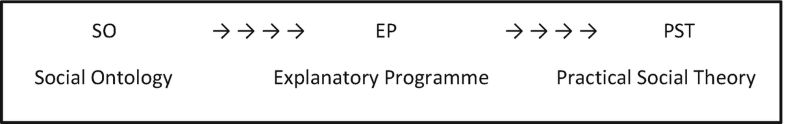

# El enfoque morfogenético; Enfoque del marco explicativo del realismo crítico {#Capitulo_09}

El realismo crítico, la filosofía de las ciencias sociales que se utiliza aquí, es igualmente aplicable a todas estas disciplinas y no concede un lugar especial a la economía. De hecho, los economistas heterodoxos la han adoptado, decepcionantemente, poco (las notables excepciones en Gran Bretaña son Tony Lawson y Jamie Morgan). La generalidad con la que Roy Bhaskar avanzó en la RC significa que necesariamente los teóricos de cada disciplina deben desarrollar sus propias explicaciones, aunque estas compartirán el mismo "trabajo insuficiente" filosófico que describió Bhaskar en su propia contribución. Específicamente, esto implica el respaldo común de lo siguiente:

(a) Un rechazo de las 'conjunciones constantes' humeanas como una base deficiente, porque empirista para conceptualizar la realidad social y la causalidad.
 
(b) Una ontología estratificada del orden social, que respalda la emergencia y las consecuencias causales de la interacción de segundo o tercer orden entre propiedades y poderes emergentes. A su vez, esto significa la aceptación de la causalidad ascendente y descendente entre estratos.
 
(c) Negarse a asignar prioridad automática a la estructura (o cultura) frente a la agencia cuando se tiene en cuenta la causalidad en el dominio social.

(d) Una confianza en los 'tres pilares' de CR para la adecuación explicativa:

- Realismo ontológico
- Relativismo epistémico
- Racionalidad de juicio

Intentaré mostrar cómo mi propio programa explicativo 'Morfogenético / Morfostático' complementa de manera útil lo anterior con un enfoque interdisciplinario para explicar el cambio y la estabilidad en todas las formas e instituciones sociales. Este marco es obediente a los cuatro principios anteriores, pero también proporciona un conjunto de herramientas para aquellos que buscan teorizar sobre el desarrollo de procesos, prácticas y políticas sociales particulares (y la resistencia a ellos) en cualquier S 1 T 1 dado , donde sea que esté situado históricamente. y geográficamente. En sí mismo, el enfoque M / M no es una teoría. Si algunos prefieren asignarlo a "metodología", no me opondría.

## Falta de trabajo filosófico y la necesidad de un juego de herramientas explicativo {-}

Los realistas críticos aceptan que la naturaleza de la realidad social es tal que su explicación requiere la identificación de los poderes causales distintivos ejercidos en un lugar o fecha determinados. Este es el caso de aquellos procesos que dan cuenta de sus contornos sociales en un momento determinado; los que mantienen una determinada configuración social en el ser durante algún tiempo; y aquellos que transforman su tipo particular con el tiempo . La diferencia entre estos mecanismos y los que se encuentran en el orden natural se deriva de la naturaleza de los constituyentes fundamentalmente diferentes de estos dos órdenes de realidad.

Su diferencia también explica por qué "morfogénesis" significa algo muy diferente en biología, donde es un proceso totalmente inconsciente, que en las ciencias sociales. (Lo único que comparten es una etimología común). Lo que distingue a la realidad social, o cualquier parte de ella, es que está intrínseca, inherente e ineludiblemente "poblada". Su constitución ontológica depende totalmente de la actividad , a pesar de que los pensamientos y acciones de las personas dan lugar a factores que "no son personas", siendo los más importantes la cultura y la estructura.

Debido a esto, he argumentado junto con Bhaskar que para que cualquier proceso merezca ser considerado como un generador de cambio social, necesariamente debe incorporar (i) relaciones humanas estructuradas ( dependencia del contexto ) porque no existe tal cosa como la 'acción sin contexto'. y llamarlo "situado" no hace ninguna diferencia; (ii) acciones humanas ( actividad-dependencia ) porque incluso los resultados más distantes, como el PIB o el cambio climático en el Antropoceno, no existirían sin las acciones continuas de las personas, y (iii) las ideas humanas ( concepto-dependencia ) porque actividades como 'votar', 'pagar el alquiler' o 'abrir una cuenta bancaria' requieren que los actores tengan alguna noción de lo que están haciendo, por vaga o equivocada que sea^[Roy, Bhaskar, 1979, La posibilidad del naturalismo, Harvester Wheatsheaf, Hemel Hempstead.]. Necesariamente, estos tres requisitos hacen que la teorización social sea no naturalista, que es diferente de las ciencias naturales. (Como dijo Roy Bhaskar a menudo, su Posibilidad del naturalismo podría haberse llamado igualmente La imposibilidad del naturalismo ) .

Una forma más familiar de expresar lo anterior es que toda teoría sobre el orden social necesariamente tiene que venir en un saco, SAC: debe incorporar Estructura, Agencia y Cultura. El problema en cuestión determinará cuál de los tres recibe más atención y, por lo tanto, el acrónimo SAC no es un orden de prioridad entre los tres elementos. Todos son siempre indispensables.

Durante el último cuarto de siglo, las filas de negacionistas del SAC se han incrementado dramáticamente. Como sostuvo Porpora en su reciente libro Reconstructing Sociology: The Critical Realist Approach^[Douglas, V, Porpora, 2015, Cambridge, Cambridge University Press.] , la postura metateórica de la negación se basa en la combinación de estos tres elementos. En lugar de propiedades y poderes distintivos pertenecientes a la estructura, la cultura y la agencia, cualquier par se fusiona entre sí, descartando así el examen de la interacción (cambiante) entre ellos y su teorización.

Cuando la combinación gobierna, los componentes de SAC se colapsan en un solo factor ontológico, al que se le da un nombre propio, mientras que se niega rotundamente la existencia de otros. Un ejemplo relevante en relación con la economía es el relato de Rom Harré sobre la crisis financiera de 2008 desde su 'modelo conversacional'.

> Las instituciones no son ontológicamente básicas, ni ningún otro ser aparentemente estructurado como una entidad. Desde el punto de vista del modelo de fuente conversacional, una institución es una apariencia, una ilusión presentada por la relativa estabilidad del flujo de actos sociales que son constitutivos de la realidad social del entonces y el allí. La necesidad de un punto de vista ontológico claro se ha ilustrado dramáticamente en el "colapso" de una parte del "sistema bancario". Hablar de esa manera distrae nuestra atención de la realidad, el flujo de actos sociales realizados por un grupo de agentes activos vagamente delimitados, siguiendo reglas del discurso que al final resultaron incoherentes. No hay ni hubo "sistema bancario ". (2009 mi cursiva)^[Rom Harré, (2009) "Salvar el realismo crítico", J. Theor Soc Behav 39 (2), 129-143.]

En cambio, la metáfora rectora es de "flujos" o "liquidez", que depende de una disolución previa de los tres componentes del SAC. Así, el tropo principal de la 'modernidad líquida' depende explícitamente de una combinación ecléctica de negaciones de la 'estructura' (reemplazadas, por ejemplo, por afirmaciones teóricas sobre la 'desestructuración' en el trabajo de Ulrich Beck), negaciones de la 'cultura' como algo más que lo que la gente lleva en la cabeza, (respaldado por Dave Elder-Vass), y de 'agencia', fluida por las nociones de auto-reinvención en serie (Beck y Anthony Giddens), cortando así los lazos personales y grupales ' identidad "," intereses "y" compromisos "(si el antihumanismo no hace irrelevantes todas estas nociones al reducir a los agentes y actores a los" actantes "de Latour). En consecuencia, la imagen del orden social que está siendo moldeado y remodelado por grupos que buscan promover sus intereses materiales, sus intereses ideales y quiénes son, queda borrado por las imágenes de la fluidez. A su vez, la sociedad líquida se libera de las luchas por la dominación y el control (social o seccional) y se vuelve literalmente ingobernable e incontrolable, como lo transmiten las imágenes de la sociedad 'fugitiva', 'gigante' o 'riesgo' (Beck y Giddens) . Esto significa la desaparición tanto del "Mando y Control" central, pero también de los robustos Movimientos Sociales dominantes en los cambios macroscópicos de los últimos dos siglos. la sociedad líquida se libera de las luchas por la dominación y el control (social o seccional) y se vuelve literalmente ingobernable e incontrolable, como lo transmiten las imágenes de la sociedad 'fugitiva', 'gigante' o 'riesgo' (Beck y Giddens). Esto significa la desaparición tanto del "Mando y Control" central, pero también de los robustos Movimientos Sociales dominantes en los cambios macroscópicos de los últimos dos siglos. la sociedad líquida se libera de las luchas por la dominación y el control (social o seccional) y se vuelve literalmente ingobernable e incontrolable, como lo transmiten las imágenes de la sociedad 'fugitiva', 'gigante' o 'riesgo' (Beck y Giddens). Esto significa la desaparición tanto del "Mando y Control" central, pero también de los robustos Movimientos Sociales dominantes en los cambios macroscópicos de los últimos dos siglos.

Quizás sea útil delinear la estructura de la teoría social realista como en el diagrama siguiente, para tener claro la naturaleza de la explicación en el realismo. Permítanme comenzar con dos declaraciones audaces. Primero, la ontología social (contribución de Bhaskar) no explica nada. En segundo lugar, tampoco mi Enfoque Morfogenético explica nada. Eso no significa que no trabajen en la teorización social. De hecho, los necesitamos a ambos. Para empezar, todo el mundo tiene una ontología social (incluidos los actores laicos) que consiste en aquellas cosas que consideran que existen y que no. Sabemos que los actores laicos difieren: algunos sostienen que los fantasmas existen, otros que el exorcismo puede eliminarlos y la mayoría ninguno. Lo mismo ocurre con los teóricos sociales.

Sin embargo, todos los teóricos tienen una ontología social, implícita o explícita, que define efectivamente los constituyentes del mundo social. Por lo tanto, el SO desempeña un papel de regulación conceptual porque gobierna aquellos conceptos que se consideran admisibles en la descripción como en la explicación, al igual que un ateo no puede atribuir su bienestar a la providencia divina. Aunque una ontología social no explica nada, con frecuencia excluye ciertas explicaciones, expresadas en términos "impropios".

Esta fue la gran contribución de Bhaskar como señala en su libro póstumo^[Roy Bhaskar, (2016), sentido común ilustrado, la filosofía del realismo crítico, Abingdon, Routledge.]; a saber, la tarea de rescatar la ontología (cómo es el mundo) de la epistemología (cómo lo consideramos). Ni por un momento afirma que tenemos acceso directo e infalible a "cómo es el mundo", incluido el orden social que, en última instancia, es obra del hombre. En cambio, su gran contribución filosófica fue negar que podamos responder a esta pregunta en cualquier ciencia sobre la base del empirismo (lo que está disponible para nosotros a través de datos que provienen de nuestros cinco sentidos). Según ese criterio, "percibiremos" (oler, oír, etc.) algo de lo que existe, pero lejos de todo lo que existe en los niveles actuales o reales. Si está presente en un evento (un partido de fútbol), gran parte de lo que sucede será inaccesible desde el ángulo de visión de cualquiera. Sin embargo, si se juntan estas diferentes perspectivas en algún tipo de visión generalizada de los espectadores, ese `` actualismo '' no puede revelar los factores causales no observables, pero no obstante reales en juego (por ejemplo, que los jugadores clave han sido sobornados para perder el partido). Este es el nivel de lo "real" que existe y sólo puede ser conocido por su influencia causal y no por la observación directa.

Las cosas son aún más complejas. Algo puede existir (el soborno) pero sus poderes causales pueden no ser ejercidos (el equipo se preocupa más por ganar que por las represalias posteriores); los poderes pueden ejercerse, pero no detectarse (tal vez un tirador clave finge con éxito una lesión), o ejercerse, pero no afectar el resultado esperado (el otro equipo juega tan mal que el soborno no puede evitar que el sobornado gane). Como investigadores, tenemos que lidiar con todos estos escenarios ontológicamente variables. Una consecuencia es que, a diferencia del empirismo, rara vez podemos hacer predicciones en el sistema abierto que es el orden social, a diferencia del laboratorio estéril, porque nada puede evitar la intrusión de contingencias.

En sí mismo, un SO no le dice a nadie cómo explicar nada. Para ello se necesita un programa explicativo. Eso es lo que es el Enfoque Morfogenético; el complemento metodológico de la ontología social del Realismo Crítico. El diagrama básico M / M, proporciona pautas sobre cómo dividir analíticamente el material en la mano para formar las tres fases temporales que componen un solo ciclo morfogenético, que termina en cambio o estasis y representa el comienzo del siguiente ciclo, a saber. <Condicionamiento estructural y cultural → Interacción social → Elaboración estructural y / o cultural>. Es el investigador quien aporta el material y el problema a explicar y, si tiene éxito, produce lo que he llamado una teoría social práctica. El PE habrá ayudado a ordenar los componentes del SAC para tener en cuenta el 'quién', 'cuándo',

Esto significa que PST juega un papel crucial en el desarrollo del Realismo Crítico mediante el uso deen un área sustantiva de interés para el investigador. Siempre hay áreas que no han atraído previamente la investigación realista y este es necesariamente el caso porque los cambios sociales del mañana (morfogenéticos o morfostáticos) aún no se pueden haber investigado. De manera similar, aunque de manera contingente, generalmente hay una gran cantidad de temas que simplemente no se han investigado en absoluto. Ésta es la razón por la que la formulación de una pregunta de investigación es uno de los elementos más y, a menudo, el más importante de un proyecto de investigación; es lo que fomenta el desarrollo de la teorización realista. Puede hacerlo provocando modificaciones en el SO porque nuestra ontología no puede permanecer inmune a cómo se descubre la realidad. (Como se ilustra todos los días en la investigación médica). Alternativamente, los hallazgos de la investigación pueden requerir ajustes en el Programa Explicativo.

Aunque todas las propiedades estructurales y culturales que se encuentran destacadas en cualquier sociedad son continuamente dependientes de la actividad, es posible a través del dualismo analítico separar 'estructura', 'cultura' y 'agencia' para examinar su interacción con el fin de dar cuenta de la estructuración y reestructuración del orden social. Básicamente, esto es posible por dos razones. En primer lugar, la 'estructura', la 'cultura' y la 'agencia' son tipos diferentes de entidades emergentes^[Roy Bhaskar, Reclaiming Reality , Verso, Londres, 1989, 'La gente y la sociedad […] no constituyen dos momentos del mismo proceso. Más bien se refieren a cosas radicalmente diferentes ”. pag. 76.], como lo demuestran las diferencias en sus propiedades y poderes, a pesar deel hecho de que son cruciales para la formación, la continuación y el desarrollo de los demás. Así, un sistema educativo puede estar "centralizado", mientras que una persona no puede, y los humanos son "reflexivos", lo que no puede ser el caso de las estructuras. En segundo lugar, y fundamental para la viabilidad de esta metodología explicativa, la 'estructura', la 'cultura' y la 'agencia' operan diacrónicamente en diferentes períodos de tiempo porque (i) la estructura y la cultura necesariamente son anteriores a las acciones que las transforman y, (ii) la elaboración estructural y cultural necesariamente es posterior a esas acciones, como se representa en el siguiente diagrama. Esto es lo que distingue el dualismo analítico del dualismo filosófico (Fig. 9.1 ).
Abrir imagen en nueva ventanaFigura 9.1

**Figura 9.1** La secuencia morfogenética básica. Margaret S. Archer, 1995, Teoría social realista; El enfoque morfogenético, Cambridge University Press, p.157

Se concede toda la importancia a la escala de tiempo a través de la cual la estructura, la cultura y la agencia emergen, se entrelazan y se redefinen mutuamente, ya que esta es la base del formato explicativo empleado para dar cuenta de cualquier cambio sustancial en las formas sociales.

Está enteramente en manos del investigador sustantivo juzgar dónde comenzar su proyecto explicativo en el tiempo (y su T 1 puede diferir históricamente del de la investigación anterior, que podría haber estimulado su propio trabajo). De manera similar, el período entre T 2 - T 3en el que los grupos compiten entre sí para dar forma a alguna forma social, organización o práctica puede variar considerablemente de un lugar a otro dependiendo de las circunstancias locales. El PE debe tratarse como una plantilla flexible. Por ejemplo, un posgrado había hecho un buen estudio de las complejidades de la toma de decisiones del gobierno local durante los 3 años de su registro, pero vino a mí y se quejó de que no se habían producido cambios notables en este período a pesar del considerable conflicto entre los grupos. involucrado. Así sea, las luchas continuaron porque los grupos en cuestión se habían encerrado en un conflicto no resuelto, al menos pro tem. ¡Las dinámicas conflictivas no se adaptan convenientemente a la duración de nuestras subvenciones! Por el contrario, no se puede suponer que las formas y prácticas actuales siempre pertenecieron al mismo grupo nominal, como una profesión a lo largo de las carreras individuales de sus miembros, que de todos modos serían de duración variable. Por ejemplo, los referentes de 'Director de empresa', 'Gerente de ventas' y 'Trabajador de planta' habrían cambiado considerablemente, si todavía se usaran, al igual que para Médicos y Profesores.

Lo más obvio es que el mismo punto se refiere a T 4, el explanandum en cualquier teoría o investigación que se centre en él. Dada su dependencia de la actividad, todos los aspectos del orden social son susceptibles de cambio. La temporalidad es intrínseca a su constitución y, por lo tanto, debe serlo en la teorización social realista. En consecuencia, siempre debemos estar listos para reconocer que se ha producido un cambio ontológico (aunque el "cuándo" muy probablemente variará con nuestros intereses de investigación) y si lo ha hecho de manera significativa, es hora de comenzar otro ciclo morfogenético. El explanandum se ha alterado, gracias a su "dependencia de la actividad", por lo que también lo han hecho los efectos de condicionamiento estructural y / o cultural sobre las personas y los grupos y, en consecuencia, sobre sus preocupaciones, intereses creados y cursos de acción y muy probablemente sobre sus resultados. Por ejemplo^[Margaret S. Archer (1979), Social Origins of Educational Systems, Londres, Sage, reimpreso en 2013 por Routledge, Abingdon.], (usando dos ciclos analíticos para hacerlo), esa estructura se transformó en algo gobernado de manera más centralizada en las últimas tres décadas del siglo XX.

De ello se desprende que ninguna teoría social es eterna porque lo que pretende explicar a menudo cambia en algún aspecto al igual que se avanzan las teorías. El tropo de la 'liquidez' tenía muchos defectos, especialmente en relación con la distribución global de los escasos recursos materiales de la sociedad, pero además se presentaba como si tuviera vida eterna. Es decir, no se especificaron condiciones de las que dependiera su continuación. Por el contrario, en la serie actual de 5 volúmenes del Center for Social Ontology sobre morfogénesis social^[Margaret S. Archer (ed.) (2013), Morfogénesis social , (ed.), (2014), Modernidad tardía: trayectorias hacia la sociedad morfogénica ; Margaret S. Archer, (ed.), (2015), Mecanismos generativos que transforman el orden social : Margaret S. Archer (Ed.) (2016), Morfogénesis y la crisis de la normatividad; Margaret S. Archer (ed.) (2017), Morfogénesis y florecimiento humano, todos publicados por Springer, Dordrecht.], hemos sido extremadamente cautelosos en nopara anunciar el advenimiento de una Sociedad Morfogénica, a pesar de la evidencia empírica de morfogénesis intensificada en la mayoría de las instituciones sociales en casi todas partes. Esto se debió a que el mecanismo generativo que impulsa sus manifestaciones (en mi opinión, la sinergia entre el capitalismo financiarizado y la tecnología digital^[Margaret S. Archer, (2015), 'El mecanismo generativo reconfigurando la modernidad tardía', en Archer (ed). Mecanismos generativos, Ibid.]) puede combinarse con otros mecanismos para producir una variedad de nuevas formaciones sociales. Además, incluso esa declaración tiene una salvedad. Ninguno de esos posibles cambios se producirá a menos que las emisiones globales de combustibles fósiles se reduzcan a menos del 2% según el acuerdo de París de 2015, para el cual puede que no sea demasiado tarde, ni se realizará ninguna utopía concreta porque el juego se cumplirá. acabarse. La 'morphonecrosis', la extinción de formas y procesos sociales es una extensión muy importante que Ismael Al-Amoudi ha agregado a la teorización del Realismo Crítico y la extinción total de la raza humana sería su máxima expresión.

Para los realistas, nada social, cualquiera que sea su origen, es autosuficiente, que es lo que, entre otras cosas, distingue al mundo social del natural. Sólo una miríada de "acciones" agenciales (que incluyen pensar, creer e imaginar) mantienen una entidad social de nivel superior dada en el ser y la hacen relativamente duradera. En otras palabras, mientras dure algo como el sistema educativo francés centralizado, entonces mueva un marcador, segundo a segundo, desde el inicio del sistema hasta hoy, y todos y cada uno de los momentos de su 'centralización' dependen de acciones agenciales (incluidas las intencionales). en acción).

Sin embargo, esto no equivale a alguna noción giddensiana de que todo lo que hagamos por parte de todos contribuye de alguna manera a mantener el todo (en este caso, una institución)^[Por ejemplo, como en su caso paradigmático del lenguaje: "cuando pronuncio una oración gramatical en inglés en una conversación casual, contribuyo a la reproducción del idioma inglés como un todo". Anthony Giddens, Problemas centrales de la teoría social , Macmillan, Londres, 1979, págs. 77-8.]. Por el contrario, algunas acciones son completamente irrelevantes para sostener la centralización (tener un perro), algunas son más importantes que otras, y es solo porque existen otras `` acciones '' en tensión entre sí que las cosas permanecen como están (Catholic y ahora las prácticas religiosas musulmanas 'provocan' la centralización para ejercer sus poderes en defensa de la laicidad de la educación en la República Francesa). Aún más acciones están destinadas a cambiar el statu quo, pero aún no han tenido éxito en hacerlo.

Lo que el enfoque morfogenético nos permite hacer es evitar la banalidad sincrónica y la futilidad de afirmar que, si una propiedad relacional perdura, esto debe ser debido a algún balance neto de sustentar las acciones agenciales en cada momento en el tiempo (que recuerda el balance neto de Merton de consecuencias funcionales '). En cambio, al completar un ciclo morfogenético, al producirse en la elaboración estructural, no solo se transforma la estructura, sino también la agencia, como parte integrante del mismo proceso, como la doble morfogénesis^[Véase Margaret S. Archer. (1995), Teoría social realista: el enfoque morfogenético, Cambridge, Cambridge University Press p. 74 y cap. 8.]. (Este punto no se comprende por completo en la discusión engañosa de Dépelteau sobre lo que él llama "teorías de la co-determinación")^[Dépelteau, François, 2008, 'Pensamiento relacional: una crítica de las teorías codeterministas de la estructura y la agencia', Teoría sociológica , 26: 1.]. A medida que reconfigura las relaciones estructurales y / o culturales en cualquier T 4, la agencia se está reconfigurando inevitablemente: en términos de dominación y subordinación, de organización, combinación y articulación; en términos de sus intereses creados y estos en relación con los de otros agentes; en cuanto a los nuevos roles y posiciones que algunos ocupan y otros no; y en términos de las situaciones novedosas en las que se encuentran ahora todos los agentes, limitando los proyectos de unos y habilitando los proyectos de otros^[Véase Estructura, agencia y conversación interna, Cambridge, Cambridge University Press, 2003, págs. 1-16.], pero significativos para la motivación de todos.

En otras palabras, en un momento dado T 4 algo radical sucede, no sólo a la estructura, sino también a la agencia. En los casos de cambio macroscópico, esto afecta a las 'personas' al transformar cuatro 'partes' o niveles del orden social: el sistémico, el institucional, el conjunto de roles y el posicional (las oportunidades de vida de diferentes sectores de la población). Donde el surgimiento de un cambio económico significativo (en T 4), uno de sus efectos inmediatos consiste en volver a dividir a la población, no necesariamente de manera exhaustiva, en aquellos con intereses creados en el mantenimiento (económico) y el cambio, respectivamente, de acuerdo con las situaciones en las que se encuentran ahora, involuntariamente para la mayoría. de la gente. Caracterizar un interés como uno "adquirido" es asociarlo con una posición particular, la implicación es que si las posiciones (roles, instituciones) cambian, también cambian los intereses. Como dice Porpora, “entre los poderes causales que se depositan en las posiciones sociales se encuentran los intereses. Los intereses se construyen en una posición social por la relación de esa posición con otras posiciones en el sistema […] los actores están motivados para actuar en sus intereses, que son una función de su posición social. De nuevo^[Douglas V. Porpora, 'Cuatro conceptos de estructura social', Journal for the Theory of Social Behavior , 19: 2, 1989, p. 208.], Por lo tanto, los 'costos de oportunidad' se distribuyen de manera diferente entre diferentes grupos de actores para el mismo curso de acción, proporcionando así una guía direccional con respecto al curso de acción que adopta cada grupo. (Estos se denominan "lógicas de acción situacionales" en el enfoque M / M).

Sin embargo, se debe prestar la misma atención a la morfostasis, que es simultáneamente para dar cuenta de la naturaleza relativamente duradera de las estructuras y culturas, lo que, a su vez, sirve nuevamente para resaltar la importancia de la ' doble morfogénesis ', o, en este caso, su relativa ausencia. Una dificultad frecuente con los relatos sincrónicos persuasivos, y creo que el concepto de 'habitus' de Bourdieu es un ejemplo de ello, es cómo explicar que una relación dada entre partes es siempre susceptible de transformación (de hecho, él mismo se basó en factores externos).intrusiones, en común con el funcionalismo normativo). En cambio, la amenaza de la doble morfogénesis revela cómo las "fuerzas" sincrónicas (que reproducen la morfostasis) son un logro agencial, que está constantemente amenazado, en lugar de conducir a la vida eterna para cualquier forma social.

Para empezar, los perdedores en una lucha por el cambio institucional no se desvanecen silenciosamente, sino que tienden a seguir luchando y pueden ganar concesiones. Por paradójico que esto pueda parecer, el análisis morfostático no puede permanecer igual de un intervalo de tiempo a otro. Esto se debe a que la explicación de por qué algo perdura tiene que adaptarse a tales cambios en su constitución, cambios que "puntúan" la morfostasis diacrónicamente. En otras palabras, una entidad emergente (como un sistema capitalista) puede retener sus propiedades relacionales clave y poderes causales (los que todavía lo hacen una versión del capitalismo), sin que permanezca sin cambios, como con el advenimiento de la producción multinacional, luego la financiarización y , finalmente, la digitalización.

De manera similar, para simplificar mucho, estas nuevas características de las instituciones familiares también definen nuevos grupos de perdedores ; aquellos con oportunidades económicas más limitadas pero conscientes de la creciente brecha entre ingresos y riqueza. Todos los grupos en estas nuevas situaciones tienen intereses creados en lograr una transformación, aunque no precisamente del mismo tipo. Con una simplificación aún mayor, la pregunta crucial para la resistencia frente al cambio es: "¿Pueden estos grupos trabajar juntos?" Ésta es una pregunta empírica. Lo que significa, sin embargo, es que sabemos dónde mirar - y esto es solo contingentemente 'afuera' - para explicar por qué se acabó el tiempo para lo que estaba relativamente lejos.duradero. Cuando luego nos ocupamos de la ruptura del tenso equilibrio de fuerzas que había mantenido consistentemente la morfostasis, también sabemos qué hacer a continuación, y eso es examinar el próximo (potencialmente) ciclo morfogenético. ¿Qué le sucede a la economía si la combinación del 'populismo' político engendrado por quienes se proclaman a sí mismos como 'el 99%' logra reestructurar los puntales previos que la política había proporcionado a la economía desde el advenimiento del capitalismo, a pesar de la redefinición gradual que habían experimentado los partidos de la democracia constitucional?

A lo largo de esta explicación se ha mantenido que el "condicionamiento" estructural está necesariamente mediado por respuestas agenciales (variables) a sus circunstancias. Sin tener en cuenta los poderes personales de los agentes, es imposible explicar la variabilidad de sus acciones en las mismas circunstancias. Sin embargo, algunos cuestionan la propia noción de mediación. Así, Manicas se pregunta '¿por qué postular la existencia de estructura o cultura como causalmente relevante si, para ser causalmente efectivas, estas deben estar mediadas por actores sociales?'^[Peter T. Manicas, Una teoría realista de las ciencias sociales, Cambridge , Cambridge University Press, 2006, p. 72.] Dado que deja la pregunta allí, presumiblemente se considera incontestable. Sin embargo, la estructura y la cultura solo podrían considerarse causalmente irrelevantes si lo que se estaba mediando fue, de hecho, inventado en ese momento por actores cuyos propios poderes personales fueran enteramente responsables de ello. Esta "prohibición" de la "mediación" parece tan insostenible como sostener que los cables que llevan electricidad a mi casa son totalmente responsables del funcionamiento de mis luces y aparatos eléctricos y que la existencia de una red nacional y generadores de electricidad son causalmente irrelevantes.

Esto refleja una tendencia entre los realistas "débiles" a requerir algún tipo de instanciación de las propiedades de la estructura por parte de los agentes antes de que se les conceda algún papel en una explicación. En otras palabras, lejos de incidir sobre los agentes, son los sujetos humanos quienes literalmente los ponen en juego. Este sesgo voluntarista obviamente proporciona una protección bastante mejor contra ser acusado de cosificación. Los ejemplos incluirían de John Searle noción de 'el fondo'^[John Searle, (1995), La construcción de la realidad social, Londres, Penguin, págs. 127-147.], al que se hace copia de referencia, por ejemplo, por los oyentes a las declaraciones eliminar la ambigüedad que requieren contextualización. Del mismo modo, Manicas relega las propiedades estructurales y culturales a ser 'materiales a la mano'^[Peter T. Manicas, A Realist Philosophy of Social Science , Cambridge, Cambridge University Press, 2006. "Las personas son los agentes causales dominantes en la sociedad, incluso cuando, por supuesto, trabajan con los materiales disponibles". pag. 75.], sin la capacidad de ejercer poderes causales, pero también, desde su punto de vista, sin ninguna explicación de por qué algunos están al alcance de ciertos actores, pero fuera del alcance de otros. (Por tanto, no es sorprendente que el teórico social favorito de Searle parezca ser Bourdieu, mientras que el libro de Manicas es una repetición virtual de Giddens: estos dos autores favorecen así la postura teórica que he denominado fusión central)^[Para una discusión de 'lo que he denominado' fusión central ', ver mi Culture and Agency , Cambridge, Cambridge University Press, 1988, cap. 2, 3 y 4. También Teoría Social Realista: Ibid., Cap. 3 y 4.].

## Respuestas impacientes 'innovadoras' y sus deficiencias {-}

Aplicar el realismo crítico lleva tiempo. Algunos prefieren apostar rápidamente por la fama, promoviendo lo que se supone son avances teóricos novedosos o anunciando que han ``trascendido'' algún problema obstinado e inflexible (como la `` estructura y la agencia '', como portadores de diferentes propiedades y poderes, o 'subjetividad y objetividad', indispensables para la explicación, pero inconmensurables). Con frecuencia, esto toma la forma banal que llamo 'Beyondism' (acuñado y ridiculizado por Bertrand Russell), porque todo está en cierto sentido más allá de otra cosa, incluido el Big Bang.

Uno de los más irritantes es el supuesto advenimiento de nuevos 'giros'. Cuando me enfrenté a otro el verano pasado, le pregunté a mi investigador con cuántos se había encontrado. Obligatorio me dijo que los había enumerado y su total era 48. En las próximas 2 semanas, agregué dos más, llevándonos a 50. Dado que tales 'giros' implican avances teóricos y no solo que los fenómenos empíricos particulares adquieran repentina popularidad , me parece que estos generalmente implican una de las siguientes falacias en la teorización.

Primero, asignan prominencia causal automática a algún rasgo social que de otro modo no sería controvertido, una maniobra que bien puede traducir SAC (ya que el "giro cultural" descartó la estructura o la confundió con la cultura). La fusión siempre se equivoca si oculta diferencias reales en propiedades y poderes, como en ese caso. Los elementos del corpus cultural ideacional pueden compartirse sin pérdida de valor^[Como dijo Thomas Jefferson: “Si la naturaleza ha hecho que una cosa sea menos susceptible que todas las demás de propiedad exclusiva, es la acción del poder pensante llamado idea, que un individuo puede poseer exclusivamente mientras la guarde para sí mismo; pero en el momento en que se divulga, se impone a sí mismo en posesión de todos ... Su carácter peculiar, también, es que nadie posee menos, porque todos los demás lo poseen todo. El que recibe una idea de mí, recibe instrucción él mismo sin disminuir la mía; como el que enciende su vela en la mía, recibe luz sin oscurecerme. (August13 º 1813 Carta a Isaac McPherson). http://presspubs.uchicago.edu/founders/documents/a1_8_8s12.html], a diferencia de las propiedades estructurales que dependen de la división de los escasos recursos materiales de la sociedad. La escasez solo puede ser característica de las cosas ideacionales si se impone artificialmente (a través de, por ejemplo, "derechos de propiedad intelectual" o patentes o la retención deliberada de la educación a ciertos grupos).

En segundo lugar, ¿qué asegura algún factor o rasgo del dominio necesario en el orden social? El 'discurso' puede ejercer poderes causales (nótese la sustitución de 'género' por 'sexo' en los documentos de las Naciones Unidas y en la mayoría de los medios de difusión). Por lo general, nuevamente, la respuesta es solo una combinación, como en los 'intereses constitutivos del conocimiento' o la amalgama 'poder-conocimiento'. De hecho, sus componentes existen, pero eludirlos conceptualmente no explica cómo llegaron a unirse. Ciertamente, la base material de muchos intereses alienta a sus portadores a rastrear el archivo cultural en busca de recursos legítimos, pero no da cuenta de qué ideas se han alojado allí o cuáles se seleccionan de ese conjunto ni permite la falibilidad humana. Es más,

En tercer lugar, algunos son simplemente tautológicos en el mejor de los casos e implican un paradigma de investigación degenerativo en el peor (como en el llamado "giro relacional" y su manifiesto). ¿Qué, preguntaría un realista, no es relacional? Es interesante y revelador simplemente contar el número de veces que Bhaskar subrayó cuántos de sus términos clave (en el capítulo 2 "Sociedades" de La posibilidad del naturalismo) fueron calificados como "relacionales". Pero para él, "relacionalidad" denotaba relaciones reales cuya interacción generaba propiedades emergentes. Esto está a años luz de los de Emirbayer^[M. Emirbayer, (1997) 'Manifiesto para una sociología relacional', American Journal of Sociology, 103.]. uso del término - como un negacionista de emergencia - donde el vínculo entre las relaciones humanas y el cambio social (o estabilidad) simplemente apunta a una lista interminable de 'transacciones' indeterminadas sin la especificación más básica de las condiciones bajo las cuales una 'transacción' era probable para tener éxito, de quién y con qué fin. Por esta razón, cuando Pierpaolo Donati y yo fuimos coautores de The Relational Subject (2015)^[Pierpaolo Donati y Margaret S. Archer, (2015), El sujeto relacional, Cambridge, Cambridge University Press.], nos distinguimos del 'relacionismo' e insistimos en ser 'realistas relacionales', basando todo nuestro argumento en propiedades y poderes emergentes de la relacionalidad.

En general, me parece que junto con los intentos anteriores de sustituir estas formas de `` fusión central '' por los esfuerzos realistas para recuperar la realidad, existe un movimiento generalizado para restablecer la epistemología sobre la ontología, una cuyas implicaciones filosóficas a menudo no son apreciadas por sus exponentes. Es revelador examinar la lista de contenidos de las revistas de ciencias sociales o simplemente echar un vistazo a la lista de seminarios para el personal que se ofrecen en cualquier semestre, ya que ambos brindan evidencia convincente de la omnipresencia de lidiar con 'representaciones' en lugar de abordar la realidad misma. Sin duda, esto es más fácil y también complementa la preferencia por los medios visuales sobre las fuentes escritas (con el promedio de horas dedicadas a ver televisión en la UE ahora acercándose a las de la semana laboral). Las imágenes pueden ser influyentes, pero sólo si nunca se olvida que se trata de imágenes de algo real y reaccionan a ello. Insistir a las mujeres jóvenes en que la talla 0 representaba una imagen corporal ideal fue finalmente aceptada por muchas casas de moda como objetivamente perjudicial para la salud de las adolescentes al contribuir a la anorexia y la bulimia.

Estos son síntomas de que la epistemología está recuperando terreno, pero, si estoy en lo cierto, también funcionan en combinación con cambios reales en la academia y aumentan las consecuencias negativas para las ciencias sociales. El ingreso a la profesión se ha vuelto mucho más competitivo a medida que más graduados con (cada vez) mejores primeros títulos ingresan en una competencia objetiva entre sí para continuar en la vida académica. Una consecuencia loable, pero defensiva, es que parecen actuar de forma solidaria y no antagónica entre sí. Es raro en los seminarios que realizo regularmente en varios países encontrar participantes desafiando los puntos de vista de sus pares. Dado que la competencia objetiva develada continúa en los años de prueba de quienes logran obtener un puesto universitario, esta contradicción persiste. Porque conocen las reglas del juego (por ejemplo,

Superficialmente, esto parece caritativo, pero creo que tiene una consecuencia involuntaria muy negativa. El argumento está fuera y la afirmación está adentro. Sin embargo, el argumento es indispensable en el realismo crítico. En pocas palabras, es fundamental para su "tercer pilar": el ejercicio de la racionalidad enjuiciadora. Dado que no tenemos acceso directo a lo "real" en ningún dominio, la realidad no puede arbitrar sobre nuestras proposiciones teóricas. Por lo tanto, estamos condenados a vivir con el contendiente más convincente en un momento dado y el árbitro entre reclamos en competencia es la fuerza de un argumento contra otros.

### El efecto de las evasiones antirrealistas en la actual crisis mundial {-}

Cuando cayó el muro de Berlín, Peter Berger se quejó con razón del silencio de los sociólogos; mudo antes de él y permaneciendo así después en términos de explicación retrodictiva. Exactamente los mismos reproches pueden dirigirse a nuestra disciplina por sus respuestas a las crisis actuales, que son de una importancia y una magnitud aún mayores. Entre las razones de esta temeridad se encuentran las tendencias presentadas en la última sección.

El cambio climático es una ilustración obvia de la tardanza. En 1986, un informe patrocinado por la NASA que publicó por primera vez el modelo de Bretherton, el papel desempeñado por las actividades sociales se limitó a una pequeña caja negra en la periferia exterior. La implicación no era que 'nosotros los humanos habíamos creado este problema; así que debemos resolverlo ”y el público en general en el mundo desarrollado tampoco lo tomó de esa manera. Más deprimente fue nuevamente el silencio de los sociólogos. El análisis bibliográfico de la ISSC reveló en 2013 que solo el 3 por ciento de los artículos relacionados con el cambio ambiental global habían sido elaborados por sociólogos en los 20 años anteriores. El crédito es para el Grupo de Trabajo sobre Sociología y Cambio Climático Global de la ASA por la publicación de Cambio Climático y Sociedad: Perspectivas Sociológicas, pero tuvimos que esperar hasta 2015 para el excelente volumen de Dunlap y Brulle.

El timorismo marcó la respuesta sociológica a toda la gama de crisis interrelacionadas, derivadas de la crisis económica de 2008, a través de la aplicación de medidas de austeridad, el crecimiento del yihadismo y la crisis migratoria estrechamente vinculada, al resurgimiento de la ultraderecha con amenaza de nacionalismo y xenofobia. las instituciones del mundo occidental (la UE, la OTAN y la propia democracia); cada uno representa una amenaza para la paz mundial y exacerba los aumentos de la mala integración social y del sistema en el nivel más macroscópico.

Si uno jugara con el empirismo por un momento, me arriesgaría a que aparecieran más artículos sobre el significado representativo del "velo" para las mujeres musulmanas que sobre los orígenes sociales del terrorismo. Si uno se volviera fenomenólogo por un minuto, citaría una experiencia en la Sala Stampa del Vaticano.en 2015, cuando un periodista me preguntó qué hacer con los miles de migrantes (los que lograron aterrizar en Grecia). Mi respuesta, a saber, que necesitábamos un fondo europeo consolidado de ayuda porque no era un problema de Grecia y tampoco Lampedusa era el cementerio del Mediterráneo. Esto fue tratado como indigno de una consideración seria. Si uno miraba a los herederos de la vieja izquierda, todavía estaban clavados en el patrimonio de protestas sociales históricas con trajes modernos, como la "indignación" de los efímeros movimientos de "Ocupar". Por ejemplo, el tratamiento exhaustivo de Castells en 2012 de sus manifestaciones nacionales también carecía de una descripción de cómo estas podrían involucrar e integrar a los no activistas en el mundo desarrollado, y mucho menos en "el resto".

¿Le fue mejor al realismo crítico en conjunto con el enfoque morfogénico? En un sentido genérico, lo hicieron, lo que significa que debido a mantener la distinción entre estructura, cultura y agencia y defender la SAC, algunos de nosotros habíamos advertido consistentemente que cuando la baja integración del sistema y la baja integración social coincidían en el tiempo, esto constituía la condición principal para cambio social explosivo. Sin embargo, no podíamos reclamar originalidad por esa valiosa propuesta, que fue presentada por primera vez por David Lockwood en 1964^[David Lockwood, 'Social Integration and System Integration', en GK Zollschan y W. Hirsch (eds), Explorations in Social Change , Boston, Houghton Mifflin, págs. 244-257.]. Sin embargo, esperar una explosión y detallar sus consecuencias son cosas diferentes y en esta última ciertamente fallamos y seguimos haciéndolo. Eso no se puede entender ni perdonar ( tout comprendre n'est pas tout pardoner)alegando la imposibilidad de predicción en el sistema abierto que es el (des) orden social global actual. Algunos se aferraban a la esperanza de que un Tercer Sector robusto pudiera moderar los excesos de Mercado y Estado; algunos permanecieron seguros de la eventual victoria evolutiva de la colaboración y la cooperación; y todos estaban convencidos de que, aunque la morfogénesis predominaría sobre la morfostasis, esta podría tomar una variedad de formas diferentes, dadas las variaciones en los componentes y la constitución del SAC en diferentes partes del mundo. En un sentido de precaución, ¡difícilmente podríamos dejar de estar equivocados allí!

Sin embargo, ¿por qué fuimos tan prudentes o positivamente pusilánimes? En parte, porque habíamos sido educados en los padres fundadores, la mayoría de cuyas utopías y distopías concretas no se habían realizado (revolución, reintegración y secularización). En parte, dado que llevábamos más de un siglo de especialización académica más allá, también significaba que nadie podía sentirse seguro de dominar el dominio global de esa parte de la literatura que podíamos leer. En parte también, debido a un eurocentrismo diligente, que nos pegó a la mayoría de nuestras instituciones sociales familiares y su transformación, nos llevó a descartar la relevancia del populismo en, digamos, la política latina. Pero, sobre todo, nosotros, como la mayoría en el mundo occidental, simplemente no creíamos que una coyuntura globalmente explosiva pudiera poner de rodillas a todo el orden social, tal como lo conocíamos.

Todos estos son factores plausibles y probablemente contribuyentes. Pero para los realistas críticos siguen siendo excusas. Si nos hubiéramos aferrado a nuestros mecanismos generativos macroscópicos y hubiéramos explorado seriamente la SAC en el lienzo global, nuestra contribución no tendría por qué excusarse. La redención de nuestro enfoque teórico solo puede consistir en cómo, de manera realista, conceptualizamos el volver a unir las piezas de nuestro mundo roto.
