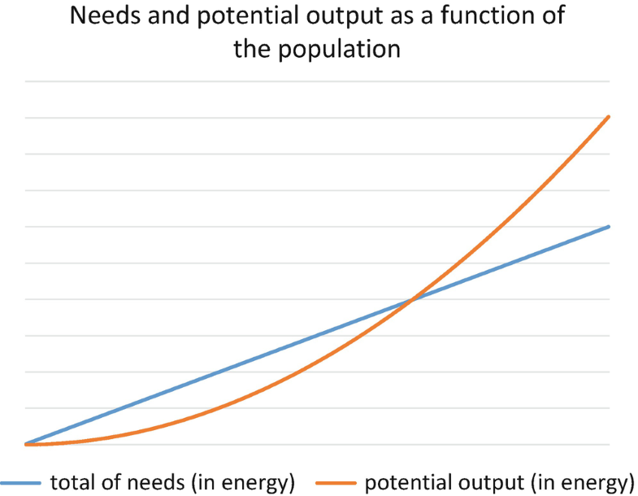
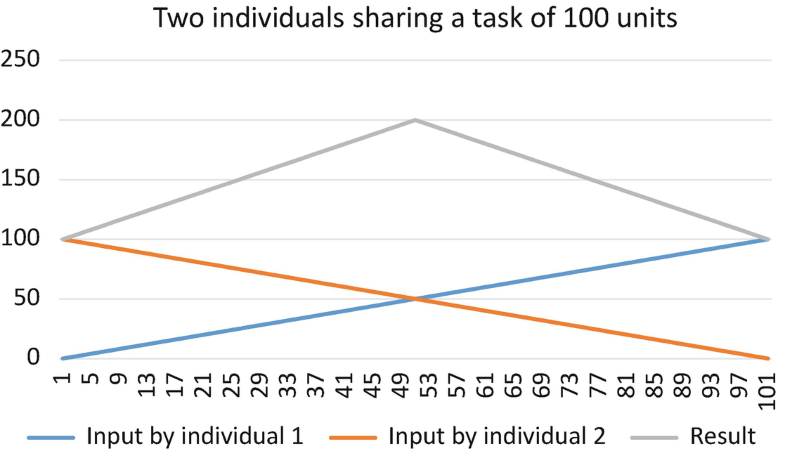
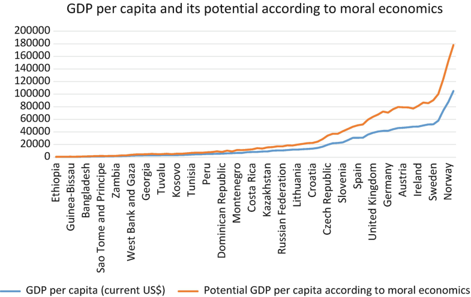
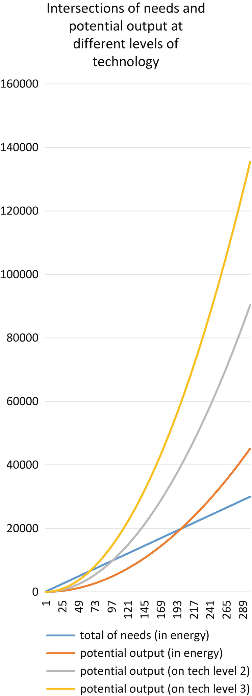

# Economía moral: una base teórica para construir el próximo sistema económico {#Capitulo_15}

Este artículo explora el concepto de economía moral en la compleja interpretación del autor. La economía moral es un nuevo enfoque de la estructura y naturaleza del sistema económico, que sugiere cambios en varios puntos críticos. El artículo es un trabajo interdisciplinario entre la filosofía y la economía, pasando de la teoría a la práctica, del pasado al presente y equilibrando lo normativo y lo positivo. El propósito es cambiar la comprensión económica y la lógica económica percibida mediante la incorporación del factor moral en modelos integrales.

## Introducción {-}

Este artículo tiene como objetivo dar un esbozo -a esta escala y en este ámbito, sólo puede llamarse esbozo- de la economía moral y de la economía moral. La economía moral aún no es una filosofía económica bien establecida. En interpretaciones más recientes, es una nueva escuela de pensamiento económico, que aún busca y allana sus propios caminos y oportunidades.

La interpretación de la economía moral de este artículo tiene como objetivo proporcionar elementos suavizantes y completos al sistema existente. Sin embargo, la economía moral también apunta a redefinir la economía tal como la conocemos hoy, agregando el factor moral a sus implicaciones. El nuevo concepto enfatiza la naturaleza finita de los recursos de la humanidad, los intereses de la comunidad además de los intereses del individuo, toma en cuenta las necesidades de las generaciones futuras y calcula dando a otras especies espacio y oportunidad para vivir (Tóth2016, 38). En la interpretación actual, los puntos a destacar más deberían ser que, como filosofía de la economía, está organizada para compartir, y que incluye el altruismo racional en sus mecanismos.

*No hacer esta conexión entre moralidad y economía podría causar daño. "De hecho, separar la moralidad de la economía, que parece una" purificación "disciplinaria, es en realidad la regresión en el desarrollo de la economía". (Wang2015, 84).*

### Esquema y método {-}

En términos de preguntas de investigación, existen múltiples objetivos. Las preguntas se pueden agrupar en cuatro categorías principales, a las que cada capítulo principal responde respectivamente.

Primero, las preguntas sobre la taxonomía de la economía moral: ¿Dónde están sus raíces? ¿Cómo el término moldeó y cambió su significado durante los siglos pasados? ¿Cómo se puede aplicar en la actualidad? ¿Dónde se puede ubicar la economía moral en el mapa sombreado de los sistemas económicos?

Segundo: ¿La estructura moral de la sociedad y el mecanismo resultante se corresponden con el punto de vista smithiano y su interpretación? ¿Es el sistema ascendente de mecanismos capitalistas sostenible para las economías modernas? ¿Es razonable construir un sistema económico sobre la base del egoísmo individual?

En tercer lugar, las preguntas dirigidas al aparato de la economía moral: ¿Cuáles son los mecanismos y estructuras que lo harían funcionar? ¿Qué significa equilibrio en la economía moral, o más exactamente, dónde está el punto de equilibrio que debe alcanzarse en este nuevo contexto propuesto?

Y cuarto, pero no menos importante, la pregunta que conecta los hallazgos anteriores con el presente: ¿Cuáles son las herramientas actuales para migrar al sistema económico moral?

A lo largo del artículo hay un cambio de la orientación teórica a la práctica, así como de una visión del futuro a un enfoque en el presente. Además, no es ni claramente positivo ni puramente normativo. El intento de establecer un sistema unificado y completo de pensamiento económico moral lo inclina ligeramente hacia la dirección positivista, pero su contexto y lugar en el espectro económico le confiere un carácter normativo. La naturaleza normativa no debe percibirse como una debilidad, como economistas contemporáneos, como Tomáš Sedláček (2012, 21), defienden la normatividad de la economía misma.

### Supuestos de referencia {-}

La necesidad de cooperación es más bien una característica de la comunidad y extrínseca a los individuos, derivada de los estilos de vida que ellos mismos crearon. La necesidad de ayudar a los demás, respetar a los demás y elevarlos, por otro lado, es intrínseca a los mecanismos humanos individuales. Esta necesidad se puede llamar altruismo racional. Uno de los objetivos del artículo es demostrar cómo funciona mejor la economía, es decir, cómo sus modelos forman un sistema más integral, si se incorpora el factor moral, tanto a nivel individual como en términos de mecanismos.

El documento describe el orden económico de la siguiente manera: Una comunidad tiene orden económico, si las necesidades de los individuos están completamente satisfechas, sin exceder las necesidades-objetivos individuales, es decir, sin desperdiciar recursos, y si la satisfacción de las necesidades está asegurada para el futuro mediante la interacción sostenible con el entorno.

La novedad de esta definición radica en el énfasis en las necesidades y la precisión. Este tipo de precisión implica una distribución eficaz. La primera parte presagia la necesidad de cuantificar las necesidades humanas. La segunda parte de la definición no es nueva, sin embargo, debe establecerse como un requisito previo para el orden económico.

La economía moral tiene una visión no hedonista sobre el bien general. No es el placer en sí mismo lo que debe maximizarse, sino más bien el orden. Este orden tiene tres componentes que son reglas que van en contra de las tendencias actuales:

Primero, a nivel individual, la buena voluntad para el conjunto tiene que superar al ego, es decir, las personas deben tomar conciencia de las causas y consecuencias del altruismo racional. Las personas deben tener suficiente información, una visión general y una comprensión del sistema, para que reconozcan los beneficios de compartir activos y alegrías con otros seres humanos. En segundo lugar, el placer de cualquier tipo es más valioso si se lo da a quienes más lo necesitan. Como Tóth (2016, 200) escribe: “El crecimiento material de los fuertes a toda costa no debe ser reemplazado por el decrecimiento o el crecimiento cero, sino por el crecimiento de los débiles, ya que su utilidad - y por lo tanto la utilidad objetiva de aquellos en situaciones más avanzadas - se ve muy incrementado por su crecimiento material ”^[Traducción propia. Original en húngaro: "az erősek mindenáron való anyagi növekedése helyére nem a csökkenés vagy zéró növekedés kerül, hanem a gyengék növekedése, hiszen az ő hasznosságukat - és ezzel a fejlettekmektív .]. En tercer lugar, y finalmente, durante toda la producción y distribución, el medio ambiente debe permanecer en un estado sostenible.

Para resumir el párrafo anterior: la conciencia económica humana tiene tres niveles en la economía moral, y solo un sistema en el que se mantienen las tres reglas y el desinterés se expande al todo, puede llamarse economía moral.

### El enfoque {-}

Dado que la economía moral en el contexto más amplio es una teoría relativamente nueva, hay que afirmar que la interpretación actual es la del autor de este artículo. Se basa parcialmente en la literatura relevante, pero va más allá en muchos aspectos, comenzando con los conceptos básicos del enfoque.

El artículo tiene cinco axiomas subyacentes, de los cuales no todos tienen prueba científica en la actualidad. En ciertos casos, estamos hablando de conceptos que ya han sido debatidos durante miles de años, y no está dentro del alcance de este artículo dar pruebas o respuestas a las preguntas filosóficas relacionadas. Sin embargo, es necesario incorporar los axiomas, ya que son necesarios para esbozar la economía moral.

En primer lugar, se asume como premisa la objetividad de la moralidad. Aunque esta supuesta objetividad no ayuda directamente en ciertos dilemas o juicios morales, refuerza la postura intuitiva de que el avance moral es significativo y que el progreso tiene una cierta dirección. Con respecto a la definición de moralidad, el artículo toma prestado de Wang Xiaoxi (2015, 56), un economista chino contemporáneo, la siguiente frase: “Científicamente, la ética tiene la función de alentar a las personas a mejorarse constantemente y, al mismo tiempo , apreciar y mejorar continuamente las relaciones interpersonales dentro de la coexistencia, para construir un mejor entorno de vida basado en el concepto de existencia racional, impulsando el desarrollo social sostenible ”.

En segundo lugar, ahora se ve a la humanidad como una entidad que constituye una gran comunidad. Esto no solo es evidente entre los historiadores, sino también para el director ejecutivo de la corporación de redes sociales más grande: “La historia es la historia de cómo hemos aprendido a unirnos en números cada vez mayores, desde tribus hasta ciudades y naciones. (…) Hoy estamos cerca de dar nuestro próximo paso ”. (Zuckerberg2017). Además del aspecto social, esta afirmación también es válida para la economía. Sin embargo, se intenta cuidadosamente mantener un equilibrio saludable entre el énfasis de los individuos y la comunidad, a lo largo de todo el documento.

En tercer lugar, se asume que la humanidad tiene un objetivo: aumentar el bienestar humano. Se está logrando mediante un progreso lineal hasta cierto punto.

La cuarta premisa es la del altruismo racional. Es una necesidad humana intrínseca de cierto altruismo. Definitivamente, esta necesidad está bastante arriba en nuestras pirámides de necesidades, pero existe e influye en los humanos. Para confirmar la relación existente entre las pirámides de necesidades y la moralidad, Wang (2015, 68) debe citarse nuevamente: “el hombre tiene sus propios tipos diferentes de actividades únicas, entre las cuales, las de niveles más altos están todas relacionadas con la mortalidad”.

En quinto lugar, pero no menos importante, este artículo adopta la postura de que las necesidades humanas individuales no son infinitas ni insaciables. Se pueden experimentar expectativas crecientes cuando las necesidades en niveles cada vez más altos se satisfacen, pero estas expectativas son solo el reconocimiento de necesidades que ya existían y tienen un fin racional, que sería más visible en un mundo ordenado y justo, adaptado a las necesidades de las personas. .

Estos axiomas pueden ser una cuestión de fe, pero algunas voces ya se hacen eco de que también lo son los axiomas de la economía dominante (Tóth 2016, 198; 284). La razón especial por la que estos axiomas tuvieron que enunciarse es su naturaleza intuitiva. Aunque, como se verá en los próximos capítulos, los modelos económicos morales, los principios y las sugerencias están destinados a construirse racionalmente, el sistema se basa principalmente en axiomas intuitivos.

## Historia conceptual y contexto ideológico {-}

Los dos capítulos siguientes profundizan en la historia conceptual de la economía moral y su contexto ideológico. En el primero, el artículo examina las raíces y apariciones históricas del concepto, en el segundo, si es adecuado para ser el próximo paradigma. Esta es una parte crucial, porque también ayuda a comprender de qué se aleja el concepto actual de economía moral, y de qué está debatiendo, o al menos criticando.

### Breve historia del concepto económico moral {-}

El concepto de economía moral y de economía moral utilizado en este trabajo no debe confundirse con el concepto que se examina en el contexto de las economías campesinas del siglo XVIII, y cuyos primeros resultados encontramos al buscar por las palabras “economía moral”. " En Internet^[Esta búsqueda se realizó a través de Google el 2 de septiembre de 2017.]. El historiador británico EP Thompson introdujo el término economía moral en la agenda histórica en un artículo de 1971 (La economía moral de la multitud inglesa en el siglo XVIII) , pero la forma en que lo usó, permaneció "ligado a un época y un contexto histórico particular ” (Götz2015, 147). Según el historiador sueco Norbert Götz, "el concepto [la economía moral] tiene el potencial de mejorar la comprensión de la sociedad civil moderna". Götz también expresó su preocupación por el concepto de economía moral de Thompson que de hecho no tiene implicaciones morales, mientras que el propio Thompson estaba “preocupado por la preservación conceptual del contexto histórico que había asignado al término y por una posible pérdida de especificidad en su libre adaptación por otros ”. (2015, 153). Esto indica una tensión bastante significativa entre las interpretaciones del pasado cercano y el presente, pero existen tensiones incluso entre las versiones actuales de la economía moral.

Por ejemplo, este artículo se separa de aquellos conceptos económicos morales que tienen su énfasis en la religión o las emociones, sin vincularlos directamente o incrustarlos en la economía. La literatura húngara pertinente sobre la emoción economía y humanas economía puede ser nombrado^[Traducido por el autor de los términos húngaros “érzelemgazdaságtan” y “humánökonómia” .], escrito alrededor de los economistas Balázs Hámori y Gergely Tóth, respectivamente. Según el autor de este artículo, la economía moral debería ser un término más amplio, ya que los enfoques antes mencionados "no abordan las cuestiones económicas de la manera en que se entienden comúnmente" (Götz2015, 147).

El término economía moral ya ha tenido otras apariciones a lo largo de la historia. Las dos palabras provienen del latín y del griego antiguo, respectivamente. Según Götz, la palabra moral no necesitó añadirse a la economía hasta mediados del siglo XVIII, ya que la palabra economía contenía moralidad evidentemente. Se cree que la primera aparición del compuesto tuvo lugar en 1729, "en un sermón predicado ante la Universidad de Cambridge" . El momento en que el término apareció en segundo lugar fue en las cartas atenienses , publicadas en 1792 (circuladas en privado unos cincuenta años antes):“Fue utilizado en una carta supuestamente escrita por el rey persa Smerdis en correspondencia con su agente en Atenas en el momento de la guerra del Peloponeso” , refiriéndose a la deidad, de manera similar a la primera ocurrencia. La tercera aparición (anglosajona) se produjo en 1762, en un poema de Amyas Bushe, celebrando “la armonía de la voluntad humana que estaba igualmente determinada por la razón y la pasión” . Mientras tanto, Rousseau discutió la economía moral en su artículo de Encyclopédie , con una connotación similar de justicia y equilibrio. Un significado explícito del término economía moralfue aplicado por otros autores, por ejemplo, Fortunato Bartolomeo de Félice (1769), Louis-Claude de Saint-Martin (1774), Johann Friedrich Wilhelm Jerusalem (1774) y Johann Friedrich von Ungern-Sternberg (1785), quienes “contrastaron la economía física de todas las criaturas con la economía moral propia de la condición humana ” . Lo mismo hizo la Encyclopædia Britannica , en su tercera edición (1797). “A finales del siglo XVIII, el término 'economía moral' pasó a formar parte del título de un diccionario francés que distingue la economía política, civil y moral (Beauvray, 1770) (Götz2015, 149). "

Más adelante, en el siglo XVIII, “la administración francesa en Renania (…) esperaba que los puestos de educación superior establecieran 'un Professeur d'économie morale'” , lo que fue más bien una explotación evolutiva del concepto. Siguiendo con el tema de la Revolución Francesa, "Michio Shibata usó con frecuencia la economía moral al discutir los disturbios por alimentos en el antiguo régimen y los sans-culottes parisinos en la revolución". Asimismo, el economista Jean Herrenschwand “dedujo ideas sobre la evolución de sistemas económicos cada vez más avanzados ” “en su obra principal, De l'économie politique et morale de l'espèce humaine” (1796) (Götz2015, 150). Vale la pena mencionar a Adam Smith en este punto, quien no ha usado el término economía moral él mismo, pero cuyo legado es mencionado ocasionalmente por algunos de sus discípulos y sus exégetas modernos como su economía moral (Götz2015, 153-154).

Hubo varias interpretaciones religiosas de la economía moral en los siglos XVIII y XIX, y fueron los reformadores radicales quienes emplearon el concepto en mayor medida (Götz 2015, 150-151). Desde principios del siglo XIX en adelante, el término economía moral “podría asociarse tanto con el capitalismo como con el socialismo (Götz2015, 151). El próximo capítulo expondrá las relaciones de estas ideologías y paradigmas económicos con la economía moral con más detalle.

Después de la publicación del artículo de EP Thompson en 1971, “las referencias a la economía moral han proliferado […] como un eslogan de críticos del sistema de mercado ” y se han establecido muchas más nociones extendidas, también en el sector sin fines de lucro. Si el énfasis está en la palabra "moral" o en "economía" varía (Götz2015, 155–57).

La ciencia ficción ha producido una variedad de mundos económicos morales, por ejemplo, a través de la pluma del autor Thomas Dick (Götz 2015, 151). La civilización espacial llamada Mül de la serie de cómics de ciencia ficción francesa Valérian y Laureline (1967-2010) también tiene ciertas características de economía moral. Más adelante en el artículo se demostrará que, aunque la humanidad no tiene convertidores Mül (criaturas que pueden replicar todo lo que comen), una economía ordenada en armonía con la naturaleza (como la de Mül ) también es factible para los humanos.

Ninguno de los enfoques e interpretaciones enumerados se corresponde con el concepto económico moral del presente artículo. Los intentos de ampliar el significado de la economía moral son solo de origen reciente. Todavía no hay ningún grupo en la esfera académica que se autodenomine economistas morales o representantes de la economía moral. El término economía moral no se ha utilizado oficialmente en la academia hasta ahora, ya que aún no se han elaborado los mecanismos y una descripción económica completa.

El concepto económico moral de este artículo no es una referencia a determinadas relaciones económicas, ni a ninguna dimensión o sector particular de la economía. Es sinónimo de la estructura ideal de la economía, construible por la humanidad, por lo que abarca un sistema más amplio que el concepto de la economía de mercado moderna.

### Contexto ideológico y posicionamiento {-}

La economía moral es un candidato al nuevo paradigma económico, un puesto para el que no hay muchos candidatos. Incluso el chinismo del economista polaco contemporáneo Grzegorz Kolodko (Kolodko2018, 23) se afirma que es solo un período de transición, sin importar cuánto dure.

Durante muchas décadas, la profesión económica ha excluido (o al menos no ha considerado seriamente) oportunidades de tercera (o cuarta, etc.) variantes para ser paradigmas económicos. La razón de esto puede estar en la naturaleza de las alternativas, que en realidad nunca han salido de la dicotomía socialismo-capitalismo. El debate ideológico se ha centrado principalmente en las opciones entre los dos (con importantes deficiencias sistémicas) y las compensaciones de sus diferentes variaciones. La economía moral tiene más dimensiones: explicaciones, principios y soluciones (que se presentarán más adelante) que están resolviendo o disolviendo los problemas de sus predecesores, al menos en teoría.

En la actualidad, China es un sistema socialista autoproclamado (Wang 2015, 57) sin embargo, tiene características mixtas e incluso elementos distintivos de los dos tipos principales de sistemas económicos. El socialismo y el capitalismo, dos ideologías gigantes de la economía y la política (e incluso la cultura), tienen una literatura enorme^[El economista húngaro contemporáneo más conocido, János Kornai, tiene un trabajo de por vida en estos temas.], y durante la mayor parte del siglo XX fueron estos dos los que “funcionaron y se enfrentaron en la práctica” (Kolodko2018, 2).

En cuanto a las ideologías económicas, las generaciones recientes no han heredado un consenso sobre los diferentes significados que se les atribuyen. De hecho, todavía existe una "confusión en las definiciones y la falta de disciplina metodológica" (Kolodko2018, 2) .La razón de esto debe buscarse (parcial o principalmente) en las diferentes variaciones de estos regímenes económicos, no solo en el espacio, sino también en el tiempo (Kolodko 2018, 3), que ya plantea dos cuestiones para la economía moral. Es decir, que si va a ser el próximo sistema económico, ¿debe ser universal, o universal solo en cierta medida, y si la universalidad de un sistema económico sería un obstáculo para su implementación en términos del respeto por la cultura local (el la palabra local podría abarcar continentes enteros aquí, ya que puede representar ciertas regiones). De hecho, el documento no llega tan lejos como en la implementación. La economía moral puede, al final del día, ser un sistema mejor o peor que la economía moral teórica, la economía moral científica o, me atrevería a decir, los libros de texto que la economía moral haya prescrito alguna vez.

El socialismo en el siglo XX en general fue demasiado ambicioso en comparación con los escenarios históricos, sus medios tecnológicos y el conocimiento disponible. Para la economía moral, los tres factores han cambiado. Se estima que la distancia entre la situación actual y la meta declarada puede medirse en unidades de décadas o incluso solo años.

Kolodko (2018, 2) describe el capitalismo muy brevemente en comparación con su alcance como "un sistema socioeconómico basado en el capital privado que aspira a maximizar sus ganancias" , pero incluso esta definición concisa está en una gran contradicción con la economía moral, que se basa en las necesidades (incluyendo la necesidad de ayudar a los demás) y aspira a maximizar el bienestar de manera racional.

En su artículo de conferencia sobre el Chinismo, Kolodko (2018, 3-6) incluye una serie de variaciones del sistema económico del rango (o más bien del plano) del socialismo-capitalismo. Solo por nombrar algunos ejemplos: capitalismo clásico, comunismo ideal, socialismo con características chinas, capitalismo de estado, la socialdemocracia ideal, la economía social de mercado de los países escandinavos, el poscomunismo, el capitalismo de estado postsoviético, los mercados emergentes con una dimensión social. orientada hacia la economía capitalista y el capitalismo contemporáneo. Las variables de su categorización fueron tomadas del difunto economista italiano Mario Nuti y son las siguientes: propiedad y empresa públicas dominantes, igualdad y gran consumo público, democracia económica y participación, control social de las principales variables económicas (empleo, ingresos, acumulación). , crecimiento, inflación, balance interno, balance externo). Si ignoramos algunas dimensiones de la economía moral y tratamos de forzarla en este esquema, podemos decir que esta proyección perpendicular está más cerca de la existencia de todos estos factores que de su inexistencia. Con base en la evaluación estricta (método de categorización de Nuti) de estos factores, la proyección de la economía moral es 37,5% de capitalismo y 62,5% de comunismo, pero estos números son ilustrativos y no son adecuados para sacar conclusiones.

La economía moral no se diferencia de otras ideologías en que apunta a crear el marco económico perfecto para la coexistencia y cooperación humanas. Sin embargo, es nuevo en el sentido de que, como afirma este artículo, es la primera categoría en el mapa taxonómico extendido (multidimensional) de sistemas económicos que ha encontrado los modelos que constituyen el marco perfecto, y aunque la afirmación no está probada empíricamente en el A mayor escala aún, la mayoría de los próximos capítulos están contribuyendo a su verificación, dejando una puerta abierta a la falsabilidad, hasta los axiomas y la razón de ser del sistema .

## Adam Smith revisado {-}

Este capítulo tiene como objetivo proporcionar un nuevo enfoque de las ideas morales y económicas de Adam Smith^[Este capítulo se basa en gran medida en un ensayo del autor de este artículo, con el título Adam Smith Revisited - An Inquiry into the Present-day Relevance and Applicability of his Major Works , entregado para la asignatura Economía Política Internacional , 2017/18. , I. semestre en la Escuela de Negocios de Budapest - Universidad de Ciencias Aplicadas.], basándose en cierta medida en las obras originales, The Theory of Moral Sentiments (1759) y una investigación sobre la naturaleza y las causas de la riqueza de las naciones (1776), pero también teniendo en cuenta nuevas fuentes secundarias. Algunas de las ideas ampliamente aceptadas, interpretadas (y mal interpretadas) son cuestionadas en el contexto de la disciplina de la economía política internacional.

Adam Smith (1723-1790) estaba definitivamente en el momento adecuado (en los albores de la industrialización y la Ilustración escocesa) en el lugar adecuado (Escocia, Gran Bretaña) con sus ideas, pero en la actualidad, estas ideas deben ser revisadas. Sus ideas han sido muy influyentes, pero siguen siendo controvertidas, a menudo simplemente seleccionadas por filósofos y políticos de ambos lados del espectro político (BBC World Service2017).

Las preguntas de investigación para este capítulo parten de un capítulo del libro de Varoufakis Foundations of Economics : A Beginner's Companion (1998, 16-21). En sus dos obras principales, Adam Smith intentó justificar los sistemas humanos (el de la moral y el de la economía) a través de mecanismos inherentes a los individuos y sus interacciones. Los dos modelos son en realidad similares en su marco, pero no necesariamente perfectos.

### La estructura moral de la sociedad {-}

En la economía política temprana es común ver referencias a la moralidad (Sayer 2000, 84). En su obra The Theory of Moral Sentiments  , que es en opinión de muchos más de carácter psicológico que filosófico, Adam Smith construyó un sistema moral basado en juicios individuales y empatía (incorporando la noción de "espectador imparcial" en su modelo) , "En lugar de comenzar desde un punto de vista filosófico por encima de esos juicios" (Enciclopedia de Filosofía de Stanford2013). Adoptó un enfoque de abajo hacia arriba (BBC World Service2017), un método que también utilizó en The Wealth of Nations . Aun así, Smith era un universalista moral, que seguía la tradición estoica, pensando "que nuestros sentimientos morales se extienden, aunque en menor grado, a todos los seres racionales y sensibles" , y que aspiraba a proporcionar "una estructura para la moralidad que se extienda a través de fronteras nacionales y culturales ” (Enciclopedia de Filosofía de Stanford2013).

La imagen y la postura moral con respecto a la sociedad en La riqueza de las naciones parecen contrastar o desconectarse de la de La teoría de los sentimientos morales . En la interpretación de Varoufakis del primero, la actitud pragmatista de Smith sugirió que no está en el interés (directo) de la clase mercantil y capitalista contribuir al bien de la sociedad. Se guían por la codicia, y si no fuera por la coordinación automática, no tomarían las acciones que mejoran el bien público (Varoufakis1998, 18). Smith entendió el interés propio en La riqueza de las naciones de manera diferente que en La teoría de los sentimientos morales . En el segundo, pareció comprender que el egoísmo es una concepción errónea del interés propio, mientras que en el primero abandonó la estructura moral. En The Theory of Moral Sentiments Smith es consciente de la superioridad de la moralidad, en la que "un agente virtuoso ve cosas que otros no ven" y donde la moralidad "es una forma de cooperar con la Deidad" (Stanford Encyclopedia of Philosophy2013).

En un mundo que se está acercando, pero que también se está separando rápidamente a través de su interconexión sin precedentes, se elevan nuevos niveles de consenso moral, mientras que las diferencias previamente ocultas en las opiniones de las personas salen a la luz. Sin embargo, en la actualidad, la humanidad tiene un conocimiento más amplio sobre la moralidad, así como una imagen más elaborada de la estructura moral de la sociedad y de la moral empresarial, que en la época de Smith. El trabajador en general (o empleado), que también es consumidor, tiene una mejor oportunidad de ver cómo contribuye a los flujos de la economía. Este tipo de inclusión y la sensación de ser parte de algo más grande facilitan el cumplimiento de las pautas corporativas o de la economía en general. Además, los límites entre los "capitalistas" de hoy y los empleados se están desvaneciendo en múltiples fronteras, por ejemplo, mediante la promoción y la participación en el lugar de trabajo, o mediante oportunidades de emprendimiento ampliamente disponibles. Además, a través del enfoque de RSE, que ahora es casi obligatorio, así como de sus declaraciones de misión, las empresas de diferentes tamaños han comenzado a cultivar su capital moral. En economía moral, esto se considera un paso adelante teóricamente, sin importar si ocurre impecablemente en la práctica o no. Los empresarios modernos expresan abiertamente cómo operan sus negocios por el bien de la sociedad y muchos de ellos participan en actividades filantrópicas. empresas de diferentes tamaños han comenzado a cultivar su capital moral. En economía moral, esto se considera un paso adelante teóricamente, sin importar si ocurre impecablemente en la práctica o no. Los empresarios modernos expresan abiertamente cómo operan sus negocios por el bien de la sociedad y muchos de ellos participan en actividades filantrópicas. empresas de diferentes tamaños han comenzado a cultivar su capital moral. En economía moral, esto se considera un paso adelante teóricamente, sin importar si ocurre impecablemente en la práctica o no. Los empresarios modernos expresan abiertamente cómo operan sus negocios por el bien de la sociedad y muchos de ellos participan en actividades filantrópicas.

### La durabilidad de un sistema económico ascendente {-}

Los sistemas económicos tienen fronteras desde abajo y desde arriba, por lo que la coordinación automática smithiana tiene sus límites (Varoufakis 1998, 17). Esto es cierto incluso en la economía de mercado actual. Con respecto al límite inferior: el mecanismo económico descrito por Smith no es lo suficientemente eficaz para llegar a los que están en la base de la sociedad. En cuanto al límite superior: el daño ambiental aumentaría a través del capitalismo puro. La economía como máquina de crecimiento no es sostenible desde el exterior.

No es raro en la filosofía económica que las respuestas generen más preguntas. La pregunta que surge del párrafo anterior es si, con las medidas necesarias tomadas, el capitalismo smithiano es adecuado para el ámbito económico dentro de los límites mencionados. Esta no es una pregunta hipotética, ya que los países desarrollados, desde este punto de vista de formas ligeramente diferentes, están tratando de abordar los problemas globales más allá de los límites inferiores y superiores, es decir, la pobreza y el cambio climático. Entre esos límites (y en realidad extendiéndose sobre ellos) sus mercados funcionan en estructuras capitalistas.

La durabilidad económica radica en un estado de equilibrio. En un mercado siempre perfecto, el capitalismo smithiano está conduciendo al equilibrio de la oferta y la demanda. Pero el problema no radica en la imperfección del mercado. Es la elección incorrecta de factores para el equilibrio. Un sistema económico de abajo hacia arriba, donde la oferta y la demanda se encuentran, puede tener el valor de la libertad de elección, pero no es completamente seguro en la macroescala. Sin embargo, si la elección de los factores para el equilibrio depende de las necesidades de la población y de su producción potencial, se puede crear un sistema económico más completo y perfecto. Este es un enfoque de arriba hacia abajo y, como ha demostrado la historia (a través de varios fracasos), la humanidad no ha estado técnicamente preparada hasta ahora para el cambio. Este documento tiene como objetivo hacer un punto para que la humanidad dependa menos del SmithianConsecuencias no deseadas en economía. En las circunstancias actuales, es más razonable cultivar las funciones morales de los estados que negarlas y mantener al mínimo el papel del estado. Desde la perspectiva actual, las opiniones políticas de Smith pueden parecer distorsionadas. “Creía que los estados podían y debían redistribuir la riqueza hasta cierto punto y defender a los pobres y desfavorecidos de quienes ejercen el poder sobre ellos en el sector privado” , pero se mostraba escéptico hacia el progresismo y “desconfiaba de los planes a gran escala para la reforma de la sociedad ” . “ Fue uno de los primeros y más fervientes defensores de los derechos y virtudes de los pobres” , pero su“Los escritos están impregnados por una falta de respeto por el tipo de personas que se dedican a la política” (Enciclopedia de Filosofía de Stanford2013). Derivado de las contradicciones citadas, no es posible crear un sistema social y económico armonioso basado únicamente en el legado de Smith.

### Equivocación en sus raíces: en qué se basa realmente el sistema más amplio {-}

Adam Smith descubrió varias características del diseño económico de la sociedad (el poder de la división del trabajo, la dinámica de la oferta y la demanda y la mano invisible ), pero en la explicación puso la piedra fundamental equivocada. Este artículo sostiene que el mecanismo económico de todo el sistema (es decir, la sociedad, nacional y mundial) no se basa en el egoísmo, sino en las necesidades. El egoísmo es un rasgo negativo, mientras que las necesidades son fenómenos naturales y, por tanto, neutrales.

El mundo es muy complejo desde el punto de vista de las necesidades. Por el momento, en un sentido de necesidad extendido, la mayor parte de la humanidad todavía está tratando de sobrevivir. Sin embargo, muchos en el mundo desarrollado se han dado cuenta de que la humanidad superaría más rápidamente este problema si se preocupara por los más necesitados. Este reconocimiento se remonta a suficiente conocimiento e información, que la mayoría de la gente en la época de Adam Smith, e incluso el propio Smith, puede que no tuvieran.

Un sistema construido principalmente sobre el egoísmo fracasará a largo plazo. Prueba de ello son los modelos de teoría de juegos (Adami y Hintze2013) así como alternativas científicas al homo oeconomicus (Alger y Weibull2013). El egoísmo no da sus frutos a largo plazo, y el homo moralis tiene más posibilidades de éxito en la evolución que el homo oeconomicus.

Varoufakis (1998, 21) escribe en su interpretación de Smith que “a medida que se acelera la acumulación de capital y el crecimiento económico , las desigualdades entre clases se reducirán; personas de diferentes orígenes comenzarán a acercarse en las escaleras mecánicas cada vez mayores ". En el siglo XXI se observan otras tendencias. Las tijeras no se cierran, se abren:“¿Cómo podemos decidir si hay una ganancia neta para la sociedad? En su declaración de la mano invisible, Smith se refiere a los ingresos anuales de la sociedad o la renta nacional, como diríamos hoy. Esto indica que la sociedad gana si los ganadores en el proceso de cambio estructural ganan más de lo que pierden los perdedores. Pero este no es un argumento del todo convincente. Supongamos que los que ganan ya están bien, mientras que los perdedores viven en la pobreza. ¿No dudaríamos en este caso en decir que la mano invisible del mercado trabaja en interés de la sociedad? Y si es así, ¿qué principios deberían guiar nuestra agregación de intereses individuales en una medida del interés de la sociedad en su conjunto? ” (Sandmo2014, 7).

A estas alturas, la economía tiene evidencia y explicación bien fundamentadas para abrir las tijeras en la riqueza social. Como Thomas Piketty (2014, 571) afirma en la Conclusión del capital en el siglo XXI : “La principal fuerza desestabilizadora tiene que ver con el hecho de que la tasa privada de rendimiento del capital (...) puede ser significativamente más alta durante largos períodos de tiempo que la tasa de crecimiento de la renta y la producción (…). La desigualdad implica que la riqueza acumulada en el pasado crece más rápidamente que la producción y los salarios. (…) El emprendedor tiende inevitablemente a convertirse en rentista, cada vez más dominante sobre aquellos que no poseen más que su trabajo. Una vez constituido, el capital se reproduce más rápido que la producción ”.

Dígalo en defensa de Adam Smith: sus ideas eran consistentes en el contexto de su propia época, la época de los pequeños fabricantes y la competencia, aparentemente cada vez más perfecta.

## Mecanismos y estructuras {-}

En este punto, el artículo pasa a los modelos actuales de economía moral a nivel micro y macro. En los primeros tres capítulos, hay un arco a observar, a lo largo del cual la economía moral reconstruye la economía misma. Vuelve a lo básico y tiene un punto de partida diferente. Comienza con el altruismo del individuo y construye el sistema hasta la ecuación dinámica de las necesidades y la producción agregadas, mediante la introducción del multiplicador de participación. Los tres capítulos siguientes exponen estos modelos y ajustan el sistema creado.

### Homo moralis y altruismo racional {-}

En el contexto de este artículo, el concepto de homo oeconomicus es marginal. Este punto de vista está tomado de Ingela Alger y Jörgen W. Weibull (economistas contemporáneos), más específicamente de su artículo “ Homo moralis - evolución de preferencias bajo información incompleta y emparejamiento selectivo” . Allí escriben que “la noción más general de homo moralis (…) debería reemplazar la noción más especial de homo oeconomicus (con grado cero de moralidad) como punto de referencia para la motivación humana” (Alger y Weibull2013, 29). Los dos investigadores no son los únicos en oponerse al homo oeconomicus como la noción de motivación económica general. Sin embargo, es su comprensión del individuo como un ser económico lo que se acerca más a la postura de este artículo: “Llamamos a los individuos con tales preferencias homo moralis y el peso que se le atribuye al objetivo moral el grado de moralidad. Un caso especial es el familiar homo oeconomicus , que concede un peso nulo a la moralidad. En el otro extremo se encuentra el homo kantiensis que atribuye un peso unitario a la moralidad (Alger y Weibull2013, 4). Wang (2015, 56) adopta una postura similar: “Lo cierto es que, en las actividades económicas reales , el sujeto de las mismas es el“ hombre moral ”, trayendo consigo responsabilidades económicas , sociales y ambientales, cuyo contenido es mucho más rico que el“ hombre económico ”. . " Por tanto, en términos de producción, el hombre está ciertamente controlado por cierta conciencia y guiado por ciertos valores. La conciencia moral del hombre afecta directamente y restringe su entusiasmo y liberación de energía ”.

Lo que el artículo actual está agregando a la noción de homo moralis es ubicar y describir su dimensión de altruismo. Hace aproximadamente dos siglos y medio, Adam Smith (1759, 1) escribió: “No importa cuán egoísta creas que es el hombre, es obvio que hay algunos principios (…) en su naturaleza que le dan un interés en el bienestar de los demás y hacen necesaria su felicidad (…)”.. El rasgo humano llamado altruismo racional en este artículo es racional porque, idealmente, los humanos se darían cuenta bajo ciertas circunstancias (es decir, si tuvieran suficiente información y conocimiento) que usar más recursos solo conduciría al desperdicio en lugar de aumentar el bienestar, por lo que redistribuiría recursos entre los miembros de la comunidad. Por múltiples razones, esto en su mayoría no sucede. La mentalidad general ve el sistema como abierto, las posibilidades de crecimiento como infinitas y, finalmente, las necesidades como insaciables. Ninguno de estos tres es cierto en economía moral. Vivimos en un sistema cerrado con límites, y el consumo de los individuos se puede detener en un cierto nivel manteniendo su bienestar de manera sostenible. Sin embargo, una vez que los últimos reconocimientos alcanzan la conciencia colectiva, siguiendo el interés propio (según la mano invisible) irá acompañado de un cierto autocontrol.

De hecho, la noción de mano invisible también se puede interpretar en el contexto moral, como Wang (2015, 57) lo hizo: "Como una" mano invisible de la racionalidad "o" poder de la racionalidad ", la moralidad se da cuenta de la operación racional de todo tipo de capital involucrado en la producción, guiando a las personas a maximizar las ganancias". También se pueden establecer paralelos entre el altruismo racional y el interés propio objetivo definido por la economista húngara Laura Baritz: "Las necesidades e intereses humanos reales incorporan el deseo de que a los demás les vaya bien"^[Tóth cita a Baritz (2014, 59). Traducción propia. Original en húngaro: "Az ember valódi szükségletében, önérdekében a mások jóllétének akarása is benne van".]. Y poniéndolo de forma negativa, como Wright (1999) cita a Herbert Spencer: "Nadie puede ser perfectamente feliz hasta que todos sean felices".

El altruismo racional como mecanismo tiene dos pruebas teóricas: una es que los seres humanos no pueden alcanzar la cima de sus pirámides de necesidades hasta que otros hayan alcanzado niveles similares de bienestar, porque el "respeto por los demás" necesita, lo que conduce de manera óptima a la autojustificación moral. no estaría satisfecho. La otra es que la humanidad no puede escalar más alto en la pirámide del progreso sin una mayor cooperación. Los dos fenómenos están relacionados, ya que la cooperación eleva a otros. Este es un genio del diseño humano, y puede ser una razón para el "vínculo entre la naturaleza humana y la historia humana" (Wright1999) en la interpretación del presente artículo, es decir, que las pirámides de necesidades y la montaña del progreso están vinculadas.

### El multiplicador de compartir {-}

Este capítulo tendrá como objetivo describir cómo compartir multiplica los beneficios obtenidos al compartir el valor. El valor compartido podría provenir de múltiples fuentes: de compartir información, conocimiento (know-how o know-why), (mejores) prácticas, ciertos servicios (por ejemplo, relacionados con el entretenimiento) o incluso propiedad física (pisos, automóviles, computadoras portátiles, etc. .). Los ejemplos de bienes que no se pueden compartir incluyen alimentos y agua, pero mediante la organización, se puede evitar el desperdicio.

En aras de la simplicidad, dejemos que el valor del bien compartido sea 1. Cada persona en el modelo posee algo de valor 1. Una conexión o una acción entre dos personas también tiene el valor de 1, derivado del desinterés racional. El número de personas es un número entero positivo: p. Si compartimos algo, estamos creando un valor superior al de lo que compartimos. Al igual que con compartir se satisface una necesidad psicológica de compartir o ayudar, el valor aumenta por el número de conexiones entre las personas ([p × (p - 1)] / 2). Si todos están conectados entre sí, y si todos comparten lo que poseen (p × 1), la fórmula de valor se ve así:

$$\mathrm{p}+([\mathrm{p} \times(\mathrm{p}-1)] / 2)$$

Simplificado:

$$\left(\mathrm{p}^{2}+\mathrm{p}\right) / 2$$

Esto es (p + 1) / 2 veces más que p (el número de personas) en sí mismo, que era el valor inicial del bien a compartir, como todos tenían 1. Entonces, si queremos crear un valor extra compartiendo , p, es decir, la cantidad de personas dispuestas a compartir valor, debe ser al menos 2, porque es cuando el multiplicador es mayor que 1:

$$(p+1) / 2>1$$

### La ecuación básica {-}

La dificultad de escribir ecuaciones económicas morales radica en el hecho de que su objetivo es crear y describir un mundo económicamente perfecto, mientras que el mundo nunca ha sido perfecto hasta donde sabemos.

Usemos las siguientes cartas de señalización para describir el macroequilibrio moral:

$$\begin{gathered}
p=\text { número de población } \\
O=\text { producto potencial (positivo) de las actividades humanas }(=f(p))
\end{gathered}$$

$N = necesidades (= f (p))$; En realidad, las personas tienen varias necesidades diferentes, pero estas se considerarán unificadas en este capítulo, ya que la complejidad de medir las necesidades excede el alcance del artículo.

Idealmente, es decir, si los sistemas de distribución funcionaban perfectamente, los humanos solo necesitaban producir la cantidad necesaria para satisfacer sus necesidades. Por tanto, se puede escribir la siguiente ecuación:

$$\mathrm{O}=\mathrm{N}$$

Ambos lados de la ecuación dependen de la población, por lo que esta ecuación define el número de población ideal (en un nivel de tecnología dado). En el Diagrama 5.1 se puede ver una estimación de cómo se verían estas funciones y cómo se cruzarían . A un nivel dado de tecnología (ceteris paribus), se supone que la producción potencial es igual a

$$\mathrm{p}+([\mathrm{p} \times(\mathrm{p}-1) / 2)$$

donde p es el número de personas y (p × (p - 1) / 2) el número de sus conexiones (en el mejor de los casos, todas están conectadas). Esta función representa el valor que las personas crean por sí mismas y al compartir.

**Figura 15.1** Total de necesidades y producción potencial en función de la población. (El diagrama fue establecido por el autor)

Como se ve en el diagrama, existe un punto de intersección. En un número de población por debajo de ese punto, la producción potencial es menor que las necesidades a satisfacer. Cuando se traduce en un escenario económico realista, esto significa escasez. Sin embargo, exceder la población ideal también conduce a problemas económicos: desempleo, desperdicio de recursos y una crisis económica que requiere aumentos artificiales de la demanda.

Como este diagrama representa un nivel de tecnología dado, este es también el principal determinante y el principal límite del número de población ideal. Al escribir “nivel de tecnología”, cada nivel puede entenderse como una etapa de cooperación materializada, incluida la conectividad, con una infraestructura en constante mejora. Subir de nivel en términos de tecnología requiere descubrimientos e invenciones históricas, por ejemplo, del pasado: el encendido del fuego, el alfabeto, la brújula, la imprenta, la máquina de vapor, el telégrafo, etc.

El modelo asume que no se desperdicia ningún producto. Esto nos obliga a consumir todo lo que producimos. El reciclaje y las energías renovables son, por tanto, cruciales. La aportación humana a estas industrias debe incorporarse en el cálculo de la producción potencial, de modo que todo el potencial humano se realice al tiempo que se produce exactamente la cantidad necesaria. En el otro lado de la ecuación, la cuantificación de las necesidades puntual y actualizada es tan importante como ya se señaló en el documento.

El diagrama es solo para ilustrar la naturaleza de las relaciones (entre el número de población, las necesidades y la producción), ya que está más allá del alcance de este documento calcular las necesidades y la producción potencial de miles de millones de personas, que ni siquiera están completamente conectadas. a partir de ahora. Además, las necesidades y las funciones de salida son actualmente más sensibles en la realidad, ya que hay varios factores que influyen. Sin embargo, en teoría, esto (Diagrama 5.1 ) es cómo se ven las necesidades y la producción agregadas en la economía moral. Por tanto, no son los números, ni siquiera las proporciones del diagrama, lo que son realistas e importantes, sino la forma de las necesidades y las funciones de producción potencial.

Los factores que desviaron la atención de esta relación bastante evidente, y que ocultaron la forma de las necesidades y las funciones de producción, fueron: la falta de conexión, la dependencia de recursos energéticos no renovables y la creencia de que las necesidades humanas son infinitas e insaciables.

### La medición económica moral de las desigualdades {-}

El siguiente microindicador de la desigualdad de tareas compartidas se puede aplicar a la división del trabajo, si las tareas son mensurables, a pesar de las diferencias en la naturaleza de las tareas. Supongamos que se supone que dos personas (que representan el nivel micro) comparten una tarea. El indicador básico de la desigualdad en el reparto de tareas entre dos personas se puede calcular de la siguiente manera:

$$\mathrm{U}=\left(\left\|\mathrm{I}_{1}-\mathrm{I}_{2}\right\|\right) /\left(\mathrm{I}_{1}+\mathrm{I}_{2}\right)$$

Con palabras: El factor de injusticia es igual al valor absoluto de la diferencia entre los compromisos individuales, dividido por la suma de los aportes de los individuos.

Como el valor absoluto de la diferencia está en el nominador, cuanto menor sea el valor de todo el indicador, mejor (menos injusto será el reparto de tareas). El valor más bajo posible es 0, el más alto 1. Si el valor es 1, eso significa que uno de los individuos está confiando y explotando completamente al otro.

Para la distribución de la riqueza entre dos personas, se puede utilizar una ecuación de estructura similar:

$$\mathrm{U}=\left(\left\|W_{1}-\mathrm{W}_{2}\right\|\right) /\left(\mathrm{W}_{1}+\mathrm{W}_{2}\right)$$

Según el concepto de altruismo racional, la desigualdad de riqueza (o ingresos) afecta negativamente al bienestar. De manera análoga, la desigualdad en el reparto de tareas afecta negativamente a la productividad.

En el nivel micro, tanto el nivel de bienestar como el de productividad deben multiplicarse por (2-U) para obtener un resultado. Si U es 0, eso da el bienestar o la productividad potencial, sin desigualdad, es decir, el doble de la base supuesta. Me viene a la mente el proverbio sueco "La alegría compartida es doble alegría" .

Se puede encontrar una ilustración de compartir tareas en el diagrama a continuación. La curva “Resultado”, que tiene el valor (2 – U) × 100, refleja el hecho económico moral de que compartir tiene un valor agregado, manifestándose en externalidades positivas (Gráfico 5.2 ).

**Figura 5.2** El reparto de tareas y su eficiencia de acuerdo con las leyes de la economía moral. (Establecido por el autor)

En el nivel macro, es similar a decir que el PIB de un país tendría el potencial de ser: el PIB dado + el PIB dado multiplicado por (1 - el coeficiente de Gini).

Potencial significa que este sería el PIB del país dado, si hubiera igualdad en la distribución y el reparto de tareas. Para ilustrar esto, el autor extrajo datos del PIB per cápita para los 80 países donde el índice de Gini estaba disponible para el año de 2010. (La razón por la que se seleccionó el año 2010 es que este es el último año redondo con la mayor cantidad de datos disponibles. ) Las cifras se han ordenado por PIB per cápita de forma ascendente. Como se puede ver en el diagrama, la igualdad marcaría la mayor diferencia de eficiencia en los países relativamente más ricos, algunos de ellos con brechas de ingresos relativamente amplias (diagrama 5.3 ).

**Figura 5.3** PIB per cápita y su potencial según la economía moral. (Banco Mundial 2010 ; y ediciones del autor)

Sin embargo, la prevalencia del altruismo racional (que es un requisito para alcanzar el máximo potencial de una comunidad determinada) depende del nivel de interconexión. La interconexión en una comunidad determinada se puede medir por el número de conexiones existentes (u oportunidades para conectarse), dividido por el número de todas las conexiones posibles: r / ((p × (p - 1)) / 2). Si esta proporción llega a 1, la comunidad está completamente conectada. Cuanto más interconectada sea una comunidad, mayores serán las posibilidades de que el altruismo racional cree mecanismos que conduzcan a la comunidad hacia la equidad y, por lo tanto, también hacia niveles más altos de productividad y bienestar. Esta subconclusión y las ecuaciones presentadas en este capítulo juntas son un intento inicial de dar la justificación económica (moral) de la igualdad.

## Herramientas y soluciones {-}

Este capítulo trata de relacionar ciertos fenómenos de la economía con la economía moral, porque pueden funcionar como herramientas para alcanzar un estado superior de bienestar.

### Robotización e Renta Básica Universal {-}

Tenemos un proceso de robotización rápido y masivo en nuestro umbral, que promete conducir a la abundancia, pero amenaza con la devaluación de muchas actividades y trabajos humanos. Muchos creen que esta será la primera era en la que podremos eliminar el factor humano del proceso de producción.

Mientras tanto, la política de Renta Básica Universal se perfila como una posible solución a los problemas económicos actuales. “Los gobiernos de todo el mundo están evaluando su uso y algunos se están embarcando en estudios piloto” (Coppola2017). Algunos llamarían a la RBU la vacuna social del siglo XXI. Su enfoque tiene características similares con la esperanza de un comunismo de lujo totalmente automatizado (Sadowski2016).

Las tendencias de robotización están interconectadas con las propuestas de Renta Básica Universal. Esto queda perfectamente ilustrado por el Borrador de Informe de la UE de 2015 con recomendaciones a la Comisión de Normas de Derecho Civil sobre Robótica (Delvaux2015). El informe llamó la atención del público principalmente mediante la introducción del concepto de personas electrónicas (Delvaux2015, 12) pero se refiere a la nueva revolución industrial, probablemente desencadenada por "robots sofisticados, bots, androides y otras manifestaciones de inteligencia artificial" , y también expresa las "preocupaciones sobre el futuro del empleo" (Delvaux2015, 3). Considera los casos de vehículos autónomos, robots médicos y reparación y mejora humana, solo por nombrar algunos ejemplos (Delvaux2015, 8–9). Hasta ahora, este plan es el documento legal público más completo y detallado sobre los dos temas vinculados de la robotización y la Renta Básica Universal. La exhaustividad radica en la sugerencia de "un enfoque coherente de la regulación a nivel europeo" (Delvaux2015, 4) e invitando a todos los Estados miembros a considerar seriamente una renta básica general a la luz de los posibles efectos de la robótica y la IA en el mercado laboral (Delvaux 2015, 10).

La economía moral apoya la robotización, ya que nos impulsa hacia la sostenibilidad. Los desafíos que plantea la robotización al mercado laboral (es decir, el desafío del desempleo) pueden ser neutralizados por muchos más canales potenciales, conectando a las personas necesitadas con las que tienen las soluciones. Sin embargo, es posible que el sistema necesite amortiguadores, como la Renta Básica Universal. Los críticos podrían preguntarse cómo se mantendrá la motivación para trabajar. La respuesta es que el trabajo significativo también es una necesidad humana.

### Blockchain en la economía moral {-}

La economía moral podría basarse en la tecnología blockchain, principalmente debido al aspecto de responsabilidad que surge del uso potencial de contratos inteligentes, pero también debido a ideas y oportunidades de implementación aún no desarrolladas, como un calendario blockchain común. Según The Economist, las cadenas de bloques son "una forma de hacer y preservar verdades" (The Economist2015). La implicación económica moral de un calendario blockchain es que las acciones y eventos importantes están "grabados en piedra criptográfica" (The Economist2015) hacer cumplir la honestidad y la justicia, ambas características del comportamiento moral establecido.

La rendición de cuentas contribuye al orden como una característica importante de los sistemas sociales ordenados. Blockchain proporciona la infraestructura tecnológica, y hasta cierto punto incluso legal, para la rendición de cuentas y la transparencia. Algunos desarrolladores en el llamado “Crypto Valley” (Zug, Suiza) ya están esbozando aplicaciones de blockchain, en las que se pueden rastrear todos los gastos estatales, es decir, todo el presupuesto del gobierno. Se dice que la implementación de estos "contratos sociales inteligentes" es un cambio radical en las operaciones de la política ((Mohácsi2018).

Pero como el documento se mantendrá más o menos dentro de los límites de la economía, el enfoque ahora se centrará en los aspectos económicos morales de la implementación de la tecnología blockchain para alcanzar una cobertura de responsabilidad, lo que significa que para todos los posibles resultados de eventos (especialmente aquellos que afectan negativamente humanos) alguien puede ser considerado responsable. La economía moral está diseñada para compartir, y esto plantea una preocupación por la privacidad, al menos mientras no se haya cerrado la brecha entre privacidad y transparencia. A través de la rendición de cuentas y sus consecuencias legales, se podrían plantar los controles y contrapesos del marco legal para compartir. Esto evitaría el abuso de información en los sitios y aplicaciones a través de los cuales se organiza el intercambio. La importancia de esta última afirmación se muestra mediante una tendencia: la moneda de valor en ciertos campos, especialmente en línea^[Para obtener más información sobre este tema, consulte la charla TED de 2012 de Rachel Botsman: La moneda de la nueva economía es la confianza. https://www.ted.com/talks/rachel_botsman_the_currency_of_the_new_economy_is_trust/transcript?nolanguage=eg (Consultado el 28 de marzo de 2018).], Aunque, como Sedláček (2012, 117) diría: el dinero en sí, como abstracción social, se basa en la confianza, un contrato social no escrito, desvinculado de la materia, el espacio o incluso el tiempo (2012, 122).

Además, hay noticias sobre una "Internet de valor" (Mohácsi 2018). Esta "Web de valor" haría que el intercambio de valor "fuera tan fácil como intercambiar información hoy en la Web" (Larsen2015). Además, el autor de este artículo prevé un calendario basado en blockchain, donde las personas podrían compartir y verificar eventos, acciones y planes a lo largo del tiempo. Y existe la institución de los contratos inteligentes. El documento no entrará en detalles sobre los contratos inteligentes, pero es necesario mencionar una característica de ellos: son deterministas. Cubren todos los escenarios posibles y permiten un análisis de escenarios completo (Mohácsi2018). Esta característica combinada con el calendario blockchain podría conducir en última instancia a predecir el futuro de la humanidad en conjunto.

En cierto sentido, las cadenas de bloques son terceros de confianza (The Economist 2015) y en uno más sutil, moral, cumplen el papel de espectadores imparciales, con hacer valer la moral al ser “máquinas de la verdad” (The Economist2015).

### Inteligencia artificial e Internet de las mentes {-}

> Cuando miras debajo de la turbulenta superficie de los eventos humanos, más allá de las idas y venidas de regímenes particulares, más allá de las vidas y muertes de los "grandes hombres" que se han pavoneado en el escenario de la historia, ves una flecha que comienza decenas de miles de años. hace y continuando hasta el presente. Y, mirando hacia adelante, ves hacia dónde apunta. (Wright1999)

La canalización crea una red, y la red más completa que se conoce hoy en día es Internet, no solo en sí misma, sino que entrelaza nuestra infraestructura de muchas formas (por ejemplo, como Internet de las cosas). Una tecnología que mejora esta red es la inteligencia artificial. AI es actualmente un "término aspiracional que refleja un objetivo" (Pavlus2017). Este objetivo se logrará progresando en el aprendizaje automático, el aprendizaje profundo y el desarrollo de redes neuronales (Pavlus2017). Gran parte de nuestra imagen sobre la IA y su futuro es especulación. En general, los oponentes de la IA y la robotización ven la oportunidad de la singularidad con escepticismo. Se imaginan un mundo en el que la naturaleza y la vida humana están completamente simuladas, todos los datos se almacenan, pueden recuperarse y evaluarse, y las máquinas pueden responder a todas las preguntas y recordar todo lo que ha sucedido. Temen la pérdida de características y peculiaridades humanas básicas (MAK2017).

Esta visión, generalizada, se asemeja a la mirada más lejana hacia el futuro. A medio y corto plazo, encontramos científicos y líderes de empresas de tecnología gigantes que se preocupan por la inteligencia artificial, por ejemplo: el fallecido físico y cosmólogo Stephen Hawking, Bill Gates y Elon Musk (Balkam2015). Para una parte del público en general, la difusión de la inteligencia artificial y la robotización da la impresión de una amenaza para la privacidad, el empleo y potencialmente su seguridad. Sin embargo, podríamos tener varias razones para cambiar esta perspectiva y adoptar la IA. Ya se utiliza para combatir enfermedades infecciosas, abordar la violencia armada, combatir el cáncer y la pérdida de visión, y administrar el suministro de energía, solo por citar algunos ejemplos (Gray2017). El cambio a un sistema entretejido de IA a veces se compara con otros eventos en la historia del desarrollo tecnológico. "La IA dará vida a los objetos inertes como lo hacía la electricidad hace más de 100 años" (Balkam2015). Por lo tanto, "Deberíamos ver la IA no como algo que compite con nosotros, sino como algo que puede amplificar nuestras propias capacidades" (Gray2017).

Dados los beneficios de la IA para los sectores de la salud y la seguridad, la IA también podría ayudar a los humanos a llenar los vacíos de información y conocimiento económico para satisfacer todas las necesidades, en términos generales, llenando los espacios y conectando los puntos del sistema económico. Los pioneros ya han detectado esta oportunidad, por ejemplo, en la industria inmobiliaria (Sicklick2017).

La red más desarrollada y factible que podemos imaginar en la actualidad es Internet of Minds. Esta red se conectaría y daría acceso a los pensamientos de los demás. La implementación de esta red, potencialmente mejorada con inteligencia artificial, probablemente conduciría a oportunidades que la humanidad ni siquiera conoce en la actualidad. Ha habido hechos recientes que marcan los primeros hitos del proceso. En septiembre pasado, apareció un artículo que decía en el título que "Los investigadores han vinculado un cerebro humano a Internet por primera vez" (Caughill2017). El movimiento convirtió al cerebro en un nodo del sistema. Por ahora, el experimento era unidireccional, pero "En el futuro, podría haber información transferida en ambas direcciones: entradas y salidas al cerebro" (Caughill2017).

Internet de las mentes sería un nuevo medio de transparencia y un nuevo tipo de organismo. Su creación sería una revolución moral en sí misma. El científico informático finlandés Harri Valpola ya ha comenzado a establecer los fundamentos tecnológicos para una Internet de las mentes. Desde la perspectiva de este artículo, una de las declaraciones de Valpola tiene una importancia única: “En la primera ola de IA, tenías que ser programador. En la segunda ola de IA, debes ser un científico de datos. La tercera ola de IA: cuanto más moral seas, mejor ” (Manthorpe2017).

En la interpretación actual, la moralidad en el campo de la IA no solo es necesaria para crear seres de IA morales. La inteligencia artificial, cualquiera que sea su forma, pronto reconocería el genial diseño de la humanidad, donde la moralidad es el elemento estratégico crucial de la sostenibilidad. Por lo tanto, los humanos también necesitarían ser morales para cooperar con la IA, una entidad o entidades con más conocimientos que los humanos mismos, por su propio bien.

Las afirmaciones anteriores, por supuesto, solo son ciertas si la moralidad es naturalmente una función positiva de la inteligencia, especialmente desde el momento en que la IA supera las capacidades humanas. Sin embargo, este artículo asume que, de manera similar a los otros cinco axiomas establecidos al principio.

## Panorama (en el espacio) {-}

Elon Musk dijo una vez: "Me gustaría morir en Marte, pero no por el impacto" (Al-Greene2013). Si las tendencias económicas morales se proyectan en un futuro más lejano, el renombrado empresario tecnológico demuestra haber llegado a una conclusión muy lógica.

Nuevas mejoras en la tecnología exigirían números de población cada vez más bajos, de acuerdo con la ecuación básica. La razón de eso: el punto de intersección decreciente de las necesidades totales y la producción potencial. Si usamos el nivel de tecnología como un multiplicador de la producción potencial, la función cuadrática "se acerca" a cero, con cada mejora. Con el aumento de los niveles de tecnología, se necesitan cada vez menos personas para mantenerse mientras sus necesidades se satisfacen. Seguir esta lógica conduciría a una población decreciente y al fin de los humanos como especie.

Una forma emocionante de no extinguirse es encontrar nuevos propósitos, como habitar otros planetas. Esto conduciría a "Hacer de los humanos una especie multiplanetaria" (Musk2017) (Diagrama 5.4 ).

**Figura 5.4** Intersecciones de necesidades y producción potencial en diferentes niveles de tecnología. (Diseño propio)

## Conclusión {-}

Parte de la profesión de físico todavía está en la búsqueda de una teoría unificada, al igual que ciertos economistas en su propio campo. El autor de este artículo cree que en lo que respecta a la teoría económica, la teoría unificada debe estar en la economía moral, o que al menos es el camino más claro hacia ella. La conclusión de este artículo tiene como objetivo respaldar la afirmación anterior, extrayendo la esencia misma del artículo y presentando las consecuencias.

El artículo comenzó formulando su propósito e introduciendo los axiomas sobre los que se basa la economía moral: que la moralidad es objetiva, además, que la humanidad constituye una gran comunidad cuyo objetivo es aumentar su bienestar, que las motivaciones humanas incluyen el altruismo racional y que las necesidades humanas no son infinitas ni insaciables. Sobre estos axiomas, el artículo ha comenzado a introducir una nueva escuela de economía.

Se dedicó todo un capítulo a tener claro el significado y la posición ideológica del concepto económico moral. El uso de las palabras "economía moral" y el término aparentemente recién acuñado "economía moral" están reflejando en este artículo un enfoque diferente de cualquier intento anterior, en su amplitud, su fuerza a través de los argumentos y modelos, y su integridad. Aún no se mencionó en el capítulo ideológico, pero se puede extraer como conclusión de los capítulos siguientes que, en un contexto más bien político, la economía moral une la libertad de una sociedad de abajo hacia arriba con la seguridad de una sociedad de arriba hacia abajo.

La reflexión sobre la teoría económica de Smith ha demostrado cómo estamos siendo testigos hoy, en tiempo real, de los prolongados éxitos y fallos de los mecanismos que Smith describió hace más de dos siglos. Sin embargo, los capitalismos actuales son diferentes del capitalismo smithiano "puro". Los sistemas contienen moralidad. Varias empresas y propietarios de capital han reconocido que fomentar y cultivar la moralidad empresarial rinde frutos a medio y largo plazo. Además, una perspectiva de arriba hacia abajo está comenzando a tener más sentido que continuar con los mecanismos de abajo hacia arriba, al menos por encima de los límites de la sostenibilidad, es decir, en el alivio de la pobreza y la protección del medio ambiente.

Se formaron modelos en los que la economía y la ética podían encajar de manera coherente y lógica. El valor económico se puede estabilizar ajustando los factores que influyen en la oferta y la demanda agregadas (necesidades y producción) y logrando un equilibrio entre ellos. El orden económico (o el orden) debe tomarse más en serio y actuar con más responsabilidad, en el nivel de un sistema cerrado, es decir, incorporando nuestro entorno natural a la economía.

En el corazón de la economía moral se encuentra el altruismo racional, un aspecto relativamente desconocido del comportamiento económico y un atributo inherente de los seres humanos. El autor descubrió el altruismo racional como un bloque de construcción oculto del Maslowian (Maslow1943) necesita pirámide, y luego llegó lejos en la teoría de este artículo como una característica humana determinante, así como un concepto motivacional. Las conexiones entre los modelos, que llevan a encontrar el punto de intersección de las necesidades y las funciones de salida, se establecieron a través del altruismo racional.

El efecto multiplicador de compartir valores y tareas contribuye en gran medida a la viabilidad de la economía moral. El multiplicador de reparto es combinatorio, en el que se basa la función de salida, pero su filosofía subyacente tiene un efecto en el reparto incluso entre dos personas, hasta las economías de las naciones.

Crear orden a través de la canalización de las necesidades y sus respuestas tiene poder. Al hacer que la motivación y la información se encuentren, lleva a la humanidad a un cambio, para el que está más que preparada. El cambio implica la implementación y mantenimiento de la inteligencia artificial, la aplicación de la política de Renta Básica Universal, la implementación de la tecnología blockchain de manera amplia y la creación de un entorno transparente, entre otras medidas. Con respecto a la cadena de bloques, el documento proyecta la invención de un calendario de cadena de bloques que, en última instancia, ampliaría la cobertura de responsabilidad, creando así una "cadena de bloques del bien". También se imaginó Internet of Minds.

El mecanismo del punto de intersección (el de las necesidades y la producción potencial) que se acerca a cero y, por lo tanto, el trabajo y la entrada humanos se vuelven menos necesarios, se puede compensar con el establecimiento de objetivos adicionales, como habitar otros planetas. Esto, por supuesto, tiene una segunda prioridad en este momento para crear orden en el sistema actual. Sin embargo, los preparativos para un futuro más lejano ya pueden formar parte del orden actual.

Con respecto a nuevas oportunidades de investigación, hay espacio para la investigación tanto en la dirección teórica como en la práctica.

En la teoría, el concepto exacto de valor económico en el contexto económico moral requiere una mayor exploración, tanto en interpretaciones más estrechas como más amplias. Además, los conceptos de desinterés racional y orden podrían profundizarse, en el sentido filosófico, lo que significa que primero deben deconstruirse. Surgen preguntas de dónde vinieron o cómo surgieron, y si las respuestas a estas preguntas contribuyen a la filosofía de la economía moral.

Debe aclararse la postura económica moral sobre la distribución justa, respondiendo a las preguntas de cuándo y en qué medida debe haber igualdad, y sobre qué base, además de las necesidades humanas. Como han mostrado los modelos, podría haber más justificación para la economía moral que para una simple utopía igualitaria. La economía moral no define impuestos concretos o proporciones concretas para una distribución justa. La igualdad se persigue a muy largo plazo (secular).

Todas las posibilidades de investigación práctica se relacionan con la implementación de la economía moral. En primer lugar, la ecuación de las necesidades agregadas y el producto potencial debe traducirse en números reales, cuantificando también el nivel de tecnología. En segundo lugar, el mecanismo exacto de canalización y la forma en que realiza mejoras deben explorarse y describirse con ejemplos, para justificar la suma de más de cero. Como valor y herramienta económica moral, se debe incorporar la transparencia, que contribuye en gran medida a la canalización. La moralidad también debe estudiarse a nivel de instituciones, organizaciones y empresas.

Después de alcanzar el nivel nacional en estudios económicos morales, la investigación no estará lejos de establecer planes de implementación específicos para cada país, incluidas evaluaciones de posibles consecuencias negativas, si las medidas se aplicaran demasiado pronto. Debería hacerse hincapié en acercar los diferentes sistemas morales y aprender unos de otros. Desde la perspectiva china, por ejemplo, parece que “los países más desarrollados del mundo (…) nunca han entendido realmente el papel especial que juega la moralidad en la economía” (Wang2015, 55). Esto muestra que aún es necesario integrar el conocimiento global sobre la moralidad. Para citar a Wang (2015, 72) de nuevo: “… el capital moral realiza su valor a través de su propio progreso valorativo. Por un lado, tal progreso radica principalmente en la mejora de varios sistemas de normas morales expresamente establecidos, y la racionalidad y viabilidad de las regulaciones y reglas morales expresamente establecidas . Por otro lado, radica en la asimilación constante entre espíritus morales no expresamente expresados, creencias morales y conceptos morales ” .
